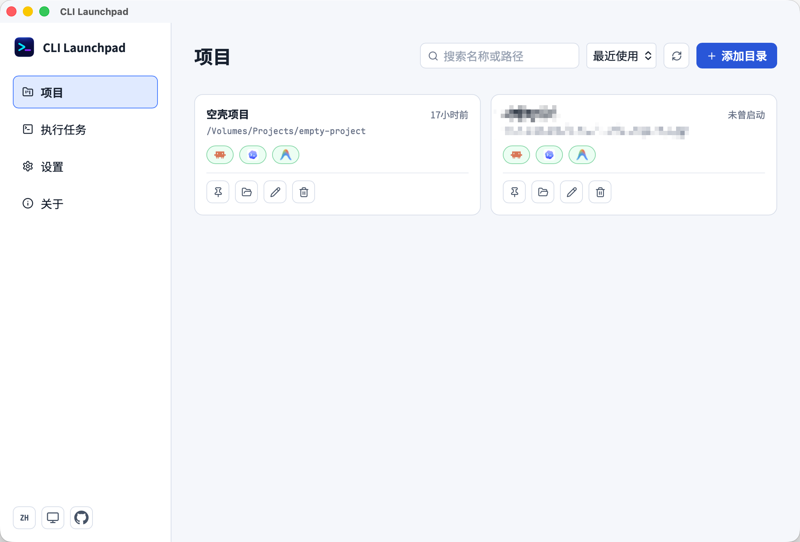
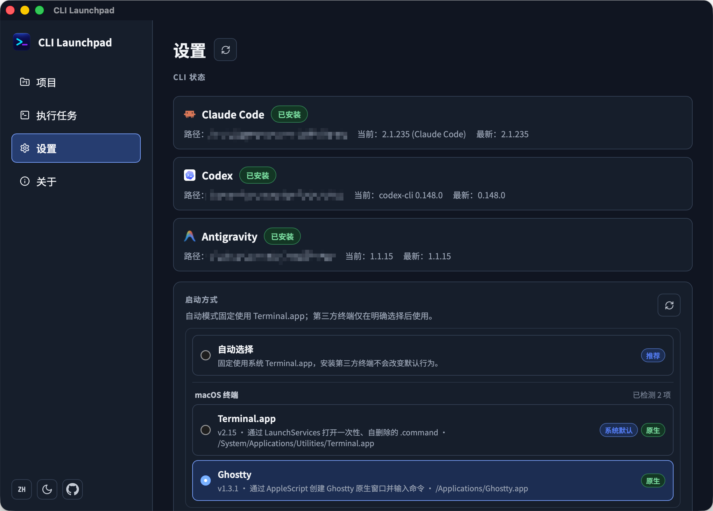
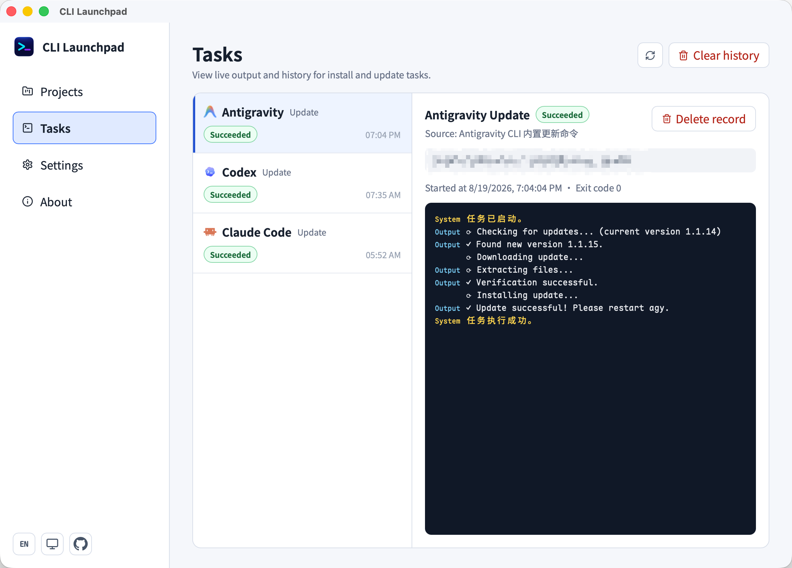

<div align="center">
  
  <h1>CLI Launchpad</h1>
  <p>面向 Claude Code、Codex 与 Antigravity 的轻量级跨平台 CLI 会话工作台；0.3.0 目标增加 Grok Build。</p>
  <p>
    <a href="https://github.com/SkyJourney/cli-launchpad/releases/tag/v0.2.4"></a>
    <a href="LICENSE"></a>
    <a href="https://github.com/SkyJourney/cli-launchpad/actions/workflows/release.yml"></a>
    
    
    
  </p>
  <p>
    <a href="CHANGELOG.md">变更日志</a> ·
    <a href="docs/product-requirements.md">产品需求</a> ·
    <a href="docs/architecture.md">架构设计</a> ·
    <a href="docs/roadmap.md">0.3.0 路线图</a>
  </p>
</div>

CLI Launchpad 0.2.4 管理常用本地项目，并帮助用户启动 Antigravity CLI、Codex CLI 或 Claude Code CLI。0.3.0 正在转型为以项目和内置终端会话为中心的轻量工作台，并通过独立里程碑接入 Grok Build。项目由 [SkyJourney](https://github.com/SkyJourney) 维护。

## 下载

正式版本由 Git Tag 触发 GitHub Actions，在全部目标构建成功后自动发布到
[GitHub Releases](https://github.com/SkyJourney/cli-launchpad/releases)。

发布产物统一使用 `CLI.Launchpad_<版本>_<系统>_<架构>[后缀]` 命名：

| 平台                | 文件名示例                                            | 说明                               |
| ------------------- | ----------------------------------------------------- | ---------------------------------- |
| Windows x64         | `CLI.Launchpad_<版本>_windows_x64-online-setup.exe`   | NSIS 在线安装包；按需下载 WebView2 |
| Windows x64 离线版  | `CLI.Launchpad_<版本>_windows_x64-offline-setup.exe`  | 内置 WebView2，体积较大            |
| macOS Apple Silicon | `CLI.Launchpad_<版本>_macos_arm64.dmg`                | 适用于 M 系列芯片                  |
| macOS Intel         | `CLI.Launchpad_<版本>_macos_x64.dmg`                  | 适用于 Intel 芯片                  |
| Linux x64           | `CLI.Launchpad_<版本>_linux_x64.{deb,rpm,AppImage}`   | 三种格式任选，适用于 x86_64        |
| Linux arm64         | `CLI.Launchpad_<版本>_linux_arm64.{deb,rpm,AppImage}` | 三种格式任选，适用于 ARM64         |

每个 Release 同时提供 `SHA256SUMS.txt`。当前 macOS DMG 使用 ad hoc 签名且未经过
Apple 公证；首次打开若被系统拦截，请在“系统设置 → 隐私与安全性”中确认允许打开。
Linux 的 AppImage 下载后需先自行添加可执行权限（`chmod +x`）才能运行。

## 界面预览

以下截图展示 0.2.x 版本界面；0.3.0 将采用项目导航与内置 PTY 终端组成的大窗口工作台。

### 项目与 CLI 启动

在常用项目之间快速切换，并直接启动 Claude Code、Codex 或 Antigravity。



### CLI 与终端管理

统一查看 CLI 安装和版本状态，并选择适合当前平台的终端启动方式。



### 执行任务与双语界面

安装与更新任务按 CLI 独立并行执行，提供实时日志、历史记录和完成 Toast；
同一 CLI 的任务仍保持互斥。界面支持简体中文与英文切换。



项目采用 Tauri 风格架构，参考 CC-Switch 的组织方式：

- React + TypeScript 负责桌面 UI。
- Rust/Tauri commands 负责文件系统访问、SQLite 读写和进程启动。
- SQLite 作为目录、工具、启动偏好和目录级参数的单一数据源。
- 系统托盘提供常驻入口；默认关闭主窗口时隐藏到托盘，可在设置中切换为退出应用。

正式运行的数据根目录为 `~/.cli-launchpad/`，当前业务数据库位于
`~/.cli-launchpad/data/cli-launchpad.db`。从早期版本升级时，应用会从
旧的 `%APPDATA%\dev.local.cli-launchpad\` 复制已有数据库并保留旧文件。

## 目标

- 将常用目录缓存在 SQLite 中。
- 在选中目录中一键启动配置好的 CLI 工具。
- 将终端启动偏好、全局 CLI 参数和目录专属 CLI 参数解耦。
- 保持桌面应用体积轻量，不引入 Electron 或服务端运行时。
- 在真正启动前，让用户可以预览最终命令。
- 通过托盘快速重新显示主界面，或显式退出应用。

## 技术栈

- Tauri 2
- React 19
- TypeScript
- Vite
- Rust
- rusqlite
- Windows Terminal Profile / PowerShell / CMD 分层回退集成
- Noto Sans SC 与 Maple Mono NF CN 内置字体

## 本地依赖

需要提前安装：

- Node.js
- pnpm
- Rust stable 工具链，推荐通过 rustup 安装

Windows 开发与打包还需要：

- Visual Studio Build Tools 2022
- MSVC C++ x64/x86 编译工具
- Windows SDK
- WebView2 Runtime

macOS 开发与打包还需要：

- Xcode 与 Xcode Command Line Tools
- Apple Silicon target：`rustup target add aarch64-apple-darwin`
- Intel target：`rustup target add x86_64-apple-darwin`

Linux 开发与打包还需要（以 Debian/Ubuntu 为例，其他发行版请替换为对应包管理器）：

```bash
sudo apt update
sudo apt install -y build-essential curl wget file \
  libxdo-dev libssl-dev \
  libayatana-appindicator3-dev librsvg2-dev \
  libwebkit2gtk-4.1-dev xdg-utils
```

若打包 AppImage 时提示 FUSE 相关错误，再安装 `libfuse2t64`（较新发行版）或 `libfuse2`（较旧发行版）——`linuxdeploy` 下载的 AppImage 打包工具本身以 AppImage 形式运行，需要 FUSE 才能直接执行。`xdg-utils`（提供 `xdg-open`）是 `tauri-plugin-opener` 的运行时依赖，打包时会校验是否存在，精简系统镜像上缺失会导致 AppImage 打包直接失败。

当前项目使用 pnpm 作为 Node 包管理器。不要混用 npm、yarn 或其他锁文件。

## 首次运行

安装 Node 依赖：

```powershell
pnpm install
```

启动 Tauri 开发环境：

```powershell
pnpm tauri dev
```

如果需要单独检查 Rust 依赖：

```powershell
cargo check --manifest-path src-tauri/Cargo.toml
```

## 打包说明

Windows 内部分发使用 NSIS，平台配置位于
`src-tauri/tauri.windows.conf.json`。打包命令：

```powershell
pnpm tauri:build:windows    # 在线版安装包
pnpm tauri:build:offline    # 离线版安装包（内嵌 WebView2）
pnpm build:installers       # 一次构建在线 + 离线两版，归档到 dist-installers/
```

Windows 产物与运行依赖：

- NSIS 安装包：`src-tauri/target/release/bundle/nsis/`；裸 exe：`src-tauri/target/release/`。
- **VC++ 运行库**：通过静态链接 CRT（`src-tauri/.cargo/config.toml` 的 `+crt-static`）编入 exe，目标机无需安装 Visual C++ Redistributable。
- **WebView2**：
  - 在线版（默认 `downloadBootstrapper`）：安装包小，安装时检测缺失则联网下载。
  - 离线版（`offlineInstaller`，见 `src-tauri/tauri.offline.conf.json`）：内嵌完整 WebView2，无网也能装（包体更大）。
- `build:installers` 复用 Tauri 产物名的 `{productName}_{version}_{arch}` 前缀，自动追加 `online`/`offline`，例如 `CLI Launchpad_0.2.3_x64-online-setup.exe`。

macOS 使用独立的 ARM64 与 Intel DMG，不生成 Universal 包：

```zsh
pnpm tauri:build:macos        # 当前机器原生架构，M 系列 Mac 上为 ARM64
pnpm tauri:build:macos:arm64  # Apple Silicon DMG
pnpm tauri:build:macos:x64    # Intel DMG
```

显式指定 target 后，DMG 分别输出到：

- ARM64：`src-tauri/target/aarch64-apple-darwin/release/bundle/dmg/`
- Intel：`src-tauri/target/x86_64-apple-darwin/release/bundle/dmg/`

Linux 一次性构建 deb、rpm、AppImage 三种格式：

```bash
pnpm tauri:build:linux
```

产物分别输出到：

- deb：`src-tauri/target/release/bundle/deb/`
- rpm：`src-tauri/target/release/bundle/rpm/`
- AppImage：`src-tauri/target/release/bundle/appimage/`

首次打包 AppImage 时，Tauri 会自动下载 `linuxdeploy` 及相关插件（需要联网），后续构建可复用缓存。

推送与应用版本一致的 `v*.*.*` Tag 后，`.github/workflows/release.yml` 会在线并行
构建 Windows 在线/离线 NSIS、Linux x64/arm64 deb+rpm+AppImage（arm64 使用 GitHub
原生 ARM64 Runner，不做交叉编译）与两种 macOS DMG，生成 SHA-256 校验文件，并在
全部 target 成功后自动创建 GitHub Release。手动触发该工作流只保留 Actions
Artifacts，不会创建 Release。

正式打包前确保 Windows 的 `src-tauri/icons/icon.ico`、macOS 的
`src-tauri/icons/icon.icns` 均已就位；Linux 复用 `src-tauri/icons/` 下现有的 PNG 图标，无需额外准备。签名、公证和真实 Intel Mac 验证仍属于正式发布前检查。

## 内置字体

应用不依赖系统安装字体，按内容用途使用两套开源字体：

- 全局 UI：Noto Sans SC，使用覆盖 100–900 的可变 TTF，并采用 400、500、600、700 四个主要字重。
- 命令、路径、参数和日志：Maple Mono NL NF-CN，使用相同四个字重并关闭连字。
- 字体文件随 Vite 前端产物进入 NSIS、DMG 与 deb/rpm/AppImage。
- 两套字体均采用 SIL Open Font License 1.1；来源和授权见
  `src/assets/fonts/noto-sans-sc/`、`src/assets/fonts/maple/` 与
  [THIRD_PARTY_NOTICES.md](THIRD_PARTY_NOTICES.md)。

## 应用更新

0.2.4 不包含 CLI Launchpad 自身的自动更新或后台更新检查。后续版本可基于
GitHub Releases 增加显式的版本检查，并在获得用户确认后再进入下载或安装流程。

## 许可证

CLI Launchpad 由 SkyJourney 以 [MIT License](LICENSE) 开源。内置字体不受项目
MIT License 覆盖，继续遵循各自的 SIL Open Font License 1.1。

## 项目结构

```text
docs/                         产品和架构说明
docs/milestones/               0.3.0 分阶段验收文档
src/                          React UI
src-tauri/                    Tauri/Rust 后端
src-tauri/migrations/         SQLite 迁移脚本
src-tauri/src/commands/       暴露给 UI 的 IPC commands
src-tauri/src/services/       业务逻辑
src-tauri/src/db/             数据库连接和仓储
src-tauri/src/platform/       平台相关启动逻辑
```

## 0.2.x 已有能力

- 目录增删改查。
- Antigravity、Codex 和 Claude Code 的工具配置。
- 终端与 Shell 自动探测、Profile 选择和分层回退。
- 命令预览。
- 一键启动终端会话。
- 三项 CLI 的会话历史、每次 10 条懒加载与安全恢复。
- 按会话 ID 设置本地别名，不同步普通会话到业务数据库。
- 三项 CLI 的启动模型选择与手动模型/部署名。

## 0.3.0 工作台目标

- 在大窗口工作台中按项目导航和切换 CLI 终端。
- 在应用内 PTY 中运行 Claude Code、Codex、Antigravity 和 Grok Build CLI。
- 0.3.0 目标通过独立 G1 里程碑增加 Grok Build CLI（`grok`）。
- 每个 PTY 独立归属项目和工具；CLI 对话可选关联。
- 支持多终端标签和分栏，布局预设只记录排列方式，不拥有或终止终端会话。
- 保留会话历史与恢复、安装更新、执行任务、配置备份和桌面能力；会话历史支持基于可重建本地 metadata 索引的项目内搜索。

分阶段范围和验收条件见 [0.3.0 路线图](docs/roadmap.md) 与 [里程碑文档](docs/milestones/0.3.0/README.md)。
