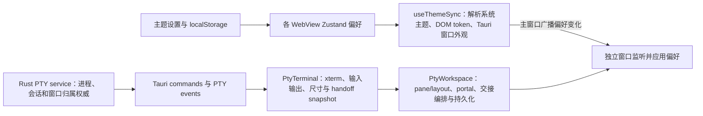

# G4：主题、生命周期与适配边界治理

**状态：** 已完成（2026-10-02；G2、G3 前置通过；G4 自动门禁、代码审查和五类 Windows 实机验收通过）
**所属版本：** 0.3.0
**依赖：** M2、M3、G2 Windows 实机验收、G3 Windows 实机验收
**后续依赖：** M4、M5

## 目标

在 G2、G3 的 Windows 实机验收通过后，对现有工作台做一次以稳定边界为中心的渐进重构。目标是让主题状态、PTY/独立窗口生命周期、工作区视图职责和 CLI 适配契约有清楚且可测试的归属，使后续接入或调整能力时只需扩展相应边界，不影响应用其余部分；同时审查并收敛 G3 全局样式变量矩阵与 CLI 适配器模式中的残留代码。

G4 只整理现有能力与内部结构，不改变已验收的产品行为、CLI 命令语义、PTY 所有权、窗口交接、布局数据或用户数据格式。每项迁移都必须保持旧行为，并能独立审查与回退。

## 前置条件与实施约束

- [x] G2 Windows CLI 实机验收完成并由用户确认（2026-10-02）；G3 主窗口和独立窗口实机验收完成并由用户确认（此前已确认）。
- 首先建立当前实现、状态来源、事件入口和失败恢复的基线图；确认事实后再确定模块边界，不以本规划替代代码审查。
- 每个阶段先固定旧行为和回归场景，再移动实现。不得一次性重写 PTY、独立窗口或适配器体系。
- Rust PTY service 是 PTY 进程和会话状态的权威所有者；前端协调器管理显示、交接请求与视图状态，不得建立第二份进程状态真相。
- CLI 仍限定为 `claude`、`codex`、`agy`、`grok`、`hermes` 五项。适配器是内建架构边界，不是运行时插件系统。
- 主题偏好属于设备本地 UI 状态；G4 不将其迁入业务 SQLite，也不改变既有设置备份/导出格式。
- G4 包含对 G3 全局样式变量矩阵和既有 CLI 适配器模式的收敛审查：删除确认无用的变量/辅助函数，补足必要的语义 token 与注册契约检查；第三方组件 props、品牌资产、终端 ANSI/日志专属色等保留项必须有明确分类，不作机械替换。

## 目标架构

### 主题与跨窗口同步

- 主题偏好使用 `system` 或已注册的主题标识表达；当前内建浅色与深色主题继续可用。
- 语义 token 集中定义背景、表面、文字、边框、交互状态、危险/成功/警告状态及窗口控件颜色。组件只消费 token，不自行复制浅色/深色颜色值。
- 每个主窗口和独立终端窗口内均有轻量主题控制层，负责读取偏好、解析系统主题、应用 CSS token 和同步当前原生窗口外观。
- 偏好修改通过明确的应用内跨窗口事件同步；事件接收方更新本地解析状态和窗口外观，不回写或再次广播形成循环。新打开的窗口启动时立即读取最新偏好，不能依赖它恰好收到历史事件。
- 主题定义为后续新增内建主题或用户主题配置保留稳定的 token/解析扩展点；主题编辑器、主题文件导入和用户自定义主题存储不属于 G4。
- 审查全局样式变量矩阵的覆盖和使用：每个应用级 token 必须有实际消费者或有记录的设计理由；清除确认无引用的遗留 token；组件不再复制主题分支中的裸色值。第三方库 API 必需的自定义 CSS 属性、品牌图标、终端 ANSI 色与日志专属配色列为有界例外。

### PTY 与独立窗口生命周期

- 维护 Rust 权威会话状态与前端交接/呈现状态的边界图，分别列明命令、PTY 事件、窗口事件、超时与重试的来源。
- 将可纯函数表达的合法状态转换、终态判断、交接冲突和过期事件处理集中为显式状态模型；副作用（Tauri 事件、PTY attach/detach、定时器、窗口 destroy）由协调层执行。
- 对 attach、独立窗口 ready、返回请求、返回成功/失败、自然退出、窗口 close、超时和重复/乱序事件规定幂等行为。
- 继续复用已验收的共享会话监测与关闭逻辑；单个窗口故障只能影响对应 PTY/窗口，不影响其它 CLI、主进程或其他独立窗口。
- 不改变 PTY 的创建、终止、缓冲、尺寸传播、窗口归属和历史恢复语义。

### 工作区与终端视图职责

- 将 `PtyWorkspace` 现有逻辑按职责识别为工作区状态/持久化、窗口交接协调、窗格/标签视图、拖放与菜单交互、布局预设入口；先绘制依赖图，再按实际耦合切分。
- 将 `PtyTerminal` 中的 xterm 实例、尺寸适配、PTY 事件与输入交互分成可管理的边界；React 视图仍负责呈现，Rust service 仍拥有 PTY 进程。
- Provider/context 的公开接口只保留 UI 所需操作和只读状态；内部异步资源应有明确创建者、清理者和终态。
- 拆分以降低职责耦合为验收目标，不以文件数减少、抽象层数量或纯目录重排作为完成标准。

### CLI 适配契约

- 逐项审查 Rust/前端适配器的能力、默认实现、异常降级和平台差异；每个适配器缺省能力必须安全失败或返回不完整结果，不能伪造“无会话/无更新”等成功事实。
- 校验 `ToolKey`、Rust adapter registry、前端 adapter metadata、图标/标题、数据库允许值和相关测试之间的一致性，并为新增内建 CLI 形成明确接入契约。
- 在 Rust、TypeScript、SQLite 多语言边界内减少可安全消除的重复注册；若无法形成单一编译期事实源，则保留显式注册并通过穷尽性检查和契约测试检测漂移。
- 保留每 CLI 查询错误隔离、安装/更新任务按 CLI 互斥、跨 CLI 并行、适配器 panic/JoinError 隔离和共享生命周期所有权。
- 完成适配器残留代码审查：确认并清除无调用方的旧 helper/重复分支；检查默认能力是否会把未知、失败或未实现误报为空列表/无更新；保留确实必要且有调用方的共享逻辑。
- 不引入动态插件发现、自定义 CLI 配置、运行时加载代码或新的通用命令执行入口。

## 范围

### 本里程碑包含

- 主题偏好、系统主题解析、跨 WebView 同步、CSS token 与原生窗口外观的职责边界。
- PTY/独立窗口交接和终止相关状态转换、异步资源与错误恢复的可测试整理。
- 工作区与终端 React 组件的渐进拆分，以及必要的内部接口调整。
- 五个 CLI 的适配器能力审查、注册契约、穷尽性检查和错误隔离校验。
- 全局样式变量矩阵与 CLI 适配器模式的遗留清理记录：无未解释的无用 token/helper、无掩盖能力缺失的默认成功实现，所有保留例外均有理由。
- 与实现一致的架构、主题、生命周期和里程碑进度文档更新。

### 本里程碑不包含

- 不改变 G2/G3 已验收的界面、交互、CLI 命令、终端布局或窗口生命周期。
- 不建设主题编辑器、主题市场、主题导入/导出或远程主题服务。
- 不建设通用 CLI 插件系统，也不增加第六项 CLI。
- 不重新设计 PTY Rust 后端、进程树终止策略、SQLite 布局 schema、会话索引格式或业务数据迁移。
- 不修改当前设置页、侧栏、会话搜索或安装/更新功能的产品流程；仅允许为维持既有行为调整内部边界。
- 不在 G4 阶段完成 macOS/Linux 实机窗口与 CLI 验收；继续由 M5 负责。

## 分阶段计划

### 阶段 0：验收后基线与边界图

1. 核对 G2/G3 用户验收记录、当前分支差异、未提交内容和现有自动化覆盖；验收未通过的缺陷先回到对应里程碑修复。
2. 绘制主题状态来源及跨窗口数据流；绘制 PTY owner、React terminal、工作区 provider、独立窗口的状态和事件流。
3. 列出工作区/终端大型组件职责及实际依赖；列出五个 CLI 从 ToolKey 到 Rust/前端适配器和 SQLite 的注册点。
4. 为每条重构路径列出可观察的行为基线、失败场景、最小迁移单元和可回退边界；生成全局样式 token 使用/未使用清单，以及 Rust、TypeScript、SQLite、IPC 适配器注册点对照表。

**验收：** 状态所有权无歧义；没有依赖 G2/G3 未验收行为的隐含假设；每项结构调整都有现有行为和失败场景覆盖计划；样式 token 和 CLI 注册残留均有可复核清单。若现状与本规划冲突，先修订设计并确认后再编码。

#### 阶段 0 基线记录（2026-10-02）

- 主题来源是 `src/store/appStore.ts` 的设备本地 `localStorage` 偏好；`src/hooks/useThemeSync.ts` 解析 `system`、设置 DOM 色彩方案和 Tauri 当前窗口 theme。主窗口广播 `theme-mode-changed`，独立窗口监听。事件不保留，新窗口依赖各自 WebView 启动时读取本地偏好；M4 前重点补齐监听建立后的主窗口权威状态回读，避免存储分区差异或启动竞态。
- Rust PTY service 继续拥有进程、会话序号/输出与窗口归属；`PtyTerminal` 管理 xterm、输入输出、resize、快照及 attach/detach 命令；`PtyWorkspace` 管理 pane/layout 状态、session portal、主窗口与 detached window 的消息、等待与销毁副作用。`StandalonePtyWindow` 处理子窗初始化、关闭保护和返回请求。当前纯状态 helper 位于 `src/lib/ptySessionLifecycle.ts`，涵盖 pending exit、失败时窗口动作和终止条件；其余交接转换仍在协调组件中。
- `PtyWorkspace.tsx` 与 `PtyTerminal.tsx` 均为大型组件；拆分边界优先选择 workspace 内 session portal/终端视图承载，不改变 PTY 创建者、portal DOM 所有权、终端焦点/尺寸与交接副作用。
- 适配器注册事实：Rust `ToolKey` 枚举/`ALL`、`cli_adapters::get()` 穷尽 match；TypeScript `ToolKey` 联合类型、`CLI_ADAPTERS: Record<ToolKey, ToolMeta>` 与展示顺序；SQLite 的历史迁移 CHECK 值；Tauri IPC 参数类型与命令；每个适配器的历史能力。它们分属不同语言/迁移边界，不能安全共用单一生成源，采用各自编译穷尽检查和跨边界契约测试。
- 已确认待收敛项：`emptyToolMap()` 无调用者；`font-size-heading` 无样式引用；Rust 适配器未实现 `list_sessions`/`session_belongs_to_directory` 时默认成功返回空事实；前端展示列表重复手写注册顺序。Sonner 的 `--width`、`--border-radius`、状态色与 close-button 变量，及 Allotment 的 focus/separator/sash 变量由第三方运行时按协议读取，属于需明确记录的消费例外；品牌图标、xterm ANSI palette 与日志 palette 同样不属于应用语义色 token。
- 回归行为固定：五 CLI 顺序和标题/图标；缺失或损坏历史来源保持来源级不完整/错误，不影响其他 CLI；布局/portal DOM 不因 React 拆分卸载 PTY；主题变化只让主窗口广播，独立窗口应用时不反向广播。

#### 阶段 0–4 实施进度（2026-10-02）

- [x] 阶段 0 基线：确认主题偏好保存在 Zustand/localStorage、Rust PTY service 拥有会话真相、工作区负责呈现/交接协调；完成 CSS token 消费者、适配器注册点及旧 helper 盘点。
- [x] 阶段 1 实现切片：抽出主题模式校验/解析纯函数；独立窗口建立变化监听后请求主窗口当前主题，主窗口只向合法的 `terminal-*` 窗口标签定向回复；增加主题解析单测。移除无引用 `--font-size-heading`，增加终端专属背景/文字/选区/滚动条 token，并让关闭控件与空终端提示使用语义 token。
- [x] 阶段 2 实现切片：抽出 detached window 的 instance/session/window 身份三元匹配纯函数，所有 ready/failed/returned/exited 入口共用并有过期身份测试；未重写完整交接状态机，跨窗失败/超时及真实 PTY 行为仍待阶段 5 完整复核与手工验收。
- [x] 阶段 3 实现切片：将工作区 PTY 注册区、portal 与恢复占位组件迁入 `WorkspacePtySessionRegistry`；将 PTY fit 上界、输出事件处理、剪贴板空文本识别和 renderer 恢复迁入 `ptyTerminalRuntime`。将项目列表现有覆盖式滚动条收敛为复用的 `ThemedScrollArea`，并接入项目上下文长内容区；全局原生滚动条采用相同主题色、透明轨道和 6px 规格。PtyWorkspace 的布局和 handoff 编排及 PtyTerminal 的 xterm/会话创建保持原所有权；本轮不宣称整个组件拆分阶段已经完成。
- [x] 阶段 4 实现切片：前端工具展示顺序由穷尽 `CLI_ADAPTERS` 派生，Rust `ToolKey::ALL` 增加序列化 round-trip 检查；移除未使用的 `emptyToolMap` 与错误默认空历史 helper，Rust adapter 未实现历史读取/归属检查时明确返回错误。
- [x] 全局 token 静态引用审计：对 `src/styles.css` 中每个自定义属性检查整个 `src/` 的使用；唯一没有应用层二次引用的属性是第三方协议变量。Sonner 例外为 `--border-radius`、`--normal-*`、`--success-*`、`--info-*`、`--warning-*`、`--error-*` 与三个 `--toast-close-button-*`；Allotment 例外为 `--focus-border`、`--separator-border`、`--sash-size`、`--sash-hover-size`。这 23 项由第三方组件读取，均映射到语义 token 或组件规格；全局原生滚动条与覆盖式滚动条共用主题色变量。品牌素材、xterm ANSI palette 和执行日志 palette 是独立资源/内容色，不属于 UI token 缺项。确认无引用的 `--font-size-heading` 已删除。
- [x] 阶段 1–4 全范围复审：对照主题同步、PTY 生命周期与失败恢复、组件边界、SQLite/IPC 注册漂移及全局 CSS/适配器残留逐项复核；详见下方门禁与最终审查记录。

#### 五 CLI 适配能力对照

| ToolKey       | 检测命令 / 恢复参数                                               | 历史事实来源                            | 前端标识 / 专属状态                                           |
| ------------- | ----------------------------------------------------------------- | --------------------------------------- | ------------------------------------------------------------- |
| `claude`      | `claude` / `--resume <id>`                                        | Claude 项目历史文件与 index             | Claude Code / `CC`；版本更新状态；粘贴走剪贴板                |
| `codex`       | `codex` / `resume <id>`                                           | App Server，有限 rollout metadata 回退  | Codex / `CDX`；版本更新状态；Ctrl+V 送入终端控制码            |
| `antigravity` | `agy`（主命令）、`antigravity`（兼容探测）/ `--conversation=<id>` | Antigravity 本地 summary SQLite         | Antigravity / `AGY`；版本更新状态                             |
| `grok`        | `grok` / `--resume <id>`                                          | 官方本地 summary metadata               | Grok Build / `GB`；更新来源验证与终态后刷新                   |
| `hermes`      | `hermes` / `--resume <id> --no-restore-cwd`                       | 当前有效 home/Profile 的只读 `state.db` | Hermes Agent / `HA`；branch-update；受限于 Windows 的托管更新 |

Rust command/history/version/platform 实现位于 `src-tauri/src/services/cli_adapters/<tool>/`，前端图标、名称、粘贴、安装效果和展示状态位于 `src/lib/cliAdapters/<tool>.ts`。Rust `ToolKey`/registry、前端 `ToolKey`/穷尽 `Record`、SQLite 迁移值和 Tauri command DTO 属于不同编译/迁移边界，不合并为生成文件；由 Rust enum round-trip、SQLite 约束契约测试及前端 registry 测试分别检测，并在最终复审对照。本表只记录 Windows 阶段已实现行为，macOS/Linux 专属差异和真机验证仍只记在 M5。

**最终自动门禁（2026-10-02）：** 前端 81 项测试通过；`pnpm run build` 通过（Vite 保留主 bundle 超 500 KB 提示）；Rust 214 项测试、`cargo check --manifest-path src-tauri/Cargo.toml`、`cargo fmt --check --manifest-path src-tauri/Cargo.toml` 通过（Windows 下保留 macOS 专用字段未使用告警）；本阶段修改文件 Prettier 检查和 `git diff --check` 通过。全局组件 CSS 裸色及 token 消费审计完成；项目列表与项目上下文复用 `ThemedScrollArea`，原生滚动条使用相同主题滑块 token。最终复审发现并修复 xterm 画布未监听主题 token 的问题，修复后的完整自动门禁再次通过。Vite bundle 与平台专用字段告警均为已记录的非阻断项。

### 阶段 1：主题控制层与语义 token

1. 定义主题标识、主题偏好、解析结果和语义 token 契约，区分用户偏好 `system` 与最终应用的浅/深主题。
2. 抽离主题控制层，统一处理偏好加载/写入、系统方案变化监听、DOM token 应用和 Tauri 当前窗口 theme API。
3. 设计并实现跨窗口主题偏好同步：新旧窗口、多个独立窗口同时存在时均一致；处理重复事件、无效 payload、窗口初始竞态及监听清理。
4. 将自定义标题栏及其悬浮、关闭、禁用颜色纳入语义 token；扫描其他 UI 是否存在应属于主题却硬编码的颜色，只迁移主题相关 UI 颜色，不改品牌图标、终端 ANSI 色或日志样式。
5. 为后续主题定义扩展保留注册边界，但本阶段只提供现有浅色、深色和系统跟随模式。

**验收：** 主窗口切换浅/深/系统后，已经打开的所有独立终端窗口同步更新；系统主题变化时所有窗口同步；新打开窗口正确读取当前偏好；不出现事件回环、状态闪回、重复监听或原生标题栏外观不一致。当前 UI 色值不再以局部深浅主题分支复制。

### 阶段 2：PTY 生命周期模型与故障边界

1. 根据基线图确定 Rust 会话状态与前端交接状态的权威边界，不把窗口存在、终端 UI 挂载或最后一次事件当成 PTY 仍运行的唯一证据。
2. 建立可读的转换模型/纯函数，集中终态、运行态、交接中、过期 instance/token、重试和幂等判断。
3. 让主工作区协调层与独立窗口协调层分别执行副作用；复用共同的会话状态解释，不把两个窗口的显示/关闭动作错误地合并为一个有副作用的函数。
4. 对事件监听、超时器、异步初始化、窗口销毁和 PTY attach/detach 明确资源所有权与取消/清理规则。
5. 对照已经确认的 bug 场景验证 CLI 正常退出、窗口关闭、返回工作区、跨窗拖入和状态查询延迟。

**验收：** 状态转换具备可枚举输入/输出；重复、乱序和延迟事件不会造成重复标签、重复上报、窗口卡死、PTy 被错误终止或错误重新归属；一个 CLI/独立窗口的异常不能阻塞其余会话。真实 PTY 生命周期行为与 G2/G3 验收一致。

### 阶段 3：工作区组件渐进拆分

1. 按阶段 0 的依赖图确定先拆 Provider/服务协调，还是先拆展示子树；一次只移动一个职责边界。
2. 先将纯展示的窗格/标签/菜单逻辑从状态和 Tauri 事件协调中分离；稳定 context API 后再考虑拆分窗口 handoff controller。
3. 将 xterm 创建/销毁、FitAddon 尺寸更新、PTY 事件和交互处理按实际所有权拆分为小型 hook/helper 与呈现组件。
4. 保持 Allotment 的分栏树、pane 编号、比例保存/恢复、活动标签、焦点、DND 和隐藏堆叠规则不变。
5. 每一小步运行针对性回归并对比行为；不以整文件搬移代替架构拆分。

**验收：** UI 组件不直接成为 PTY 进程所有者；一个 UI 子树卸载不会误关会话；xterm resize、输入焦点、拖动和 pane 生命周期行为保持一致；每个新增模块只有一个清楚职责及依赖方向。

### 阶段 4：CLI 适配契约与注册漂移检查

1. 绘制每项 CLI 的平台探测、安装/更新计划、版本状态、启动/恢复参数、历史来源、搜索索引和图标/标题能力矩阵。
2. 检查适配器缺省能力与服务层降级，确保空列表、未知状态、查询失败和来源不完整不被混为同一语义。
3. 评估 ToolKey 与数据库值跨 Rust/TypeScript/SQLite 的重复定义；只在能保持编译安全、迁移兼容和可审查性的情况下统一来源。
4. 增加或调整契约检查，确保每个 ToolKey 恰好注册一次，CLI 图标/标题/能力映射齐全，数据库与序列化支持一致；测试缺少任意注册项和适配器失败时的隔离行为。
5. 更新新 CLI 接入清单，记录哪些变化仍需数据库迁移、平台实现、资源/图标来源审查与版本兼容处理。

**验收：** 五个 CLI 在全部注册点一致且可验证；添加一个新 ToolKey 时缺项会在编译或自动门禁中失败；某个 CLI 的适配器错误不导致其他 CLI 查询、PTY 或会话搜索失败；未引入通用插件系统。

### 阶段 5：完整审查、门禁与用户验收

1. 对照本文件审查状态真相、跨窗口事件、错误恢复、异步清理、适配器失败隔离和 UI 生命周期。
2. 修复审查发现并复审受影响路径；新问题持续闭环。
3. 重跑全部计划门禁，确认结果来自最后一次代码修改之后。
4. 完成 Windows 用户手工复验；Windows 主机可执行的共享类型/schema 检查在 G4 运行，macOS/Linux 专属配置和目标平台编译/实机门禁统一列入 M5。
5. 更新架构文档、G4 实施记录和索引状态；只有必需门禁与用户验收均通过才能标记 G4 完成并解除 M4 的前置。

## 测试覆盖与验收门禁

### 架构与自动门禁

- [x] G2、G3 Windows 用户验收记录已明确通过，G4 实施范围没有遗留或借入对应里程碑缺陷。
- [x] 主题偏好解析覆盖 `system`、浅色、深色、无效/缺失偏好及系统主题变化；窗口级 token 与 Tauri 原生主题策略一致。
- [x] 跨窗口主题同步逻辑完成代码审查，用户确认主/独立窗口主题同步通过；主题事件监听有异步初始化竞态防护和卸载清理。
- [x] 语义 token 对浅色、深色和控件交互状态完整；组件 CSS 裸色扫描通过。品牌图标、终端内容和日志专属颜色均有明确边界。
- [x] 全局样式变量矩阵完成静态使用审计：应用级 token 均被消费；确认无用的 `--font-size-heading` 已清理；Sonner、Allotment、品牌、ANSI 与日志配色例外已按阶段记录分类。最终复审确认无组件级裸色残留。
- [x] PTY 生命周期 helper 覆盖退出状态、终止条件、独立窗口失败决策及过期/错配身份；Rust service 仍是会话状态真相，用户确认正常返回、关闭和窗格交互通过。
- [x] 生命周期副作用经最终代码复审及用户实机验收：事件监听、超时、异步初始化、窗口关闭和返回流程保留单一所有权；无已知遗留监听或失管 PTY。
- [x] 工作区拆分后布局水合/保存、比例、pane、焦点、标签、堆叠、DND 和独立窗口回归由现有自动测试与用户实机验收覆盖。
- [x] 终端拆分后输入输出、启动、焦点、fit/resize、视口、终态、剪贴板、恢复和独立窗口交接由现有自动测试与用户实机验收覆盖。
- [x] CLI 能力矩阵与五项 CLI 注册一致；Rust 序列化、SQLite 允许值及前端穷尽注册测试通过，未实现能力安全失败。
- [x] CLI 适配器残留审查完成：Rust `ToolKey`/`ALL`/序列化与反序列化/registry、TypeScript `ToolKey`/`CLI_ADAPTERS`/`TOOLS`、SQLite 允许值、IPC 入口与契约测试一致；无已知未使用 helper 或重复旧路径；缺失能力不会被伪装成成功空结果。
- [x] 数据库迁移、序列化格式、PTY 命令参数、CLI 官方安装/更新语义及任务并发语义没有未计划变化。
- [x] `pnpm exec prettier --check`（本阶段修改的文件）、`pnpm run test`、`pnpm run build`、`cargo fmt --check --manifest-path src-tauri/Cargo.toml`、`cargo test --manifest-path src-tauri/Cargo.toml`、`cargo check --manifest-path src-tauri/Cargo.toml` 和 `git diff --check` 通过。
- [x] 最终代码审查的 P1/P2 问题已修复并复审；仅保留一项需用户对修复后运行中 xterm 主题更新作定点确认的事项。

### Windows 手工验收

- [x] 主窗口与独立窗口主题同步通过用户实机验收；浅色/深色及系统跟随主题符合预期。
- [x] 项目列表与项目上下文滚动区不预留滚动条宽度，静止时隐藏、滚动时显示并淡出；滑块可拖动，主题配色统一。
- [x] 独立窗口返回工作区与关闭通过用户实机验收。
- [x] 窗格与终端交互通过用户实机验收。
- [x] 会话历史通过用户实机验收。
- [x] 最终复审修复：内嵌终端通过既有窗格/终端实机验收；`PtyTerminal` 在根节点主题变化时更新 xterm 画布背景、文字与选区颜色，并在卸载时清理监听。独立窗口主题同步已通过实机验收；用户说明其独立窗口验收场景无法单独观察画布绘制内容，因此不将独立窗口画布设为额外视觉门禁，两种窗口复用同一终端实现。
- [x] 记录验收环境：Windows 11 专业版 10.0.26300 x64；用户于 2026-10-02 确认上述五类验收通过。CLI 版本和窗口数量未单独记录；macOS/Linux 由 M5 单独记录。

### 最终门禁

- [x] G2 和 G3 Windows 实机验收前置已满足（用户确认）。
- [x] 自动门禁、最终代码审查和 Windows 手工验收全部通过；G4 完成。
- macOS/Linux 专属配置、目标平台编译、真机窗口/主题/CLI 验收属于 M5；G4 仍运行当前主机可执行的共享类型、迁移/schema 与静态配置检查，M5 不得省略未能在 Windows 执行的目标门禁。
- G4 未通过时，M4 不得以“G4 已完成”为前提开始依赖性集成；若用户需要并行实施 M4，必须重新评估并记录重叠改动风险。

## 风险与处理

| 风险                                                       | 处理                                                                                                 |
| ---------------------------------------------------------- | ---------------------------------------------------------------------------------------------------- |
| 样式变量和适配器注册存在已验收阶段遗留，继续叠加会扩大漂移 | G4 阶段 0 建立完整引用与注册点清单，按证据清理并以契约检查防回归。                                   |
| 主题事件在新窗口启动期间丢失或重复                         | 事件只用于偏好变化通知；每个窗口启动仍读取持久化偏好，事件接收不回写广播，并测试初始化竞态。         |
| 前端状态机与 Rust PTY 真相发生分叉                         | Rust service 保留进程/会话权威；前端只管理窗口交接与视图生命周期，所有跨窗口动作最终回查 Rust 状态。 |
| 组件拆分改变 React 挂载顺序，导致 xterm 重建或隐藏 PTY     | 一次迁移一个边界；保持 portal/session 容器归属；覆盖输入、尺寸变化和交接回归。                       |
| 为“新 CLI 只加适配器”过度设计跨语言注册表                  | 先查是否有稳定的编译期共享方案；无法安全生成时采用穷尽注册与契约测试，不引入动态插件。               |
| 一次性扫描/替换所有颜色损害图标或终端配色                  | 只抽象属于应用 UI 语义层的颜色，保留第三方品牌资产、终端 ANSI 和执行日志专属 palette。               |

## 交付物

- 本 G4 规划、状态/事件边界、实施顺序、非目标、风险与验收门禁。
- 经过用户验收后实施的主题控制层和跨窗口同步机制，及其语义 token 契约。
- 经纯状态转换/资源所有权审查后的 PTY 与独立窗口协调边界。
- 渐进拆分后的工作区与终端组件及其回归验证。
- 五个 CLI 的能力矩阵、适配器接入契约和注册一致性门禁。
- 全局样式变量矩阵及 CLI 适配器模式的代码审查、遗留清理和复审证据。
- 最终代码审查结果、自动门禁证据、Windows 手工验收记录和后续跨平台事项。
