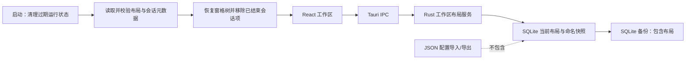

# M3：会话与工作区布局持久化

## 状态

**Windows 阶段已完成。** 阶段 0–7 的实现、审查闭环、最终自动门禁和 Windows 实机验收均已完成；macOS/Linux 实机对齐按 M5 跨平台发布门禁执行。前置里程碑 M2、G1 均已验收完成。

### 阶段 2 实施记录

- 当前布局支持读取、显式重置和原子保存；revision 只接受更大的版本，延迟到达的旧自动保存不会覆盖新状态。对未知版本或损坏 JSON，读取返回需要显式重置状态，普通保存拒绝覆盖原始数据。
- 命名布局支持列表、读取、创建、覆盖、重命名和删除；名称唯一且最多 64 字符，数量不超过 100。损坏的单条快照仍可从列表中删除。
- 布局读取按 slot 返回项目和 PTY 状态；项目整数 ID 与路径快照交叉校验，PTY session UUID 再校验项目、路径和 CLI。项目重命名会刷新项目快照名称；失效引用保留为独立状态，不会阻断其他 slot。
- 应用快照命令只生成布局应用计划：合并当前仍运行或尚未分配 PTY ID 的主工作区 slot、去重会话、把快照外运行会话追加到最前方窗格、保留 detached slot 元数据但将其排除在 pane tree 之外，并移除已结束会话引用而保留窗格树。它不写当前布局，也不调用 PTY 创建、终止或交接接口。
- Tauri IPC 已注册，且仅在数据库迁移和上次运行 PTY 状态清理完成后对前端开放；前端 hydration 与自动保存在阶段 3 接入。
- 阶段验证：`cargo fmt --manifest-path src-tauri/Cargo.toml -- --check`、`cargo check --manifest-path src-tauri/Cargo.toml`、`cargo test --manifest-path src-tauri/Cargo.toml` 均通过；Rust 全量测试 182 项通过。`pnpm exec prettier --check`（本阶段相关 Markdown）及 `git diff --check` 通过。编译保留一个既有警告：`LaunchCandidate.requires_macos_command_document` 尚未使用，与 M3 无关。

### 阶段 3 实施记录

- 工作区在恢复完成前保持只读等待态；读取失败时不挂载 PTY 注册表并提供重试，未知版本或损坏布局暂停自动保存，只有用户确认重置后才建立新布局。
- 恢复递归窗格树、窗格序号、标签顺序、焦点、标题和分栏比例；上次留在独立窗口的会话项恢复时移除，原窗格树保持不变，不自动启动 CLI。
- 窗格树、会话 slot、焦点和 detached slot 变化进入单一串行保存队列；保存请求合并最新快照并按 revision 顺序执行。新 slot 会在 PTY session ID 返回前先保存。
- 分栏拖动期间最多每 500 毫秒保存一次，松开时立即提交最终比例；组件卸载时补入最新快照并冲刷队列。保存失败只显示诊断，不阻塞终端交互。
- 阶段复核：修正已结束会话恢复后残留占位标签的问题；当前布局和命名布局应用计划均移除已结束 slot，同时保留 pane/split ID、编号、比例和焦点。失效项目或会话身份仍保留诊断占位项。新增前端和 Rust 回归覆盖空窗格保留及在指定 pane 恢复历史会话。
- 阶段门禁：阶段 3 当时 `pnpm test` 45 项通过；Rust 185 项通过；`pnpm run build` 通过（保留既有主 bundle 超过 500 kB 提示）；Prettier 检查、Rust 格式检查和 `git diff --check` 通过。Windows 重启恢复、分栏比例和损坏布局重置的实机验收已由用户确认通过。

### 阶段 4 实施记录

- 中央工作区固定工具栏提供命名布局保存、列表、应用、重命名、覆盖和删除；覆盖与删除均需二次确认，布局名称遵守 64 字符限制。
- 应用布局前将当前窗格、slot、PTY 身份和独立窗口身份交给 Rust 生成合并计划。当前 React 状态应用计划后继续自动保存；重复应用按 slot/session 去重，失效引用保留占位，已结束会话移除但空窗格保留。
- 快照外仍运行的主工作区会话优先保留原窗格：按稳定 pane ID 匹配，未匹配时按窗格编号匹配，目标布局没有对应窗格时放入目标焦点窗格。独立窗口中的运行会话保持独立，不加入 pane tree，也不发送交接事件；若命名快照引用该 slot，则删除快照 pane tree 中的引用，防止重复呈现。其 slot 和项目/CLI 序号仍保留。
- 设置页按钮统一采用紧凑尺寸；最近启动记录和数据恢复历史的标题、辅助信息及操作按钮同步缩小。
- 主窗口继续使用 `tauri-plugin-window-state` 持久化大小和位置；插件恢复后读取显示器物理工作区与窗口外框/客户区差值，优先放回重叠面积最大的工作区，完全离屏时使用主显示器。窗口尺寸超出工作区时缩小并校正坐标，小屏临时降低最小尺寸；最大化和全屏交由系统保留。
- 最终审查发现并修复两处状态边界：重命名已不存在的布局时会误报成功；应用布局等待 IPC 期间工作区若发生变化，旧计划可能覆盖新操作。现在校验重命名结果，并在树、会话列表、焦点或独立窗口集合发生变化时拒绝应用过期计划。新增回归测试覆盖该状态版本校验；修复后复审未发现未处理的阶段级问题。
- 后续复验发现两项需要修正的边界：应用命名布局时独立窗口会话被移回窗格；CLI 在独立窗口接管竞态中退出时，退出事件可能先于接管元数据到达并留下无法关闭的窗口。现已调整布局合并规则、补充接管退出状态合并和待接管窗口退出清理；独立会话继续计入项目级 CLI 序号。独立窗复用 `PtyTerminal` 的会话状态变化，退出后先通知主工作区清理 slot，再直接销毁窗口；Rust 权威归属查询仅用于关闭/返回竞态，不做周期轮询。Rust 无法投递退出事件时会记录诊断日志。
- 阶段 4 定向 Windows 验收：用户确认独立窗口关闭和“返回工作区”均正确；PTY 自然退出后自动返回窗格，终端仍可交互，没有重复标签或僵尸窗口。命名布局不会把独立会话移回窗格，独立会话继续参与项目级 CLI 序号计数。
- 阶段 4 自动回归：`pnpm test` 57 项、`cargo test --manifest-path src-tauri/Cargo.toml` 196 项通过；Rust 格式与编译、生产构建、变更文件 Prettier 和 `git diff --check` 通过。生产构建保留既有主 bundle 超过 500 kB 提示；Rust 保留一个既有未使用字段警告。

### 阶段 5 完成记录

- 应用重启只恢复布局结构，不恢复旧 PTY；已结束会话项移除且窗格树、比例、焦点和编号保留，历史会话只能由用户主动恢复到目标窗格。
- 自然退出清理对应的会话窗口/slot 并保留空窗格；独立窗口复用 `PtyTerminal` 会话状态，主工作区负责统一清理和序号计数，子窗口只处理关闭/返回与交接竞态。
- 布局读取对项目、目录路径、CLI 和 PTY UUID 做交叉校验；局部失效引用保留诊断状态，不影响其他 pane。自动标题随项目重命名更新，自定义标题保留。
- 回归测试覆盖退出事件早于交接元数据、错误 session ID、失效引用、已结束 slot 清理、指定空窗格恢复、独立窗口关闭/转交状态决策及 pane 保留。

### 阶段 6 完成记录

- SQLite 一致性备份及恢复覆盖当前布局与全部命名快照；新增服务测试真实创建备份、删除布局数据并恢复后校验两类记录。
- JSON 配置 bundle 明确不导出布局；导入含额外布局字段的配置不会覆盖已有工作区或命名快照。新增自动回归验证导出/导入边界。
- 产品需求、架构、UI、工具安装说明、路线图、M2/M3 里程碑说明已同步当前四 CLI、布局/PTY 生命周期、窗口恢复和备份边界。跨平台实机任务仍列入 M5。

### 阶段 7 完成记录

- 完成需求与差异复核，重点审查布局 schema/引用验证、自动保存顺序、布局应用过期保护、活动 PTY 与独立窗口归属、退出/关闭竞态、窗口跨屏恢复、备份/配置数据边界和文档一致性。修复后复审未发现未处理的 M3 级问题。
- Windows 验收由用户完成：多层窗格比例和关闭后恢复、命名布局创建/重命名/覆盖/删除、布局应用保留活动会话且无重复标签、独立窗口关闭/返回/自然退出、PTY 可交互且无僵尸窗口均通过。
- 最终门禁结果见下方最终门禁记录。未在本机执行的 macOS/Linux 实机验证留给 M5；非当前门禁失败项。

## 目标

将当前工作区的递归分栏、标签会话、窗格尺寸和焦点状态持久化到 SQLite；应用重启后恢复布局，移除已经结束的会话窗口并保留空窗格。支持保存、重命名、删除和应用命名布局，同时不自动启动 CLI，也不因切换布局而移动或终止正在运行的进程。

## 已确认的产品规则

1. 当前工作区是自动保存的唯一工作状态；窗格、标签、分栏比例和焦点变化写入 SQLite。
2. 命名布局是显式保存的快照。应用快照只改变终端视图归属和工作区展示结构，不启动、移动或终止 PTY 进程。
3. 应用快照时，若主工作区中仍运行的 PTY 会话未包含在该快照中，先按原 pane ID、再按窗格编号将其保留到对应窗格；目标布局没有对应窗格时放入目标焦点窗格，保证运行会话始终可见、可访问；同一个会话不得重复追加。独立窗口中的会话继续留在独立窗口，不参与合并或窗格重排；若快照包含该会话，也从 pane tree 中排除，但保留 detached slot 和 PTY 进程。
4. SQLite 数据库备份包含工作区和命名布局。JSON 配置导入/导出不包含它们。
5. 应用启动时，将上次退出前仍标记为运行中的 PTY 记录为已结束；只恢复会话元数据和布局，不恢复终端屏幕缓冲，也不自动启动 CLI。
6. 正常运行期间 PTY 自然退出时，自动关闭对应会话窗口并保留空窗格及分栏关系。已保存的命名布局是独立快照，不随此操作改写；日后应用该快照时，省略已结束会话项并保留窗格树。
7. 项目或会话数据缺失、项目被删除或局部数据损坏时，显示可辨认的失效占位项，并允许用户移除/修复；单个失效引用不得阻断其他窗格恢复。遇到不支持的更高布局版本或无法解析的当前布局时，保留原始数据、以空工作区运行且暂停自动保存；用户显式重置后才覆盖。
8. 自动标题随项目重命名更新；用户自定义标题独立保存，项目重命名时保持不变。
9. 工作区管理入口放在中央工作区顶部的固定工具区，保持紧凑，不跟随当前焦点窗格漂移；中心工作区不增加项目标题栏。

## 范围

### 本阶段包含

- 持久化当前工作区状态：递归窗格树、标签及 PTY slot 关联、分栏方向和比例、活动标签、焦点窗格、标题类型与自定义标题。
- 命名布局的创建、列出、重命名、删除和应用。
- 当前工作区自动保存和启动时恢复。
- 主窗口关闭时记录大小和位置；启动时把恢复结果限制在当前显示器工作区，兼容显示器移除、分辨率变化、负坐标和小屏幕。
- 结束会话、失效项目引用、过期会话 ID、损坏或未知版本布局的局部降级处理。
- 工作区/布局相关 SQLite 迁移、Rust repository/service、Tauri IPC、React 状态恢复和 UI。
- 数据库备份与 JSON 配置边界的验证。
- 更新需求、架构、UI、路线图和本里程碑文档。

### 本阶段不包含

- 自动重启上次运行的 CLI、PTY 进程或恢复终端屏幕缓冲。
- 跨设备同步、云端布局同步、通用布局分享文件。
- JSON 配置包导入/导出工作区或布局。
- macOS/Linux 实机验收；在 M5 跨平台对齐阶段执行。
- 改变 M2 已验收的拖动、分栏、独立窗口或自然退出行为，除非实现持久化所需的最小兼容修复。

## 数据和恢复边界

PTY 工作区当前通过前端 slot `instanceId` 组织窗格；Rust PTY `sessionId` 在进程启动后才可用。因此持久化必须同时保留稳定的 slot 身份与可选的 PTY session 身份，不能只保存 PTY ID。递归树需保留 pane/split ID、pane number、方向和比例；pane 需保存 slot 顺序及活动 slot，根状态需保存焦点 pane。slot 快照保留项目名称、目录身份、CLI、序号、恢复会话 ID 和自动/自定义标题信息，使项目被删除或数据库引用失效时仍可呈现占位项。session UUID 是运行会话关联的主身份，目录整数 ID 仅作交叉校验和展示，不得单独用于重新关联。

当前树不包含被移入独立窗口的 PTY，因此当前工作区记录另存独立窗口中的 slot 快照。应用重启时独立窗口不恢复，所有旧 PTY 都已结束；其会话项从当前布局移除，原 pane tree 保持不变。命名快照只保存 pane tree，不保存独立窗口位置；应用快照时，运行中的 detached PTY 继续留在独立窗口且不参与窗格重排，普通窗格中的会话按原 pane ID/编号优先归属。

持久化 DTO 采用 schema version 1。单份布局 JSON 上限为 2 MiB，递归深度最多 32、pane/split 节点总数最多 511、slot 引用最多 2048；分栏比例必须为有限数且处于当前实现支持的 0.05–0.95 范围。命名快照最多 100 个，名称去除首尾空格后不能为空且最多 64 个字符；重复名称拒绝创建，明确覆盖已有快照需二次确认。违反上限的数据不得部分写入。

启动顺序为：先将上次运行中的 PTY 记录标记为已结束，再读取当前工作区快照及引用元数据，校验并恢复布局，最后挂载可交互工作区。恢复流程不调用任何 CLI 启动命令。无布局记录时创建兼容的空根窗格；无法识别的数据版本或无法解析的当前布局不得被空布局自动覆盖，应用以空工作区继续运行并提供明确的显式重置操作。命名快照单条损坏只影响该快照，可保留并允许删除；其他快照及当前工作区仍可用。

## 分阶段任务计划

### 阶段 0：基线、交互位置和持久化契约

**依赖：** 无；开始实现前完成。

**任务：**

1. 对照当前代码和测试确认 slot、PTY session、pane tree、标签、独立窗口之间的实际关系，记录迁移和恢复边界。
2. 确认稳定的工作区/布局入口位置及命名布局操作流程；沿用现有中心工作区，不引入项目标题栏。
3. 固化持久化 schema version、2 MiB / 深度 32 / 节点 511 / slot 2048 边界、pane/split/slot/session 身份匹配规则、未知版本保护策略和快照应用的活跃会话合并算法；独立窗口会话不参与窗格重排，但仍计入项目级 CLI 窗口序号。
4. 明确独立窗口只属于当前工作区的运行期呈现：当前状态保存 detached slot 元数据，命名快照不记录独立窗口；启动后已结束 detached slot 归入根 pane。
5. 更新 `docs/product-requirements.md`、`docs/architecture.md`、`docs/ui-design.md`、`docs/roadmap.md`、里程碑索引和本文件中的契约及验收点。

**验收：** 文档中的身份模型可覆盖 session ID 延迟产生、已结束/独立窗口会话、项目删除、项目 ID 重用和布局版本升级；损坏数据不被自动覆盖；UI 入口固定、不依赖当前聚焦窗格。无需新增 ADR：SQLite 既有为用户数据事实来源，JSON 配置与 DB 备份边界已有约定。

### 阶段 1：SQLite schema 与领域模型

**依赖：** 阶段 0。

**任务：**

1. 新增 SQLite migration（序号 `0011`），创建单条当前工作区状态表和命名快照表；存储 payload、version、单调 revision、时间戳和快照名称等元数据，并使用事务保证替换和删除一致性。
2. 定义带 schema version 1 的布局 DTO/领域模型，字段覆盖 pane/split ID、pane number、方向/ratio、slot、session/项目/工具引用、焦点/活动标签、标题类型和 detached slot 元数据。
3. 对序列化数据施加 2 MiB、深度 32、节点 511、slot 2048、预设 100 个、名称 64 字符限制；检查重复 ID/slot、非法 ratio、无效方向、引用不匹配和未知版本。
4. 设计引用校验避免 SQLite directory 整数 ID 被重用后误认成旧项目；以会话 UUID 和项目身份快照交叉校验。

**验收：** 从 schema 0010 升级成功；迁移可重复启动；非法或过大数据被拒绝且不会造成半写入；孤立引用能被读取为失效状态而非令整份布局不可读；更高 version 的 payload 不被覆盖。

### 阶段 2：Rust repository、service 与 Tauri IPC

**依赖：** 阶段 1。

**任务：**

1. 实现当前布局读取/原子保存和命名布局 CRUD repository；以事务 revision 防止较早的自动保存请求覆盖较新的工作区状态。
2. 实现布局校验、快照应用、过期会话状态解析和失效引用整理 service。
3. 添加清晰的 Tauri commands；只处理布局元数据，不创建、恢复、停止或迁移 PTY 进程；需要切换终端视图归属时复用既有 PTY 交接流程。
4. 将新 commands 注册到应用，并确认初始化期间的数据库访问顺序不会与 PTY stale-state 清理竞争。

**验收：** IPC 输入受 DTO 校验；保存/应用/删除失败时数据库和前端可恢复到上一致状态；revision 旧写入不覆盖新状态；对布局操作的测试能证明 PTY 生命周期未被触碰。

### 阶段 3：前端启动恢复与自动保存

**依赖：** 阶段 2。

**任务：**

1. 在工作区可交互前加载并校验持久化布局，增加明确的 hydration 状态，避免初始空布局覆盖已保存数据。
2. 将 pane tree、slot、focus、active tab、标题以及分栏比例的变更接入自动保存。
3. 对拖动分栏比例采用有界防抖/拖动结束保存；结构变更及时保存，并处理保存请求乱序和组件卸载。
4. 保证 slot 创建后、PTY session ID 返回前发生的布局变化可以正确保存和恢复。
5. 读取损坏或不支持的布局时回退到兼容空布局，暂停自动保存直到用户显式重置，并呈现轻量、可诊断的恢复反馈。
6. 把当前被移入独立窗口的 slot 元数据纳入自动保存；应用重启后移除已结束会话项并保留原 pane tree。

**验收：** 刷新/重启后 pane/split ID、pane number、比例和焦点一致；结束的会话标签不再显示，空 pane 与分栏关系保留；失效项目或会话身份仍显示诊断占位项；不存在 hydration race 把已保存布局覆盖为空布局；保存失败不会冻结终端输入。

### 阶段 4：命名布局交互与活跃会话合并

**依赖：** 阶段 3。

**任务：**

1. 在固定工作区入口提供保存当前布局、命名/重命名、列出、删除、应用及明确确认后的覆盖操作。
2. 明确当前布局自动保存与命名快照的区别；快照应用后成为当前工作状态并继续自动保存。
3. 应用快照时，将未被快照引用的主工作区运行 PTY 按稳定顺序优先归属到原 pane ID、其次归属到同编号窗格；找不到对应 pane 时放入目标布局焦点窗格。按 slot/session 去重。独立窗口中的 PTY 必须保持独立，即使快照引用该 slot 也不将其加入 pane tree，且不调用交接流程。
4. 处理原窗格及编号均不存在、焦点窗格回退、空快照、全部失效引用及无运行 PTY 等边界；不触碰 CLI 进程。

**验收：** 布局 CRUD/覆盖确认可用；应用布局保留主工作区运行会话可访问；重复应用不产生重复标签；独立窗口会话在布局应用前后仍处于独立窗口且可输入，未加入任何窗格；独立会话继续参与项目级 CLI 序号计数；布局操作不停止或重启 PTY。

### 阶段 5：结束会话、标题和失效引用

**依赖：** 阶段 3；与阶段 4 可并行实现，在集成前完成。

**任务：**

1. 应用启动时将上次仍运行的 session 从当前布局移除，保留窗格树；用户可在当前焦点窗格或手动选中的空窗格中，通过既有历史列表恢复，不自动执行。
2. PTY 自然退出时关闭对应会话窗口但保留空窗格；命名快照不改写，应用时省略已结束会话项并保留 pane tree。
3. 项目删除、路径变化、会话记录缺失、ID 重用和布局局部损坏时生成可识别的占位项，支持移除失效项且不破坏其他 pane。
4. 实现自动标题和自定义标题；项目重命名只刷新自动标题。
5. 对 slot 与 PTY session ID 的重新关联、多个 CLI/项目同名、不同实例号和已关闭独立窗口做一致性检查。

**验收：** 应用重启不自动启动 CLI；可在选定空窗格中通过历史列表恢复；删除或失效单个项目/会话不影响其他会话；自动标题/自定义标题行为符合已确认规则。

### 阶段 6：备份边界与文档同步

**依赖：** 阶段 1 至 5 的数据模型和交互稳定。

**任务：**

1. 验证 SQLite 备份包含当前布局与全部命名快照，并能在恢复后读取。
2. 验证 JSON 配置导出不含布局，导入 JSON 配置也不覆盖当前工作区/命名快照。
3. 更新 README（仅在用户上手说明需要变化时）、架构、UI、路线图和 M3 交付说明。

**验收：** 备份和 JSON 配置的数据边界有自动化测试及用户可理解的文档描述。

### 阶段 7：审查闭环、最终门禁与验收

**依赖：** 阶段 0 至 6。

**任务：**

1. 对照需求、差异和测试进行完整代码审查，覆盖并发保存、恢复顺序、事务和数据校验、ID 重用、活跃 PTY 保护、安全输入边界、平台差异与文档一致性。
2. 修复发现的问题并复审；若复审有新问题，继续修复和复审，直到没有未处理的里程碑级问题。
3. 审查闭环后重新运行全部门禁，记录通过、失败、跳过和环境受限项。
4. 提供 Windows 实机验收清单，验收通过后更新 M3、路线图和 0.3.0 跨平台待办。
5. 仅暂存 M3 相关变更并提交，生成里程碑汇报。

## 测试覆盖与门禁

### Rust / SQLite

- migration 从 schema 0010 升级、重复启动和空数据库初始化。
- 当前工作区保存/覆盖/读取；命名布局创建、列出、重命名、删除和应用。
- 事务中断、并发/乱序保存、重复名称/ID、空值和不存在的布局处理。
- JSON schema version、未知版本、非法或过大 payload、树深和节点上限、重复 slot、非法 pane 方向和 ratio；确认未知版本不自动覆盖，显式重置后才保存。
- session UUID 与目录 ID/path 交叉校验，目录记录删除和整数 ID 重用场景。
- 布局读取对单个坏 pane/引用进行降级；确认其他 pane 可恢复。
- SQLite 备份包含布局；JSON 配置导出/导入不包含且不覆盖布局。
- 布局 IPC/service 操作不调用 PTY 启动、关闭、移动等生命周期接口。
- detached slot 元数据恢复与独立窗口失效处理；应用快照时保留 live detached PTY 的独立窗口归属，并确保其不会进入 pane tree。
- 达到布局/快照/名称上限时的边界反馈；旧 revision 写入不能覆盖新 revision。

### 前端

- pane tree/slot/标题状态的序列化、反序列化和版本兼容。
- hydration 完成前阻止默认空布局写回；加载失败时降级且可交互。
- 用户添加、关闭、移动、分栏、调整比例、切换焦点和标签后保存内容正确。
- 保存防抖、乱序响应、快速连续改动、卸载/重挂载和 PTY session ID 延迟返回。
- 快照应用保留运行 PTY，优先保留原 pane ID/编号；无匹配 pane 时使用目标布局焦点窗格，避免重复和遗漏。
- 已结束 slot 被移除但 pane tree 保留；失效 session/项目继续展示诊断占位；历史恢复进入指定 pane；自动标题与自定义标题行为。

### Windows 手工验收

1. 多项目、多 CLI（Claude Code、Codex、Antigravity、Grok Build）建立多标签、多级分栏，调整比例并切换焦点后重启应用；确认窗格树、比例和焦点恢复，旧会话标签移除，空窗格保留且没有 CLI 自动启动。
2. 将一个会话移入独立窗口后重启应用，确认该窗口不重建、旧会话标签移除，原有窗格结构不变。
3. 在当前焦点空窗格及另一个手动选中的空窗格中，分别从历史列表恢复会话，确认会话进入目标项目、CLI 和 pane。
4. 保存多个命名布局；保持若干主工作区 PTY 运行，应用不包含它们的布局，确认会话优先保留到原 pane ID/编号对应窗格，缺少匹配窗格时进入目标焦点窗格且可输入；重复应用确认不重复。再让一个 CLI 保持在独立窗口，分别应用包含和不包含该 slot 的布局，确认窗口不关闭、不移回 pane、仍可输入，项目级 CLI 序号不变且 PTY 进程持续运行。
5. 对命名布局重命名、覆盖和删除；自然退出一个 CLI 后确认当前会话窗口关闭但空窗格保留，先前快照保持原样，应用时移除已结束会话项且窗格保留。
6. 删除项目、模拟缺失目录/会话引用、未知布局版本和损坏布局；确认其他工作区可继续使用、原始不兼容数据未被自动覆盖且失效项可移除。
7. 修改项目名，确认自动标题更新、自定义标题不变。
8. 备份并恢复 SQLite，确认布局存在；导出和导入 JSON 配置，确认布局不被覆盖。
9. 回归 M2：终端拖动换窗格、独立窗口与主工作区迁移、分栏调整尺寸、窗格焦点/输入和自然退出行为；在独立窗口运行 CLI 并等待其退出，确认窗口自动关闭、会话计数同步减少，手动关闭及“返回工作区”不留下僵尸窗口。
10. 关闭并重新启动应用，确认主窗口回到上次大小和位置；改变显示器排列或分辨率/移除原显示器后重新启动，确认窗口完整显示在可用工作区内、不会超出屏幕；确认最大化状态仍正确恢复。

### 最终自动门禁

- `cargo fmt --manifest-path src-tauri/Cargo.toml -- --check`
- `cargo check --manifest-path src-tauri/Cargo.toml`
- `cargo test --manifest-path src-tauri/Cargo.toml`
- `pnpm exec prettier --check`（覆盖所有变更的前端、测试和 Markdown 文件）
- `pnpm test`
- `pnpm run build`
- `git diff --check`

代码审查修复闭环完成后，以上适用门禁必须重新执行。Windows 实机验收由用户与开发版共同完成；macOS/Linux 实机验收列入 M5，不作为 M3 当前机器门禁。

### M3 最终门禁记录

- `cargo fmt --manifest-path src-tauri/Cargo.toml -- --check`：通过。
- `cargo check --manifest-path src-tauri/Cargo.toml`：通过；保留既有 `LaunchCandidate.requires_macos_command_document` 未使用警告。
- `cargo test --manifest-path src-tauri/Cargo.toml`：198 项通过，0 失败。
- 变更文件 `pnpm exec prettier --check`：通过；`pnpm test`：57 项通过；`pnpm run build`：通过。
- `git diff --check`：通过。构建保留既有主 bundle 超过 500 kB 的提示。
- 本机 Windows 用户验收通过；macOS/Linux 实机门禁未执行，按计划留给 M5。

## 风险与处理

| 风险                                    | 处理方式                                                                                       |
| --------------------------------------- | ---------------------------------------------------------------------------------------------- |
| slot 在 PTY session ID 生成前已参与布局 | 持久化稳定 slot 身份，session ID 作为可空的迟到关联字段；保存写入采用版本/序列号避免乱序覆盖。 |
| PTY 记录已删除或目录整数 ID 被重用      | 同时验证 UUID 与项目身份快照；不匹配时恢复为失效占位项。                                       |
| 快照应用后会话不可见或重复              | 按运行 session/slot 集合去重；优先按原 pane ID/编号归属，缺失时放入目标布局焦点窗格。          |
| 初次读取与默认布局初始化竞争            | 引入显式 hydration gate，在读取结果确定前禁用自动保存。                                        |
| 大型或损坏布局影响启动                  | 限制载荷和递归复杂度，坏引用局部降级，整体读取失败回退空工作区并提供诊断。                     |
| 显示器移除或分辨率变化导致窗口离屏      | 窗口状态插件恢复后选择工作区并裁剪大小/位置；完全离屏时回退主显示器，小屏下调最小尺寸。        |
| 自动保存频繁写库影响交互                | pane 结构变更快速持久化，分栏拖动有界防抖并在拖动结束补存；写入通过单一序列队列保持顺序。      |

## 交付物

- SQLite migration、工作区布局 DTO/repository/service 和 Tauri commands。
- 前端恢复 hydration、自动保存、命名布局管理和失效会话占位 UI。
- Rust、前端及边界场景测试。
- 更新后的产品需求、架构、UI、路线图和 M3 文档。
- 最终审查、复审、门禁结果、Windows 手工验收记录和 M3 汇报。
