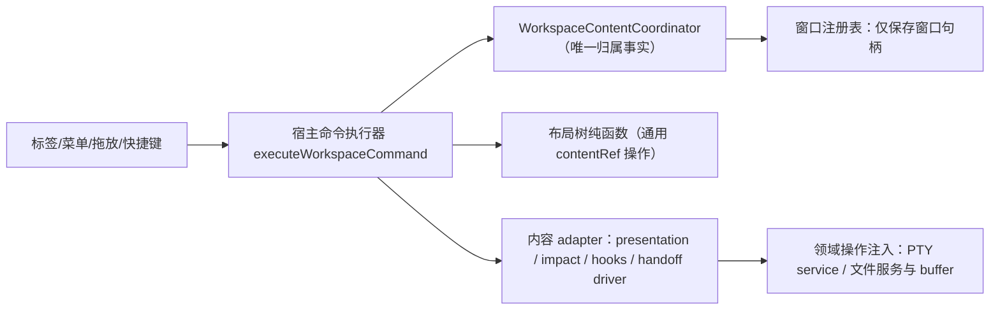
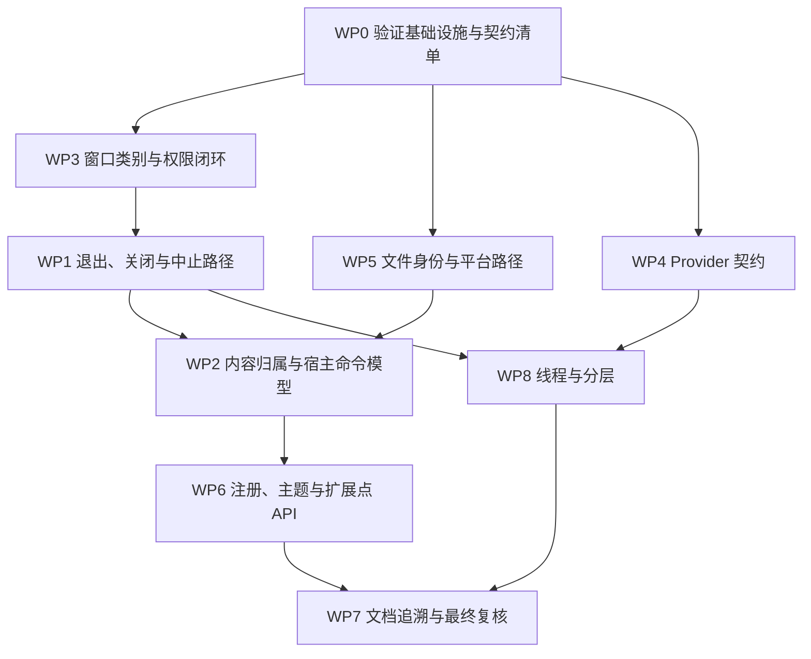

# M6 基础抽象体检与收口审查报告

> 审查日期：2026-10-05
> 基准提交：`5a91bc1`（`main`，工作区干净）
> 适用里程碑：[M6 内容窗格与文件工作区](M6-workspace-files.md)；本报告是 M6 验收和 M7 开工的强制引用文档。
> 审查性质：只读体检。本报告不修改代码；修复由后续实施按第 6 节工作包执行。

## 0. 审查说明

### 0.1 目标

项目在 0.3.0 与 0.4.0 的分阶段重构中，逐步形成了四类基础抽象。它们也是未来插件系统 API 的雏形：

| 基线                      | 形成阶段                                           | 未来对应的插件 API         |
| ------------------------- | -------------------------------------------------- | -------------------------- |
| B1 AI CLI Provider 基线   | G1 Grok Build、G2 Hermes Agent，G4 收敛注册契约    | Provider API               |
| B2 软件生命周期与主题基线 | G3 自定义窗口标题栏、G4 主题/生命周期/适配边界治理 | 主题 API、功能注册 API     |
| B3 窗口内容生命周期基线   | M6 内容窗格、文件工作区与独立窗口交接              | 窗口内容 API               |
| X 全仓横切面              | 各阶段累积                                         | 命令、权限、错误与线程模型 |

本次审查从头核对这些抽象的契约声明、实现、测试证据和文档描述，给出完整的修复指导，目标是在 M6 关闭和 M7 开工前把基础抽象全部收口。

### 0.2 方法

1. 从 `AGENTS.md`、`docs/architecture.md`、G1/G2/G3/G4/M6 里程碑文档中整理各基线的契约声明。
2. 四个并行的只读审查分别覆盖 B1、B2、B3 前端、B3 Rust 与横切面，逐条将契约与代码对照，并给出代码位置。
3. 汇总人复核全部 P0/P1 和关键 P2 发现，剔除误报。
4. 汇总人在基线交界处做交叉探查，补充新发现 J1–J3，并归纳跨基线的系统性问题。
5. 复跑现有自动测试作为基线：前端 25 个测试文件、174 项全部通过；Rust 256 项全部通过。测试全部通过不代表本报告的问题不存在，多数问题恰好落在现有测试没有覆盖的区域。

### 0.3 严重级定义

| 级别 | 含义                                                         |
| ---- | ------------------------------------------------------------ |
| P0   | 安全问题，或会静默丢失用户数据                               |
| P1   | 契约被破坏，或生命周期错误会导致状态失控、功能不可用         |
| P2   | 抽象泄漏、存在两份事实来源、边界没有收口，或文档承诺超出实现 |
| P3   | 可维护性问题，不影响当前正确性                               |

### 0.4 门禁分层

用户已确认：原计划延期的问题必须在 M7 开工前全部收口。因此本报告把所有问题划入两层门禁，没有遗留项。

| 门禁层 | 含义        | 关闭时点                                              |
| ------ | ----------- | ----------------------------------------------------- |
| A 层   | M6 验收前提 | M6 标记整体验收通过之前                               |
| B 层   | M7 开工前提 | M7 任何实现工作开始之前；原则上在 M6 收口阶段连续完成 |

一个问题标为“A/B”时，表示其中一部分属于 A 层（通常是安全修复、文档修正或测试），另一部分属于 B 层（通常是结构性改造）。第 6 节对每个问题写明了具体分界。

### 0.5 复核标记

| 标记         | 含义                                                         |
| ------------ | ------------------------------------------------------------ |
| 亲核         | 汇总人已回到代码逐行确认                                     |
| 亲核（机制） | 汇总人已确认触发机制，具体时序窗口需要通过测试复现           |
| 审查         | 由分项审查给出，附代码位置，汇总人抽查过上下文，没有逐行复核 |

## 1. 执行摘要

**结论：M6 当前不满足关闭条件。** 除已知的跨平台实机验收未完成外，代码中存在 1 项 P0、7 项 P1。M6 文档中还有 3 项被写成“已交付/已满足”的能力实际没有做到：标题自适应、宿主统一命令模型、权限闭环证据。

| 指标                  | 数值                                                  |
| --------------------- | ----------------------------------------------------- |
| 分项原始发现          | 59 项（B1 15、B2 13、B3 前端 13、B3 Rust 10、横切 8） |
| 去重后 + 交叉探查新增 | 57 + 3 = **60 项**                                    |
| 严重级分布            | P0 1 项、P1 7 项、P2 38 项、P3 14 项                  |
| 汇总人亲自复核        | 全部 P0/P1，以及 17 项关键 P2                         |

### 1.1 最高风险

1. **B2-F01（P0）**：应用退出时只检查运行中的 PTY，不检查未保存的文件编辑。关闭主窗口（关闭行为设为“退出”时）、托盘退出、macOS 上的 Cmd+Q，都会静默丢弃未保存的修改。
2. **B3F-F02（P1）**：文件分离到独立窗口后，引用仍留在源 pane。之后把它拖回另一个 pane，同一文件会同时出现在两个 pane，从此每次自动保存布局都被 Rust 拒绝。
3. **B3F-F03（P1）**：在保存进行中应用命名布局，该文件的 buffer 会永久卡在“保存中”，保存和分离都被禁用。
4. **B3R-F01（P1）**：在 macOS/Linux 上，目录里只要有一个文件名含 `:` 或 `\`，整个目录就列不出来。
5. **B3R-F02（P1）**：所有窗口都没有 `set-theme` 权限，主窗口也没有 `set-focus` 权限。原生主题同步一直失效，失败只打印到控制台。
6. **B3F-F04（P1）**：PTY 分离超时后，主窗口的回滚可能发生在子窗口已经接管之后，然后子窗口被销毁。Rust 不会回收会话归属，该会话从此不可控。
7. **J2（P1）**：CI 不运行任何测试。M6 文档中“macOS/Linux 待 CI 验证”的门禁在现有流水线下无法完成。
8. **B1-F01（P1）**：用户在确认浮层里看到的安装/更新计划，与实际执行的计划是两次独立生成的。

### 1.2 各基线收口程度

| 基线              | 判断                                                                                                                                                                   |
| ----------------- | ---------------------------------------------------------------------------------------------------------------------------------------------------------------------- |
| B1 Provider       | 主体成熟：编译期穷尽注册、适配器 panic 隔离、执行任务按 CLI 分槽。主要缺口是失败关闭不彻底、确认的计划与执行的计划脱节、进程原语重复、跨语言注册没有一致性测试         |
| B2 生命周期与主题 | token 矩阵干净，退出时的 PTY 保护完整。主要缺口是退出门禁漏掉文件、原生主题被权限拒绝、主题解析分散在多处、功能注册依赖模块导入的副作用                                |
| B3 窗口内容       | 纯函数层（状态机、协调器、协议、关闭批处理）扎实。主要缺口是 adapter 基本是转发外壳，宿主中约 30 处按 kind 分支，内容归属事实存在 4–5 份，分离/保存/退出有数据安全缺陷 |
| X 横切            | `invoke` 已集中，i18n 键集完全一致。主要缺口是权限没有一致性测试且已出现漂移、同步命令阻塞主线程、错误模型只有字符串、文档与实现偏差大                                 |

## 2. 基线成熟度矩阵

用七个维度评估各扩展点，作为收口前后对比的基线。

| 维度           | Provider（B1）                         | 主题（B2）                             | 功能注册（B2）                    | 窗口内容（B3）                               |
| -------------- | -------------------------------------- | -------------------------------------- | --------------------------------- | -------------------------------------------- |
| 契约声明       | 部分：有 trait，没有能力描述           | 部分：token 契约清晰，没有主题定义 API | 部分：两个 registry 的 API 不一致 | 部分：`presentation` 只是静态文案            |
| 注册一致性     | 部分：Rust 编译期穷尽，TS/SQL 没有测试 | 缺失：主题标识硬编码 8 处以上          | 部分：靠模块导入副作用注册        | 部分：kind 类型定义散在 4 处                 |
| 能力与权限     | 缺失：没有能力或资源声明               | 缺失：`set-theme` 没有授权             | 缺失                              | 部分：capability 是静态的，有漂移，粒度粗    |
| 生命周期所有权 | 满足：公共服务持有                     | 部分：退出门禁漏掉文件                 | 缺失：没有 bootstrap 和卸载       | 部分：存在多份归属事实，出口路径有缺陷       |
| 错误隔离       | 部分：隔离了 panic，没有超时           | 部分：失败被静默吞掉                   | 缺失：没有 ErrorBoundary          | 缺失：遇到未知 kind 时整窗白屏或整份布局重置 |
| 测试证据       | 部分：协调器隔离逻辑不可注入测试       | 缺失：同步协议和标题栏没有测试         | 部分                              | 部分：纯函数测试充分，宿主没有测试           |
| 文档一致性     | 缺失：约 6 处偏差                      | 部分：G3 声称的测试不存在              | 部分                              | 缺失：约 8 处偏差                            |

## 3. 跨基线系统性问题

单项问题背后有共同根因。只修单项、不纠正这些模式，同类问题会在 M7–M10 重复出现。

### S1 同一事实存放多处，没有一致性契约

| 事实             | 存放位置                                                                                                                                                                                                                                     | 现有保护                                 |
| ---------------- | -------------------------------------------------------------------------------------------------------------------------------------------------------------------------------------------------------------------------------------------- | ---------------------------------------- |
| CLI `ToolKey`    | Rust 枚举、TS 联合类型、SQL 种子与 CHECK 约束、i18n、图标                                                                                                                                                                                    | 只有 Rust 编译期检查；种子数据只测了数量 |
| 应用命令         | `build.rs`、`generate_handler!`、`capabilities/default.json`                                                                                                                                                                                 | 无（目前三处恰好各 70 个，靠人工维持）   |
| 窗口 label 规则  | `workspaceContentDrag.ts:59`、`workspaceFileWindow.ts:15`、`PtyWorkspace.tsx:1916`、`useThemeSync.ts:83`、`workspaceContentWindowProtocol.ts:372-375`、Rust `pty_session_service.rs:299-304`、`commands/pty_session.rs:158`、capability glob | 无；正则宽度已不一致（`+` 与 `{36}`）    |
| 内容 kind / 身份 | `tauri.ts` 联合类型、Rust 枚举、拖放白名单、身份函数 3 份副本                                                                                                                                                                                | 无                                       |
| 相对路径规则     | `project_directory.rs:25-39`、`models/workspace_layout.rs:577-586`                                                                                                                                                                           | 无                                       |
| 主题标识         | `themeMode.ts`、`appStore.ts`、CSS 选择器、Monaco、Sonner 等 8 处以上                                                                                                                                                                        | 无                                       |

**根因**：只有 Rust 内部能靠类型系统保证一致；凡是跨语言、跨配置文件、跨窗口的事实，都没有单一来源。

**修复原则（P-1）**：凡是跨语言或跨配置的事实，建立 `contracts/*.json` 单一清单，并在 Rust 与 TS 两侧各写一条一致性测试（见 WP0）。

### S2 失败处理只有两个极端：静默吞掉或整体崩溃

- 静默吞掉的例子：`setTheme`、`setFocus` 被权限拒绝，只打到控制台；`resume_args` 的默认实现原样返回参数，实际启动的是新会话，却被记成“恢复”；PTY 关闭时 `beforeClose` 永远收到 `isDirty:false`。
- 整体崩溃的例子：一个文件名不合格，整个目录列不出来；一个索引条目出错，整次扫描失败；某个 adapter 缺失，整个窗口白屏；布局里出现未知 kind，整份布局被重置。

**修复原则（P-2）**：失败语义分三级。

| 级别     | 适用场景                                                     | 处理方式                                 |
| -------- | ------------------------------------------------------------ | ---------------------------------------- |
| 拒绝     | 安全边界：越界路径、伪造身份                                 | 明确报错，不执行                         |
| 单项降级 | 集合中的个别坏数据：目录条目、索引条目、布局内容项、单个 CLI | 跳过或显示占位，标记为“不完整”，其余继续 |
| 整体失败 | 仅限完整性被破坏：数据库损坏、schema 来自未来版本            | 进入恢复流程                             |

权限拒绝、能力缺失属于配置缺陷，必须在测试阶段暴露，不允许用 `.catch` 吞掉后继续。

### S3 入口路径做得好，退出和中止路径普遍缺失

| 资源         | 缺失的出口                                     | 编号             |
| ------------ | ---------------------------------------------- | ---------------- |
| 未保存的文件 | 应用退出                                       | B2-F01           |
| PTY 会话     | 所有者窗口被销毁、分离超时                     | B3R-F05、B3F-F04 |
| 执行任务槽位 | 写数据库失败、panic                            | B1-F12           |
| 文件独立窗   | 初始化完成前就关闭                             | B2-F07           |
| 文件归属     | 分离成功后仍留在源 pane                        | B3F-F02          |
| 在途保存     | 期间应用了布局                                 | B3F-F03          |
| 运行中的 PTY | 显式关闭，但 `closing → disposed` 没有表达出来 | B3F-F05          |
| 工作区运行态 | 备份恢复                                       | J1               |

**修复原则（P-3）**：每类资源必须定义五个出口：正常结束、显式关闭、异常中止、所属窗口销毁、应用退出。每个出口要写明清理者和测试。第 6 节 WP1 和 WP2 按这个矩阵组织。

### S4 信任调用方自报的身份，预检与执行分离

- 安装/更新：确认浮层预览的计划与执行时的计划分开生成（B1-F01）。
- 跨窗协议：发送方的 label 写在 payload 里，由发送方自己声明；监听又是全局的，事件实际广播给所有窗口（B3F-F08）。
- 主题请求：label 由请求方自报（B2-F03）。
- 文件独立窗：交接 payload 不能当作授权凭据，但也没有别的机制把窗口限定在该文档上（B3R-F04）。
- 文件 I/O：只认 `directory_id`，不核对路径快照；PTY slot 则会核对（J1）。

**修复原则（P-4）**：身份必须由可信的一端判定。具体做法：

- Rust 命令通过 `WebviewWindow` 参数读取调用方的 label，不信任 payload 里的 label；
- 执行时比对用户确认过的计划指纹；
- 读写文件时核对“项目 ID + 路径快照”这个复合身份。

### S5 宿主仍是承担一切的大组件

`PtyWorkspace.tsx` 有 4,619 行，同时持有布局恢复、文件编辑状态、PTY 会话、窗格拓扑、拖放、菜单和两套独立窗口编排，其中约 30 处按内容 kind 分支。通用操作 `moveWorkspaceContent`、`splitAndMoveWorkspaceContent` 已经写好，但从未被调用。内容归属在 coordinator、`detached*` 集合与 ref、`pending*` ref、`handoffFileIds` 和布局树之间各存一份。

**修复原则（P-5）**：宿主只通过一个以内容引用为键的命令执行器修改拓扑；归属的唯一事实来源是 coordinator；类型差异通过 adapter 的 `presentation`、影响描述和领域操作注入（见 WP2）。

### S6 文档承诺超出实现，门禁证据链断裂

约 20 处文档描述没有代码支撑，附录 B 有完整清单。最严重的几处：

- G3 文档勾选“已有测试”的标题栏测试，仓库里不存在；
- M6 门禁 10 的标题自适应没有实现；
- 文档写“ready 后从源 pane 移除”，文件内容实际没有移除；
- 文档写“受信握手内存传递”，实际是广播；
- 文档写有 capability 的“配置或启动测试”，实际不存在；
- `architecture.md` 的命令清单缺约 45 个命令，又列了 3 个不存在的命令。

**修复原则（P-6）**：里程碑文档中每一条“已满足”“已交付”的表述，必须注明代码位置，以及测试名或实机验收记录编号；写不出证据的一律标为“待验证”（见 WP7）。

### S7 验证基础设施缺口

- CI 只有发布流水线，不运行 `cargo test` 或 `pnpm test`（J2）。Unix 权限保留测试从来没有执行过。
- 前端没有 DOM 测试环境（J3），4,619 行的宿主编排完全没有测试，B3F-F02、F03、F06 这类时序缺陷因此漏网。

这一层是其他所有工作包的验证前提，所以排在 WP0 最先做。

## 4. 统一扩展点模型（收口目标）

M6 不建设插件系统，但四类扩展点应该收口到同一个形状，未来插件 API 才能在此基础上增量开放，而不必重写。目标形状如下：

| 要素           | 要求                                                                 | Provider                                                   | 主题                               | 功能注册                              | 窗口内容                                     |
| -------------- | -------------------------------------------------------------------- | ---------------------------------------------------------- | ---------------------------------- | ------------------------------------- | -------------------------------------------- |
| Descriptor     | `id`、`apiVersion`、声明的能力                                       | 新增 `descriptor()`，能力位覆盖历史/恢复/更新语义/托管更新 | 新增 `ThemeDefinition`             | 统一的 registry 条目                  | 现有 `id`/`apiVersion`/`kinds`，补齐能力声明 |
| Registry       | `register`/`unregister`/`get`/`list`/`subscribe`、冲突拒绝、版本校验 | 保持编译期穷尽，再加 `contracts` 清单测试                  | 新增主题注册表                     | 抽出共用的 registry 工厂              | 已有；补 `tryGet` 和测试                     |
| Bootstrap      | 显式、幂等、每个窗口都执行                                           | 编译期                                                     | `bootstrap` 时注册内建主题         | 新增 `registerBuiltinContributions()` | 同左                                         |
| 生命周期       | 由宿主持有，adapter 只实现钩子                                       | 公共服务持有（已满足）                                     | 解析结果由 `useThemeSync` 唯一产出 | 卸载时释放                            | coordinator 唯一事实来源 + 五个出口          |
| 运行上下文注入 | adapter 不自行读取全局状态                                           | `AdapterContext{resolved_path, home, budget}`              | 消费方订阅已解析主题               | —                                     | render/handoff 只拿到注入的能力              |
| 错误隔离       | 单项降级，不影响其他扩展                                             | 统一超时 + panic 隔离                                      | —                                  | ErrorBoundary                         | ErrorBoundary + 未知 kind 降级               |
| 契约测试       | 跨端一致 + 失败关闭                                                  | ToolKey 清单、可注入的注册表                               | token 完整性                       | 注册表 API 测试                       | label/kind 清单、协议测试                    |

这张表也是第 11 节“插件化差距”的对照基线。

## 5. 问题总表

“工作包”一列对应第 6 节的修复指导，“门禁”一列对应 0.4 节的分层。

| 编号    | 级别 | 标题                                                        | 工作包  | 门禁                | 复核         |
| ------- | ---- | ----------------------------------------------------------- | ------- | ------------------- | ------------ |
| B2-F01  | P0   | 应用退出不检查未保存文件（别名 B3F-F01）                    | WP1     | A                   | 亲核         |
| B1-F01  | P1   | 确认浮层预览的计划与执行的计划两次独立生成                  | WP4     | A                   | 亲核         |
| B3F-F02 | P1   | 文件分离后仍留在源 pane，可能重复出现在两个 pane            | WP2     | A                   | 亲核         |
| B3F-F03 | P1   | 应用布局后在途保存永久卡在 saving                           | WP2     | A                   | 亲核         |
| B3F-F04 | P1   | PTY 分离超时后的回滚与 Rust 归属竞态                        | WP1     | A                   | 亲核（机制） |
| B3R-F01 | P1   | Unix 上含 `:`/`\` 的文件名导致整个目录列不出来              | WP5     | A                   | 亲核         |
| B3R-F02 | P1   | 所有窗口缺 `set-theme`，主窗口缺 `set-focus`（别名 B2-F02） | WP3     | A                   | 亲核         |
| J2      | P1   | CI 不运行任何测试                                           | WP0     | A                   | 亲核         |
| B1-F02  | P2   | 版本查询失败后，旧缓存被重写并刷新成功时间                  | WP4     | A                   | 亲核         |
| B1-F03  | P2   | `validate_execution` 依赖提示文案存在才执行                 | WP4     | A                   | 亲核         |
| B1-F04  | P2   | `resume_args`、`command_candidates` 的默认实现不是失败关闭  | WP4     | A                   | 亲核         |
| B1-F05  | P2   | 会话 ID 允许前导 `-`，会被 CLI 当成选项                     | WP4     | A                   | 亲核         |
| B1-F06  | P2   | CLI 状态一次性聚合查询，任务结束后探测全部 CLI              | WP4     | A                   | 审查         |
| B1-F07  | P2   | 协调器没有统一超时，`where.exe` 在数据库锁内运行且没有超时  | WP4     | A                   | 审查         |
| B1-F08  | P2   | Windows 进程启动包装重复 5 份                               | WP4     | A                   | 审查         |
| B1-F09  | P2   | ToolKey 跨语言、跨 SQL 没有一致性测试                       | WP4/WP0 | A（测试）/B（迁移） | 审查         |
| B1-F10  | P2   | 更新可用性与托管资格各有两套事实来源                        | WP4     | B                   | 审查         |
| B1-F11  | P2   | Provider 文档与代码偏差（6 处）                             | WP7     | A                   | 审查         |
| B1-F12  | P2   | 执行任务槽位不能可靠释放                                    | WP1     | A                   | 亲核         |
| B2-F03  | P2   | 文件独立窗拿不到初始主题；主题协议没有版本化                | WP3     | A                   | 亲核         |
| B2-F04  | P2   | 没有“已解析主题”接口，消费方各自观察 DOM                    | WP6     | B                   | 审查         |
| B2-F06  | P2   | 独立窗口外壳不承担 Toaster、右键菜单等窗口级职责            | WP3     | A                   | 审查         |
| B2-F07  | P2   | 文件独立窗初始化前的关闭请求被吞掉                          | WP1     | A                   | 亲核         |
| B2-F08  | P2   | 注册依赖导入副作用；编辑器注册表承诺与实现不一致            | WP6     | A                   | 审查         |
| B2-F09  | P2   | 语言切换不跨窗口同步；托盘菜单硬编码中文                    | WP3     | B                   | 审查         |
| B3F-F05 | P2   | 运行中的 PTY 被显式关闭时不经过 `closing → disposed`        | WP2     | B                   | 审查         |
| B3F-F06 | P2   | 关闭决策绕过 adapter 钩子；混合关闭被拆成两批               | WP2     | A                   | 审查         |
| B3F-F07 | P2   | adapter 是转发外壳；宿主约 30 处按 kind 分支                | WP2     | A/B                 | 审查         |
| B3F-F08 | P2   | 跨窗协议实际是广播，发送方 label 由自己声明                 | WP3     | A                   | 亲核         |
| B3F-F09 | P2   | `dispose` 没有实现者；Monaco model 不会释放                 | WP2     | A                   | 审查         |
| B3F-F10 | P2   | 归属事实多处重复，清理不对称                                | WP2     | B                   | 审查         |
| B3F-F11 | P2   | 遇到未知 kind 或缺失 adapter 时没有降级                     | WP2     | B                   | 审查         |
| B3F-F12 | P2   | 标题 200px 上限与跨类型堆叠列表没有实现                     | WP2     | A                   | 亲核         |
| B3R-F03 | P2   | 子窗口使用 `core:default`，权限不是最小                     | WP3     | A                   | 审查         |
| B3R-F04 | P2   | 文件独立窗可访问所有项目的所有文件；文档描述与配置不符      | WP3     | A（文档）/B（授权） | 审查         |
| B3R-F05 | P2   | PTY 所有者窗口销毁后会话无人回收                            | WP1     | A                   | 亲核         |
| B3R-F06 | P2   | 索引扫描遇到单项错误就整体失败；索引命令没有调用方          | WP5     | A（文档）/B（代码） | 审查         |
| B3R-F09 | P2   | 路径规则与项目根解析各有两份实现                            | WP5     | A                   | 审查         |
| X-F01   | P2   | 同步命令在主线程执行（PTY 写入、退出确认等）                | WP8     | A/B                 | 亲核         |
| X-F02   | P2   | 错误模型只有字符串，后端中文直接展示给用户                  | WP6     | B                   | 审查         |
| X-F03   | P2   | 架构文档的命令清单、变更通知、测试表述与实现不符            | WP7     | A                   | 审查         |
| X-F04   | P2   | 命令注册与窗口 label 多份来源，没有一致性测试               | WP3/WP0 | A                   | 审查         |
| X-F05   | P2   | 没有配置 CSP                                                | WP3     | B                   | 审查         |
| X-F06   | P2   | 10 个已注册命令没有生产调用方（含外部终端启动）             | WP3     | A                   | 审查         |
| J1      | P2   | 备份恢复不协调运行态；文件 I/O 不核对路径身份               | WP5     | A                   | 亲核         |
| J3      | P2   | 前端没有 DOM 测试环境，宿主无法测试                         | WP0     | A                   | 亲核         |
| B1-F13  | P3   | 前端契约中的死字段和单 CLI 字段                             | WP4     | A（死字段）/B       | 审查         |
| B1-F14  | P3   | trait 中有只服务单个 CLI 的方法；adapter 自行解析路径       | WP4     | B                   | 审查         |
| B1-F15  | P3   | G4 承诺清理的代码仍有残留                                   | WP4     | B                   | 审查         |
| B2-F05  | P3   | 终端 token 不随主题变化，xterm 的主题监听实际无效           | WP6     | A（文档）/B         | 审查         |
| B2-F10  | P3   | 主题标识硬编码 8 处以上                                     | WP6     | B                   | 审查         |
| B2-F11  | P3   | 平台判断泄漏到组件                                          | WP6     | B                   | 审查         |
| B2-F12  | P3   | G4 遗留清理不完整（含 `colorPrimary`）                      | WP6     | B                   | 审查         |
| B2-F13  | P3   | G3 文档勾选的测试在仓库中不存在                             | WP7/WP0 | A                   | 审查         |
| B3F-F13 | P3   | 宿主中的维护性问题（假代次、死分支、未注销的监听等）        | WP2     | B                   | 审查         |
| B3R-F07 | P3   | 按项目清理缓存时前缀碰撞，误删其他项目                      | WP5     | B                   | 审查         |
| B3R-F08 | P3   | 先打开后判断类型，Unix 上打开 FIFO 会阻塞                   | WP5     | B                   | 审查         |
| B3R-F10 | P3   | CAS 的残余边界（权限恢复、残留临时文件）                    | WP5     | B                   | 审查         |
| X-F07   | P3   | 后端事件广播到所有窗口                                      | WP3     | B                   | 审查         |
| X-F08   | P3   | 既有分层泄漏（services 中的 `cfg`、SQL、加锁范围）          | WP8     | B                   | 审查         |

## 6. 收口工作包与修复指导

每个问题的格式统一为：**现状**（含代码位置）、**修复**（按顺序的步骤）、**验收**（自动测试或实机证据）。实施时须遵守 `AGENTS.md` 的架构边界：启动/文件/Git 逻辑放在 Rust services，平台差异放在 platform，命令参数结构化。

### WP0 验证基础设施与契约清单（最先做）

WP0 是其余工作包的验证前提，应最先完成。

#### J2（P1·A）CI 不运行任何测试

- **现状**：`.github/workflows/` 下只有 `release.yml`，只在 `workflow_dispatch` 和 `v*.*.*` tag 时触发，没有任何 `cargo test`、`pnpm test`、`cargo fmt` 步骤。M6 文档中“待 CI 验证”的 Unix 测试从来没有执行过。
- **修复**：
  1. 新增 `.github/workflows/ci.yml`。
     - 触发条件：推送到 `main`、`pull_request`、`workflow_dispatch`，并声明 `on: workflow_call`，供发布流程复用。
  2. 运行矩阵：`windows-latest`、`macos-latest`、`ubuntu-24.04`。如需覆盖 ARM，可另加 `ubuntu-24.04-arm`。
  3. 环境准备复用 `release.yml` 已有的写法：
     - pnpm 版本 11.21.0、Node 22、Rust stable 及其缓存；
     - Linux 依赖与 AGENTS 列出的 Tauri v2 依赖一致。
  4. 按顺序执行以下步骤：
     - `pnpm install --frozen-lockfile`
     - `pnpm test`
     - `pnpm run build`（包含 TypeScript 检查）
     - `cargo fmt --manifest-path src-tauri/Cargo.toml --check`
     - `cargo check --manifest-path src-tauri/Cargo.toml`
     - `cargo test --manifest-path src-tauri/Cargo.toml`
     - 契约测试已包含在上面两个测试命令里。
  5. 在 `release.yml` 的构建 job 之前，用 `uses: ./.github/workflows/ci.yml` 调用这套门禁，保证发布前所有测试必过。
- **验收**：三平台全部通过。日志中能看到 Unix 专属测试的实际执行，包括 CAS 权限保留、私有临时文件、B3R-F01 新增的文件名测试。M6 文档“当前验收状态”中，“macOS/Linux 构建”一行附上该 run 的链接。

#### J3（P2·A）前端没有 DOM 测试环境

- **现状**：`package.json` 只有 `vitest`，没有 `jsdom` 或 `@testing-library/*`。宿主组件、独立窗口、退出流程都无法做集成测试。
- **修复**：
  1. 新增开发依赖 `jsdom` 和 `@testing-library/react`（用 pnpm，只更新 `pnpm-lock.yaml`）。默认测试环境仍为 node，需要 DOM 的测试文件在开头声明 `// @vitest-environment jsdom`。
  2. 新增 `src/test/tauriMock.ts`，统一 mock 以下模块，并提供可断言的调用记录和可手动触发的事件：
     - `@tauri-apps/api/core` 的 `invoke`、`Channel`；
     - `@tauri-apps/api/event` 的 `listen`、`emit`、`emitTo`；
     - `@tauri-apps/api/window`；
     - `@tauri-apps/api/webviewWindow`。
  3. 宿主行为测试的落点：WP2 先把宿主拆成可测的 hook 或执行器，再对执行器写测试，不直接渲染 4,619 行的整个组件。
- **验收**：至少覆盖第 6 节标注“宿主集成测试”的场景，包括：
  - B3F-F02 拖回非源 pane；
  - B3F-F03 应用布局与在途保存；
  - B2-F01 退出预检；
  - B2-F07 未就绪时关闭；
  - B3F-F06 混合关闭被否决；
  - B3F-F12 堆叠分区。

#### 契约清单模式（S1 的基础设施）

- **做法**：在仓库根目录新建 `contracts/`，放跨语言、跨配置的单一事实清单：

  ```text
  contracts/
    tool-keys.json        # ["claude","codex","antigravity","grok","hermes"]（与 Rust ToolKey 序列化值一致）
    window-kinds.json     # 窗口类别、label 前缀、capability 文件、允许的 app commands 与 core 权限
    content-kinds.json    # ["pty","file"]，M7 增加 markdown 时只改这里 + 实现
    app-commands.json     # 全部注册命令名（build.rs 读取它生成 AppManifest）
  ```

- **使用方式**：
  - Rust 侧通过 `include_str!(concat!(env!("CARGO_MANIFEST_DIR"), "/../contracts/<x>.json"))` 读取，在测试中断言与枚举、`build.rs`、`lib.rs` 的 `generate_handler!` 块（测试中按文本解析）以及 `capabilities/*.json` 一致。
  - TS 侧直接 import JSON，断言与 `TOOLS`、`ToolKey`、内容 kind、窗口 label 工具函数一致。
  - `build.rs` 改为从 `app-commands.json` 读取命令列表，消除一份手写清单。
- **验收**：在任意一端增删一个键，CI 会失败；失败信息指出具体缺少哪一端。

#### WP0 实施记录（2026-10-05）

- `J3`：已建立 DOM 测试环境与 Tauri mock；`src/test/tauriMock.test.tsx` 的 `Tauri DOM test environment > renders React and records invocations while allowing events to be triggered` 验证 React 渲染、结构化 invoke 记录和手动事件触发。契约测试另验证 `src/lib/workspaceContentWindowProtocol.ts` 的窗口 label 前缀与 `contracts/window-kinds.json` 一致。第 6 节列出的宿主行为场景将在各自问题对应的波次中验收，本条不提前宣称这些场景已通过。
- `J2`：已增加三平台 CI 工作流并由发布工作流复用；本机门禁通过，但三平台运行结果尚未产生，待 WP0 提交推送后补记 run 链接和结果。
- 契约清单：Rust 与 TypeScript 契约测试已加入；当前本机 `pnpm test` 178 项、`cargo test --manifest-path src-tauri/Cargo.toml` 260 项通过。三平台 CI 仍是 WP0 关闭前置条件。

### WP1 退出、关闭与中止路径（数据安全）

本工作包按 S3 的五出口原则补齐缺失的出口。先定义共用的“处置影响”描述，WP2 的关闭流程和本工作包的退出流程都使用它：

```ts
// 内容 adapter 生命周期新增（同步、纯函数）
interface WorkspaceContentDisposalImpact {
  severity: "info" | "warning" | "destructive"; // destructive = 会丢数据或结束进程
  titleKey: string; // i18n key，如 "workspace.impact.unsavedFile"
  detail: string; // 文件相对路径 / 会话标题
}
describeDisposalImpact
  ? (content, context)
  : WorkspaceContentDisposalImpact | null;
```

#### B2-F01（P0·A）应用退出不检查未保存文件

- **现状**：`src-tauri/src/lib.rs:309-321` 的 `ExitRequested` 只统计 `sessions.active_count()`，PTY 数为 0 时直接退出。关闭行为设为“退出”时，主窗口关闭直接调用 `app.exit(0)`（`lib.rs:296-299`）。前端唯一的退出监听 `App.tsx:149` 只处理 `pty-exit-requested`。主窗口和独立文件窗里的未保存 buffer 都不参与判断。
- **修复**：
  1. **Rust 统一退出门**：新增 `services/app_lifecycle.rs`，把 `PtySessionManager` 中的退出授权（`authorize_exit`、`consume_exit_authorization`）迁移为通用的 `AppExitGate`。`ExitRequested` 时：
     - 已授权：消费授权，然后放行。
     - 未授权：`api.prevent_exit()`，显示主窗口，再 `emit_to("main", "app-exit-requested", { ptyCount })`。无论 PTY 数是多少都要发送，因为文件的脏状态只有前端知道。
     - 主窗口不存在（异常情况）：退回现有逻辑，只按 PTY 数判断。
  2. **核实 Tauri 2.11 中 `app.exit(0)` 触发的 `ExitRequested` 能否被 `prevent_exit` 阻止**，并写测试或实机记录。如果不能，主窗口“关闭即退出”的路径改为直接发出 `app-exit-requested`，不再调用 `app.exit`。
  3. **命令**：`confirm_pty_exit` 改名为 `confirm_app_exit`，改为 async，阻塞部分放进 `spawn_blocking`（见 X-F01）。执行顺序是结束全部 PTY、写入退出授权、再调用 `exit`。同步更新 ACL 和契约清单。
  4. **前端汇总影响**：
     - 主窗口宿主提供 `collectExitImpacts()`，遍历 coordinator 中全部内容（含分离到独立窗口的），调用各 adapter 的 `describeDisposalImpact`。
     - 文件 adapter 的判断依据：主窗口自己的 buffer 是否 dirty，以及独立窗口经 `buffer-changed` 同步到主窗口的镜像是否 dirty。
     - 如果按 B3F-F08 给 buffer 事件加了节流，汇总前必须先向全部独立文件窗发 `flush` 请求，并等待确认（上限 500ms）；超时的窗口按 dirty 处理。
  5. **统一对话框**：
     - 由宿主渲染，不用 `window.confirm`，分别列出运行中的 PTY 和未保存文件。
     - 操作项为“取消”和“放弃更改并退出”。建议同时提供“全部保存后退出”：通过现有 single-flight 依次保存，任何冲突或失败都中止退出，并在对应文档上显示冲突状态。
     - 托盘退出、macOS Cmd+Q、主窗口关闭（关闭行为为“退出”）三条路径共用同一个流程。
- **验收**：
  - Rust 单元测试：`AppExitGate` 的授权只能被消费一次，未授权时一定阻止退出。
  - 前端纯函数测试：`collectExitImpacts` 能正确合并主窗口 buffer、独立窗口镜像和 PTY。
  - 宿主集成测试：flush 超时时按 dirty 处理。
  - 实机矩阵：3 条退出路径 × 4 种状态（无内容、仅 PTY、仅未保存文件、两者都有）× 3 个平台，逐格记录。

#### B2-F07（P2·A）文件独立窗初始化前的关闭请求被吞掉

- **现状**：`WorkspaceContentWindowShell.tsx:35` 先调用 `preventDefault`；`StandaloneWorkspaceFileWindow.tsx:71-72` 的 `requestReturn` 在 `!fileDocument` 时直接返回。窗口在初始化前关不掉，只能等主窗口 15 秒超时；如果主窗口不再处于 pending 状态，窗口永远关不掉。另外 `setup` 在组件已卸载后仍会发出 `ready`（`:345-355`）。
- **修复**：
  1. 外壳增加 `onCloseBeforeReady` 策略。文件窗的处理是：向主窗口发出 `workspace-file-window-attach-failed`（附 `reason: "closed-before-ready"`），然后 `destroy()`。此时内容还没有从源 pane 移除，主窗口按现有回滚路径恢复即可。
  2. `setup` 在每个 `await` 之后检查 `disposed`；已卸载时不再发出 `ready`。
  3. 主窗口的 pending 注册表对同一 token 只允许 `take` 一次（已有机制），保证 StrictMode 下重复的 ready 是幂等的。
  4. 对照检查 PTY 窗口已有的未就绪分支（`StandalonePtyWindow.tsx:283-303`），确认两类窗口的语义一致。
- **验收**：宿主集成测试覆盖 init 前关闭、init 期间卸载、重复发出 ready；实机在文件窗打开的瞬间立即关闭，确认主窗口的文件状态完好。

#### B3F-F04（P1·A）PTY 分离超时后的回滚与 Rust 归属竞态

- **现状**：子窗口先调用 `complete_handoff` 和 `finalize_handoff`，此时 Rust 的事件路由已切到子窗口（`pty_session_service.rs:885-892`），然后才发出 ready。主窗口若在收到 ready 前超时，或 ready 校验不通过（`PtyWorkspace.tsx:1772-1843`），会调用 `cancel_handoff`。但该函数要求调用方是当前所有者（`ensure_owner(main)`，`:903`），所以必然失败。主窗口吞掉这个错误后销毁子窗口，会话的所有者停留在已销毁的 label 上。
- **修复**：
  1. 主窗口在超时或校验失败后，不再盲目回滚。先调用 `getPtySessionWindowStatus(sessionId)` 查询 Rust 的权威状态，再按结果处理：
     - 所有者仍是 main：执行 `cancel_handoff` 并销毁子窗口（与现有逻辑一致）。
     - 所有者已是该子窗口，且窗口仍存在：视为分离成功，补登记为 detached；不能销毁窗口。
     - 会话已结束：清理 slot，销毁窗口。
  2. 把上述判断抽成纯函数 `resolveDetachTimeoutAction(status, childLabel)`，复用 `ptySessionLifecycle.ts` 现有的 `resolveDetachedWindowFailureAction` 风格，并配表驱动测试。
  3. 以 B3R-F05 的 Rust 回收作为兜底：即使前端判断出错导致子窗口被销毁，会话也会回到主窗口。
- **验收**：纯函数测试覆盖三种分支。Rust 测试覆盖：`finalize` 之后调用 `cancel` 返回错误，且 `window_status` 报告所有者为子窗口。实机可人为延长子窗口初始化时间（开发构建中加一个可配置延迟）来复现。

#### B3R-F05（P2·A）PTY 所有者窗口销毁后会话无人回收

- **现状**：`lib.rs:282-285` 的 `on_window_event` 对非 main 窗口直接返回；`write`、`terminate`、`begin_handoff` 都要求调用方是当前所有者。终端独立窗口的渲染进程崩溃或被强制销毁后，会话仍在运行，输出背压一直暂停，主窗口无法关闭它。
- **修复**：
  1. `on_window_event` 处理 `WindowEvent::Destroyed`：label 不是 main 时，调用 `PtySessionManager::reclaim_window(label)`。
  2. `reclaim_window` 的处理：
     - 遍历事件路由的 `window_label == label` 的会话，标记为 `owner_lost`；
     - 把路由改为 main，并把 `channel` 改为 `Option`，置为 `None`；
     - 保持输出暂停，在有上限的缓冲中暂存，溢出时按现有规则拒绝；
     - 清除以该 label 为目标的 `pending_handoff`。
  3. 通过 `emit_to("main", "pty-session-owner-lost", { sessionId })` 通知主窗口。
  4. 新增 main 专用的命令 `reattach_pty_session(session_id, channel)`，只在 `owner_lost` 状态下允许调用。它把新的前端 Channel 挂上路由，发送当前画面快照，并恢复输出。前端收到通知后，把该 slot 放回聚焦的 pane，并走 attach 流程。
  5. 正常 return 之后的窗口销毁不受影响：此时所有者已经是 main，没有会话需要回收。
- **验收**：Rust 单元测试覆盖：
  - 销毁所有者窗口后会话可被 main 重新接管；
  - 销毁非所有者窗口时不产生影响；
  - pending 交接被清除。

  实机：在任务管理器中结束独立终端窗口对应的 WebView2 子进程，确认主窗口能收回并操作该会话。

#### B1-F12（P2·A）执行任务槽位不能可靠释放

- **现状**：
  - `execution_service.rs:142-147` 中 `complete()` 先执行 `update_status(...)?`，失败时提前返回，跳过了 `active.remove_by_id`；
  - `run_task` 中 `transition_running` 出错时直接 return（`:169-171`）；
  - panic 没有兜底。

  三种情况都会让该 CLI 一直提示“已有任务正在执行”，直到重启应用。

- **修复**：
  1. 新增 `ActiveTaskGuard`，持有 `ExecutionTaskManager` 的引用和任务 ID，在 `Drop` 时移除槽位。由 `run_task` 持有这个 guard。
  2. `complete()` 改为先移除槽位，再写数据库。数据库写入失败只记录日志并发出事件，不影响释放槽位。
  3. `run_task` 的主体放进内部 spawn 的任务里执行，外层 await 它的 `JoinHandle`。如果返回 `JoinError`（panic），调用 `finish_failed`。
- **验收**：通过可注入的数据库失败点（测试 seam）覆盖三种异常路径，断言槽位都被释放，并且可以再次为同一 CLI 启动任务。

### WP2 内容归属单一事实源与宿主命令模型

**目标结构**：



```ts
type WorkspaceContentCommand =
  | { type: "activate"; ref: WorkspacePaneContentRef; paneId: string }
  | {
      type: "close";
      refs: WorkspacePaneContentRef[];
      origin: "tab" | "menu" | "stack" | "window";
    }
  | {
      type: "move";
      ref: WorkspacePaneContentRef;
      toPaneId: string;
      index?: number;
    }
  | {
      type: "split";
      ref: WorkspacePaneContentRef;
      toPaneId: string;
      direction: SplitDirection;
    }
  | { type: "detach"; ref: WorkspacePaneContentRef }
  | { type: "return"; ref: WorkspacePaneContentRef; toPaneId?: string };
```

**约束**：

- 标签、菜单、堆叠列表、拖放和独立窗口返回，都只构造命令，不直接修改树。
- 执行器内部只调用通用树操作，以及 adapter 和领域注入点。
- 允许保留的 kind 分支只能出现在“领域操作注入表”中，并在架构文档里逐项列出。

#### B3F-F02（P1·A）文件分离后仍留在源 pane

- **现状**：
  - attach 成功后只调用 `deactivateWorkspaceFile`（`PtyWorkspace.tsx:2337-2345`），文件引用仍留在源 pane 的 `contents` 中。
  - return 时优先使用 `targetPaneId`，再调用 `addWorkspaceFileToPane`（`:2621-2635`）；而 `addWorkspaceContentToPane`（`ptyWorkspaceLayout.ts:530-549`）只检查目标 pane 内是否重复。
  - 命名布局应用时追加剩余文档的路径（`:694-705`）也不排除已分离的文档。

  结果是同一文件同时出现在两个 pane，Rust 校验（`models/workspace_layout.rs:401-405`）此后拒绝每一次自动保存。只包含已分离文件的 pane 既不显示为空 pane，也没有关闭按钮。

- **修复**：
  1. 语义与 PTY 对齐：ready 握手成功后，把文件引用从布局树中移除，归属转入 coordinator 的 detached 状态。
  2. 布局 schema 升到 v4：当前工作区状态新增 `detachedContents: WorkspacePaneContentRef[]`，统一承载分离的 PTY slot 与文件。v3 的 detached slot 元数据迁移到这里。Rust 和 TS 两侧都要写迁移和校验，并在 Rust 校验中禁止同一内容同时出现在树和 `detachedContents` 中。
  3. 应用重启时的 hydration 规则：
     - PTY：沿用现有规则，已结束的会话移除。
     - 文件：引用重新放回焦点 pane；从磁盘重新读取，buffer 不持久化。
  4. 新增通用树操作 `placeContentExclusively(tree, paneId, ref)`：先从所有 pane 中移除该引用，再放到目标 pane。return、move、布局应用都改用它。
  5. 命名布局应用时追加剩余文档的路径，跳过 coordinator 中处于 detached 或 detaching 状态的内容。
- **验收**：宿主集成测试覆盖：
  - 分离后拖回非源 pane；
  - 分离状态下应用命名布局；
  - 分离状态下重启应用（hydration）；
  - v3 → v4 迁移的样本。

  Rust 测试覆盖 v4 校验拒绝树与 detached 重复。实机按 M6 清单执行。

#### B3F-F03（P1·A）应用布局后在途保存永久卡在 saving

- **现状**：应用布局时，对所有文档调用 `invalidateFileOperationGeneration`（`PtyWorkspace.tsx:664-667`），但保留了当前 buffer（仍为 `saving:true`）。保存结果返回后，`currentRequestIsOwned()`（`:955-973`）因为代次不匹配直接 return，`saving` 不会复原。此后 `saveFile` 和 `detachFile` 都提前退出，关闭时还会误报“未保存”。
- **修复**：
  1. 把代次拆成两种：`loadGeneration` 只用于丢弃过期的读取或重载结果，由布局应用、关闭、重载使其失效；保存的归属判断只看文档身份（id、directoryId、relativePath）和 buffer 的 `epoch`。
  2. 保存完成时：文档身份与 epoch 都匹配，就应用结果，不再检查 load 代次；文档已不存在，直接丢弃；身份变了但 buffer 仍停在本次提交的 `saving` 状态，用 `failWorkspaceFileSave(…, "superseded")` 复原。
  3. 新增不变量断言，作为测试工具函数：任意一次保存 promise 完成后，不存在仍停在本次提交版本、且 `saving:true` 的 buffer。
- **验收**：纯函数与宿主集成测试覆盖：保存中应用布局、保存中关闭、保存中重载、保存中分离。实机：在慢速磁盘或网络盘上保存的同时应用布局。

#### B3F-F05（P2·B）运行中的 PTY 被显式关闭时不经过 `closing → disposed`

- **现状**：`closeSession` 对运行中的会话返回 `"terminating"`。该结果不算“已提交”，`cancelClose` 把状态恢复为 attached，之后由退出事件走 `ownerEnded`（`PtyWorkspace.tsx:1395-1424`）。终止期间内容仍可被移动或分离，dispose 的原因也记录错误。
- **修复**：
  1. 生命周期状态机为 `closing` 增加“领域操作进行中”的子状态：领域操作返回 `pending` 时停在 `closing`；收到 `ownerEnded` 时进入 `disposed`，原因记为 `closed`。
  2. 处于 `closing` 的内容，在 UI 上显示“终止中”，移动、分离、拆分命令一律被拒绝。
  3. 这是 adapter 契约的语义变化：`apiVersion` 升到 2，在架构文档中写明异步关闭语义和取消规则（`closing` 状态下不允许取消）。
- **验收**：生命周期 reducer 测试覆盖 pending、ownerEnded、重复关闭、终止期间收到移动命令被拒绝。

#### B3F-F06（P2·A）关闭决策绕过 adapter 钩子，混合关闭被拆成两批

- **现状**：菜单关闭时，宿主按 kind 分别调用 `window.confirm`，再带着 skip 标志调用两次批处理（`PtyWorkspace.tsx:4246-4272`）；PTY 的 `beforeClose` 永远收到 `isDirty:false`（`:1032-1037`）。将来任何 adapter 的 `beforeClose` 否决时，已经执行的那一批无法回退，形成部分关闭。
- **修复**：
  1. 新增唯一的关闭入口 `closeContents(refs, origin)`，执行顺序固定为：
     1. 对全部目标调用 `beforeClose`。任一返回 false 或抛错，整批取消。
     2. 汇总 `describeDisposalImpact`。存在 destructive 级别的影响时，显示宿主统一的确认对话框（与 B2-F01 共用组件）。
     3. 用户确认后，只调用一次 `closeWorkspaceContentBatch`，混合 kind 一起执行。
  2. PTY 的“运行中确认”从宿主迁入 PTY adapter 的 `describeDisposalImpact`，删除宿主里的按 kind 确认和 skip 标志。
  3. 标签关闭按钮、菜单的“关闭/关闭其他/关闭全部”、堆叠列表中的关闭，全部改走 `closeContents`。
- **验收**：宿主集成测试覆盖：混合批次中某一项否决时整批不变；混合批次确认后全部关闭，dispose 恰好执行一次；抛错的钩子按拒绝处理。

#### B3F-F07（P2·A/B）adapter 是转发外壳，宿主约 30 处按 kind 分支

- **现状**：
  - handoff driver 只是把调用转发给 capabilities（`builtins.tsx:159-167`、`:199-208`）；
  - 文件的 attach 和 rollback 是空操作（`PtyWorkspace.tsx:2229-2242`）；
  - 标题、图标、状态由宿主按 kind 计算（`:3815`、`:4440`）；
  - 第 4 节 kind 分支清单见原审查（B3-前端 §4）。
- **修复**：
  - **A 层**：宿主命令改走通用树操作。
    1. 实现上节的 `executeWorkspaceCommand`。move、split、activate 改用 `ptyWorkspaceLayout.ts` 中已有但没被调用的 `moveWorkspaceContent`、`splitAndMoveWorkspaceContent`。PTY/文件专属的树辅助函数要么删除，要么只保留为通用操作的薄封装。
    2. adapter 的 `presentation` 从静态文案升级为 `presentation(content, ctx) → { title, icon, status, tooltip, closeLabelKey }`，删除宿主里计算标题和图标的分支。
    3. 新增 adapter 方法 `projectContextOf(content) → directoryId | null`。激活内容时，由宿主统一同步项目上下文，替换 `:1247`、`:1519`、`:2734`、`:3738` 四处分支。
    4. 拖放载荷统一为 `{ kind, key }`，由 adapter 负责解码，替换 `workspaceContentDrag.ts` 中的白名单分支。
    5. 修正 `workspacePaneTitle` 和菜单“移动到 pane”只识别 PTY 的问题（`:4557-4573`）。
  - **B 层**：把领域逻辑下沉，缩小宿主。
    1. 从 `PtyWorkspace.tsx` 抽出 `useFileDocuments`（文件文档、buffer、single-flight、保存/重载）和 `usePtySlots`（slot、终端引用、PTY 领域操作），宿主只负责组装。
    2. 文件 handoff driver 承担 buffer 冻结、等待保存和传递最新 buffer，替换宿主中的空操作。
    3. 在架构文档中列出“领域操作注入表”，宿主中剩余的每一处 kind 分支都必须能在表中找到。
- **验收**：用 Grep 统计 `PtyWorkspace.tsx` 中的 `kind ===` 和 `"slot" in`，剩余数量要等于注入表的条目数。M7 增加 Markdown 预览内容类型时，宿主文件改动不超过注入表新增的条目（第 10 节的扩展成本指标）。

#### B3F-F09（P2·A）`dispose` 没有实现者，Monaco model 不会释放

- **现状**：`MonacoWorkspaceEditor.tsx:150-155` 以路径承载多个 model，卸载时只释放当前 model。关闭过的文件 model 一直留在内存中；以后重新打开同一路径会复用旧 model，Ctrl+Z 可能撤回到上一次会话的内容，并把文档标成已修改。
- **修复**：
  1. 编辑器引擎接口新增 `releaseDocument(documentKey)`。Monaco 实现为 `monaco.editor.getModel(uri)?.dispose()`。
  2. 文件 adapter 实现 `dispose(content)`，在内容 disposed 时调用引擎的 `releaseDocument`。
  3. 重载文档时显式重建 model，或者 `setValue` 后清空撤销栈。
- **验收**：用伪造的编辑器引擎测试“关闭内容时调用 release”；实机确认关闭再打开同一文件后，撤销栈为空。

#### B3F-F10（P2·B）归属事实多处重复，清理不对称

- **现状**：归属事实分散在 coordinator.states、`detachedInstanceIds` 及其 ref、`detachedByInstanceRef`、`detachedFileIds` 及其 ref、`pending*Ref`、`handoffFileIds` 中。hydrate 时只清空了一部分（`PtyWorkspace.tsx:485-517`）。内容身份函数有 3 份副本（`workspaceContentCoordinator.ts:11`、`workspaceContentClose.ts:142`、`ptyWorkspaceLayout.ts:644`）。
- **修复**：
  1. coordinator 作为唯一归属事实来源，提供选择器 `listByPhase("detached" | "detaching" | …)`。各个 detached/pending 集合全部改为从 coordinator 派生。
  2. 窗口注册表只保存窗口句柄，键为 `workspaceContentKey(ref)`。
  3. 身份函数合并为一份 `workspaceContentKey(ref)`，放在独立模块，其他模块统一引用。
  4. hydrate 时调用 `coordinator.reset(fromTree, detachedContents)`，一次性重建归属。
  5. 代次只保留两类：coordinator 的 `generation`（归属）和 buffer 的 `epoch`/`version`（文档内容）。文件操作代次按 B3F-F03 收缩为 `loadGeneration`。
  6. 在架构文档中写入“状态所有权表”：每一份状态都写明创建者、更新者和清理者。
- **验收**：Grep 中不再有独立维护的 detached Set；hydrate、关闭、分离、返回的测试断言 coordinator 与树始终一致。

#### B3F-F11（P2·B）遇到未知 kind 或缺失 adapter 时没有降级

- **现状**：`workspaceContentAdapterRegistry.ts:170` 在找不到 adapter 时直接抛错，全仓也没有 ErrorBoundary，单个内容出错会让整个窗口白屏。Rust 侧对内容使用 `deny_unknown_fields`（`workspace_layout.rs:38`、`:213-216`），新版本写入新 kind 后再降级回旧版本，整份布局会进入 needsReset。
- **修复**：
  1. 每个内容视图外包一层 ErrorBoundary。出错时显示占位：说明内容类型和错误摘要，并提供“关闭此内容”的操作，走 `closeContents`。
  2. registry 新增 `tryGet(kind)`；渲染路径改用它，找不到时显示“不支持的内容”占位。
  3. Rust 布局模型增加 `ContentRef::Unknown { kind: String, raw: serde_json::Value }`，原样读入、原样写回，不丢弃数据。前端对它显示占位，且不允许移动或分离。校验改为逐项进行，坏的内容项局部降级，不再重置整份布局。
- **验收**：fixture 测试使用包含未来 kind 的布局 JSON，经过读入、保存、再读入后保持一致；用一个会抛错的 adapter 渲染时，只有对应的 pane 显示占位。

#### B3F-F12（P2·A）标题自适应未实现

- **现状**：CSS 中没有 200px 上限，`.pty-pane-tab-title` 使用 `white-space: normal; overflow-wrap: anywhere`（`styles.css:1930-1935`），标签组为 `flex: 1 1 auto`（`:1673-1678`）。非活动项一律收进堆叠列表，没有 ResizeObserver。这与 M6 门禁 10、`architecture.md:75` 的描述不符。
- **修复**：
  1. CSS：标签标题设为 `max-width: 200px; white-space: nowrap; overflow: hidden; text-overflow: ellipsis`；标签设为 `flex: 0 1 auto`，让短标题自然收缩。
  2. 新增纯函数 `partitionVisibleTabs(widths, available, activeIndex, stackTriggerWidth) → { visible, stacked }`：活动项始终可见，其余按原顺序尽量放下，放不下的进入堆叠列表。
  3. 用 ResizeObserver 测量标签栏的可用宽度和各标签宽度，宽度变化时重新分区；分区结果只影响显示，不改变内容归属。
  4. 堆叠列表沿用现有组件，覆盖 PTY 和文件，支持键盘导航（上下键、回车激活、Delete 关闭），右键与关闭操作走宿主命令。
- **验收**：纯函数表驱动测试覆盖：全部放得下、活动项在末尾、窗格极窄只剩活动项、超长标题。实机在浅色和深色主题、100%/150% DPI 下截图记录。

#### B3F-F13（P3·B）宿主中的维护性问题

逐项修复：

1. 修正钩子上下文中写死的 generation（`StandalonePtyWindow.tsx:149`、`:396`，文件窗 `:256`，`PtyWorkspace.tsx:1721` 取的是递增前的值），统一从 coordinator 读取。
2. 删除 `removeSlot` 中 `"closed"` 加 `lifecycleManaged` 的死分支（`:1272-1302`）。
3. `child.once("tauri://error")` 返回的 unlisten 要在窗口 ready 或销毁时调用。
4. PTY 监听 effect 中的 `Promise.all` 补上 catch（`:2136`）。
5. return 轮询循环接入卸载信号，组件卸载时取消（`:2008`）。

### WP3 窗口类别、跨窗协议与权限闭环

**核心改造：WindowKind 注册（S1、S4）**

```json
// contracts/window-kinds.json
{
  "version": 1,
  "kinds": [
    { "id": "main", "label": "main", "capability": "default", "route": "main" },
    {
      "id": "terminal",
      "labelPrefix": "terminal-",
      "capability": "terminal-window",
      "route": "terminal"
    },
    {
      "id": "workspaceContent",
      "labelPrefix": "workspace-content-",
      "capability": "workspace-content-window",
      "route": "workspace-content"
    }
  ]
}
```

- TS 侧新增 `src/lib/windowKinds.ts`，提供 `windowKindOf(label)`、`createWindowLabel(kind)`、`isDetachedWindowLabel(label)`。Rust 侧新增 `models/window_kind.rs`，提供对等的函数。
- 替换第 3 节 S1 表中列出的全部 label 正则与字面量，以及 `App.tsx:69-104` 的窗口路由。
- 每个窗口类别在清单中声明允许的 app commands 和 core 权限，与 capability 文件逐项比对（见 X-F04）。

#### B3R-F02（P1·A）所有窗口缺 `set-theme`，主窗口缺 `set-focus`

- **现状**：三个 capability 只授予了 `core:default`。按 `gen/schemas/acl-manifests.json`，`core:window` 的默认权限只包含读取类的 `allow-theme`，不包含 `allow-set-theme` 和 `allow-set-focus`。`useThemeSync.ts:29-33` 和 `PtyWorkspace.tsx:795` 都用 `.catch` 吞掉了失败。
- **修复**：
  1. 三个 capability 都加上 `core:window:allow-set-theme`；`default.json` 加上 `core:window:allow-set-focus`。
  2. 删除对这两处调用失败的静默处理。开发构建中改为显式告警，同时记入诊断日志（遵循 P-2）。
  3. 按 X-F04 增加前端 API 调用与权限的对照测试，防止再次漂移。
- **验收**：对照测试通过。实机在应用主题与系统主题相反时，原生对话框和 macOS/Linux 的窗口外观都跟随应用主题；对已经在独立窗口打开的文件再次执行“打开”，能聚焦到该窗口。

#### X-F04（P2·A）命令注册与窗口 label 多份来源，没有一致性测试

- **现状**：命令清单在 `build.rs:3-74`、`lib.rs:210-281`、`capabilities/default.json` 三处各维护一份；label 规则分散在 5 处以上。
- **修复**：
  1. `build.rs` 改为从 `contracts/app-commands.json` 读取命令清单。
  2. 新增 Rust 测试 `capability_contract`，检查：
     - 测试中按文本解析 `lib.rs` 的 `generate_handler!` 块，命令集合与清单相等；
     - 每个 capability 文件的 `windows` glob 与 `window-kinds.json` 的 label 前缀一致；
     - 每个窗口类别实际授予的 app commands 和 core 权限，与清单中的声明相等。
  3. 新增 vitest 测试 `windowApiPermissions.test.ts`：
     - 维护“前端 API → 所需权限”的映射表，覆盖 `setTheme`、`setFocus`、`startDragging`、`minimize`、`toggleMaximize`、`close`、`destroy`、`listen`、`emitTo`、剪贴板读写、`WebviewWindow` 创建等；
     - 扫描 `src/**/*.ts(x)` 中的实际调用，按所在入口判断窗口类别（主窗口组件、`StandalonePtyWindow`、`StandaloneWorkspaceFileWindow` 及外壳）；
     - 断言所需权限都在该类别的清单中。
- **验收**：删掉任一权限、增删任一命令、修改任一 label 前缀，测试都会失败。

#### B3R-F03（P2·A）子窗口使用 `core:default`，权限不是最小

- **现状**：`terminal-window.json:7`、`workspace-content-window.json:7` 使用 `core:default`，带入了托盘、菜单、全局 `emit`、`image:*`、`path:*` 等子窗口用不到的权限。
- **修复**：两类子窗口改为显式列出所需权限，以 X-F04 扫描出的实际调用为准。候选清单：
  - 事件：`core:event:allow-listen`、`allow-unlisten`、`allow-emit-to`。只有确有广播需求时才加 `allow-emit`。
  - 窗口：`allow-close`、`allow-destroy`、`allow-minimize`、`allow-toggle-maximize`、`allow-start-dragging`、`allow-set-theme`、`allow-is-maximized`，以及外壳订阅尺寸变化所需的只读权限。
  - 剪贴板：仅终端窗口保留文本读写。文件窗口中 Monaco 使用浏览器剪贴板，需实机确认是否需要。
- **验收**：契约测试通过；实机在两类子窗口中逐项验证拖动、最大化、最小化、关闭、返回、主题、复制粘贴，并记录结果。

#### B3R-F04（P2·A 文档 / B 授权）文件独立窗的授权粒度过粗

- **现状**：`workspace-content-window.json:18-19` 同时开放了 `open_project_file` 和 `save_project_text_file`，两者都接受任意 `directory_id` 和相对路径（`commands/files.rs:42-77`）。M6 文档第 211 行写的“仅开放文本保存命令”与配置不符。
- **修复**：
  - **A 层**：修正 M6 文档的描述（已在本次 M6 文档更新中完成）。
  - **B 层**：Rust 侧建立按窗口的授权表。
    1. 新增 `services/content_window_grants.rs`，状态为 `label → { directory_id, directory_path, relative_path }`。
    2. 主窗口在开始分离文件时调用 main 专用的命令 `grant_content_window_file(label, ref)`；return、关闭或窗口销毁（`WindowEvent::Destroyed`）时撤销授权。
    3. 文件窗口改用单独的命令 `open_granted_file`、`save_granted_text_file`。命令通过 `tauri::WebviewWindow` 参数读取调用方 label，只能访问授权表中登记的那一个文档。通用的 `open_project_file` 和 `save_project_text_file` 从文件窗口的 capability 中移除。
- **验收**：Rust 测试覆盖：未授权的 label 被拒绝；授权后只能访问登记的文档；撤销后被拒绝；窗口销毁后被拒绝。

#### X-F06（P2·A）10 个已注册命令没有生产调用方

- **现状**：
  - `launch_tool`、`preview_launch`、`resume_session`、`list_pty_sessions` 在 `tauri.ts` 中没有封装；
  - `get_workspace_file_index`、`read_project_text_file`、`get_workspace_layout_preset`、`detect_terminal_environment`、`get/set_launch_target` 有封装但没有调用方。
  - 其中 `launch_tool` 和 `resume_session` 仍能拉起外部终端，与 `AGENTS.md` 的约束冲突：工作台中的 CLI 启动只能通过对应的 CLI 按钮，在当前项目下创建内置 PTY。
- **修复**：
  1. 从 ACL、`generate_handler!` 和 `contracts/app-commands.json` 中移除外部终端启动命令（`launch_tool`、`preview_launch`、`resume_session`），以及 `get/set_launch_target`、`detect_terminal_environment`。删除 `tauri.ts` 中对应的封装，以及只被这些命令使用的 service 代码。如果 0.2.x 兼容基线仍需要保留 platform 代码，在 `architecture.md` 中写明“仅内部保留、不对前端暴露”。
  2. `read_project_text_file` 与 `open_project_file` 的语义已经分叉，删除前者。
  3. `get_workspace_file_index` 和 `get_workspace_layout_preset`：如果属于 M7–M10 的预留接口，从 ACL 中撤下，代码保留并在文档中标为预留；否则删除。
  4. `list_pty_sessions` 同样按“有调用方或者删除”处理。
- **验收**：契约测试中清单与 handler 一致；`architecture.md` 的命令清单与清单文件一致。

#### B3F-F08（P2·A）跨窗协议实际是广播，发送方 label 由自己声明

- **现状**：`workspaceContentWindowProtocol.ts:293` 使用全局 `listen`，默认 target 为 `{ kind: "Any" }`，会收到发给其他窗口的 `emitTo` 事件。`workspace-file-window-init` 和每次按键触发的 `buffer-changed`（最大 2 MiB）会送到所有内容窗口，交接 token 也对所有窗口可见。
- **修复**：
  1. 协议订阅改为 `getCurrentWebviewWindow().listen(...)`，只接收发给当前窗口的事件。需要先写一个小测试或实机验证，确认 `emitTo(label)` 能投递到窗口级监听器，再全量替换。
  2. `buffer-changed` 改为 150ms 尾部节流，并提供 `flush` 请求与确认。return、关闭、退出预检（B2-F01）之前必须先 flush。
  3. 收到的协议消息，除校验 envelope 外，还要校验 `windowLabel` 是否与注册表中该 token 登记的窗口一致（现有机制保留）。在文档中写明：发送方身份最终由 token 与注册表判定，不依赖 payload 自报的 label。
- **验收**：协议测试断言非目标窗口收不到消息；节流与 flush 的顺序测试；退出预检在 flush 超时时的行为测试。

#### B2-F03（P2·A）文件独立窗拿不到初始主题，主题协议没有版本化

- **现状**：主窗口回复主题请求时只放行 `^terminal-` 开头的 label（`useThemeSync.ts:83-84`），文件窗口发来的请求被直接丢弃。主题事件不经过版本化协议。接收方收到后调用 `setThemeMode`，会写入 localStorage，违反“接收方不回写”。
- **修复**：
  1. 新增版本化的 `app-preferences` 频道，payload 为 `{ apiVersion: 1, theme, language }`，复用协议 envelope 的校验方式。
  2. 主窗口用 `isDetachedWindowLabel`（来自 WindowKind 注册）判断，对任何已登记的子窗口类别都回复。
  3. 接收方改为调用 `applyRemotePreferences`，只更新内存状态和 DOM，不写入持久化存储。
- **验收**：`useThemeSync` 测试覆盖：
  - 两类子窗口都能获得初始主题；
  - 子窗口在注册监听期间主题发生变化时，最终状态正确；
  - 接收方不写入 localStorage。

#### B2-F09（P2·B）语言切换不跨窗口同步，托盘菜单硬编码中文

- **现状**：`i18n/index.ts:87-92` 的语言切换只作用于当前窗口；托盘菜单文案硬编码为中文（`lib.rs:340-341`）。
- **修复**：
  1. 语言切换复用 B2-F03 的 `app-preferences` 频道，子窗口同步更新 `lang` 和 `dir`（阿拉伯语为 RTL）。
  2. 新增 main 专用的命令 `set_tray_menu_labels({ show, quit })`。主窗口在启动和切换语言时传入已翻译的文案，Rust 重建托盘菜单。这样 Rust 侧不需要引入 i18n。
- **验收**：切换为阿拉伯语后，已打开的子窗口的 `dir` 变为 `rtl`；托盘菜单显示对应语言。

#### B2-F06（P2·A）独立窗口外壳不承担窗口级职责

- **现状**：`Toaster` 只挂在主窗口（`App.tsx:80-104`、`:333`），独立窗口中标题栏操作报告的错误会丢失。屏蔽原生右键菜单的代码在主窗口和 PTY 窗口各写了一份（`StandalonePtyWindow.tsx:308-311`），文件窗口没有，原生菜单里的“刷新”可能让窗口重新加载。
- **修复**：`WorkspaceContentWindowShell` 统一承担以下职责：
  - 挂载 `Toaster`（主题取自已解析主题，见 B2-F04）；
  - 屏蔽原生右键菜单；
  - 承载未就绪时的关闭策略（B2-F07）。

  删除 PTY 窗口中重复的代码。主窗口的同类逻辑抽成共用的 `useWindowLevelBehaviors()`。

- **验收**：宿主集成测试断言外壳中存在 Toaster，且右键菜单被阻止；实机在两类子窗口中右键标题栏和内容区，都不出现浏览器菜单。

#### X-F05（P2·B，M7 前强制）没有配置 CSP

- **现状**：`tauri.conf.json` 没有 `app.security.csp`。M6 已开始渲染不可信的项目内容，M7 还会渲染 Markdown 生成的 HTML。
- **修复**：
  1. 配置生产环境的 CSP，并单独配置开发环境的 `devCsp`。起点如下：

     ```text
     default-src 'self';
     script-src 'self';
     style-src 'self' 'unsafe-inline';
     img-src 'self' data: blob:;
     font-src 'self' data:;
     worker-src 'self' blob:;
     connect-src 'self' ipc: http://ipc.localhost;
     ```

  2. 逐项验证以下功能不被 CSP 拦截：Monaco worker、语言动态加载、xterm、Sonner、内置字体、图片预览（data URL）、Tauri IPC。
  3. 在 M7 的设计门禁中写明：Markdown 预览如需更宽的策略，只能在预览的隔离边界内放宽，不能放宽全局 CSP。

- **验收**：Windows、macOS、Linux 的生产包中，上述功能正常，控制台没有 CSP 违规报错。

#### X-F07（P3·B）后端事件广播到所有窗口

- **修复**：`execution_service.rs:516`、`:525` 和 `lib.rs:320` 的事件改用 `emit_to("main", …)`。如果子窗口确实需要某个事件，在 WindowKind 清单中声明。

### WP4 Provider 契约收口

#### B1-F01（P1·A）确认浮层预览的计划与执行的计划两次独立生成

- **现状**：确认浮层显示 `get_install_plan` 的结果；确认后，`start_execution_task(tool_key, kind)` 在后端重新调用 `build_plan`（`commands/execution.rs:17-22`）。`install_service.rs:13-19` 中的 `plan()` 与 `execution_plan()` 内容完全相同。
- **修复**：
  1. `InstallPlan` 新增 `fingerprint: String`，取值为 `{tool_key, kind, program, args, source}` 规范化 JSON 的 SHA-256。
  2. `start_execution_task(tool_key, kind, expected_fingerprint)`：后端重新生成计划后比对指纹，不一致时返回类型化错误 `plan_changed`，不执行。前端收到后重新获取计划，并重新弹出确认。
  3. 删除 `execution_plan`，执行路径只调用 `plan()`。
- **验收**：Rust 测试覆盖：指纹稳定（同输入同指纹）、程序路径变化会改变指纹、指纹不匹配时拒绝执行。前端测试覆盖收到 `plan_changed` 后重新确认的流程。

#### B1-F02（P2·A）版本查询失败后，旧缓存被重写并刷新成功时间

- **现状**：`commands/install.rs:36-56` 先把旧缓存的结果合并进本次结果，再根据 `latest.is_some()` 决定是否写缓存，导致成功时间被刷新，错误信息也写进了缓存。
- **修复**：写缓存的条件改为 `!fetched.from_cache && fetched.error.is_none()`，并且判断放在合并旧缓存之前；合并后的结果只返回给前端，不写回缓存。
- **验收**：单元测试覆盖：查询失败时缓存的时间戳不变，缓存中不含错误信息；查询成功时正常写入。

#### B1-F03 与 B1-F04（P2·A）默认实现不是失败关闭

- **现状**：
  - `run_task` 只在 `execution_preflight_message` 返回 `Some` 时才调用 `validate_execution`（`execution_service.rs:175-205`）；
  - `resume_args` 的默认实现原样返回参数（`cli_adapters/mod.rs:22-24`）；
  - `command_candidates` 默认为空，检测结果会被判定为“未安装”。
- **修复**：
  1. trait 改为 `fn execution_preflight(&self, plan) -> Option<ExecutionPreflight>`，其中 `ExecutionPreflight { message: Option<&'static str>, validate: bool }`；或者让 `validate_execution` 无条件执行，提示文案改为可选。二选一，推荐前者，因为它把“是否需要预检”显式表达出来。
  2. `resume_args(&self, session_id: &str) -> Result<Vec<String>>` 改为必须实现的方法，删除始终为空的 `existing_args` 参数（同时处理 B1-F14）。
  3. `command_candidates` 改为必须实现；或者默认返回一个使检测结果为 `Unknown` 的值，不能报成 `Missing`。
- **验收**：用一个伪造的 adapter 测试：未实现恢复时，恢复操作报错，不会启动新会话；只实现了校验、没有提示文案时，校验仍会执行。

#### B1-F05（P2·A）会话 ID 允许前导 `-`

- **现状**：`safe_session_id`（`session_service.rs:424-430`）允许 `[A-Za-z0-9_-]`，`-` 可以出现在开头。Claude 的归属校验只检查 `<id>.jsonl` 文件是否存在，然后生成 `--resume <id>`。
- **修复**：在注册表层的 `valid_session_id`（`cli_adapters/mod.rs:196`）统一拒绝以 `-` 开头的 ID，各 adapter 可以再加更严格的格式检查。已知格式为 UUID 的 CLI 一律按 UUID 校验；Grok 已经这样做了。
- **验收**：负向测试覆盖前导 `-`、超长、含空格或分隔符的 ID，每个 CLI 都要覆盖。

#### B1-F06（P2·A）CLI 状态一次性聚合查询

- **现状**：前端只有一个 `qk.cliStatus()` 查询，后端 `detect_all` 要等五个 CLI 全部完成；某一个 CLI 的任务结束后，会对全部 CLI 执行探测（`useExecutionTasks.ts:100-104`）。
- **修复**：
  1. `detect_cli_status` 增加可选参数 `tool_key`，指定时只探测该 CLI。
  2. 前端改为每个 CLI 一个查询键 `qk.cliStatus(toolKey)`，用 `useQueries` 组合成总览。
  3. 任务结束后只让对应 CLI 的查询失效。
- **验收**：前端测试断言某个 CLI 的任务结束只触发该 CLI 的探测；最慢的 CLI 不会拖慢其他 CLI 的显示。

#### B1-F07（P2·A）协调器没有统一超时，`where.exe` 在锁内运行

- **现状**：
  - 搜索索引刷新时，`join_next` 会等待全部 adapter 完成（`session_service.rs:89-103`），只有 Codex 自带超时；
  - `which_path_sync`（`detect.rs:129-147`）没有超时，并且在 PTY 创建路径中于数据库锁内被调用（`commands/pty_session.rs:36-47`）。
- **修复**：
  1. 协调器用 `tokio::time::timeout(budget, …)` 包住每个 adapter 的 future。超时后，该来源标记为不完整，保留它上一次成功的索引。由于 `spawn_blocking` 无法取消，再用信号量限制同时运行的阻塞任务数。
  2. 解析可执行文件路径改用 WP4 B1-F08 的共享进程原语，带超时，并移到数据库锁之外执行。
- **验收**：用伪造的 adapter 永久挂起，断言刷新在预算时间内返回，且其他来源正常。

#### B1-F08（P2·A）Windows 进程启动包装重复 5 份

- **现状**：`detect.rs:70-93`、`install_service.rs:68-84`、`grok/version.rs:85-128`、`hermes/version.rs:239-325`、`codex/app_server.rs:94-132` 各写了一份处理 `.cmd/.bat`、`.ps1` 和 `CREATE_NO_WINDOW` 的代码，其中 `install_service` 还缺少 `.ps1` 分支。
- **修复**：新增 `platform/process.rs`，提供：
  - `cli_command(path, args) -> Command`：处理 Windows 下 `.cmd`/`.bat` 改由 `cmd /D /C` 运行、`.ps1` 改由 `powershell -NoProfile -File` 运行、`CREATE_NO_WINDOW`，以及环境变量清理；
  - `run_bounded(cmd, timeout, output_limit)`：超时后结束进程树，限制输出大小。

  5 处全部改为调用这两个函数，删除重复代码。这也是 M8 Git 执行器要用的原语。

- **验收**：单元测试覆盖三种扩展名、超时、输出截断；用 Grep 确认 services 中不再出现 `CREATE_NO_WINDOW`。

#### B1-F09（P2·A 测试 / B 迁移）ToolKey 跨语言、跨 SQL 没有一致性测试

- **修复**：
  - **A 层**：
    1. Rust 测试断言 `ToolKey::ALL` 与 `contracts/tool-keys.json` 一致，并逐项检查 `tools` 种子表，不再只比较数量。
    2. vitest 断言 TS 的 `TOOLS` 键集合与 `ToolKey` 联合类型都和该 JSON 一致。
    3. `getCliAdapter` 遇到未知 key 时返回失败关闭的结果，不抛错。
  - **B 层**：
    1. 新迁移把 `session_aliases`、`pty_sessions` 上的 CHECK 白名单改为外键 `REFERENCES tools(key)`。这需要重建表，要覆盖 M4 的 0.2.4 升级路径测试，以及“从旧备份恢复后执行迁移”的测试。
    2. 迁移完成后，新增 CLI 只需要插入一行 `tools`。
- **验收**：任一端缺少一个 key 时 CI 失败；迁移测试覆盖从 schema 8 到最新版本，以及从旧备份恢复。

#### B1-F10（P2·B）更新可用性与托管资格各有两套事实来源

- **现状**：后端对三个 CLI 把 `managed_update_allowed` 设为 `false`，前端 adapter 又强制改成 `true`；Claude、Codex、Antigravity 的版本比较在前端做，Hermes 在后端做。
- **修复**：
  1. DTO 改为：
     - `managedUpdate: { status: "allowed" } | { status: "denied", reasonKey } | { status: "notApplicable" }`；
     - `updateAvailability: "available" | "upToDate" | "unknown"`。
  2. 更新可用性统一由后端计算（`version_service` 合并检测缓存中的当前版本）。前端删除 `isManagedUpdateAllowed` 的强制覆盖和语义版本比较。
  3. 拒绝原因使用 i18n key，配合 X-F02 的错误码。
- **验收**：五个 CLI 的状态映射用表驱动测试覆盖；前端只渲染后端给出的结果。

#### B1-F13、B1-F14、B1-F15（P3）Provider 清理项

- **B1-F13（A：删死字段；其余 B）**：
  - 删除 `colorPrimary`，`settingsActions` 和 `canManageSettings` 恒为 true，按此删除或收敛。
  - `branch-update` 的文案改为通用的 `settings.branchUpdate*`，不再写死 `main` 分支。
  - `popoverAnchorRefs` 改为从 `TOOLS` 派生。
  - `headingKey`、`effectKeys` 使用 locale key 类型。
- **B1-F14（B）**：
  - 新增 `AdapterContext { resolved_path: Option<PathBuf>, home: PathBuf, budget: Duration }`，由协调器注入 `query_update`、`build_plan`、`list_sessions`，adapter 不再自行调用 `installed_path`。
  - `query_update` 改为异步。
  - `should_verify_update_result` 并入 `ExecutionPreflight` 的描述。
- **B1-F15（B）**：
  - 删除 `session_service.rs:202-287` 中只为测试保留的旧内存搜索路径，改为测试 `session_search_repo`。
  - 各 adapter 的测试从共享模块迁回 `cli_adapters/<cli>/`，恢复 adapter 内部的可见性（不再需要 `pub(crate)`）。
  - `tools` 表中未被读取的列，在 B1-F09 的迁移中一并清理。
  - 修正 G4 文档中“没有遗留”的结论。

### WP5 文件身份与平台路径

#### B3R-F01（P1·A）与 B3R-F09（P2·A）路径规则统一，Unix 文件名可列出

- **现状**：
  - `validate_relative_path` 一律拒绝 `:` 和 `\`（`project_directory.rs:29-31`）；`list_directory` 对每个子条目调用 `ProjectDirectory::path(...)?`（`file_service.rs:119-127`），只要有一个子条目不合格，整个列表就失败。
  - 布局模型中另有一份相同的规则（`models/workspace_layout.rs:577-586`）。
  - 项目根目录在命令层解析了两次（`commands/files.rs:79-85`、`commands/workspace_file_index.rs:14-18`）。
- **修复**：
  1. 路径规则只保留一份。`project_directory.rs` 提供两个函数：
     - `validate_relative_path(path)`：检查已持久化或前端传入的相对路径；
     - `validate_entry_name(name)`：检查操作系统枚举出的单个文件名，规则是非空、不含 `/`、不是 `.` 或 `..`。
  2. 平台差异下沉到 `platform/path_rules.rs`：
     - Windows：拒绝 `:`（包括 ADS）、`\`、保留设备名、末尾的点或空格；
     - Unix：允许 `:` 和 `\`，它们是合法的文件名字符。
  3. 布局模型直接调用 `ProjectDirectory::validate_relative_path`，删除自己的那份副本。
  4. 列目录时，无法引用的条目（例如名字不是 UTF-8）跳过，并在结果中返回 `skippedCount`，前端显示“部分条目无法显示”。单个条目出错不能让整个列表失败。
  5. 新增 `project_directory::open_for(connection, directory_id, expected_path)`。命令层只调用它，不再直接访问 `directory_repo`。参数 `expected_path` 的用途见 J1。
- **验收**：Unix 专属测试（在 CI 中运行）覆盖含 `:`、`\`、Unicode 的文件名能列出和打开；Windows 测试覆盖 ADS 和保留名被拒绝；布局与文件服务对同一组路径给出相同的判定。

#### J1（P2·A）备份恢复不协调运行态，文件 I/O 不核对路径身份

- **现状**：
  - `restore_backup`（`commands/backup.rs:29-47`）替换整个数据库，只清理了 `sessions:` 缓存。
  - 前端的布局树、正在运行的 PTY、打开的文档和独立窗口都没有重新加载。
  - 布局 revision 单调递增（`workspace_layout_repo.rs:54-62`），所以前端要么用旧布局覆盖刚恢复的布局，要么保存一直被静默拒绝。
  - PTY slot 在 hydration 时会核对“项目 ID + 路径快照”（`workspace_layout_service.rs:390-397`）。文件文档在布局中也保存了 `directory_path`，但文件命令只认 `directory_id`（`commands/files.rs:42-85`）。恢复后如果项目 ID 被重新分配，“重新载入”可能读到另一个项目中同名相对路径的文件。写入因为有 CAS 保护，只会报冲突，不会覆盖。
- **修复**：
  1. **统一身份契约**：
     - 文件命令的参数改为 `ProjectFileRef { directoryId, directoryPath, relativePath }`；
     - Rust 侧通过 `open_for` 用 `path_identity::paths_equal` 核对 `directoryPath` 与数据库中的路径，不一致时返回类型化错误 `project_identity_changed`；
     - 前端收到后把该文档标为失效，并保留 buffer 供用户另存或复制。
  2. **恢复前置条件**：
     - 前端复用 B2-F01 的影响汇总，要求没有运行中的 PTY、没有未保存的文档、没有独立窗口，否则拒绝恢复并列出原因；
     - Rust 侧再次检查是否有运行中的 PTY。
  3. **恢复之后**：
     - 后端清理 `workspace-file-index:` 缓存和会话搜索索引表；
     - 后端通过 `emit_to("main", "workspace-data-restored")` 通知主窗口；
     - 主窗口执行完整的 re-hydrate（重置 coordinator、重新读取布局和 revision、关闭全部文档状态），或者提示用户重启应用。推荐实现 re-hydrate。
- **验收**：
  - Rust 测试覆盖：路径快照不一致时拒绝；恢复后索引被清空。
  - 宿主集成测试覆盖：存在阻断条件时拒绝恢复；恢复后布局与数据库的 revision 一致。
  - 实机：在两个项目的 ID 互换的场景下验证。

#### B3R-F06（P2·A 文档 / B 代码）索引扫描遇到单项错误就整体失败

- **现状**：`workspace_file_index_service.rs:136`、`:142`、`:155-158` 遇到单个条目错误就中止整次扫描；该命令在前端也没有生产调用方。
- **修复**：
  - **A 层**：在 M6 文档和架构文档中把工作区索引标为“预留，未接入 UI”。X-F06 中已将其命令从 ACL 撤下。
  - **B 层**：单个条目出错时跳过，并累计到结果的 `partial` 标记和 `errorCount`；只有根目录本身不可读时才整体失败。
- **验收**：测试覆盖扫描中途有子目录无权限、有文件被删除的情况，断言结果为部分完成且已扫描的条目保留。

#### B3R-F07、B3R-F08、B3R-F10（P3·B）文件服务残余问题

- **B3R-F07**：缓存清理改为精确 key，或者使用带结束符的前缀 `workspace-file-index:{id}:`（`workspace_file_index_service.rs:45-51`）。补测试：删除项目 1 后，项目 10 的缓存仍在。
- **B3R-F08**：
  - 打开文件前先调用 `symlink_metadata` 确认是普通文件；
  - Unix 上打开时加 `O_NONBLOCK`（通过 cap-std 的 `OpenOptionsExt`），打开后再根据句柄复核文件类型；
  - 补 Unix 专属的 FIFO 测试。
- **B3R-F10**：
  - rename 已成功、但恢复权限失败时，只记录警告并返回成功，结果中附带 `warning`，避免出现“磁盘已写入但界面显示保存失败”；
  - 列目录和建索引时识别 `.{uuid}.writing` 残留文件并隐藏；
  - 在诊断页提供清理入口。

### WP6 注册、主题与扩展点 API

#### B2-F08（P2·A）注册依赖导入副作用；编辑器注册表的承诺与实现不一致

- **现状**：
  - 内建内容在 `WorkspaceContentView.tsx:12` 通过模块副作用注册，编辑器引擎在 `WorkspaceEditorSurface.tsx:10` 通过模块副作用注册。
  - handoff runtime 能否拿到 adapter，取决于此前是否有代码碰巧导入过视图模块。
  - `WorkspaceEditorSurface.tsx:20` 写死使用 `core.monaco`。
- **修复**：
  1. 新增 `src/bootstrap/registerBuiltinContributions.ts`。它要幂等、兼容 HMR，统一注册内容 adapter、编辑器引擎，以及将来的主题。`main.tsx` 在渲染任何窗口之前调用一次，并删除所有导入副作用式的注册。
  2. 编辑器注册表新增 `defaultEngineId` 和 `resolveEditorEngine(preferred?)`。消费端通过它选择引擎；找不到时显示占位，不抛错。文档统一表述为“单一内建引擎，注册表保留扩展点”，不承诺多引擎切换。
  3. 补测试：`apiVersion` 不匹配时拒绝注册；未知 kind；注销后的渲染降级；引擎缺失时显示占位；独立窗口入口也完成了注册。
- **验收**：测试中不导入任何视图模块，只调用 bootstrap，handoff runtime 即可取到 adapter。

#### B2-F04（P2·B）没有“已解析主题”接口

- **现状**：xterm（`PtyTerminal.tsx:338-352`）和文件视图（`builtins.tsx:49-64`）各自为每个实例挂一个 MutationObserver 观察 `data-theme`；Sonner 收到的是偏好原值，自己再用 matchMedia 解析 `system`（`App.tsx:336`）。
- **修复**：
  1. `useThemeSync` 是唯一的解析方，把结果写入 store：`resolvedTheme: { id, base: "light" | "dark" }`。
  2. 对外暴露 `useResolvedTheme()` 和 `subscribeResolvedTheme()`。xterm、Monaco、Sonner 都改为消费它，删除全部 MutationObserver 和 Sonner 内部的 system 解析。
  3. `ResolvedTheme` 作为将来主题 API 的输出类型，在架构文档中定义。
- **验收**：用 Grep 确认生产代码中已没有观察 `data-theme` 的 MutationObserver；主题切换测试断言各消费者收到的是同一个解析结果。

#### B2-F05（P3·A 文档 / B 代码）终端 token 不随主题变化

- **现状**：`styles.css:88-90` 中的终端 token 在深色块里没有覆盖值，两套主题取值相同，所以 xterm 的主题监听实际不起作用。
- **修复**：
  - **A 层**：在 G4 和架构文档中记录当前事实：终端在两套主题下使用同一套配色。
  - **B 层**：在深色块中显式定义全部终端 token，取值可以相同，但每个主题的 token 集合必须完整，配合 B2-F10 的完整性测试；xterm 改为订阅 B2-F04 的已解析主题。是否提供浅色终端配色属于产品决策，实施前向用户确认；默认维持当前的深色配色。

#### B2-F10（P3·B）主题标识硬编码

- **修复**：
  1. 新增主题注册表 `src/lib/themes.ts`，条目为 `ThemeDefinition { id, base, labelKey, monacoTheme, terminal?: { ansi } }`，内建 `light` 和 `dark` 两项。
  2. `data-theme` 的取值为主题 id，CSS 选择器按 id 编写；`themeMode` 的取值为 `"system"` 或已注册的主题 id。
  3. 以下各处全部改为从注册表派生：`themeMode.ts:1-15`、`appStore.ts:24-29`、`AppTitlebarUtilities.tsx:27-35`、`builtins.tsx:50,56`、`MonacoWorkspaceEditor.tsx:147`、`App.tsx:336`。
  4. 新增 token 完整性测试：解析 `styles.css`，断言每个已注册主题都定义了全部语义颜色 token；同时断言 token 块之外没有裸色值。可以复用本次审查时写的统计脚本的逻辑。
- **验收**：加入一个测试用主题时，只需改注册表和 CSS；完整性测试能发现缺少的 token。

#### B2-F11、B2-F12（P3·B）平台判断与 G4 遗留

- **B2-F11**：`windowChrome` 导出 `platform`、`hasNativeWindowControls`、`trafficLightInset`。`WindowTitlebar.tsx:16` 和 `SettingsView.tsx:78-83` 改为消费这些值。交通灯坐标只保留一份来源：在 `tauri.macos.conf.json` 中保留，CSS 使用由 windowChrome 注入的变量。
- **B2-F12**：删除 `colorPrimary`（与 B1-F13 一起处理）；Sonner 的 `--width` 只保留一处定义（`App.tsx:343` 或 `styles.css:4009`）。

#### X-F02（P2·B）错误模型只有字符串

- **现状**：`AppError` 只有消息字符串（`error.rs:7`、`:21-25`），前端有 56 处 `String(reason)`；后端的中文错误信息直接显示给所有语言的用户。
- **修复**：
  1. `AppError` 序列化为 `{ code, message, params? }`，`message` 保留为兼容字段。
  2. 先为文件、PTY、执行任务、布局四个领域定义错误码，例如：
     - 文件：`file.not_found`、`file.too_large`、`file.conflict`、`file.identity_changed`；
     - PTY：`pty.owner_mismatch`、`pty.handoff_expired`；
     - 执行任务：`exec.plan_changed`、`exec.busy`；
     - 布局：`layout.needs_reset`。
  3. 前端新增 `formatAppError(error, t)`，按 code 本地化，找不到对应文案时退回 `message`。把 56 处 `String(reason)` 逐步替换掉，本阶段至少覆盖上述四个领域的调用点。
- **验收**：用 Grep 统计这四个领域中残留的 `String(reason)`，数量应为 0；切换为英文界面后，冲突、超时等错误显示英文。

### WP7 文档追溯与偏差修正

#### B1-F11、X-F03、B2-F13（A）文档与实现偏差

按附录 B 的清单逐项修正，原则如下：

1. 以代码事实为准。改为“未实现”的条目，同步登记为对应工作包的修复任务；如果涉及产品意图，例如 B1-F11 中 Grok 是否恢复安装路径校验，先向用户确认。
2. `architecture.md` 的命令清单改为由 `contracts/app-commands.json` 生成，或在测试中校验。
3. G3 文档中勾选的标题栏测试：补写 `WindowTitlebar`、`useThemeSync`、`WorkspaceContentWindowShell` 的测试（依赖 J3），然后保留勾选；或者在补测之前取消勾选并注明原因。本报告要求补写测试，作为 M6 门禁 9“旧行为基线证据”的来源。
4. 更新 `architecture.md` 中“当前实现状态（M6 阶段 6）”一节，使其与收口后的结构一致。

#### 追溯规则（P-6，长期约束）

- 里程碑文档中写“已满足”“已交付”“已通过”的条目，必须附上：代码位置（`path:line` 或模块名），以及测试名或实机验收记录。
- 写不出证据的，一律标为“待验证”。
- 最终门禁表必须引用本次执行的 CI run 或命令输出，不能沿用旧的结果。
- 建议把这一规则写入 `AGENTS.md` 的里程碑执行流程第 5 步（代码审查闭环）。

### WP8 线程模型与分层

#### X-F01（P2·A/B）同步命令在主线程执行

- **现状**：在 Tauri 2 中，非 async 的命令在主线程执行。`write_pty_session`（`commands/pty_session.rs:51`）写入阻塞时会冻结界面；`confirm_pty_exit`（`:178`）会轮询睡眠，最长 3 秒；布局保存需要解析最大 2 MiB 的 JSON 并写 SQLite。
- **修复**：
  - **A 层**：
    - PTY 写入：每个会话建一个专用的写线程，用有界的 mpsc 队列接收数据。`write_pty_session` 只负责入队并立即返回，队列满时返回 `pty.input_backpressure`。不能简单把命令改成 async，因为多个 async 调用在线程池中可能乱序，导致按键顺序错乱。
    - `confirm_app_exit`（B2-F01）改为 async，阻塞部分放进 `spawn_blocking`。
    - 布局保存命令改为 async，阻塞部分放进 `spawn_blocking`。
  - **B 层**：其余同步命令（`backup.rs`、`config.rs` 等）按同样的方式改造。
- **验收**：测试覆盖写队列保持顺序、队列满时的背压；实机在 CLI 大量输出时持续输入，界面不卡顿。

#### X-F08（P3·B）既有的分层泄漏

逐项修复：

1. `install_service`、`launch_service`、`version_service`、`directory_service`、`config_service`、`pty_session_service.rs:1215`、`session_service` 中约 60 处 `cfg(target_os)` 迁到 platform 层。M6 范围内先迁移 B1-F08 涉及的进程启动部分，其余部分按模块分批迁移。
2. `cache_service` 中的 10 处 SQL 迁到 `db/cache_repo.rs`。
3. `TerminalEnvironmentCache` 从 commands 层迁到 services 层；如果 X-F06 删除了相关命令，就一并删除。
4. `remove_directory`（`commands/directory.rs:57-74`）的检查和删除改在同一个事务中完成，并移到 service 层。同时补上对已打开文档的检查：前端发起移除前，先汇总该项目的打开文档和运行中 PTY，存在时拒绝并说明原因。
5. `create_pty_session` 改为在数据库锁之外启动 PTY 进程（`commands/pty_session.rs:36-47`）。

## 7. 实施顺序与依赖



| 波次                | 内容                                                                                      | 门禁层 | 说明                                                            |
| ------------------- | ----------------------------------------------------------------------------------------- | ------ | --------------------------------------------------------------- |
| 第 0 波             | WP0 全部                                                                                  | A      | 先让 CI、DOM 测试、契约清单可用，后续每一波都在三平台 CI 上验证 |
| 第 1 波：数据安全   | B2-F01、B2-F07、B3F-F02、B3F-F03、B3F-F04、B3R-F05、B3R-F01/F09、J1、B1-F12、B1-F01       | A      | 先消除 P0 和 P1，可与第 2 波的权限部分并行                      |
| 第 2 波：契约收口   | WP3 的 A 层、WP2 的 A 层（命令模型、关闭统一、标题、dispose）、WP4 的 A 层、X-F01 的 A 层 | A      | 完成后进行 M6 实机验收，填写 M6 清单                            |
| 第 3 波：扩展点 API | WP2/WP3/WP4/WP5/WP6/WP8 的 B 层                                                           | B      | M7 开工前完成                                                   |
| 第 4 波：收尾       | WP7、全量复审、最终门禁                                                                   | A+B    | 按 AGENTS 里程碑流程第 5、6 步执行                              |

每一波都要遵循 AGENTS 的里程碑执行流程：实现、阶段复审、修复后再复审，再执行门禁。前一波的门禁结果不能代替后一波。

## 8. M6 抽象审查门禁 1–10 核实结论

| #   | 门禁                | 核实结论                                                          | 关闭条件                                    |
| --- | ------------------- | ----------------------------------------------------------------- | ------------------------------------------- |
| 1   | 边界清单复核        | 部分：边界审查矩阵中“PTY adapter render 为空壳”“editor”两行已过期 | 本次 M6 文档已更新；收口后再按实际实现复核  |
| 2   | 宿主与 adapter 职责 | 未满足                                                            | B3F-F06、B3F-F07 的 A 层                    |
| 3   | 完整生命周期一致    | 未满足                                                            | B2-F01、B3F-F02、B3F-F03、B3F-F06、B2-F07   |
| 4   | 独立窗口协议        | 部分                                                              | B3F-F02、B3F-F04、B3F-F08，以及宿主集成测试 |
| 5   | 权限闭环            | 未满足                                                            | B3R-F02、B3R-F03、X-F04、X-F06              |
| 6   | 注册表与消费端一致  | 部分                                                              | B2-F08，以及 B3F-F11 的测试部分             |
| 7   | 文档与实现一致      | 未满足                                                            | WP7                                         |
| 8   | 回归门禁            | 未满足                                                            | J2 的 CI 结果，以及三平台实机验收           |
| 9   | G3/G4 行为继承      | 部分                                                              | B2-F03、B2-F13，以及门禁 9 的实机证据       |
| 10  | 标题自适应          | 未满足                                                            | B3F-F12                                     |

## 9. 两层收口门禁

### A 层：M6 验收前提

以下全部满足，M6 才能标记为整体验收通过：

1. 第 5 节中门禁为 A，以及 A/B 中 A 部分的问题，全部修复，并通过阶段复审和修复后的复审。
2. 第 8 节门禁 1–10 全部关闭，每一项都有代码位置和测试或实机证据。
3. 三平台 CI（J2）在最终提交上通过，包括全部契约测试和 Unix 专属测试。
4. Windows、macOS、Linux 完成 M6 实机验收清单，并补充以下项目：
   - B2-F01 的退出矩阵；
   - B3R-F05 的子窗口强制销毁；
   - J1 的恢复场景；
   - B3F-F12 的标题与 DPI；
   - B3R-F02 的原生主题。
5. `architecture.md`、M6 文档、G3/G4 文档按 WP7 完成修正。

### B 层：M7 开工前提

1. 第 5 节中门禁为 B，以及 A/B 中 B 部分的问题，全部修复并通过复审。
2. 第 10 节的扩展成本指标达到收口目标，并用一次演练验证：在分支上为 Markdown 预览新增内容 kind 的骨架，统计实际改动点后丢弃该分支。
3. CSP（X-F05）已在三平台生产包中验证。
4. 第 4 节统一扩展点模型的七个维度，在成熟度矩阵中不再有“缺失”。

在 B 层关闭之前，M7 不得开工。

## 10. 扩展成本基线与收口目标

| 场景                       | 当前改动点                                                                                                                          | 收口目标                                                                                                                                               | 消除改动点的主要手段                                                                          |
| -------------------------- | ----------------------------------------------------------------------------------------------------------------------------------- | ------------------------------------------------------------------------------------------------------------------------------------------------------ | --------------------------------------------------------------------------------------------- |
| 新增第 6 个 Provider       | 约 14 个代码文件 + 10 个 locale 文件 + 6 份文档，另需重建 2 张表的 CHECK 约束                                                       | 约 6 个代码文件（`tool.rs`、`cli_adapters/mod.rs`、adapter 目录、TS adapter、`tools.ts`、图标）+ `contracts/tool-keys.json` + 1 行 `tools` 插入 + 文案 | B1-F08 共享进程原语、B1-F09 外键与清单、测试内聚到 adapter、B1-F13 锚点派生、文档改为能力矩阵 |
| 新增第 3 种内容 kind（M7） | 十余处：类型联合、身份函数 3 份、registry、视图、宿主约 30 处分支、拖放、协议、窗口路由、label 正则 4 处、capability、i18n 菜单文案 | 类型联合、Rust 枚举、`contracts/content-kinds.json`、adapter 实现、领域操作注入表新增一项、协议事件、capability 审查                                   | WP2 命令模型、WP3 WindowKind 注册与泛型交接事件、身份函数合并、宿主命令文案归宿主             |
| 新增一个主题               | 8 处以上                                                                                                                            | 主题注册表 1 项 + CSS token 块                                                                                                                         | B2-F10、B2-F04                                                                                |
| 新增一类窗口               | label 规则 5 处以上 + capability + 路由                                                                                             | `contracts/window-kinds.json` + capability 文件 + 外壳组件                                                                                             | WP3 WindowKind 注册与契约测试                                                                 |

## 11. 插件化差距总图（只记录，不属于本次收口范围）

以下是未来开放插件 API 时还需要的能力。收口完成后，这些能力可以在第 4 节的统一模型上增量开放，不需要推翻现有结构。

| API      | 收口后仍缺                                                                                                                                                                                                                         |
| -------- | ---------------------------------------------------------------------------------------------------------------------------------------------------------------------------------------------------------------------------------- |
| Provider | 运行时注册与禁用（目前是封闭枚举）；进程、文件、网络的资源白名单与沙箱；面向第三方的契约版本承诺与兼容策略；插件数据隔离（别名、PTY、索引按插件命名空间区分）                                                                      |
| 主题     | 第三方主题包的加载与校验（token 完整性已有测试可复用）；Monaco 与终端配色的映射 schema                                                                                                                                             |
| 功能注册 | 贡献点（标题栏操作、菜单命令、设置项、i18n 资源包）；按贡献隔离的错误边界与禁用；激活事件与懒加载                                                                                                                                  |
| 窗口内容 | 第三方 kind 的命名空间与 payload schema 注册；能力声明与按窗口、按资源的 Rust 授权（B3R-F04 的授权表是雏形）；插件的不透明持久化状态；异步关闭与确认的 UI 契约；发送方认证（改用带 `WebviewWindow` 参数的命令或 Channel 取代事件） |
| 横切     | Tauri capability 是静态的，运行时无法扩权，需要先设计“贡献所需权限的声明与审核”模型；CSP 与隔离 origin；受控的文件监听与进程执行器（M8 Git 会先建立）                                                                              |

## 附录 A：亲自复核记录

| 编号    | 复核要点                                                                                                                                     |
| ------- | -------------------------------------------------------------------------------------------------------------------------------------------- |
| B2-F01  | `lib.rs:309-321` 的 `ExitRequested` 只判断 `active_count()`；前端唯一的退出监听是 `App.tsx:149` 的 `pty-exit-requested`                      |
| B3R-F02 | 三个 capability 都只有 `core:default`；`acl-manifests.json` 中 `core:window` 的默认权限没有 `allow-set-theme` 和 `allow-set-focus`           |
| B2-F03  | `useThemeSync.ts` 中主窗口回复时的正则是 `^terminal-[\da-f-]+$`                                                                              |
| B2-F07  | `requestReturn` 在 `!fileDocument` 时直接返回；外壳先调用了 `preventDefault`；`setup` 在发出 ready 前没有检查 `disposed`                     |
| B3F-F02 | attach 成功后只调用 `deactivateWorkspaceFile`；`addWorkspaceContentToPane` 只在目标 pane 内去重；布局应用的追加路径不排除已分离的文档        |
| B3F-F03 | 布局应用调用 `invalidateFileOperationGeneration`；保存完成后 `currentRequestIsOwned()` 失败直接 return，保留下来的 buffer 仍为 `saving:true` |
| B3F-F04 | `finalize_handoff` 把路由切到目标窗口，并清除 pending；随后的 `cancel_handoff` 中 `ensure_owner(main)` 必然失败                              |
| B3F-F08 | 协议使用全局 `listen`；`@tauri-apps/api/event.js` 默认 target 为 `{ kind: 'Any' }`                                                           |
| B3F-F12 | `styles.css` 中标题样式为 `white-space: normal; overflow-wrap: anywhere`，全仓没有 200px 限制                                                |
| B3R-F01 | `validate_relative_path` 拒绝 `:` 和 `\`；`list_directory` 对每个子条目使用 `?` 传播错误                                                     |
| X-F01   | `write_pty_session`、`confirm_pty_exit` 等命令不是 async                                                                                     |
| B1-F01  | `plan()` 与 `execution_plan()` 的函数体相同；执行命令内部重新生成计划                                                                        |
| B1-F02  | 写缓存的判断在合并旧缓存之后                                                                                                                 |
| B1-F03  | `validate_execution` 位于 `if let Some(message) = preflight` 分支内                                                                          |
| B1-F04  | `resume_args` 的默认实现返回 `existing_args`                                                                                                 |
| B1-F12  | `complete()` 中 `update_status(...)?` 先于 `remove_by_id`；`transition_running` 出错时直接 return                                            |
| J1      | `restore_backup` 只清理 `sessions:` 缓存；布局 revision 单调递增；文件命令只按 `directory_id` 解析项目根；PTY slot 会核对路径快照            |
| J2      | `.github/workflows/` 只有 `release.yml`，其中没有 `cargo test`、`pnpm test`、`cargo fmt`                                                     |
| J3      | `package.json` 只有 `vitest`，没有 jsdom 或 testing-library                                                                                  |

## 附录 B：文档偏差清单（WP7 逐项修正）

| 文档位置                                      | 声明                                          | 实际                                  | 关联编号             |
| --------------------------------------------- | --------------------------------------------- | ------------------------------------- | -------------------- |
| `architecture.md:444` 与 `:451`               | 未接入历史时“返回空页” / 显式报错（自相矛盾） | 代码显式报错                          | B1-F11               |
| `architecture.md:423`、`:440`                 | adapter 提供启动参数和能力标记                | trait 中没有相应方法                  | B1-F11               |
| `architecture.md:446`、`tooling:247`          | 状态中包含最后成功检查时间                    | DTO 中没有该字段                      | B1-F11               |
| `architecture.md:523`、`grok-build-cli.md:71` | Grok 在计划阶段复核安装路径                   | 只看 installer 字段，生成计划时不复核 | B1-F11（需产品确认） |
| `hermes-agent-cli.md:18` 与 `:29`             | 执行前复核的描述自相矛盾                      | 代码执行复核                          | B1-F11               |
| `architecture.md:414`                         | 恢复参数清单                                  | 漏了 Grok                             | B1-F11               |
| `architecture.md:142-182`                     | Tauri commands 清单                           | 缺约 45 个命令，多出 3 个不存在的命令 | X-F03                |
| `architecture.md:79`                          | 文件“变更通知”                                | 没有 watcher                          | X-F03                |
| `architecture.md:74`                          | capability 配置或启动测试                     | 不存在                                | X-F03、X-F04         |
| `architecture.md:68`                          | `presentation(content, capabilities)`         | 实际是静态 labels                     | B3F-F07              |
| `architecture.md:72`                          | 文件 payload 在受信握手中以内存传递           | 实际是广播                            | B3F-F08              |
| `architecture.md:73`                          | 统一关闭前置拦截；恰好通知 adapter 一次       | 菜单绕过拦截；dispose 没有实现者      | B3F-F06、B3F-F09     |
| `architecture.md:75`、M6 第 19 行与门禁 10    | 200px、ResizeObserver、堆叠列表               | 没有实现                              | B3F-F12              |
| `architecture.md:91`、M6 第 20 行             | ready 后从源 pane 移除                        | 文件没有移除                          | B3F-F02              |
| `architecture.md:105`                         | 同步当前原生窗口外观                          | 被权限拒绝                            | B3R-F02              |
| M6 第 143、149 行（边界审查矩阵）             | PTY adapter render 为空壳；editor 的描述      | 已因专项修复 3 过期                   | 门禁 1               |
| M6 第 211 行                                  | 独立文件窗只开放文本保存命令                  | 同时开放了 open 和 save               | B3R-F04              |
| M6 第 213 行                                  | 堆叠项保留各 adapter 的标题                   | 标题由宿主计算                        | B3F-F07              |
| M6 第 219 行                                  | 复审未发现其他需阻断 M6 的 P1/P2 问题         | 本次审查发现 1 项 P0、7 项 P1         | 本报告               |
| G3 第 161-163 行                              | 标题栏拖动、订阅清理、错误反馈已有测试        | 仓库和 git 历史中都不存在             | B2-F13               |
| G4 第 132、210 行                             | 主题变化时 xterm 画布更新                     | 终端 token 在两套主题中取值相同       | B2-F05               |
| G4 第 198 行                                  | 没有未使用的 helper 或重复的旧路径            | 仍有残留                              | B1-F15、B2-F12       |
| M6 第 151 与 163 行                           | 主题重复观察“非阻断”与“须处理”两种说法并存    | 统一为 B 层必须处理                   | B2-F04               |

## 附录 C：编号对照

- 分项审查编号保持原样，便于对照原始审查记录：B1-Fxx（Provider）、B2-Fxx（生命周期与主题）、B3F-Fxx（窗口内容前端）、B3R-Fxx（窗口内容 Rust）、X-Fxx（横切）。
- 新增编号 J1–J3 是汇总时交叉探查发现的问题。
- 合并的重复项：B3F-F01 并入 B2-F01；B2-F02 并入 B3R-F02；B2-F12 中的 `colorPrimary` 与 B1-F13 合并处理。
- 原始审查中的“延期”建议已按用户决定全部改为 B 层（M7 开工前必须完成）。
