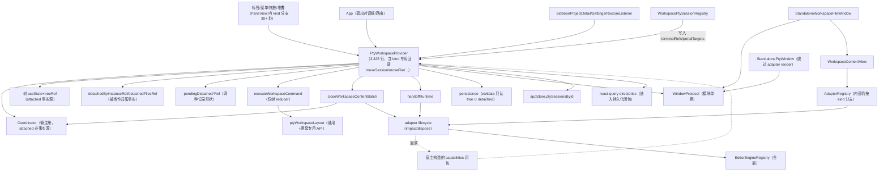
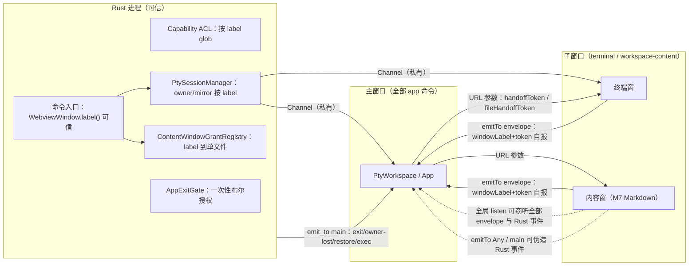
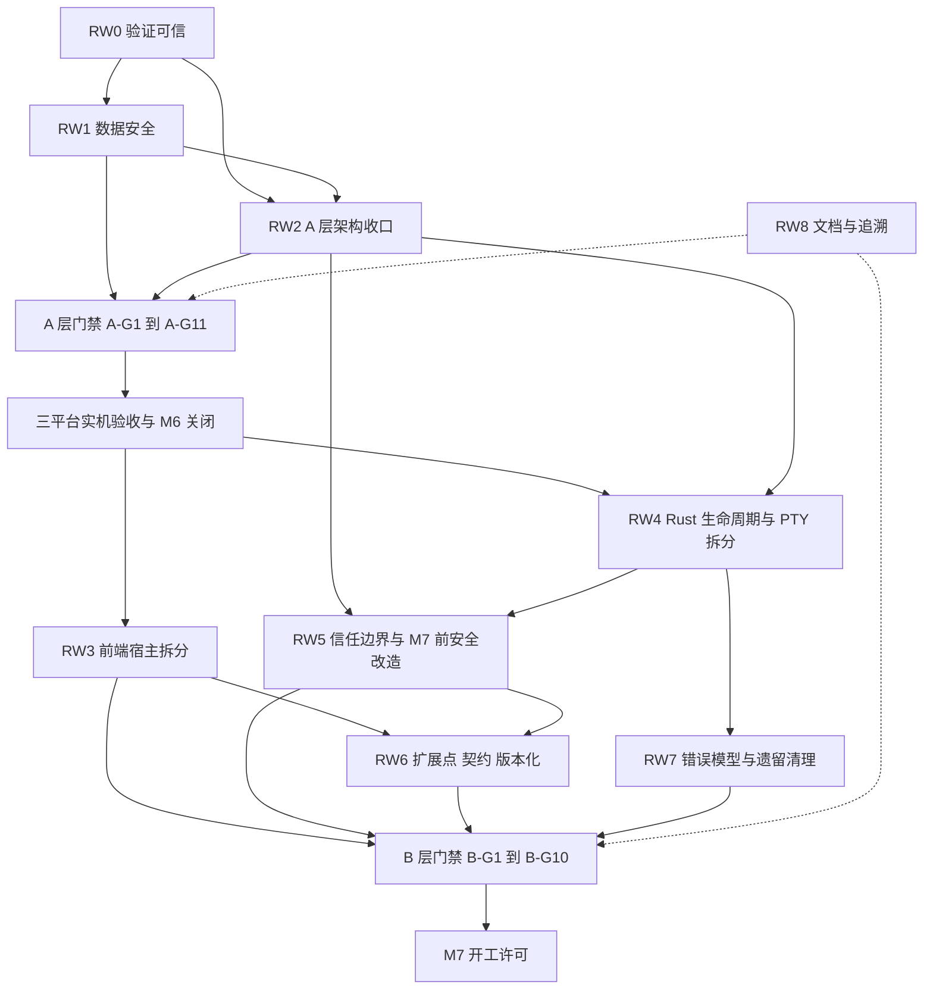

# M6 收口复核报告（第二轮）

> 审查日期：2026-10-06
> 基准提交：`cd4feac`（`main`，工作区干净，本地与 `origin/main` 同步）
> 审查对象：第一轮审查报告提交 `77d8ded` 之后由 Codex 完成的四波修复，即 `77d8ded..cd4feac` 共 20 个提交、240 个文件、+17,167 / −8,291 行
> 适用里程碑：[M6 内容窗格与文件工作区](M6-workspace-files.md)；本报告是 M6 关闭和 M7 开工的强制引用文档，与第一轮报告共同构成收口依据
> 审查性质：只读体检与代码审查。本轮不修改任何生产代码；修复由后续实施按第四章工作包 RW0–RW8 执行
> 配套文档：[M6 收口测试规格](M6-closure-test-spec.md)（逐条可执行的测试补充规格、CI 改进、三平台实机验收清单）；[第一轮审查报告](M6-abstraction-baseline-audit.md)（60 项问题与 WP0–WP8 修复指导）

## 0. 审查说明

### 0.1 目标

第一轮审查（2026-10-05）列出 60 项问题，并要求在 M6 关闭前把四类基础抽象收口：AI CLI Provider 基线（G1/G2）、软件生命周期与主题基线（G3/G4）、窗口内容生命周期基线（M6），以及全仓横切面。Codex 用四波修复宣称已关闭其中绝大多数，并在审查报告与 M6 文档中写入了关闭追溯。

第二轮的目标有三个：

1. **验证关闭声明是否属实**：以代码与测试为准，核对第一轮 60 项的关闭状态，并找出修复本身引入的缺陷和回归。
2. **审查测试体系是否足以支撑关闭声明**：以里程碑的抽象要求为基准，检查三平台测试覆盖，并产出足够细致、不需要实施者再补充调查的测试规格。
3. **以最新代码重新审视架构**：判断边界是否合理、抽象是否顺畅、不同抽象之间是否打架或重复，给出可执行的收口目标。

### 0.2 方法

三步串行审查，后一步以前一步的结论为输入。

| 步骤   | 内容                                                                   | 执行方式                                                                                                                                                                        | 产出                                                                                                                                    |
| ------ | ---------------------------------------------------------------------- | ------------------------------------------------------------------------------------------------------------------------------------------------------------------------------- | --------------------------------------------------------------------------------------------------------------------------------------- |
| 第一步 | 四波修复验收：逐项核实第一轮 60 项的关闭判定，审查增量代码引入的新缺陷 | 4 组并行只读审查：A（WP1/WP2 前端生命周期）、B（WP3/WP6 窗口、权限、主题、注册）、C（WP4/WP8 Provider、线程模型、Rust 退出与 PTY）、D（WP0/WP5/WP7 文件、布局、契约、CI、文档） | 60 项判定表；S1A/S1B/S1C/S1D 共 45 项新发现                                                                                             |
| 第二步 | 测试专项：以里程碑抽象要求为基准，审查三平台测试覆盖，产出测试补充规格 | 2 组并行：E（前端测试）、F（Rust 测试、三平台 CI、实机验收）；读取三平台 CI 日志核实各测试的实际执行情况；用原型验证宿主测试 harness 可行性                                     | 测试盘点、需求追踪矩阵、harness 与 seam 设计、FE-T01–FE-T58、RS-T01–RS-T58、CI 方案、三平台实机清单；FE-NEW 5 项 + T2-N01–T2-N15 新发现 |
| 第三步 | 最新代码的深度架构与抽象审查                                           | 4 组并行：G（前端宿主与内容层）、H（跨窗口、权限、偏好、错误模型）、I（Rust 服务与平台层）、J（跨语言契约与扩展点）                                                             | 架构结论、真实依赖图、抽象冗余与冲突清单 S3G 17 项、S3H 21 项、S3I 33 项、S3J 23 项                                                     |
| 汇总   | 复核 P0/P1 与关键 P2；交叉综合三步结论；写入本报告与测试规格           | 汇总人亲自回到代码核实                                                                                                                                                          | 本报告第四章：根因、工作包、门禁、证据标准、产品决策                                                                                    |

汇总人亲自回到代码或源码复核了全部 P0、全部 P1 以及关键 P2，复核记录见各章的“复核”列。

### 0.3 严重级与门禁分级

- **严重级**：沿用第一轮定义。P0 为安全问题或会静默丢失用户数据；P1 为契约被破坏或生命周期错误导致状态失控、功能不可用；P2 为抽象泄漏、双事实源、边界未收口或文档承诺超出实现；P3 为可维护性问题。
- **S3 系列的 P 级映射**：第三步架构审查只给出 A/B/C 分级，没有逐项给 P 级。汇总人的映射规则是：属于已知缺陷根因的 A/B 级项记为 P2；独立的安全或数据缺陷记为 P1（S3H-A02、S3J-A01、S3J-A02、S3J-A03）；C 级记为 P3。
- **门禁分级**：A/B/C 在第二轮重新定义，见第四章 4.5。A 为 M6 验收前提，B 为 M7 开工前提，C 为后续演进（不阻塞，但必须被工作包认领并登记）。第一轮的 A/B 层定义在第四章说明作废与保留关系。

### 0.4 复核标记

| 标记         | 含义                                                               |
| ------------ | ------------------------------------------------------------------ |
| 亲核         | 汇总人已回到代码、依赖源码或 CI 记录逐条确认机制                   |
| 亲核（源码） | 汇总人已确认触发机制与源码依据，具体时序窗口需要宿主测试或实机复现 |
| 原型实测     | 审查人在原型中实际复现（原型见 closure-prototypes/）               |
| 审查         | 由分项审查给出，附代码位置，汇总人抽查过上下文                     |

### 0.5 阅读指引

| 章节                | 回答的问题                                                                                                                                   |
| ------------------- | -------------------------------------------------------------------------------------------------------------------------------------------- |
| 摘要（本节之后）    | 第二轮的总结论、数字、最高风险、与第一轮的差异                                                                                               |
| 第一章 修复验收判定 | 第一轮 60 项逐项判定；第一步 4 组审查发现的 45 项新问题                                                                                      |
| 第二章 测试专项     | 现有测试的质量问题、需求追踪矩阵、宿主 harness 设计、Ubuntu CAS 失败根因、CI 现状；新增发现                                                  |
| 第三章 架构审查     | 3A：前端宿主与内容层（G）、跨窗口与权限与偏好与错误模型（H）；3B：Rust 服务与平台层（I）、跨语言契约与扩展点（J），其中 3B.14 为扩展成本复核 |
| 第四章 收口路线     | 六个根因、工作包 RW0–RW8、全量问题索引、证据等级标准、A/B 层门禁、实施波次、产品决策（已确认）、风险                                         |
| 测试规格            | 每条测试怎么写：文件、用例名、前置、步骤、断言、预期当前结果、seam、CI 改进、三平台实机清单                                                  |

**Codex 的阅读与执行顺序**：先读摘要和 4.5 门禁，明确要达到什么；再读 4.2 工作包和 4.3 索引，明确做什么；开始每个工作包前，读该工作包引用的第一章/第三章条目和测试规格条目；每完成一个工作包，按 4.4 的格式更新追溯表。`AGENTS.md` 已新增三条项目规则（R-FE-1、R-EV-1、R-RS-1），实施期间必须遵守。

### 0.6 与第一轮报告的关系

本报告不删除、不改写第一轮报告的原有内容，只在第一轮报告末尾追加“第二轮复核”小节，标明哪些关闭判定已被取代。凡两份报告冲突，以本报告为准。第一轮的修复指导（WP0–WP8）仍然有效，但其“已关闭”的追溯记录以本报告 4.3 的状态为准。

## 摘要

### S.1 总结论

**M6 的 A 层门禁和 B 层门禁都没有满足，M6 不能标记为整体验收通过，M7 不能开工。**

主要理由：

1. **当前提交的 CI 是红的。** HEAD（`cd4feac`）的 CI 运行 37437040753 在 Ubuntu 失败，最近 5 次已完成的 Ubuntu 运行中失败 2 次。根因是产品缺陷（cap-std 在 Linux 上的 `canonicalize` 存在 “(deleted)” 竞态），不是测试不稳定。追溯文档引用的却是更早一次的绿色运行（37436033117），不能代表最终提交。
2. **新增 3 项 P0。** 返回独立窗口的过程中布局持久化抛异常导致主窗口整树卸载（S1A-N01）；切换界面语言触发运行期 rehydrate，丢弃未保存编辑并让运行中的 PTY 从界面消失（FE-NEW-01）；macOS 上 Cmd+Q 完全绕过退出门（S1C-N01）。
3. **新增 11 项 P1。** 包括 0.3.0 升级用户的布局永远保存失败且前端无限重试（S3J-A01）、图片预览与更新拒绝原因两处 DTO 字段名漂移导致功能已坏（S3J-A02、S3J-A03）、子窗口可伪造退出请求导致应用无确认退出（S3H-A02）等。
4. **“已关闭”的证据可信度偏低。** 第一轮 60 项中，只有 30 项判定为已关闭，其中 12 项在第一章 1.2 表中被标注“证据偏弱”（需要补强测试的名单见第四章 4.3.3，共 11 项，与前者有 9 项重合）；26 项只部分关闭；3 项引入回归（B3F-F02、B1-F07、B1-F10）；1 项未关闭。追溯文档多处引用纯函数测试，却把结论写成宿主编排层“已满足”；宿主层至今没有任何渲染级测试。
5. **B 层门禁没有达成。** 宿主组件 `PtyWorkspace.tsx` 从 4,619 行增至 5,490 行，kind 分支不降反升；`useFileDocuments`、`usePtySlots` 与领域操作注入表均不存在；按第一轮第 4 节原维度重评，主题的 Registry 与 Bootstrap、Provider 的 Descriptor、共享 registry 工厂仍然缺失；新增 Markdown 预览内容类型仍需改动约 17 个文件、80 多处判别点。
6. **M7 会把若干理论风险变成可利用的攻击面。** 事件层不是信任边界，token 持有即可用；M7 在窗口中渲染 Markdown HTML 之前，必须完成信任边界改造。

### S.2 数字总览

**第一轮 60 项的第二轮判定分布**

| 判定     | 数量 | 说明                                                                                                                     |
| -------- | ---- | ------------------------------------------------------------------------------------------------------------------------ |
| 已关闭   | 30   | 其中 12 项在 1.2 表标注“证据偏弱”；需补宿主或失败路径测试的 11 项名单见 4.3.3（两份名单有 9 项重合）                     |
| 部分关闭 | 26   | 代码或测试、文档只完成一部分                                                                                             |
| 引入回归 | 3    | B3F-F02（返回时持久化崩溃）、B1-F07（上下文解析绕开超时预算）、B1-F10（更新拒绝原因 DTO 字段名漂移，关闭凭手写 fixture） |
| 未关闭   | 1    | B1-F11（Provider 文档偏差，Grok 部分与代码相反）                                                                         |
| 合计     | 60   |                                                                                                                          |

**第二轮新增发现**

| 来源                                     | 条目数  | P0    | P1     | P2     | P3     |
| ---------------------------------------- | ------- | ----- | ------ | ------ | ------ |
| 第一步 S1A（前端生命周期）               | 13      | 1     | 1      | 5      | 6      |
| 第一步 S1B（窗口、权限、主题、注册）     | 12      | 0     | 1      | 4      | 7      |
| 第一步 S1C（Rust 退出、PTY、Provider）   | 7       | 1     | 0      | 3      | 3      |
| 第一步 S1D（文件、布局、契约、CI、文档） | 13      | 0     | 1      | 4      | 8      |
| 第二步 FE-NEW（前端测试专项）            | 5       | 1     | 2      | 2      | 0      |
| 第二步 T2-N（Rust 与 CI 测试专项）       | 15      | 0     | 2      | 4      | 9      |
| 第三步 S3G（前端宿主与内容层）           | 17      | 0     | 0      | 15     | 2      |
| 第三步 S3H（跨窗口、权限、偏好、错误）   | 21      | 0     | 1      | 16     | 4      |
| 第三步 S3I（Rust 服务与平台层）          | 33      | 0     | 0      | 26     | 7      |
| 第三步 S3J（跨语言契约与扩展点）         | 23      | 0     | 3      | 16     | 4      |
| **合计**                                 | **159** | **3** | **11** | **95** | **50** |

说明：

- 159 条是编号条目，包含同一根因在不同层被重复编号的交叉引用（例如 S1A-N01 与 S3G-A01 是同一缺陷的症状与根因；S1D-N01 与 T2-N01 是同一个 CAS 竞态）。全量索引（4.3）在标题中标注“同根因”，并只在一个工作包内实施，避免重复劳动。
- S1B-N01 的子报告原评 P2，汇总人上调为 P1：它使第一轮门禁 5（权限闭环）引用的自动化证据失效。
- 第一步 S1C 另有两项低置信度补充项（S1C-L01、S1C-L02），不计入上表。
- 第二步 T2-N 的编号 T2-N01 至 T2-N15 对应 Rust 与 CI 测试专项报告中的 N1 至 N15。

### S.3 新增 P0 与 P1 清单

| 编号      | 级别 | 问题                                                                                                                                                                                                                                                                                                           | 复核                                  |
| --------- | ---- | -------------------------------------------------------------------------------------------------------------------------------------------------------------------------------------------------------------------------------------------------------------------------------------------------------------- | ------------------------------------- |
| S1A-N01   | P0   | PTY 或文件从独立窗口返回的过程中，持久化只认 `detached` 阶段，returning 阶段的内容既不在树中也不在 `detachedContents` 中，`createWorkspaceLayoutDocument` 抛出 unowned 错误；`persistWorkspaceSnapshot` 无 try/catch，应用根部无 ErrorBoundary，主窗口整树卸载，主窗口内未保存的缓冲随之丢失（同根因 S3G-A01） | 亲核（机制）；原型实测复现            |
| FE-NEW-01 | P0   | `hydrateWorkspace` 依赖 `t`，切换界面语言会触发运行期 rehydrate：buffer 由 `"unsaved edit"` 变回磁盘内容，slots 由 1 变 0，已分离的文件窗口失去主窗口归属，退出预检可能不再提示（同根因 S3G-A05）                                                                                                              | 亲核（依赖链）；原型实测复现          |
| S1C-N01   | P0   | macOS 默认 app 菜单的 Quit 映射到 `terminate:`，tao 0.35.3 只实现 `applicationWillTerminate`、不实现 `applicationShouldTerminate`，Cmd+Q 不产生可阻止的 `ExitRequested`，直接绕过 `AppExitGate`（同 T2-N06 的残余）                                                                                            | 亲核（源码），待 macOS 实机确认       |
| S1A-N02   | P1   | 文件独立窗被销毁或崩溃后，Rust 只撤销授权、不通知主窗口，主窗口也没有任何销毁监听；内容永久孤立，从文件树重新打开会对失效句柄 `setFocus` 失败后直接返回                                                                                                                                                        | 亲核                                  |
| S1B-N01   | P1   | 权限扫描测试 `windowApiPermissions.test.ts` 的 `import.meta.glob` 键名归一化错误，`appPreferencesMain.ts`、`appPreferencesChild.ts`、`workspaceContentWindowProtocol.ts` 三个关键文件从未被扫描，删掉 `core:event:allow-emit-to` 后测试仍通过                                                                  | 亲核（代码）；原型实测                |
| S1D-N01   | P1   | HEAD 的 CI 在 Ubuntu 失败：`separate_processes_using_same_revision_allow_only_one_winner` 间歇失败，根因是 `compare_and_swap_with_adapter` 每次调用 cap-std 的 `Dir::canonicalize`，其 Linux 实现读取 `/proc/self/fd/N`，目标被并发原子替换时解析为 `note.txt (deleted)`（同 T2-N01）                          | 亲核（CI 记录与 cap-primitives 源码） |
| FE-NEW-03 | P1   | 主窗口处理 `workspace-file-window-attached` 时不检查 init 是否已发出，乱序或伪造的 attached 会被接受并提前完成交接（同根因 S3G-A04）                                                                                                                                                                           | 审查                                  |
| FE-NEW-04 | P1   | 备份恢复成功的响应先于 `workspace-data-restored` 事件到达时，用户任一操作都会让旧布局覆盖刚恢复的布局                                                                                                                                                                                                          | 审查                                  |
| T2-N01    | P1   | 同 S1D-N01（Linux CAS “(deleted)” 竞态），由 Rust 测试专项独立发现并给出确定性复现方案                                                                                                                                                                                                                         | 亲核                                  |
| T2-N06    | P1   | macOS Dock 退出、AppleScript quit、系统注销等系统级入口同样绕过退出门（S1C-N01 的残余，见 PD-12）                                                                                                                                                                                                              | 审查（源码推导）                      |
| S3H-A02   | P1   | 子窗口持有 `core:event:allow-emit-to`，可伪造 `app-exit-requested`（`ptyCount: 0`）；主窗口信任载荷，无脏文件时直接调用 `confirm_app_exit`，后者无条件终止全部 PTY 并退出                                                                                                                                      | 亲核                                  |
| S3J-A01   | P1   | 0.3.0 用户布局行的 `schema_version` 列为 1，读取时在内存迁移到 v5，保存时 `save_current` 严格比较列值与 5，恒为不相等，返回 `saved:false`；前端保存队列无限重试，布局改动永不落盘，`reset_current` 又拒绝重置可读布局，用户无法自救                                                                            | 亲核                                  |
| S3J-A02   | P1   | `ProjectFileOpenResult::Image` 缺少 `rename_all_fields = "camelCase"`，Rust 输出 `mime_type`/`base64_data`，前端读 `mimeType`/`base64Data`，图片预览生成 `data:undefined;base64,undefined`                                                                                                                     | 亲核（源码）；审查人 serde 实测       |
| S3J-A03   | P1   | `ManagedUpdateStatus::Denied` 缺少同一属性，输出 `reason_key`，设置页渲染 `t(undefined)`；第一轮 B1-F10 正是凭手写 camelCase fixture 判定关闭                                                                                                                                                                  | 亲核（源码）                          |

### S.4 六个跨层根因（一段话版）

1. **同一事实存放多处，且只有“名字集合”被管住。** tool key、命令名、窗口类别、内容 kind 已有契约清单和测试，但状态、形状和版本没有单一来源：生命周期阶段到持久化位置的投影有六种口径，PTY 运行状态在内存与数据库各有一份，布局版本在列与 payload 各有一份，DTO 字段名由 Rust 与 TS 各自手写。
2. **业务动作由 React effect 依赖驱动。** hydrate、持久化、跨窗监听挂在含 `t`、查询数据或派生 Set 身份的依赖数组上，全仓 24 个 hook 依赖 `t`，语言切换会重建业务状态。
3. **没有统一的生命周期协调者。** 前端没有真正的命令执行器（`executeWorkspaceCommand` 只是树 reducer），Rust 没有 `AppLifecycle`；退出、恢复、窗口销毁、执行任务各自零散实现，第一轮的“五出口”原则在新代码里又出现了缺口。
4. **事件层不是信任边界。** 事件不带发送方身份，窗口级 listen 也可被全局 listen 窃听，`allow-emit-to` 可指向任意窗口，交接 token 持有即可用；M7 渲染 Markdown 后会从理论风险变成攻击面。
5. **测试只证明零件，不证明装配。** 282 项前端测试几乎都在纯函数层，宿主层零集成测试；tauriMock 的事件语义与真实 Tauri 相反；DTO 测试使用手写 fixture；权限扫描测试实际漏扫。新增回归全部落在这个盲区。
6. **追溯流程失真。** 关闭证据只要求“有测试”，没有要求证明了什么、在哪个提交上、在哪个平台运行过；追溯表夸大了完成度，HEAD 红灯时仍写三平台通过。

### S.5 三条基线的第二轮成熟度

按第一轮第 4 节原定的七个维度重新评定。“满足/部分/缺失”的依据与第一轮第 10 节自评表（换用了另一套维度）无关。

| 维度       | Provider（G1/G2）                                                                                                                 | 生命周期与主题（G3/G4）                                                                                                                           | 窗口内容（M6）                                                                                                                      |
| ---------- | --------------------------------------------------------------------------------------------------------------------------------- | ------------------------------------------------------------------------------------------------------------------------------------------------- | ----------------------------------------------------------------------------------------------------------------------------------- |
| Descriptor | **缺失**：trait 只有 `tool_key()`，没有 descriptor 与 apiVersion；能力散在 `version_service` 与前端元数据两处（S3J-A15、S3I-A28） | **部分**：`ThemeDefinition` 存在但主题 id 与 base 混用、`labelKey`/`monacoTheme` 为封闭联合；窗口类别有 JSON 描述但缺角色属性（S1B-N08、S3H-A07） | **部分**：有 `id`、`apiVersion: 2`、kind，无能力声明；kind 是封闭联合类型（S3G-A10）                                                |
| Registry   | **部分**：编译期穷尽 `match` 加 TS `Record`，封闭设计合理；`ALL` 手写，Rust 新增变体漏检（S1D-N07）                               | **缺失**：主题只有 `THEMES` 常量，没有 register/list/subscribe；两个 TS 注册表各自重复实现（S3J-A10）                                             | **部分**：register/unregister/tryGet/subscribe 完备，缺 `list()`；与编辑器引擎注册表重复实现（S3J-A10）                             |
| Bootstrap  | **满足**：编译期完成                                                                                                              | **部分**：内容 adapter 与引擎已由 `registerBuiltinContributions` 显式 bootstrap；主题无 bootstrap；版本不符会使整个 bootstrap 中断（S3J-A11）     | **满足**：`main.tsx` 在渲染前统一调用，幂等；版本不符中断整体是 S3J-A11 的问题                                                      |
| 生命周期   | **部分**：公共服务持有，但路径解析、超时分散在 5 个模块；Codex app-server 绕过 `ProcessTree`（S3I-A18/A19、S1C-N04）              | **部分**：偏好单一写入方，但已解析主题有两个产出方；退出门漏统计文件（已修）与执行任务；`t` 依赖导致监听重建（S3H-A09、A13、A16）                 | **部分（含 P0）**：coordinator 懒注册；窗口句柄表被当作归属事实；returning 持久化崩溃；文件窗销毁无回收（S3G-A01/A03、S1A-N01/N02） |
| 上下文注入 | **部分**：`AdapterContext` 已有，但构造同步并绕开预算；Claude/Codex/Antigravity 的 `build_plan` 忽略注入的路径（S1C-N02、B1-F14） | **部分**：Shell 已承担 Toaster 与右键屏蔽，主题消费者统一用 `useResolvedTheme`；但文件 adapter 自取全局主题（S3J-A17）                            | **缺失**：handoff 钩子只是回环转发宿主闭包；上下文按 kind 开固定槽位；宿主 kind 分支未降反升（S3G-A10、S1A-N06）                    |
| 错误隔离   | **部分**：panic 与 JoinError 隔离到位；超时多层叠加，会话归属校验无超时（T2-N15、S3I-A19）                                        | **部分**：`setTheme` 失败仅 `console.warn`；未知窗口类别渲染空白窗口；Rust 对未知 id `expect` panic（S3J 4.1）                                    | **部分**：内容 render 有 ErrorBoundary，但已知 kind 的占位关闭无效；`presentation` 无隔离；根部无 ErrorBoundary（S1A-N04、S3J-A17） |
| 契约测试   | **部分**：tool key 与 SQL 种子有测试；`ALL` 手写漏检；Rust 与 TS 之间没有能力契约；DTO 无测试（S1D-N07、S3J-A05）                 | **部分**：window-kinds 与 capability 有契约，但跳过插件与对象权限；权限扫描测试实际失效（S1B-N01、S1B-N02）                                       | **部分**：纯函数测试充分，宿主零集成测试；kind 白名单在多处存在副本（S3J-A07、J3）                                                  |

### S.6 与第一轮结论的差异

下列第一轮结论被本轮推翻或修正。第一轮报告的原文不改，本报告 4.3 的状态取代它们。

| 序号 | 第一轮结论                                                                                                                                                                | 第二轮修正                                                                                                                                                                                                                                                                                                                                            | 依据                          |
| ---- | ------------------------------------------------------------------------------------------------------------------------------------------------------------------------- | ----------------------------------------------------------------------------------------------------------------------------------------------------------------------------------------------------------------------------------------------------------------------------------------------------------------------------------------------------- | ----------------------------- |
| 1    | 第一轮第 10 节“收口后扩展点成熟度复核”：七个维度不再有“缺失”，B 层门禁 4 达成                                                                                             | 复核表换用了另一套维度（契约声明、注册一致性、能力与权限等），与第 4 节原定维度不同。按原维度重评，主题 Registry 与 Bootstrap、Provider Descriptor、共享 registry 工厂仍缺失；门禁 4 不成立                                                                                                                                                           | S3J-A04                       |
| 2    | B3F-F07 追溯：A 部分已交付，宿主命令通过统一执行器收口                                                                                                                    | `executeWorkspaceCommand` 的签名是 `(tree, command) → WorkspaceNode`，只是纯树 reducer，不触碰 coordinator、adapter 和领域操作；kind 分支在审查口径下由 29 增至 44，基线固化口径（FE-T56 的正则）为 58；九个 kind 专用树 API 无生产调用方；拖放载荷仍写旧格式                                                                                         | S3G-A02、S1A-N06、S1A-N09     |
| 3    | X-F02 追溯：前端以 `formatAppError` 按错误码本地化，四个领域已无 `String(reason)`                                                                                         | 前端确实已无 `String(reason)`，但后端在四个领域几乎不发码：前端映射约 18–19 个码，其中 8 个（`file.conflict`、`file.identity_changed`、`pty.owner_mismatch`、`pty.handoff_expired`、`pty.input_backpressure`、`exec.plan_changed`、`exec.busy`、`layout.needs_reset`）后端从不产出；命名风格点分与下划线并存；`file.not_found` 被用于“项目目录不存在” | S1B-N03、S3H 6.1、FE-T29      |
| 3a   | B1-F10 追溯：前后端更新状态已统一为三态 DTO                                                                                                                               | 后端从不产出 `notApplicable`；`Denied` 的 `reason_key` 序列化后前端读不到；关闭依据 `tools.test.ts` 使用手写 camelCase fixture，不可能失败                                                                                                                                                                                                            | S3J-A03、S1C-N07              |
| 4    | 门禁 8：三平台 CI 在最终提交上通过                                                                                                                                        | HEAD（`cd4feac`）的 CI 运行 37437040753 在 Ubuntu 失败；追溯文档引用的是更早的运行 37436033117（`9550e08`）；`a674462` 只补了诊断输出，没有修复                                                                                                                                                                                                       | S1D-N01                       |
| 5    | B2-F01、B3F-F02、B3F-F03、B3F-F06 要求的“宿主集成测试”已满足                                                                                                              | 宿主集成测试 0 个，所引用的证据全部来自纯函数层；B3F-F03 追溯所引用的测试用例名与内容不符（没有构造布局或代次）；`WorkspaceDataRestoreListener.test` 只测 mock，不能证明“恢复后 revision 一致”                                                                                                                                                        | 第二章 Q4、Q5、FE-T10、FE-T16 |
| 6    | B3F-F13 追溯：监听使用 `allSettled`；B1-F14 追溯：计划通过上下文接收依赖；B1-F15 追溯：适配器专属测试已迁回各自模块；WP8 追溯：数据库与文件 I/O 命令通过 `spawn_blocking` | 两个子窗口仍用 `Promise.all`；Claude、Codex、Antigravity 的 `build_plan` 忽略注入的路径；约 25 个适配器专属测试仍留在 `session_service`；仍有约 40 个同步命令跑在主线程，其中 26 个访问数据库                                                                                                                                                         | S1A-N10、S1C 表、S3I 3.2      |
| 7    | B2-F01 追溯：未授权时一定阻止退出                                                                                                                                         | 证据是 `AppExitGate` 的单测，`handle_run_event` 与 `on_window_event` 没有测试；`app.exit(0)` 能被 `prevent_exit` 阻止的结论没有书面记录；macOS 系统级入口绕过；退出影响未统计执行任务；子窗口可伪造退出请求                                                                                                                                           | S1C-N01、S3H-A02、S3H-A13     |
| 8    | 布局 schema 版本表述（追溯中多处写 v4）                                                                                                                                   | 当前布局 schema 为 v5（v4 引入 `detachedContents`，v5 引入未知 kind 信封），追溯与注释中的版本号需统一；更严重的是布局版本在数据库列与 payload 各有一份，造成 0.3.0 升级用户保存失败                                                                                                                                                                  | S3J-A01、S1D 总评             |
| 9    | 第一轮“M6 复审未发现其他需阻断的 P1/P2 问题”                                                                                                                              | 第一轮已被更正；本轮进一步确认存在 3 项 P0、11 项 P1                                                                                                                                                                                                                                                                                                  | 第一章至第三章                |
| 10   | WP7 追溯：Grok 路径复核、Hermes 执行前复核的文档已与代码一致                                                                                                              | `docs/milestones/grok-build-cli.md:71` 与 `architecture.md:484` 仍保留“生成计划阶段复核安装路径”，与代码（只信任 `installer=internal`）相反；`architecture.md:485` 又把 Hermes 写成“不做执行前复核”，与代码相反；外部终端相关章节仍写“已实现、保留”                                                                                                   | S1D-N02、S1D-N03、S1D-N06     |

## 第一章 修复验收

本章回答一个问题：Codex 按 `M6-abstraction-baseline-audit.md`（以下简称“原报告”）完成的四波修复，是否真的关闭了原报告的 60 项问题，以及修复本身有没有引入新的缺陷。

复核基线：`77d8ded..cd4feac`（20 个提交，240 个文件）。四个并行审查（A：WP1/WP2 前端生命周期；B：WP3/WP6 窗口、权限、主题、注册；C：WP4/WP8 与 WP1 的 Rust 部分；D：WP0/WP5/WP7 与布局 v5 的 Rust 部分）逐项对照代码与测试给出判定，汇总人对其中的 P0/P1 与关键 P2 回到代码做了亲自复核（见 1.4）。判定一律以代码和可复现的测试为准，不以追溯文字为准。

引用说明：

- **复核标记**：“亲核”表示汇总人已回到代码、源码或 CI 记录逐条确认；“审查”表示由分项审查给出并附位置，汇总人抽查过上下文；“审查（已实测）”表示分项审查在临时目录里写了可运行的探针并得到结果。
- **测试规格编号**：`FE-T**`、`RS-T**`、`CI-**`、`FE-SEAM-*`、`SEAM-*` 均指 `M6-closure-test-spec.md` 中的条目。标注“待补”的，表示规格文档里还没有对应条目，需要在实施时补写。
- **新增问题编号**：`S1A/S1B/S1C/S1D-N**` 是第一步（修复验收）发现的问题；`S3G/S3H/S3I/S3J-A**` 是第三步（架构审查）发现的问题，详见第三章。

### 1.1 总览

#### 1.1.1 判定统计

原报告共 60 项问题（P0 1、P1 7、P2 38、P3 14）。另有 Codex 在修复过程中自行新增并关闭的 `J4`（Windows 文件替换 ACL 继承，提交 `dd99bab`），不计入这 60 项，在 1.2 末尾单列。

| 原级别   | 项数   | 已关闭 | 部分关闭 | 未关闭 | 引入回归 |
| -------- | ------ | ------ | -------- | ------ | -------- |
| P0       | 1      | 0      | 1        | 0      | 0        |
| P1       | 7      | 3      | 3        | 0      | 1        |
| P2       | 38     | 19     | 16       | 1      | 2        |
| P3       | 14     | 8      | 6        | 0      | 0        |
| **合计** | **60** | **30** | **26**   | **1**  | **3**    |

核对：30 + 26 + 1 + 3 = 60，与原报告第 5 节总表的 60 个编号一一对应（1.2 逐项列出，没有遗漏）。

各类判定的含义：

- **已关闭**：代码按原报告第 6 节步骤实现，且存在能在漂移时失败的测试，或证据虽偏弱但没有发现功能缺陷。已关闭的 30 项里，至少 12 项带有“证据偏弱”限定（只有纯函数测试、测试名不副实、测试只验证 mock、守护不足）：`B3F-F03`、`B1-F12`、`B3R-F03`、`B1-F03`、`B1-F04`、`B2-F07`、`B3F-F06`、`B3F-F12`、`B3F-F08`、`B3R-F06`、`X-F07`、`B3R-F07`。它们在 1.2 里写明了缺口，补测试规格即可，不需要重做代码。
- **部分关闭**：主干已实现，但原报告要求的某个步骤、某条验收或某个平台没有完成，或存在需要单独修复的缺口。
- **未关闭**：只有 `B1-F11`（文档偏差，Grok 与 Hermes 两处仍与代码相反）。
- **引入回归**：修复本身带来了新缺陷，且该缺陷落在原问题的功能范围内：`B3F-F02`（返回流程触发持久化异常）、`B1-F07`（预算之外同步解析路径）、`B1-F10`（DTO 字段名漂移，原因文案为空）。

另外要说明的是：原报告第 1 节曾把 P0 定为 `B2-F01`。修复后该项只关闭了“PTY 与脏文件在多数退出路径上被拦截”的部分，macOS 上 Cmd+Q 完全绕过退出门（`S1C-N01`），所以仍判为部分关闭，并且新增了一个独立的 P0。

#### 1.1.2 第一步新发现的统计

| 级别 | 数量 | 编号                                                                                         |
| ---- | ---- | -------------------------------------------------------------------------------------------- |
| P0   | 2    | `S1A-N01`、`S1C-N01`                                                                         |
| P1   | 2    | `S1A-N02`、`S1D-N01`                                                                         |
| P2   | 17   | `S1A-N03`~`N07`（5）、`S1B-N01`~`N05`（5）、`S1C-N02`/`N05`/`N06`（3）、`S1D-N02`~`N05`（4） |
| P3   | 24   | `S1A-N08`~`N13`（6）、`S1B-N06`~`N12`（7）、`S1C-N03`/`N04`/`N07`（3）、`S1D-N06`~`N13`（8） |

合计 2 + 2 + 17 + 24 = 45，与四份报告的 A 13、B 12、C 7、D 13 一致。

四份报告共 45 项新发现（A 13、B 12、C 7、D 13），1.3 全部逐条列出。第三步的架构审查和第二步的测试专项又补充了若干问题，其中与本章直接相关、且已由汇总人亲核的有：`S3J-A01`（0.3.0 升级用户的布局永远保存失败，P1）、`S3J-A02`/`S3J-A03`（两处 DTO 字段名漂移，功能已坏，P1）、`S3H-A02`（子窗口可伪造退出请求，B 级安全）、`FE-NEW-01`（切换语言触发工作区 rehydrate，P0）。这些在第二章、第三章展开，1.4 记录它们的核实方法。

#### 1.1.3 追溯文档夸大完成度的四个典型模式

1. **纯函数证据冒充宿主证据。** 原报告第 6 节对 `B2-F01`、`B3F-F02`、`B3F-F03`、`B3F-F06` 等明确要求“宿主集成测试”（拖回非源 pane、保存中应用布局、flush 超时按脏处理、混合关闭否决）。实际这些测试一个都不存在：`PtyWorkspace.tsx`（5,490 行）没有任何渲染级测试，证据全部来自 `workspaceContentClose.test.ts`、`ptyWorkspaceLayout.test.ts` 这类纯函数测试。回归（`S1A-N01`）正好出在两者之间的“装配层”。
2. **引用不存在或修复前就已存在的测试。** 例如 `B1-F05` 追溯引用的 `each_cli_rejects_unsafe_session_ids` 在代码里已不存在（拆成了各 adapter 的 `rejects_unsafe_*`）；`B3F-F04` 追溯引用的 `closes when Rust confirms that the PTY no longer exists` 等在 `77d8ded` 时就已存在，真正新增的 `uses backend ownership…` 没有被引用；WP5 追溯引用的 `workspace_layout_migrates_v3_detached_slots_to_v4_content_refs` 现已改名为 v5 版本。
3. **HEAD 的 CI 是红的，追溯却引用更早的绿色运行。** 原报告第 8 节门禁 8、第四波小节引用的是 `9550e08` 的 run 37436033117（三平台绿）；而最终提交 `cd4feac` 的 run 37437040753 在 Ubuntu 上失败（跨进程 CAS 测试，`S1D-N01`）。最近 5 次已完成的 Ubuntu 运行中失败 2 次。这违反原报告自己定下的追溯规则 P-6（“最终门禁表必须引用本次执行的 CI run”）。
4. **门禁 4 换维度自评。** 原报告第 4 节的“7 维度”是 Descriptor、Registry、Bootstrap、生命周期、上下文注入、错误隔离、契约测试；第 10 节的“成熟度复核”换成了“契约声明、注册一致性、能力与权限、生命周期所有权、错误隔离、测试证据、文档一致性”，并据此判定“不再有缺失”。按原维度，主题的 Registry 与 Bootstrap、Provider 的 Descriptor、共享注册表工厂仍然缺失，门禁 4 不能判定通过（`S3J-A04`）。

此外，追溯文档还有两类较轻的问题：测试名与测试内容不符（`B3F-F03` 的 `keeps a save completion after layout invalidates only load generations` 没有构造任何布局或代次）；已经过时的“待 CI”状态没有更新（FIFO、权限保留测试实际已在 macOS/Ubuntu 执行）。

### 1.2 原 60 项逐项复核表

表中“原声明状态”取自原报告各波“实施追溯”小节和第 8 节的表述；“第二轮判定”以 A/B/C/D 四份报告为准，与汇总人亲核结果不同的，在“剩余缺口”列说明。路径与行号对应 `cd4feac`。

#### P0

| 编号     | 原级别 | 原声明状态          | 第二轮判定   | 关键证据                                                                                                                                                                                                                                                                                                                                                                                                                                                                                     | 剩余缺口或关联新问题                                                                                                                                                                                                                                                                                                       |
| -------- | ------ | ------------------- | ------------ | -------------------------------------------------------------------------------------------------------------------------------------------------------------------------------------------------------------------------------------------------------------------------------------------------------------------------------------------------------------------------------------------------------------------------------------------------------------------------------------------- | -------------------------------------------------------------------------------------------------------------------------------------------------------------------------------------------------------------------------------------------------------------------------------------------------------------------------- |
| `B2-F01` | P0     | 第 1 波自动化已关闭 | **部分关闭** | `src/App.tsx:154-185`；`src/components/PtyWorkspace.tsx:3361-3466`；`src/lib/appExitImpacts.ts`；`src-tauri/src/services/app_lifecycle.rs:9-17`；`src-tauri/src/lib.rs:356-378`；测试 `appExitImpacts.test.ts`、`workspaceFileExitFlush.test.ts::treats a child that does not acknowledge within 500ms as unavailable`、`exit_authorization_is_consumed_exactly_once`。C 对照 `tauri-runtime-wry-2.11.2/src/lib.rs:4361-4371` 确认 `app.exit(0)` 的 `ExitRequested` 可被 `prevent_exit` 阻止 | `S1C-N01`（macOS Cmd+Q 绕过退出门，P0）；`S1A-N03`（静默退出失败后对话框卡死）；`S1A-N07`（flush 是否发出由句柄表决定）；`handle_run_event` 无测试；报告要求的“全部保存后退出”未实现；退出对话框与关闭对话框未共用；退出影响不含执行任务（`S3H-A13`）；退出请求无 requestId（`S3H-A02`）；宿主集成测试不存在（FE-T10~T13） |

#### P1

| 编号               | 原级别 | 原声明状态               | 第二轮判定                   | 关键证据                                                                                                                                                                                                                                                                                                                    | 剩余缺口或关联新问题                                                                                                                                                                                                                            |
| ------------------ | ------ | ------------------------ | ---------------------------- | --------------------------------------------------------------------------------------------------------------------------------------------------------------------------------------------------------------------------------------------------------------------------------------------------------------------------- | ----------------------------------------------------------------------------------------------------------------------------------------------------------------------------------------------------------------------------------------------- |
| `B1-F01`           | P1     | 已关闭                   | **已关闭**                   | `src-tauri/src/models/install.rs:51-61`；`commands/execution.rs:10-25`；`services/install_service.rs:55-60`；测试 `changed_install_plan_is_rejected_before_execution` 与指纹稳定、指纹变化测试；`execution_plan` 已删除                                                                                                     | 指纹不含 `effects`（P3）；`installPlanConfirmation.test.ts` 只测 happy path（FE-T51）                                                                                                                                                           |
| `B3F-F02`          | P1     | 已关闭                   | **引入回归**                 | 树操作本身正确：`src/lib/workspaceContentCommand.ts:95-105`、`ptyWorkspaceLayout.ts:577-588`；但持久化只认 `detached` 阶段：`workspaceLayoutPersistence.ts:207-326`、`PtyWorkspace.tsx:521-528`；证据全是纯函数测试                                                                                                         | `S1A-N01`：返回进行中的内容既不在树里也不在 `detachedContents`，持久化抛异常，主窗口整树卸载；`S1A-N13`（先改树后 `completeHandoff`）；拖回非源 pane、分离中应用布局、重启 hydration 的宿主测试均不存在（FE-T05/T14/T15）                       |
| `B3F-F03`          | P1     | 已关闭                   | **已关闭（代码）；测试不足** | `PtyWorkspace.tsx:1163-1198`；`src/lib/workspaceFileBuffer.ts:117-128`                                                                                                                                                                                                                                                      | `workspaceFileBuffer.test.ts::keeps a save completion after layout invalidates only load generations` 未构造布局或代次，名不副实；“保存中×（应用布局/关闭/重载/分离）”四个宿主测试与不变量工具函数缺失（FE-T16）                                |
| `B3F-F04`          | P1     | 已关闭                   | **部分关闭**                 | 前端 `src/lib/ptySessionLifecycle.ts`（`resolveDetachedStartTimeoutAction`）、`PtyWorkspace.tsx:1957-2064`；Rust `src-tauri/src/services/pty_session_service.rs:785-809,1570-1583`                                                                                                                                          | `finalized_handoff_rejects_source_cancel_and_reports_child_owner` 只构造 `EventRoute` 调辅助函数，没有执行 finalize→cancel；`window_status` 不带 owner label（`S1C-N05`）；状态查询失败时每秒无限重试（FE-T41）；追溯引用的是修复前已有的旧测试 |
| `B3R-F01`          | P1     | 已关闭                   | **已关闭**                   | `src-tauri/src/platform/path_rules.rs:3-45`；`services/project_directory.rs:44-66`；`services/file_service.rs:330-345`（跳过非 UTF-8 并累计 `skippedCount`）；测试 `unix_lists_and_opens_colon_backslash_and_unicode_file_names`（macOS、Ubuntu 均执行）、`listing_skips_non_utf8_names_and_reports_the_count`（仅 Ubuntu） | `S1D-N08`（控制字符文件名文件服务允许而布局拒绝）；“macOS 拒绝创建非 UTF-8 文件名”只写在文档里、无测试（RS-T41）                                                                                                                                |
| `B3R-F02`          | P1     | 已关闭（三平台 CI）      | **部分关闭**                 | `src-tauri/capabilities/*.json` 已补 `allow-set-theme`，主窗已补 `allow-set-focus`；`src/hooks/useThemeSync.ts:48-52`；`PtyWorkspace.tsx:944`                                                                                                                                                                               | 失败处理只有 `console.warn`，未按报告要求写入诊断日志；权限对照测试实际失效（`S1B-N01`）；`setTheme` 传入主题 id 而非 base（`S1B-N08`）                                                                                                         |
| `J2`               | P1     | 已关闭                   | **部分关闭**                 | `.github/workflows/ci.yml:22-89`（三平台矩阵，`fail-fast: false`，五步门禁）；`release.yml:64-67` 通过 `workflow_call` 复用                                                                                                                                                                                                 | **HEAD `cd4feac` 的 run 37437040753 在 Ubuntu 失败**（亲核，`S1D-N01`）；并发组可能误取消（`S1D-N10`）；缺平台测试清单校验与 flaky 探针（CI-01~CI-05）；三平台实际执行数：Windows 297、Ubuntu 298、macOS 296                                    |
| `J4`（Codex 新增） | P1     | 已关闭（不在原 60 项内） | **已关闭**                   | 提交 `dd99bab`：显式 ACE 保留、非保护 DACL 重新继承、`FileRenameInfoEx` 替换；4 个 Windows 测试                                                                                                                                                                                                                             | `docs/architecture.md:79` 仍写 `ReplaceFileW`（`S1D-N04`）；SMB/UNC 实机未验（W-17）                                                                                                                                                            |

> `J4` 的位置放在 P1 表末尾是为了便于对照；它不计入 60 项统计。

#### P2

| 编号      | 原级别 | 原声明状态               | 第二轮判定                                         | 关键证据                                                                                                                                                                                                                              | 剩余缺口或关联新问题                                                                                                                                                                                                                                     |
| --------- | ------ | ------------------------ | -------------------------------------------------- | ------------------------------------------------------------------------------------------------------------------------------------------------------------------------------------------------------------------------------------- | -------------------------------------------------------------------------------------------------------------------------------------------------------------------------------------------------------------------------------------------------------- |
| `B1-F02`  | P2     | 已关闭                   | **已关闭**                                         | `commands/install.rs:54,97-114`；`failed_refresh_does_not_rewrite_the_cached_timestamp_or_error`                                                                                                                                      | 合并旧缓存时不恢复 `managed_update`（关联 `S1C-N07`）                                                                                                                                                                                                    |
| `B1-F03`  | P2     | 已关闭                   | **已关闭**                                         | `services/cli_adapters/mod.rs:121-130`；`execution_validation_runs_even_without_a_preflight_message`                                                                                                                                  | —                                                                                                                                                                                                                                                        |
| `B1-F04`  | P2     | 已关闭                   | **已关闭**                                         | `resume_args`、`command_candidates` 改为必须实现；`adapter_resume_errors_fail_closed`                                                                                                                                                 | 该测试只证明测试里自建的 adapter 自己 `bail!`（同义反复），没有断言“恢复失败不启动新会话”；`launch_service` 的校验顺序（RS-T24）                                                                                                                         |
| `B1-F05`  | P2     | 已关闭                   | **部分关闭**                                       | `services/session_service.rs:424-431`；`cli_adapters/mod.rs:276-282`；各 adapter `rejects_unsafe_*`                                                                                                                                   | 前导 `-` 两层都拒绝了，但报告要求“已知 UUID 格式的 CLI 一律按 UUID 校验”，Claude 与 Codex 没做（RS-T25）；追溯引用的 `each_cli_rejects_unsafe_session_ids` 已不存在                                                                                      |
| `B1-F06`  | P2     | 已关闭                   | **已关闭**                                         | `commands/cli_status.rs:8-38`；`src/hooks/useCliStatus.ts`；`status_cache_keys_are_isolated_per_tool`                                                                                                                                 | `useCliStatus.test.ts` 只测注入的 helper，事件接线未测（FE-T49）                                                                                                                                                                                         |
| `B1-F07`  | P2     | 已关闭                   | **引入回归**                                       | `session_service.rs:103-106,135-140`；`cli_adapters/mod.rs:27-35`；`stalled_search_adapter_is_marked_incomplete_within_budget` 只测辅助函数                                                                                           | `S1C-N02`：`AdapterContext` 每次先同步解析可执行文件路径（`where.exe`），在超时预算之外串行执行；会话归属校验仍无超时（RS-T55）                                                                                                                          |
| `B1-F08`  | P2     | 已关闭                   | **部分关闭**                                       | `src-tauri/src/platform/process.rs:26-226`；services 里已无 `CREATE_NO_WINDOW`、`Command::new`                                                                                                                                        | Windows 超时测试只断言耗时，不断言孙进程被结束（RS-T27）；`codex/app_server.rs:36-42` 未用 `ProcessTree`（`S1C-N04`）；`run_bounded` 先 spawn 后 attach 存在理论逃逸窗口（F 的 N8，P3）                                                                  |
| `B1-F09`  | P2     | A 测试、B 迁移均已关闭   | **已关闭**                                         | `src-tauri/migrations/0014_tool_key_foreign_keys.sql`（索引与触发器先删后重建）；`db/connection.rs:494-594`、`160-177`；`contracts.rs:36-47`；0.2.4 schema 8 升级与旧备份恢复测试                                                     | 缺“迁移后插入未知 tool_key 被外键拒绝”的负向测试（RS-T26）；Rust `ALL` 手写，新增变体检测不到（`S1D-N07`）                                                                                                                                               |
| `B1-F10`  | P2     | B 层已关闭               | **引入回归**（以汇总人亲核为准；C 原判“部分关闭”） | `models/install.rs:68-73`（`Denied { reason_key }` 缺 `rename_all_fields`）；`src/views/SettingsView.tsx:708` 渲染 `t(undefined)`；`services/version_service.rs:44-75`                                                                | 汇总人亲核 `S3J-A03`：DTO 字段名漂移，追溯依据 `tools.test.ts:64` 是手写 camelCase fixture；C 另指出后端从不产出 `notApplicable`、Grok/Hermes 查询失败被误报为 Denied（`S1C-N07`）                                                                       |
| `B1-F11`  | P2     | 已关闭（WP7）            | **未关闭**                                         | Grok：`grok/common.rs:73-80`、`grok/version.rs:40-42` 与 `docs/milestones/grok-build-cli.md:71`、`docs/architecture.md:484` 相反；Hermes：`hermes/common.rs:95-99` 与 `architecture.md:485` 相反                                      | `S1D-N02`、`S1D-N06`；附录 B 标注“需产品确认”但没有确认记录；产品决策见第四章                                                                                                                                                                            |
| `B1-F12`  | P2     | 已关闭                   | **已关闭（测试偏弱）**                             | `services/execution_service.rs:63-78,151-199,215-222`；`completion_persistence_failure_still_releases_the_tool_slot`、`active_task_guard_releases_slots_after_early_return_and_panic`                                                 | 测试直接调 guard 与 `release_before`，没有在 `run_task` 层断言 panic 产生的 `JoinError` 会走到 `finish_failed`（RS-T21）                                                                                                                                 |
| `B2-F03`  | P2     | 已关闭                   | **已关闭**                                         | `src/lib/appPreferences*.ts`；`appStore.ts` 的 `applyRemoteThemeMode`（不写 localStorage）；`useThemeSync.test.tsx::requests and applies initial preferences in %s`（两类子窗，断言无 `setItem`）                                     | 主窗广播与“接收方不回写”的单测仍缺（FE-T53）                                                                                                                                                                                                             |
| `B2-F04`  | P2     | B 层已关闭               | **部分关闭**                                       | `useThemeSync.ts:36-41`；`src/hooks/useResolvedTheme.ts`；生产代码已无观察 `data-theme` 的 MutationObserver                                                                                                                           | 架构文档未定义 `ResolvedTheme`（报告第 3 步）；`appStore.ts:39-45` 初始化处还有第二处解析                                                                                                                                                                |
| `B2-F06`  | P2     | 已关闭                   | **已关闭**                                         | `WorkspaceContentWindowShell.tsx:32,89`；`useWindowLevelBehaviors.ts`；`WorkspaceContentWindowShell.test.tsx::owns notifications…`                                                                                                    | 文件窗里 Monaco 自带右键菜单与全局 `preventDefault` 是否冲突需实机确认（低置信度）                                                                                                                                                                       |
| `B2-F07`  | P2     | 已关闭                   | **已关闭（主路径）**                               | `StandaloneWorkspaceFileWindow.tsx:446-469`；`WorkspaceContentWindowShell.tsx:47-52`；`src/lib/workspaceFileWindowSetup.ts`                                                                                                           | 主窗口回滚与“重复 ready”无测试；子窗监听仍用 `Promise.all`（`S1A-N10`）；A 附注：收到 init 到 attach 完成之间关闭窗口，可能先发 attach-failed 再发 attached（建议并入 FE-T40）                                                                           |
| `B2-F08`  | P2     | 已关闭                   | **已关闭**                                         | `src/bootstrap/registerBuiltinContributions.ts`；`src/main.tsx:11`；视图模块不再有副作用注册                                                                                                                                          | 测试名 `registers adapters and the editor before any view module is imported` 不准确（bootstrap 会间接导入视图模块），不影响结论                                                                                                                         |
| `B2-F09`  | P2     | 已关闭                   | **已关闭**                                         | `src/lib/appPreferences.ts:44`；`src/i18n/index.ts:96`；`commands/app_setting.rs:29`；`useThemeSync.test.tsx::updates the native tray labels…`                                                                                        | 托盘在主窗前端加载前仍显示 `lib.rs:396` 的中文初值（`S3H-A16`）                                                                                                                                                                                          |
| `B3F-F05` | P2     | B 层已关闭               | **已关闭**                                         | `src/lib/workspaceContentLifecycle.ts:27-31`；`PtyWorkspace.tsx:1694-1698,1824,1887,2102`；`workspaceContentClose.test.ts::keeps a terminating PTY in closing until its owner ends`                                                   | 宿主层补证据见 FE-T17 的 it6                                                                                                                                                                                                                             |
| `B3F-F06` | P2     | 已关闭                   | **已关闭（代码）**                                 | `PtyWorkspace.tsx:1455-1724`；`workspaceContentClose.ts:93-192`                                                                                                                                                                       | 只有纯函数测试；宿主在 adapter 缺失时仍按 kind 自己生成影响描述（`:1523-1525`、`:1582-1584`），是重复逻辑                                                                                                                                                |
| `B3F-F07` | P2     | A 部分已关闭，B 层未声明 | **部分关闭**（A 部分关闭；B 未关闭）               | `workspaceContentCommand.ts:47-107` 是纯树 reducer 而非执行器；`useFileDocuments`/`usePtySlots`/领域操作注入表均不存在；汇总人 grep：`PtyWorkspace.tsx` 中 `kind ===` 与 `"slot" in` 两个模式共 58 处（A 报告用另一口径统计为 29→44） | A 层第 4 步（拖放载荷由 adapter 解码）未做；9 个 kind 专用树 API 仍导出只有测试在用；`S1A-N06`                                                                                                                                                           |
| `B3F-F08` | P2     | 已关闭                   | **已关闭（应用层）**                               | `src/lib/workspaceContentWindowProtocol.ts:333`；`StandaloneWorkspaceFileWindow.tsx:113-118` 返回前先 flush；`workspaceFileBufferPublisher.test.ts`                                                                                   | 窗口级 listen 只是应用代码自觉遵守，不是隔离边界（`S1B-N05`）；`receives only events emitted to the current window` 是同义反复（FE-T34）                                                                                                                 |
| `B3F-F09` | P2     | 已关闭                   | **已关闭**                                         | `builtins.tsx:244-245`；`src/lib/workspaceEditorModelRegistry.ts`；`builtins.test.tsx::releases the editor model when a file content is disposed`                                                                                     | hydrate、rehydrate、应用布局替换文档时不释放 model（`S1A-N12`）；dispose 固定释放默认引擎而非打开该文档的引擎（`S3J-A17`）                                                                                                                               |
| `B3F-F10` | P2     | B 层已关闭               | **部分关闭**                                       | `PtyWorkspace.tsx:428-470`（派生集合）、`:403-405`（句柄表）                                                                                                                                                                          | 句柄表在 7 处被当作归属事实（`S1A-N07`）；身份函数仍有 3 份（`S1A-N08`）；架构文档没有状态所有权表；coordinator 对 attached 仍是懒注册（`S3G-A03`）                                                                                                      |
| `B3F-F11` | P2     | B 层已关闭               | **部分关闭**                                       | 前端 `WorkspaceContentView.tsx:55-100`、`PtyWorkspace.tsx:5018-5022`；Rust `models/workspace_layout.rs:51-74,160-197,290-327`、`services/workspace_layout_service.rs`                                                                 | `S1A-N04`（已知 kind 渲染错误时占位的关闭按钮无效）；`S1D-N09`（应用命名布局丢弃 detached 区的 Unknown 内容）；除未知 kind 外，其余坏项仍导致整份布局 `NeedsReset`；根部无 ErrorBoundary（`S1A-N01`）                                                    |
| `B3F-F12` | P2     | 已关闭                   | **已关闭（自动化层）**                             | `src/styles.css:1947-1956`；`src/lib/workspaceTabLayout.ts`；`PtyWorkspace.tsx:4538-4602,4960-4962,5275-5286`；`workspaceTabLayout.test.ts` 4 个用例                                                                                  | 标题变化后新挂载的标签不重新测量（`S1A-N11`）；堆叠列表键盘导航无测试（FE-T43）；多 DPI 实机未做（W-13）                                                                                                                                                 |
| `B3R-F03` | P2     | 已关闭                   | **已关闭（守护不足）**                             | `terminal-window.json`、`workspace-content-window.json` 已改为显式权限，HEAD 的权限与实际调用吻合                                                                                                                                     | 没有测试能发现以后“多授”权限（`S1B-N01`、`S1B-N02`）                                                                                                                                                                                                     |
| `B3R-F04` | P2     | 已关闭                   | **部分关闭**                                       | `src-tauri/src/services/content_window_grants.rs`；`commands/files.rs:68-140`（通过 `WebviewWindow` 取 label）；`lib.rs:306-317`（销毁时撤销）；3 个 Rust 测试                                                                        | 缺报告明确要求的“窗口销毁后被拒绝”测试（`S1B-N06`，RS-T09）；架构文档没有授权表模型；token 在可窃听通道传输（`S3H-A04`）                                                                                                                                 |
| `B3R-F05` | P2     | 已关闭                   | **部分关闭**                                       | `lib.rs:306-331`；`pty_session_service.rs:490-503,956-994,996-1057`；前端 `PtyWorkspace.tsx:2293-2368`                                                                                                                                | `reclaim_window` 与 `reattach` 本身无 manager 级测试，重复 reattach 未测（RS-T11~T14）；前端重试无上限（`S1A-N05`、`S1C-N06`）；前端找不到 slot 时直接 return，Rust 侧会话一直停在 owner_lost                                                            |
| `B3R-F06` | P2     | 删除取代                 | **已关闭（需正式说明）**                           | 提交 `318a821` 删除索引服务、命令与契约项；`src/` 和 i18n 无残留                                                                                                                                                                      | `M6-workspace-files.md:67,85` 仍把“验证元数据缓存”列为 M6 任务（`S1D-N12`）                                                                                                                                                                              |
| `B3R-F09` | P2     | 已关闭                   | **已关闭**                                         | `path_rules.rs` 成为路径规则唯一来源；`models/workspace_layout.rs:707` 复用；`commands/files.rs:186` 的 `open_for` 覆盖 8 个文件命令                                                                                                  | `models → services` 依赖反转（`S3I-A17`）；`open_for` 的 JSON 路径快照核对见 `J1`                                                                                                                                                                        |
| `X-F01`   | P2     | A、B 层均已关闭          | **部分关闭**                                       | `pty_session_service.rs:41-79,650-656,811-815`（每会话写线程加有界队列）；`commands/pty_session.rs:209-222`                                                                                                                           | 追溯“数据库及文件 I/O command handler 通过 spawn_blocking”与代码不符：仍有约 35~40 个同步命令（如 `workspace_layout.rs:50/63`、`directory.rs:117`、`execution.rs:28-70`、`launch_history.rs` 全部）在主线程；新增 64 KiB 输入上限是行为回归（`S1C-N03`） |
| `X-F02`   | P2     | 已关闭                   | **部分关闭，追溯不实**                             | `error.rs:52-68`；`src/lib/appErrors.ts:5-23`；前端四个领域已无 `String(reason)`                                                                                                                                                      | 后端在四个领域几乎不发错误码，英文界面仍显示中文错误（`S1B-N03`）                                                                                                                                                                                        |
| `X-F03`   | P2     | 已关闭                   | **部分关闭**                                       | `docs/architecture.md` 不再罗列命令清单（脚本比对：除表名 `launch_history` 外无契约之外的命令名）                                                                                                                                     | 外部终端整章、`resume_session`、`ReplaceFileW`、Hermes 等仍与代码不符（`S1D-N03`/`N04`/`N06`/`N12`）；附录 B 的 23 项中 17 项已修，3 项部分修，1 项未修，2 项不在本组范围                                                                                |
| `X-F04`   | P2     | 已关闭                   | **部分关闭**                                       | `build.rs` 读 `contracts/app-commands.json`；`contracts.rs:135-265`                                                                                                                                                                   | “删掉任一权限测试必然失败”不成立（`S1B-N01`/`N02`）；Rust 仍有 label 字面量（`S1B-N09`）；`generate_handler!` 文本解析会把注释当作注册（`S1D-N07`）                                                                                                      |
| `X-F05`   | P2     | 已配置，运行未验         | **部分关闭**                                       | `src-tauri/tauri.conf.json:14-15`；`tauri_csp_defines_production_and_development_policies`                                                                                                                                            | 只做包含断言（`S1B-N07`）；三平台生产包未实测；离线安装包配置可能覆盖 CSP（F 的 N9）；M7 前强制                                                                                                                                                          |
| `X-F06`   | P2     | 已关闭                   | **部分关闭（文档）**                               | 契约 68 个命令均有前端调用方；外部终端相关代码已删除                                                                                                                                                                                  | `architecture.md:375,571,579`、`AGENTS.md:158` 仍写已删除的命令与平台文件（`S1D-N03`）                                                                                                                                                                   |
| `J1`      | P2     | 已关闭（实机待验）       | **部分关闭**                                       | `commands/files.rs:186`；`commands/backup.rs:41-77`；`PtyWorkspace.tsx:3468-3547`；`open_for_rejects_a_stale_directory_path_snapshot`                                                                                                 | “恢复后索引被清空”Rust 测试缺失；恢复后清理失败前后端失步（`S1D-N05`）；恢复成功到 restored 事件之间旧布局可覆盖新布局（`FE-NEW-04`）；`WorkspaceDataRestoreListener.test.tsx` 只测 mock，不能作为“revision 一致”的证据                                  |
| `J3`      | P2     | 已关闭                   | **部分关闭**                                       | `src/test/tauriMock.ts`；`package.json:53,57`；`tauriMock.test.tsx`                                                                                                                                                                   | `PtyWorkspace.tsx` 仍零宿主测试；mock 的事件语义与真实 Tauri 相反（`S1B-N10`）                                                                                                                                                                           |

#### P3

| 编号      | 原级别 | 原声明状态      | 第二轮判定             | 关键证据                                                                                                                                                                                                                 | 剩余缺口或关联新问题                                                                                                                                                         |
| --------- | ------ | --------------- | ---------------------- | ------------------------------------------------------------------------------------------------------------------------------------------------------------------------------------------------------------------------ | ---------------------------------------------------------------------------------------------------------------------------------------------------------------------------- |
| `B1-F13`  | P3     | A 部分已关闭    | **部分关闭**           | `colorPrimary` 已删                                                                                                                                                                                                      | B 部分未实施：`SettingsView.tsx:157-165` 锚点仍写死，`:677-684` 仍用 `hermesUpdateBehind*` 文案，locale key 类型未做                                                         |
| `B1-F14`  | P3     | 已关闭          | **部分关闭**           | `claude/platform.rs:32-41`、`antigravity/platform.rs:4-12`、`codex/platform.rs:13-16`                                                                                                                                    | Claude、Codex、Antigravity 的 `build_plan` 不使用注入的 `resolved_path`；追溯“计划通过上下文接收依赖”不实                                                                    |
| `B1-F15`  | P3     | 已关闭          | **部分关闭**           | `session_service.rs:63-84,477-1000`                                                                                                                                                                                      | Claude、Codex、Antigravity、Grok 约 25 个专属测试仍留在 `session_service`，依赖 `#[cfg(test)] use`                                                                           |
| `B2-F05`  | P3     | 已关闭          | **已关闭**             | `styles.css:146` 起 dark 块终端 token 完整；`themes.test.mjs`                                                                                                                                                            | 终端是否提供浅色配色仍是产品决策；测试名称写“相同”但只检查 token 是否存在                                                                                                    |
| `B2-F10`  | P3     | B 层已关闭      | **部分关闭**           | `src/lib/themes.ts`；`AppTitlebarUtilities.tsx:34`                                                                                                                                                                       | “token 块之外无裸色值”测试未实现；新增主题仍要改类型与测试（`S1B-N08`）                                                                                                      |
| `B2-F11`  | P3     | B 层已关闭      | **部分关闭**           | `windowChrome.ts:40` 写死 `82`                                                                                                                                                                                           | 交通灯 inset 仍与 `tauri.macos.conf.json` 的 `trafficLightPosition` 是两份来源，子窗工厂未传位置（`S3H-A08`）                                                                |
| `B2-F12`  | P3     | 已关闭          | **已关闭**             | `colorPrimary` 已删；Sonner `--width` 仅 `styles.css:4036` 一处                                                                                                                                                          | —                                                                                                                                                                            |
| `B2-F13`  | P3     | 已关闭          | **已关闭**             | G3 文档改为不声称组件测试                                                                                                                                                                                                | 本轮补 FE-T37（标题栏测试）                                                                                                                                                  |
| `B3F-F13` | P3     | B 层已关闭      | **部分关闭**           | `workspaceContentListenerSetup.ts`；`StandalonePtyWindow.tsx:314`、`StandaloneWorkspaceFileWindow.tsx:266`                                                                                                               | 两个子窗仍用 `Promise.all`；主窗监听一项失败就全部拆除（`S1A-N10`）；新增的 owner-lost 重试不中止（`S1A-N05`）；追溯称“allSettled”不实                                       |
| `B3R-F07` | P3     | 已关闭          | **已关闭（意义有限）** | `cache_service.rs:46-55`；`removing_directory_index_cache_keeps_prefix_collision_directory`                                                                                                                              | 已无代码写入新格式键，新格式清理分支是死路径（`S3I-A22`）                                                                                                                    |
| `B3R-F08` | P3     | 已关闭（待 CI） | **已关闭**             | `file_service.rs:413-436`；`opening_a_fifo_returns_without_waiting_for_a_writer`（macOS、Ubuntu 已执行）                                                                                                                 | 追溯中的“待 CI”已过时                                                                                                                                                        |
| `B3R-F10` | P3     | 已关闭（待 CI） | **已关闭**             | `file_cas.rs:186-217`；`file_service.rs:347,240-283`；`permission_restore_failure_after_rename_is_a_warning_not_a_save_error`（macOS、Ubuntu）、`file_cas_residue_cleanup_requires_strict_stale_file_identity`（三平台） | —                                                                                                                                                                            |
| `X-F07`   | P3     | 已关闭          | **已关闭（代码）**     | `execution_service.rs:570,579`；`lib.rs:324`；`commands/backup.rs:68`                                                                                                                                                    | `execution_events_are_scoped_to_the_main_window` 只断言常量等于 `"main"`，同义反复；定向发送不构成保密（`S1B-N05`）；`execution-task-persistence-failed` 无监听（`S3H-A11`） |
| `X-F08`   | P3     | 已关闭          | **已关闭（大体）**     | `db/cache_repo.rs`；`services/directory_service.rs`（单事务）；`commands/pty_session.rs:30-66`（PTY 在数据库锁外启动）                                                                                                   | 约 60 处 `cfg(target_os)` 按声明保留；命令层仍有 21 个函数在做编排（第三章 `S3I`）                                                                                           |

### 1.3 第一步新发现

按级别 P0→P3 排序。每条含：位置、证据、失败场景、修复建议（具体到文件与函数）、验收、复核标记。修复建议里涉及的 seam 与测试，沿用 `M6-closure-test-spec.md` 的编号；前端 seam 记为 `FE-SEAM-*`，Rust seam 记为 `SEAM-*`。

#### P0

##### S1A-N01（P0）返回进行中触发布局自动保存抛异常，主窗口 React 树被卸载

- **位置**：`src/components/PtyWorkspace.tsx:521-528`（持久化只取 `listInPhases("detached")`）、`:428-449`（`detachedInstanceIds` 由 `listWindowOwned()` 派生，每次 coordinator 修订都生成新 Set）、`:667-677`（持久化 effect）、`:505-531`、`:685`（卸载时再持久化一次）、`:2459`、`:3054`（`beginReturn`）；`src/lib/workspaceLayoutPersistence.ts:117-131`（构造文档时调用校验）、`:489-494`（抛出 `Workspace layout contains unowned content or focus`）。
- **证据**：
  1. 同一份状态有两种“窗口拥有”的口径：派生 Set 用的是 `listWindowOwned()`（包含 `returning`），持久化用的是 `listInPhases("detached")`（不包含 `returning`）。`beginReturn` 把状态改成 `returning` 后，内容已不在树里，也不在 `detachedContents` 里，校验必然抛错。
  2. 持久化 effect 没有 try/catch，错误直接从 effect 抛出；全仓没有 ErrorBoundary（`src/main.tsx`、`src/App.tsx` 无）。
  3. A 在临时目录用 vitest 复现了纯函数部分：detach → ready → `beginReturn` 之后 `listInPhases("detached")` 为空，`createWorkspaceLayoutDocument` 抛出上述错误。E 的宿主原型复现了完整链路：调用栈 `PtyWorkspace.tsx:668 → 516 → workspaceLayoutPersistence.ts:130/494`，整棵 Provider 被 ErrorBoundary 替换；卸载时 `:685` 再抛一次。
  4. 引入过程：`c2f43e3` 起持久化只认 `detached`；`6d610ba` 把 `detachedInstanceIds` 改为派生值后，每次返回必然触发。
- **失败场景**：PTY 点击“返回工作区”或文件拖回窗格 → `beginReturn` → coordinator 修订号变化 → `detachedInstanceIds` 新 Set → 持久化 effect → `createWorkspaceLayoutDocument` 抛错 → effect 抛出 → React 卸载根 → 主窗口内未保存的文件缓冲全部丢失。PTY 的 attach 要等 IPC 和最多 8 秒的快照，这个窗口期必然被命中。
- **修复建议**：
  1. 新建 `src/lib/workspaceOwnershipProjection.ts`，导出 `listPersistedDetachedContents(windowOwned, tree)`（即 FE-SEAM-2）：返回 `coordinator.listWindowOwned()` 中不在树里的内容（去重、保持顺序），`returning` 与 owner 为窗口的 `closing` 都计入。
  2. `PtyWorkspace.tsx` 的 `persistWorkspaceSnapshot`（约 `:505-531`）与 `applyWorkspaceLayoutPreset`（约 `:727-754`）、预设导出（约 `:3318-3327`）全部改用该函数，删除各处自行折算阶段的代码。
  3. 给 `persistWorkspaceSnapshot` 加 try/catch：失败时 `setLayoutSaveError(formatAppError(error, t))` 并 `console.error("[workspace.layout_snapshot_invalid]", error)`，不允许抛出到 React。
  4. 新建 `src/components/AppErrorBoundary.tsx`（FE-SEAM-3），在 `src/main.tsx` 包住 `<App/>`；10 个 locale 增加 `appCrash.title/description/reload`。
  5. 持久化 effect 的依赖不再包含派生 Set 的对象身份（第三章 `S3G-A05` 给出长期方案：改为显式 `schedulePersist()`）。
- **验收**：FE-T04（PTY 返回中保存）、FE-T05（文件返回到非源 pane）、FE-T06（投影函数表驱动：遍历 6 个阶段断言文档都能通过校验）、FE-T07（ErrorBoundary）、FE-T45（返回中应用命名布局与导出预设）。
- **复核标记**：**亲核（机制）**；React 卸载环节待宿主测试确认（见 1.6）。

##### S1C-N01（P0）macOS 上 Cmd+Q 不经过退出门，可能无提示丢弃未保存文件

- **位置**：`src-tauri/src/lib.rs:98-110`（`tauri::Builder::default()`，没有自定义 macOS 应用菜单）；`~/.cargo/registry/src/*/tauri-2.11.2/src/app.rs:2237-2240`（默认启用 `Menu::default`）；`muda-0.19.2/src/platform_impl/macos/mod.rs:994`（Quit 项映射到 `terminate:`）；`tao-0.35.3/src/platform_impl/macos/app_delegate.rs:63,131-135`（只实现 `applicationWillTerminate`，没有 `applicationShouldTerminate`）。
- **证据**：`applicationWillTerminate` 直接调用 `AppState::exit()` 并发出 `Event::LoopDestroyed`，不产生可阻止的 `RunEvent::ExitRequested`，所以 `handle_run_event` 与 `AppExitGate` 完全不会被触发。
- **失败场景**：在主窗口或独立文件窗有未保存内容时按 Cmd+Q，不弹确认，修改直接丢失，PTY 也一并被结束。原报告把 Cmd+Q 列为三条必须覆盖的退出路径之一（原报告 `B2-F01` 描述），这次修复漏掉了它。
- **修复建议**：
  1. 新建 `src-tauri/src/app_menu.rs`（SEAM-03）：定义 `APP_QUIT_MENU_ID = "app.quit"`、`route_app_menu_event`、`macos_app_submenu_entries()`（纯数据，三平台可编译）、`#[cfg(target_os = "macos")] build_macos_menu`、`request_app_exit`。
  2. 用自定义 Quit 菜单项（加速键 `CmdOrCtrl+Q`）替换 `PredefinedMenuItem::quit`，菜单事件调用 `request_app_exit`：保存窗口状态后 `app.exit(0)`，从而产生可阻止的 `ExitRequested`，进入 `AppExitGate`。托盘“退出”也改为调用同一函数。
  3. 保留默认菜单里的 Edit、Window、View 子菜单，否则 WebView 的复制粘贴快捷键会失效（RS-T06 的反向断言）。
  4. `lib.rs` 在 macOS 上 `enable_macos_default_menu(false)`，再 `.menu(build_macos_menu)`。
  5. **已知限制（需写入文档，见第四章产品决策）**：Dock 图标“退出”、AppleScript `quit`、系统注销仍直接发送 `terminate:`，即便改了菜单也会绕过退出门，这是 tao 的限制；应在 `architecture.md` 的“系统级生命周期”里写明，不引入 `applicationShouldTerminate` 原生钩子，改用干净退出标记、异常退出提示与 `RunEvent::Exit` 尽力清理作兜底（PD-12 已确认，见 4.7.1）。
- **验收**：RS-T05（菜单事件路由）、RS-T06（菜单规格不含系统 Quit 且保留编辑快捷键）、RS-T08（主窗关闭决策）；实机 M-07、M-08。
- **复核标记**：**亲核（源码）**；macOS 实机待测（Dock 退出、AppleScript、注销是否触发 `ExitRequested` 需 M-08 验证）。

#### P1

##### S1A-N02（P1）文件独立窗被销毁或崩溃后，内容永久孤立

- **位置**：`src-tauri/src/lib.rs:306-331`（`Destroyed` 分支对 `WorkspaceContent` 只撤销授权，不通知主窗口；对 `Terminal` 则 `reclaim_window` 并发 `pty-session-owner-lost`）；`PtyWorkspace.tsx` 中没有任何窗口销毁监听；`:939-951`（再次“打开”已分离文件时对失效句柄 `setFocus` 失败后直接 return）。
- **证据**：汇总人在全仓 `src` 与 `src-tauri/src` 中搜索 `content-window-lost` 与 `contentWindowLost`，无任何匹配。coordinator 仍认为内容处于 `detached`，但文件已不在任何 pane 里，窗口句柄已失效。
- **失败场景**：终止文件窗的 WebView 进程 → coordinator 一直显示 detached → 从文件浏览器重新打开该文件，对已失效句柄 `setFocus` 失败后 return，到重启前都打不开；子窗口里最后一次尚未发布的编辑丢失。这违反原报告 S3 的“所属窗口销毁”出口。
- **修复建议**：
  1. Rust：把窗口销毁处理抽成 `cleanup_destroyed_window(label, grants, sessions)`（SEAM-02），文件窗分支在撤销授权后 `emit_to("main", "workspace-content-window-lost", { windowLabel })`（FE-SEAM-6）。
  2. 前端：`PtyWorkspace.tsx` 的文件跨窗监听组里增加该事件的处理：对该窗口拥有的文件，`coordinator.ownerEnded` 后 `ensureAttached` 到焦点 pane，按重启 hydration 的规则放回；buffer 使用最后一次 `buffer-changed` 镜像的内容并标记为“不确定”（保持脏），不重新读磁盘；删除窗口句柄。
  3. 与 PTY 的 owner-lost 机制对称，`S3G-A03` 给出统一的“窗口生命周期 → 归属事件”桥接。
- **验收**：FE-T19（宿主）；RS-T09、RS-T10（Rust 编排）；实机 W-10、M-10、L-10。
- **复核标记**：**亲核**。

##### S1D-N01（P1）HEAD 的 CI 为红：Linux 上跨进程 CAS 测试间歇失败，根因是产品缺陷

- **位置**：`src-tauri/src/platform/file_cas.rs:259-262`（每次保存都 `root.canonicalize(relative)`）、`:351-366`（`lock_current` 遇到 `NotFound` 每 10 ms 重试直到 2 秒超时）、`:1186-1260`（失败的测试）；`~/.cargo/registry/src/*/cap-primitives-4.0.3/src/rustix/linux/fs/canonicalize_impl.rs` 与同目录 `file_path.rs:14-17`。
- **证据**：
  1. CI：run 37437040753（HEAD `cd4feac`）与 37431150994 中 Ubuntu 的 `separate_processes_using_same_revision_allow_only_one_winner` 失败；最近 5 次已完成的 Ubuntu 运行中失败 2 次；`a674462` 只补了诊断输出，没有修复。worker B 报 `无法打开待保存文件 / No such file or directory`，backtrace 指向 `lock_current:363`；两次失败的 worker 用时都是 2.27 秒，约等于 `LOCK_TIMEOUT` 的 2 秒——说明约 200 次 open 持续返回 ENOENT，是路径名本身错了，不是 rename 的瞬间窗口。
  2. 源码（汇总人亲核）：`canonicalize_impl` 先以 `O_PATH` 打开目标，再读 `/proc/self/fd/N` 得到路径，期间没有检查硬链接数；而同目录的 `file_path.rs:14-17` 明确用 `nlink() == 0` 处理了 `" (deleted)"` 后缀。另一进程恰好在 open 与 readlink 之间原子替换了目标时，解析结果变成 `note.txt (deleted)`，随后用这个名字打开文件，连续 2 秒 ENOENT。
  3. 只在 Linux 出现：macOS 走 `manually::canonicalize`（逐组件解析），Windows 走 `GetFinalPathNameByHandle`，都不会产生该后缀。
- **失败场景**：Linux 用户保存时，如果有外部工具（`git checkout`、格式化器、`sed -i`、编辑器的原子写入）同时替换同一文件，2 秒后得到误导性的“无法打开待保存文件”，而不是“外部修改冲突”。更极端的情况：目录里恰好存在名为 `<name> (deleted)` 的文件时，CAS 针对错误的文件做修订比较。同时，最终门禁无法稳定复现为绿色。
- **修复建议**：
  1. 先加诊断（SEAM-17）：`lock_current` 的错误上下文带上相对路径；跨进程测试的 worker 把 `format!("Error: {error:#}")` 写入结果文件，不再 `unwrap`。
  2. 在 `file_cas.rs` 新增 `resolve_cas_destination(root, relative)`（SEAM-12）：canonicalize 之后比较最后一个组件与请求名；不同且请求的最后组件不是符号链接时视为陈旧解析，重新解析，最多 `MAX_IDENTITY_RETRIES` 次；解析结果 `symlink_metadata` 不存在时同样重试；Unix 上 `lock_current` 遇到 `NotFound` 立即返回，由外层重新解析，2 秒自旋只保留给 Windows。
  3. 长期方案（第三章 `S3I-A16`）：改为“父目录句柄 + 名称”模型，彻底去掉 `canonicalize`。
  4. 向 bytecodealliance/cap-std 报告 `canonicalize_impl` 缺少 nlink 检查。
  5. 在 `ci.yml` 增加 flaky 探针（CI-05），失败信息中应能看到 `(deleted)` 以确认根因。
  6. 修复之前，不得宣称 `J2` 与门禁 8 通过。
- **验收**：RS-T01（注入 `(deleted)` 别名的确定性复现，三平台）、RS-T02（并发替换下解析结果不是别名，Linux）、RS-T03（紧密外部替换循环）、RS-T04（加固跨进程测试，探针 50 轮 × 3 次 0 失败）；CI-04、CI-05。
- **复核标记**：**亲核（CI 记录与源码）**；根因由 F 判定，汇总人核实了 cap-primitives 源码与 `gh run list` 记录。

#### P2

##### S1A-N03（P2）静默退出失败后，退出对话框按钮全部禁用无法关闭

- **位置**：`src/App.tsx:154-186`（监听）、`:159-160`（`setExitPending(true)`）、`:165-178`（catch）、`:360`、`:367`（按钮在 `exitPending` 时禁用）。
- **证据**：没有 PTY、没有脏文件时走“静默退出”分支：先 `setExitPending(true)`，再 `await confirmAppExit()`。`confirmAppExit()` 被拒绝时进入 `.catch`，它只设置了 `exitRequest` 与 `exitError`，没有复位 `exitPending`。E 的宿主原型已复现：两个按钮都 `disabled`（文案分别是 `common.cancel` 与 `appExit.terminating`）。
- **失败场景**：Rust 拒绝退出（例如 `pty_sessions_active`）→ 对话框出现但无法取消、无法确认、遮罩无法关闭。
- **修复建议**（FE-SEAM-12）：在 `App.tsx` 用 try/catch 包住静默路径的 `confirmAppExit`，catch 里 `setExitPending(false)`、`setExitRequest(impacts)`、`setExitError(formatAppError(error, t))`；第三章 `S3G-A09` 建议把退出流程改为 reducer（idle → collecting → prompting → confirming → failed）。
- **验收**：FE-T11（it1 静默退出被拒；it2 确认退出失败后按钮恢复可用）。
- **复核标记**：**亲核**（代码）；宿主原型复现。

##### S1A-N04（P2）已知 kind 渲染出错时，占位上的“关闭此内容”无效

- **位置**：`src/components/WorkspaceContentView.tsx:90-94`（`onCloseUnsupported` 同时用于“不支持的 kind”和“渲染出错”）；`PtyWorkspace.tsx:5018-5022`（只在 `kind === "unknown"` 时才真正关闭）。
- **失败场景**：文件 adapter 渲染抛错 → 点击占位里的“关闭”没有任何效果；原报告与 `architecture.md:73` 声称“关闭仍走统一入口”。
- **修复建议**：把回调改为 `onCloseContent(ref)`，在宿主统一调用 `closeContents([ref], "tab")`；ErrorBoundary 上报当前内容的 ref（第三章 `S3G-A11`）。
- **验收**：FE-T22；同时按第二章“修正现有错误测试”清单为 `WorkspaceContentView.test.tsx::contains render failures…` 补点击与回调断言。
- **复核标记**：审查（E 原型已复现：点击后文档仍在）。

##### S1A-N05（P2）owner-lost 重新接管无限重试，计时器卸载后残留

- **位置**：`PtyWorkspace.tsx:2295-2326`（`attempt` 只用于日志）、`:2302`、`:2324`。
- **证据**：E 的 fake timers 原型：30 秒内 reattach 41 次，卸载后残留 1 个定时器。
- **失败场景**：Rust 端已经接管成功（路由 channel 已是 `Some`），但前端 8 秒内没等到快照；之后每次重试都被 Rust 以“不处于可重新接管状态”拒绝，每 750 ms 重试一次永不停止；如果该 slot 的终端始终未挂载，则每 500 ms 永久轮询。`hydrate` 一直停在 `needsReset` 时同样如此。
- **修复建议**（FE-SEAM-7）：新建 `src/lib/ptyOwnerLostRecovery.ts`，导出 `PTY_OWNER_LOST_MAX_ATTEMPTS = 8`、`ptyOwnerLostRetryDelay(attempt)`（500 ms 起指数退避，上限 4000 ms）；重试循环接入 Provider 卸载用的 `AbortController`；用尽后 `toast.error(t("pty.ownerLostRecoveryFailed"))` 一次（新增 i18n 键）；重试前先调用 `get_pty_session_window_status`，状态不是 owner_lost 时停止（`S3H-A12`）。
- **验收**：FE-T23（有上限且只提示一次；卸载后无残留计时器；成功路径把 PTY 放回焦点 pane）、RS-T13（重复 reattach 不替换活动通道）。
- **复核标记**：审查（原型已复现）。

##### S1A-N06（P2）宿主 kind 分支不降反升，领域操作注入表缺失

- **位置**：`PtyWorkspace.tsx` 全文。
- **证据**：A 口径统计：`kind ===/!== "pty|file|unknown"` 加 `"slot" in`/`"file" in` 共 29（修复前）→ 44（现在）；汇总人 grep `kind ===` 与 `"slot" in` 两个模式共 58 处（口径不同，数值不可直接比较）。`useFileDocuments`、`usePtySlots`、注入表、状态所有权表均不存在；文件从 4,619 行增至 5,490 行。
- **失败场景**：M7 新增内容类型时，宿主需同时改约 26 处判别点（第三章 `S3G`、`S3J-A07`）。
- **修复建议**：按第三章 PtyWorkspace 拆分方案（`S3G` 第 5 节）分步迁移；短期先加棘轮测试 FE-T56：统计 `kind ===` 与 `"slot" in` 的出现数，断言不超过当前基线 58（只减不增），并在测试文件头注明基线来源与统计日期。
- **验收**：FE-T56（it1 不增长）。
- **复核标记**：审查；汇总人复核了计数命令。

##### S1A-N07（P2）窗口句柄表被当作归属事实（双事实源）

- **位置**：`PtyWorkspace.tsx:1257`（detachFile 守卫）、`:1932`、`:1948`（拖放）、`:2075`（detachSession 守卫）、`:2411-2428`（return，含 `getByLabel` 补登记）、`:2663`（`pty-detached-exited`）、`:2891`（buffer-changed）、`:3370`（退出 flush 过滤）。
- **失败场景**：coordinator 显示 detached，但句柄表缺失该窗口（例如被 hydrate 清空，或某条重建路径没补）→ `collectExitImpacts` 跳过该窗口，不发 flush，使用过期镜像，也不计入“不确定”项 → 退出时可能漏报脏文件。
- **修复建议**：归属判断一律走 coordinator 的投影谓词（`isWindowOwned`、`ownerWindowOf`，见 `S1A-N01` 的投影模块）；句柄表降级为只用于 focus 与 destroy；hydrate 与 rehydrate 同时重置 coordinator 与句柄表。
- **验收**：FE-T13（句柄表缺失时退出预检仍向子窗口发 flush 并按脏处理）、FE-T56 it2（断言 `detached(Files|ByInstance)Ref.current.has(` 出现数为 0）。
- **复核标记**：审查。

##### S1B-N01（P2）窗口权限扫描测试漏读了关键源文件，`allow-emit-to` 从未被校验

- **位置**：`src/lib/windowApiPermissions.test.ts:15-16,24-25,32-33,96-113`。
- **证据**：`import.meta.glob("../**/*", …)` 从 `src/lib` 内调用时，同目录文件的键是 `./x.ts` 而不是 `../lib/x.ts`；`readSources` 用 `join` 拼接时，`undefined` 变成字符串 `"undefined"`，测试不报错。B 用临时目录中的最小 vitest 用例实测（未入库，可按本条描述复现），得到的键是 `["../components/outer.tsx","./inner.ts"]`，查 `../lib/inner.ts` 返回 `undefined`（并对照了 Vite 源码 `dep-BK3b2jBa.js:38964`）；`permsim.mjs` 模拟显示两类子窗口都检测不到 `emitTo` 需求。因此 `appPreferencesMain.ts`、`appPreferencesChild.ts`、`workspaceContentWindowProtocol.ts` 三个文件始终没被扫描。
- **失败场景**：从子窗口 capability 和契约中同时删掉 `core:event:allow-emit-to`，全部测试仍通过，但运行时子窗口的 ready、返回、buffer 同步与初始偏好请求会全部被拒。源文件改名也不会触发失败。
- **修复建议**：按 FE-T03 重写测试：键名归一化（`./x` → `src/lib/x`）；读不到源码就抛错；改为从入口文件解析 import 闭包而不是手写文件清单；补充 `once`/`onX`/`getByLabel`/插件权限规则；删除“有 `core:default` 就跳过所有 `core:*`”的逻辑，改用 `CORE_DEFAULT_IMPLIES`（HX-1）；新增变异元测试（删除某权限必须报缺失）。
- **验收**：FE-T03、FE-T31（`invoke` 命令集合 ⊆ 窗口 capability）。
- **复核标记**：审查（已实测）；汇总人读了测试源码确认手写文件清单与 glob 写法。

##### S1B-N02（P2）契约测试不覆盖插件权限、对象形式权限和实际 `invoke` 调用

- **位置**：`src-tauri/src/contracts.rs:232-233,248-249`。
- **证据**：测试用 `filter_map(Value::as_str)` 跳过对象形式权限；`strip_prefix("allow-")` 与 `starts_with("core:")` 匹配不到 `clipboard-manager:*`、`dialog:*` 等插件权限；没有任何测试核对子窗口实际 `invoke` 的命令是否在其 capability 内。
- **失败场景**：给 `workspace-content-window.json` 加上 `"fs:default"`、`"shell:allow-execute"` 或 `{ "identifier": "allow-open-project-file" }`，测试全部通过，子窗口权限被扩大。
- **修复建议**：在 `contracts/window-kinds.json` 为每个类别声明 `pluginPermissions`；把全部权限条目（含对象形式）规范化后做集合相等比较；拒绝 `fs:`、`shell:`、`http:` 前缀；新增“入口依赖闭包中 `invoke` 的命令 ⊆ capability”测试（FE-T31）。
- **验收**：RS-T34（含 5 个负向夹具）、FE-T31。
- **复核标记**：审查。

##### S1B-N03（P2）错误码在后端基本没有落地，前端映射多为死代码

- **位置**：`src-tauri/src/error.rs:52-68`；`src/lib/appErrors.ts:5-23`；`services/project_directory.rs:30`；`services/execution_service.rs:87`；`services/pty_session_service.rs:474,1112`。
- **证据**：后端实际产出 9~10 个错误码，两种命名风格混用（`plan_changed` 与 `file.not_found`）；前端映射的 `file.too_large`、`file.conflict`、`file.identity_changed`、`pty.owner_mismatch`、`pty.handoff_expired`、`exec.busy`、`layout.needs_reset` 等在后端都没有产出方。未编码的错误点：`file_service.rs` 13 处、`file_cas.rs` 8 处、`execution_service.rs` 10 处、`workspace_layout_service.rs` 14 处、`pty_session_service.rs` 67 处（已编码 8 处）。`file.not_found` 被用来表示“项目目录不存在”，语义错位。
- **失败场景**：英文用户遇到“终端由另一窗口控制”“交接已过期”“已有任务在执行”时，看到的仍是中文；英文界面对项目目录缺失显示 “The file could not be found.”。
- **修复建议**：新建 `contracts/error-codes.json`（每项含 `code`、`params`、`i18nKey`、`kind`）；Rust 侧 `error_codes.rs` 定义 `ErrorCode` 枚举（SEAM-11），`AppError::coded` 只接受枚举；统一点分命名 `domain.reason`，旧码保留一个版本的别名；`From<io::Error>` 按 `ErrorKind` 映射，`From<anyhow::Error>` 先 downcast 领域错误；前端映射表由契约生成并删除死映射（FE-SEAM-8）。第三章 `S3I` 第 8 节给出完整规则。
- **验收**：RS-T36（契约与注册表一致，扫描禁止裸字符串码）、FE-T29、FE-T52。
- **复核标记**：审查。

##### S1B-N04（P2）文档仍描述已删除的命令，且缺少新模型的说明

- **位置**：`docs/architecture.md:375,571`（`resume_session`）、`:579`（`platform/terminal*.rs`）、`:106`（仅提“独立终端窗口”请求偏好）；`AGENTS.md:158`。
- **证据**：Rust 中已不存在 `fn resume_session` 与 `mod terminal`；架构文档里搜不到按窗口文件授权、`ResolvedTheme`、CSP、`app-preferences` 频道。
- **修复建议**：本轮文档修正工作已处理（见第四章文档修正清单）：删除过期描述，补写四个模型的说明。
- **验收**：文档审阅，对照 `contracts/*.json` 与实际代码；无自动化测试。
- **复核标记**：审查。

##### S1B-N05（P2）窗口级 listen 与 `emit_to("main")` 不构成隔离边界

- **位置**：`tauri-2.11.2/src/event/listener.rs:306-311`、`manager/mod.rs:577-581`；子窗口 capability 里的 `core:event:allow-listen`、`core:event:allow-emit-to`；`@tauri-apps/api/event.d.ts:8-9,145`。
- **证据**：`emit_filter` 遍历所有 webview，目标为 `Any` 的监听器在任何 filter 下都会匹配；子窗口调用全局 `listen` 就能收到发给主窗口的执行日志、PTY 事件，以及发给其他窗口的 `workspace-file-window-init`（含 token 与完整 buffer）；`allow-emit-to` 可以把目标写成 `{ kind: "Any" }`，等于广播。
- **失败场景**：内容窗口一旦被注入脚本（M7 开始渲染 Markdown HTML 后风险上升），可以窃听其他文件的内容和交接 token。
- **修复建议**：本轮在文档中明确“事件系统不是隔离边界”，并加规则“事件上不承载敏感数据”；M7 前按第三章 `S3H-A01`/`A03`/`A04`/`A05` 改造：跨窗消息改由 Rust 中继并盖发送方戳，Rust 通知改走主窗口专用 Channel，随后移除子窗口的 `allow-emit-to`。
- **验收**：FE-T02（mock 事件语义）、FE-T34（协议按窗口订阅）；L2 中继的测试待补。
- **复核标记**：审查（机制已对照源码）。

##### S1C-N02（P2）`AdapterContext` 每次先同步解析可执行文件路径，绕开超时预算

- **位置**：`src-tauri/src/services/cli_adapters/mod.rs:27-35,154-164`；`services/session_service.rs:103,138-139`；`commands/install.rs:30`；`platform/detect.rs:91-106,164-180`。
- **证据**：`context_for_tool` 每次调用 `installed_path`，后者对每个候选命令同步执行 `where.exe`，每次最多 5 秒；`refresh_search_index` 在 for 循环里串行地为 5 个 CLI 做这件事，发生在 spawn 与 timeout 之前，并且在 async 命令里阻塞 tokio worker；`home_dir()` 失败会让整次刷新失败，而不是只让一个来源降级。77d8ded 中除 Codex 外的 list/search 都不解析路径。
- **失败场景**：Windows 上每次打开会话列表或刷新索引，都额外跑 5~10 次 `where.exe`；PATH 上有慢网络盘时超出 B1-F07 承诺的预算。
- **修复建议**：只有声明需要路径的 adapter（Codex 历史、Grok、Hermes）才解析；新增 `context_within_budget`（SEAM-07）：`tokio::time::timeout(budget, spawn_blocking(..))`，超时或 panic 时 `resolved_path = None`，并返回剩余预算；刷新与列表改用 `*_with` 入口（SEAM-08）；长期方案：统一 `platform::executable_resolver` 与 `LaunchEnvironment`（`S3I-A18`）。
- **验收**：RS-T22（列表预算包含解析）、RS-T23（刷新时慢解析、panic、标识不符都只影响该工具）。
- **复核标记**：审查。

##### S1C-N05（P2）`window_status` 不返回持有窗口标签，超时对账可能接受错误的 owner

- **位置**：`pty_session_service.rs:1578-1582`；`src/lib/ptySessionLifecycle.ts`（`resolveDetachedStartTimeoutAction`）；`PtyWorkspace.tsx:1973-1978`。
- **证据**：返回值只有 `OwnedByAnotherWindow`；前端只要拿到该状态且子窗口还在，就判定分离成功；`ptySessionLifecycle.test.ts` 把该行为写成了期望（现有测试固化缺陷）。
- **失败场景**：会话实际被另一个 terminal 窗口持有时，主窗口仍把当前子窗口登记为 detached。
- **修复建议**（SEAM-05 与 FE-SEAM-5，需产品确认 DTO）：`window_status_report` 返回 `{ status, ownerWindowLabel }`；TS 类型改为 `{ state, ownerLabel }`；`resolveDetachedStartTimeoutAction(status, { expectedChildLabel, childExists })` 新增返回值 `reject-foreign-owner`；同步修改 `ptySessionLifecycle.test.ts` 的期望表（6 行）。
- **验收**：RS-T17、FE-T28。
- **复核标记**：审查。

##### S1C-N06（P2）owner-lost 之后重新接管的重试没有上限（Rust 端表现）

- **位置**：`PtyWorkspace.tsx:2295-2326`；`pty_session_service.rs` 的 `reattach`。
- **证据与失败场景**：同 `S1A-N05`；从 Rust 视角看，重复 reattach 会被“不处于可重新接管状态”拒绝，前端却把拒绝当作可重试错误。
- **修复建议**：同 `S1A-N05`；前端遇到“不可重新接管”错误时先查询 `window_status` 并停止重试；Rust 侧补充 manager 级测试。
- **验收**：RS-T12（只重放快照序号之后的缓冲事件）、RS-T13（重复 reattach 被拒且不替换活动通道）、RS-T14（前置条件）、FE-T23。
- **复核标记**：审查。

##### S1D-N02（P2）WP7 保留了与代码相反的 Grok 安全声明

- **位置**：`docs/milestones/grok-build-cli.md:71`、`docs/architecture.md:484`、原报告 WP7 追溯第 2 行；代码 `grok/common.rs:73-80`、`grok/version.rs:40-42`（注释明确写“不管可执行文件在哪都信任 `internal`”）。
- **证据**：同一份 G1 文档第 28 行与 `docs/tooling-and-installation.md:281` 的写法与代码一致，与第 71 行互相矛盾。附录 B 标了“需产品确认”，但没有找到确认记录。项目记忆（`.codex/memory/project_progress.md`）记载：用户曾确认“同一已检测 CLI 的官方更新检查报告 `installer=internal` 即开放 `grok update`，不再额外限制二进制必须位于默认安装目录”。
- **修复建议**：用户已于 2026-10-06 确认（PD-04 选 A）：保持代码现状，把三处文档改为与代码一致。统一 `grok-build-cli.md:71`、`architecture.md:484` 和原报告追溯。
- **验收**：文档 diff；若恢复路径校验，则补 Grok 计划与执行前复核的 Rust 测试。
- **复核标记**：审查。

##### S1D-N03（P2）外部终端能力已删除，文档仍称“已实现、保留”

- **位置**：`AGENTS.md:158`；`docs/architecture.md:21,124-126,269-300,375,571,579,585`；`README.md:59`。
- **证据**：`318a821` 删除了 `platform/terminal.rs`（1,022 行）、`platform/terminal_launch.rs`（1,501 行）、`macos_launch_artifacts.rs`、`commands/terminal.rs`、`commands/launch.rs`；`resume_session`、`launch_tool` 等命令已从契约中移除。C 补充：10 个 locale 里仍有约 25 个已无人使用的 key；数据库 `shell_profiles` 表、`launch_target` 设置、`tools.display_name/executable` 无效列、配置包 `shell_profiles` 字段仍在（第三章 `S3I` 第 9 节）。
- **修复建议**：把这些章节改为“0.2.x 历史，已于 M6 删除”；删掉 `AGENTS.md` 中 Linux 终端探测那一段；“Windows 路径使用 `Set-Location -LiteralPath`”的规则改为说明 PTY 工作目录以结构化 `cwd` 传递；遗留表、设置与 key 的清理见第三章迁移策略。
- **验收**：文档审阅；遗留清理的迁移测试见 RS 规格（从 schema 8 与 schema 14 备份恢复后 legacy 表不存在；v1~v3 配置包仍可导入）。
- **复核标记**：审查。

##### S1D-N04（P2）`architecture.md:79` 仍写 Windows 用 `ReplaceFileW`、由系统保留 DACL

- **位置**：`docs/architecture.md:79`。
- **证据**：`J4`（`dd99bab`）之后实现改为显式保留 DACL，并用 `FileRenameInfoEx`（`NtSetInformationFile` / `SetFileInformationByHandle`）替换。
- **修复建议**：按当前 `file_cas.rs` 实现重写该段。
- **验收**：文档审阅。
- **复核标记**：审查。

##### S1D-N05（P2）恢复成功后清理失败，前端解冻自动保存却不 rehydrate

- **位置**：`src-tauri/src/commands/backup.rs:58-69`；`PtyWorkspace.tsx:3518-3520`；`src/views/SettingsView.tsx:192`。
- **证据**：数据库替换成功后，缓存清理或 `emit_to` 任一处出错，命令就返回 `Err`，也不会发出 `workspace-data-restored`；前端 `onError → cancelBackupRestore` 把冻结标志设回 false。
- **失败场景**：旧的内存布局以 revision R+1 自动保存；若 R+1 大于恢复后的 revision，就覆盖刚恢复的布局，否则被静默拒绝，前后端失步。
- **修复建议**（SEAM-09）：新增 `restore_with_runtime_invalidation`，不变量：数据库恢复成功后必须通知前端并返回 `close_behavior`；按前缀清理缓存失败时降级为全量清空，仍失败则写入 `cache_warning`；前端在失败时也执行 rehydrate 或提示重启（B09 批末已由 resumeAfterFailedRestore 替代：失败路径只解除冻结并保存，不重新加载工作区）；缓存清理纳入 `AppLifecycle` 的 `DataReplace` 许可（`S3I-A04`）。
- **验收**：RS-T29（清理失败时前后端仍一致）、RS-T30（恢复后清空会话、索引与文件索引缓存）、FE-T46（备份恢复协调）。
- **复核标记**：审查；置信度中（需要缓存库出错才会触发）。

#### P3

##### S1A-N08（P3）内容身份函数仍有 3 份，`unknown` 的序列化方式不一致

- **位置**：`src/lib/workspaceContentLifecycle.ts:238-262`、`src/components/WorkspaceContentView.tsx:142-146`（用不稳定的 `JSON.stringify`）、`src/lib/workspaceContentKey.ts:3-7`（`stableJson`）。
- **修复建议**：统一使用 `workspaceContentKey`；lifecycle 的 `sameContent` 改为比较 key。
- **验收**：待补（建议追加到 `workspaceContentKey.test.ts`：同一 `unknown` 内容在不同键顺序下得到相同 key）。
- **复核标记**：审查。

##### S1A-N09（P3）死代码与旧路径残留

- **位置**：`src/lib/ptyWorkspaceLayout.ts` 中的 `activateWorkspaceSession`、`moveWorkspaceSession`、`splitAndMoveWorkspaceSession`、`activateWorkspaceFile`、`deactivateWorkspaceFile`、`moveWorkspaceFileToPane`、`splitAndMoveWorkspaceFile`、`containsWorkspaceSession` 等只有测试在调用；旧版 PTY 拖放载荷仍在写入和解析（`PtyWorkspace.tsx:5415-5421`、`:4880-4890`）。
- **修复建议**：删除或改为通用操作的薄封装；改 PTY 窗口的写入方之后删除旧拖放格式。
- **验收**：待补（grep 守门）。
- **复核标记**：审查。

##### S1A-N10（P3）监听注册失败的处理不对称

- **位置**：`src/lib/workspaceContentListenerSetup.ts:28-29`（主窗口任一项注册失败就全部清理）；`StandalonePtyWindow.tsx:314`、`StandaloneWorkspaceFileWindow.tsx:266`（`Promise.all`）。
- **失败场景**：主窗口 `pty-session-owner-lost` 注册失败，PTY 交接监听全部消失，之后所有分离握手静默超时，只有 console 记录；子窗口 `Promise.all` 部分失败时，已成功的监听泄漏。
- **修复建议**：逐项隔离、单项重试，耗尽后降级并给用户可见提示；子窗口用与文件窗 setup 相同的 `allSettled` 方式，失败时向主窗口发 `attach-failed`。
- **验收**：FE-T24（主窗口）、FE-T25（子窗口）；同时按“修正现有错误测试”清单更新 `workspaceContentListenerSetup.test.ts`（它把“一项失败全部注销”写成了期望）。
- **复核标记**：审查。

##### S1A-N11（P3）标签宽度测量在标题变化或重新挂载后不刷新

- **位置**：`PtyWorkspace.tsx:4538-4576`。
- **证据**：ResizeObserver 只在内容签名变化时重新绑定；标签在可见区与堆叠区之间切换会重新挂载新元素，标题变化（PTY 标题、脏标记）不触发重新测量。
- **修复建议**：每次渲染后重新登记标签元素（ref 回调中 `observe`），观察器随元素生命周期绑定。
- **验收**：FE-T26。
- **复核标记**：审查。

##### S1A-N12（P3）hydrate、rehydrate、应用布局替换文档时不释放 Monaco model

- **位置**：`PtyWorkspace.tsx:581`、`:3529`。
- **修复建议**：被替换的 document 调用文件 adapter 的 `dispose`（经注册表）；`resetHostRuntime` 统一执行（`S3G-A15`）。
- **验收**：FE-T21（rehydrate 释放、重试 hydration 释放、应用布局保留文档不释放）。
- **复核标记**：审查（E 原型复现 `releaseDocument` 调用为空）。

##### S1A-N13（P3）返回流程先提交树再 `completeHandoff`

- **位置**：`PtyWorkspace.tsx:2571-2583`、`:3148-3178`。
- **失败场景**：若 `completeHandoff` 失败，内容既在 pane 中，coordinator 又回到 detached；文件 attach 驱动在归属复核之前就覆盖了主窗口 buffer，而 rollback 是空操作。
- **修复建议**（FE-SEAM-11）：先 `completeHandoff("returnReady")`，outcome 为 changed 后再 `commitTree`；否则不改树并发 `return-failed`；文件 attach 驱动先复核归属再覆盖 buffer。
- **验收**：FE-T20。
- **复核标记**：审查；置信度中低（正常时序下前面的复核会使 `completeHandoff` 成功）。

##### S1B-N06（P3）窗口销毁时撤销授权的路径没有测试

- **位置**：`lib.rs:306-317`（逻辑写在 `on_window_event` 闭包里）。
- **修复建议**：抽成 `cleanup_destroyed_window`（SEAM-02）后测试。
- **验收**：RS-T09。
- **复核标记**：审查。

##### S1B-N07（P3）CSP 测试只做“包含”断言，防不住策略放宽

- **位置**：`contracts.rs:48-78`。
- **证据**：生产策略里加上 `'unsafe-eval'`，测试仍通过；也没有 `object-src 'none'`、`base-uri`、`form-action`；Tauri 只在 HTML 出现内联 `<style>` 时才给 `style-src` 注入 nonce，而 nonce 一旦出现 `'unsafe-inline'` 失效，Monaco、Sonner、xterm 的内联样式会被拦截（目前生产 `index.html` 无内联样式，暂不触发）。
- **修复建议**：按指令解析并逐项做相等断言（SEAM-10 的 `parse_csp`）；为 M7 补上述加固指令；加构建产物无内联 `<style>` 的断言，或配置 `dangerousDisableAssetCspModification: ["style-src"]`。
- **验收**：RS-T35、FE-T30；实机 W-15、M-15、L-15。
- **复核标记**：审查；置信度中。

##### S1B-N08（P3）主题扩展点仍是封闭的

- **位置**：`useThemeSync.ts:49`（`setTheme` 传入主题 id 而不是 base）；`themes.ts:25-26`（`labelKey`、`monacoTheme` 封闭联合）；`themes.test.mjs:46`（ANSI 配色相等断言会让任何配色不同的新主题测试失败）。
- **修复建议**：传 `resolvedTheme.base`（`system` 时传 `null`）；放开类型；把 ANSI 相等断言收窄到内建主题；补“token 块外无裸色值”检查。
- **验收**：FE-T58；原生主题 base 的测试待补。
- **复核标记**：审查。

##### S1B-N09（P3）label 规则与路由仍有残留的第二来源

- **位置**：`pty_session_service.rs:373`（`starts_with("terminal-")`）、`commands/files.rs:13`、`commands/app_setting.rs:35`（`== "main"`）、`workspaceContentWindowProtocol.ts:415-418`（字面量返回类型）；`window-kinds.json` 的 `route` 字段无消费方（`windowRouteOf` 仅测试使用）。
- **修复建议**：Rust 统一 `window_kind_of`；删除 `route` 字段或让 `App.tsx` 真正按它路由；导出 `MAIN_WINDOW_LABEL`（第三章 `S3H-A07`）。
- **验收**：RS-T40（共用 label 测试向量）、FE-T55（App 路由）。
- **复核标记**：审查。

##### S1B-N10（P3）共享 `tauriMock` 把全局 `listen` 模拟成按窗口过滤

- **位置**：`src/test/tauriMock.ts:165`、`:56-71`。
- **证据**：mock 的语义与真实 Tauri 的 `Any` 语义相反；`appPreferencesChild`/`useThemeSync` 如果退回全局 `listen`，测试发现不了。
- **修复建议**：按 HX-1 修正 mock：全局 `listen` 注册为 `any`，窗口对象的监听注册为窗口级；并新增 ACL 校验。
- **验收**：FE-T02。
- **复核标记**：审查。

##### S1B-N11（P3）`grant_content_window_file` 是同步命令

- **位置**：`commands/files.rs:68`。
- **证据**：同步命令在主线程执行，期间持有数据库锁并打开项目目录句柄，属于 `X-F01` 同类回归。
- **修复建议**：改为 `async` 加 `spawn_blocking`（项目查找与打开目录放入阻塞池）；第三章 `S3I-A01` 给出统一的 `Db::call` 与 `blocking` 执行策略。
- **验收**：待补。
- **复核标记**：审查。

##### S1B-N12（P3）i18n 硬编码与同义反复的测试

- **位置**：`StandalonePtyWindow.tsx:345,359`（写死 `"Unknown error"` 与 `"返回请求失败"`）；`execution_service.rs:608-610`；`window_kind_contract_matches_rust_registry`；`contracts.test.ts:59-64`。
- **修复建议**：硬编码文案改走 i18n key；同义反复测试按 FE-T33 改为字面量断言。
- **验收**：FE-T33；i18n 字面量扫描待补。
- **复核标记**：审查。

##### S1C-N03（P3）PTY 单次输入超过 64 KiB 被整体拒绝，背压时按键直接丢弃

- **位置**：`pty_session_service.rs:42-50`；`src/components/PtyTerminal.tsx:253-259`。
- **证据**：xterm 的 `onData` 会把一整次粘贴作为一个字符串交过来；超限或队列满时只调用 `setError`，不重试。
- **失败场景**：粘贴大段日志失败（修复前同样粘贴可以成功）；CLI 暂时不读 stdin 时后续按键被丢弃，输入出现缺口。
- **修复建议**（FE-SEAM-4）：新建 `src/lib/ptyInputWriter.ts`：按字节切片，不拆多字节字符与代理对，遇到 `pty_input_backpressure` 带退避重试且保序，用尽后上报；`PtyTerminal.tsx` 的 `onData` 只经它写入；Rust 侧保留上限。
- **验收**：FE-T27、RS-T19；实机 W-16、M-16、L-16。
- **复核标记**：审查。

##### S1C-N04（P3）Codex app-server 超时后可能留下孤儿进程

- **位置**：`services/cli_adapters/codex/app_server.rs:27-42`。
- **证据**：只用了 `kill_on_drop`，没有用 `ProcessTree`；当路径是 `.cmd` shim 时，被结束的只是外层 `cmd.exe`，node 子进程留了下来。
- **修复建议**：复用 `ProcessTree`，或给 `platform/process.rs` 加“长连接”原语；增加 `AppServerTreeGuard`，其 `Drop` 中 terminate 加 force_kill，覆盖 timeout 丢弃 future 的路径。
- **验收**：RS-T28。
- **复核标记**：审查；置信度中。

##### S1C-N07（P3）Grok、Hermes 版本查询失败被报成“来源被拒”

- **位置**：`grok/common.rs:45-56`；`services/version_service.rs:44-60`；`commands/install.rs:56-65`。
- **证据**：网络失败或超时时，这两个 CLI 的托管状态被设成 `managed_update_status(_, None)`，即 `Denied` 并附 `*UpdateSourceDenied`；合并旧缓存时也不恢复原来的 `managed_update`。
- **修复建议**：查询失败时返回 `NotApplicable` 或单独的 unknown 原因；合并旧缓存时一并恢复 `managed_update`；后端实际产出 `notApplicable`。
- **验收**：待补；同时需修正 `S3J-A03` 的字段命名。
- **复核标记**：审查。

##### S1D-N06（P3）架构文档写 Hermes“不……执行前复核”

- **位置**：`docs/architecture.md:485`。
- **证据**：`hermes/common.rs:95-99` 的 `validate_execution` 会复核；`hermes-agent-cli.md` 与代码一致。附录 B 指出的 Hermes 矛盾只是搬到了架构文档里。
- **修复建议**：按代码事实改写；与 `S1D-N02` 一并处理。
- **验收**：文档审阅。
- **复核标记**：审查。

##### S1D-N07（P3）契约测试存在漏检

- **位置**：`contracts.rs:81-101,104-130,143-160`。
- **证据**：`generate_handler!` 按文本切分，被注释掉的 `// commands::x::y,` 也算已注册；Rust 新增 `WorkspacePaneContentRef`、`WindowKind`、`ToolKey` 变体而没同步 JSON 或 `ALL` 时检测不到；TS 侧没有检查 `tauri.ts` 里的 `invoke` 名称是否都在 `app-commands.json` 中。
- **修复建议**：解析前先剔除注释并拒绝畸形条目（SEAM-10 的 `parse_handler_commands`）；用穷尽 `match` 辅助函数反推变体全集；增加 TS 侧 `invoke` 名称对照测试。
- **验收**：RS-T31、RS-T32、RS-T33、FE-T31。
- **复核标记**：审查。

##### S1D-N08（P3）Unix 上控制字符文件名：文件服务允许，布局拒绝

- **位置**：`platform/path_rules.rs:3-10`；`models/workspace_layout.rs:740`（`validate_text` 拒绝控制字符）。
- **失败场景**：含 `\t`、换行或全空白的文件名能列出、能打开；打开后，每次自动保存都因为布局校验失败（整份布局随之失败）。
- **修复建议**：产品决策 PD-02 已确认（选 A）：`path_rules::validate_component` 在所有平台拒绝控制字符，列目录时作为“无法显示”跳过并计入跳过数。
- **验收**：RS-T37。
- **复核标记**：审查；置信度中。

##### S1D-N09（P3）应用命名布局丢弃 detached 区的 Unknown 内容

- **位置**：`services/workspace_layout_service.rs:276`。
- **证据**：`plan_apply_preset` 只重建 PTY 的 detached 内容，`preserve_detached_file_contents` 只追加文件内容，与“Unknown 原样保留”的承诺不一致。
- **修复建议**：在 `plan_apply_preset` 中把 active 布局 `detached_contents` 里的 `Unknown` 原样并入结果布局，并保证 `validate()` 通过。
- **验收**：RS-T38。
- **复核标记**：审查；置信度中。

##### S1D-N10（P3）CI 并发组可能误取消发布前的门禁

- **位置**：`.github/workflows/ci.yml:13-15`。
- **证据**：被 `workflow_call` 调用时，`ci-${{ github.ref }}` 按调用方的 ref 计算，并带 `cancel-in-progress: true`；在 main 上手动触发 release 时，可能与同时进行的 push CI 互相取消。run 37436956689 即被并发组取消。
- **修复建议**（CI-04）：`group: ci-${{ github.workflow }}-${{ github.event_name }}-${{ github.ref }}`，`cancel-in-progress: ${{ github.workflow == 'CI' }}`。
- **验收**：CI-04 的验证步骤：先 push 一个 docs 提交触发 CI，运行期间执行 `gh workflow run release.yml --ref main`，两边都不得出现 `cancelled`。
- **复核标记**：审查；置信度低（需要实际触发验证）。

##### S1D-N11（P3）追溯文档引用已不存在的测试名，部分“待 CI”状态过时

- **证据**：`workspace_layout_migrates_v3_detached_slots_to_v4_content_refs`（已改名 v5）、`each_cli_rejects_unsafe_session_ids`（已拆到各 adapter）在代码中不存在；WP5 中 FIFO 与权限测试仍写“待 CI”，实际已在 CI 执行。违反 P-6。
- **修复建议**：按本章 1.5 的表格逐条更正追溯。
- **验收**：文档审阅；第四章的证据等级标准要求每条证据写明测试名、提交与平台。
- **复核标记**：审查。

##### S1D-N12（P3）工作区索引的删除属于范围变更，没有正式登记

- **位置**：`docs/milestones/0.4.0/M6-workspace-files.md:67,85`。
- **证据**：两处仍把“验证元数据缓存边界”列为 M6 交付，实际索引服务、命令与契约项已于 `318a821` 删除。
- **修复建议**：在 M6 范围一节写明“索引实现已删除，仅以调研文档交付可行方案”，并记录产品确认（PD-03 已确认：正式登记为范围变更，保留调研文档）。
- **验收**：文档审阅。
- **复核标记**：审查。

##### S1D-N13（P3）Windows 保留设备名可能遗漏 `COM0` / `LPT0`

- **位置**：`platform/path_rules.rs:35-40`。
- **证据**：Microsoft 的文件命名文档列出了 COM0 与 LPT0；上标数字（`COM¹` 等）也需覆盖。
- **修复建议**：抽出不带 `cfg` 的 `windows_component_violation`（SEAM-13），让规则在三平台都能测试，并补全保留名。
- **验收**：RS-T39；实机 W-18。
- **复核标记**：审查；置信度低（需在 Windows 11 上实测创建 `COM0.txt`）。

### 1.4 汇总人亲自复核的结论清单

下表列出本轮汇总人用代码、依赖源码或 CI 记录亲自确认的结论。复核在对话中完成，命令均为只读。

| 结论                                                           | 核实方法                                                                                                                                                                                                                                                                                                                   | 证据位置                                                                                                                           |
| -------------------------------------------------------------- | -------------------------------------------------------------------------------------------------------------------------------------------------------------------------------------------------------------------------------------------------------------------------------------------------------------------------- | ---------------------------------------------------------------------------------------------------------------------------------- |
| `S1A-N01` 返回过程中持久化抛异常的机制                         | 读 `PtyWorkspace.tsx` 的 `detachedInstanceIds`（由 `listWindowOwned()` 派生）、`persistWorkspaceSnapshot`（只取 `listInPhases("detached")`，无 try/catch）与 `workspaceLayoutPersistence.ts` 的构造与校验函数；搜索 `main.tsx`、`App.tsx` 无 ErrorBoundary；A 的 `repro1.test.ts` 复现纯函数部分，E 的宿主原型复现完整链路 | `PtyWorkspace.tsx:425-470,496-532,660-680`；`workspaceLayoutPersistence.ts:120-135,480-494`；`beginReturn` 调用点 `:2459`、`:3054` |
| `S1A-N02` 文件窗销毁后无回收                                   | 读 `lib.rs` 的 `on_window_event`：`WorkspaceContent` 分支只撤销授权，`Terminal` 分支才 `reclaim_window` 与发 `pty-session-owner-lost`；全仓搜索 `content-window-lost` 与 `contentWindowLost` 无匹配                                                                                                                        | `src-tauri/src/lib.rs:306-331`                                                                                                     |
| `S1A-N03` 退出对话框卡死                                       | 读 `App.tsx` 监听：静默分支先 `setExitPending(true)` 再 `await confirmAppExit()`，catch 不复位；E 的宿主原型复现按钮 `disabled`                                                                                                                                                                                            | `src/App.tsx:150-186`                                                                                                              |
| `S1C-N01` Cmd+Q 绕过退出门                                     | 读 tao `app_delegate.rs`（只实现 `applicationWillTerminate`，其内调用 `AppState::exit()`）、muda `macos/mod.rs:994`（Quit→`terminate:`）、tauri `app.rs:2237-2240`（默认应用菜单）；读 `lib.rs:90-115` 确认无自定义菜单                                                                                                    | tao-0.35.3 `app_delegate.rs:63,131-135`；muda-0.19.2 `macos/mod.rs:994`；tauri-2.11.2 `app.rs:2237-2240`                           |
| `S1D-N01` HEAD CI 为红                                         | `gh run list --workflow ci.yml --limit 6`：`cd4feac` 的 run 37437040753 `failure`；37436956689 `cancelled`；37436033117 `success`；37431150994 `failure`                                                                                                                                                                   | GitHub Actions 运行记录                                                                                                            |
| Linux CAS 根因                                                 | 读 `cap-primitives-4.0.3` 的 `canonicalize_impl.rs`（无 nlink 检查）与 `file_path.rs:14-17`（有 `" (deleted)"` 处理）；读 `file_cas.rs:259-262` 确认每次保存都 canonicalize                                                                                                                                                | `~/.cargo/registry/src/*/cap-primitives-4.0.3/src/rustix/linux/fs/`                                                                |
| `S1B-N01` glob 键名问题                                        | B 用临时目录中的最小 vitest 用例实测（未入库，可按本条描述复现）键名；汇总人读 `windowApiPermissions.test.ts` 的手写文件清单与 glob 写法确认                                                                                                                                                                               | `src/lib/windowApiPermissions.test.ts:7-40,90-115`                                                                                 |
| `S3J-A01` 0.3.0 升级用户布局永远保存失败                       | 读 `workspace_layout_repo.rs` 保存逻辑（列值 `!= 5` 即返回 `saved:false`）、`workspace_layout_service.rs` 读路径（只在内存迁移，不回写）；`git show v0.3.0:src-tauri/src/models/workspace_layout.rs` 确认 0.3.0 的版本常量为 1；读 `workspaceLayoutPersistence.ts:551-558` 确认 `saved:false` 时重新入队                   | `db/workspace_layout_repo.rs:38-64`；`services/workspace_layout_service.rs:25-60`；`workspaceLayoutPersistence.ts:551-558`         |
| `S3J-A02` 图片预览字段名漂移                                   | 读 `ProjectFileOpenResult` 的 serde 属性：只有 `rename_all = "camelCase"`，缺 `rename_all_fields`；J 在临时 crate 里实测输出为 `mime_type`/`base64_data`                                                                                                                                                                   | `services/file_service.rs:66-86`                                                                                                   |
| `S3J-A03` 更新拒绝原因漂移                                     | 读 `ManagedUpdateStatus::Denied { reason_key }`，同样缺 `rename_all_fields`；前端读 `reasonKey`                                                                                                                                                                                                                            | `models/install.rs:60-76`                                                                                                          |
| `S3H-A02` 子窗口可伪造退出请求                                 | 读 `App.tsx` 监听：直接信任载荷 `ptyCount` 并在无影响时调用 `confirmAppExit()`；读 `confirm_app_exit`：无条件 `terminate_all` 后 `exit`；读 `terminal-window.json`、`workspace-content-window.json` 含 `core:event:allow-emit-to`                                                                                          | `src/App.tsx:150-186`；`commands/pty_session.rs:205-222`；`capabilities/*.json:7`                                                  |
| `FE-NEW-01` 切换语言触发 rehydrate 的依赖链                    | 读 `hydrateWorkspace`（`useCallback` 依赖 `[createSaveQueue, t]`）与挂载 effect（`void hydrateWorkspace()`，依赖 `[hydrateWorkspace]`，cleanup 会回滚并销毁 pending 窗口）；E 的原型：`get_workspace_layout` 调用 1→2 次，buffer 从 `"unsaved edit"` 变回磁盘内容，slots 1→0                                               | `PtyWorkspace.tsx:537,621,623-665`                                                                                                 |
| `B3F-F07` 命令执行器实为纯树 reducer；coordinator 懒注册       | 读 `executeWorkspaceCommand` 签名 `(tree, command) → WorkspaceNode`；读 `ensureAttached`（只在关闭、移动、拆分、分离时补建）；`grep -c` 统计宿主 `kind ===` 与 `"slot" in` 共 58 处                                                                                                                                        | `workspaceContentCommand.ts:47-60`；`workspaceContentCoordinator.ts:87-101`；`PtyWorkspace.tsx`                                    |
| 前端、Rust 基线测试通过                                        | 本机 `pnpm test`：53 个文件、282 项通过；`cargo test`：Windows 297 项通过                                                                                                                                                                                                                                                  | 本机命令输出                                                                                                                       |
| `B3R-F02` 权限补齐现状（`allow-set-theme`、`allow-set-focus`） | 对照 `acl-manifests.json` 中 `core:window` 默认权限不含这两项，确认三份 capability 现已显式补齐；同时确认这只修复了 ACL 本身，守护测试仍失效（`S1B-N01`）                                                                                                                                                                  | `src-tauri/capabilities/*.json`；`src-tauri/gen/schemas/acl-manifests.json`                                                        |

### 1.5 追溯文档与代码不符之处汇总

按原报告追溯位置合并去重 A、B、C、D 四份报告的发现。“需要如何更正”一列是给文档修正和追溯更新的指令。

| 追溯位置                                                   | 声称                                                                                                   | 实际                                                                                                                                                                                | 对应问题编号                               | 需要如何更正                                                                          |
| ---------------------------------------------------------- | ------------------------------------------------------------------------------------------------------ | ----------------------------------------------------------------------------------------------------------------------------------------------------------------------------------- | ------------------------------------------ | ------------------------------------------------------------------------------------- |
| 第 1 波，`B3F-F04`                                         | 自动化证据 `closes when Rust confirms…` 等 3 项                                                        | 这些用例在 `77d8ded` 时就已存在，真正新增的 `uses backend ownership…` 没被引用；Rust 侧 `finalized_handoff_rejects_source_cancel_and_reports_child_owner` 只测 `ensure_route_owner` | `B3F-F04`、`S1C-N05`                       | 改引真正新增的测试；Rust 证据改为 manager 级测试（RS-T15）；状态改为“部分关闭”        |
| 第 1 波，`B3R-F05`                                         | 列出的 3 个测试证明“销毁后可被 main 重新接管”                                                          | 只测 `reclaim_event_route`、`handoff_references_window` 两个辅助函数，`reclaim_window` 与 `reattach` 无测试                                                                         | `B3R-F05`                                  | 改引 RS-T10~T14；状态改为“部分关闭”                                                   |
| 第 1 波，`B2-F01`                                          | 以 gate 单元测试作为“未授权时一定阻止退出”的证据                                                       | `handle_run_event`、`on_window_event` 无测试；`app.exit(0)` 能否被 prevent 没有书面记录；Cmd+Q 不经过该路径                                                                         | `B2-F01`、`S1C-N01`                        | 补 RS-T05~T08、RS-T46；写明 `app.exit` 的核实结论；macOS 已知限制写入文档             |
| 第 1、2 波，`B2-F01`、`B3F-F02`、`B3F-F03`、`B3F-F06`      | 宿主集成测试已满足                                                                                     | 宿主集成测试全部不存在，证据只来自纯函数                                                                                                                                            | 同左、`J3`                                 | 证据等级标注为“E1 纯函数”；补 FE-T04、T05、T10~T17 后再升级                           |
| 第 2 波，`B3F-F03`                                         | 测试 `keeps a save completion after layout invalidates only load generations` 证明保存不被布局应用打断 | 该用例没有构造布局或代次，只断言身份匹配时返回 apply-result                                                                                                                         | `B3F-F03`                                  | 重命名并补真实场景（FE-T16）                                                          |
| 第 2 波，`B3F-F07`（A 部分）                               | “宿主命令执行器”已交付                                                                                 | `executeWorkspaceCommand` 是纯树 reducer；拖放载荷由 adapter 解码未做；9 个专用树 API 未删；kind 分支增加                                                                           | `B3F-F07`、`S1A-N06`                       | 把 reducer 更名为 `reduceWorkspaceTree`；追溯改为“部分关闭”；新建真正的执行器见第三章 |
| 第 2 波，门禁 2                                            | 宿主与 adapter 职责“自动化证据通过”                                                                    | kind 分支 29→44（A 口径）/ 58（汇总人口径）；注入表缺失                                                                                                                             | 门禁 2、`S1A-N06`                          | 改为“未满足”                                                                          |
| 第 2 波，`B3R-F02`/`B3R-F03`/`X-F04`/`X-F06`               | vitest 窗口 API 权限对照测试证明子窗口权限完整                                                         | 该测试漏扫 3 个关键文件，`allow-emit-to` 从未被校验                                                                                                                                 | `S1B-N01`、`S1B-N02`                       | 证据等级降为“无效”，改引重写后的 FE-T03、FE-T31、RS-T34                               |
| 第 2 波，`B1-F05`                                          | 引用 `each_cli_rejects_unsafe_session_ids`、`rejects_path_like_session_ids`                            | 前者已不存在；Claude/Codex 未按 UUID 严格校验                                                                                                                                       | `B1-F05`                                   | 改引各 adapter 的 `rejects_unsafe_*`；补 RS-T25                                       |
| 第 2 波，`B1-F10`（WP4 B 层）                              | 前后端 DTO 为三态                                                                                      | 后端从不产出 `notApplicable`；`reason_key` 序列化为下划线，前端读 `reasonKey`；证据是手写 camelCase fixture                                                                         | `B1-F10`、`S3J-A03`、`S1C-N07`             | 状态改为“引入回归”；改用 Rust 生成的 golden fixture 作证据（RS-T57）                  |
| WP4 B 层，`B1-F14`                                         | 计划通过上下文接收依赖                                                                                 | Claude、Codex、Antigravity 的 `build_plan` 不使用注入的 `resolved_path`                                                                                                             | `B1-F14`                                   | 更正为“部分关闭”并列出三个 adapter                                                    |
| WP4 B 层，`B1-F15`                                         | adapter 测试已迁回各自模块                                                                             | `session_service.rs` 仍有约 25 个专属测试                                                                                                                                           | `B1-F15`                                   | 更正为“部分关闭”                                                                      |
| WP8，`X-F01`                                               | 数据库及文件 I/O command handler 已通过 `spawn_blocking`                                               | 仍有约 35~40 个同步命令在主线程                                                                                                                                                     | `X-F01`                                    | 更正为“部分关闭”并附命令清单（第三章）                                                |
| WP2 B 层，`B3F-F10`                                        | coordinator 为唯一归属事实来源                                                                         | 句柄表在 7 处被当归属判据；身份函数 3 份；架构文档无状态所有权表；coordinator 对 attached 懒注册                                                                                    | `B3F-F10`、`S1A-N07`、`S1A-N08`、`S3G-A03` | 更正为“部分关闭”                                                                      |
| WP2 B 层，`B3F-F13`                                        | 跨窗监听使用 `allSettled`                                                                              | 两个子窗口仍用 `Promise.all`；主窗监听一项失败全拆                                                                                                                                  | `B3F-F13`、`S1A-N10`                       | 更正为“部分关闭”                                                                      |
| WP2 B 层，`B3F-F11`、`architecture.md:73`                  | 缺失 adapter 显示内容级占位，关闭仍走统一入口                                                          | 已知 kind 渲染出错时占位关闭按钮无效                                                                                                                                                | `S1A-N04`                                  | 修复后再保留该描述；修复前改为“仅对未知 kind 有效”                                    |
| WP3 B 层，`B3R-F04`                                        | 测试清单完整                                                                                           | 缺“窗口销毁后被拒绝”测试                                                                                                                                                            | `S1B-N06`                                  | 补 RS-T09 后再关闭                                                                    |
| WP6，`X-F02`                                               | `formatAppError` 按 code 本地化                                                                        | 后端在四个领域几乎不发码，8~9 个前端映射是死码；英文界面仍显示中文                                                                                                                  | `X-F02`、`S1B-N03`                         | 更正为“部分关闭”；追溯写明未满足的验收条件                                            |
| WP6，`B2-F04`、`B3R-F02`                                   | 步骤全部完成                                                                                           | “架构文档定义 `ResolvedTheme`”与“失败记入诊断日志”两步没有完成，追溯没有说明                                                                                                        | `B2-F04`、`B3R-F02`                        | 追溯中列出未完成步骤                                                                  |
| WP7，`architecture.md` 不再复制命令名列表                  | 过期描述已清理                                                                                         | 正文仍有已删除的 `resume_session`、`platform/terminal*.rs` 描述；`AGENTS.md:158` 仍称外部终端“已实现”                                                                               | `X-F03`、`S1D-N03`、`S1B-N04`              | 本轮文档修正清单处理                                                                  |
| WP7，`B1-F11` 追溯第 2 行                                  | Grok 路径复核已统一                                                                                    | `grok-build-cli.md:71`、`architecture.md:484` 与代码相反；Hermes 矛盾搬到了 `architecture.md:485`                                                                                   | `B1-F11`、`S1D-N02`、`S1D-N06`             | 更正为“未关闭”，等产品决策后统一                                                      |
| WP7，`architecture.md:130` 与 `:407`                       | “最后检查时间”字段                                                                                     | 与另一处“无该字段”的描述冲突                                                                                                                                                        | `B1-F11`、D 的部分修正项                   | 以代码（DTO 无该字段）为准统一                                                        |
| WP5，`B3R-F06`                                             | 索引服务已删除并标为未交付                                                                             | `M6-workspace-files.md:67,85` 仍把验证索引边界列为 M6 任务                                                                                                                          | `S1D-N12`                                  | 登记范围变更                                                                          |
| WP5，`B3R-F08`、`B3R-F10`                                  | 测试仍“待 CI”                                                                                          | 已在 macOS/Ubuntu 的 CI 中执行                                                                                                                                                      | `S1D-N11`                                  | 去掉“待 CI”，写明 run 与平台                                                          |
| WP5 追溯                                                   | 引用 `workspace_layout_migrates_v3_detached_slots_to_v4_content_refs`                                  | 已改名为 v5                                                                                                                                                                         | `S1D-N11`                                  | 改引现名                                                                              |
| 第 8 节，门禁 8 与第四波小节                               | “三平台 CI 在最终提交上通过”                                                                           | HEAD `cd4feac` 的 run 37437040753 在 Ubuntu 失败；引用的是 `9550e08` 的更早绿色运行                                                                                                 | `J2`、`S1D-N01`                            | 引用 HEAD 的 CI 结果；修复 CAS 后再重跑并引用新 run                                   |
| 第 10 节“收口后扩展点成熟度复核”                           | 契约测试维度为 `window-kinds.json` 加 `windowApiPermissions.test.ts`；7 维度不再缺失                   | 测试守护被夸大；复核表换了评分维度                                                                                                                                                  | `S3J-A04`、`S1B-N01`                       | 按第 4 节原 7 维度重新标注，缺失项如实写“缺失”                                        |
| `M6-workspace-files.md` 边界矩阵                           | 编辑器 Surface 固定请求 `core.monaco`；各 adapter 自行观察 `dataset.theme`                             | 已因 `B2-F08`、`B2-F04` 过期                                                                                                                                                        | 门禁 1                                     | 更新矩阵现状列                                                                        |
| `WorkspaceDataRestoreListener.test.tsx` 被用作 `J1` 的证据 | “恢复后 revision 一致”                                                                                 | 该测试只测事件接线与 mock                                                                                                                                                           | `J1`、`FE-NEW-04`                          | 撤下该证据，改引 FE-T46                                                               |

### 1.6 仍待实测的推断

以下结论目前只由代码或源码推断，没有实测。每项给出如何在宿主测试 harness（见第二章）或实机验收中确认。

| 推断                                                                                                 | 依据                                                                                                        | 如何验证                                                                                                                                                                                         |
| ---------------------------------------------------------------------------------------------------- | ----------------------------------------------------------------------------------------------------------- | ------------------------------------------------------------------------------------------------------------------------------------------------------------------------------------------------ |
| `closing`（owner 为窗口）阶段的内容是否同样触发持久化 unowned 异常                                   | `S1A-N01` 的投影缺口分析：owner 为窗口的 `closing` 同样落在“既不在树中、也不在 `detachedContents` 中”的空洞 | 在 harness 里分离一个 PTY，再触发窗口关闭策略使其进入 `closing`，期间执行持久化；断言不抛错且 `assertWorkspaceInvariants` 通过（FE-T06 的表驱动已包含 `closing(window)` 阶段，需同时补宿主用例） |
| 文件窗切换语言是否丢失尚未发布的编辑                                                                 | `StandaloneWorkspaceFileWindow.tsx:438` 的 effect 依赖 `t`，cleanup 会 dispose buffer 发布器（`:433`）      | 用真实 i18n 渲染文件窗，输入编辑后在 150 ms 节流窗口内 `changeLanguage`；断言之后的 `buffer-changed` 或 flush 应答仍含编辑内容（FE-T36 的 b 用例覆盖 ready 重发，需补编辑保留断言）              |
| 编辑器 model 泄漏（epoch 变化后新 URI 未登记）                                                       | A 的推断，`workspaceEditorModelRegistry` 登记时机                                                           | harness 中用假编辑器引擎记录 `releaseDocument` 调用；对同一文档多次重载后关闭，断言所有 URI 都被释放（FE-T21）                                                                                   |
| `S1A-N01` 的 React 卸载环节（异常导致根卸载的最后一步）                                              | 机制由纯函数与宿主原型复现，卸载由 ErrorBoundary 行为推断                                                   | FE-T04：挂载 `CapturingBoundary`，断言修复前 `errors` 非空、修复后为空                                                                                                                           |
| `S3J-A01` 在真实 0.3.0 数据库上的表现                                                                | 静态推导，高置信度                                                                                          | RS-T56 的 Rust 测试；另在实机上用 0.3.0 数据库升级后修改布局，观察是否持续调用 `save_workspace_layout`                                                                                           |
| macOS Dock 退出、AppleScript `quit`、注销是否触发 `ExitRequested`                                    | tao 只实现 `applicationWillTerminate`，推断均绕过退出门                                                     | 实机 M-08 第 3~5 步；结果若确实绕过，写入已知限制                                                                                                                                                |
| 子窗口伪造 `app-exit-requested` 的实际可利用性                                                       | 机制三环节已核实；利用前提是子窗口已被注入脚本                                                              | 在 harness 中让子窗口 `emitTo("main", "app-exit-requested", { ptyCount: 0 })`，断言当前会触发 `confirm_app_exit`（待补宿主用例，修复后断言被拒绝）                                               |
| CI 并发组在 `workflow_call` 下的误取消（`S1D-N10`）                                                  | 对 reusable workflow 语义的推断                                                                             | CI-04 的验证步骤：主分支 push 与手动触发 release 并发                                                                                                                                            |
| `COM0.txt`、`LPT0.txt` 在 Windows 11 能否创建                                                        | Microsoft 文档（低置信度）                                                                                  | 实机 W-18                                                                                                                                                                                        |
| 文件窗里 Monaco 原生右键菜单与全局 `preventDefault` 是否冲突，菜单“刷新”能否导致窗口重载             | B 的低置信度推断                                                                                            | 三平台实机：在文件窗内容区与标题栏右键                                                                                                                                                           |
| Windows ConPTY 在主端释放前 reader 是否拿不到 EOF，导致写线程与会话循环持有                          | C 的低置信度补充                                                                                            | Process Explorer 观察关闭会话后 `pty-input-*` 线程数是否回落；harness 之外需实机                                                                                                                 |
| `terminate_all` 在确认所有会话退出之前就关闭了 flow，若 3 秒超时后应用决定继续运行，剩余会话输出冻结 | C 的低置信度补充（`pty_session_service.rs:1345`）                                                           | RS-T52 扩展：构造一个不响应终止信号的会话，断言超时后其输出仍然可读                                                                                                                              |
| 文件窗 init 到 attach 完成之间被关闭，是否可能先发 attach-failed 再发 attached 造成孤立内容          | A 的附注                                                                                                    | harness 中构造该时序（FE-T40 增补用例）                                                                                                                                                          |

## 第二章 测试专项审查

本章是 2026-10-06 第二层审查（以里程碑抽象要求对测试用例做专项审查）的结论。基准提交为 `cd4feac`（`main`，与 `origin/main` 同步）。审查方法：盘点全部前端与 Rust 测试，逐条对照审查报告第 3 节 S1–S7、原则 P-1..P-6 与 M6 门禁 1–10，读取三平台 CI 日志核实平台专属测试是否真的执行，并用原型验证宿主测试 harness 的可行性（原型已入库为参考文件，见 closure-prototypes/）。

逐条测试规格不在本章重复，全部收录于同级文档 `M6-closure-test-spec.md`：前端部分为 FE-T01~FE-T58、HX-1~HX-6、FE-SEAM-1~FE-SEAM-12；跨语言补充规格为 FE-T59~FE-T63、FE-SEAM-13~FE-SEAM-17（对应 S3J-A01/A02/A03 与 S3H-A02 的前端侧，其 Rust 侧为 RS-T56~RS-T58）；Rust 与平台部分为 RS-T01~RS-T63、SEAM-01~SEAM-27、CI-01~CI-10 与 Windows、macOS、Linux 三份实机清单（W-xx、M-xx、L-xx，另有三平台共用补充项 X-20~X-26）。本章只写审查结论、需求追踪、设计要点和索引。证据等级 E1~E5 的定义见第四章 4.4 节，本章直接引用。

### 2.1 结论

1. **测试总量充足，但几乎全部落在纯函数层。** 前端 53 个测试文件、282 项，Rust 297 项（Windows 本机执行数），全部通过。其中前端 40 个文件是纯函数或单元测试，9 个是注册表或契约测试，5 个是组件测试，宿主集成测试为 0。全部通过不代表没有缺陷：第一层审查发现的新 P0 与多数 P1 恰好落在这些测试覆盖不到的装配层。
2. **宿主层零证据。** `PtyWorkspace.tsx`（5,490 行）、`App.tsx` 退出流程、`StandalonePtyWindow.tsx`、`StandaloneWorkspaceFileWindow.tsx`、`WindowTitlebar.tsx`、`PtyTerminal.tsx`、`useExecutionTasks.ts` 都没有渲染级测试。审查报告追溯表中引用的“宿主集成测试”在仓库中都不存在，M6 门禁 3、4、9、10 的自动化证据因此只有 L1。
3. **测试基础设施本身有错。** `src/test/tauriMock.ts` 把全局 `listen` 模拟成按当前窗口过滤，与真实 Tauri v2 的 `Any` 目标语义相反（S1B-N10），`tauriMock.test.tsx` 把这个错误语义固化成了期望。`windowApiPermissions.test.ts` 因 `import.meta.glob` 键名归一化错误，三个关键文件从未被扫描，删掉 `core:event:allow-emit-to` 后测试仍然通过（S1B-N01，原型已实测）。
4. **弱测试数量可观。** 前端 16 项有问题的现有测试（Q1~Q16，含 2 项失效、1 项固化错误 mock 语义、2 项固化缺陷、多项同义反复或只测 mock）；Rust 19 项弱测试（同义反复、只测辅助函数却被当作覆盖编排的证据、`if let Ok` 静默通过、测试专用副本）。其中 B1-F10、B1-F12、B3F-F03、B3F-F04、B3R-F05、J1 等已被追溯表判定关闭的条目，其证据都含有这类弱测试。
5. **三平台执行实况可信，没有漏跑的条件编译测试。** 最近绿色 CI（run 37436033117）Windows 297、Ubuntu 298、macOS 296，三平台并集 324 个不重复测试，与源码去重数一致，没有任何一个测试在全部平台都未执行。平台专属测试都在对应平台的日志中出现过。缺口只有两类：macOS 缺少“拒绝创建非 UTF-8 文件名”的平台假设证据（RS-T41）；Windows ARM64、Linux ARM64、macOS x64 从未在 CI 上运行测试（N10）。
6. **当前提交 CI 是红的，根因是产品缺陷。** HEAD `cd4feac` 的 CI（run 37437040753）在 Ubuntu 失败，最近 5 次已完成的 Ubuntu 运行中失败 2 次。根因已定位到 `platform/file_cas.rs:259-262` 对 `Dir::canonicalize` 的依赖：cap-primitives 4.0.3 在 Linux 上通过 `/proc/self/fd` 实现 canonicalize，没有像同目录 `file_path.rs:14-17` 那样处理 `nlink()==0` 的 “ (deleted)” 后缀。汇总人已回到源码核实。详见 2.8。
7. **宿主测试 harness 可行，不需要先拆分 `PtyWorkspace`。** 原型证明：用稳定 `t` 的 mock、假 `PtyTerminal`、假编辑器引擎、`QueryClientProvider`、Probe 上下文读取与 ErrorBoundary 收集，就能在 jsdom 中挂载 `PtyWorkspaceProvider`、驱动分离、返回、关闭、退出流程，并已复现 S1A-N01、S1A-N03、FE-NEW-01、S1A-N04、S1A-N05、S1A-N12。只需要一个注入 coordinator 的测试 seam（FE-SEAM-1）就能断言“树与 coordinator 一致”。
8. **本层新发现 3 项 P0。** S1A-N01（返回进行中持久化抛 unowned，主窗口整树卸载，原型已复现）、FE-NEW-01（切换界面语言触发运行期 rehydrate，丢未保存编辑、PTY 从界面消失、分离文件失去归属，原型已复现，汇总人已亲核依赖链）、S1C-N01（macOS Cmd+Q 绕过退出门，汇总人已对照 tao、muda、Tauri 源码核实）。另有多项 P1，见 2.9。
9. **最高风险测试盲区：** 宿主编排时序（返回、分离、关闭、保存、退出的组合）、窗口销毁与退出等系统入口、跨语言 DTO 形状（图片预览与更新拒绝原因两处 DTO 字段名漂移，对应 TS 测试用手写 fixture 自我验证）、权限契约（插件权限与对象形式权限被跳过）。
10. **建议执行顺序：** 先让证据链可信（CI-03、CI-04、CI-01、CI-02，不改产品代码）→ 再确认 CAS 根因（SEAM-17、CI-05 探针、RS-T01）→ 建立 HX 基础设施与 FE-T01~FE-T03 → 按 P0、P1、P2 顺序写规格并配合对应修复，修复转绿后作为 A 层门禁证据；实机清单在 P0 修复构建产出后三平台分别执行。详见 2.11。

### 2.2 测试体系现状

#### 2.2.1 前端（vitest，`pnpm test`）

基线：53 个文件、282 项，全部通过；默认 node 环境，DOM 测试用 `// @vitest-environment jsdom`。

| 层级         | 文件数 | 代表                                                                                                                                                                                                         | 说明                                                          |
| ------------ | ------ | ------------------------------------------------------------------------------------------------------------------------------------------------------------------------------------------------------------ | ------------------------------------------------------------- |
| 纯函数或单元 | 40     | `workspaceContentLifecycle`、`workspaceContentClose`、`workspaceContentCommand`、`ptyWorkspaceLayout`（41 项）、`workspaceFileBuffer`、`workspaceLayoutPersistence`（18 项）、`ptySessionLifecycle`（19 项） | 质量总体良好，但只证明零件                                    |
| 注册表或契约 | 9      | `workspaceContentAdapterRegistry`、`workspaceEditorEngineRegistry`、`registerBuiltinContributions`、`contracts.test.ts`、`windowKinds`、`windowApiPermissions`、`themes.test.mjs`、`tools.test.ts`           | 其中 `windowApiPermissions`、`contracts` 有失效或同义反复问题 |
| 组件         | 5      | `WorkspaceContentView`、`WorkspaceContentWindowShell`、`WorkspaceDataRestoreListener`、`WorkspaceEditorSurface`、`useThemeSync`、`useResolvedTheme`（hook 与组件有重叠）                                     | 覆盖面窄                                                      |
| hook         | 2      | `useThemeSync.test.tsx`、`useResolvedTheme.test.ts`                                                                                                                                                          | `useCliStatus.test.ts` 实为纯函数测试                         |
| 宿主集成     | 0      | —                                                                                                                                                                                                            | 核心缺口                                                      |

没有渲染级测试的模块：`PtyWorkspace.tsx`（5,490 行）、`App.tsx`、`StandalonePtyWindow.tsx`、`StandaloneWorkspaceFileWindow.tsx`、`WindowTitlebar.tsx`、`PtyTerminal.tsx`、`useExecutionTasks.ts`。

#### 2.2.2 Rust（`cargo test`）

源码测试函数 325 个（313 个 `#[test]` 加 12 个 `#[tokio::test]`），按名称去重 324 个（`hermes_version_probe_passes_isolated_home_to_cli` 有 unix、windows 两个同名版本）。最近绿色 CI（run 37436033117，提交 9550e08）三平台实际执行数：Windows 297，Ubuntu 298，macOS 296，ignored 均为 0；三平台共有 272 个，并集 324 个。

**完全没有测试的编排模块（行数）：**

| 模块                                                                  | 行数 | 备注                                                          |
| --------------------------------------------------------------------- | ---- | ------------------------------------------------------------- |
| `src-tauri/src/lib.rs`                                                | 451  | 含 `run`、`handle_run_event`、`on_window_event`、`setup_tray` |
| `commands/pty_session.rs`                                             | 222  | 15 个命令                                                     |
| `commands/session.rs`                                                 | 126  | —                                                             |
| `services/cli_detect_service.rs`                                      | 120  | —                                                             |
| `commands/workspace_layout.rs`                                        | 102  | —                                                             |
| `db/pty_session_repo.rs`                                              | 87   | —                                                             |
| `commands/backup.rs`                                                  | 77   | 恢复编排                                                      |
| `db/cache_repo.rs`                                                    | 73   | —                                                             |
| `commands/execution.rs`                                               | 70   | —                                                             |
| `commands/config.rs`、`commands/app_setting.rs`、`platform/opener.rs` | —    | —                                                             |

各 `cli_adapters/*/history.rs` 没有自己的测试模块，但 `session_service::tests` 通过 `#[cfg(test)] use` 覆盖了它们，不算空白。

**近期 CI 失败史：** Windows 的 `bounded_*_truncated` 输出截断测试失败两次（已在 d7d329f、d88d38e 修复）；macOS 的非 UTF-8 文件名测试失败一次（已在 312e01d 改为只在 Linux 运行）；Ubuntu 的跨进程 CAS 测试在最近 5 次 Ubuntu job 中失败 2 次（37437040753、37431150994），尚未修复。

#### 2.2.3 平台专属测试的实际执行情况

下列清单逐条对照三平台日志核实。测试名省略 `cli_launchpad_lib::` 前缀。

**只在 Windows 执行（25 项，Ubuntu、macOS 日志均不出现）：**

- `commands::cli_status::tests::preserves_version_only_when_resolved_path_is_unchanged`
- `models::workspace_layout::tests::workspace_layout_rejects_windows_ads_and_reserved_file_names`
- `platform::detect::tests::known_windows_install_dirs_include_user_local_bin`
- `platform::execution_process::windows::tests::failed_job_attachment_terminates_pty_process`
- `platform::execution_process::windows::tests::job_object_terminates_attached_process`
- `platform::execution_process::windows::tests::job_object_terminates_pty_process`
- `platform::file_cas::tests::replacement_preserves_protected_target_acl`
- `platform::file_cas::tests::temporary_acl_is_private_and_replacement_preserves_inherited_target_acl`
- `platform::file_cas::tests::unconditional_replacement_preserves_readonly_attribute`
- `platform::file_cas::tests::windows_network_rename_paths_are_classified_and_built_without_root_handle`
- `platform::path_identity::tests::windows_paths_ignore_case_and_separator_style`
- `platform::path_rules::tests::windows_rejects_ads_reserved_names_and_trailing_dots`
- `platform::process::tests::windows_script_extensions_select_native_hosts`
- `platform::windows_environment::tests::appends_registered_entries_missing_from_isolated_path`
- `platform::windows_environment::tests::deduplicates_case_and_trailing_separators`
- `services::cli_adapters::hermes::platform::windows_managed_install_tests::managed_source_update_requires_default_bin_and_git_checkout`
- `services::file_service::tests::retained_project_handle_prevents_root_directory_replacement`
- `services::install_service::tests::antigravity_uses_official_installer`
- `services::install_service::tests::claude_install_uses_winget_official_package`
- `services::install_service::tests::codex_install_uses_official_windows_installer`
- `services::install_service::tests::codex_update_uses_builtin_command_under_windows_powershell_5_1`
- `services::install_service::tests::grok_install_uses_fixed_official_windows_script_and_preview`
- `services::install_service::tests::powershell_argument_escapes_single_quotes`
- `services::session_service::tests::file_uri_matches_windows_path_and_decodes_spaces`
- `services::session_service::tests::paths_match_ignores_separators_and_case`

**Ubuntu 与 macOS 都执行（`cfg(unix)`，23 项）：**

- `commands::cli_status::tests::preserves_version_with_unix_path_semantics`
- `models::workspace_layout::tests::workspace_layout_uses_unix_file_name_rules`
- `platform::detect::tests::known_directory_requires_executable_permission`
- `platform::execution_process::unix::tests::process_group_terminates_pty_process`
- `platform::execution_process::unix::tests::process_group_terminates_shell_and_descendant`
- `platform::file_cas::tests::permission_restore_failure_after_rename_is_a_warning_not_a_save_error`
- `platform::file_cas::tests::replacement_preserves_mode_and_starts_with_private_temporary_mode`
- `platform::path_identity::tests::unix_paths_preserve_case_and_ignore_trailing_separator`
- `platform::path_rules::tests::unix_allows_colon_and_backslash_as_filename_characters`
- `platform::process::tests::timeout_kills_descendants_that_ignore_terminate_after_root_exits`
- `services::cli_adapters::claude::common::tests::native_update_command_uses_install_home_not_isolated_app_home`
- `services::cli_adapters::claude::common::tests::version_probe_disables_automatic_updates_and_uses_native_home`
- `services::cli_adapters::claude::platform::tests::ignores_non_native_claude_binary_layouts`
- `services::cli_adapters::claude::platform::tests::resolves_home_from_native_versioned_binary`
- `services::cli_adapters::hermes::platform::posix_managed_install_tests::managed_source_install_requires_default_launcher_and_checkout`
- `services::cli_adapters::hermes::platform::tests::posix_install_uses_official_non_interactive_source_installer`
- `services::file_service::tests::atomically_replaces_write_only_destination`
- `services::file_service::tests::opening_a_fifo_returns_without_waiting_for_a_writer`
- `services::file_service::tests::retained_project_capability_survives_root_path_replacement`
- `services::file_service::tests::text_file_save_preserves_existing_permissions`
- `services::file_service::tests::unix_lists_and_opens_colon_backslash_and_unicode_file_names`
- `services::install_service::tests::codex_update_uses_builtin_command`
- `services::session_service::tests::file_uri_matches_unix_path_and_preserves_case`

**只在 Ubuntu 执行（3 项）：**

- `services::file_service::tests::listing_scan_budget_covers_entries_skipped_for_unreadable_names`
- `services::file_service::tests::listing_skips_non_utf8_names_and_reports_the_count`
- `services::install_service::tests::linux_installs_use_fixed_official_scripts`

**只在 macOS 执行（1 项）：**

- `services::install_service::tests::macos_installs_use_fixed_official_scripts`

**结论：** 平台专属测试都实际执行，没有被条件编译静默跳过。缺口是 macOS 没有“系统拒绝创建非 UTF-8 文件名（`EILSEQ`）”的证据，这条平台假设目前只写在 M6 文档里（RS-T41）。另外，若干“执行了却不断言任何东西”的测试被计入总数：4 个 `if let Ok` 安装测试、Windows 下可能提前 `return` 的符号链接测试、`cross_process_cas_worker`（见 2.3.2）。

### 2.3 有问题的现有测试

#### 2.3.1 前端（Q1~Q16）

| 编号 | 位置（文件::用例）                                                                                        | 类别                 | 理由                                                                                                                                                                                                                                                                                                                                                                                                                        | 处置                                                                    |
| ---- | --------------------------------------------------------------------------------------------------------- | -------------------- | --------------------------------------------------------------------------------------------------------------------------------------------------------------------------------------------------------------------------------------------------------------------------------------------------------------------------------------------------------------------------------------------------------------------------- | ----------------------------------------------------------------------- |
| Q1   | `windowApiPermissions.test.ts::grants APIs used by $id`                                                   | 失效                 | glob 从 `src/lib` 出发，同目录文件的键是 `./x.ts` 而不是 `../lib/x.ts`（实测键为 `["../components/b.ts","./a.ts"]`）；`appPreferencesMain.ts`、`appPreferencesChild.ts`、`workspaceContentWindowProtocol.ts` 从未被读取，`readSources` 拼进字符串 `"undefined"`；子窗口唯一的 `emitTo` 在协议模块里，删掉 `core:event:allow-emit-to` 测试仍绿；源码清单靠手写，漏传递依赖；有 `core:default` 就跳过所有 `core:*`（S1B-N01） | FE-T03 重写；修正现有测试清单 #1                                        |
| Q2   | `contracts.test.ts::declares each current window kind and registered app command`（59–64 行）             | 同义反复             | 期望值 `getWorkspaceContentWindowLabelPrefix()` 内部读的就是同一份 `window-kinds.json`；`appCommands.length > 0` 无约束力；没校验 `tauri.ts` 的 invoke 是否属于契约命令集                                                                                                                                                                                                                                                   | FE-T33、FE-T31；修正现有测试清单 #2                                     |
| Q3   | `contracts.test.ts::matches the TypeScript workspace content kinds`                                       | 同义反复             | `adapterApiVersion` 与字面量 `2` 比较，没有关联注册表实际接受的版本、内建 adapter 的 `apiVersion`、拖放白名单与协议前缀                                                                                                                                                                                                                                                                                                     | FE-T33；修正现有测试清单 #3                                             |
| Q4   | `WorkspaceDataRestoreListener.test.tsx::rehydrates the workspace after…`                                  | 只测 mock            | `rehydrateWorkspace` 是 mock，只证明事件接线；追溯表把它当作 J1“恢复后 revision 一致”的证据，不成立                                                                                                                                                                                                                                                                                                                         | FE-T46；修正现有测试清单 #5，并从追溯表撤下该证据                       |
| Q5   | `WorkspaceContentView.test.tsx::contains render failures from registered adapters`                        | 名不副实             | 只断言关闭按钮存在，从未点击；宿主对已知 kind 的关闭回调是空操作（S1A-N04，原型复现）                                                                                                                                                                                                                                                                                                                                       | FE-T22；修正现有测试清单 #6                                             |
| Q6   | `workspaceContentWindowProtocol.test.ts::receives only events emitted to the current window`（84–124 行） | 同义反复             | `emitToMock` 自己实现“target 相等才投递”，断言“非目标收不到”是 mock 自身保证的；唯一有效断言是 `getCurrentWebviewWindow` 被调用                                                                                                                                                                                                                                                                                             | FE-T34；修正现有测试清单 #4                                             |
| Q7   | `themes.test.mjs::keeps terminal theme tokens complete and the same in light and dark modes`              | 名不副实             | 只检查 CSS token 是否存在，没比较两套主题取值是否相同；B2-F10 要求的“token 块外没有裸色值”也未测                                                                                                                                                                                                                                                                                                                            | FE-T58；修正现有测试清单 #11                                            |
| Q8   | `workspaceContentAdapters/builtins.test.tsx::releases the editor model when a file content is disposed`   | 只测直接调用         | 没有证明宿主在关闭、hydrate、rehydrate、应用布局时真的调用 dispose（S1A-N12，原型复现 rehydrate 不释放）                                                                                                                                                                                                                                                                                                                    | FE-T21                                                                  |
| Q9   | `workspaceContentHandoffRuntime.test.ts`（唯一一项）                                                      | 只测 happy path      | 未测缺 driver、attach 失败回滚、file kind                                                                                                                                                                                                                                                                                                                                                                                   | FE-T50；修正现有测试清单 #15                                            |
| Q10  | `installPlanConfirmation.test.ts`                                                                         | 只测 happy path      | 没覆盖后端真实返回形状 `{code:"plan_changed",message}`；刷新返回的计划与旧计划完全相同，没证明“新计划”被采用                                                                                                                                                                                                                                                                                                                | FE-T51；修正现有测试清单 #12                                            |
| Q11  | `useCliStatus.test.ts::refreshes and caches only the CLI…`                                                | 名不副实             | 文件名与 describe 暗示测 hook，实际只测注入式 helper，`useExecutionTaskEvents` 事件接线未测                                                                                                                                                                                                                                                                                                                                 | FE-T49；修正现有测试清单 #13                                            |
| Q12  | `ptySessionLifecycle.test.ts::detached PTY start timeout reconciliation`                                  | 固化缺陷             | 把 `ownedByAnotherWindow` 加窗口存在写成 `accept-detached-owner`，但 `window_status` 不带 owner label（S1C-N05）                                                                                                                                                                                                                                                                                                            | FE-T28（6 行表替换）；修正现有测试清单 #7                               |
| Q13  | `workspaceContentListenerSetup.test.ts::cleans successful registrations when another listener fails`      | 固化缺陷             | 把“一项失败就全部注销”写成期望；主窗口 PTY 组里 `pty-session-owner-lost` 一失败，PTY 交接监听全部消失（S1A-N10）                                                                                                                                                                                                                                                                                                            | FE-T24、FE-T25；修正现有测试清单 #8                                     |
| Q14  | `tauriMock.test.tsx` 与 `src/test/tauriMock.ts` 57–76、168–172 行                                         | 固化错误语义         | 全局 `listen` 被模拟成按当前窗口过滤；真实 Tauri v2 全局 `listen` 的 target 是 `Any`，会收到发给任意 label 的 `emitTo`（S1B-N10）                                                                                                                                                                                                                                                                                           | FE-T02、HX-1；修正现有测试清单 #9                                       |
| Q15  | `WorkspaceContentWindowShell.test.tsx::routes a pre-ready close…`                                         | 夹具问题             | label `workspace-content-test` 不符合 `windowKindOf` 规则，启用 ACL 版 mock 后会失败                                                                                                                                                                                                                                                                                                                                        | 改用规范 UUID label；修正现有测试清单 #10                               |
| Q16  | `workspaceLayoutPersistence.test.ts::marks restored running sessions ended…`                              | 夹具问题（语境缺失） | “启动时 running→ended”作为单元规则正确，但宿主在运行中途 rehydrate（包括切换语言）也套用了这条规则（FE-NEW-01）                                                                                                                                                                                                                                                                                                             | 改名为 `…at application startup` 并加注释；FE-T08；修正现有测试清单 #14 |

另有两类低价值测试：`workspaceRestorePolicy.test.ts`（只测三个数的 OR，宿主层缺失，处置并入 FE-T46）、`workspaceFileClose.test.ts`（只测 happy path）。

#### 2.3.2 Rust（弱测试 #1~#19）

| #   | 位置（文件::用例）                                                                                                                                                                             | 类别                     | 理由                                                                                                                                         | 处置                                                        |
| --- | ---------------------------------------------------------------------------------------------------------------------------------------------------------------------------------------------- | ------------------------ | -------------------------------------------------------------------------------------------------------------------------------------------- | ----------------------------------------------------------- |
| 1   | `services::cli_adapters::tests::adapter_resume_errors_fail_closed`                                                                                                                             | 同义反复                 | 只断言测试里自建的 `MissingHistoryAdapter` 自己 `bail!`                                                                                      | RS-T24、RS-T25 替代                                         |
| 2   | `services::execution_service::tests::execution_events_are_scoped_to_the_main_window`                                                                                                           | 同义反复                 | `assert_eq!(EXECUTION_EVENT_TARGET, "main")`，常量等于字面量                                                                                 | 可删，或改成断言 `emit_task` 实际使用该常量                 |
| 3   | `pty_session_service::tests::finalized_handoff_rejects_source_cancel_and_reports_child_owner`                                                                                                  | 只测辅助函数             | 只构造 `EventRoute` 调用 `ensure_route_owner`，没有执行 finalize 与 cancel（B3F-F04）                                                        | RS-T15；原测试改名为 `ensure_route_owner_rejects_non_owner` |
| 4   | `destroying_the_current_owner_reclaims_an_open_session_for_main`、`destroying_a_non_owner_does_not_reclaim_the_session`、`destroying_a_window_clears_handoffs_that_use_it_as_source_or_target` | 只测辅助函数             | 只测 `reclaim_event_route` 与 `handoff_references_window`，`reclaim_window` 的暂停、恢复、返回值都没测（B3R-F05）                            | RS-T10、RS-T11                                              |
| 5   | `window_status_distinguishes_ended_owned_and_transferred_sessions`                                                                                                                             | 只测辅助函数             | 只测 `session_window_status` 纯函数，没测 manager                                                                                            | RS-T17                                                      |
| 6   | `backup_restore_is_blocked_while_pty_sessions_are_registered`                                                                                                                                  | 只测辅助函数             | 只测 `ensure_no_active_sessions(n)`，没有真正登记会话                                                                                        | RS-T20                                                      |
| 7   | `install_service::tests::{claude_install_uses_winget_official_package, claude_update_uses_builtin_command, codex_update_uses_builtin_command, antigravity_update_uses_builtin_command}`        | 静默通过                 | `if let Ok(plan) = …`，CI 机器没装这些 CLI 时整条测试不断言任何东西                                                                          | RS-T42、SEAM-16、CI-08                                      |
| 8   | `launch_service::tests::normal_payload_ignores_legacy_project_arguments`                                                                                                                       | 夹具问题（测试专用副本） | 测的是 `#[cfg(test)] fn resolve_payload_with`，这是生产逻辑的测试专用副本，生产函数 `resolve_payload_at_directory` 没被测                    | RS-T24、SEAM-14                                             |
| 9   | `file_service::tests::refuses_symbolic_link_escape`（Windows）                                                                                                                                 | 静默通过                 | `symlink_dir` 失败时直接 `return`                                                                                                            | RS-T44                                                      |
| 10  | `file_cas::tests::cross_process_cas_worker`                                                                                                                                                    | 静默通过                 | 只是子进程入口，正常运行时 `let Ok(..) else { return }` 永远通过，三平台各多计 1 项                                                          | RS-T45                                                      |
| 11  | `session_service::tests::stalled_search_adapter_is_marked_incomplete_within_budget`                                                                                                            | 只测辅助函数             | 只测 `bounded_search_index_source`；编排层 `context_for_tool` 在预算之外同步调用 `where.exe`（S1C-N02、B1-F07）                              | RS-T22、RS-T23                                              |
| 12  | `cli_adapters::tests::adapter_panics_become_scoped_errors`、`execution_service::tests::active_task_guard_releases_slots_after_early_return_and_panic`                                          | 只测辅助函数             | 只测 `catch_adapter` 与 guard 本身；`run_task` 里 JoinError 走到 `finish_failed` 的路径没有断言（B1-F12）                                    | RS-T21、SEAM-06                                             |
| 13  | `platform::process::tests::timeout_terminates_the_child_process_tree`（Windows 分支）                                                                                                          | 只测 happy path          | 只断言耗时小于 3 秒，不验证子孙进程被结束（B1-F08）                                                                                          | RS-T27                                                      |
| 14  | `contracts::tauri_csp_defines_production_and_development_policies`                                                                                                                             | 同义反复（只做包含断言） | 只用 `contains`，生产策略混入 `'unsafe-eval'` 或 `*` 仍通过（S1B-N07）                                                                       | RS-T35、FE-T30                                              |
| 15  | `contracts::window_kind_contract_matches_capabilities`                                                                                                                                         | 失效（漏检）             | 只比较 `core:` 与 `allow-` 开头的字符串，插件权限与对象形式权限被跳过（S1B-N02）                                                             | RS-T34                                                      |
| 16  | `contracts::app_command_contract_matches_the_registered_handler`                                                                                                                               | 失效（漏检）             | 用文本切分解析 `generate_handler!`，被注释掉的条目也算已注册（S1D-N07）                                                                      | RS-T31                                                      |
| 17  | `contracts::tool_key_contract_matches_the_rust_registry`、`content_kind_contract_matches_rust_serialization`                                                                                   | 同义反复                 | 前者与手写的 `ALL` 比较，后者硬编码两个变体；新增枚举变体检测不到（S1D-N07）                                                                 | RS-T32、RS-T33                                              |
| 18  | `db::connection::tests::tool_key_enum_and_database_constraints_accept_the_same_values`                                                                                                         | 只测 happy path          | 只断言 `.is_err()`，不区分外键错误与其他错误；只在新库上测，没覆盖 0.2.4 升级路径，也没覆盖 launch_history、execution_tasks 两张表（B1-F09） | RS-T26                                                      |
| 19  | `services::app_lifecycle::tests::exit_authorization_is_consumed_exactly_once`                                                                                                                  | 只测辅助函数             | 只测 gate；`handle_run_event` 与 `on_window_event` 完全没有测试                                                                              | RS-T05~RS-T10、SEAM-01~03                                   |

### 2.4 需求追踪矩阵（摘要）

证据等级：E1 纯函数，E2 组件，E3 宿主集成，E4 三平台 CI，E5 实机（定义见第四章 4.4 节）。“现有证据等级”指当前仓库中真实存在且有效的最高证据。

#### 2.4.1 需求与证据摘要

| 要求                                                                                                              | 现有证据等级                                          | 缺口                                                                               | 补充规格编号                                                                                                                                                                   |
| ----------------------------------------------------------------------------------------------------------------- | ----------------------------------------------------- | ---------------------------------------------------------------------------------- | ------------------------------------------------------------------------------------------------------------------------------------------------------------------------------ |
| R1 ToolKey：TS 注册表等于契约                                                                                     | L1、E4                                                | Rust 新增变体检测不到（`ALL` 手写）                                                | RS-T32、RS-T26                                                                                                                                                                 |
| R1 命令：`tauri.ts` 的 invoke ⊆ `app-commands.json`，契约命令都有封装                                             | 无（当前恰好 68 等于 68）                             | 前端侧无测试；`generate_handler!` 解析把注释算注册                                 | FE-T31、RS-T31                                                                                                                                                                 |
| R1 每类窗口实际调用的命令 ⊆ 该窗口 `appCommands`                                                                  | 无                                                    | 静态闭包与运行时 ACL 均缺                                                          | FE-T31、FE-T32                                                                                                                                                                 |
| R1 窗口类别与 label                                                                                               | L1（`windowKinds.test`）；`contracts.test` 为同义反复 | Rust 与 TS 没共用测试向量                                                          | FE-T33、RS-T40、FE-T55                                                                                                                                                         |
| R1 内容 kind：契约、内建 adapter、拖放白名单一致                                                                  | L1（部分）                                            | 白名单副本未关联契约                                                               | FE-T33、RS-T33                                                                                                                                                                 |
| R1 capability（核心、应用、插件、对象权限）                                                                       | L4（仅 `core:` 与 `allow-`）                          | 插件与对象权限被跳过；窗口 API 对照测试失效                                        | FE-T03、RS-T34                                                                                                                                                                 |
| R1 错误码                                                                                                         | 无（前端 19 个映射，后端只产出 10 个码）              | 无契约、无清单                                                                     | FE-T29、FE-T52、RS-T36                                                                                                                                                         |
| R1 CSP 精确指令                                                                                                   | L4（仅包含断言）                                      | 允许放宽的回归；离线包配置可能覆盖 CSP（N9）                                       | FE-T30、RS-T35                                                                                                                                                                 |
| R2 五出口                                                                                                         | 见 2.4.2                                              | 见 2.4.2                                                                           | 见 2.4.2                                                                                                                                                                       |
| R3 拒绝：伪造或外来协议事件、错误 token 或 label                                                                  | L1（协议解码）                                        | 宿主处理层无测试                                                                   | FE-T39、FE-T40                                                                                                                                                                 |
| R3 单项降级：未知 kind、缺 adapter、渲染错误                                                                      | L2（部分）                                            | 已知 kind 渲染错误占位关闭无效（S1A-N04）                                          | FE-T22、FE-T42                                                                                                                                                                 |
| R3 单项降级：持久化快照非法不能整窗崩溃                                                                           | 无                                                    | S1A-N01 会让整棵树卸载                                                             | FE-T04、FE-T05、FE-T07、FE-T45                                                                                                                                                 |
| R3 单项降级：单个监听注册失败                                                                                     | L1，且固化缺陷                                        | 一项失败全拆（S1A-N10）                                                            | FE-T24、FE-T25                                                                                                                                                                 |
| R3 单项降级：目录列项、布局逐项降级、适配器隔离与超时、索引来源                                                   | L4（目录列项非 UTF-8、未知 kind 往返）；其余 E1       | 控制字符文件名规则不一致；分离区 Unknown 被丢弃；`where.exe` 在预算外              | RS-T37、RS-T38、RS-T22、RS-T23、RS-T28、RS-T55                                                                                                                                 |
| R3 整体失败：needsReset、loadFailed 恢复流程                                                                      | 无                                                    | 宿主恢复流程无测试；未来 schema 走错分支                                           | FE-T47                                                                                                                                                                         |
| R3 配置缺陷必须暴露（setTheme、权限失败不能只打控制台）                                                           | 无                                                    | —                                                                                  | FE-T32、FE-T53                                                                                                                                                                 |
| R4 交接状态机（前端 reducer 与 coordinator）                                                                      | E1                                                    | 宿主层全转移、失败回滚、重复、乱序无测试                                           | FE-T04、FE-T05、FE-T35、FE-T36、FE-T40、FE-T41                                                                                                                                 |
| R4 PTY 交接（Rust manager 层）                                                                                    | L1（仅辅助函数）                                      | begin、stage、complete、finalize、cancel、owner_lost、reattach 全转移与非法转移    | RS-T11~RS-T19                                                                                                                                                                  |
| R5 协议 envelope 校验                                                                                             | E1                                                    | 宿主核对 token、label、epoch 无测试                                                | FE-T39                                                                                                                                                                         |
| R5 只收发给本窗事件                                                                                               | L1，且为同义反复（Q6）                                | mock 语义错误                                                                      | FE-T34、FE-T02                                                                                                                                                                 |
| R5 子窗只用授权命令                                                                                               | 无                                                    | —                                                                                  | FE-T32                                                                                                                                                                         |
| R5 owner label 可信（S1C-N05）                                                                                    | L1，且固化缺陷（Q12）                                 | `window_status` 不带 owner label                                                   | FE-T28、RS-T17                                                                                                                                                                 |
| R5 计划指纹、路径快照、授权表                                                                                     | L1、E4                                                | 命令参数不得自报 label 的静态检查缺失                                              | RS-T54                                                                                                                                                                         |
| R6 平台差异（Windows ACL、替换、重命名、保留名、Job；Unix 权限、FIFO、文件名、进程组；macOS 菜单与 Cmd+Q；Linux） | L4（见 2.2.3）                                        | macOS 非 UTF-8 拒绝证据缺失；COM0、LPT0 未覆盖；Windows 孙进程；`where.exe`；Cmd+Q | RS-T39、RS-T41、RS-T27、RS-T05、RS-T06                                                                                                                                         |
| R7 M6 门禁 1–10                                                                                                   | 主要为 E1                                             | 门禁 2、3、4、5、9、10 缺 E3 或 E5                                                 | FE-T17、FE-T43、FE-T56；FE-T04、FE-T05、FE-T16、FE-T21、FE-T38；FE-T18、FE-T19、FE-T35、FE-T36、FE-T40、FE-T41；FE-T03、FE-T31、FE-T32；FE-T37、FE-T53、FE-T54；FE-T26、FE-T43 |
| R8 保存 single-flight、epoch 与 version                                                                           | E1                                                    | 保存中×（布局、关闭、重载、分离）宿主组合                                          | FE-T16、FE-T44                                                                                                                                                                 |
| R8 flush 顺序与超时                                                                                               | E1                                                    | 宿主退出 flush 路径                                                                | FE-T12、FE-T13                                                                                                                                                                 |
| R8 布局保存队列 rebase                                                                                            | E1                                                    | 拒绝且 revision 不推进时无限重试（FE-NEW-05）                                      | FE-T48                                                                                                                                                                         |
| R8 恢复与自动保存竞态                                                                                             | 无                                                    | FE-NEW-04                                                                          | FE-T46                                                                                                                                                                         |
| R8 写队列顺序与背压、CAS 并发                                                                                     | L1、E4                                                | 真实容量常量、断开通道；外部原子替换压力                                           | RS-T19、RS-T03、RS-T04                                                                                                                                                         |
| R8 协调器超时与 async 或 blocking                                                                                 | L1（辅助函数）                                        | 执行器饥饿                                                                         | RS-T22、RS-T23                                                                                                                                                                 |
| R9 布局 schema v1~v5 迁移与 Unknown 往返                                                                          | L1、L4（Rust 侧 `migrates_*` 4 项）                   | 旧版本命名布局 apply；前端 v1、v2、v6 明确拒绝；宿主层 Unknown 往返                | RS-T48、FE-T47、FE-T42                                                                                                                                                         |
| R9 DB 0001~0014、旧备份恢复、0.2.4 schema 8 升级                                                                  | L4（db::connection 18 项）                            | 升级库上的外键负向测试；0.3.0 升级布局保存循环（S3J-A01）                          | RS-T26、RS-T56                                                                                                                                                                 |
| R10 子窗口初始偏好                                                                                                | E2                                                    | 无                                                                                 | —                                                                                                                                                                              |
| R10 主窗广播主题、子窗不写 localStorage                                                                           | L2（部分）                                            | 广播方向与失败暴露                                                                 | FE-T53                                                                                                                                                                         |
| R10 语言切换不能重建主窗工作区（FE-NEW-01）                                                                       | 无                                                    | P0                                                                                 | FE-T08、FE-T09                                                                                                                                                                 |
| R10 子窗切换语言不能重跑交接（FE-NEW-02）                                                                         | 无                                                    | —                                                                                  | FE-T36                                                                                                                                                                         |
| R10 DTO 字段形状（Rust serde 与 TS 类型）                                                                         | 无（TS fixture 全部手写）                             | 两处已实际漂移（S3J-A02、S3J-A03）                                                 | RS-T57、FE-T29 的 golden fixture 方案                                                                                                                                          |

#### 2.4.2 五出口矩阵

每格写“有效证据，或缺口及规格编号”。“不适用”表示该资源没有这一出口。

| 资源                | 正常结束                                  | 显式关闭                                                         | 异常中止                                                                   | 窗口销毁                                                                  | 应用退出                                                                         |
| ------------------- | ----------------------------------------- | ---------------------------------------------------------------- | -------------------------------------------------------------------------- | ------------------------------------------------------------------------- | -------------------------------------------------------------------------------- |
| PTY 会话（pane 内） | E1 布局纯函数；宿主缺口：FE-T38           | E1 `workspaceContentClose`；宿主缺口：FE-T17（含终止中状态 it6） | 缺口：`closeSession` 抛错路径，FE-T17 it5；Rust 侧 monitor 失败路径 RS-T52 | 不适用（等同主窗退出）                                                    | 缺口：FE-T10；Rust 侧 `terminate_all` 真实进程树 RS-T52                          |
| 文件文档与 buffer   | E1 buffer 纯函数；宿主缺口：FE-T44        | L1；宿主缺口：FE-T16、FE-T17                                     | L1（冲突、失败、身份变更）；宿主缺口：FE-T44                               | 不适用                                                                    | 缺口：FE-T10、FE-T12、FE-T13                                                     |
| 文件独立窗          | 缺口（被 S1A-N01 阻塞）：FE-T05、FE-T36   | 缺口：原生关闭 FE-T36                                            | 缺口：attach-failed 与超时 FE-T18、FE-T40                                  | 缺口（S1A-N02 无回收）：FE-T19；Rust 授权撤销 RS-T09                      | 缺口：flush FE-T12、FE-T13                                                       |
| 终端独立窗          | 缺口：return FE-T04、FE-T35               | 缺口：FE-T35                                                     | 缺口：attach 失败、未就绪关闭 FE-T35、FE-T41                               | 缺口：owner-lost 前端 FE-T23；Rust reclaim RS-T10、RS-T11、RS-T12、RS-T13 | L1（`ptyCount` 来自 Rust）；缺口：FE-T10                                         |
| 执行任务            | 缺口：FE-T49                              | 缺口（ExecutionsView 取消，本轮仅记录）                          | 缺口：failed、timed_out FE-T49；Rust panic 监督 RS-T21                     | 不适用                                                                    | 缺口：退出流程不统计执行任务，需产品决策；Rust 侧 RS-T58                         |
| 应用退出流程        | E1 纯函数；缺口：FE-T10                   | E3 缺口：取消路径 FE-T10                                         | 缺口：静默退出失败卡死 FE-T11                                              | 不适用                                                                    | 缺口：重入 FE-T10；Rust 决策矩阵 RS-T07、RS-T08；Cmd+Q RS-T05、RS-T06、实机 M-08 |
| 备份恢复            | 缺口（Q4 只测 mock）：FE-T46；Rust RS-T20 | 缺口：阻断 FE-T46                                                | 缺口：失败回滚 FE-T46；清理失败 RS-T29                                     | 不适用                                                                    | 不适用                                                                           |

### 2.5 宿主测试 harness 设计要点

宿主测试的完整 harness 规格（含代码级 API、使用规则与全部 FE-T 条目）见 `M6-closure-test-spec.md` 前端部分第 3 节。本节概括要点。

#### 2.5.1 基础设施组成（测试代码，不属于生产代码）

| 编号 | 内容                                                | 要点                                                                                                                                                                                                                                                                                                                                                      |
| ---- | --------------------------------------------------- | --------------------------------------------------------------------------------------------------------------------------------------------------------------------------------------------------------------------------------------------------------------------------------------------------------------------------------------------------------- |
| HX-1 | 修正 `src/test/tauriMock.ts`（事件语义与 ACL 校验） | 每个监听器带 target（`any` 或 `window`+label）；`emit`、`emitTo` 分别按真实语义投递；记录带 `windowLabel`；`setEnforceCapabilities` 默认开启，按 `contracts/window-kinds.json` 校验 invoke 与窗口 API、事件 API 权限；`core:default` 只按硬编码集合 `CORE_DEFAULT_IMPLIES` 展开（因 `acl-manifests.json` 未入库）；新增 `failNextListen`、`destroyWindow` |
| HX-2 | `src/test/host/hostMocks.tsx`                       | 稳定身份的 `t`（否则所有依赖 `[t]` 的 effect 每次渲染重跑）、sonner、假 `PtyTerminal`（`fakeTerminals`、`onFakeTerminalCreated`）                                                                                                                                                                                                                         |
| HX-3 | `src/test/host/workspaceHarness.tsx`                | `createBackend`/`installBackend`、`mountWorkspace`/`mountApp`/`mountFileWindow`/`mountPtyWindow`、`flush`、`deferred`、`emitToMain`/`emitToWindow`/`emitBackendEvent`、`openFile`、`launchPty`、`detachFileToWindow`、`detachPtyToWindow`；假编辑器引擎含 `releaseDocument` 与可控渲染抛错                                                                |
| HX-4 | `src/test/host/workspaceInvariants.ts`              | I1 无 ErrorBoundary 捕获；I2 已保存布局都通过校验；I3 树中内容不重复；I4 树与 coordinator 一致；I5 每个 slot 与 document 要么在树中要么窗口拥有；I6 无残留 `saving`；I7 派生 detached 集合等于 coordinator。I4、I7 需要 FE-SEAM-1                                                                                                                         |
| HX-5 | DOM polyfill 与几何桩                               | `FakeResizeObserver`（可 `trigger`）、`matchMedia`、`geometry.install`                                                                                                                                                                                                                                                                                    |
| HX-6 | 使用规则                                            | jsdom 声明；`vi.mock` 写在测试文件；afterEach 断言无监听泄漏；fake timers 只在挂载与 `launchPty` 之后开启且不 fake rAF；只用 `mockImplementationOnce`；断言文案用 `expect.stringContaining("<i18n key>")`；主窗口与子窗口不得在同一测试里同时渲染（当前 label 是全局状态），跨端用金样载荷对齐                                                            |

#### 2.5.2 原型验证结果

原型位置：`docs/milestones/0.4.0/closure-prototypes/`（`.txt` 参考文件，用法见该目录 README）。

| 原型                                                                                                       | 结论                                                                                                                                                                                                           |
| ---------------------------------------------------------------------------------------------------------- | -------------------------------------------------------------------------------------------------------------------------------------------------------------------------------------------------------------- |
| `PtyWorkspaceProvider` 加 `PtyWorkspaceRegion` 在 jsdom 挂载                                               | 通过：hydrate（missing）后 ready，调用了 `save_workspace_layout`，保存的布局能通过 `validateWorkspaceLayoutDocument`；卸载后 `eventListeners` 为空                                                             |
| S1A-N01 文件 return                                                                                        | **复现**：`Error: Workspace layout contains unowned content or focus`，调用栈 `PtyWorkspace.tsx:668 → 516 → workspaceLayoutPersistence.ts:130/494`；卸载时 685 行再抛一次；整棵 Provider 被 ErrorBoundary 替换 |
| S1A-N01 PTY return（attach 挂起）                                                                          | **复现**，错误同上                                                                                                                                                                                             |
| S1A-N03（渲染完整 `<App/>`）                                                                               | **复现**：静默退出路径中 `confirm_app_exit` 被拒绝后，对话框两个按钮都是 disabled                                                                                                                              |
| FE-NEW-01（真实 i18n）                                                                                     | **复现**：`i18n.changeLanguage("zh")` 后 `get_workspace_layout` 被调用次数从 1 变 2；buffer 从 `"unsaved edit"` 变回磁盘内容 `"hello"`；slots 从 1 变 0                                                        |
| S1A-N05（fake timers）                                                                                     | **复现**：30 秒内 reattach 41 次；卸载后仍残留 1 个定时器                                                                                                                                                      |
| S1A-N04                                                                                                    | **复现**：点击已知 kind 错误占位的关闭按钮后文档仍在                                                                                                                                                           |
| S1A-N12                                                                                                    | **复现**：rehydrate 后 `releaseDocument` 调用为 `[]`                                                                                                                                                           |
| flush 超时按脏处理、重启 rehome、分离中应用命名布局、保存中应用布局、Unknown 往返、双击保存只调一次 invoke | 通过（补证据）                                                                                                                                                                                                 |

结论：**不需要先拆分 `PtyWorkspace` 就能建立 harness**；harness 通过 `PtyWorkspaceProvider` 加 Probe 读取 `usePtyWorkspace()` 上下文，拆分迁移期间只要保留该门面，Probe 始终可用（第三章拆分步骤已按此约束设计）。

#### 2.5.3 前端 FE-SEAM 清单摘要

| 编号       | 位置                                                                                                                            | 内容                                                                                                                                                                | 是否同时是缺陷修复                         | 关联问题                       |
| ---------- | ------------------------------------------------------------------------------------------------------------------------------- | ------------------------------------------------------------------------------------------------------------------------------------------------------------------- | ------------------------------------------ | ------------------------------ |
| FE-SEAM-1  | `PtyWorkspace.tsx` 356、406 行                                                                                                  | `PtyWorkspaceProvider` 接受可选 `coordinator` 属性（仅测试注入）                                                                                                    | 否（纯测试接缝）                           | 不变量 I4、I7；FE-T13、FE-T20  |
| FE-SEAM-2  | `workspaceLayoutPersistence.ts` 新增导出；`PtyWorkspace.tsx` 505–531、727–754 行                                                | `listPersistedDetachedContents(windowOwned, tree)`；持久化与预设应用改用它；`persistWorkspaceSnapshot` 用 try/catch 包住文档构造，失败写入 `layoutSaveError` 不抛出 | **是**                                     | S1A-N01；FE-T04~FE-T06、FE-T45 |
| FE-SEAM-3  | 新建 `AppErrorBoundary.tsx`；`main.tsx` 包裹 `<App/>`；10 个 locale 新增 `appCrash.*`                                           | 根 ErrorBoundary，`role="alert"`、重新加载按钮                                                                                                                      | **是**                                     | 根无 ErrorBoundary；FE-T07     |
| FE-SEAM-4  | 新建 `ptyInputWriter.ts`；`PtyTerminal.tsx` 253–265 行                                                                          | `createPtyInputWriter`：按 64 KiB 字节边界分片、背压退避重试、`dispose`                                                                                             | **是**                                     | S1C-N03；FE-T27                |
| FE-SEAM-5  | `tauri.ts` 198 行类型；`ptySessionLifecycle.ts` 66–76 行；`PtyWorkspace.tsx` 1973–1978 行；Rust `get_pty_session_window_status` | `PtySessionWindowStatus` 带 `ownerLabel`；新增 `"reject-foreign-owner"` 动作                                                                                        | **是**（含 Rust DTO，需产品确认 DTO 形状） | S1C-N05；FE-T28                |
| FE-SEAM-6  | Rust `lib.rs` 307–317 行 Destroyed 分支；`PtyWorkspace.tsx` 文件监听组                                                          | Rust 撤销授权后 `emit_to("main","workspace-content-window-lost",…)`；主窗口把文件放回焦点 pane、保留镜像 buffer                                                     | **是**（含 Rust）                          | S1A-N02；FE-T19                |
| FE-SEAM-7  | `PtyWorkspace.tsx` 2293–2368 行；新建 `ptyOwnerLostRecovery.ts`                                                                 | `PTY_OWNER_LOST_MAX_ATTEMPTS = 8`、指数退避、接入卸载中止；耗尽后一次性 toast                                                                                       | **是**                                     | S1A-N05；FE-T23                |
| FE-SEAM-8  | 新建 `contracts/error-codes.json`；`appErrors.ts` 导出 `APP_ERROR_TRANSLATION_KEYS`                                             | 契约内容为后端实际产出的 10 个码；映射键集合必须相等，删除 8 个死映射                                                                                               | **是**                                     | S1B-N03；FE-T29、FE-T52        |
| FE-SEAM-9  | `PtyWorkspace.tsx` 537–621、623–665 行                                                                                          | `hydrateWorkspace` 不再依赖 `t`，用 `tRef.current`，依赖改为 `[createSaveQueue]`                                                                                    | **是**                                     | FE-NEW-01；FE-T08、FE-T09      |
| FE-SEAM-10 | `PtyWorkspace.tsx` 2787–2841 行                                                                                                 | 文件 attached 处理器要求 `pending.handoffPayload !== undefined`（init 已发出），否则忽略                                                                            | **是**                                     | FE-NEW-03；FE-T40              |
| FE-SEAM-11 | `PtyWorkspace.tsx` 2565–2584、3148–3178 行                                                                                      | 先 `completeHandoff("returnReady")`，outcome 为 changed 后再 `commitTree`；否则不改树并发 return-failed                                                             | **是**                                     | S1A-N13；FE-T20                |
| FE-SEAM-12 | `App.tsx` 158–162 行                                                                                                            | 静默退出路径 try/catch：失败时复位 `exitPending`、展示影响与错误                                                                                                    | **是**                                     | S1A-N03；FE-T11                |

另有不单列 seam、只需对应测试作为验收证据的修复：S1A-N04（占位关闭改为通用关闭，FE-T22）、S1A-N07（7 处句柄表归属判断改用 coordinator，FE-T13、FE-T56）、S1A-N10（监听逐项隔离，FE-T24、FE-T25）、S1A-N11（标签重新登记，FE-T26）、S1A-N12（替换文档时 dispose，FE-T21）、FE-NEW-02（文件窗 setup 依赖去掉 `t`，FE-T36）、FE-NEW-04（恢复成功后保持禁止持久化直到 rehydrate 完成，FE-T46）、FE-NEW-05（连续 3 次拒绝且 revision 不推进时报错并停止，FE-T48）。

### 2.6 Rust 可测性 seam 摘要

“是否需产品确认”一列标注会改变对外 DTO 或行为的项，决策见第四章决策表。

| 编号            | 位置                                                                         | 目的                                                                                                                                | 关联缺陷                             | 是否需产品确认           |
| --------------- | ---------------------------------------------------------------------------- | ----------------------------------------------------------------------------------------------------------------------------------- | ------------------------------------ | ------------------------ |
| SEAM-01         | `services/app_lifecycle.rs`                                                  | `ExitRequestDecision`、`decide_exit_request`、`MainCloseDecision`、`decide_close_request`，使 `handle_run_event` 与主窗关闭决策可测 | B2-F01；`lib.rs` 306-378 闭包不可测  | 否                       |
| SEAM-02         | 同上                                                                         | `DestroyedWindowCleanup`、`cleanup_destroyed_window`，使窗口销毁编排可测                                                            | S1B-N06、B3R-F05                     | 否                       |
| SEAM-03         | 新建 `app_menu.rs`                                                           | 自定义 macOS 应用菜单，Quit 项路由到 `app.exit(0)` 经退出门                                                                         | S1C-N01（P0）                        | 否                       |
| SEAM-04         | `services/pty_session_service.rs`                                            | `pty_input_channel`、`insert_test_session`、`FakeKiller`、`recording_channel`、`failing_channel`，使 manager 层测试不依赖真实进程   | B3R-F05、B3F-F04、R4 全转移          | 否                       |
| SEAM-05         | `pty_session_service.rs`、`models/pty_session.rs`、`commands/pty_session.rs` | `PtySessionWindowStatusReport` 带 `owner_window_label`                                                                              | S1C-N05                              | 是（DTO）                |
| SEAM-06         | `services/execution_service.rs`                                              | `supervise_task`，使 panic 到 `finish_failed` 路径可断言                                                                            | B1-F12                               | 否                       |
| SEAM-07         | `services/cli_adapters/mod.rs`                                               | `ExecutableResolver`、`context_within_budget`，可执行文件解析计入预算且不阻塞 async 线程                                            | S1C-N02、B1-F07                      | 否                       |
| SEAM-08         | `services/session_service.rs`                                                | `list_sessions_with`、`refresh_search_index_with`、`session_belongs_to_directory_with`                                              | B1-F07、S1C-N02、N15                 | 否                       |
| SEAM-09         | `services/backup_service.rs`、`commands/backup.rs`                           | `RestoreNotifier`、`RestoreOutcome`、`restore_with_runtime_invalidation`，恢复成功后必须通知前端并返回 close_behavior               | S1D-N05、J1                          | 是（DTO）                |
| SEAM-10         | `contracts.rs`（仅测试编译）                                                 | `parse_handler_commands`、`capability_contract_violations`、`parse_csp`                                                             | S1D-N07、S1B-N02、S1B-N07            | 否                       |
| SEAM-11         | 新建 `error_codes.rs`、`contracts/error-codes.json`                          | 错误码常量与契约，覆盖现有 9 个产出码                                                                                               | S1B-N03                              | 否（命名风格见决策表）   |
| SEAM-12         | `platform/file_cas.rs`                                                       | `resolve_destination`、`validate_resolved_destination`、`resolve_cas_destination`；Unix 上 `lock_current` 遇 NotFound 立即返回      | Ubuntu CAS 失败根因（N1）            | 否                       |
| SEAM-13         | `platform/path_rules.rs`                                                     | 不带 cfg 的 `windows_component_violation`，使 Windows 文件名规则三平台可测                                                          | S1D-N13                              | 否                       |
| SEAM-14         | `services/launch_service.rs`                                                 | `resolve_payload_with_resolver`，先校验 `resume_args` 再解析可执行文件；删除测试专用副本                                            | B1-F04、弱测试 #8                    | 否                       |
| SEAM-15         | 新建 `contracts/window-label-fixtures.json`                                  | Rust 与 TS 共用的窗口 label 测试向量                                                                                                | R1 窗口类别                          | 否                       |
| SEAM-16         | `cli_adapters/{claude,antigravity,codex}/platform.rs`                        | `update_plan_for`、`install_plan_for`，去掉 `if let Ok` 弱测试                                                                      | 弱测试 #7（N3）                      | 否                       |
| SEAM-17         | `platform/file_cas.rs`                                                       | `lock_current` 的错误上下文带路径                                                                                                   | CAS 诊断                             | 否                       |
| SEAM-18（可选） | `src-tauri/Cargo.toml` `acceptance-hooks` feature、`lib.rs`                  | 验收构建专用托盘项“强制销毁全部独立窗口”                                                                                            | B3R-F05 实机强制销毁的唯一确定性手段 | 是（是否引入该 feature） |
| SEAM-19         | `services/app_lifecycle.rs`                                                  | `authorize_at`、`consume_authorization_at`，退出授权 5 秒过期                                                                       | RS-T46                               | 否                       |
| SEAM-20         | `session_service.rs` 与 restore 编排                                         | `RestoreGeneration`，恢复前开始的索引刷新在恢复后被丢弃                                                                             | N7、RS-T47                           | 否                       |

### 2.7 CI 与平台执行实况

#### 2.7.1 CI 现状

- `.github/workflows/ci.yml`：`windows-latest`、`macos-latest`、`ubuntu-24.04` 三平台矩阵，`fail-fast: false`；依次执行 `pnpm install --frozen-lockfile`、`pnpm test`、`pnpm run build`、`cargo fmt --check`、`cargo check`、`cargo test`。
- `release.yml` 通过 `workflow_call` 复用 `ci.yml` 作为发布门禁。
- 没有：测试清单与执行清单的核对、平台专属测试数量下限、flaky 重复运行、失败时的日志上传、前端失败时仍执行 Rust 步骤、Windows ARM64、Linux ARM64、macOS x64 的测试。

#### 2.7.2 最近运行记录（`gh run list --workflow ci.yml`）

| run id      | 提交                                            | 结果     | 说明                                                                                                                                                                            |
| ----------- | ----------------------------------------------- | -------- | ------------------------------------------------------------------------------------------------------------------------------------------------------------------------------- |
| 37437040753 | `cd4feac`（HEAD，docs: 校准 M6 第四波门禁追溯） | **失败** | Ubuntu 的 `separate_processes_using_same_revision_allow_only_one_winner` 失败；Windows、macOS 通过。追溯文档第 8 节门禁 8 与第四波小节引用的是 9550e08 的成功 run，不能代替本次 |
| 37436956689 | `ee8e295`                                       | 取消     | 被并发组取消（S1D-N10）                                                                                                                                                         |
| 37436033117 | `9550e08`（docs: 更新 M6 项目记忆）             | 成功     | 三平台执行数：Windows 297、Ubuntu 298、macOS 296；2.2.3 的实况数据取自这次                                                                                                      |
| 37432180573 | `a674462`（test: 补全跨进程保存测试诊断）       | 成功     | 只补了诊断输出，没有修复                                                                                                                                                        |
| 37431150994 | `6d610ba`（refactor: 完成第三波扩展点收口）     | **失败** | 同一个 Ubuntu CAS 测试失败                                                                                                                                                      |
| 37411226669 | `3b33447`                                       | 成功     | —                                                                                                                                                                               |

最近 5 次已完成的 Ubuntu run 中失败 2 次（间歇性）。

#### 2.7.3 平台专属测试执行结论

见 2.2.3。三平台日志都能看到各自的专属测试名，没有漏跑；缺口是 macOS 非 UTF-8 证据（RS-T41）与未覆盖的 ARM 与 Intel 架构。

#### 2.7.4 CI 改进项摘要（完整 YAML 见规格文档第 6 节）

| 编号  | 目的                                                                                                                                        | 优先级 |
| ----- | ------------------------------------------------------------------------------------------------------------------------------------------- | ------ |
| CI-01 | 输出 `cargo test -- --list` 与执行清单作为 artifact，失败时上传日志                                                                         | P0     |
| CI-02 | 平台专属测试必须真实执行：`contracts/rust-platform-tests.json` 加 `scripts/ci/assert-rust-test-inventory.mjs`，设平台总数下限与必须通过清单 | P0     |
| CI-03 | 前端测试失败时 Rust 步骤仍执行，并输出 vitest junit                                                                                         | P1     |
| CI-04 | 修正并发组，避免 `workflow_call` 误取消发布前的门禁                                                                                         | P0     |
| CI-05 | flaky 探针工作流（定时与手动，可重复跑 `platform::file_cas` 等）                                                                            | P1     |
| CI-06 | 扩展架构矩阵：Windows ARM64、Linux ARM64、macOS x64                                                                                         | P1     |
| CI-07 | job 超时 60 分钟、全部 `cargo` 加 `--locked`、`RUST_BACKTRACE` 改为 `1`                                                                     | P1     |
| CI-08 | 测试反模式检查（禁止测试里 `if let Ok(` 静默通过）                                                                                          | P2     |

#### 2.7.5 并发组问题（S1D-N10）与修正

问题：被 `release.yml` 通过 `workflow_call` 调用时，`${{ github.ref }}` 取调用方的 ref；若在 main 上手动触发 Release，组名与普通 push CI 的 `ci-refs/heads/main` 相同，`cancel-in-progress: true` 会让两者互相取消。

修正：

```yaml
concurrency:
  group: ci-${{ github.workflow }}-${{ github.event_name }}-${{ github.ref }}
  cancel-in-progress: ${{ github.workflow == 'CI' }}
```

在被调用的 workflow 里，`github.workflow` 是调用方名称（这里是 `Release`），因此组名为 `ci-Release-…`，不与 CI 冲突，且 Release 调用不会被取消。

验证步骤：先 push 一个 docs 提交到 main（触发 CI）；在其运行期间执行 `gh workflow run release.yml --ref main`；用 `gh run list --workflow ci.yml` 与 `gh run list --workflow release.yml` 确认两边都没有 `cancelled`。该问题的置信度为低（需实际触发验证），但修正成本极低。

#### 2.7.6 扩展架构矩阵（N10）

发布产物包含 Windows ARM64、Linux ARM64、macOS x64，但 CI 只在 `windows-latest`、`macos-latest`、`ubuntu-24.04` 上跑。CI-06 通过 `inputs.extended_matrix`（release 复用时开启）和每日 schedule 加入 `windows-11-arm`、`ubuntu-24.04-arm`、`macos-15-intel`。`macos-15-intel` 标签在执行前须查 GitHub runner 文档确认仍可用。CI-02 的下限值按 `runner.os` 取，ARM 与 Intel 共用同一组下限。

### 2.8 Ubuntu CAS 失败根因

#### 2.8.1 观测证据

- 两次失败（37437040753、37431150994）都出在 worker 的 `lock_current`，位置 `platform/file_cas.rs:363` 的 `.context("无法打开待保存文件")`，底层原因是 `No such file or directory (os error 2)`。
- 两次 worker 用时都是 2.27 秒，`LOCK_TIMEOUT` 是 2 秒。`lock_current` 遇 `NotFound` 每 10 ms 重试一次直到截止，所以报错意味着约 200 次 open 全部返回 ENOENT 并持续整整 2 秒。这不是 rename 的瞬间窗口，而是请求的路径名本身就是错的。
- 只在 Ubuntu 出现，macOS 与 Windows 在同一提交上通过；失败方是后到的 process-b，本应得到 `Conflict`。

#### 2.8.2 假设判定

| 假设                                    | 内容                                                                                                                                                                                                                                                                                                                                                                                                                                                                        | 判定与依据                                                                                                                                                                                                                                                                                                                                                                                                                                                                         |
| --------------------------------------- | --------------------------------------------------------------------------------------------------------------------------------------------------------------------------------------------------------------------------------------------------------------------------------------------------------------------------------------------------------------------------------------------------------------------------------------------------------------------------- | ---------------------------------------------------------------------------------------------------------------------------------------------------------------------------------------------------------------------------------------------------------------------------------------------------------------------------------------------------------------------------------------------------------------------------------------------------------------------------------- |
| **H1（产品缺陷，成立）**                | `compare_and_swap_with_adapter`（`file_cas.rs:259-262`）每次调用 `root.canonicalize(relative)`。Linux 上 cap-primitives 的 `canonicalize_impl` 先 `open_beneath(O_PATH)` 打开旧 inode X，再 `readlink(/proc/self/fd/N)`；若另一进程恰在两步之间把临时文件 rename 覆盖到 `note.txt`，X 的链接数变为 0，readlink 返回 `…/note.txt (deleted)`，`strip_prefix` 后得到 `note.txt (deleted)`；`parent_and_name` 把它当作目标名，`lock_current` 打开不存在的文件，ENOENT 持续 2 秒 | **成立。** 已核对 `~/.cargo/registry/src/*/cap-primitives-4.0.3/src/rustix/linux/fs/canonicalize_impl.rs`：没有 nlink 或 `" (deleted)"` 处理；而同目录 `file_path.rs:14-17` 明确写了 “Linux appends the string " (deleted)" when a file is deleted” 并做 `nlink()==0` 检查。macOS 走 `manually::canonicalize`（逐组件解析），Windows 走 GetFinalPathNameByHandle，都不会产生该后缀，所以只有 Linux 出问题。2 秒持续时间、只在 Ubuntu、输方是后到者三点都吻合。汇总人已回到源码核实 |
| H2（夹具）                              | 临时目录被提前删除，或被并行测试干扰                                                                                                                                                                                                                                                                                                                                                                                                                                        | 不成立：父测试在 `wait_with_output` 之后才 drop `TempDir`；全仓库测试没有 `set_var`、`set_current_dir`，也没有对 `/tmp` 的批量清理；目录名随机                                                                                                                                                                                                                                                                                                                                     |
| H3（rename 非原子或 openat2 的 EAGAIN） | 替换时目标短暂消失                                                                                                                                                                                                                                                                                                                                                                                                                                                          | 不成立：Linux `rename(2)` 保证新路径始终可见；cap-primitives 遇 EAGAIN 重试 4 次后回退 `manually::open`，不产生 ENOENT；且现象持续 2 秒不是瞬态                                                                                                                                                                                                                                                                                                                                    |
| H4（锁文件路径竞态）                    | 独立锁文件与 rename 的竞态                                                                                                                                                                                                                                                                                                                                                                                                                                                  | 不成立：实现不用独立锁文件，flock 加在目标句柄上；ENOENT 发生在 open 阶段，不在 lock 阶段                                                                                                                                                                                                                                                                                                                                                                                          |

#### 2.8.3 生产影响（P1）

在 Linux 上，用户保存时若有外部工具原子替换同一文件（`git checkout`、格式化器、`sed -i`、VS Code 原子写），用户会在 2 秒后看到误导性的“无法打开待保存文件”，而不是“外部修改冲突”。更极端：目录中恰好存在名为 `<name> (deleted)` 的文件时，CAS 会针对错误的文件做修订比较（内容摘要通常不同，结果多半是 Conflict，但目标确实错了）。

#### 2.8.4 修复方向

- **方向 A（推荐，SEAM-12）：在协调器里校验解析结果。** 新增 `resolve_cas_destination(root, relative)`：canonicalize 后比较最后一个组件；与请求的最后组件不同且请求的最后组件（`symlink_metadata`）不是符号链接时视为陈旧解析，重新解析，最多 `MAX_IDENTITY_RETRIES` 次；请求的最后组件是符号链接时用 `read_link` 得到的文件名比对；解析结果 `symlink_metadata` 不存在时同样重试；Unix 上 `lock_current` 遇 NotFound 立即返回，由外层重新解析，2 秒自旋只保留给 Windows。
- **方向 B：** 只 canonicalize 父目录，最后一个组件直接使用请求名，再用 `symlink_metadata` 加 `read_link` 维持“通过符号链接保存到目标”的现有语义；父目录被替换时同样需要按 A 的方式校验。
- 另建议向 bytecodealliance/cap-std 报告 `canonicalize_impl` 缺少 nlink 检查的问题。
- **与第三章的关系：** 方向 A 是短期止血；第三章 3B.5 节给出的长期目标是彻底去掉 `canonicalize`，改为 `ProjectDirectory::locate(relative) -> { parent: Dir, name }`（逐组件 `open_dir_nofollow`，最终组件不解析，由操作层用 `symlink_metadata` 判断类型），CAS 在父目录句柄内按名称锁定、复核身份、提交，三平台统一为“位置由句柄锚定，名称不做任何路径解析”。该目标同时消除打开拒绝符号链接而保存跟随链接的语义不对称。M6 内先做方向 A（A 层），“父目录句柄 + 名称”模型在 B 层落地。

#### 2.8.5 复现与修复验证步骤（Codex 依次执行）

1. **先加诊断（SEAM-17）：** `lock_current` 的错误上下文改为 `format!("无法打开待保存文件：{}", path.display())`；worker 遇错写入 `format!("Error: {error:#}")` 到结果文件，不再 `unwrap` panic（RS-T04）。
2. **用 flaky 探针确认 H1（CI-05）：** 在 Ubuntu 上设 `CLI_LAUNCHPAD_CAS_ROUNDS=50` 运行探针。期望失败信息中出现 `note.txt (deleted)`；若出现不带后缀的 `note.txt`，H1 被证伪，停止修复并回报日志。
3. **本地 Linux 复现（WSL2 或 Ubuntu 24.04，需 Tauri Linux 依赖）：** 先保证 `dist/index.html` 存在，再 `cargo test --no-run`，循环 200 次运行 `platform::file_cas::tests::separate_processes_using_same_revision_allow_only_one_winner -- --exact`，统计失败数（脚本见规格文档 2.4 节）。
4. **确定性复现：** RS-T01（注入 `(deleted)` 别名的假 adapter），三平台都能跑，不依赖时序。
5. **上游行为刻画：** RS-T02 的刻画测试（`#[ignore]`，Linux），直接调用 cap-std `canonicalize` 并紧密循环 rename，证明上游竞态存在。
6. **修复后的门禁：** RS-T01 通过；RS-T02、RS-T03 在 Linux 上每次通过；探针连续 3 次运行（每次 50 轮跨进程）失败数为 0；常规 CI 三平台通过。修复前，A 层门禁第 3 条“三平台 CI 在最终提交上通过”无法稳定满足。

### 2.9 测试步骤新发现的缺陷

严重级定义同审查报告 0.3 节。复核标记：亲核 = 汇总人已回到代码确认；原型复现 = 已用原型测试复现（见 closure-prototypes/）；审查 = 分项审查给出并附位置，汇总人抽查过上下文。

#### 2.9.1 前端新发现（FE-NEW-01~05）

| 编号      | 级别   | 标题                                                                                    | 位置                                                                                                                                                                                                              | 证据                                                                                                                                                                 | 失败场景                                                                                                                                                                                                                          | 修复建议                                                                                                                                                         | 验收规格                    | 复核                     |
| --------- | ------ | --------------------------------------------------------------------------------------- | ----------------------------------------------------------------------------------------------------------------------------------------------------------------------------------------------------------------- | -------------------------------------------------------------------------------------------------------------------------------------------------------------------- | --------------------------------------------------------------------------------------------------------------------------------------------------------------------------------------------------------------------------------- | ---------------------------------------------------------------------------------------------------------------------------------------------------------------- | --------------------------- | ------------------------ |
| FE-NEW-01 | **P0** | 切换界面语言触发工作区运行期 rehydrate                                                  | `PtyWorkspace.tsx` 537–621（`hydrateWorkspace`，依赖 `[createSaveQueue, t]`）、623–665（挂载 effect 依赖 `[hydrateWorkspace]`）；受影响的还有 `createSaveQueue`（494–503，用了 `t`）、`resetWorkspace`（696–712） | `useTranslation().t` 在语言切换时换成新函数对象，沿 useCallback 依赖链传到挂载 effect，effect cleanup 会 rollback 并销毁 pending 窗口，然后重新 `hydrateWorkspace()` | 原型：`changeLanguage("zh")` 后 `get_workspace_layout` 调用 1→2 次；buffer 从 `"unsaved edit"` 变回磁盘内容 `"hello"`；slots 1→0（运行中的 PTY 从界面消失）；已分离到独立窗口的文件失去主窗口归属，退出预检会漏报脏文件（FE-T09） | `hydrateWorkspace` 不依赖 `t`（用 `tRef.current` 或模块单例 `i18n.t`），挂载 effect 依赖只含稳定身份；错误存结构化值，渲染时再本地化；项目级规则见第三章 S3H-A09 | FE-T08、FE-T09；FE-SEAM-9   | 亲核（依赖链）、原型复现 |
| FE-NEW-02 | P2     | 文件独立窗切换语言后重跑交接 setup 再发一次 ready，并 dispose 未发布的 buffer publisher | `StandaloneWorkspaceFileWindow.tsx` 259–438（effect 依赖含 `t`，438 行）、433 行 cleanup                                                                                                                          | 同 FE-NEW-01 根因；cleanup 会 dispose publisher，可能丢掉尚未发布的编辑                                                                                              | 子窗口在编辑中切换语言：主窗口收到重复 ready，最后一次编辑可能未发布（需实机核实丢编辑）                                                                                                                                          | 子窗 setup effect 的 deps 去掉 `t`，回调经 ref 读取                                                                                                              | FE-T36（b 用例，真实 i18n） | 审查                     |
| FE-NEW-03 | P1     | 主窗口收到文件 `attached` 事件时不检查 init 是否已发出                                  | `PtyWorkspace.tsx` 2787–2841（attached 处理器，2793-2807 仅按 documentId、token、label 匹配就 `completeHandoff`）                                                                                                 | 乱序或伪造的 attached 会被接受；pending 记录是可选字段袋，没有 stage                                                                                                 | detachFile 之后直接收到 attached（跳过 ready/init）：文件被提前转为 detached，子窗口并未真正接管                                                                                                                                  | 要求 `pending.handoffPayload !== undefined`；长期方案是 pending 加 `stage`（第三章 S3G-A04）                                                                     | FE-T40 it2；FE-SEAM-10      | 审查                     |
| FE-NEW-04 | P1     | 备份恢复成功的响应先于 restored 事件到达时，用户任一操作都会让旧布局覆盖刚恢复的布局    | `SettingsView.tsx` 192（onSuccess 取消冻结）、`PtyWorkspace.tsx` `cancelBackupRestore`、`WorkspaceDataRestoreListener`                                                                                            | 布局 revision 单调递增；冻结标志在恢复命令返回后即解除，而 rehydrate 要等 `workspace-data-restored` 事件                                                             | 恢复完成到事件之间点击拆分：旧内存布局以 revision R+1 保存，覆盖恢复结果，或被静默拒绝导致前后端失步                                                                                                                              | 恢复成功后保持“已恢复、禁止持久化”，直到 rehydrate 完成                                                                                                          | FE-T46 it3                  | 审查                     |
| FE-NEW-05 | P2     | 布局保存队列遇到不推进 revision 的拒绝时无限重试，`flush()` 永不返回                    | `workspaceLayoutPersistence.ts` 558（`if (!result.saved && !this.pending) this.pending = document`）、551                                                                                                         | `saved:false` 重载了“revision 过期”与“schema 不兼容”两种语义，前端一律换基线重试，且零退避                                                                           | 与 S3J-A01 联动：0.3.0 升级用户的布局保存永远被拒，前端持续高频发起 IPC                                                                                                                                                           | 连续 3 次拒绝且 revision 不推进时调用 `onError` 并停止；Rust 侧区分 stale 与 incompatible                                                                        | FE-T48；RS-T56              | 审查                     |

#### 2.9.2 Rust、平台、CI 新发现（N1~N15）

| 编号 | 级别                     | 标题                                                                    | 位置                                                                                                           | 证据                                                                                       | 失败场景                                                                            | 修复建议                                                                      | 验收规格                         | 复核         |
| ---- | ------------------------ | ----------------------------------------------------------------------- | -------------------------------------------------------------------------------------------------------------- | ------------------------------------------------------------------------------------------ | ----------------------------------------------------------------------------------- | ----------------------------------------------------------------------------- | -------------------------------- | ------------ |
| N1   | P1                       | CAS 的 “(deleted)” 竞态导致 Linux 间歇失败                              | `platform/file_cas.rs:259-262`、`:363`；`cap-primitives-4.0.3/src/rustix/linux/fs/canonicalize_impl.rs`        | 见 2.8                                                                                     | Linux 保存时外部原子替换同一文件，2 秒后得到“无法打开待保存文件”，而不是 `Conflict` | SEAM-12 方向 A；长期“父目录句柄 + 名称”                                       | RS-T01~RS-T04                    | 亲核（源码） |
| N2   | P3                       | `launch_service` 测试测的是生产逻辑的测试专用副本                       | `launch_service.rs` `#[cfg(test)] fn resolve_payload_with`                                                     | 生产函数 `resolve_payload_at_directory` 没被测                                             | 生产逻辑回归测试仍绿                                                                | SEAM-14，删除副本                                                             | RS-T24                           | 审查         |
| N3   | P3                       | 4 个安装计划测试在 CI 上不断言任何东西                                  | `install_service.rs` 104、112、127、277 附近的 `if let Ok(plan)`                                               | CI 机器没装对应 CLI 时整条测试无断言                                                       | 计划生成逻辑回归不被发现                                                            | SEAM-16 加固定路径断言；CI-08 禁止反模式                                      | RS-T42、CI-08                    | 审查         |
| N4   | P3                       | 执行事件目标测试是同义反复                                              | `execution_service.rs:608-610`                                                                                 | `assert_eq!(EXECUTION_EVENT_TARGET, "main")`                                               | 事件实际发往全部窗口时测试仍绿                                                      | 删除或改为断言 `emit_task` 使用该常量                                         | 弱测试 #2                        | 审查         |
| N5   | P2                       | 主窗缺失且没有 PTY 时直接允许退出，不考虑文件窗脏缓冲                   | `lib.rs:358-378`                                                                                               | `decide_exit_request` 的“主窗缺失、PTY 为 0”分支返回 `AllowExit`                           | 主窗被隐藏销毁后退出，文件窗未保存缓冲丢失                                          | 抽取 SEAM-01 并在测试注释中标注现状；后续由 `ExitCoordinator` 处理            | RS-T07（第 5 行）                | 审查         |
| N6   | P1（残留）               | macOS 系统级退出入口仍会绕过退出门                                      | tao 0.35.3 `app_delegate.rs:63,131`（只实现 `applicationWillTerminate`）；`muda-0.19.2` Quit 映射 `terminate:` | 自定义菜单 Quit 只能覆盖 Cmd+Q 与菜单退出；Dock 图标退出、`osascript quit`、注销可能仍绕过 | 这些入口仍无确认直接退出                                                            | 文档列为已知限制并保存实机证据，或后续评估 `applicationShouldTerminate:` 挂钩 | RS-T05、RS-T06；实机 M-08        | 亲核（源码） |
| N7   | P2                       | 恢复编排中缓存清理在恢复 guard 之外执行，可能与会话启动、索引刷新并发   | `commands/backup.rs:41-77`（57 对 62-69）                                                                      | 数据库恢复在 guard 内，缓存清理与事件发送在 guard 外                                       | 恢复后清理失败导致前后端失步；恢复前开始的索引刷新在恢复后写入旧缓存                | SEAM-09、SEAM-20                                                              | RS-T29、RS-T30、RS-T47           | 审查         |
| N8   | P3                       | Windows `run_bounded` 先 spawn 后 attach，理论上存在逃逸窗口            | `platform/process.rs`、`platform/execution_process.rs`                                                         | spawn 与 attach 之间子进程可能已创建孙进程                                                 | 极短窗口内孙进程逃出 Job 追踪                                                       | 注释记录；可用 `CREATE_SUSPENDED` 后 attach 再恢复                            | RS-T27（注释）                   | 审查         |
| N9   | P2                       | 离线安装包配置可能覆盖 CSP                                              | `src-tauri/tauri.offline.conf.json` 与 `tauri.conf.json` 的 merge patch                                        | 配置合并可能整体替换 `app.security`                                                        | 离线包没有 CSP 或与在线包不同                                                       | 守卫测试断言离线配置不含 `app.security`                                       | RS-T35                           | 审查         |
| N10  | P3                       | Windows ARM64、Linux ARM64、macOS x64 没有在 CI 上跑测试                | `.github/workflows/ci.yml`                                                                                     | 发布产物包含这三类目标，CI 矩阵只有三个 x64 或 Apple Silicon 平台                          | 架构专属问题到发布时才暴露                                                          | CI-06                                                                         | CI-06                            | 亲核         |
| N11  | P3                       | 前端测试失败会跳过全部 Rust 步骤                                        | `ci.yml` 步骤依赖                                                                                              | 步骤默认串行，前一步失败后续不执行                                                         | 失败时丢失 Rust 证据                                                                | CI-03 的 `if: ${{ !cancelled() && … }}`                                       | CI-03                            | 审查         |
| N12  | P3                       | `refresh_search_index` 只要一个工具的 context 构造失败（`?`）就整体失败 | `session_service.rs` 103、138-139                                                                              | `home_dir()` 失败时直接让整次刷新失败，而不是只让一个来源降级                              | 单点失败影响全部 CLI 的索引                                                         | context 构造失败降级为该来源不完整                                            | RS-T23                           | 审查         |
| N13  | P3（PD-09 已确认：拒绝） | `complete_handoff` 不拒绝目标等于源                                     | `pty_session_service.rs` `complete_handoff`                                                                    | `"main"` 交接给 `"main"` 当前返回 Ok                                                       | 无意义的自交接占用交接状态                                                          | 按 PD-09 在 begin 或 complete 拒绝                                            | RS-T16 第 14 条（已去掉 ignore） | 审查         |
| N14  | P3                       | capability 的 glob 比 label 校验规则宽                                  | `capabilities/terminal-window.json` 的 `terminal-*` 与 Rust UUID 校验                                          | 同一集合“是否终端窗口”在 ACL 层与 Rust 层有两种判定                                        | 只有 main 能创建窗口，目前无实际利用路径                                            | 提示性记录；`RS-T40` 共用测试向量约束一致                                     | RS-T40                           | 审查         |
| N15  | P2                       | 会话归属校验没有超时                                                    | `session_service.rs` `session_belongs_to_directory`                                                            | 其他协调调用有预算，此处没有                                                               | 历史源卡住时恢复会话永久挂起                                                        | SEAM-08 加预算                                                                | RS-T55                           | 审查         |

补充：S1C-N03 的输入限制与前端分片（FE-T27、RS-T19）、S1C-N05 的 owner 标签（FE-T28、RS-T17）、S1B-N07 的 CSP 精确断言（FE-T30、RS-T35）等已在第一章汇总，这里不重复。

### 2.10 实机验收清单索引与说明

#### 2.10.1 位置

三份清单（W-xx Windows、M-xx macOS、L-xx Linux）完整收录于 `M6-closure-test-spec.md` 的“Rust、CI 与实机验收专项”部分第 7 节，7.0 节是三平台通用的记录规则。每条的格式为：前置条件、精确操作步骤（含如何强制结束 WebView 子进程）、期望结果、需记录的证据。

#### 2.10.2 Windows 清单（W-00~W-19）

| 编号                  | 内容                                                                                      |
| --------------------- | ----------------------------------------------------------------------------------------- |
| W-00                  | 环境准备：测试账户或备份 `.cli-launchpad`，创建 `C:\clp\proj` 测试项目，记录版本与 SHA256 |
| W-01（M6-F01）        | 文件树：深层目录、空格、中文、长名、刷新、重启                                            |
| W-02（M6-F02）        | 打开与保存、重复打开聚焦、独立窗口往返                                                    |
| W-03（M6-F03 加 CAS） | 外部修改冲突、并发原子替换保存循环（不得出现“无法打开待保存文件”）、`.writing` 残留检查   |
| W-04（M6-F04）        | 窗格关闭、右键、拖动、拆分、关闭范围取消                                                  |
| W-05（M6-F05）        | 文件与 PTY 独立窗口往返、原生关闭、脏缓冲不丢                                             |
| W-06（M6-F06）        | 二进制、伪造 PNG、有效图片预览、窄窗口、长标题、双主题                                    |
| W-07（M6-F07）        | 退出矩阵：三条退出路径 × 四种状态；最小化模式不弹确认                                     |
| W-08                  | Windows 注销与关机时的退出（只记录现象，不判定）                                          |
| W-09                  | PTY 独立窗口关闭后回收、重复接管                                                          |
| W-10                  | 子窗口强制销毁（验收构建钩子或结束 msedgewebview2 渲染进程）：终端窗与文件窗              |
| W-11                  | 返回进行中立即关闭独立窗口（重复 5 次）                                                   |
| W-12                  | 备份恢复：阻断条件、恢复后布局、关闭行为、搜索结果与索引清理                              |
| W-13                  | 标题与 DPI：100%、125%、150%、200%，宽窄窗口，键盘操作溢出列表，双屏                      |
| W-14                  | 原生主题：应用主题与系统相反时窗口外观、跨窗口同步、重启保持                              |
| W-15                  | CSP 下 Monaco worker：JSON 语法错误波浪线、devtools 无 CSP 拒绝                           |
| W-16                  | 粘贴超过 64 KiB（100 KiB）到 Claude 或 Codex 输入提示                                     |
| W-17                  | SMB 与 UNC 路径的 ACL：显式项、继承项、保护标志保存前后一致                               |
| W-18                  | 保留设备名 `COM0.txt` 的列出与保存行为（修复前作基线）                                    |
| W-19                  | 托盘行为：最小化关闭、双击恢复、显示主界面                                                |

#### 2.10.3 macOS 清单（M-00~M-18）

| 编号           | 内容                                                                                                                      |
| -------------- | ------------------------------------------------------------------------------------------------------------------------- |
| M-00           | 环境准备：隔离 HOME（`/tmp/clp-home`）启动，创建测试项目，记录 DMG 校验值                                                 |
| M-01~M-06      | 对应 W-01~W-06，使用 macOS 命令；M-03 并发循环用 `mv -f`，残留检查 `ls -la \| grep writing`                               |
| M-07（M6-F07） | 退出矩阵：红点关闭、托盘退出、Cmd+Q 与菜单退出；修复前路径 3 预期直接退出，记失败（P0）                                   |
| M-08           | Cmd+Q 与系统退出入口专项：Cmd+Q、菜单退出、Dock 退出、`osascript quit`、注销；Dock 退出等可能仍绕过，记已知限制并保存证据 |
| M-09           | PTY 独立窗口关闭后回收、重复接管                                                                                          |
| M-10           | 子窗口强制销毁：用 `ps` 定位 `com.apple.WebKit.WebContent` 新增 PID 后 `kill -9`；尝试 Cmd+W 与红点关闭                   |
| M-11           | 返回进行中立即关闭独立窗口                                                                                                |
| M-12           | 备份恢复                                                                                                                  |
| M-13           | 标题与缩放：“默认”与“更多空间”，Retina 与非 Retina 之间拖动                                                               |
| M-14           | 系统外观切换对标题栏的影响                                                                                                |
| M-15           | CSP 与 Monaco worker（Cmd+Option+I，仅 debug 构建）                                                                       |
| M-16           | 粘贴超过 64 KiB（`pbcopy`）                                                                                               |
| M-17           | 非 UTF-8 文件名（应得到 `EILSEQ`）、大小写不敏感、控制字符文件名                                                          |
| M-18           | 托盘与 Dock 重新打开（Reopen）                                                                                            |

#### 2.10.4 Linux 清单（L-00~L-18）

| 编号           | 内容                                                                                                                                                                            |
| -------------- | ------------------------------------------------------------------------------------------------------------------------------------------------------------------------------- |
| L-00           | 环境准备：发行版、桌面环境与会话类型、WebKitGTK 版本、隔离 HOME；可选 Wayland 与 X11 各跑一轮                                                                                   |
| L-01~L-06      | 对应 M6-F01~F06；L-03 是本平台重点（对应 CAS 竞态）：并发循环加 `sed -i` 制造冲突，修复前可能出现“无法打开待保存文件”作为基线，修复后不得出现；日志中检查路径是否带 `(deleted)` |
| L-07（M6-F07） | 退出矩阵：标题栏关闭、托盘退出（GNOME 需 AppIndicator）、桌面环境退出入口；另记 `kill -TERM` 的行为（风险备注）                                                                 |
| L-08           | 注销（只记录现象）                                                                                                                                                              |
| L-09~L-14      | 对应 W-09~W-14；L-10 用 `pgrep -a WebKitWebProcess` 定位；L-13 用 `gsettings` 调缩放并复位；L-14 用 `color-scheme` 切换并复位                                                   |
| L-15           | CSP 与 Monaco worker（WebKit Inspector）                                                                                                                                        |
| L-16           | 粘贴超过 64 KiB（`wl-copy` 或 `xclip`）                                                                                                                                         |
| L-17           | 非 UTF-8 与控制字符文件名（跳过计数在界面显示）                                                                                                                                 |
| L-18           | `xdg-open`：关于页的 GitHub 链接                                                                                                                                                |

#### 2.10.5 记录规则（规格文档 7.0 节摘要）

- 构建：用 M6 候选提交的正式安装包；CSP 与 Monaco 检查（W-15、M-15、L-15）另用 `pnpm tauri build --debug`（debug 构建使用生产 `csp` 并开启 devtools）。
- 证据目录：仓库外 `acceptance-evidence/M6/<平台>-<YYYYMMDD>/`；截图命名 `<条目ID>-<步骤号>.png`；日志取 `~/.cli-launchpad/logs/` 下对应时间段。
- 结果只填“通过、失败、阻塞、跳过”，失败、阻塞、跳过必须附最短复现步骤。
- 单实例：应用启用 single-instance 插件，启动测试实例前必须先从托盘退出所有已运行实例。
- 隔离：Windows 用测试账户或备份 `%USERPROFILE%\.cli-launchpad`；macOS、Linux 用隔离 `HOME`。

#### 2.10.6 必须等 P0 修复后的构建再做的项

- **M-08、M-07 路径 3、W-07、L-07：** 依赖 B2-F01 的退出门与 SEAM-03 的自定义 Quit 菜单落地；修复前执行仅作基线记录。
- **W-10、M-10、L-10：** 方法 A 依赖 SEAM-18（`acceptance-hooks` 验收构建，PD-14 已确认采用）；无钩子的构建只能走方法 B（结束渲染进程），且可能“阻塞：无法单独定位”。验证内容依赖 B3R-F05 与 S1A-N02 的回收实现。
- **W-09、M-09、L-09、W-11、M-11、L-11：** 依赖 S1A-N01（返回进行中不再崩溃）。
- **W-12、M-12、L-12：** 依赖 SEAM-09 的恢复编排与 FE-NEW-04 的前端冻结修复。
- **W-03、L-03：** 依赖 N1 的 CAS 修复；修复前的 Linux 运行作为基线证据保存。
- **W-15、M-15、L-15：** 依赖 CSP 配置落地与 debug 构建；也可在现有构建上先行。
- **W-01、W-02、W-04~W-06 及对应 M、L 项：** 不依赖 P0 修复，但应在最终构建上执行一次，避免用旧构建的结果代替最终结果（追溯规则 P-6）。

### 2.11 与规格文档的使用约定

给 Codex 的执行规则：

1. **先让证据链可信（不改产品代码）：** CI-03、CI-04、CI-01、CI-02，然后 push 一次，确认三平台能跑出清单与下限校验。
2. **确认 CAS 根因：** SEAM-17 → CI-05 探针（`CLI_LAUNCHPAD_CAS_ROUNDS=50`）→ RS-T01 确定性复现。出现 `note.txt (deleted)` 才继续修复；否则回报日志，不要凭假设改动。
3. **建立前端 HX 基础设施：** HX-1（先修 `tauriMock` 事件语义，并同步更新现有的 `tauriMock.test.tsx` 与 FE-T02）→ HX-2~HX-6 → FE-T01（挂载冒烟）、FE-T03（权限扫描重写）。
4. **按优先级写规格：** P0 → P1 → P2。每条规格的“预期当前结果”字段决定它的提交方式：
   - 预期**通过**（补证据）的规格，直接写成通过状态的测试。
   - 预期**失败**（揭示缺陷）的规格，必须先以失败状态提交，**不得**用跳过或放宽断言来绕过；同一提交里把该测试标注为已知失败：前端用 `it.fails("<原用例名>", …)` 并在名称或注释中写明待修复的缺陷编号，Rust 用 `#[ignore = "待修复 <编号>"]` 并在注释写明复现命令。
   - 修复提交把测试转绿后，**必须删除** `it.fails`、`#[ignore]` 标注（CI-08 之外增加一条反模式检查：仓库中不得残留带“待修复”字样且对应缺陷已关闭的标注）。
5. **产品决策已全部确认，规格不再因决策而保持 ignore：** 除 PD-10（4.7.2 的设计草案已评审通过，但实现前须先完成 4.7.2.12 的平台实现调研并经用户确认调研结论，在此之前 RS-T62、FE-T63 保持 `#[ignore]` 或 `it.skip`）外，RS-T16 第 14 条、RS-T25、RS-T37、RS-T51、SEAM-18 等按 4.7.1 的最终决策实现；SEAM-05、SEAM-09、SEAM-21 的 DTO 形状仍需在实施前向用户确认（它们不属于 PD-01 至 PD-16）。
6. **每个规格关闭时在追溯表登记：** 编号、证据等级（E1~L5）、测试名、运行证据的提交号与平台（P-6）；不得引用在其他提交上运行的结果。涉及追溯表中已有的弱证据（Q4、Q5、Q6、Q12、Q13、Q14，Rust 弱测试 #1、#3~#6、#11、#12），按 2.3 节处置后撤下旧证据。
7. **实机清单在 P0 修复构建产出后执行：** 见 2.10.6；记录规则按 2.10.5，证据目录在仓库外。
8. **本章与第四章的分工：** 证据等级定义、A/B 门禁关闭条件、产品决策 PD-\* 的内容与推荐都在第四章；本章只引用，不重新定义。

## 第三章 架构与抽象审查

本章是三层审查的第三层：不再逐条核对缺陷清单，而是以 HEAD（`cd4feac`）的代码从头判断架构边界是否合理、抽象是否顺畅、不同抽象之间是否打架或重复，并给出可执行的收口目标。前两层（第一章修复验收、第二章测试专项）已确认的缺陷作为已知背景，本章只把它们当作抽象设计问题的症状，用来追查根因，不重复报告。

本章分为两个部分，分属两个文件：

- **3A 前端与跨窗口**（本文件）：前端宿主与内容层、跨窗口通信、窗口类别、信任边界、偏好/主题/i18n、错误模型、系统级生命周期。
- **3B Rust 与契约**（另一个文件接续）：Rust 分层与并发模型、守卫与所有权、文件与 PTY 子系统、CLI Provider、跨语言契约与扩展点。

分级沿用统一口径：A = M6 关闭前必须收口；B = M7 开工前必须收口；C = 可记录为后续演进。证据位置格式为 `path:line`，行号均对应 HEAD。凡标注“已知”的缺陷，指前两层已经确认并记录的缺陷；凡标注“新增”的，是本层新发现的问题。

汇总人复核结论（已回到代码确认，作为本章的事实基础）：

- `executeWorkspaceCommand`（`src/lib/workspaceContentCommand.ts:47`）的签名是 `(tree, command) → WorkspaceNode`，是纯树 reducer，不涉及 coordinator、adapter 与领域操作；WP2 目标结构中的“宿主命令执行器”并不存在。
- coordinator 采用 `ensureAttached` 懒注册（`src/lib/workspaceContentCoordinator.ts:87-101`），attached 期间归属以布局树为准，coordinator 不是唯一归属事实来源。
- 宿主 `src/components/PtyWorkspace.tsx` 中 `kind === "` 与 `"slot" in` 的 grep 计数为 58，与测试规格 FE-T56 记录的基线一致。
- 子窗口持有 `core:event:allow-emit-to`，主窗口用全局 `listen` 接收 `app-exit-requested` 并信任其载荷（`src/App.tsx:153-161`），而 `confirm_app_exit`（`src-tauri/src/commands/pty_session.rs:210-222`）不关联待决请求；子窗口伪造退出请求的机制已核实。
- `hydrateWorkspace` 的依赖数组含 `t`（`src/components/PtyWorkspace.tsx:621`），挂载 effect 依赖 `hydrateWorkspace`（`:623-665`）；切换语言触发运行期 rehydrate 的依赖链已核实。

---

### 3A.1 前端架构结论

1. **WP2 目标里的“宿主命令执行器”并不存在。**
   - `executeWorkspaceCommand`（`src/lib/workspaceContentCommand.ts:47-107`）只是一个纯树 reducer，不碰 coordinator、adapter 和领域状态。
   - coordinator 转移、树修改、领域操作、持久化四件事的先后顺序，由 Provider 里约 20 个 `useCallback` 各自决定。“先改树后 completeHandoff”“attached 不校验 init”都是这个缺口的直接产物。
   - 审计追溯表把它记为 B3F-F07 A 部分已交付，名实不符。

2. **coordinator 不是唯一归属事实。**
   - attached 状态是懒注册的：`ensureAttached` 只在关闭、移动、拆分、分离时才补建（`workspaceContentCoordinator.ts:87-112`）。新建 PTY 和打开文件时只改树（`PtyWorkspace.tsx:1758-1764`、`964-972`）。
   - 窗口阶段又要靠句柄表二次确认，这样的位置有 8 处以上。
   - 实际是五方共管：树、coordinator、句柄表、pending 表、持久化的 `detachedContents`。

3. **缺少从“生命周期阶段”到“持久化位置”的完整投影函数。**
   - 持久化、预设应用、预设导出、退出 flush、return 校验、宿主私有谓词各写了一份阶段解释。
   - `returning` 和 owner 为窗口的 `closing` 落在“既不在树中、也不在 detachedContents 中”的空洞里。这是 returning 阶段持久化抛 unowned（已知 S1A-N01）的根因。

4. **业务动作由 effect 依赖数组驱动。**
   - hydrate、持久化、两组跨窗监听都挂在含 `t`、`directories`（react-query 数据）或派生 Set 身份的依赖上。
   - 结果是：切换语言会触发 rehydrate；目录列表重新拉取会触发保存；coordinator 的任何修订都会触发保存。

5. **ref 与 state 双写是系统性模式。**
   - 5 份核心状态（tree、focusedPaneId、slots、fileDocuments、fileBuffers）同时存成 `useState` 和 ref。这些 ref 共有 42 处赋值，其中 30 处与 setState 相邻成对出现。
   - 另外在渲染期覆盖 ref（`PtyWorkspace.tsx:478-483`）。
   - 宿主真正需要的是一个可同步读写的外部 store。

6. **adapter 契约是一个“回环转发”。**
   - 调用链是：宿主构造 capabilities 闭包 → handoff runtime → adapter → 回调宿主闭包。
   - `beforeClose`/`beforeWindowClose` 没有任何实现者；PTY adapter 没有 `dispose`；`labels.close` 没有消费者。
   - presentation 上下文和 render 上下文携带了所有领域的数据；registry 内部仍按 kind 分支，且 kind 是封闭联合类型。
   - M7 新增内容类型时，必须同时改 registry、上下文类型和宿主。

7. **失败处理没有可复用原语。**
   - 监听组只要一项注册失败就全部拆除；
   - owner-lost 重试没有上限；
   - `retry-owner-query` 每秒重试、没有上限；
   - 保存队列零退避。
   - 审计 S2 的三级失败语义没有落成工具。

8. **两类独立窗口不同构。**
   - 文件窗没有 owner-lost 和销毁回收：主窗不监听窗口销毁，Rust 也不托管文件归属。
   - PTY 窗绕过 adapter 的 render 和 presentation。
   - 两种 pending 记录形状不同。

9. **“关闭会丢失什么”有 4 套结构。** 另有 3 份 dirty 判定、2 个确认对话框实现；App 退出流程是三个没有状态机约束的 `useState`。

10. **拆分可行，预计宿主组装可降到约 400 行以内。** Provider 本体约 3,325 行（356–3680），可按 store、执行器、归属投影、两个领域、窗口编排、持久化、影响汇总切成约 10 个模块。kind 分支可收敛为注入表的 2 个 kind × 7 个操作。

---

### 3A.2 前端职责地图与真实依赖图

#### 3A.2.1 职责地图

| 模块                                                                                                                 | 职责（一句）                                                                                  | 持有状态                                                    | 调用方                                                                      |
| -------------------------------------------------------------------------------------------------------------------- | --------------------------------------------------------------------------------------------- | ----------------------------------------------------------- | --------------------------------------------------------------------------- |
| `PtyWorkspace.tsx` / `PtyWorkspaceProvider`（356-3680）                                                              | 全部编排：hydrate/持久化/预设、文件 I/O、PTY 槽位、拓扑、关闭、两套 detach/return、退出与恢复 | 29 个 useState、33 个 useRef、coordinator 实例、4 张窗口表  | App、Sidebar、ProjectDetailView、SettingsView、WorkspaceDataRestoreListener |
| `PtyWorkspaceRegion` / `WorkspaceTreeView` / `WorkspacePaneView` / `PaneSessionStack`（3760-5402）                   | 渲染树和 pane；拖放、右键菜单、标签分区                                                       | pane 级 tabWidths、contextMenu、dropActive                  | Provider context                                                            |
| `workspaceContentLifecycle.ts`                                                                                       | 纯状态机：6 个 phase，closing 下有子状态                                                      | 无                                                          | coordinator                                                                 |
| `workspaceContentCoordinator.ts`                                                                                     | 按内容键保存 lifecycle 状态，提供订阅与 revision                                              | 实例：states、completedReturnIds、listeners                 | 只有 Provider（`:406`）                                                     |
| `workspaceContentCommand.ts`                                                                                         | 把命令映射为树操作（纯函数）                                                                  | 无                                                          | Provider 中 15 处以上                                                       |
| `workspaceContentClose.ts`                                                                                           | 关闭前置拦截、批量批准、回滚、dispose 通知                                                    | 无（会改 coordinator）                                      | Provider `:1594`、`:1405`                                                   |
| `workspaceContentHandoffRuntime.ts`                                                                                  | 创建窗口；把 prepare/attach/rollback 转发给 adapter                                           | 无                                                          | Provider、两个独立窗口                                                      |
| `workspaceContentWindowRegistry.ts`                                                                                  | pending 窗口的注册、超时、取出、提升                                                          | 无（操作调用方传入的 Map）                                  | Provider                                                                    |
| `workspaceContentWindowProtocol.ts`                                                                                  | 版本化跨窗事件                                                                                | 模块单例：subscribers、unlisten                             | Provider、两个独立窗口                                                      |
| `workspaceContentListenerSetup.ts`                                                                                   | 用 allSettled 注册一组监听，任一失败则全部清理                                                | 无                                                          | Provider 两处                                                               |
| `workspaceContentAdapterRegistry.ts`                                                                                 | adapter 注册与查找；presentation/projectContext 门面                                          | 模块单例：两个 Map、listeners、revision                     | WorkspaceContentView、Provider、bootstrap                                   |
| `workspaceContentAdapters/builtins.tsx`                                                                              | PTY/文件的 render、presentation、impact、handoff 透传                                         | 无                                                          | bootstrap                                                                   |
| `WorkspacePtySessionRegistry.tsx`                                                                                    | 为每个 slot 挂载 PtyTerminal 和 portal，计算可见性                                            | 往宿主 `terminalRefs` 和 `portalTargets` 写入               | Provider `:3666`                                                            |
| `workspaceLayoutPersistence.ts`                                                                                      | 快照构造、校验、迁移、rehome、预设合并、SaveQueue                                             | SaveQueue：revision、pending、draining                      | Provider                                                                    |
| `ptyWorkspaceLayout.ts`                                                                                              | 树操作（纯函数）：通用 API 加 PTY/文件两套专用 API                                            | 无                                                          | Command、Persistence、Provider                                              |
| `workspaceFileBuffer.ts` / `workspaceFileClose.ts` / `workspaceFileBufferPublisher.ts` / `workspaceFileExitFlush.ts` | buffer 纯函数；关闭时的文件状态；子窗口防抖发布；退出 flush 协议                              | Flights 实例由宿主持有                                      | Provider、文件窗                                                            |
| `appExitImpacts.ts` / `workspaceRestorePolicy.ts`                                                                    | 退出影响汇总；恢复阻断判断                                                                    | 无                                                          | Provider、App、SettingsView                                                 |
| `App.tsx`                                                                                                            | 窗口路由；退出对话框；恢复监听挂载                                                            | `exitRequest`/`exitPending`/`exitError` 与 `exitStateRef`   | main.tsx                                                                    |
| `StandalonePtyWindow.tsx` / `StandaloneWorkspaceFileWindow.tsx`                                                      | 子窗口侧的 attach、return、超时、关闭                                                         | PTY 窗 3 个 state + 14 个 ref；文件窗 5 个 state + 7 个 ref | App 路由                                                                    |
| `appStore.ts`（zustand）                                                                                             | UI 偏好，以及 `ptySessionsById`（领域运行态）                                                 | store                                                       | 全站                                                                        |

#### 3A.2.2 真实依赖图



#### 3A.2.3 与 WP2 目标结构的差异

| 目标链路环节                                          | 现状                                                                                                                                                                                                                                                                                                                                                                         | 差异与理由                                                                                                                                             |
| ----------------------------------------------------- | ---------------------------------------------------------------------------------------------------------------------------------------------------------------------------------------------------------------------------------------------------------------------------------------------------------------------------------------------------------------------------- | ------------------------------------------------------------------------------------------------------------------------------------------------------ |
| 宿主命令执行器                                        | 不存在；同名函数只是树 reducer                                                                                                                                                                                                                                                                                                                                               | 需要新建 `createWorkspaceCommandExecutor`，并把现有 reducer 改名为 `reduceWorkspaceTree`，避免追溯误判                                                 |
| coordinator 是唯一归属                                | 只在 handoff 和 closing 期间是事实源；attached 期间以树为准                                                                                                                                                                                                                                                                                                                  | 内容加入树时必须同步注册；hydrate 应调用 `resetFrom({panes, detached})`                                                                                |
| 树操作是纯函数                                        | 通用 API 已存在；但 9 个专用 API（`activateWorkspaceSession`、`moveWorkspaceSession`、`splitAndMoveWorkspaceSession`、`activateWorkspaceFile`、`deactivateWorkspaceFile`、`moveWorkspaceFileToPane`、`splitAndMoveWorkspaceFile`、`containsWorkspaceSession`、`addWorkspaceContentToPane`）没有生产调用方；`addSessionToWorkspacePane`/`addWorkspaceFileToPane` 仍被宿主使用 | 专用 API 应删除或改为通用 API 的薄封装                                                                                                                 |
| adapter 承担 presentation/impact/hooks/handoff driver | handoff driver 只是透传宿主闭包                                                                                                                                                                                                                                                                                                                                              | 对目标的修正意见：handoff 和 close 的真实逻辑属于“领域操作”，应放进注入表。adapter 只做描述和视图。两者按 kind 作为同一个 contribution 注册（见 3A.6） |
| 领域操作注入                                          | 不存在                                                                                                                                                                                                                                                                                                                                                                       | 需要新建，见 3A.5                                                                                                                                      |
| 窗口注册表只存句柄                                    | 注册表本身只存句柄，但宿主把“句柄存在”当作归属判据                                                                                                                                                                                                                                                                                                                           | 句柄表只能用于 focus 和 destroy                                                                                                                        |
| 目标图本身缺两个节点                                  | —                                                                                                                                                                                                                                                                                                                                                                            | 应补“归属投影”（coordinator 加树 → 持久化）和“宿主 store”（执行器需要同步快照，否则会继续 ref 双写）                                                   |

---

### 3A.3 前端抽象冗余与冲突清单

本节 17 条按 S3G-A01 至 S3G-A17 编号。每条依次给出：问题、证据、症状（关联已知缺陷）、根因、收口建议、分级。

#### S3G-A01：缺少“阶段 → 位置”的完整投影，三方定义不一致

- **问题**：lifecycle 有 6 个阶段；持久化只认“在树中”和“在 detachedContents 中”两种位置；`listWindowOwned` 又是第三种口径。各调用点自行把阶段折算成位置，口径各不相同。
- **证据**：
  - 阶段定义：`workspaceContentLifecycle.ts:38-71`。
  - 持久化只取 detached：`PtyWorkspace.tsx:521-528`。
  - 预设应用取 detached + detaching：`:717-729`、`:798-801`。
  - 预设导出：`:3318-3327`。
  - 退出 flush 推导窗口 label：`:3371-3386`。
  - return 校验推导窗口 label：`:2387-2399`（与上一条几乎逐字重复）。
  - 宿主私有谓词：`:5425-5447`，与 `workspaceContentCoordinator.ts:73-85` 重复。
  - 校验抛错：`workspaceLayoutPersistence.ts:489-494`，由 `:117-131` 在构造文档时直接调用。
  - 抛错没有 try，直接从 effect 抛出：`PtyWorkspace.tsx:505-531`、`:667-677`。
- **症状**：returning 阶段持久化抛 unowned，导致主窗卸载（已知，S1A-N01）。另据推断（未实测）：owner 为窗口的 closing 阶段同样会落入空洞。
- **根因**：“内容此刻在哪里”没有单一的完整函数；持久化校验是硬约束，调用方的口径却不统一。
- **收口建议**：
  - 新建纯模块 `src/lib/workspaceOwnershipProjection.ts`：
    - `projectPersistedOwnership(tree: WorkspaceNode, states: WorkspaceContentLifecycleState[]) → { tree: WorkspaceNode; detachedContents: WorkspacePaneContentRef[] }`，对 6 个阶段完整定义。建议口径：returning 与 closing(window) 记为 detached；detaching 留在源 pane。
    - `ownerWindowOf(state) → { windowLabel: string; windowToken: string } | null`。
    - 谓词 `isWindowOwned(state)`、`isHandoffActive(state)`、`canChangePane(state)`。
  - 上面 6 处调用点全部改用它。
  - 保存失败一律走 `layoutSaveError`，不允许抛出到 React。
  - 补一条表驱动测试：遍历 6 个阶段，断言构造出的文档都能通过 validate。
- **分级：A。** 理由：这是 P0 缺陷（S1A-N01）的根因，只修症状会在其他路径复发。

#### S3G-A02：命令执行器缺位，各回调自定顺序

- **问题**：每个 UI 回调手工组合“coordinator 转移 → 树修改 → 领域操作 → completeHandoff → 窗口销毁”，没有统一的提交顺序和回滚语义。
- **证据**：
  - “执行器”只是树 reducer：`workspaceContentCommand.ts:47-107`，`close` 和 `detach` 都退化为 `removeWorkspaceContentFromTree`（`:55-58`、`:97`）。
  - PTY return 先 `commitTree`（`PtyWorkspace.tsx:2571`）再 `completeHandoff`（`:2577`），失败时只 throw，树不回滚（`:2582-2583`）。
  - 文件 return 同样先改树：`:3153` → `:3155`。
  - detach 路径顺序相反：`:2223` → `:2251`、`:2803` → `:2833`。
  - 移动和拆分都是 `ensureAttached` → reducer → 再次 `ensureAttached` → `commitTree`（`:1819-1839`、`:1882-1899`）。
- **症状**：
  - 返回流程先改树后 completeHandoff（已知，S1A-N13）；
  - 恢复成功到 restored 事件之间，旧布局可能覆盖新布局（已知，FE-NEW-04）；
  - attached 不校验 init（已知，FE-NEW-03，另见 A04）。
- **根因**：没有“先预演转移 → 领域操作 → 提交 coordinator → 提交树 → 一次性写 store → 调度持久化”的固定管线。
- **收口建议**：
  - 新建 `src/workspace/host/workspaceCommandExecutor.ts`：`createWorkspaceCommandExecutor(deps) → { execute(cmd: HostCommand): Promise<CommandOutcome> }`，所有 UI 和跨窗事件只构造命令。
  - 把现有 reducer 改名为 `reduceWorkspaceTree`（`src/lib/workspaceTreeReducer.ts`）。
  - 同步更新审计追溯，避免继续把 reducer 记成执行器。
- **分级：A。** 理由：顺序修正和追溯更正必须在 M6 关闭前完成；完整迁移可延到 B（见 3A.5 步骤 4 与步骤 9）。

#### S3G-A03：coordinator 懒注册，窗口句柄表被当作归属事实，文件窗销毁没有回收

- **问题**：attached 的事实源是树；窗口阶段的判断需要“coordinator 阶段”和“句柄表里有没有”两者同时成立；句柄还能凭事件 payload 里的 label 补登记。
- **证据**：
  - 懒注册：`workspaceContentCoordinator.ts:87-101`；新建 PTY 和打开文件只改树：`PtyWorkspace.tsx:1750-1765`、`:964-972`。
  - 把句柄表当归属判据的位置：`:1257`（detachFile 守卫）、`:1932`、`:1948`（拖放）、`:2075`（detachSession 守卫）、`:2411-2428`（return，含 `getByLabel` 补登记）、`:2663`（`pty-detached-exited`）、`:2891`（buffer-changed）、`:3370`（退出 flush 过滤）。
  - 用 payload 自报的 label 获取句柄并写回句柄表：`:2951-2961`、`:3053`。
  - hydrate 只清空句柄表，不处理对应窗口：`:583-584`；rehydrate 同样：`:3533-3534`。
  - 宿主没有任何 `tauri://destroyed` 或 `onCloseRequested` 监听，文件归属只存在前端 coordinator。
- **症状**：窗口句柄表被当归属事实（已知，S1A-N07，7 处）；文件独立窗销毁后无回收（已知，S1A-N02）。
- **根因**：PTY 的归属真相在 Rust，文件的归属真相只在前端；没有“窗口生命周期 → 归属事件”的桥接。
- **收口建议**：
  - 内容加入树时调用 `coordinator.attach`。
  - 句柄表降级为 `WorkspaceWindowHandles`，只用于 focus 和 destroy，判定一律走 A01 的投影。
  - 窗口编排层为每个 detached 窗口订阅销毁事件，派发 `ownerLost(ref, "windowDestroyed")`，再调用注入表的 `reclaim`：文件回到焦点 pane，用最后一次镜像的 buffer，并标记为“不确定”；PTY 等 Rust 事件。
  - Rust 侧配套：窗口销毁时向主窗发出 `workspace-content-window-lost`（见 3B 的窗口销毁单一编排）。
- **分级：A。** 理由：包含已知 P1（文件窗销毁无回收）与数据安全相关的 P1。

#### S3G-A04：handoff 缺“已发 init / 已 attach”子阶段，pending 记录是可选字段袋

- **问题**：`detaching` 一个阶段覆盖了“建窗、ready、发 init、attached”全过程；进度靠可选字段和布尔值表达，两种内容的 pending 记录形状还不一样。
- **证据**：
  - `PendingDetachedWindow`（`PtyWorkspace.tsx:205-214`）与 `PendingWorkspaceFileWindow`（`:227-240`，含 `handoffContext?`、`attached`）。
  - 文件 ready 处理先 await prepare 再发 init（`:2747-2784`）；attached 处理只按 documentId、token、label 匹配就直接 `completeHandoff`（`:2793-2807`），不检查 init 是否已发。
- **症状**：attached 不校验 init 已发出（已知，FE-NEW-03）。
- **根因**：handoff 子阶段没有类型化；pending 表与 lifecycle 状态是两个互不约束的状态机。
- **收口建议**：
  - 统一为 `PendingContentWindow<K> = { stage: "creating" | "ready" | "initSent" | "attached"; ... }`，阶段推进由窗口编排层的纯 reducer 保证。
  - `completeHandoff("detachReady")` 的前置条件写成 `stage === "initSent"`。
  - PTY 窗没有 init 消息，直接从 creating 进入 ready，再进入 attached。
- **分级：A。** 理由：已知 P1 缺陷的根因，且修复范围限于窗口编排层。

#### S3G-A05：业务动作由 effect 依赖驱动

- **问题**：hydrate、持久化、跨窗监听这些“命令”是依赖数组的副作用，依赖里混入了翻译函数、查询数据和派生集合的对象身份。
- **证据**：
  - `hydrateWorkspace` 依赖 `[createSaveQueue, t]`（`PtyWorkspace.tsx:621`）；挂载 effect 依赖 `[hydrateWorkspace]`，它的 cleanup 会 rollback 并销毁 pending 窗口（`:623-665`）。
  - `createSaveQueue` 依赖 `[]` 却用了 `t`，翻译是旧的（`:494-503`）；`resetWorkspace` 同理（`:696-712`）。
  - 持久化 effect 依赖派生 Set `detachedInstanceIds`（`:667-677`），而这个 Set 每次 coordinator 修订都会生成新身份（`:428-449`）。
  - `persistWorkspaceSnapshot` 依赖 `[directories]`（`:532`），react-query 重新拉取也会触发保存。
  - 两组监听 effect 依赖 `t` 和各个 handler（`:2688-2695`、`:3237`），语言切换会拆掉再重建，中间有丢事件的窗口期。
  - `WorkspaceDataRestoreListener.tsx:23` 依赖 `rehydrateWorkspace`，而它最终依赖 `t`。
  - 文件窗 effect 依赖 `t`（`StandaloneWorkspaceFileWindow.tsx:438`）。语言切换会重发 ready，cleanup 会 dispose publisher（`:433`），可能丢掉尚未发布的编辑。这一点需实机核实。
- **症状**：切换语言因 hydrate 依赖 `t` 触发运行期 rehydrate（已知，FE-NEW-01，P0）；returning 阶段持久化崩溃（已知，S1A-N01）的触发链也是这里：`beginReturn` → revision 变化 → 新 Set → 保存 effect。
- **根因**：把“状态变化之后要做的事”写成了 effect，而不是由命令执行器显式调度。
- **收口建议**：
  - hydrate 只在挂载、重试、恢复后这三个显式入口调用。
  - 翻译用 `i18n.t` 或 latest-ref；错误存成结构化值，到渲染时再本地化。
  - 持久化由执行器在提交后调用 `schedulePersist()`；或者订阅 store，但必须按值比较。
  - 监听只注册一次，handler 通过 latest-ref 取最新逻辑。
  - 项目级规则见 3A.10 的 R1–R3。
- **分级：A。** 理由：直接导致 P0（切换语言丢失未保存编辑）。

#### S3G-A06：失败与重试没有统一原语

- **问题**：S2 的三级失败语义没有落成可复用工具，每处自写循环。
- **证据**：
  - 监听组只要一项失败就全部清理：`workspaceContentListenerSetup.ts:28`。
  - owner-lost 无上限重试：`PtyWorkspace.tsx:2302`、`:2324`，`attempt` 只用于日志。
  - `retry-owner-query`：`:1964-1969` 设 1 秒定时器，`:1980-1984` 只 return，定时器会再次触发。
  - 保存未成功时立即重入：`workspaceLayoutPersistence.ts:558`，没有退避和上限。
- **症状**：监听组一失败全拆（已知，S1A-N10）、owner-lost 无限重试（已知，S1A-N05）、保存队列不推进 revision 时无限重试（已知，FE-NEW-05）。
- **根因**：没有可复用的失败处理原语。
- **收口建议**：
  - 新建 `src/lib/retryPolicy.ts`：`retryWithBackoff({ maxAttempts, baseMs, signal, onExhausted })`，以及 `registerIsolated`（逐项隔离注册监听）。
  - 监听注册改为逐项隔离，单项失败只重试该项，耗尽后进入降级并提示。
  - SaveQueue 在 revision 没有推进时退避，达到上限后转为 `layoutSaveError`。
- **分级：A。** 理由：三个已知缺陷的共同根因；原语小、可独立落地。

#### S3G-A07：内容身份、判等函数与字段名多处重复

- **问题**：内容引用和内容键没有成为跨层的唯一句柄。
- **证据**：
  - 判等与序列化：`workspaceContentKey.ts:3-7`（用 stableJson）；`workspaceContentLifecycle.ts:238-262`（unknown 用不稳定的 `JSON.stringify`，可能与前者判等结果不一致）；`WorkspaceContentView.tsx:142-146`（第三份序列化）；宿主包装 `PtyWorkspace.tsx:5449-5459`。
  - 同一身份的不同字段名：拖放同时写新旧两种格式（`:5403-5423`）；协议里 PTY 用 `instanceId`/`sessionId`，文件用 `documentId`；`ptyWorkspaceLayout` 中名为 `sessionId` 的参数实际是 slotId（如 `:232`、`:336`），与协议里的 `sessionId` 语义冲突。
  - 右键菜单目标单独定义了一个 kind 联合（`:4608-4614`），又在 `:5039-5041` 重新构造内容引用。
  - 宿主内手写 `{ kind: "pty", slotId }` / `{ kind: "file", documentId }` 字面量 36 处。
- **症状**：M7 新增内容类型时需要改动多处身份判定；unknown 判等不一致可能让同一内容出现两个生命周期状态。
- **根因**：内容引用和内容键没有成为跨层的唯一句柄。
- **收口建议**：
  - 所有判等、序列化、React key 统一使用 `workspaceContentKey`。
  - lifecycle 的 `sameContent` 改为比较 key。
  - 拖放载荷改为 `{ key }`，删除旧格式（需同步改 PTY 窗写入方）。
  - 右键菜单、堆叠列表、标签一律传 `WorkspacePaneContentRef`。
- **分级：B。** 理由：不影响 M6 的数据安全，但直接抬高 M7 扩展成本。

#### S3G-A08：token 与代次概念过多

- **问题**：handoff 身份、窗口会话身份、领域内部 token 三者没有分层。
- **证据**：
  - lifecycle：`generation`、`transferId`、`windowToken`、`requestId`（`workspaceContentLifecycle.ts:35-70`）。
  - `WorkspaceContentHandoffEnvelope`（`:172-182`）没有使用者。
  - PTY 用 Rust 的 handoff token 覆盖宿主生成的 transferId（`builtins.tsx:162`、`PtyWorkspace.tsx:2109` → `:2121`）。
  - 文件窗 URL 参数 `fileHandoffToken` 同时充当 transferId 和 windowToken（`:1301`、`:2731`）。
  - 另有 `completedReturnIds`、`fileOperationGeneration`（`:485-492`）、buffer 的 `epoch`/`version`/`revision`、SaveQueue 的 revision、coordinator 的 UI revision。
  - 协议不携带 `generation`。
- **症状**：重复/乱序事件的幂等判定分散在多处，难以证明正确。
- **根因**：handoff 身份、窗口会话身份、领域内部 token 三者没有分层。
- **收口建议**：
  - 每次 handoff 由 coordinator 生成唯一的 `transferId`。
  - `windowToken` 表示一次窗口会话。
  - PTY 的 Rust token 只放在 PTY 领域 payload 内部。
  - 删除未使用的 Envelope。
  - 按 B3F-F03 收缩为 `loadGeneration`。
- **分级：B。** 理由：属于可证明性与简化，不阻塞 M6 数据安全。

#### S3G-A09：影响描述、可关闭性、dirty 判定、确认对话框各有多份

- **问题**：影响汇总不走 adapter，也没有 scope 化的统一入口；退出流程没有状态机。
- **证据**：
  - 4 套影响结构：`WorkspaceContentDisposalImpact`（`workspaceContentClose.ts:11-14`）、`AppExitImpacts`（`appExitImpacts.ts:4-7`）、`WorkspaceDataRestoreBlockers`（`workspaceRestorePolicy.ts:1`）、`getDirectoryRemovalBlockers`（`PtyWorkspace.tsx:3504-3516`）。
  - 3 份 dirty 判定：`PtyWorkspace.tsx:1556-1561`、`builtins.tsx:256-260`、`appExitImpacts.ts:27-33`（只有这份额外要求 `kind === "text"`）。
  - 宿主复制了 adapter 的影响逻辑作为兜底：`:1523-1525`、`:1582-1584`；PTY 的 `isDirty` 写死为 false：`:1514-1519`。
  - 2 个对话框：关闭对话框 `:3690-3742`，退出对话框 `App.tsx:335-377`，CSS 类相同，role 不同。
  - App 收集失败时有第二条降级实现：`App.tsx:165-177`。
  - 快速退出路径先 `setExitPending(true)`（`:159`），失败进入 catch 后不复位，导致对话框按钮全部禁用。
- **症状**：退出对话框卡死（已知，S1A-N03）。
- **根因**：影响汇总不走 adapter，也没有 scope 化的统一入口；退出流程没有状态机。
- **收口建议**：
  - 新建 `collectWorkspaceImpacts(scope: "contents" | "app" | "restore" | "directory")`（`src/workspace/impacts/workspaceImpacts.ts`），内部只调用注入表的 `impactInput` 和 adapter 的 `describeDisposalImpact`。
  - dirty 判定统一为 `isWorkspaceFileBufferDirty`，放在 `workspaceFileBuffer.ts`。
  - 抽出共用的 `ImpactConfirmDialog`。
  - 退出流程改为 reducer：idle → collecting → prompting → confirming → failed。
- **分级：B。** 理由：卡死的局部修复归已知 A，按前两层处理；统一影响汇总与对话框是 M7 前的结构整理。

#### S3G-A10：adapter 契约是回环转发，钩子未实现，上下文过宽，kind 封闭

- **问题**：adapter 同时被期望做“描述”和“运行时驱动”，但运行时依赖都在宿主手里。
- **证据**：
  - handoff 钩子只是透传：`builtins.tsx:160-166`、`:237-243`；真实逻辑在宿主闭包：`PtyWorkspace.tsx:2105-2119`、`:2719-2746`、`:3117-3131`。
  - 文件 attach 和 rollback 是空操作：`:2743-2744`、`:3130`。
  - `beforeClose`、`beforeWindowClose` 两个内置 adapter 都没有实现；PTY 没有 `dispose`（`builtins.tsx:157-167`）。
  - 文件 adapter 的 dispose 直接读全局引擎注册表：`:244-245`。
  - presentation 上下文携带所有领域数据：`workspaceContentAdapterRegistry.ts:47-63`。
  - registry 门面仍按 kind 分支：`:219-249`、`:251-270`；kind 是封闭联合：`:45`。
  - render 上下文按 kind 挂可选字段：`WorkspaceContentView.tsx:72-88`。
  - `labels.close` 与 `presentation.closeLabelKey` 重复，前者没有消费者。
- **症状**：M7 新增内容类型必须同时改 registry、上下文类型和宿主；adapter 的 dispose/钩子契约只在形式上成立。
- **根因**：adapter 同时被期望做“描述”和“运行时驱动”，但运行时依赖都在宿主手里。
- **收口建议**：见 3A.6（一个内容类型 = 一个 contribution：adapter 做描述与视图，domain 做运行时操作；presentation/render 接收已解析实体；kind 通过模块增强开放；adapter `apiVersion` 升到 3 时删除空钩子与 `labels.close`）。
- **分级：B。** 理由：M7 增加内容类型前必须收口。

#### S3G-A11：错误占位的关闭回调只认 unknown

- **问题**：回调以“不支持”命名，把语义绑在了 kind 上，而不是“关闭当前内容”。
- **证据**：`WorkspaceContentView.tsx:90-94` 把 `onCloseUnsupported` 同时用于“不支持的 kind”和“render 出错”两种情况；而宿主在 `PtyWorkspace.tsx:5018-5022` 只在 `kind === "unknown"` 时才真正关闭。
- **症状**：已知 kind 渲染出错时，占位上的关闭按钮无效（已知，S1A-N04）。
- **根因**：回调语义被绑定在 kind 上。
- **收口建议**：改为 `onCloseContent(ref: WorkspacePaneContentRef)`，统一走关闭命令；ErrorBoundary 只上报 ref。
- **分级：A。** 理由：已知缺陷，改动极小，且关系到 B3F-F11 的降级承诺。

#### S3G-A12：状态双写与渲染期 ref 覆盖

- **问题**：5 份核心状态同时存成 useState 与 ref，并在渲染期覆盖 ref。
- **证据**：
  - 渲染期覆盖：`PtyWorkspace.tsx:478-483`，tree 只在没有拖拽调整比例时才覆盖（`:481`）。
  - 拖拽调整比例时只写 ref 不写 state（`:3274`）。
  - 5 个 ref 共 42 处赋值，30 处与 setState 相邻成对。
  - `commitTree` 和 `setFocusedPane` 只是双写的封装（`:826-834`）。
  - 子窗口同样如此：PTY 窗 `returnInProgressRef` 与 `returning` 双写 5 处，文件窗 8 处。
- **症状**：
  - React 19 并发渲染可能丢弃某次渲染，而渲染期写 ref 不会随之撤销；
  - 异步函数先写 ref 再 await，期间发生的渲染会用旧 state 覆盖 ref；
  - 新逻辑容易漏写其中一半。
- **根因**：宿主需要同步可读写的状态，却只有 React state 加 ref 的手工同步。
- **收口建议**：改用 `WorkspaceHostStore`（`src/workspace/host/workspaceHostStore.ts`：外部 store 加 `useSyncExternalStore`），命令直接同步读写 store，组件用 selector 订阅。
- **分级：B。** 理由：是 B 阶段所有拆分的前提（3A.5 步骤 6）。

#### S3G-A13：单体 context 导致全量重渲

- **问题**：context value 有 50 个字段，`useMemo` 依赖包含 `fileBuffers`。
- **证据**：
  - `PtyWorkspace.tsx:3549-3653`。
  - App 为了退出降级订阅了 `fileBuffers` 和 `detachedFileIds`（`App.tsx:127-130`）。
  - Sidebar、ProjectDetailView、SettingsView 同样消费这个 context。
  - 每次按键都会让 App 和侧栏重渲。
- **症状**：编辑文件时无关视图重渲（性能问题，无正确性风险）。
- **根因**：未区分稳定的命令集合与高频变化的状态。
- **收口建议**：拆成 `WorkspaceCommandsContext`（稳定）和 `WorkspaceStoreContext` 加 selector。
- **分级：C。** 理由：性能问题；随 A12 一起做，成本几乎为零。

#### S3G-A14：PTY 领域状态分裂，窗口启动参数没有类型契约

- **问题**：`ptySessionsById` 放在 UI store，slots 放在 Provider；子窗口 URL 参数由宿主拼装、由 App 解析，没有共享类型。
- **证据**：
  - `ptySessionsById` 放在 UI store（`appStore.ts`），slots 放在 Provider，宿主多处读 `useAppStore.getState()`（`PtyWorkspace.tsx:840`、`:1469`、`:2079`、`:3478`、`:3510`）。
  - 子窗口 URL 参数由宿主拼装（`:1297-1302`、`:2142-2150`），由 App 解析（`App.tsx:80-90`，`sourcePaneId` 读了两次）。
  - PTY 窗口标题经 URL 传递，与 adapter 的 presentation 是两份事实。
- **症状**：URL 参数形状漂移无测试保证；PTY 状态来源不唯一。
- **根因**：没有为窗口启动参数建立类型化的 encode/decode 模块，也没有 PTY 领域 store。
- **收口建议**：
  - 新建 `WindowLaunchParams` 的 encode/decode 纯模块，放在 `windowKinds` 旁并加测试。
  - `ptySessionsById` 迁入 PTY 领域 store。
- **分级：B。** 理由：与领域抽取（3A.5 步骤 7）同步完成。

#### S3G-A15：hydrate/rehydrate 清理不对称

- **问题**：hydrate 与 rehydrate 的清理顺序不同、范围不同。
- **证据**：
  - `resetFromPanes` 在 `clearPending` 之前执行（`PtyWorkspace.tsx:566` 早于 `:585`），回调里的 `failHandoff` 全部空转。
  - rehydrate 直接清空 pending 表（`:3535-3536`），不 reject、不清定时器。它依赖恢复策略（有分离窗口时禁止恢复）这一外部前提才安全，本地没有断言。
  - 清空 buffers（`:582`、`:3542`）时不释放 Monaco model。
- **症状**：Monaco model 泄漏（S1A-N12，已知）；rehydrate 在切换语言路径上被误触发时会丢弃进行中的交接。
- **根因**：两条重置路径各自实现，没有共同的 `resetHostRuntime`。
- **收口建议**：
  - hydrate 与 rehydrate 共用 `resetHostRuntime(reason)`，固定顺序为：rollback pending → 销毁窗口 → 释放 model → 重建 coordinator。
  - 在 rehydrate 入口断言没有窗口拥有的内容。
- **分级：B。** 理由：A 层的 effect 解耦（A05）完成后，运行期误触发已被切断；统一重置属于结构整理。

#### S3G-A16：两类独立窗口的不对称没有理由支撑

| 差异点       | PTY 窗                                                                    | 文件窗                                                                        | 结论             |
| ------------ | ------------------------------------------------------------------------- | ----------------------------------------------------------------------------- | ---------------- |
| 握手         | 无 init，数据经 Rust                                                      | ready → init → attached                                                       | 合理             |
| 监听注册     | 手写 `Promise.all`（`StandalonePtyWindow.tsx:314-378`）                   | `completeWorkspaceFileWindowSetup`（`StandaloneWorkspaceFileWindow.tsx:264`） | 不合理           |
| 未就绪时关闭 | 自建 `readyRef` + Rust 查询（`StandalonePtyWindow.tsx:272-306`）          | 用 Shell 的 `onCloseBeforeReady`                                              | 不合理           |
| owner-lost   | 有                                                                        | 没有                                                                          | 不合理（见 A03） |
| 内容渲染     | 直接渲染 `PtyTerminal`（`:519`），图标来自 `TOOLS`（`:57`），标题来自 URL | 经 adapter                                                                    | 不合理           |

- **问题**：两类子窗口的监听注册、未就绪关闭、owner-lost、内容渲染各走各路。
- **证据**：见上表。
- **症状**：子窗口监听 `Promise.all` 部分失败时泄漏（已知，S1A-N10）；文件窗无回收（已知，S1A-N02）。
- **根因**：没有共用的子窗口握手机制。
- **收口建议**：两个窗口共用 `useDetachedContentWindow(kind)`（握手阶段机、监听、超时、未就绪关闭、return），领域差异只通过注入表的 child 侧操作提供。
- **分级：B。** 理由：随窗口编排泛化（3A.5 步骤 9）完成。

#### S3G-A17：薄层与死代码

- **问题**：存在没有生产调用方的薄层与死代码。
- **证据**：
  - `listByPhase` 只是 `listInPhases` 的别名，且没有外部使用者（`workspaceContentCoordinator.ts:69-71`）。
  - `workspaceRestorePolicy` 只有 15 行布尔组合。
  - `canCloseWorkspaceContents`、`requestWorkspaceContentClose`、`WorkspaceContentHandoffEnvelope`、`windowRouteOf` 没有生产调用方。
  - 9 个 kind 专用树 API 没有生产调用方（见 3A.2.3）。
  - 命令的 `close.origin` 字段 reducer 不使用。
- **症状**：增加阅读成本，误导追溯（例如把死类型记作已实现契约）。
- **根因**：重构过程中的遗留。
- **收口建议**：随 B 阶段拆分时顺手删除。
- **分级：C。** 理由：无正确性风险。

---

### 3A.4 前端状态所有权与隐式耦合

#### 3A.4.1 运行期状态

| 状态                                                                   | 形态                                                                                                                  | 创建者                                             | 更新者                                                                                              | 清理者                                  | 与谁重复                                                      |
| ---------------------------------------------------------------------- | --------------------------------------------------------------------------------------------------------------------- | -------------------------------------------------- | --------------------------------------------------------------------------------------------------- | --------------------------------------- | ------------------------------------------------------------- |
| tree                                                                   | useState + treeRef                                                                                                    | Provider 初始化、hydrate（`:609`）、预设（`:820`） | `commitTree`（约 25 个调用点）；拖拽调整比例只写 ref（`:3274`）                                     | rehydrate（`:3531`）                    | coordinator 的 attached owner.paneId；持久化 detachedContents |
| focusedPaneId                                                          | useState + ref                                                                                                        | 同上                                               | `setFocusedPane`；`:962-963` 直接双写                                                               | rehydrate                               | —                                                             |
| slots                                                                  | useState + ref                                                                                                        | `launchSession`                                    | `recordSession`、`removeSlot`、hydrate、预设                                                        | rehydrate                               | appStore.ptySessionsById；PTY 窗 URL 里的标题和工具           |
| fileDocuments                                                          | useState + ref                                                                                                        | `openProjectFile`                                  | 关闭、预设                                                                                          | rehydrate                               | 文件窗本地 state                                              |
| fileBuffers                                                            | useState + ref                                                                                                        | open、load                                         | edit、save、reload、镜像（`:2909-2914`）、return attach（`:3123-3128`）、退出 flush（`:3455-3457`） | 关闭（`workspaceFileClose`）、rehydrate | 分离期间以子窗口 state 为准；Monaco model 是第三份副本        |
| 文件加载代次 / 打开去重 / single-flight                                | 3 个 ref                                                                                                              | 宿主                                               | 布局应用、hydrate、关闭                                                                             | 从不完整清理                            | buffer 的 epoch                                               |
| coordinator                                                            | ref 实例 + revision 订阅                                                                                              | Provider                                           | 关闭、移动、handoff 等调用点                                                                        | `reset`/`resetFromPanes`                | 树、句柄表、pending 表                                        |
| `detachedFileIds` 等 4 个派生 Set                                      | useMemo                                                                                                               | —                                                  | 每次 coordinator 修订都生成新身份                                                                   | —                                       | 被当作 effect 依赖使用（A05）                                 |
| 两张窗口句柄表                                                         | ref Map                                                                                                               | 提升、return 补登记                                | —                                                                                                   | hydrate、return、owner-lost             | 被当作归属事实（A03）                                         |
| 两张 pending 表                                                        | ref Map                                                                                                               | detach                                             | ready、attached、超时                                                                               | hydrate、卸载、rehydrate（只 clear）    | lifecycle 的 detaching 阶段                                   |
| portalTargets / terminalRefs                                           | state / ref Map                                                                                                       | `WorkspacePtySessionRegistry` 回写                 | 同左                                                                                                | rehydrate 清空 terminalRefs             | —                                                             |
| 保存队列 / hydration 请求号 / hydration 状态（state + ref） / 各类错误 | ref + state                                                                                                           | hydrate                                            | —                                                                                                   | —                                       | hydrationStatus 双写                                          |
| `backupRestoreInProgressRef`                                           | ref 门闩                                                                                                              | 恢复预检                                           | 5 处检查                                                                                            | 取消、rehydrate                         | —                                                             |
| 关闭确认（impacts state + resolver ref）                               | state + ref                                                                                                           | `confirmCloseImpacts`                              | —                                                                                                   | `resolveCloseConfirmation`              | App 的 exitRequest                                            |
| App 退出状态                                                           | 3 个 useState + `exitStateRef`                                                                                        | App                                                | —                                                                                                   | —                                       | 关闭确认                                                      |
| 模块级单例                                                             | adapter registry、engine registry、`modelUrisByDocument`、protocol subscribers、bootstrap flag、appStore、QueryClient | 模块加载                                           | —                                                                                                   | 只能靠注销函数                          | —                                                             |
| react-query                                                            | `directories`                                                                                                         | 查询                                               | 自动重新拉取                                                                                        | —                                       | 被 `toWorkspaceLayoutSlot` 的持久化闭包使用（`:512-514`）     |
| Rust 真相                                                              | PTY owner/窗口状态、文件授权、布局 revision 与 schema、磁盘文件 revision                                              | Rust                                               | Rust                                                                                                | Rust                                    | 前端 coordinator 和句柄表                                     |

#### 3A.4.2 隐式耦合清单（effect 依赖触发的业务动作）

1. `:623-665`：依赖 `t` → 语言切换会 rehydrate，并在 cleanup 中销毁 pending 窗口。
2. `:667-677`：依赖派生 Set 身份和 react-query 数据 → 任何 coordinator 事件或目录重新拉取都会保存，returning 阶段会抛错。
3. `:2612-2695`、`:2697-3237`：依赖 `t` 和各 handler 身份 → 监听重建，有丢事件窗口期；一项失败全组拆除。
4. `:4617-4623`：pane 内 effect 在“活动文件没有 buffer”时自动 load。hydrate 清空 buffers 后，会由渲染隐式驱动批量读盘。
5. `App.tsx:151-188`：依赖缺 `t`，错误文案可能是旧的。
6. `WorkspaceDataRestoreListener.tsx:23`：间接依赖 `t`，语言切换会重建恢复监听。
7. `StandaloneWorkspaceFileWindow.tsx:438`：依赖 `t` → 重发 ready，并 dispose 未发布的 buffer（需实机核实）。

---

### 3A.5 PtyWorkspace 拆分目标与迁移步骤

#### 3A.5.1 目标模块

依赖方向：views → commands/selectors → executor → {coordinator、投影、树 reducer、注入表} → 领域 → tauri。

| 文件                                                                                                                                  | 导出 API（签名要点）                                                                                                                                                                                                                                                                                         | 持有状态                                                                     | 预估行数                    |
| ------------------------------------------------------------------------------------------------------------------------------------- | ------------------------------------------------------------------------------------------------------------------------------------------------------------------------------------------------------------------------------------------------------------------------------------------------------------ | ---------------------------------------------------------------------------- | --------------------------- |
| `src/workspace/host/workspaceHostStore.ts`                                                                                            | `class WorkspaceHostStore { getSnapshot(): HostSnapshot; subscribe(l); commit(recipe: (s: HostSnapshot) => HostSnapshot, reason) }`；`useWorkspaceSelector<T>(sel, eq?)`                                                                                                                                     | `HostSnapshot`：tree、focusedPaneId、slots、documents、buffers、treeRevision | 180                         |
| `src/lib/workspaceOwnershipProjection.ts`                                                                                             | `projectPersistedOwnership(tree, states)`、`ownerWindowOf(state)`、`isWindowOwned`、`isHandoffActive`、`canChangePane`                                                                                                                                                                                       | 无（纯函数）                                                                 | 120                         |
| `src/lib/workspaceTreeReducer.ts`（由 Command 改名）                                                                                  | `reduceWorkspaceTree(tree, cmd)`                                                                                                                                                                                                                                                                             | 无                                                                           | 110                         |
| `src/workspace/host/workspaceCommandExecutor.ts`                                                                                      | `createWorkspaceCommandExecutor(deps: { store; coordinator; windows; domains; impacts; confirm; schedulePersist }) → { execute(cmd: HostCommand): Promise<CommandOutcome> }`；`HostCommand` = 现有 6 种 + `open` / `launch` / `ownerLost` / `applyPreset`                                                    | 无（依赖注入）                                                               | 320                         |
| `src/workspace/domains/workspaceDomainTable.ts`                                                                                       | `interface WorkspaceContentDomain<K> { resolve; impactInput; close(refs): Promise<{ closed; pending; failed }>; handoff: { prepare; attach; rollback }; windowLaunch(ref) → WindowLaunchParams; reclaim(ref, reason); canDetach }`；`type WorkspaceDomainTable = { [K in Kind]: WorkspaceContentDomain<K> }` | 无                                                                           | 80                          |
| `src/workspace/domains/fileDocumentsDomain.ts`                                                                                        | `createFileDocumentsDomain(store, services) → { open, load, edit, save, reload, applyMirror, snapshotForHandoff, closeState, invalidateLoads, reset, domain: WorkspaceContentDomain<"file"> }`                                                                                                               | Flights、加载代次、打开去重                                                  | 480                         |
| `src/workspace/domains/ptySlotsDomain.ts`                                                                                             | `createPtySlotsDomain(store, services) → { launch, recordSession, remove, terminal(id), portalTargets, domain: WorkspaceContentDomain<"pty"> }`                                                                                                                                                              | terminal handles、ptySessionsById（从 appStore 迁入）                        | 300                         |
| `src/workspace/windows/contentWindowOrchestrator.ts`                                                                                  | `createContentWindowOrchestrator(deps) → { detach(ref), onProtocol, beginReturn, reclaimOnDestroyed, disposeAll(reason) }`；`PendingContentWindow<K>` 带 `stage`                                                                                                                                             | pending 表、句柄表                                                           | 520                         |
| `src/workspace/windows/protocolHandlers.{pty,file}.ts`                                                                                | 各 kind 的事件名到命令的映射                                                                                                                                                                                                                                                                                 | 无                                                                           | 2 × 130                     |
| `src/workspace/persistence/workspacePersistence.ts`                                                                                   | `hydrate()`、`rehydrate()`、`schedulePersist()`、`applyPreset(id)`、`currentPresetLayout()`，外加状态 store                                                                                                                                                                                                  | SaveQueue、hydration 请求号与状态                                            | 320                         |
| `src/workspace/impacts/workspaceImpacts.ts`                                                                                           | `collectWorkspaceImpacts(scope)`                                                                                                                                                                                                                                                                             | 无                                                                           | 160                         |
| `src/lib/retryPolicy.ts`                                                                                                              | `retryWithBackoff`、`registerIsolated`                                                                                                                                                                                                                                                                       | 无                                                                           | 80                          |
| `PtyWorkspace.tsx`（组装）                                                                                                            | `PtyWorkspaceProvider`、兼容门面 `usePtyWorkspace()`、`useWorkspaceCommands()`、`useWorkspaceSelector()`                                                                                                                                                                                                     | 只负责创建实例和挂载                                                         | 300-380                     |
| 视图 `WorkspaceRegion`、`WorkspaceTreeView`、`WorkspacePaneView`、`PaneContentStack`、`WorkspaceLayoutManager`、`ImpactConfirmDialog` | 只读 selector 和 commands                                                                                                                                                                                                                                                                                    | 局部 UI 状态                                                                 | 180、230、420、200、300、80 |

#### 3A.5.2 kind 分支的收敛方式

- 宿主内 kind 分支只剩注入表的 `pty` 和 `file` 两个条目（每个约 7 个操作），adapter registry 门面不再按 kind 分支。
- 视图层原 30 多处 kind 分支改为：
  - 激活、关闭、拆分、移动 → 直接派发带内容引用的命令；
  - 拖放 → 载荷改为 `{ key }`；
  - 右键菜单 → 传内容引用，能否分离由 `domain.canDetach` 决定；
  - 文件只显示 basename → 移入 presentation 的 `shortTitle`。
- 验收沿用审计口径：grep `kind ===` 的结果数等于注入表条目数（当前基线 58，由 FE-T56 的棘轮测试只减不增）。

#### 3A.5.3 不破坏行为的迁移顺序

前提：每一步都单独提交并通过测试。宿主测试 harness 用 Provider + Probe 读取 context。迁移期间保留 `usePtyWorkspace()` 门面，字段不变，因此 Probe 始终可用。

| 步骤          | 内容                                                                                                                                                         | 合并修复的已知缺陷                                    | 测试                                             |
| ------------- | ------------------------------------------------------------------------------------------------------------------------------------------------------------ | ----------------------------------------------------- | ------------------------------------------------ |
| 0             | harness：tauriMock + Provider + Probe；把已知缺陷写成 `it.fails` 特征测试                                                                                    | —                                                     | 宿主集成测试基线                                 |
| 1             | 投影模块替换 6 处折算（A01）；保存异常写入 `layoutSaveError`                                                                                                 | returning 持久化崩溃                                  | 6 个阶段表驱动测试；harness 覆盖 return 中途保存 |
| 2             | effect 解耦：hydrate 只走显式入口；`t` 和 `directories` 改 latest-ref；持久化改为显式 `schedulePersist`；监听只注册一次（A05）                               | 语言切换 rehydrate；子窗口重发 ready                  | harness：切换语言后 hydrate 次数为 0             |
| 3             | `retryPolicy` 加监听逐项隔离，替换 3 处无限重试和保存零退避（A06）                                                                                           | 监听组全拆、owner-lost 无限重试、保存无限重试         | 纯测试，加 fake timers                           |
| 4             | 已知 kind 的错误占位走通用关闭（A11）；pending 加 stage，attached 前置校验 initSent（A04）；return 改为先 completeHandoff 再改树，失败回滚（A02 的最小修正） | 占位关闭无效、attached 未校验 init、先改树后 complete | harness 时序测试                                 |
| 5             | 句柄表降级加销毁监听，接入 `reclaim`；coordinator 在内容入树时注册（A03）                                                                                    | 7 处句柄当事实、文件窗销毁无回收                      | harness：模拟 destroyed 事件                     |
| **M6 门禁线** | 第 0–5 步完成，A 级问题收口                                                                                                                                  |                                                       |                                                  |
| 6             | 引入 `WorkspaceHostStore`，门面字段不变，删除双写和渲染期写 ref（A12、A13）                                                                                  | 恢复后旧布局覆盖新布局（时序面收窄）                  | 全部 harness 回归                                |
| 7             | 抽出文件领域，再抽出 PTY 领域（`ptySessionsById` 一并迁入，A14）                                                                                             | —                                                     | 领域单元测试                                     |
| 8             | 注入表、通用关闭和影响汇总（A09）、presentation 改为接收已解析实体（A10）                                                                                    | —                                                     | grep 计数门禁                                    |
| 9             | 完整命令执行器（A02）、窗口编排泛化、两个子窗口共用 hook（A16）                                                                                              | —                                                     | harness 加子窗口测试                             |
| 10            | 视图拆成多个文件；拆分 context；删除死代码（A17）和 Envelope；token 收敛（A08）；身份统一（A07）                                                             | —                                                     | 构建、全量测试                                   |

第 1–5 步每步只改一类原语，改动量估计各 100–300 行，可以与前两层缺陷修复逐一配对提交。第 6 步（外部 store）是 B 阶段所有拆分的前提，必须先于领域抽取。

仍待核实（建议都在第 0 步的 harness 中补测试确认）：

- closing(window) 阶段是否同样会触发 unowned 保存异常（由代码推断，未实测）；
- 文件窗语言切换后是否会丢失未发布的编辑；
- Monaco 在 epoch 变化后新 URI 未登记导致的 model 泄漏（推断，未运行验证）。

---

### 3A.6 adapter 与 registry 契约评估

#### 3A.6.1 adapter 各字段是否被宿主消费

| 字段                                | 是否被宿主消费                               | 是否仍被宿主按 kind 绕过                                                               | 评估                                                   |
| ----------------------------------- | -------------------------------------------- | -------------------------------------------------------------------------------------- | ------------------------------------------------------ |
| `render`                            | 主窗和文件窗都经 `WorkspaceContentView` 调用 | PTY 窗绕过（`StandalonePtyWindow.tsx:519`）；render 上下文按 kind 挂可选字段           | 半成立                                                 |
| `presentation`                      | 主窗 6 处                                    | PTY 窗绕过；registry 门面自身按 kind 分支；文件只显示 basename 的逻辑在宿主（`:4770`） | 半成立                                                 |
| `labels`                            | 是                                           | `labels.close` 无人使用                                                                | 冗余                                                   |
| `projectContextOf`                  | 是                                           | 无                                                                                     | 成立                                                   |
| `lifecycle.describeDisposalImpact`  | 是                                           | 宿主复制了兜底逻辑；PTY 的 isDirty 写死；退出流程不走它                                | 半成立                                                 |
| `beforeClose` / `beforeWindowClose` | 被调用                                       | 没有实现者                                                                             | 空契约，建议 v3 删除，或由文件领域实现“保存中禁止关闭” |
| `prepare/attach/rollbackHandoff`    | 经 runtime 调用                              | 只是转发宿主闭包；文件侧是空操作                                                       | 不成立                                                 |
| `dispose`                           | 文件有实现；PTY 没有                         | PTY 的终止在宿主（`:1666-1674`）                                                       | 半成立                                                 |

#### 3A.6.2 三个注册表的 API 形状

- 内容 adapter 注册表与编辑器引擎注册表机制基本相同：返回注销函数、`get` 找不到就抛错、`tryGet`、revision 加 listeners。差异在于：
  - 引擎注册表的 `resolve` 会静默回退到 Monaco，内容注册表没有回退；
  - 内容注册表额外做 apiVersion 校验，并要求三个 handoff 钩子要么全有要么全无。
- CLI adapter 是静态的 `Record<ToolKey, …>`，不可注册。

建议：

- 抽出 `createContributionRegistry<K, V>({ keyOf, validate, onConflict: "reject" })`，统一 `register/get/tryGet/list/subscribe/getRevision`，内容注册表和引擎注册表都改用它。
- 在测试注入用的 bootstrap 中统一提供 `resetForTest`。
- CLI adapter 不应改为可注册：ToolKey 是与 Rust、SQL 共享的闭合契约，编译期穷尽检查比动态注册更有价值。只需对齐只读接口（`get/tryGet/list`），并由 contracts 测试保证一致。

#### 3A.6.3 对审计目标的修正意见

1. 一个内容类型 = 一个 contribution：`{ adapter: 描述 + 视图, domain: 运行时操作 }`，按 kind 一次注册。宿主只认识这一条记录；handoff、close、reclaim 的真实逻辑放在 `domain`。这样可以消除回环，也让 M7 新增内容类型时宿主改动为零行。
2. presentation 和 render 改为接收 `domain.resolve(ref)` 返回的实体，上下文只保留共享项（directories、selectedDirectoryId）。kind 类型用 `interface WorkspaceContentKindMap {}` 的模块增强方式开放。
3. adapter 的 apiVersion 升到 3 时，删除空钩子和 `labels.close`。

---

### 3A.7 跨窗口通信与事件模型

本节以 H 报告为基础。核心判断：权限这一层已基本收口，通信这一层还没有模型。

#### 3A.7.1 事件与通道现状清单

| #   | 名称 / 机制                         | 方向                                           | 发送点                                                                           | 接收点                                                                                      | 载荷                                                              | 版本 / 校验                                                  | 监听作用域               | 问题                                                                       |
| --- | ----------------------------------- | ---------------------------------------------- | -------------------------------------------------------------------------------- | ------------------------------------------------------------------------------------------- | ----------------------------------------------------------------- | ------------------------------------------------------------ | ------------------------ | -------------------------------------------------------------------------- |
| 1   | `Channel<PtyEvent>`                 | Rust → 所有者窗口（另有 main 镜像）            | `pty_session_service.rs:362-419`                                                 | 由 `create/reattach/complete_handoff` 传入（`tauri.ts:637,670,699`）                        | 强类型 enum，含 sequence 和 ack 背压                              | 无显式版本，有类型                                           | 绑定到发起调用的 webview | 标杆：私有、有序、有背压                                                   |
| 2   | `execution-task-updated`            | Rust → main                                    | `execution_service.rs:570`                                                       | `useExecutionTasks.ts:72` 全局 `listen`                                                     | `ExecutionTask`                                                   | 无版本；`listen<ExecutionTask>` 只是类型断言，没有运行时校验 | Any                      | 可伪造（会造成假 toast、缓存污染、刷新 CLI 状态）；可窃听安装日志          |
| 3   | `execution-task-log`                | Rust → main                                    | `execution_service.rs:579`                                                       | `useExecutionTasks.ts:138`                                                                  | `ExecutionLogChunk`                                               | 同上                                                         | Any                      | 同上                                                                       |
| 4   | `execution-task-persistence-failed` | Rust → main                                    | `execution_service.rs:165-172`，硬编码 `"main"`，没有用 `EXECUTION_EVENT_TARGET` | 无消费者                                                                                    | `json!{taskId,status,message}`                                    | 无                                                           | —                        | 死事件（新增）                                                             |
| 5   | `pty-session-owner-lost`            | Rust（窗口 Destroyed）→ main                   | `lib.rs:324-328`                                                                 | `PtyWorkspace.tsx:2623` 全局 `listen`                                                       | `json!{sessionId}`                                                | 无                                                           | Any                      | 可伪造；消费方无限重试（`PtyWorkspace.tsx:2295-2326`，`attempt` 不设上限） |
| 6   | `app-exit-requested`                | Rust（ExitRequested）→ main                    | `lib.rs:368-374`                                                                 | `App.tsx:154` 全局 `listen`                                                                 | `json!{ptyCount}`                                                 | 无                                                           | Any                      | 可伪造，且会导致无确认退出（见 3A.9）                                      |
| 7   | `workspace-data-restored`           | Rust → main                                    | `backup.rs:68`                                                                   | `WorkspaceDataRestoreListener.tsx:11`                                                       | `()`                                                              | 无                                                           | Any                      | 可伪造，会触发 rehydrate                                                   |
| 8   | `app-preferences`                   | main → 全体（`emit`）；main → 子窗（`emitTo`） | `appPreferencesMain.ts:15,41`                                                    | `appPreferencesChild.ts:15`                                                                 | `{apiVersion:1,theme,language}`                                   | 有版本，有校验                                               | 窗口级                   | 子窗口也能用 emitTo 伪造（低危）                                           |
| 9   | `app-preferences-requested`         | 子窗 → main                                    | `appPreferencesChild.ts:28`                                                      | `appPreferencesMain.ts:21`                                                                  | `{apiVersion,windowLabel}`                                        | 有版本；`windowLabel` 由发送方自报                           | 窗口级                   | 违背 P-4（低危）                                                           |
| 10  | `workspace-content-window-event`    | main ↔ 子窗                                    | `workspaceContentWindowProtocol.ts:406`                                          | 同文件 `:333`                                                                               | envelope `{apiVersion:1,type,payload}`，18 种 type                | 有版本，有结构校验                                           | 窗口级                   | 发送方身份靠 `payload.windowLabel` 加 token；token 可被窃听                |
| 11  | URL 启动参数                        | main → 子窗                                    | `PtyWorkspace.tsx:1300-1302, 2145-2150`                                          | `App.tsx:80-115`                                                                            | sessionId、handoffToken、fileHandoffToken、title、toolKey、paneId | 无版本                                                       | —                        | 事实上也是一条通道，但没有纳入协议                                         |
| 12  | `localStorage`                      | 跨同源窗口隐式共享                             | `appStore.ts:87-90`、`i18n/index.ts:88-89`                                       | 各窗口启动时读取                                                                            | theme、language、last-directory 等                                | key 无版本                                                   | —                        | 隐式共享状态，没有文档                                                     |
| 13  | `tauri://*` 内置事件                | Tauri → 窗口                                   | 运行时                                                                           | `WorkspaceContentWindowShell.tsx:47`、`WindowTitlebar.tsx:45`、`PtyWorkspace.tsx:1322,2170` | 内置                                                              | —                                                            | 窗口级                   | 正常                                                                       |

#### 3A.7.2 分裂点

- **命名**：全部是 kebab-case，但领域前缀不统一：`execution-task-*`、`app-*`、`pty-session-*`、`workspace-*`。envelope 内部的 type 又分成 `pty-*` 和 `workspace-file-window-*` 两套。
- **版本化**：只有 #8、#9、#10 有。Rust 侧的 6 个事件都没有版本，也没有运行时校验。
- **常量位置**：Rust 端的事件名是 `const`，TS 端写死字面量（`useExecutionTasks.ts:73,139`），没有跨语言契约。
- **载荷构造**：Rust 有的用 `json!` 手写 camelCase，有的直接序列化结构体。
- **机制数量**：跨窗口和前后端的消息同时走六种机制——PTY `Channel`、Rust `emit_to`、前端 `emit` 广播、`emitTo` 加 envelope、URL 查询参数、同源 `localStorage` 隐式共享——没有清单，也没有命名、版本和校验规则。

#### 3A.7.3 统一分层建议

| 层                     | 机制                                                                       | 用途                                                                                         | 身份与校验规则                                                                                                                                                           |
| ---------------------- | -------------------------------------------------------------------------- | -------------------------------------------------------------------------------------------- | ------------------------------------------------------------------------------------------------------------------------------------------------------------------------ |
| L0 命令                | `invoke` 加 `WebviewWindow` 参数                                           | 所有状态变更、权威查询、授权                                                                 | 调用方身份由 Rust 判定。凡语义依赖调用方的命令，统一用 `require_window_kind(&window, …)` 辅助函数                                                                        |
| L1 私有流              | `Channel<T>`（绑定发起调用的 webview）                                     | PTY 输出（现状），以及新增的窗口收件箱：每个窗口启动时调用 `subscribe_window_inbox(channel)` | 天然私有，其他窗口无法窃听或伪造。#2 到 #7 全部迁到 main 收件箱                                                                                                          |
| L2 Rust 中继的窗口消息 | 命令 `send_window_message(target, envelope)`，再由 Rust 投递到目标的收件箱 | 取代 #10 的 `emitTo`，覆盖交接、flush 等子窗协议                                             | Rust 盖上 `source = caller.label()` 和 `sourceKind` 戳，并按 `contracts/window-messages.json` 的“类别对、消息类型”白名单校验。token 降级为关联 ID 或代次号，不再承担认证 |
| L3 公共广播            | `emit` 加 envelope                                                         | 只放非敏感、幂等、有“提示”语义的信息（#8 偏好）                                              | 必须带 `{apiVersion,type,payload}` 并做 schema 校验。接收方收到后再用命令拉取权威状态                                                                                    |
| 内置                   | `tauri://*`                                                                | 窗口生命周期                                                                                 | 不变                                                                                                                                                                     |

配套措施：

- 新增 `contracts/events.json`，字段包括 `name`、`layer`、`direction`、`payloadVersion`、`allowedSourceKinds`、`allowedTargetKinds`。Rust 和 TS 各写一条契约测试，同时扫描源码中的事件名字面量。
- L2 落地后，从子窗口 capability 中移除 `core:event:allow-emit-to`。`allow-listen` 要保留，因为 `onCloseRequested` 需要它。由此得出一条项目规则：任何事件上都不得承载敏感数据。

---

### 3A.8 窗口类别事实源核对

| 来源                                               | 内容                                                                                                                                                                                                                                                                                                                  | 是否从契约派生                                    | 与契约的差异或风险                                                                                                                                             |
| -------------------------------------------------- | --------------------------------------------------------------------------------------------------------------------------------------------------------------------------------------------------------------------------------------------------------------------------------------------------------------------- | ------------------------------------------------- | -------------------------------------------------------------------------------------------------------------------------------------------------------------- |
| `contracts/window-kinds.json`                      | id、label/labelPrefix、capability、route、appCommands、corePermissions                                                                                                                                                                                                                                                | 契约本身                                          | 缺少 `ptyHost`、`contentKinds`、`primary` 等属性，导致这些事实落在代码里                                                                                       |
| Rust `models/window_kind.rs:38-56`                 | `window_kind_of`                                                                                                                                                                                                                                                                                                      | 是，`include_str` 读取；但枚举的 3 个变体是手写的 | UUID 校验：长 36、不区分大小写、版本 1–8、variant 为 10。`create_window_label` 和 `is_detached_window_label` 被标为 `dead_code`（`:59,73`），Rust 从不创建窗口 |
| TS `src/lib/windowKinds.ts:1-6`                    | `windowKindOf`、`createWindowLabel`                                                                                                                                                                                                                                                                                   | 是，JSON import                                   | `WindowKind` 退化为 `string`（新增）：JSON 导入不保留字面量类型，写错类别名也能通过编译（tsc 探针已验证）。正则语义与 Rust 一致：`/i`、`[1-8]`、`[89ab]`       |
| TS `windowRouteOf`（`windowKinds.ts:47`）          | route                                                                                                                                                                                                                                                                                                                 | 是                                                | 生产代码没有调用方，`route` 是死字段（已知）                                                                                                                   |
| `src-tauri/capabilities/*.json`                    | `windows` glob、permissions                                                                                                                                                                                                                                                                                           | 手写，契约测试比对                                | glob `terminal-*` 比 UUID 正则宽，所以“是否终端窗口”在 ACL 层和 Rust 层有两种判定（低危：只有 main 能创建窗口）；插件和对象权限不比对（已知）                  |
| `tauri.conf.json` 主窗口                           | 没有写 `label` 字段，隐式默认为 `"main"`                                                                                                                                                                                                                                                                              | 否                                                | 没有测试保证它等于 `kinds.main.label`（新增，低成本）                                                                                                          |
| `tauri.macos.conf.json`                            | 因 merge patch 会整体替换数组，复制了主窗口全部字段                                                                                                                                                                                                                                                                   | 否                                                | 标题、宽高、最小尺寸各有两份（新增）                                                                                                                           |
| `App.tsx:79-116` 路由                              | `windowKindOf` 加 URL 参数                                                                                                                                                                                                                                                                                            | 部分                                              | 没有用 `route`；未知类别返回空白窗口，无占位                                                                                                                   |
| 窗口工厂 `workspaceContentHandoffRuntime.ts:26-45` | 子窗口尺寸和外观                                                                                                                                                                                                                                                                                                      | 否                                                | macOS 子窗口没有传 `trafficLightPosition`，主窗口用 conf 的 (14,20)，inset 统一用 82，形成三个来源（已知两源，第三源为新增）                                   |
| `workspaceContentWindowProtocol.ts:413-419`        | 内容 kind 到窗口前缀的映射                                                                                                                                                                                                                                                                                            | 部分                                              | 硬编码字面量类型 `"terminal-" \| "workspace-content-"`，并把 pty→terminal、file→workspaceContent 的映射写在代码里（新增）                                      |
| Rust “可承载 PTY 的窗口类别”                       | `pty_session_service.rs:510-516`、`commands/pty_session.rs:177-184`                                                                                                                                                                                                                                                   | 否                                                | 同一集合 `Main\|Terminal` 写了两份（新增）                                                                                                                     |
| 字面量 `"main"` / `"terminal-"`                    | Rust：`lib.rs`（8 处）、`files.rs:13`、`app_setting.rs:35`、`backup.rs:68`、`execution_service.rs:22,166`、`pty_session_service.rs:373,397,409,431,496,957,1005,1220-1228`；TS：约 45 处（`PtyWorkspace`、`Standalone*`、`useThemeSync.ts:60,109`、`appPreferencesChild.ts:28`、拖放类型 `sourceWindowLabel:"main"`） | 否                                                | 已知；本表只补充计数和分布                                                                                                                                     |

收口建议：

1. 契约增加属性：`primary: true`（main）、`ptyHost: true`、`contentKinds: ["file"]`。M7 的 Markdown 预览需要决定它是挂在现有类别下还是新开类别。
2. TS 侧显式声明 `type WindowKind = "main" | "terminal" | "workspaceContent"`，再用测试断言它和 JSON 的 id 集合相等。也可以改为生成 `.ts` 常量。
3. 两侧各导出 `MAIN_WINDOW_LABEL` 和 `is_pty_host(kind)`，再用源码扫描测试禁止在窗口语义位置出现字面量（允许白名单）。
4. 契约测试补两项：`tauri.conf.json` 的 `windows[0].label ?? "main"` 等于契约里的 main label；macOS 和通用配置的尺寸相同。

---

### 3A.9 信任边界

结论：Rust 只在“命令调用方是谁”这一点上可信，事件和协议层没有可信身份。Rust 通过 `WebviewWindow` 判定调用方，这部分做得好，PTY 的输入、尺寸、终止和归属都按这个思路落地。但 Tauri 事件不带发送方。子窗口的 `core:event:allow-emit-to` 可以把目标写成 `{kind:"Any"}`，实际等于广播。所以由 Rust 发起的通知都能被任意子窗口伪造。

#### 3A.9.1 信任边界图



#### 3A.9.2 身份判定方式

| 判定方          | 机制                                    | 证据                                                                                                                                                      | 评价                                                |
| --------------- | --------------------------------------- | --------------------------------------------------------------------------------------------------------------------------------------------------------- | --------------------------------------------------- |
| Rust 可信判定   | 命令里的 `WebviewWindow` label          | `pty_session.rs` 全部命令、`files.rs:94-124`、`app_setting.rs:35`                                                                                         | 符合 P-4                                            |
| Rust 可信判定   | Capability ACL                          | `capabilities/*.json`                                                                                                                                     | 粗粒度，符合预期                                    |
| Rust 可信判定   | 项目 ID 加路径快照                      | `project_directory.rs:24-38`                                                                                                                              | 符合 P-4                                            |
| 载荷自报        | envelope 的 `windowLabel`               | `PtyWorkspace.tsx:2894-2896`                                                                                                                              | 不符                                                |
| 载荷自报        | `app-preferences-requested.windowLabel` | `appPreferencesMain.ts:33-36`                                                                                                                             | 不符（低危）                                        |
| 载荷自报        | `app-exit-requested.ptyCount`           | `App.tsx:156`                                                                                                                                             | 不符，而且决定了是否弹出确认                        |
| 载荷自报        | `pty-session-owner-lost.sessionId`      | `PtyWorkspace.tsx:2623`                                                                                                                                   | Rust 在 reattach 时会复核，安全，但消费方会无限重试 |
| 依赖 token 保密 | 文件交接 token                          | 前端 `crypto.randomUUID()`（`PtyWorkspace.tsx:1266`），经 URL 和每条 envelope 传输                                                                        | 保密性不成立                                        |
| 依赖 token 保密 | PTY 交接 token                          | Rust 发放（`pty_session_service.rs:1078`），不绑定目标（`:1127-1161` 先到先得）；return 方向经 envelope 传输（`workspaceContentWindowProtocol.ts:19-25`） | 持有即可用的凭据，保密性不成立                      |

#### 3A.9.3 与 P-4 不一致之处

1. **无确认退出（新增，已核实）。** 子窗口执行 `emitTo("main","app-exit-requested",{ptyCount:0})` 后，主窗口走 `collectExitImpacts(0)`；如果没有脏文件，`shouldExitWithoutPrompt` 为真，接着调用 `confirmAppExit()`（`App.tsx:156-161`、`appExitImpacts.ts:9-11`）。Rust 的 `confirm_app_exit` 会无条件 `terminate_all` 再 `exit`（`pty_session.rs:210-222`），全部正在运行的 CLI 会话被结束。利用前提是某个子窗口已被注入脚本；目前子窗口只渲染 xterm 和 Monaco，门槛较高，但 M7 会在窗口中渲染 Markdown HTML，风险随之上升。
2. **PTY 劫持面（新增）。** 任一 `ptyHost` 窗口只要窃听到 return 方向的 token，就能抢先调用 `complete_pty_handoff`，成为目标窗口并拿到 PTY 的输入和输出。目前子终端窗口只渲染 xterm，利用门槛较高。但主窗口在 M7 会渲染 Markdown，而主窗口也是 `ptyHost`。
3. **文件缓冲注入（新增）。** 窃听者拿到其他文档的 `token` 和 `windowLabel` 后，可以伪造 `workspace-file-window-buffer-changed` 或 `return-requested` 并附带 `fileBuffer`。主窗口会接受，前提是 `isWorkspaceFileBufferNewer`；版本号可以伪造得更大。之后内容会被用户或退出流程保存到磁盘（`PtyWorkspace.tsx:2880-2912`）。
4. **最小权限意图落空。** 子窗口没有 `allow-emit`，但 `allow-emit-to` 可以把目标写成 Any（`@tauri-apps/api` 2.11 的 `event.d.ts:8-9,145`）。

#### 3A.9.4 M7 前必须完成的边界改造（B 级，开工门禁）

1. **退出请求关联。** `AppExitGate` 改为保存待决请求 `{requestId, issuedAt}`。事件里只带 `requestId`。`confirm_app_exit(requestId)` 校验该请求存在且未过期，并在 Rust 侧重新计算影响（PTY 数、执行任务数）。没有待决请求时直接拒绝。
2. **Rust 通知改走 L1 主窗口收件箱 Channel**，覆盖 exit、owner-lost、restore、exec。在这之前，至少把这些事件当作提示：收到后用命令拉取权威状态，例如 `get_pty_session_window_status` 先确认 owner_lost 再 reattach，并给重试设上限。
3. **PTY 交接绑定目标。** 选项一：`begin_pty_handoff(session, target_label)`，由 main 在创建窗口前登记目标。选项二：保留现状，但 `complete_handoff` 要求 `target == reserved_target`。return 方向的目标固定为 main。
4. **跨窗协议改为 L2 Rust 中继并盖发送方戳。** 主窗口核验发送方时改用 Rust 盖戳的 `source`，不再看载荷里的 `windowLabel`。之后从子窗口移除 `allow-emit-to`。
5. **Markdown 渲染隔离：**
   - 净化后的 HTML 放进 `sandbox` iframe（`srcdoc`，不给 `allow-scripts`，也不给 `allow-same-origin`），使其拿不到 IPC。或者开一个只有零个 app 命令的独立窗口类别。
   - 图片和字体通过受授权约束的自定义协议提供，例如 `launchpad-asset://<grant>/…`，不要放宽 CSP 的 `img-src`。
6. **导航与新窗口拦截（新增）。** 当前 `lib.rs` 没有 `on_navigation` 或新窗口处理。Markdown 链接一旦被点击，可能把主 webview 导航走，工作区随之丢失。需要在 Rust 侧只允许应用自身 origin，外链统一走 opener 白名单。
7. **CSP 改成精确等值的契约测试**（已知只做了包含断言），并断言 `script-src` 不含任何 `unsafe-*`。CSP 是目前唯一能挡住内联脚本和 `on*` 处理器的防线。

---

### 3A.10 偏好、主题、i18n

#### 3A.10.1 所有权与数据流

| 事实               | 唯一写入方                                   | 存储                                  | 传播                                                         | 消费方                                    | 问题                                                                               |
| ------------------ | -------------------------------------------- | ------------------------------------- | ------------------------------------------------------------ | ----------------------------------------- | ---------------------------------------------------------------------------------- |
| themeMode          | 主窗口 `setThemeMode`（`appStore.ts:87-90`） | localStorage `cli-launchpad.theme`    | `app-preferences`（L3），以及子窗口启动时读同源 localStorage | 子窗口 `applyRemoteThemeMode`，只写内存   | 子窗口启动时其实已从 localStorage 拿到值，请求和应答握手只为弥补竞态；文档没有写明 |
| resolvedTheme      | `useThemeSync.ts:37-43`                      | 各窗口自己的 zustand                  | —                                                            | `useResolvedTheme`、Monaco、xterm、Sonner | 两个产出方：`appStore.ts:39-45` 初始化时也解析一次（新增，低危）                   |
| 主题注册表         | `themes.ts` `THEMES`                         | 静态                                  | —                                                            | CSS `data-theme`、`monacoTheme`、ANSI     | 原生窗口外观传的是 id 而不是 base（已知，`useThemeSync.ts:49`）                    |
| 语言               | `setAppLanguage`（`i18n/index.ts:87-90`）    | localStorage `cli-launchpad.language` | `app-preferences`                                            | 子窗口 `applyRemoteAppLanguage`           | —                                                                                  |
| lang 和 dir（RTL） | i18n 模块的副作用（`i18n/index.ts:73-85`）   | DOM                                   | 各窗口自行处理                                               | CSS                                       | 交通灯用物理 `padding-left`（`styles.css:316`），RTL 下行为正确                    |
| 托盘文案           | 主窗口调用 `set_tray_menu_labels`            | 只在 Rust 内存                        | effect（`useThemeSync.ts:108-120`）                          | 托盘                                      | 启动阶段固定显示中文（`lib.rs:396-397`），不持久化                                 |
| 关闭行为           | `set_close_behavior`                         | SQLite 加 `CloseBehaviorState`        | 备份恢复时同步（`backup.rs:72`）                             | `lib.rs:335-349`                          | 与主题、语言的存储层不同，文档没有说明为什么这样分                                 |
| 窗口外观策略       | `windowChrome.ts`（UA 嗅探）                 | 静态                                  | —                                                            | 标题栏、设置页、子窗口工厂                | 三个来源（见 3A.8）                                                                |

偏好分散在三层存储里（SQLite 加 Rust 状态、`localStorage`、Rust 内存），文档没有说明；`localStorage` 同源共享相当于一条隐式的跨窗通道。

#### 3A.10.2 系统性风险：`t` 的身份变化会触发业务 effect

`useTranslation().t` 在语言切换时会换成新的函数对象，这是 react-i18next 有意为之，用来触发重新渲染。扫描（临时脚本 `tdeps.mjs`）找到 24 个依赖 `t` 的 hook，集中在 `PtyWorkspace.tsx`（16 个）、`StandaloneWorkspaceFileWindow.tsx`（4 个）、`StandalonePtyWindow.tsx`、`PtyTerminal.tsx`、`useThemeSync.ts`。由于 `useCallback` 会沿依赖链传递，结果是：

- `PtyWorkspace.tsx:2612-2694` 和 `:2697` 两个 effect 会注销并重新注册全部协议订阅。协议的 `subscribers` 一旦降到 0 就会调用 `unlistenProtocol`（`workspaceContentWindowProtocol.ts:390-396`），重新注册又是异步 IPC。这段空档里到达的 `pty-detached-ready`、`flush-complete`、`owner-lost` 都会丢失（新增）。
- 前两层已知的 `hydrateWorkspace`（`:537`）和文件子窗口 setup（`StandaloneWorkspaceFileWindow.tsx:259-438`）是同一个根因。
- 错误在 catch 时调用 `formatAppError(e, t)`，生成的字符串存进 state，因此切换语言后旧错误不会重新翻译。

#### 3A.10.3 项目级规则（写入 `AGENTS.md` 与 `architecture.md`）

- **R1**：`useEffect` 和 `useLayoutEffect` 的依赖数组不得包含 `t`、`i18n`、`translation.language`。唯一例外是“语言同步 effect”，例如托盘文案。这类 effect 必须以 `i18n.resolvedLanguage` 为键，并且只负责推送翻译后的文案。
- **R2**：注册 IPC、事件、跨窗协议监听的 effect，依赖只能是稳定身份（label、token、documentId）。回调通过 ref 读取最新的处理函数（useEvent 模式）。
- **R3**：翻译函数只在渲染路径和事件处理函数的最外层使用。异步回调、服务代码、错误处理里需要文案时，用 `i18n.t`（模块单例）或 `useLatestRef(t)`。state 里只存结构化消息 `{code, params, fallback}`，在渲染时再格式化。
- **R4**：偏好只有主窗口一个写入方；接收方只更新内存和 DOM，不回写、不再转发。主题、语言、托盘、关闭行为分别属于哪一层存储，要在 `architecture.md` 里列明。

#### 3A.10.4 静态检查办法

仓库里没有 ESLint，沿用 `windowApiPermissions.test.ts` 的源码扫描思路，新增 vitest 用例 `src/lib/effectDependencyRules.test.ts`，具体方案：

1. **解析**：用 TypeScript compiler API（`ts.createSourceFile`，`ScriptKind.TSX`）解析 `src/**/*.{ts,tsx}`（排除 `*.test.*` 与 `src/test/**`）。
2. **收集依赖图**：遍历每个函数组件与自定义 hook 的函数体，记录 `useCallback`、`useMemo`、`useEffect`、`useLayoutEffect` 调用；对每个调用，取回调函数体中引用的外层标识符作为“实际引用”，取依赖数组字面量作为“声明依赖”。
3. **计算传递闭包**：对 `useCallback`/`useMemo` 产生的变量建立“变量 → 它的声明依赖”边；对每个 `useEffect`/`useLayoutEffect`，沿声明依赖递归展开，得到传递依赖集合。
4. **规则判定**：
   - 若某个 effect 的传递依赖集合包含 `t`、`i18n` 或 `translation`（来自 `useTranslation` 解构），且该 effect 不在 R1 白名单（语言同步 effect，按文件加函数名登记），则失败；
   - 若某个 effect 注册 `listen`/`emitTo`/协议订阅，其声明依赖中出现非稳定身份（函数、数组、对象、派生 Set 变量），则按 R2 失败。
5. **基线登记**：现存违规（当前至少 24 处依赖 `t` 的 hook）登记到 `src/lib/effectDependencyBaseline.json`（文件、函数、规则、原因）；测试断言“实际违规集合 ⊆ 基线”且“基线条目必须仍然存在”（防止基线只增不减），随修复逐个删除。
6. **产出**：失败信息列出违规 effect 的位置、依赖链（`effect → callbackA → callbackB → t`），便于定位。

---

### 3A.11 错误模型统一方案

#### 3A.11.1 现状：从 `AppError` 到 IPC 再到 `formatAppError` 的契约不成立

- 后端实际产出的错误码有 10 个：`app.error`、`file.not_found`、`directory.in_use`、`project_identity_changed`、`pty_input_backpressure`、`pty_input_unavailable`、`pty_sessions_active`、`pty_session_starting`、`backup_restore_in_progress`、`plan_changed`。命名分成点分和下划线两套（已知）。
- `From<anyhow/io/rusqlite>` 会把错误码统一抹成 `app.error`（`error.rs:50-66`），所以大多数面向用户的失败都只剩一段中文消息。例如：
  - 执行任务正忙（`execution_service.rs:87-90`），而前端映射里有 `exec.busy`；
  - 交接过期（`pty_session_service.rs:1112,1138`），而前端映射里有 `pty.handoff_expired`；
  - 保存超限（`file_service.rs:569`），而前端映射里有 `file.too_large`。
- 语义错位（新增）：“项目目录不存在”用的是 `file.not_found`（`project_directory.rs:30`），英文界面会显示 “The file could not be found.”。
- `errors.generic` 这条文案没有任何使用方（新增），未知错误码会直接显示后端中文。

#### 3A.11.2 两种失败表达方式打架

| 事实         | 打开路径                                                                                                                              | 保存路径或其他                                                         |
| ------------ | ------------------------------------------------------------------------------------------------------------------------------------- | ---------------------------------------------------------------------- |
| 文件过大     | 结构化结果 `unsupported{reason:"tooLarge"}`（`file_service.rs:477,501`）                                                              | `bail!` 中文（`:569`）                                                 |
| 冲突         | —                                                                                                                                     | 结构化结果 `Conflict`（`:585,596`）；前端 `file.conflict` 映射是死代码 |
| 布局需要重置 | 结构化 `needsReset(reason: String)`，reason 是中文自由文本（`workspace_layout_service.rs:32-55`），直接显示（`PtyWorkspace.tsx:550`） | `errors.layoutNeedsReset` 是死文案                                     |

此外，错误在 catch 时就格式化成字符串存进 state，切换语言后不会重新翻译。

#### 3A.11.3 统一方案

1. **划分规则：**
   - 预期内的业务分支（冲突、需要重置、类型不支持、超限）用结构化结果返回。`reason` 必须是枚举码加参数，不能是文案。
   - 违反前置条件、安全拒绝、资源争用、系统故障，用 `AppError{code}` 表示。
   - 两者不得重复表达同一个事实。
2. **命名**统一为 `<domain>.<snake_reason>`，domain 取 `app|file|project|directory|pty|backup|exec|layout|window`。迁移对照：

   | 现有                         | 改为                                                           |
   | ---------------------------- | -------------------------------------------------------------- |
   | `pty_input_backpressure`     | `pty.input_backpressure`                                       |
   | `plan_changed`               | `exec.plan_changed`                                            |
   | `project_identity_changed`   | `project.identity_changed`（同时合并 `file.identity_changed`） |
   | 目录用的 `file.not_found`    | `project.not_found`                                            |
   | `backup_restore_in_progress` | `backup.restore_in_progress`                                   |
   | `app.error`                  | 拆出 `app.internal`                                            |

3. **契约**：新增 `contracts/error-codes.json`，每项为 `[{code, params:[…], i18nKey, kind:"error"|"result-reason"}]`。
   - Rust 侧用 `enum ErrorCode`，加一条与 JSON 一致的测试，写法参考 `tool_key_contract_matches_the_rust_registry`。`AppError::coded` 只接受枚举，并用源码扫描禁止裸 `&str` 错误码。
   - 面向用户的失败用 `thiserror` 定义领域错误，不再用 `anyhow::bail!`。`anyhow` 只负责 `app.internal`：UI 显示 `errors.generic`，原始消息记日志或放进“详情”。
   - TS 侧的映射表从契约生成。测试覆盖三点：契约里每个码在 `en` 中都有 key（类型系统已保证其他语言齐全）；映射表没有契约外的码；结构化 `reason` 的枚举也被 i18n 覆盖。
4. **渲染**：state 里保存错误对象，渲染时调用 `formatAppError`（对应规则 R3）。

分级：

- **A 级**：做“命名冻结、契约文件、死码清理”，防止 M7 继续新增不规范的码。
- **B 级**：做“`thiserror` 迁移和结构化 reason”。

---

### 3A.12 系统级生命周期与已知限制

#### 3A.12.1 当前模型

| 触发                                           | 路径                                                                 | 是否经过退出门                                                                                              |
| ---------------------------------------------- | -------------------------------------------------------------------- | ----------------------------------------------------------------------------------------------------------- |
| 主窗口关闭，行为为“退出”                       | `lib.rs:335-349` 调用 `app.exit(0)`，触发 `ExitRequested`，再进 Gate | 是                                                                                                          |
| 主窗口关闭，行为为“托盘”                       | 隐藏窗口                                                             | —                                                                                                           |
| 托盘“退出”                                     | `lib.rs:423-428`：先保存窗口状态，再 `exit(0)`，再进 Gate            | 是                                                                                                          |
| 退出确认                                       | `confirm_app_exit`：`terminate_all`、`authorize`、`exit`             | 授权与请求无关联（见 3A.9）                                                                                 |
| 单实例重复启动                                 | `lib.rs:100-104` 显示主窗口                                          | —                                                                                                           |
| macOS Dock 点击                                | `Reopen`（`lib.rs:379-384`）                                         | —                                                                                                           |
| macOS Cmd+Q、Dock 退出、AppleScript quit、注销 | 默认菜单的 terminate                                                 | 绕过退出门（已知；tao 0.35.3 只实现 `applicationWillTerminate`，没有可阻止的 `applicationShouldTerminate`） |
| Windows 注销或关机                             | 没有处理                                                             | 进程被结束；Job Object 回收 PTY 进程；下次启动时把会话标为 ended 或 interrupted（`lib.rs:198-211`）         |
| Linux SIGTERM                                  | 没有处理                                                             | 同上；PTY 进程组在 master fd 关闭后收到 SIGHUP                                                              |
| 主窗口不存在且有 PTY                           | `lib.rs:375-377` 永久阻止退出，没有任何 UI                           | 托盘“退出”也会再次被拦，进程无法退出（理论路径）                                                            |

#### 3A.12.2 必须修复项

- **A**：退出影响补上正在运行的执行任务（新增）。目前 `AppExitImpacts` 只有 `ptyCount` 和 `dirtyFiles`（`appExitImpacts.ts:4-7`），退出会直接中断安装或更新，这正是 P-3 要求的“应用退出”这一出口缺失。最小修法：由 Rust 在退出请求里带上 `ExecutionTaskManager` 中的活动任务数，前端在提示中展示。
- **B**：Rust 侧的 `ExitCoordinator`：
  - 待决请求 ID；
  - Rust 掌握的事实（PTY、执行任务）由 Rust 计算；
  - 前端通过 `report_exit_impacts(requestId, dirtyDocs)` 补报脏文档；
  - `confirm_app_exit(requestId)` 校验后执行。
- **B**：macOS 用自定义应用菜单替换 `PredefinedMenuItem::quit`，改为自定义的 quit 菜单项并调用 `app.exit(0)`，让它经过退出门。Dock 退出和 AppleScript 是否会触发 `ExitRequested`，需要实机验证。
- **C**：托盘创建失败目前会导致启动失败（`lib.rs:233` 的 `setup_tray(...)?`）。应降级为记日志，并把有效关闭行为强制设为“退出”。`lib.rs:375-377` 在主窗口不存在时应允许退出，或者重建主窗口。

#### 3A.12.3 应在文档中明确的已知限制

1. 系统注销、关机、SIGTERM 不保证保存未保存的缓冲；PTY 和执行任务会被结束，下次启动时标记状态。
2. macOS Cmd+Q 等路径在修复前不经过退出确认。
3. 默认关闭行为是“最小化到托盘”（`models/app_setting.rs:6`）。在没有 AppIndicator 的 Linux 桌面（例如 GNOME 未装扩展）上，窗口隐藏后只能靠单实例重新启动找回。
4. 托盘文案在主窗口加载完成之前固定显示中文。
5. 单实例重复启动时，命令行参数会被忽略。

---

### 3A.13 横切层冗余与冲突清单

本节 21 条按 S3H-A01 至 S3H-A21 编号。每条依次给出：问题、证据、症状（关联已知缺陷）、根因、收口建议、分级。

#### S3H-A01：事件和通道没有统一模型（6 种机制，无清单、无版本、无校验）

- **问题**：跨窗口和前后端的消息走六种机制，没有统一模型、清单、版本与校验规则。
- **证据**：`execution_service.rs:20-22`；`lib.rs:324-328,368-374`；`backup.rs:68`；`useExecutionTasks.ts:72,138`；`workspaceContentWindowProtocol.ts:115-116`。
- **症状**：Rust 发起的 6 个事件都可伪造；有一个事件没有任何监听者（A11）；命名、版本、校验各异（见 3A.7.2）。
- **根因**：事件被当成轻量 RPC 随用随加，没有像命令那样纳入契约。
- **收口建议**：`contracts/events.json` 加 L0–L3 分层（3A.7.3），双端契约测试，并扫描源码中的事件名字面量。
- **分级：A（清单和文档）/ B（迁移）。** 理由：清单与文档可在 M6 关闭前完成；通道迁移属于 M7 前的边界改造。

#### S3H-A02：伪造 `app-exit-requested` 可导致无确认退出并终止全部 PTY

- **问题**：主窗口信任事件载荷中的 `ptyCount`，在 `ptyCount` 为 0 且无脏文件时不经确认调用 `confirm_app_exit`，后者无条件终止全部 PTY 并退出。
- **证据**：`App.tsx:154-161`；`appExitImpacts.ts:9-11`；`pty_session.rs:210-222`；`terminal-window.json`（`core:event:allow-emit-to`）。
- **症状**：子窗口一旦被注入脚本，可远程让应用无确认退出，所有运行中的 CLI 会话被结束。
- **根因**：Rust 发起的请求在 Rust 侧没有待决状态；消费方信任载荷。
- **收口建议**：用 `requestId` 关联 `confirm_app_exit`，由 Rust 重新计算影响；`AppExitGate` 保存待决请求 `{requestId, issuedAt}`，无待决请求或 id 不符时拒绝且不终止任何 PTY。
- **分级：B（成本低，建议并入 M6 收尾）。** 理由：利用前提是子窗口已被攻破，当前门槛较高；M7 引入 Markdown HTML 渲染后风险变为现实，因此是 M7 开工前提；成本低，适合并入 M6 收尾。

#### S3H-A03：PTY 交接 token 不绑定目标，先到先得，而且在 envelope 中可被窃听

- **问题**：`complete_handoff` 时谁先调用谁成为目标窗口；return 方向的 token 经 envelope 传输。
- **证据**：`pty_session_service.rs:1078-1087,1127-1161`；`workspaceContentWindowProtocol.ts:19-25`。
- **症状**：任一 `ptyHost` 窗口窃听到 token 后可抢先成为目标，拿到 PTY 输入输出（PTY 劫持面，见 3A.9.3）。
- **根因**：token 承担了认证而不是关联。
- **收口建议**：begin 时登记目标 label（`begin_pty_handoff(session, target_label)`）；return 方向的目标固定为 main；`complete_handoff` 要求 `target == reserved_target`。
- **分级：B。** 理由：M7 前的信任边界改造。

#### S3H-A04：文件交接用“自报 label 加前端 token”认证，可被窃听并伪造缓冲

- **问题**：主窗口靠 payload 里的 `windowLabel` 加前端生成的 token 认证子窗口。
- **证据**：`PtyWorkspace.tsx:1266,1300-1301,2880-2912`；`architecture.md:72`。
- **症状**：窃听者可伪造 `workspace-file-window-buffer-changed` 或 `return-requested` 注入其他文档的缓冲（见 3A.9.3）。
- **根因**：违背 S4/P-4；事件没有发送方身份。
- **收口建议**：L2 Rust 中继盖发送方戳；token 降级为代次号。
- **分级：B。** 理由：M7 前的信任边界改造。

#### S3H-A05：子窗口的 `allow-emit-to` 实际等于广播，“不给 allow-emit”的最小权限意图落空

- **问题**：把权限名当成了能力边界。
- **证据**：`capabilities/terminal-window.json`、`workspace-content-window.json`；`@tauri-apps/api/event.d.ts:8-9,145`。
- **症状**：子窗口可向任意窗口发送事件，包括伪造 Rust 发起的通知。
- **根因**：权限粒度（按 API）与实际能力（可指定任意目标）不一致。
- **收口建议**：L2 落地后移除 `emit-to`；规则：事件上不承载敏感数据。
- **分级：B。** 理由：依赖 L2 中继落地。

#### S3H-A06：TS `WindowKind` 退化为 `string`，写错类别名能编译

- **问题**：JSON import 不保留字面量类型。
- **证据**：`windowKinds.ts:1-6`；tsc 探针返回 exit 0（`k === "workspaceContnet"`、`createWindowLabel("not-a-kind")` 都能编译通过）。
- **症状**：“单一事实源”在类型层失效。
- **根因**：类型由 JSON import 推导，丢失字面量。
- **收口建议**：显式联合类型 `type WindowKind = "main" | "terminal" | "workspaceContent"` 加“等于 JSON”测试，或生成常量。
- **分级：A。** 理由：成本极低，且直接关系 M6 “单一事实源”承诺能否兑现。

#### S3H-A07：属性型第二来源——“可承载 PTY 的类别”两份；内容 kind 到窗口类别的映射写死；事件目标字面量

- **问题**：契约只描述 label 和权限，没有描述角色。
- **证据**：`pty_session_service.rs:510-516`；`commands/pty_session.rs:177-184`；`workspaceContentWindowProtocol.ts:413-419`；`execution_service.rs:166`。
- **症状**：新增窗口类别或内容 kind 时需要同步修改多处硬编码。
- **根因**：契约缺少“角色”属性。
- **收口建议**：契约增加 `primary`、`ptyHost`、`contentKinds`；导出 `MAIN_WINDOW_LABEL`。
- **分级：B。** 理由：属于 M7 扩展成本的一部分。

#### S3H-A08：macOS 交通灯三个来源，子窗口工厂不传位置

- **问题**：外观策略没有单一来源。
- **证据**：`workspaceContentHandoffRuntime.ts:34-44`；`tauri.macos.conf.json`；`windowChrome.ts:40`。
- **症状**：主窗口使用 conf 的 (14,20)，子窗口不传位置，inset 统一写 82，三处可能漂移。
- **根因**：没有统一的外观契约。
- **收口建议**：`contracts/window-chrome.json` 统一 position 和 inset，Rust、主窗口配置、子窗口工厂都读它。
- **分级：B。** 理由：不影响数据安全，随 M5 之后的 macOS 对齐处理。

#### S3H-A09：切换语言时全部跨窗监听注销再注册，空档期丢事件

- **问题**：`t` 进入业务依赖链。
- **证据**：`PtyWorkspace.tsx:2612-2694,2697`；`workspaceContentWindowProtocol.ts:390-396`。
- **症状**：切换语言的瞬间到达的 `pty-detached-ready`、`flush-complete`、`owner-lost` 事件丢失（与 FE-NEW-01 同根）。
- **根因**：`t` 的身份变化触发 effect 重建。
- **收口建议**：规则 R1–R3 加 AST 扫描测试（3A.10.4）。
- **分级：B（规则文档 A）。** 理由：A 层的 effect 解耦（S3G-A05）完成后空档即消除；规则与静态检查在 M7 前落地以防回归，规则文档在 M6 关闭前写入 `AGENTS.md`。

#### S3H-A10：错误码语义错位、死文案、两种失败表达方式打架，错误格式化时机过早

- **问题**：见 3A.11。
- **证据**：`project_directory.rs:30`；`file_service.rs:477,569,585`；`workspace_layout_service.rs:32-55`；`PtyWorkspace.tsx:550`；`execution_service.rs:87-90`；`appErrors.ts:5-24`。
- **症状**：英文界面显示中文或错误语义；前端映射多为死代码。
- **根因**：没有错误码契约；anyhow 抹掉错误码。
- **收口建议**：3A.11.3 方案。
- **分级：A（冻结和契约）/ B（迁移）。** 理由：A 防止继续新增不规范码；B 的 `thiserror` 迁移改动面较大。

#### S3H-A11：`execution-task-persistence-failed` 没有消费者，且写死 `"main"`

- **问题**：死事件，持久化失败被静默丢弃。
- **证据**：`execution_service.rs:165-172`；`src/` 中无监听方。
- **症状**：任务状态落库失败时用户和日志都得不到反馈。
- **根因**：事件没有清单。
- **收口建议**：删除，或接入 toast 并纳入清单。
- **分级：A。** 理由：改动极小，属于“失败不得被静默丢弃”（S2）的直接落实。

#### S3H-A12：owner-lost 消费方无限重试，并把事件当成事实

- **问题**：事件不是权威来源。
- **证据**：`PtyWorkspace.tsx:2295-2326`。
- **症状**：已知 S1A-N05：重试无上限、卸载不中止。
- **根因**：把事件当成事实，没有查询权威状态。
- **收口建议**：先查询 `get_pty_session_window_status`，重试设上限（`PTY_OWNER_LOST_MAX_ATTEMPTS = 8`，指数退避上限 4000ms）。
- **分级：B。** 理由：与 A06 的重试原语合并实现；原语落地属 A 层（S3G-A06），事件源改造属 B。

#### S3H-A13：退出影响漏掉执行任务

- **问题**：P-3 没有覆盖执行任务的“应用退出”出口。
- **证据**：`appExitImpacts.ts:4-7`；`lib.rs:358-378`。
- **症状**：退出会直接中断正在执行的安装或更新。
- **根因**：退出影响只统计 PTY 和脏文件。
- **收口建议**：由 Rust 计算活动任务数并纳入提示。
- **分级：A。** 理由：属于五出口原则的缺口，最小修法成本低。

#### S3H-A14：退出门的权威分裂；主窗口不存在时有 PTY 会永久阻止退出

- **问题**：Gate 只是一个布尔值，没有请求模型。
- **证据**：`lib.rs:358-378`；`app_lifecycle.rs`。
- **症状**：主窗口不存在且有 PTY 时，托盘“退出”也被拦，进程无法退出（理论路径）。
- **根因**：一次性授权代替了请求模型。
- **收口建议**：`ExitCoordinator`（3A.12.2）。
- **分级：B / C。** 理由：请求模型属 B（与 S3H-A02 同步）；主窗口缺失的降级属 C。

#### S3H-A15：托盘失败导致无法启动；默认托盘关闭在无托盘宿主的桌面上不可恢复

- **问题**：平台能力没有降级策略。
- **证据**：`lib.rs:233`；`models/app_setting.rs:6`。
- **症状**：托盘创建失败时应用启动失败；无 AppIndicator 的 Linux 桌面上隐藏后无法找回。
- **根因**：平台能力缺失时没有降级。
- **收口建议**：失败时降级并强制“退出”行为；写入已知限制。
- **分级：C（文档 A）。** 理由：影响面限于特定 Linux 桌面；已知限制文档在 M6 关闭前写入。

#### S3H-A16：偏好分三层存储且没有文档；已解析主题有两个产出方；托盘文案不持久化

- **问题**：没有统一的偏好服务。
- **证据**：`appStore.ts:39-45,87-90`；`i18n/index.ts:88-89`；`lib.rs:396-397`。
- **症状**：存储归属难以推断；已解析主题可能出现两个口径。
- **根因**：偏好没有单一的服务与归属文档。
- **收口建议**：前端 `preferences` 模块单一写入，存储 key 带版本；`architecture.md` 写清各层归属。
- **分级：A（文档）/ B。** 理由：文档在 M6 关闭前补齐；模块整合属结构整理。

#### S3H-A17：没有导航和新窗口拦截，M7 链接可能把主 webview 导航走

- **问题**：安全边界只依赖 CSP。
- **证据**：`lib.rs` 无 `on_navigation`；`tauri.conf.json` 只配了 CSP。
- **症状**：Markdown 链接一旦被点击，可能把主 webview 导航走，工作区随之丢失。
- **根因**：没有导航守卫。
- **收口建议**：Rust 导航守卫只允许应用 origin，外链走 opener 白名单。
- **分级：B。** 理由：M7 开始渲染不可信 HTML 之前必须完成。

#### S3H-A18：Rust 事件和 Channel 的载荷没有跨语言契约

- **问题**：契约只覆盖命令。
- **证据**：`execution_service.rs:20-21` 对比 `useExecutionTasks.ts:73,139`。
- **症状**：事件名与载荷形状漂移无测试保证。
- **根因**：契约范围不全。
- **收口建议**：并入 `events.json`，用快照夹具测试。
- **分级：C。** 理由：随 A01 的事件清单一并推进，属后续演进。

#### S3H-A19：主窗口 label 和配置没有校验；macOS 配置复制了主窗口全部字段

- **问题**：merge patch 会整体替换数组。
- **证据**：`tauri.conf.json` windows[0] 无 label；`tauri.macos.conf.json`。
- **症状**：主窗口标题、宽高、最小尺寸各有两份，可能漂移。
- **根因**：配置层没有契约断言。
- **收口建议**：两条低成本契约断言：`tauri.conf.json` 的 `windows[0].label ?? "main"` 等于契约里的 main label；macOS 和通用配置的尺寸相同。
- **分级：A。** 理由：成本极低，补齐窗口类别事实源核对。

#### S3H-A20：命令授权两种做法并存

- **问题**：有的命令在代码里查调用方，有的只靠 ACL，缺少判定规则。
- **证据**：代码检查：`files.rs:12-18`、`app_setting.rs:35`、`pty_session.rs:177-184`；只靠 ACL：`confirm_app_exit`、`restore_backup`、`set_close_behavior`。
- **症状**：新增命令时是否需要二次检查靠个人判断。
- **根因**：没有命令分级规则。
- **收口建议**：规则：语义依赖调用方的命令统一用 `require_window_kind`；契约声明 `callerCheck`。
- **分级：C。** 理由：规范性问题，与 3B 的 `CallerWindow` 提取器协同推进。

#### S3H-A21：`app-preferences` 和请求可被任意子窗口伪造或滥用（主题、语言）

- **问题**：与 A05 同源。
- **证据**：`appPreferencesMain.ts:21-46`；`appPreferencesChild.ts:15-28`。
- **症状**：子窗口可伪造偏好广播，影响主题与语言（低危）。
- **根因**：同 A05。
- **收口建议**：迁到 L1/L2 后自然消除；在此之前作为已知低危记录。
- **分级：C。** 理由：低危，且迁移后自然消除。

---

### 3A.14 3A 范围分级汇总

分级理由：

- **A（M6 关闭前）**：已知 P0/P1 缺陷的根因，或低成本、直接关系 M6“单一事实源”“退出路径”承诺能否兑现的项。
- **B（M7 开工前）**：M7 会引入不可信内容，事件不是隔离边界这一点会从理论风险变成可利用的攻击面；以及直接抬高 M7 扩展成本的结构问题。
- **C（后续演进）**：平台降级、规范性问题与性能、清理，近期不会造成正确性或安全风险。

| 编号    | 标题                                                           | 级别                                   | 关联已知缺陷                  |
| ------- | -------------------------------------------------------------- | -------------------------------------- | ----------------------------- |
| S3G-A01 | 缺少“阶段 → 位置”的完整投影                                    | A                                      | S1A-N01（P0）                 |
| S3G-A02 | 命令执行器缺位，各回调自定顺序                                 | A（顺序修正与追溯更正）/ B（完整迁移） | S1A-N13、FE-NEW-04、FE-NEW-03 |
| S3G-A03 | coordinator 懒注册，句柄表被当归属事实，文件窗销毁无回收       | A                                      | S1A-N02（P1）、S1A-N07        |
| S3G-A04 | handoff 缺“已发 init / 已 attach”子阶段                        | A                                      | FE-NEW-03（P1）               |
| S3G-A05 | 业务动作由 effect 依赖驱动                                     | A                                      | FE-NEW-01（P0）、S1A-N01      |
| S3G-A06 | 失败与重试没有统一原语                                         | A                                      | S1A-N10、S1A-N05、FE-NEW-05   |
| S3G-A07 | 内容身份、判等函数与字段名多处重复                             | B                                      | —                             |
| S3G-A08 | token 与代次概念过多                                           | B                                      | —                             |
| S3G-A09 | 影响描述、可关闭性、dirty 判定、确认对话框各有多份             | B                                      | S1A-N03（局部修复归 A）       |
| S3G-A10 | adapter 契约是回环转发，钩子未实现，kind 封闭                  | B                                      | —                             |
| S3G-A11 | 错误占位的关闭回调只认 unknown                                 | A                                      | S1A-N04                       |
| S3G-A12 | 状态双写与渲染期 ref 覆盖                                      | B                                      | FE-NEW-04（时序面收窄）       |
| S3G-A13 | 单体 context 导致全量重渲                                      | C                                      | —                             |
| S3G-A14 | PTY 领域状态分裂，窗口启动参数无类型契约                       | B                                      | —                             |
| S3G-A15 | hydrate/rehydrate 清理不对称                                   | B                                      | S1A-N12                       |
| S3G-A16 | 两类独立窗口的不对称没有理由支撑                               | B                                      | S1A-N10、S1A-N02              |
| S3G-A17 | 薄层与死代码                                                   | C                                      | —                             |
| S3H-A01 | 事件和通道没有统一模型                                         | A（清单与文档）/ B（迁移）             | —                             |
| S3H-A02 | 伪造 `app-exit-requested` 可导致无确认退出                     | B（建议并入 M6 收尾）                  | —                             |
| S3H-A03 | PTY 交接 token 不绑定目标且可被窃听                            | B                                      | —                             |
| S3H-A04 | 文件交接用自报 label 加前端 token 认证                         | B                                      | —                             |
| S3H-A05 | 子窗口 `allow-emit-to` 等于广播                                | B                                      | —                             |
| S3H-A06 | TS `WindowKind` 退化为 `string`                                | A                                      | —                             |
| S3H-A07 | 属性型第二来源（ptyHost、kind 到窗口类别映射、事件目标字面量） | B                                      | 窗口 label 字面量残留（已知） |
| S3H-A08 | macOS 交通灯三个来源                                           | B                                      | 交通灯两源（已知）            |
| S3H-A09 | 切换语言时跨窗监听注销再注册，空档丢事件                       | B（规则文档 A）                        | FE-NEW-01                     |
| S3H-A10 | 错误码语义错位、死文案、两种失败表达打架                       | A（冻结与契约）/ B（迁移）             | 错误码后端几乎不产出（已知）  |
| S3H-A11 | `execution-task-persistence-failed` 无消费者                   | A                                      | —                             |
| S3H-A12 | owner-lost 消费方无限重试                                      | B                                      | S1A-N05                       |
| S3H-A13 | 退出影响漏掉执行任务                                           | A                                      | —                             |
| S3H-A14 | 退出门权威分裂；主窗口不存在时永久阻止退出                     | B / C                                  | S1C-N01（Cmd+Q，已知）        |
| S3H-A15 | 托盘失败导致无法启动；默认托盘关闭不可恢复                     | C（文档 A）                            | —                             |
| S3H-A16 | 偏好分三层存储且无文档                                         | A（文档）/ B                           | `setTheme` 传 id（已知）      |
| S3H-A17 | 没有导航和新窗口拦截                                           | B                                      | —                             |
| S3H-A18 | Rust 事件与 Channel 载荷无跨语言契约                           | C                                      | —                             |
| S3H-A19 | 主窗口 label 与配置无校验                                      | A                                      | macOS 配置重复字段            |
| S3H-A20 | 命令授权两种做法并存                                           | C                                      | —                             |
| S3H-A21 | `app-preferences` 可被任意子窗口伪造                           | C                                      | —                             |

按级别计数（含 A/B 混合级别的条目按其首个级别归类）：S3G 共 17 条，其中 A 7 条（A01–A06、A11；A02 同时含 B 部分）、B 8 条（A07–A10、A12、A14–A16）、C 2 条（A13、A17）；S3H 共 21 条，其中 A 7 条（A01、A06、A10、A11、A13、A16、A19；其中 A01、A10、A16 同时含 B 部分）、B 10 条（A02–A05、A07–A09、A12、A14、A17；A14 同时含 C 部分）、C 4 条（A15、A18、A20、A21）。

### 3B.1 Rust 架构结论

以下结论针对 HEAD `cd4feac` 的 `src-tauri/`，证据来自对全部 `commands`、`services`、`platform`、`db`、`models` 的逐文件审查和 `cargo check`（0 个 warning）。前两层已确认的缺陷（Linux CAS 的 "(deleted)" 竞态、`AdapterContext` 同步 `where.exe`、会话归属校验无超时、`window_status` 不带 owner label、`reclaim_window`/`reattach` 无 seam、Codex app-server 孤儿进程、PTY 输入 64 KiB 上限、备份恢复清理失败后前后端失步、约 35 个同步命令、label 字面量残留、错误码几乎不产出、外部终端残留）只作为症状引用，不在本章重复登记。

1. **分层基本存在，但命令层仍在编排业务。** 68 个命令中有 21 个函数在做多步编排（缓存策略、恢复后的状态同步、版本合并、排序校验）。7 个命令文件直接调用 repository，共 25 处。业务表的 SQL 已全部收在 repository 内，这一点是好的。
2. **只有一个全局 `Mutex<Connection>`，却没有统一执行器。** 访问这个连接有 6 种写法：`with_conn`、`with_connection`、`with_cache*`、执行服务的 `with_db`、PTY monitor 直接 `.0.lock()`、install 命令直接 `.0.lock()`。40 个同步命令跑在主线程，其中 26 个访问数据库。恢复、备份、导入、诊断导出会长时间持有这把锁，此时主线程上的同步命令被阻塞，界面冻结。部分 `async` 命令也在 tokio worker 上直接做数据库读写、`canonicalize` 和同步 `where.exe`。
3. **生命周期守卫没有统一的承载者。** 恢复门禁挂在 `PtySessionManager` 里，退出授权是一个一次性 `AtomicBool`，执行任务槽位、内容窗口授权、PTY 归属各管各的。结果是：恢复不阻止执行任务，退出不覆盖执行任务，也没有“正在退出”阶段来拒绝新的启动。
4. **PTY 运行态有两个事实来源。** 一份在数据库 `pty_sessions.state`，一份在内存会话表。删除项目和恢复布局看数据库；恢复备份、退出、窗口状态看内存。monitor 持久化失败时静默吞掉，导致数据库状态永久停在 running。
5. **`PtySessionManager` 有 1958 行，承担 9 类职责。** 窗口交接状态机由 `pending_handoff`、`OutputFlow.paused` 和 deadline 三处共同隐式编码。进程终止序列重复 6 处，等待时长各不相同。全局会话表锁会跨越会话内的锁，而会话内的锁又跨越 IPC 发送。
6. **文件 CAS 的根因是用 `canonicalize` 取得写入位置。** 它还与“打开时拒绝符号链接”的语义不一致：打开拒绝，保存却跟随链接。目标模型应统一为“父目录句柄 + 名称”，彻底去掉 `canonicalize`（见 3B.5）。
7. **路径身份没有统一定义，有四套语义。** 分别是：每次比较都实时 `canonicalize`、入库时规范化、精确字符串比较、Windows 下按句柄取文件编号。比较操作被放在数据库锁内和主线程上执行。
8. **依赖方向有三处反转。** `models→services`、`db→services`，以及 `cli_adapters` 与 `session_service`、`install_service`、`version_service` 之间的循环依赖。适配器能力只在前端声明，Rust 不导出 descriptor。
9. **错误类型有三套。** `anyhow` 约 218 个函数，`AppError` 约 125 个，`String` 34 个。三个 `From` 转换会抹掉错误码，错误码也有两种命名风格。事件没有契约清单，而且有一个事件没有任何监听者。
10. **遗留结构可以一次收口。** 包括外部终端时代的 2 张表、1 个设置项、2 个无效列、配置包字段，2 个已无写入者的缓存前缀，1 个永远为 `None` 的 IPC 字段。迁移、备份和配置兼容都有安全路径（见 3B.9）。

---

### 3B.2 分层核对量化表与迁移清单

#### 3B.2.1 commands 层

| 文件                  | 命令数（同步/异步） | 直连 repo | 命令内业务编排（函数:行号）                                                                                                                                                              | 结论                      |
| --------------------- | ------------------- | --------- | ---------------------------------------------------------------------------------------------------------------------------------------------------------------------------------------- | ------------------------- |
| `app_setting.rs`      | 3 / 0               | 2         | `set_close_behavior` 17-26：数据库与内存双写；`set_tray_menu_labels` 29-56：校验并修改 UI                                                                                                | 双写下沉到 service        |
| `backup.rs`           | 0 / 3               | 1         | `restore_backup` 41-77：守卫 → 恢复 → 读设置 → 清 3 类缓存 → 发事件 → 更新内存                                                                                                           | **重编排**，迁移          |
| `cache.rs`            | 0 / 2               | 0         | —                                                                                                                                                                                        | 合规                      |
| `cli_status.rs`       | 0 / 1               | 0         | `detect_cli_status` 8-39：30s TTL 与缓存策略；`preserve_versions_for_unchanged_paths` 48-64；`paths_equal` 66-71                                                                         | 迁到检测协调器            |
| `config.rs`           | 0 / 2               | 1         | `import_config_from_path` 33-68：读包 → 导入前备份 → 导入 → 读设置 → 清缓存 → 更新内存                                                                                                   | **重编排**，迁移          |
| `diagnostics.rs`      | 0 / 1               | 0         | —                                                                                                                                                                                        | 合规                      |
| `directory.rs`        | 6 / 1               | 7         | `contains_exactly` 9-19 与 `reorder_directories` 82-101：分组完整性规则；`remove_directory` 52-72：跨 3 类缓存失效；`open_project_directory` 117-124：查询 + 校验 + 调用 opener          | 迁到 `directory_service`  |
| `execution.rs`        | 5 / 1               | 4         | `start_execution_task` 11-25：重算计划、比对指纹、映射错误码；`clear_execution_task` 55-63：bool 转错误                                                                                  | 迁到 `execution_service`  |
| `files.rs`            | 2 / 7               | 0         | `ensure_main_window` 12-18；`grant_content_window_file` 69-93：鉴权 + 项目校验 + 登记；`project_directory` 180-188：在 async 线程持数据库锁做 IO                                         | 迁到文件门面              |
| `install.rs`          | 0 / 2               | 0         | `fetch_latest_version` 9-71：TTL、旧值回退、4 次 `apply_update_availability`；`cached_current_version` 73-82；`cache_successful_latest_result` 97-114，其中 108-111 绕过 helper 直接加锁 | **最重**，迁到版本协调器  |
| `launch_history.rs`   | 4 / 0               | 5         | `set_launch_history_limit` 31-37：写设置 + 修剪                                                                                                                                          | 轻度                      |
| `pty_session.rs`      | 12 / 2              | 0         | `create_pty_session` 19-67：守卫、目录解析、归属校验、payload、spawn；`get_pty_session_window_status` 177-185：窗口类别鉴权；`confirm_app_exit` 210-222：终止 → 授权 → `exit`            | 迁到生命周期协调器        |
| `session.rs`          | 0 / 5               | 5         | `list_sessions` 10-28 与 `search_sessions` 31-53：合并别名；`refresh_session_search_index` 56-78：路径复核 + 写索引；`set/delete_session_alias` 81-114；`ensure_session_belongs` 116-126 | 迁到 `session_service`    |
| `workspace_layout.rs` | 8 / 1               | 0         | —                                                                                                                                                                                        | 合规，但同步问题见 3B.3.2 |
| **合计**              | **40 / 28 = 68**    | **25**    | **21 个函数**                                                                                                                                                                            | —                         |

#### 3B.2.2 services 绕过 repository 写 SQL

- **业务表：** 无。WP8 已把业务表 SQL 收口到 repository。
- **事务控制有 4 种风格**（对应 S3I-A23）：`config_service.rs:50-60` 手写 `BEGIN/COMMIT/ROLLBACK`；`directory_service.rs:8` 与 `cache_repo.rs:53` 用 `unchecked_transaction`；`directory_repo.rs:108`、`execution_task_repo.rs:111` 用 `transaction()`。
- **适配器读取 CLI 自己的 SQLite**：`antigravity/history.rs` 与 `hermes/history.rs` 各 2 处。这属于合理的外部数据访问，建议收进适配器的 `store.rs` 子模块。

#### 3B.2.3 平台差异泄漏（只统计生产代码中的 `cfg(...)`，不含测试）

| 位置                                  | 数量                                                                                                                          | 判定                                                                |
| ------------------------------------- | ----------------------------------------------------------------------------------------------------------------------------- | ------------------------------------------------------------------- |
| `platform/*`                          | 70（`file_cas` 25、`detect` 16、`process` 11、`execution_process` 6、`path_identity` 6、`opener` 3、`path_rules` 2、`mod` 1） | 正确归属                                                            |
| `services/cli_adapters/*/platform.rs` | 39（`hermes` 18、`codex` 9、`grok` 5、`claude` 4、`antigravity` 3）                                                           | 适配器平台子层，需在 `AGENTS.md` 写明这条规则                       |
| 适配器非 platform 文件                | 11（`hermes/history.rs:10-51` 6、`grok/version.rs:74,78`、三个 `common.rs` 各 1）                                             | 泄漏，迁入各自的 `platform.rs`                                      |
| 普通 services                         | 5（`file_service.rs:453`、`install_service.rs:62`、`directory_service.rs:50,55`、`pty_session_service.rs:1599`）              | 泄漏，迁入 `platform`                                               |
| `lib.rs`                              | 3（143、154、379）                                                                                                            | 窗口装饰与 macOS Reopen，可接受；建议移到 `platform::window_chrome` |

#### 3B.2.4 models 中的行为

- `models/workspace_layout.rs` 约 750 行生产代码，包含校验（86-265）和 JSON schema 迁移（564-660）。迁移逻辑应拆到独立的 codec 模块（S3I-A30）。
- **依赖反转：** `models/workspace_layout.rs:707` 调用了 `services::project_directory::ProjectDirectory::validate_relative_path`（S3I-A17）。
- 其他模型只有纯函数（指纹、`as_str`），合规。

#### 3B.2.5 迁移清单（按依赖排序）

1. 新建 `services/app_data_service.rs`：`restore_backup`、`import_config`，以及“数据被替换”后的统一钩子。来源：`backup.rs:41-77`、`config.rs:33-68`。
2. 新建 `services/cli_status_service.rs`：TTL、版本保留、最新版本缓存与回退。来源：`cli_status.rs`、`install.rs` 全部。
3. `directory_service`：吸收 `reorder` 校验、`remove` 后的缓存失效、`open`。
4. `execution_service::start_confirmed(plan_key, fingerprint)`：吸收 `execution.rs:11-25`。
5. `session_service`：吸收别名合并、索引写入和路径复核。
6. 新建 `services/app_lifecycle.rs` 扩展版：吸收 `confirm_app_exit` 和窗口销毁编排（见 3B.4）。
7. `models → services` 的依赖：把 `validate_relative_path` 下沉到 `platform::path_rules::validate_relative`（纯规则）。

---

### 3B.3 托管状态与并发模型

#### 3B.3.1 托管状态表

| 状态                         | 定义                                                 | 同步原语 / 粒度                                                                                                 | 是否跨 await                                                 | 锁内的阻塞调用                                                                                                                                                                                                                                                                           | 问题                                                                                                                                       |
| ---------------------------- | ---------------------------------------------------- | --------------------------------------------------------------------------------------------------------------- | ------------------------------------------------------------ | ---------------------------------------------------------------------------------------------------------------------------------------------------------------------------------------------------------------------------------------------------------------------------------------- | ------------------------------------------------------------------------------------------------------------------------------------------ |
| `Db`                         | `lib.rs:25`                                          | `Arc<std::Mutex<Connection>>`，全局单连接                                                                       | 闭包内不跨                                                   | SQLite backup/restore 整库复制（`backup_service.rs:61,116`）；`ProjectDirectory::open_for` 两次 `canonicalize` + 打开目录（`project_directory.rs:29-37`）；布局解析时每个 slot 2-4 次 `canonicalize`（`workspace_layout_service.rs:396,420`）；`validate_path`（`launch_service.rs:22`） | 长时间持锁时主线程同步命令被阻塞                                                                                                           |
| `CacheDb`                    | `lib.rs:27`                                          | 同上                                                                                                            | 不跨                                                         | FTS 搜索与刷新（`session.rs:45,71` 在 tokio worker 上）                                                                                                                                                                                                                                  | repo 层只接收 `&Connection`，`Db`/`CacheDb` 的类型隔离在 repo 层失效（`lib.rs:22-23` 的注释承诺做不到）                                    |
| `StoragePaths`               | `lib.rs:231`                                         | 不可变                                                                                                          | —                                                            | —                                                                                                                                                                                                                                                                                        | 合规                                                                                                                                       |
| `PtySessionManager`          | `pty_session_service.rs:92-96`                       | 会话表 `Mutex<HashMap>` + 生命周期门禁 `Mutex`；每个会话 7 把 Mutex、1 个 Condvar、6 个原子量、`SyncSender(32)` | 启动守卫在 `create_pty_session` 中跨越多个 await（30→39→48） | `send_event` 持路由锁做 `Channel::send`（367-417）；`reattach` 持路由锁回放快照（最大 4 MiB）和缓冲（1011-1054）；monitor 持进程树锁 `sleep(100ms)`（1516-1521）；`window_status`/`reclaim_window` 持全局会话表锁再取会话内锁（790-808、960-993）                                        | 见 S3I-A07 至 A09                                                                                                                          |
| `ExecutionTaskManager`       | `execution_service.rs:58-61`                         | `Arc<Mutex<ActiveTasks>>`                                                                                       | 不跨                                                         | `start`/`cancel`/`transition_running` 在 active 锁内写数据库（82-110、120-131、138-148）；`pump_output` 每 8 KiB 在 tokio worker 上同步拿数据库锁（460-480、505-527）                                                                                                                    | 锁顺序为 active → Db                                                                                                                       |
| `ContentWindowGrantRegistry` | `content_window_grants.rs:16-19`                     | `Mutex<HashMap>`                                                                                                | —                                                            | —                                                                                                                                                                                                                                                                                        | 恢复、删除项目时不清理                                                                                                                     |
| `AppExitGate`                | `app_lifecycle.rs:5-17`                              | `AtomicBool` 一次性授权                                                                                         | —                                                            | —                                                                                                                                                                                                                                                                                        | 不是阶段，不阻止新的启动                                                                                                                   |
| `CloseBehaviorState`         | `lib.rs:28`                                          | `Mutex<CloseBehavior>`                                                                                          | —                                                            | —                                                                                                                                                                                                                                                                                        | 数据库先写、内存后写，存在不一致窗口（`app_setting.rs:22-25`、`backup.rs:75`、`config.rs:66`）；毒化后静默回退为默认值（`lib.rs:336-341`） |
| `TrayMenuLabelsState`        | `lib.rs:29-36`                                       | `Mutex<Option<(MenuItem, MenuItem)>>`                                                                           | —                                                            | 锁内调用 `set_text`（UI）                                                                                                                                                                                                                                                                | 可接受                                                                                                                                     |
| 隐式全局                     | `session_service.rs:26` 的 `SEARCH_INDEX_SEMAPHORE`  | `OnceLock<Semaphore>`                                                                                           | —                                                            | —                                                                                                                                                                                                                                                                                        | 不在 `manage` 中，测试无法注入                                                                                                             |
| 恢复守卫与启动守卫           | 都在 `PtySessionManager.lifecycle_gate` 内（98-128） | 计数 + bool                                                                                                     | 启动守卫跨 await                                             | —                                                                                                                                                                                                                                                                                        | 归属错位，见 3B.4                                                                                                                          |

#### 3B.3.2 实际锁顺序（由代码推导，当前没有文档记录）

- `Db → lifecycle_gate → sessions`（`backup.rs:56-57` 对应 `pty_session_service.rs:1287-1311`）。
- `ExecutionTaskManager.active → Db`。
- `sessions → pending_handoff → event_route → flow.state`。
- `pending_handoff → last_size → master`。
- `event_route → last_size → master → flow.state`（`reattach`）。

目前没有环，但完全依赖人工维持。

#### 3B.3.3 主线程上的同步命令（40 个）

| 文件               | 命令                                                                                                                              | 访问数据库           | 文件系统                                | 进程 / 系统调用                                |
| ------------------ | --------------------------------------------------------------------------------------------------------------------------------- | -------------------- | --------------------------------------- | ---------------------------------------------- |
| `app_setting`      | `get_close_behavior`、`set_close_behavior`                                                                                        | 是                   | —                                       | —                                              |
| `app_setting`      | `set_tray_menu_labels`                                                                                                            | —                    | —                                       | UI（应在主线程）                               |
| `directory`        | `list`、`update`、`set_pinned`、`reorder`                                                                                         | 是                   | —                                       | —                                              |
| `directory`        | `add_directory`                                                                                                                   | 是                   | 是（canonicalize）                      | —                                              |
| `directory`        | `open_project_directory`                                                                                                          | 是                   | 是                                      | 是（opener）                                   |
| `execution`        | `list`、`get`、`clear_task`、`clear_history`                                                                                      | 是                   | —                                       | —                                              |
| `execution`        | `cancel_execution_task`                                                                                                           | 是（在 active 锁内） | —                                       | —                                              |
| `files`            | `grant_content_window_file`                                                                                                       | 是                   | 是（canonicalize ×2 + 打开目录）        | —                                              |
| `files`            | `revoke_content_window_file`                                                                                                      | —                    | —                                       | —                                              |
| `launch_history`   | 4 个                                                                                                                              | 是                   | —                                       | —                                              |
| `pty_session`      | `write`、`acknowledge`、`report_frontend_stage`、`begin_handoff`、`stage_handoff_snapshot`、`cancel_handoff`、`get_window_status` | —                    | —                                       | 只读写内存（`get_window_status` 会持全局表锁） |
| `pty_session`      | `resize`、`finalize_handoff`、`reattach`                                                                                          | —                    | —                                       | PTY resize；`reattach` 还发送 4 MiB 快照       |
| `pty_session`      | `complete_handoff`                                                                                                                | —                    | —                                       | IPC 发送快照                                   |
| `pty_session`      | `terminate`                                                                                                                       | —                    | —                                       | 发信号、创建线程                               |
| `workspace_layout` | `get_workspace_layout`、`plan_apply`                                                                                              | 是                   | **是**（每个 slot 2-4 次 canonicalize） | —                                              |
| `workspace_layout` | `reset`、`list_presets`、`create`、`update`、`rename`、`delete`                                                                   | 是                   | —                                       | —                                              |

合计：访问数据库 26 个，涉及文件系统 5 个，涉及进程或 PTY 系统调用 6 个，纯内存 8 个。

#### 3B.3.4 “伪 async”命令（async 声明，却在 tokio worker 上阻塞）

- `session.rs` 全部 5 个。
- `files.rs` 全部 7 个：先调用 `project_directory()`，再 `spawn_blocking`。
- `cli_status.rs:16,22,34`。
- `install.rs:15,17,27,30`：其中 `context_for_tool` 会同步执行 `where.exe`。
- `pty_session.rs:31-37`：数据库访问加 `validate_path`。
- `execution.rs:24`：`manager.start` 在锁内写数据库。
- `session_service.rs:103,138`：`context_for_tool` 的同步路径解析，刷新时 5 个工具串行执行。

#### 3B.3.5 统一命令执行策略（建议在 M7 开工前落地）

```rust
// src-tauri/src/runtime.rs（建议新增）
impl Db {
    /// 唯一的数据库访问入口；`Db.0` 改为私有字段，不再公开。
    pub async fn call<T: Send + 'static>(
        &self,
        op: &'static str,
        f: impl FnOnce(&mut Connection) -> Result<T, AppError> + Send + 'static,
    ) -> Result<T, AppError> {
        let db = self.clone();
        tauri::async_runtime::spawn_blocking(move || {
            let mut c = db
                .0
                .lock()
                .map_err(|_| AppError::coded(ErrorCode::DbPoisoned, "数据库连接锁中毒"))?;
            f(&mut c)
        })
        .await
        .map_err(|e| AppError::coded(ErrorCode::InternalTaskFailed, format!("{op}: {e}")))?
    }
}

/// 文件系统、进程、`canonicalize`、`where.exe` 等阻塞操作的唯一入口，带预算。
pub async fn blocking<T: Send + 'static>(
    op: &'static str,
    budget: Duration,
    f: impl FnOnce() -> Result<T, AppError> + Send + 'static,
) -> Result<T, AppError>;
```

规则如下：

1. 所有命令一律写成 `async fn`。只有 `set_tray_menu_labels` 这类必须在主线程执行的 UI 操作例外，并加注释说明。
2. 访问数据库只能经过 `Db::call` / `CacheDb::call`。删除 `with_conn`、`with_connection`、执行服务的 `with_db` 和直接 `.0.lock()`。把 `Db.0` 改为私有字段，由编译器强制执行这条规则。
3. 文件系统、进程、`canonicalize`、`where.exe` 一律经过 `blocking(op, budget, …)`，预算取自 `budgets.rs` 中的集中常量。
4. 禁止在 `Db::call` 的闭包内做文件系统操作。路径身份比较必须先移出（见 3B.5）。
5. 锁层级写入文档：`Db`、`CacheDb` 是叶子锁，持有时不得再取任何 manager 锁；manager 锁内不得访问数据库。执行服务需要改成“先预留槽位 → 锁外写数据库 → 确认或回滚槽位”。
6. PTY 热路径（`write`、`ack`）可以只走内存，不必 `spawn_blocking`，但不能在全局表锁内获取会话内的锁（见 3B.6）。
7. 恢复、导入、备份这类长操作，在取得生命周期许可（3B.4）之后才拿数据库锁，并在前端显示独占进度。如果后续仍有卡顿，再考虑 WAL 加读连接池。

---

### 3B.4 守卫、授权、所有权统一模型

#### 3B.4.1 现状对照

| 抽象           | 位置                                                                | 语义                                                 | 获取 / 释放                              | 覆盖缺口或冲突                                                                                                                                                   |
| -------------- | ------------------------------------------------------------------- | ---------------------------------------------------- | ---------------------------------------- | ---------------------------------------------------------------------------------------------------------------------------------------------------------------- |
| 退出授权       | `app_lifecycle.rs:5-17`；`pty_session.rs:210-222`；`lib.rs:358-378` | 一次性 bool                                          | 授权后 `exit`，`ExitRequested` 时消费    | 不是阶段：`terminate_all` 与 `exit` 之间仍可接纳新的 PTY 或执行任务；退出影响只统计 `ptyCount`（`lib.rs:371`），不含执行任务                                     |
| 恢复门禁       | `pty_session_service.rs:98-128,1286-1318`                           | 互斥 bool + 统计启动数                               | RAII guard                               | 归属在 PTY manager 内；不阻止执行任务的启动和运行（`execution_service.rs:81` 无检查）；缓存清理和事件在 guard 外（`backup.rs:57` 对比 62-69）                    |
| 会话启动守卫   | 同文件 104-115、1268-1284                                           | 计数                                                 | RAII                                     | 被获取两次（`pty_session.rs:30` 与 `pty_session_service.rs:546`）；外层 guard 跨越无超时的 await（39、43-48），让恢复可被无限期挡住，返回 `pty_session_starting` |
| PTY 归属路由   | `EventRoute` 161-168、`reclaim_event_route` 490-503                 | 归属者为 `String` label + mirror + `owner_lost` 缓冲 | 交接或窗口销毁                           | 用 `starts_with("terminal-")` 判定窗口（373），与 `window_kind_of` 的 UUID 规则是两套                                                                            |
| 交接令牌       | `PendingHandoff` 170-177                                            | token + 来源/目标 + 序号                             | begin、stage、complete、finalize、cancel | 过期逻辑寄存在 `OutputFlow` 的 deadline 中，pending 是惰性清理（1070-1076）                                                                                      |
| 内容窗口授权   | `content_window_grants.rs:22-61`                                    | label 对应一个文件                                   | grant / revoke / 窗口销毁                | 恢复、导入、删除项目时不撤销（运行时会再校验，所以不会越权，但会残留）                                                                                           |
| 执行槽位       | `execution_service.rs:26-78`                                        | 每个 `ToolKey` 一个                                  | Drop guard + `release_before`            | 不参与退出和恢复判断                                                                                                                                             |
| Capability ACL | `contracts/window-kinds.json`                                       | 按窗口类别列出可用命令                               | 静态                                     | 与命令内 label 检查重复：`files.rs:12-18`、`app_setting.rs:35`、`pty_session.rs:177-185`、`pty_session_service.rs:1005,1127,1172`                                |
| 窗口销毁清理   | `lib.rs:306-331`                                                    | 按类别分支                                           | 事件                                     | 编排写在 `lib.rs`；事件名是字面量；没有统一入口，也没有测试 seam                                                                                                 |

#### 3B.4.2 语义冲突

- **恢复期间允许的操作不一致。** 恢复期间禁止启动 PTY，但允许启动执行任务和导入配置。导入由数据库锁串行化，但事后的缓存清理不在保护内。允许保存文件。不清理授权。
- **退出不与恢复、执行任务协调。** 恢复正在复制时，用户确认退出会直接 `exit`；一致性只能依赖 SQLite journal 回滚，这一点未经验证，建议补测试。Unix 上 `ProcessTree` 没有 `Drop`（`execution_process.rs:236-311`），Windows 依靠 `KILL_ON_JOB_CLOSE`（52、126-131）。同一个 RAII 类型在两个平台上的清理语义不同。
- **PTY 活性有两个事实来源。** 见 S3I-A06。

#### 3B.4.3 统一模型（不要求合并成一个类型，但语义和清理入口要唯一）

**1. `AppLifecycle`（托管状态，替代 `AppExitGate` 和 `PtyLifecycleGate`）**

- 阶段：`Running | Restoring | Importing | Exiting`。
- 接口：`admit(Operation) -> Result<Permit, AppError>`。`Operation` 取值为 `PtyStart`、`ExecStart`、`DataReplace`、`Exit`。准入矩阵写成一张表，并配表驱动测试（见下）。
- `Permit` 是 RAII 计数。`DataReplace` 要求运行中的 PTY 和执行任务数都为 0，且没有在途的启动。`Exit` 先进入 `Exiting`（拒绝一切启动），再终止 PTY 和执行任务，然后授权退出。
- 启动 permit 只覆盖“同步登记”这一段，等待外部校验的阶段要设预算，不再无限期持有。

```rust
pub enum Phase { Running, Restoring, Importing, Exiting }
pub enum Operation { PtyStart, ExecStart, DataReplace(DataReplaceKind), Exit }
pub enum DataReplaceKind { RestoreBackup, ImportConfig }

pub struct AppLifecycle { /* phase + 在途计数 + 活动 PTY/执行任务计数查询 */ }

impl AppLifecycle {
    pub fn admit(&self, op: Operation) -> Result<Permit<'_>, AppError>;
    pub fn phase(&self) -> Phase;
}
```

**准入矩阵（待评审）**

| 当前阶段 \ 操作 | `PtyStart`                                | `ExecStart`                        | `DataReplace`                                                                                                                                                                        | `Exit`                                                                                                                              |
| --------------- | ----------------------------------------- | ---------------------------------- | ------------------------------------------------------------------------------------------------------------------------------------------------------------------------------------ | ----------------------------------------------------------------------------------------------------------------------------------- |
| `Running`       | 允许（取得启动 permit，只覆盖同步登记段） | 允许（取得启动 permit）            | 仅当“活动 PTY = 0、活动执行任务 = 0、在途启动 = 0”时允许，进入 `Restoring` 或 `Importing`；否则拒绝，错误码 `app.data_replace_blocked`，参数 `{ptyCount, execCount, inflightStarts}` | 允许，进入 `Exiting`                                                                                                                |
| `Restoring`     | 拒绝，`backup.restore_in_progress`        | 拒绝，`backup.restore_in_progress` | 拒绝，`app.data_replace_in_progress`                                                                                                                                                 | 暂缓：`prevent_exit`，不终止任何任务，permit 释放后由 `AppLifecycle` 重新发出退出请求；对前端表现为拒绝，错误码 `app.exit_deferred` |
| `Importing`     | 拒绝，`config.import_in_progress`         | 拒绝，`config.import_in_progress`  | 拒绝，`app.data_replace_in_progress`                                                                                                                                                 | 暂缓，同上，错误码 `app.exit_deferred`                                                                                              |
| `Exiting`       | 拒绝，`app.exiting`                       | 拒绝，`app.exiting`                | 拒绝，`app.exiting`                                                                                                                                                                  | 幂等允许（不重复终止）                                                                                                              |

补充规则：

- 一个 permit 的生命周期必须被 RAII 覆盖：`DataReplace` 的 permit 在 `after_data_replaced`（见模型 4）完成后才释放；`Exit` 的 permit 一直持有到进程结束。
- `Running` 阶段下取得的 `PtyStart` 或 `ExecStart` permit，释放时不再把“外部校验”算入持有时间：登记完成即释放，后续的外部校验由调用方自行设预算。
- 该矩阵是设计提案，需要评审以下三点后才能固化：①恢复期间收到退出请求是“暂缓并自动重试”还是“直接拒绝”；②导入配置是否也应拒绝执行任务启动（本提案：拒绝，理由是导入会改写 `tools` 相关数据）；③`DataReplace` 的前置条件是否需要把“有未保存文件”也纳入（目前由前端在预检里承担）。

**2. 窗口标识**

- 新建 `WindowLabel` newtype，构造时校验 `WindowKind`。
- 用实现 `CommandArg` 的 `CallerWindow` 提取器，在命令入口一次性解析调用方。
- 服务内部只接收 `&WindowLabel` / `WindowKind`，删除 `"main"` 和 `"terminal-"` 判断。

```rust
pub struct WindowLabel { raw: String, kind: WindowKind }

impl WindowLabel {
    pub fn parse(raw: &str) -> Result<Self, AppError>;
    pub fn kind(&self) -> WindowKind;
    pub fn is_main(&self) -> bool { self.kind == WindowKind::Main }
}

pub struct CallerWindow(pub WindowLabel);
impl CallerWindow {
    pub fn require(&self, allowed: &[WindowKind]) -> Result<(), AppError>;
}
```

**3. 窗口销毁的单一编排**

```rust
pub trait WindowScopedResource {
    /// 窗口销毁时释放该窗口持有的资源，返回需要通知前端的事件。
    fn release_window(&self, w: &WindowLabel) -> Vec<AppEvent>;
}

// services/window_lifecycle.rs
pub fn on_window_destroyed(
    w: &WindowLabel,
    resources: &[&dyn WindowScopedResource],
    sink: &dyn EventSink,
);
```

由 `PtySessionManager` 和 `ContentWindowGrantRegistry` 实现这个 trait（后续的文件缓冲同样接入）。`lib.rs` 只负责把事件转交过去。这同时就是缺失的可测 seam。

**4. 数据替换钩子**

`app_data_service::after_data_replaced(reason)` 在 `DataReplace` permit 内统一完成：清理缓存（用 `CacheKey` 枚举）、撤销失效授权、重新加载 `CloseBehaviorState`、发 typed 事件。

**5. 授权单一来源**

Capability JSON 继续作为第一道防线。命令内的二次检查统一改为 `CallerWindow::require(kind)`，并加一条契约测试，确保两边列表一致。

---

### 3B.5 文件子系统目标设计

#### 3B.5.1 现状边界与依赖

- `platform::path_rules`：文件名组件规则。
- `services::project_directory`：相对路径规则 + 数据库快照校验 + 目录能力。
- `platform::path_identity`：用 `canonicalize` 比较字符串。
- `services::file_service`：列目录、读写、修订号、临时文件名识别。
- `platform::file_cas`：CAS、文件身份、临时文件、ACL。
- `services::content_window_grants`：授权，依赖 `project_directory`。

#### 3B.5.2 四个概念的定义处

| 概念         | 定义处                                                                                                                                                                                                                                                                                              | 是否唯一                                                                     |
| ------------ | --------------------------------------------------------------------------------------------------------------------------------------------------------------------------------------------------------------------------------------------------------------------------------------------------- | ---------------------------------------------------------------------------- |
| 路径身份     | `path_identity::paths_equal`（每次 canonicalize，3-8）；`directory_service::normalized_configured_path`（入库规范化，38-48，`cfg` 在 service）；`config_service.rs:72` 的 `get_by_path` 精确字符串；`session.rs:68` 的 `!=`；Windows 文件编号身份 3 份（`file_cas.rs:13-43`、`397-410`、`600-613`） | 否，4 套语义                                                                 |
| 文件修订     | `file_service::content_revision`（622-625，SHA-256）通过闭包传给 CAS                                                                                                                                                                                                                                | 定义唯一，但比较了两次（`file_service.rs:580-586` 与 `file_cas.rs:273-276`） |
| 项目快照校验 | `ProjectDirectory::open_for`（24-38）；`PtySessionManager::create`（547-556）+ `launch_service.rs:20-26` + `create_inner:609`，PTY 启动三次校验且都不用 `ProjectDirectory`；`workspace_layout_service::resolve_slot`（389-402）                                                                     | 否，3 处                                                                     |
| 授权         | `ContentWindowGrantRegistry`、Capability ACL、`ensure_main_window`                                                                                                                                                                                                                                  | 否                                                                           |

另外，临时文件命名规则同时存在于 `file_service.rs:288-299`（识别）和 `file_cas.rs:510`（生成）。

#### 3B.5.3 CAS 跨平台目标：“父目录句柄 + 名称”

**根因（与第二章 2.8 节的 Linux 失败分析对应）：** `compare_and_swap_with_adapter` 先执行 `root.canonicalize(relative)`（`file_cas.rs:259-262`），再由 `parent_and_name` 按路径重新打开父目录（333-349）。Linux 上 cap-std 通过 `/proc/self/fd` 实现 `canonicalize`：`cap-primitives-4.0.3/src/rustix/linux/fs/canonicalize_impl.rs` 先以 `O_PATH` 打开目标，再 `readlink(/proc/self/fd/N)`，而该实现没有像同目录 `file_path.rs`（第 14-17 行，`nlink() == 0` 检查）那样处理 `" (deleted)"` 后缀。外部进程恰好在两步之间原子替换目标时，解析结果变成 `note.txt (deleted)`，随后 `lock_current` 对不存在的文件名连续 2 秒得到 ENOENT。此外 `canonicalize` 会解析符号链接：`open_file_in` 用 `symlink_metadata` 拒绝链接（`file_service.rs:443-449`），而 `save_text_file_in` 用 `root.dir().open` 跟随链接（575），CAS 写到的是链接目标。打开和保存的语义不对称。

**目标设计：**

1. **`ProjectDirectory::locate(relative) -> FileLocation { parent: Dir, name: OsString }`**
   - 逐个组件调用 `open_dir_nofollow`。中间组件是符号链接时拒绝，或按一条统一策略跟随，但打开、列目录、保存、清理必须用同一策略。
   - 最终组件不解析，交给操作层用 `symlink_metadata` 判断类型，一律拒绝非普通文件。
   - 完全去掉 `canonicalize`。

```rust
pub struct FileLocation {
    pub parent: Dir,
    pub name: OsString,
}

impl ProjectDirectory {
    pub fn locate(&self, relative: &str) -> Result<FileLocation>;
}
```

2. **`platform::file_identity::of(&File) -> FileIdentity { volume_or_dev, index_or_ino }`**
   - 唯一实现，替换三份 Windows 实现和 Unix 的 `dev/ino` 比较。
   - 残留文件扫描、CAS 锁定后复核、Windows 重命名目录复核都调用它。
3. **CAS 流程**：`locate` → 在 `parent` 中创建临时文件 → `lock_current(parent, name)` → 用 `identity(parent, name) == identity(locked)` 复核 → 读取并比较修订号 → 再次复核 → 提交：
   - **Unix：** `renameat(parent, tmp, parent, name)`，即 cap-std 的 `Dir::rename`。
   - **Windows 本地卷：** `SetFileInformationByHandle(FileRenameInfoEx)`，`RootDirectory` 设为父目录句柄。
   - **Windows 远程卷：** 只对父目录句柄调用 `GetFinalPathNameByHandle`（现有 `open_windows_rename_directory` 已经这样做），拼接名称，并在提交前复核父目录身份。
   - 三个平台的统一语义：位置由句柄锚定，名称不做任何路径解析。
4. **修订号预检只保留一处。** `file_service` 只负责校验文本和大小，修订比较交给 CAS，避免一次多余的完整读取。
5. **临时文件命名下沉。** `platform::file_cas` 导出 `is_temporary_name`，`file_service` 不再自行实现。
6. **路径身份的两层模型：**
   - `ProjectPathKey`：入库时规范化（沿用 `normalized_configured_path`），之后只做纯词法比较。比较可以放在数据库锁内或主线程，不再触发 IO。
   - `ProjectRootIdentity`：在 `open_for` 时从目录句柄取得，可写入授权或文档快照，用于检测“同一路径下的目录被替换”。这一项属于 C 级演进。
   - 所有 `paths_equal` 调用点（`session_service.rs:434`、`workspace_layout_service.rs:396,420`、`pty_session_service.rs:551`、`project_directory.rs:31`、`cli_status.rs:68`）都按语义改用其中一种。
7. **PTY 启动改用 `ProjectDirectory::open_for`**，由它返回 `ProjectRef { id, key, path }`，替换三次分散校验（`pty_session.rs:31-37`、`launch_service.rs:20-26`、`pty_session_service.rs:547-556,609`）。

---

### 3B.6 PTY 子系统拆分目标

#### 3B.6.1 现状职责（`pty_session_service.rs`，1958 行）

1. 会话表与生命周期门禁（92-137、1261-1318）。
2. 输出流控 `OutputFlow`（179-359）。
3. 事件路由、mirror 与 `owner_lost` 缓冲（161-168、362-503）。
4. 交接状态机（170-177、1059-1259）。
5. 输入写队列与写线程（44-79）。
6. 进程派生与环境配置（596-747、1585-1605）。
7. 终止策略，重复 6 处：754-762、909-952、1333-1363、1382-1387、1424-1431、1516-1521；每个会话最多 5 个线程。
8. 持久化与启动历史：`create` 中 578-592；monitor 中 1525-1540，经 `app.try_state::<Db>()` 访问且静默吞掉毒化错误。
9. 窗口状态与诊断日志（785-809、1462-1482，每 5 秒记一次 info）。

#### 3B.6.2 拆分目标

```text
services/pty/
  mod.rs          PtySessionManager 门面（只做组合）
  registry.rs     SessionTable：Arc<RwLock<HashMap<SessionId, Arc<Session>>>>；
                  只做 get/insert/remove/snapshot，绝不在持有它时获取会话内锁
  flow.rs         OutputFlow（基本原样移入，已是纯逻辑、可测）
  route.rs        OwnerRoute 状态枚举 + 纯迁移函数
  handoff.rs      HandoffState 显式状态机
  input.rs        InputQueue（enqueue/writer）
  process.rs      SpawnSpec → SpawnedPty；终止策略 Terminator(grace, force)，6 处合并为 1 处
  ports.rs        trait PtyEventSink / PtySessionStore / LaunchHistorySink
  window.rs       release_window / reattach / window_status，返回值包含 owner label
```

**`ports.rs`：** 让 `release_window`、`reattach`、monitor 的结束路径、交接全流程都能不依赖 Tauri 做单元测试。

```rust
pub trait PtyEventSink: Send + Sync {
    fn send(&self, event: PtyEvent) -> Result<(), SinkClosed>;
}

pub trait PtySessionStore: Send + Sync {
    fn insert_running(&self, record: &NewPtySession) -> Result<(), AppError>;
    /// 失败时进入重试队列并上报 typed 事件，不得静默吞掉。
    fn finish(&self, id: &SessionId, exit: ExitInfo) -> Result<(), AppError>;
}

pub trait LaunchHistorySink: Send + Sync {
    fn record(&self, entry: LaunchHistoryEntry) -> Result<(), AppError>;
}
```

**`route.rs` 的状态：**

```rust
enum OwnerRoute<S> {
    Owned {
        owner: WindowLabel,
        sink: S,
        mirror: Option<(WindowLabel, S)>,
    },
    OwnerLost {
        buffer: BoundedEventBuffer,
    },
}
```

`send_event` 的逻辑改为：在锁内只做状态决策，并把待发送的 sink 克隆出来；在锁外执行 IPC 发送。

**`handoff.rs`：是否要显式化为类型状态——要。** 现在的有效性由 `pending.token`、`source`、`target`、`sequence` 加上 `flow.is_paused_at`（deadline）组合判定，4 个入口各自校验（1105-1112、1135-1141、1181-1190、1250-1255）。建议：

```rust
enum HandoffState<S> {
    Idle,
    Paused { token: Token, source: WindowLabel, seq: u64, deadline: Instant },
    Staged { token: Token, source: WindowLabel, seq: u64, deadline: Instant, snapshot: Snapshot },
    Bound  { token: Token, source: WindowLabel, seq: u64, deadline: Instant,
             snapshot: Snapshot, target: WindowLabel, sink: S },
}

impl<S> HandoffState<S> {
    #[must_use] fn begin(self, ..) -> Result<Self, HandoffError>;
    #[must_use] fn stage(self, ..) -> Result<Self, HandoffError>;
    #[must_use] fn bind(self, ..)  -> Result<Self, HandoffError>;
    #[must_use] fn finalize(self, ..) -> Result<Transfer<S>, HandoffError>;
    #[must_use] fn cancel(self, ..) -> Result<Self, HandoffError>;
    fn expire(&mut self, now: Instant) -> bool;
}
```

- deadline 从 `OutputFlow` 移到状态里，`flow` 只保留 `pause`/`resume`。
- 交接过期时主动迁回 `Idle` 并 `resume`，不再惰性清理。
- 由于 `Channel` 不能放进编译期类型参数，推荐用运行时枚举，再用 `#[must_use]` 的迁移函数保证每一步都被处理，而不是纯 typestate 泛型。

**可测 seam：** `ports.rs` 的两个 trait 让 `release_window`、`reattach`、monitor 的结束路径、交接全流程都可以不依赖 Tauri 做单元测试。这能补上已知的“无 seam”问题。

**锁规则：** `registry` 只用于查找；会话内只保留两把锁，`route_and_handoff`（合并以消除 pending 与 route 的顺序问题）和 `terminal`（`master` + `last_size`）；`flow` 用独立的 `Mutex + Condvar`。不允许持有一把锁时去拿另一把，也不允许在锁内发 IPC 或 sleep。

**单一事实源：** 运行时由内存表作为权威。删除项目、恢复布局改为调用 `PtySessionManager::running_in(directory_id)`，数据库只作为日志和崩溃恢复依据。`finish` 失败时进入重试队列，并发一个 typed 事件。

---

### 3B.7 CLI Provider 子系统边界

#### 3B.7.1 评估

| 维度             | 现状证据                                                                                                                                                                                                                                                            | 评估                                                                                                                                              |
| ---------------- | ------------------------------------------------------------------------------------------------------------------------------------------------------------------------------------------------------------------------------------------------------------------- | ------------------------------------------------------------------------------------------------------------------------------------------------- |
| trait 形状       | `cli_adapters/mod.rs:43-138` 有三类方法：静态事实；带 `AdapterContext` 的异步操作（`query_update`、`list_sessions`、`search_index_source`）；不带 context 的异步操作（`session_belongs_to_directory` 107-114、`probe_current_version(path)` 58-63）                 | 不对称，预算无法一致传递                                                                                                                          |
| `AdapterContext` | `mod.rs:28-34` 是同步构造，`installed_path` 内部同步调用 `where.exe`；`home` 来自 `session_service::home_dir`                                                                                                                                                       | 构造本身就超出预算；context 应异步构造并计入预算                                                                                                  |
| 协调器分布       | `mod.rs`（`build_plan`、`query_update`、`blocking_latest`、preflight、`prepare_command`、`probe_plan_version`）；`session_service`（列表 30s、索引 10s、归属无超时）；`cli_detect_service`（无总预算）；`install_service::plan` 只是转发（10-12）；`launch_service` | 协调职责分散在 5 个模块                                                                                                                           |
| 超时在哪一层强制 | 协调器层 `query_update` 一层（203-217），适配器层 `blocking_latest` 又一层（219-237），进程层 `detect.rs:3` 每个进程 5s，`app_server` 再一层                                                                                                                        | 多层叠加，或者完全没有（归属校验）                                                                                                                |
| 路径解析         | `cli_detect_service.rs:58-89`（async which + 已知目录）；`mod.rs:166-188`（同样逻辑的副本）；`mod.rs:154-164` 与 `detect.rs:91-108,160-179`（同步 where）；`install_service.rs:61-68`（同步，不含 additional dirs）                                                 | 3 份实现；**检测用的是进程自身 PATH，而 PTY 子进程用合并后的注册表 PATH（`pty_session_service.rs:1599-1604`），“检测到的位置”和“启动环境”不一致** |
| 依赖方向         | `mod.rs:31,49,62,69,117` 指向 `session_service`、`install_service`、`version_service`；这三个又反向依赖 `cli_adapters`；`session_service.rs:63-84` 引用了适配器的测试                                                                                               | 存在循环依赖                                                                                                                                      |
| 进程管理         | `codex/app_server.rs:36-42` 直接 `spawn` 加 `kill_on_drop`，绕过了 `ProcessTree`                                                                                                                                                                                    | 已知孤儿进程问题的根因                                                                                                                            |
| 前后端契约       | Rust 的 `InstallPlan.effects` 永远是 `None`（`models/install.rs:45-47`，所有适配器）；前端 `cliAdapters/types.ts` 自己声明 `installEffects` 和 `latestStatusKind: "branch-update"`                                                                                  | 不对称：能力只在前端声明                                                                                                                          |

#### 3B.7.2 收口目标

1. **路径解析统一到 `platform::executable_resolver`。** 提供 `async fn resolve(candidates, extra_dirs, env: &LaunchEnvironment, budget) -> Option<ResolvedExecutable>`。`LaunchEnvironment` 只计算一次（Windows 上合并注册表 PATH），同时供检测、安装计划和 PTY 环境使用。删除同步的 `where.exe` 路径。
2. **协调器统一为 `services/cli_runtime.rs`。** 提供 `async fn context(tool, budget) -> AdapterContext { resolved, home, deadline }`；按 `ToolKey` 缓存解析结果，执行任务结束或用户刷新时失效。所有适配器调用都经过 `run(tool, op, budget, |adapter, ctx| fut)`，在这一层统一做超时、panic 隔离和 `spawn`。适配器不再自己加超时，只能把 `ctx.deadline` 的剩余时间传给子进程。
3. **trait 签名规整：** 所有 I/O 方法都接收 `&AdapterContext`。`session_belongs_to_directory` 和 `probe_current_version` 补上 context。
4. **共享工具下沉到 `cli_adapters/support/`**：`home_dir`、`safe_session_id`、`percent_decode`、`page_local`、搜索常量。`session_service` 只保留协调职责，消除循环依赖。
5. **新增 `fn descriptor() -> ProviderDescriptor { capabilities: {history, resume, update_semantics: Version|Branch, managed_update, install_effects_key} }`**，导出到 `contracts/tool-capabilities.json` 并配契约测试。前端适配器只保留展示信息（图标、粘贴行为、i18n key）。删除或填充 `effects` 字段。
6. **`app_server` 与所有一次性子进程统一走 `platform::process::run_bounded`**，即使用 `ProcessTree`。

---

### 3B.8 Rust 错误与结果模型规则

**现状：**

- `AppError { message, code, params }`（`error.rs:7-12`）。
- `From<rusqlite/anyhow/io>` 一律映射为 `app.error`（50-66），丢失错误码和 `io::ErrorKind`。
- 生产代码中 131 处 `AppError::msg`，仅 14 处 `coded`。错误码有两种风格：点分的 `file.not_found`、`directory.in_use`、`app.error`，和下划线的 `project_identity_changed`、`plan_changed`、`pty_sessions_active`、`backup_restore_in_progress`、`pty_input_backpressure`。
- 错误码经 anyhow 字符串传递再在命令层重新映射：`install_service.rs:56` 的 `bail!("plan_changed")`，到 `execution.rs:23` 再映射。
- 结构化结果写法不统一：`ProjectTextFileSaveResult::Conflict` 与 `CompareAndSwapOutcome::Conflict` 走结果通道（合理）；`clear_execution_task` 把 `false` 转成无码错误（`execution.rs:57-61`）。

**统一规则（前端侧对应方案见 3A.11，两者的错误码清单与命名必须共用同一份 `contracts/error-codes.json`）：**

1. **三层错误类型：**
   - `platform` 层用 `std::io::Error` 或模块自有的 `thiserror` 枚举。
   - `services` 层用领域错误枚举，例如 `FileError`、`PtyError`、`LifecycleError`，每个变体通过 `fn code(&self) -> ErrorCode` 给出错误码。
   - `commands` 层统一 `impl From<领域错误> for AppError`。
   - `anyhow` 只用于适配器内部的解析细节，并在协调器边界转换成 `ProviderError { tool, kind }`。
   - `String` 错误全部改为类型（34 个函数）。
2. **错误码注册表：** 新建 `contracts/error-codes.json`，统一使用 `domain.reason` 点分命名，迁移现有 9 个码，保留旧码别名一个版本。Rust 与 TS 各写一条契约测试。
3. **结果与错误的边界：** 预期内的业务分支走 `Ok(enum)`，例如 CAS 冲突、会话不存在时的结束状态、`window_status`。违反前置条件、安全拒绝、资源忙走 `Err(coded)`。禁止用无码 `msg` 表达可恢复状态。
4. **`From<io::Error>` 要按 `ErrorKind` 映射**：`NotFound` 映射为 `file.not_found`，`PermissionDenied` 映射为 `file.permission_denied`，`TimedOut` 映射为 `process.timeout`。`From<anyhow>` 改为先尝试 `downcast` 领域错误。
5. **`JoinError` 统一映射为 `internal.task_failed`**，由 3B.3.5 的 `Db::call` 和 `blocking` 内置，替代目前各命令里散落的“任务异常”文案。

---

### 3B.9 遗留清理策略

| 遗留项                                                          | 证据                                                                                                                            | 策略                                                                                                                                               |
| --------------------------------------------------------------- | ------------------------------------------------------------------------------------------------------------------------------- | -------------------------------------------------------------------------------------------------------------------------------------------------- |
| `shell_profiles` 表                                             | `0001_initial.sql:28-36`、`0002_shell_kind.sql`                                                                                 | 新迁移 `0015_legacy_cleanup` 中 `drop table`                                                                                                       |
| `directory_tool_args` 表                                        | `0001:20-26`；有测试刻意保留（`config_service.rs:241-268`、`launch_service.rs:81-110`）                                         | PD-05 已确认：在 0015 中删除，并同步调整这些测试（旧参数隔离测试改为断言表已不存在，配置导入容忍旧字段）                                           |
| `application_settings.launch_target`                            | `0007_launch_target.sql`                                                                                                        | 0015 中删除该行                                                                                                                                    |
| `tools.display_name` / `tools.executable`                       | 生产代码只读 `key`（`tool_repo.rs:7`）；`0014` 已删除另外两列                                                                   | 0015 中 `alter table drop column`；`tools` 表保留为 `ToolKey` 外键注册表                                                                           |
| `directories.last_used_at`                                      | 从不写入，只出现在 ORDER BY 里（`directory_repo.rs:22`）                                                                        | 删除该列，同步修改 SELECT、排序和模型                                                                                                              |
| `ConfigBundle.shell_profiles` / `ExportedShellProfile`          | `config_bundle.rs:20-36`；`config_service.rs:20` 导出空数组                                                                     | 加 `#[serde(skip_serializing)]`，保留反序列化以兼容 v1-v3 的导入；不需要升级 bundle 版本（v4 读取方对缺省字段有默认值，更旧的应用本来就会拒绝 v4） |
| 缓存前缀 `sessions:`、`workspace-file-index:`                   | 生产代码无写入者；仍在 `lib.rs:228`、`backup.rs:63-64`、`config.rs:59`、`directory.rs:64-65`、`cache_service.rs:46-55` 中做失效 | 引入 `CacheKey` 枚举，删掉这两个前缀；首次启动执行一次 `clear` 清理历史行（缓存可丢弃）                                                            |
| `InstallPlan.effects`                                           | 永远是 `None`                                                                                                                   | 按 3B.7.2 第 5 条处理：由 Rust descriptor 填充，或从 IPC 中删除并同步 `tauri.ts`                                                                   |
| 事件 `execution-task-persistence-failed`                        | `execution_service.rs:165-173`，前端没有监听者                                                                                  | 加入事件契约并实现监听，或改为写入任务日志                                                                                                         |
| `window_kind::create_window_label` / `is_detached_window_label` | `window_kind.rs:57-76`，带 `allow(dead_code)`                                                                                   | 改为 `#[cfg(test)]`，或在 `WindowLabel` newtype 中实际使用                                                                                         |

**`0015_legacy_cleanup` 的具体清单：** `drop table shell_profiles`；（PD-05 已确认）`drop table directory_tool_args`；`delete from application_settings where key = 'launch_target'`；`alter table tools drop column display_name`、`drop column executable`；`alter table directories drop column last_used_at`；缓存库首次启动执行一次 `clear`（不属于主库迁移）。

**迁移安全性：**

- 启动时如果有待执行的迁移，会自动创建 PreMigration 备份（`lib.rs:184-192`）。
- 恢复旧备份时会在复制后补跑迁移（`backup_service.rs:117`），所以旧备份能自动清理到新结构。
- 新 schema 的备份不能被旧应用恢复，这是现有行为（`backup_service.rs:94`）。
- 用旧版应用打开迁移后的数据库，由 `ensure_supported_schema` 拒绝。

**需补两条测试：**

1. 从 schema 8 和 schema 14 的备份恢复后，legacy 表（`shell_profiles`，以及决策后的 `directory_tool_args`）不存在。
2. v1-v3 配置包仍能导入（`shell_profiles` 字段被忽略，不报错）。

---

### 3B.10 跨语言事实源清单与统一策略

#### 3B.10.1 清单

| 事实                       | 权威来源                                            | 派生方式                                                                                             | 副本位置                                                                                                                                                                                                                                                                                                                                                                                        | 防漂移强度                                                                                                                 | 已知漏检路径                                                                                                                                                                                      |
| -------------------------- | --------------------------------------------------- | ---------------------------------------------------------------------------------------------------- | ----------------------------------------------------------------------------------------------------------------------------------------------------------------------------------------------------------------------------------------------------------------------------------------------------------------------------------------------------------------------------------------------- | -------------------------------------------------------------------------------------------------------------------------- | ------------------------------------------------------------------------------------------------------------------------------------------------------------------------------------------------- |
| Tool key                   | `contracts/tool-keys.json`                          | 测试比对                                                                                             | Rust：`models/tool.rs:5-43`（enum、`ALL`、`as_str`、`from_key` 共 4 处）；`cli_adapters/mod.rs:140-148`；`version_service.rs:48-58`。TS：`tauri.ts:3`；`tools.ts:12-18`；`contracts.test.ts:16-22`；`SettingsView.tsx:158-165`。SQL：`tools` 表种子行与 0014 外键                                                                                                                               | Rust 的 match 是编译期保证，`ALL` 只靠测试；TS 的 `Record<ToolKey>` 是编译期保证；SQL 有测试（`db/connection.rs:149,167`） | Rust 新增变体但没加进 `ALL`；`SettingsView` 的 refs 没有从 `TOOLS` 派生（B1-F13 的 B 部分未做）                                                                                                   |
| App 命令名                 | `contracts/app-commands.json`                       | 生成（`build.rs:4-21` 生成 AppManifest）加测试                                                       | `lib.rs` 的 `generate_handler!`（文本解析）；3 份 capability 的 `allow-*`；`tauri.ts` 中 64 个 invoke 字符串                                                                                                                                                                                                                                                                                    | Rust 侧有测试；TS 侧无                                                                                                     | `tauri.ts` 的 invoke 名称和参数键没有任何比对；`src/test/tauriMock.ts:143` 接受任意命令名；子窗口代码调用了哪些命令，也没有与其 capability 比对（`windowApiPermissions.test.ts` 只检查 core API） |
| 窗口类别与 label           | `contracts/window-kinds.json`                       | TS 类型由 JSON 派生（`windowKinds.ts:3-5`）；Rust 运行时反序列化（`window_kind.rs:28-35`）；测试比对 | Rust 的 `is_detached_window_label` 手写列举（`window_kind.rs:71-76`）；拖放正则（`workspaceContentDrag.ts:59`）；`"main"` 字面量在 TS 中 56 处、Rust 中约 15 处；`tauri.conf.json` 中 main 窗口靠默认 label                                                                                                                                                                                     | 部分有测试                                                                                                                 | `route` 字段无消费方（`windowRouteOf` 只有测试在用）；拖放正则比注册表校验宽松；Rust 枚举新增变体时测试只遍历 JSON                                                                                |
| Capability 权限            | `capabilities/*.json`                               | 与 window-kinds 做测试比对（`contracts.rs:166-265`）                                                 | `window-kinds.json` 中的 `appCommands`/`corePermissions`；`windowApiPermissions.test.ts:7-34` 手写的“窗口→源文件”清单，以及 `:104-108` 手写导入的 capability                                                                                                                                                                                                                                    | 有测试                                                                                                                     | 插件权限被跳过；新文件没登记到 `sourcesByWindowKind` 就不会被扫描                                                                                                                                 |
| 内容 kind                  | `contracts/content-kinds.json`                      | TS 有覆盖记录加测试；Rust 有测试                                                                     | Rust：`workspace_layout.rs:234-257,300-325`，保留字列表 `:722`；`contracts.rs:87-98` 硬编码。TS：`tauri.ts:47-50`；`RegisteredWorkspaceContentKind`（`workspaceContentAdapterRegistry.ts:45`）；`ManagedWorkspacePaneContentRef`（`workspaceContentLifecycle.ts:22-24`）；`workspaceContentDrag.ts:18,40`；`workspaceContentWindowProtocol.ts:414`；`HandoffCapabilitiesByKind`/`PayloadByKind` | TS 侧编译期加测试；Rust 侧只有测试                                                                                         | Rust 新增变体后 `contracts.rs` 的硬编码列表不变（同“`ALL` 手写”一类）；`RegisteredWorkspaceContentKind` 没有从联合类型派生                                                                        |
| 内容 kind 到窗口类别的映射 | 无                                                  | 手写                                                                                                 | `workspaceContentWindowProtocol.ts:413-418`（生产代码无调用方，只有 `contracts.test.ts:59-64` 用到）；`App.tsx:91-115`；`PtyWorkspace.tsx:1267,2086`                                                                                                                                                                                                                                            | 无                                                                                                                         | 契约中完全没有这一项                                                                                                                                                                              |
| 错误码                     | 无                                                  | 手写                                                                                                 | Rust 实际使用 9 个；`appErrors.ts:5-24` 映射了 18 个                                                                                                                                                                                                                                                                                                                                            | 无                                                                                                                         | 其中 9 个没有任何发射方（`file.conflict`、`pty.owner_mismatch`、`exec.busy`、`layout.needs_reset` 等）；点分写法和下划线写法并存                                                                  |
| Rust 下发的 i18n key       | Rust 字面量                                         | 手写                                                                                                 | `version_service.rs:53,56` 下发 `settings.*UpdateSourceDenied`；10 个 locale                                                                                                                                                                                                                                                                                                                    | 无                                                                                                                         | 没有测试保证这些 key 在 locale 中存在                                                                                                                                                             |
| 主题 id                    | `themes.ts:49-64`                                   | 测试比对 CSS                                                                                         | `styles.css:146` 的 `[data-theme]`；localStorage；偏好频道载荷；原生 `setTheme`（`useThemeSync.ts:49` 把 id 当 base 传入）                                                                                                                                                                                                                                                                      | token 完整性有测试（`themes.test.mjs`）                                                                                    | `labelKey`、`monacoTheme` 是封闭联合类型（`themes.ts:25-26`）                                                                                                                                     |
| CSP                        | `tauri.conf.json`                                   | 包含式断言                                                                                           | —                                                                                                                                                                                                                                                                                                                                                                                               | 弱                                                                                                                         | 生产策略混入 `'unsafe-eval'` 或 `*` 仍通过                                                                                                                                                        |
| DTO 字段                   | Rust serde 模型                                     | 手写                                                                                                 | `tauri.ts:5-358`                                                                                                                                                                                                                                                                                                                                                                                | **无**                                                                                                                     | **已有 2 处实际漂移**（见 3B.13）                                                                                                                                                                 |
| 布局 schema                | Rust `workspace_layout.rs:9`，值为 5                | 手写                                                                                                 | TS `workspaceLayoutPersistence.ts:22`；DB 列 `workspace_state.schema_version`；payload 字段 `schemaVersion`；迁移逻辑 Rust 处理 1→4，TS 只处理 3、4（`:391-407`）                                                                                                                                                                                                                               | 两侧各自有测试，没有交叉测试                                                                                               | 列与 payload 双源，直接导致 S3J-A01                                                                                                                                                               |
| DB schema                  | `migrations/*.sql`                                  | 手写编号元组（`connection.rs:10-43`）                                                                | 枚举 CHECK 约束（如 `pty_sessions.state`）                                                                                                                                                                                                                                                                                                                                                      | `ToolKey` 有测试                                                                                                           | `PtySession.state` 在 Rust 中是 `String`（`pty_session.rs:12`），在 TS 中是联合类型                                                                                                               |
| 跨窗协议事件               | `workspaceContentWindowProtocol.ts`（只在 TS 一侧） | 文件内三处同步：类型、`Record` 名称表、校验器                                                        | `:7-110`、`:304-326`、`:194-290`                                                                                                                                                                                                                                                                                                                                                                | 名称表是编译期保证                                                                                                         | 手写校验器与类型之间没有比对                                                                                                                                                                      |
| Rust→TS 事件               | 两侧字面量                                          | 手写                                                                                                 | `execution-task-updated`/`-log`（`execution_service.rs:20-21`）、`workspace-data-restored`（`backup.rs:68`）、`pty-session-owner-lost`（`lib.rs:326`，载荷由 `json!` 临时拼出）、`app-exit-requested`（`lib.rs:370`）                                                                                                                                                                           | **无**                                                                                                                     | 载荷类型在 TS 侧另行手写（`PtyWorkspace.tsx:218`）                                                                                                                                                |
| 偏好频道                   | `appPreferences.ts:10-12`                           | TS 内部单一来源                                                                                      | —                                                                                                                                                                                                                                                                                                                                                                                               | 良好                                                                                                                       | 版本不匹配时静默丢弃                                                                                                                                                                              |
| 子窗口 URL 参数            | 两侧字面量                                          | 手写                                                                                                 | `App.tsx:80-90` 与 `PtyWorkspace.tsx:1299-1301,2147-2152` 共 8 个参数                                                                                                                                                                                                                                                                                                                           | 无                                                                                                                         | —                                                                                                                                                                                                 |

#### 3B.10.2 统一策略

1. **名字集合（tool key、content kind、window kind、app command）：JSON 保留为唯一事实源。**
   - Rust 侧：给枚举加 `strum::EnumIter` 和 `IntoStaticStr`，或用一个 `define_keys!` 宏，一次性生成 `ALL`/`as_str`/`from_key`。契约测试改为“枚举迭代结果 == JSON”，这样新增变体必然被发现。成本约 0.5 天，并彻底解决 `ALL` 手写问题。
   - TS 侧：`ToolKey`、内容 kind 保持“联合类型 + `Record` 覆盖 + 测试”（现状已经可靠）。新增 `scripts/gen-contracts.mjs` 生成 `src/generated/appCommands.ts`（`AppCommand` 联合），并给 `invoke` 包一层带类型约束的 `invokeApp<C extends AppCommand>`。CI 跑一遍生成，再用 `git diff --exit-code` 校验。成本约 0.5 天，收益是命令名错误变成编译期错误。
2. **把映射关系写进契约。**
   - `content-kinds.json` 改成 `[{ "id": "file", "windowKind": "workspaceContent", "dragAllowed": true }]` 这样的结构，`getWorkspaceContentWindowLabelPrefix`、拖放白名单、`App` 路由都从这里读取。
   - `window-kinds.json` 增加 `ownsPty`、`fileGrant` 等资源归属声明，取代 `pty_session_service.rs:512-515` 和 `lib.rs:309-330` 中的硬编码。
3. **事件、错误码和下发的 i18n key 进入契约。**
   - 新增 `contracts/events.json`，登记 Rust→TS 的 5 个事件名，两侧都从清单读取。
   - 新增 `contracts/error-codes.json`，并统一命名风格（建议点分）。
   - 加一个测试：Rust 下发的 `reasonKey` 必须存在于 `en.ts`。
4. **DTO**：见 3B.13。先用 fixture 补测试（B），再引入代码生成（C）。
5. **哪些不必生成：** 协议事件只在 TS 一侧使用；CSP 和 capability 本身就是配置。这些保持“测试比对”即可。

---

### 3B.11 版本化策略盘点与统一规则

#### 3B.11.1 盘点

| 版本号                                       | 位置                                                                | 类别           | 谁递增、何时递增    | 读写方向                                           | 遇到未知版本时                                                              | 问题                                                                                                                     |
| -------------------------------------------- | ------------------------------------------------------------------- | -------------- | ------------------- | -------------------------------------------------- | --------------------------------------------------------------------------- | ------------------------------------------------------------------------------------------------------------------------ |
| 布局 `schemaVersion = 5`                     | Rust `workspace_layout.rs:9`，TS `workspaceLayoutPersistence.ts:22` | 持久化数据     | 未写成文档          | 写入当前版本；读取时 Rust 迁移 1→4，TS 只迁移 3、4 | 更新的版本：`needsReset`，原数据保留（`workspace_layout_service.rs:31-56`） | 双常量；双迁移实现（TS 的那份在 Rust 已迁移后是冗余的，且不完整）                                                        |
| `workspace_state.schema_version` 列          | `workspace_layout_repo.rs:55-62`                                    | 持久化元数据   | 与 payload 同时写入 | 读取时在内存迁移，但**不回写**；写入时严格要求相等 | —                                                                           | **与 payload 版本双源，导致 S3J-A01**                                                                                    |
| `WorkspaceLayoutPresetSummary.schemaVersion` | 预设表                                                              | 持久化元数据   | 同上                | 应用预设时用 `from_json` 迁移                      | —                                                                           | 同样是双源                                                                                                               |
| 内容 adapter `apiVersion: 2`                 | `workspaceContentAdapterRegistry.ts:144,176`                        | 进程内代码契约 | —                   | 注册时必须完全相等                                 | 抛异常，`registerBuiltinContributions` 整体中断                             | 契约 JSON 里的 `adapterApiVersion` 没有运行时消费方，测试只断言字面量 2（`contracts.rs:86`、`contracts.test.ts:37`）     |
| 编辑器引擎 `apiVersion: 1`                   | `workspaceEditorEngineRegistry.tsx:16,36`                           | 进程内代码契约 | —                   | 必须完全相等                                       | 抛异常                                                                      | 不在契约中                                                                                                               |
| 跨窗协议信封 `apiVersion: 1`                 | `workspaceContentWindowProtocol.ts:116,339`                         | 线协议         | —                   | 必须完全相等                                       | **静默丢弃**，对端只能等 15 秒超时                                          | 没有日志，也没有 NACK                                                                                                    |
| 交接信封 `apiVersion: 1`                     | `workspaceContentLifecycle.ts:172-182`                              | 线协议         | —                   | —                                                  | —                                                                           | **只有类型定义，没有任何使用方**                                                                                         |
| 偏好频道 `apiVersion: 1`                     | `appPreferences.ts:12`；`appPreferencesMain.ts:33`                  | 线协议         | —                   | 必须完全相等                                       | 静默丢弃                                                                    | 与上一项相同                                                                                                             |
| 拖放前缀 `v1`                                | `workspaceContentDrag.ts:23`、`ptySessionDrag.ts:5`                 | 线协议         | —                   | 前缀必须相同                                       | 返回 `null`                                                                 | 第三种版本写法                                                                                                           |
| `window-kinds.json` 的 `version: 1`          | 契约文件                                                            | 清单格式       | —                   | 测试断言等于 1                                     | —                                                                           | `tool-keys.json`、`app-commands.json` 是裸数组，没有版本字段；`content-kinds.json` 的版本字段含义其实是 adapter API 版本 |
| DB `user_version = 14`                       | `connection.rs:10-43,73-85`                                         | 持久化         | 新增迁移时递增      | 只前进，迁移前自动备份                             | 数据库来自更新版本时拒绝启动                                                | 规则良好，可作为模板                                                                                                     |
| 备份清单 `schemaVersion`                     | `backup_service.rs:94,110`                                          | 持久化         | 等于 DB 版本        | —                                                  | 来自更新版本时拒绝                                                          | 良好                                                                                                                     |
| 配置 bundle `version = 4`                    | `config_bundle.rs:4`；`config_service.rs:38,47`                     | 导出格式       | —                   | 接受旧版本                                         | 来自更新版本时拒绝；未知字段静默忽略                                        | 未写成文档                                                                                                               |
| 应用版本 0.3.0                               | `package.json`、`Cargo.toml`、`tauri.conf.json`                     | 发布           | —                   | —                                                  | —                                                                           | 三处一致                                                                                                                 |

#### 3B.11.2 冲突与缺失

1. **布局版本双源（S3J-A01）。** 读路径只看 payload 并在内存迁移，写路径却按列值做严格的 CAS 比较（汇总人已核实：`workspace_layout_repo.rs:54-57` 比较数据库列与 5，0.3.0 的写入值为 1，恒不相等）。
2. **`saved: false` 语义重载。** 它同时表示“revision 过期”和“schema 不兼容”，前端一律当作“过期，换基线重试”处理（`workspaceLayoutPersistence.ts:558`，已核实）。
3. **`apiVersion` 一词两用。** 既用于进程内代码契约（adapter、引擎），也用于线协议（信封、偏好），两者语义不同。
4. **线协议版本不匹配时不留痕迹。**
5. **契约 JSON 外层格式不统一**，`version` 字段的含义也不一致。
6. **没有任何文档规定版本由谁递增、何时递增。** `architecture.md:52` 只描述了迁移现状。

#### 3B.11.3 统一规则

- **R1 持久化数据用 `schemaVersion`。**
  - 版本只存一处（payload）。数据库列要么删掉，要么降为只读缓存，CAS 只比较 `revision`。
  - 迁移链只在 Rust 一处实现；TS 只断言版本等于当前值。
  - 读到旧版本时迁移并在同一事务内回写（参考数据库迁移的“先备份”做法）。
  - 读到更新的版本时进入 `needsReset`，保留原始数据（现状如此，保留）。
  - 写入方永远写当前版本。
- **R2 进程内扩展契约用 `apiVersion`。**
  - 每个注册表声明 `supportedApiVersions`，取值来自 `contracts/*.json`，不再写字面量。
  - 不匹配时只拒绝这一项贡献并记录日志，不中断整个 bootstrap。
  - 只有破坏性改动才递增。
- **R3 线协议用 `protocolVersion`。**
  - 信封、偏好、拖放统一成 `{ protocol: "<name>", protocolVersion: n }` 结构。
  - 同一构建内要求精确匹配；不匹配时打 `console.warn` 并回送 `*-failed` 事件，不能静默丢弃。
  - 删除未使用的 `WorkspaceContentHandoffEnvelope.apiVersion`。
- **R4 契约清单统一外层格式** `{ "formatVersion": 1, "items": [...] }`。`formatVersion` 只在格式变化时递增，与内容增减无关；`adapterApiVersion` 移到 `contracts/api-versions.json`。
- **R5** 在 `architecture.md` 增加一张“版本号登记表”（即 3B.11.1 的表），并约定“改动对应格式的 PR 负责递增版本”。加一个测试，扫描代码中的版本常量，确认每个都已登记。

---

### 3B.12 四类扩展点七维度对比与最小统一方案

#### 3B.12.1 对比表（按审查报告第 4 节原定维度）

| 维度       | CLI Provider                                                                                                                                                                                                  | 内容 adapter                                                                                                                                                                                                               | 编辑器引擎                                                                                                       | 主题                                                                            | 窗口类别（隐含）                                               |
| ---------- | ------------------------------------------------------------------------------------------------------------------------------------------------------------------------------------------------------------- | -------------------------------------------------------------------------------------------------------------------------------------------------------------------------------------------------------------------------- | ---------------------------------------------------------------------------------------------------------------- | ------------------------------------------------------------------------------- | -------------------------------------------------------------- |
| Descriptor | Rust trait 只有 `tool_key()`，没有 `descriptor()`、`id`、`apiVersion`。TS 元数据（`cliAdapters/types.ts:16-30`）是另一份结构；“分支型更新”同时存在于 TS 的 `latestStatusKind` 和 Rust `version_service.rs:64` | 有 `id`、`apiVersion: 2`、`kind`，没有能力声明                                                                                                                                                                             | 有 `id`、`apiVersion: 1`                                                                                         | 有 `ThemeDefinition`，但没有 `apiVersion`，`labelKey`、`monacoTheme` 是封闭联合 | JSON 中有 `id`、`capability`、`route`、`label` 等字段          |
| Registry   | 静态 `match`（`cli_adapters/mod.rs:140`）加 TS `Record`；没有 list/subscribe（编译期封闭，属合理差异）                                                                                                        | 有 register、get、tryGet、subscribe、revision，有冲突检测和版本校验，没有 `list()`                                                                                                                                         | 有 register、get、resolve、subscribe、revision，没有 `list()`；listener/revision 代码与内容 adapter 注册表重复   | **没有注册表**，只有 `THEMES` 常量                                              | TS 从 JSON 派生；Rust 运行时解析                               |
| Bootstrap  | 编译期完成                                                                                                                                                                                                    | `registerBuiltinContributions`，幂等，每个窗口都执行（`main.tsx:11`）                                                                                                                                                      | 同左                                                                                                             | **缺失**（第 4 节目标是“bootstrap 时注册内建主题”）                             | 静态                                                           |
| 生命周期   | 由服务持有                                                                                                                                                                                                    | 由协调器持有，但 handoff 钩子只是转发宿主注入的 capabilities（`builtins.tsx:160-166,237-243`）；宿主按 kind 字面量调用 `dispose`（`PtyWorkspace.tsx:1409,1602,1607`）                                                      | `releaseDocument`；但 file adapter 的 dispose 固定释放默认引擎（`builtins.tsx:244-245`），而不是打开该文档的引擎 | 由 `useThemeSync` 唯一产出                                                      | Rust `lib.rs:309-330` 按 kind 硬编码销毁时的清理逻辑           |
| 上下文注入 | Rust 有 `AdapterContext`；TS 侧是纯数据                                                                                                                                                                       | 上下文按 kind 开出固定槽位（`pty?`、`file?`，见 `workspaceContentAdapterRegistry.ts:21-33`），presentation 上下文暴露全部 kind 的宿主数据（`:47-63`）；file adapter 自己调用全局 `useResolvedTheme()`（`builtins.tsx:56`） | 通过 props 注入 `theme`                                                                                          | 消费方订阅解析后的主题                                                          | —                                                              |
| 错误隔离   | `catch_unwind` 加超时                                                                                                                                                                                         | `render` 有 ErrorBoundary；**`presentation`/`projectContextOf` 没有隔离**，在渲染期直接调用（`PtyWorkspace.tsx:4680,5290,5469`）                                                                                           | 没有隔离；版本不符时 bootstrap 整体抛异常                                                                        | 未知主题回退                                                                    | Rust 遇到未知 id 时 `expect` 直接 panic（`window_kind.rs:32`） |
| 契约测试   | tool-keys 有测试；`ALL` 手写的漏检                                                                                                                                                                            | kind 测试在 Rust 侧是硬编码列表                                                                                                                                                                                            | 只有 registry 单元测试                                                                                           | token 完整性测试                                                                | capability、label 都有测试                                     |

#### 3B.12.2 差异定性

**合理的领域差异（保留）：**

- Provider 用编译期封闭的 `match`（固定 5 个 CLI 的产品边界）。
- 窗口类别必须是静态配置，因为 Tauri capability 不能在运行时扩权。
- 主题的生命周期由单一的解析快照驱动。

**应统一的偶然差异：**

- 两个 TS 注册表重复实现了同一套机制。
- 主题缺注册表接口。
- Provider 缺 descriptor，策略分散在 `version_service`。
- `presentation` 缺错误隔离。
- 版本校验写死字面量，不读契约。
- 引擎释放与“谁打开了文档”脱钩。
- Rust 与 TS 两侧“是否为独立窗口”的判定方式不同（Rust 手写列举，TS 用 `!== "main"` 派生）。

#### 3B.12.3 最小统一方案（不建设插件系统）

1. **共享 TS 注册表工厂：** `createRegistry<T extends { id: string; apiVersion: number }>({ name, supportedApiVersions, keyOf?, validate? })`，统一提供 `register`/`unregister`/`get`/`tryGet`/`list`/`subscribe`/`revision`。内容 adapter、编辑器引擎、主题都改用它，`supportedApiVersions` 从契约读取。主题注册表包装现有 `THEMES`，在 bootstrap 中注册内建主题。
2. **统一的 descriptor 头部：** 所有扩展点都具备 `{ id, apiVersion, contributes: { … } }`。
   - Rust `CliAdapter` 增加 `fn descriptor(&self) -> ProviderDescriptor { update_mode: Semver|Branch, managed_update_policy, history: bool, resume: bool }`，`version_service.rs:48-67` 的两个 `match` 移进各自 adapter。
   - 该 descriptor 序列化后经 IPC 下发，TS 的 `latestStatusKind` 改为从中读取，消除双源。
3. **内容 adapter：** 用 `kind` 泛型参数化的 `services: ContentServicesByKind[K]` 取代 `pty?`/`file?` 槽位，宿主按 kind 查表注入。`presentation` 和 `projectContextOf` 的调用包一层 `safeAdapterCall`，出错时降级为占位。`dispose` 改为调用文档实际打开时使用的引擎。
4. **窗口类别：** Rust 侧 `is_detached` 改为 `kind != Main`；`App` 路由按 JSON 中的 `route` 字段分派；导出 `MAIN_WINDOW_LABEL` 常量（Rust 与 TS 各一份，由契约测试锁定）。

---

### 3B.13 DTO 与 IPC 契约评估

**结论：** 目前没有任何测试保证 DTO 跨语言一致。TS 测试里的 fixture 全部是手写的，相当于自己验证自己。

#### 3B.13.1 DTO 对照

| DTO                                                  | Rust                                                                                                                                   | TS                                          | 结果                                                                                                                                                                                                                                                                                                                                      |
| ---------------------------------------------------- | -------------------------------------------------------------------------------------------------------------------------------------- | ------------------------------------------- | ----------------------------------------------------------------------------------------------------------------------------------------------------------------------------------------------------------------------------------------------------------------------------------------------------------------------------------------- |
| `WorkspaceLayoutDocument`/`ContentRef`               | `workspace_layout.rs:37-48,209-327`，含 `rename_all_fields`，`unknown` 信封由手写 serde 实现                                           | `tauri.ts:5-57`                             | 一致                                                                                                                                                                                                                                                                                                                                      |
| `ProjectFileOpenResult`                              | `file_service.rs:70-86`：`#[serde(tag = "kind", rename_all = "camelCase")]`，**缺 `rename_all_fields`**                                | `tauri.ts:154-160`：`mimeType`/`base64Data` | **不一致，已坏**。汇总人已核实源码：`Image { mime_type, base64_data }` 变体字段不受 `rename_all` 影响，实际输出 `{"kind":"image","mime_type":…,"base64_data":…}`；前端读到 `undefined`，图片预览生成 `data:undefined;base64,undefined`。消费方 `workspaceFileBuffer.ts:61`；测试 `workspaceFileBuffer.test.ts:243-244` 手写的是 camelCase |
| `ProjectTextFileSaveResult`                          | `file_service.rs:46-55`                                                                                                                | `tauri.ts:145-152`                          | 字段都是单词，一致；但它和上一项缺同一个属性，属于潜在隐患                                                                                                                                                                                                                                                                                |
| `PtySessionWindowStatus` / `PtyEvent` / `PtySession` | `pty_session.rs:5-54`（`PtyEvent` 有 `rename_all_fields`）                                                                             | `tauri.ts:187-237`                          | 一致；但 `state` 在 Rust 中是 `String`，TS 中是联合类型，属于弱类型                                                                                                                                                                                                                                                                       |
| `InstallPlan`                                        | `install.rs:31-48`                                                                                                                     | `tauri.ts:251-260`                          | 一致                                                                                                                                                                                                                                                                                                                                      |
| `LatestVersion.managedUpdate`                        | `models/install.rs:68-73`：`#[serde(tag = "status", rename_all = "camelCase")]` 的 `Denied { reason_key }`，**缺 `rename_all_fields`** | `tauri.ts:308-311`：`reasonKey`             | **不一致，已坏**。汇总人已核实源码：实际输出 `reason_key`；`SettingsView.tsx:708` 渲染 `t(undefined)`；`tools.test.ts:64` 手写 camelCase fixture，B1-F10 的关闭依据正是这条测试                                                                                                                                                           |
| `AppError`                                           | `error.rs:5-12`                                                                                                                        | `appErrors.ts` 以鸭子类型读取               | 一致；错误码本身无契约                                                                                                                                                                                                                                                                                                                    |
| `ExecutionTask`                                      | `execution.rs:82-95`                                                                                                                   | `tauri.ts:274-286`                          | 一致                                                                                                                                                                                                                                                                                                                                      |

#### 3B.13.2 其他漂移风险

- **枚举大小写混用：** `ExecutionStatus`、`BackupReason`、`CloseBehavior`、`InstallKind` 用 snake_case，`UpdateAvailability`、`PtyFrontendStage`、`WorkspaceSlotStateKind` 用 camelCase。目前两侧各自对得上，但没有统一规则，新增时容易写错。
- **命令参数：** Tauri 的 camelCase 参数映射没有任何测试覆盖（例如 `removeProjectFileCasResidue` 的 6 个参数键）。

#### 3B.13.3 建议（A / B / C）

- **A 级（M6 关闭前）：**
  - 给 `ProjectFileOpenResult` 和 `ManagedUpdateStatus` 加 `#[serde(tag = "…", rename_all = "camelCase", rename_all_fields = "camelCase")]`。
  - 如果 `LatestVersion` 存在 JSON 缓存，再给字段加 `#[serde(alias = "reason_key")]` 兼容旧缓存。
  - 补两个 Rust 序列化断言测试；重开 B1-F10 的验证。
- **B 级（M7 开工前）：Rust 生成 golden fixtures。**
  - Rust 测试把每个 IPC DTO 的每个变体序列化，写入 `contracts/fixtures/*.json`。CI 校验这些文件没有变化（`git diff --exit-code`）。
  - TS 测试导入 fixture，并把它赋给对应 DTO 类型（`satisfies` 加运行时字段断言）。
  - 前端的 fixture 一律从这里导入，禁止手写。
  - 同时加一条 lint 测试：带 `tag` 的 serde 枚举，如果存在多词字段的结构体变体，必须声明 `rename_all_fields`。
  - 成本约 1 天，能直接覆盖本次发现的两类缺陷。
- **C 级（后续演进）：** 引入 ts-rs 生成 `src/generated/bindings`。ts-rs 稳定，需要给约 40 个类型加 derive；`WorkspacePaneContentRef` 的自定义 serde 需要 `#[ts(as=…)]` 或手写 TS 类型。tauri-specta 能同时生成命令和事件，收益更大，但它对 Tauri 2 的支持仍是 RC，并且会侵入 `generate_handler!`，暂不推荐。成本约 2–3 天，收益是消除 `tauri.ts` 中约 350 行手写类型。

---

### 3B.14 扩展成本复核

基于 HEAD 实际代码重新计算，并与审查报告第 10 节的演练结论对比。

#### 3B.14.1 新增第 6 个 Provider

改动点：

1. `models/tool.rs`：enum、`ALL`、`as_str`、`from_key`。
2. `cli_adapters/mod.rs`：`mod` 声明和 `get` 分支。
3. 新建 `cli_adapters/<x>/`，约 4–5 个文件。
4. `version_service.rs:48-58`：托管更新策略（编译器会强制）。
5. 新增迁移文件 `0015_*.sql`，向 `tools` 插入一行。
6. `contracts/tool-keys.json`。
7. `tauri.ts:3` 的 `ToolKey` 联合。
8. `contracts.test.ts:16` 的覆盖记录。
9. `cliAdapters/<x>.ts`。
10. `tools.ts`。
11. `SettingsView.tsx:158-165`。
12. 图标资源。
13. 按需改 10 个 locale（`installEffects` 文案、拒绝原因 key）。

合计约 11–12 个代码位置、1 个资源，另加文案。收口目标是约 6 个代码文件。差额来自第 4、7、8、11 项；它们都会被编译器强制提示，风险低。**结论：接近目标，未达成。**

#### 3B.14.2 新增第 3 种内容 kind（Markdown 预览）

改动点：

1. `contracts/content-kinds.json`。
2. `workspace_layout.rs`：枚举、`Known` 枚举、序列化与反序列化分支、`validate` 中两处 `match`、`:722` 保留字列表。
3. `contracts.rs:87-98`。
4. `workspace_layout_service.rs` 中按 kind 的 `matches!`（`:198-199,568-606,772-773`）。
5. `tauri.ts:47-50`。
6. `contracts.test.ts:24`。
7. `workspaceContentAdapterRegistry.ts`：`:45` 类型、`:21-33` 上下文、`:83-104` capabilities、`:219-272` 两个函数中的分支。
8. `workspaceContentLifecycle.ts`：`:22-24`、`:160-170`、`:189`、`:243-252`。
9. `workspaceContentKey.ts:4-5`。
10. `WorkspaceContentView.tsx`：`:74-86`，以及 `:142-145` 处第二份身份函数。
11. `workspaceContentDrag.ts`：`:4-21`、`:40`、`:59`。
12. `workspaceContentWindowProtocol.ts`：新事件（类型、`Record`、校验器三处）以及 `:413-418`。
13. `builtins.tsx`：新 adapter。
14. `ptyWorkspaceLayout.ts`：约 12 处判别。
15. `workspaceLayoutPersistence.ts`：约 8 处判别。
16. `PtyWorkspace.tsx`：约 26 处判别，另有 `kind: "…"` 字面量构造约 60 处。
17. 如果支持独立窗口：`App.tsx` 路由、capability 审查、10 个 locale 的菜单文案。

合计约 17 个文件、80 多处判别点。审查报告第 10 节的演练只统计到 3 个文件，那只是骨架的入口改动。**结论：远未达到收口目标中的 7 项。**

#### 3B.14.3 新增一个主题

改动点：

1. `themes.ts`：新增条目，并放宽 `labelKey`、`monacoTheme` 的联合类型。
2. `styles.css` 新增 token 块（测试会强制）。
3. 10 个 locale 增加 `theme.*`。
4. 修正 `useThemeSync.ts:49`：新主题 id 不是合法的原生主题值，按现状会直接报错。
5. `AppTitlebarUtilities.tsx:33-35` 自动适配，无需改动。

合计 4 处代码加 10 个 locale，目标是“注册表 1 项 + CSS token 块”。**结论：未达成。**

#### 3B.14.4 新增一类窗口

改动点：

1. `window-kinds.json`。
2. 新 capability 文件。
3. `window_kind.rs` 的枚举，以及 `:71-76` 的 `is_detached`。
4. `contracts.rs:125-130`。
5. `contracts.test.ts:45-49`。
6. `windowApiPermissions.test.ts:7-34` 和 `:104-108`。
7. `App.tsx` 路由分支。
8. 新的独立窗口外壳组件。
9. 如果持有资源：`lib.rs:309-330`。
10. 如果承载内容：`workspaceContentDrag.ts:59`。

合计约 8–10 处，目标是 3 处。**结论：未达成。**

#### 3B.14.5 B 层门禁判定

- **门禁 2（扩展成本）：未达成**，与审查报告第 10 节自己的结论一致。
- **门禁 4（七维度不再缺失）：不应判定通过。** 第 10 节复核表换掉了评分维度：复核表使用的维度是“契约声明、注册一致性、能力与权限、生命周期所有权、错误隔离、测试证据、文档一致性”，而第 4 节原定的是“Descriptor、Registry、Bootstrap、生命周期、上下文注入、错误隔离、契约测试”。按原七维度衡量，主题的 Registry 与 Bootstrap、Provider 的 Descriptor、“共享 registry 工厂”仍然缺失。复核表需要改回原维度重新标注（见 S3J-A04）。

---

### 3B.15 Rust 与契约冗余冲突清单

#### 3B.15.1 Rust 与平台层（S3I）

**S3I-A01 数据库访问 6 种写法；全局锁被长操作持有，主线程上 26 个同步数据库命令随之阻塞**

- 问题：6 种访问写法并存，`Db.0` 是公开字段；单连接全局锁被备份、恢复、导入长时间持有，此时主线程上的同步命令阻塞。
- 证据：`lib.rs:25-96`；`execution_service.rs:557-567`；`pty_session_service.rs:1525-1526`；`commands/install.rs:108-111`；`backup.rs:56-61`。
- 根因：没有统一执行器，`Db.0` 是公开字段。
- 收口建议：新增 `runtime.rs` 的 `Db::call` / `CacheDb::call` 与 `blocking(op, budget, f)`（见 3B.3.5）；把 `Db.0` 改为私有；删除 `with_conn`、`with_connection`、执行服务的 `with_db` 和直接 `.0.lock()`；迁移顺序：先落地 helper 与规则（A），再按命令文件逐个迁移（B）。
- 分级：A（规则与 helper）/ B（全量迁移）。理由：helper 与规则是后续所有迁移的前提，全量迁移工作量大但机械。

**S3I-A02 “伪 async”命令在 tokio worker 上同步做数据库、`canonicalize`、`where.exe`**

- 问题：`async fn` 内部直接阻塞，tokio worker 被占用。
- 证据：`commands/session.rs:17-93`；`files.rs:180-188`；`cli_status.rs:16-34`；`install.rs:15-30`；`session_service.rs:103,138`。
- 根因：async 被等同于“不阻塞”。
- 收口建议：同 A01，所有 IO 经 `blocking(op, budget)`；先改 `session.rs` 5 个命令、`files.rs` 的 `project_directory()`、`install.rs` 的 `context_for_tool`。
- 分级：A。理由：直接造成界面和后台卡顿，且与 B1-F07 的预算承诺矛盾。

**S3I-A03 读取布局（主线程同步命令）在持数据库锁时，对每个 slot 做 2–4 次 `canonicalize`**

- 问题：主线程同步命令里，持有数据库锁的同时做文件系统调用。
- 证据：`commands/workspace_layout.rs:11-15,94-101`；`workspace_layout_service.rs:58,396,420-423`；`path_identity.rs:3-12`。
- 根因：路径身份比较依赖实时文件系统。
- 收口建议：路径身份比较改用 `ProjectPathKey` 词法比较（3B.5.3 第 6 点）；`get_workspace_layout` 与 `plan_apply_workspace_layout_preset` 改为 `async` 并经 `Db::call`。
- 分级：A。理由：每次启动 hydrate 都会命中，slot 越多越慢。

**S3I-A04 恢复门禁挂在 PTY manager 上，不覆盖执行任务、授权和缓存**

- 问题：恢复期间执行任务仍可启动、仍在写数据库行；缓存清理、授权撤销不在保护内。
- 证据：`pty_session_service.rs:98-128,1286-1318`；`execution_service.rs:81-117`；`backup.rs:57-69`。
- 根因：没有应用级生命周期协调者。
- 收口建议：`AppLifecycle` + `DataReplace` permit + `after_data_replaced`（3B.4.3 模型 1 与 4）；`restore_backup` 与 `import_config` 迁入 `app_data_service`。
- 分级：A。理由：恢复是破坏性操作，门禁不全会产生数据不一致。

**S3I-A05 退出不是一个阶段；Unix `ProcessTree` 没有 `Drop`，与 Windows 语义不一致**

- 问题：不拒绝新启动、不统计执行任务；两个平台上同一类型的清理语义不同。
- 证据：`pty_session.rs:210-222`；`lib.rs:358-378`；`app_lifecycle.rs:5-17`；`execution_process.rs:52,126-131,236-311`。
- 根因：一次性授权代替了阶段。
- 收口建议：`Exiting` 阶段 + 退出影响中加入执行任务数 + 统一 `ProcessTree::shutdown`；Unix 上补 `Drop`，对齐 Windows 的 `KILL_ON_JOB_CLOSE` 语义。
- 分级：A（阶段与影响）/ B（Unix Drop）。理由：阶段与影响直接影响用户数据；Drop 属于平台一致性。

**S3I-A06 PTY 活性双事实源；monitor 持久化失败被静默吞掉**

- 问题：数据库 `pty_sessions.state` 与内存会话表各一份；monitor 写数据库失败时静默吞掉，数据库永久停在 running，并被触发器挡住删除。
- 证据：`directory_service.rs:9`；`0014` 的 trigger；`pty_session_service.rs:1307-1312,1525-1540`；`workspace_layout_service.rs:411-435`。
- 根因：持久化只是副作用，没有声明权威来源。
- 收口建议：运行时以内存为权威，提供 `PtySessionManager::running_in(directory_id)` 查询；删除项目、恢复布局改调该查询；数据库写失败进入重试队列并发 typed 事件。
- 分级：B。理由：需要改动 PTY 子系统结构，可与 A07 拆分一并完成。

**S3I-A07 `PtySessionManager` 承担 9 类职责、1958 行**

- 问题：模块边界缺失，难以测试。
- 证据：`pty_session_service.rs` 全文件。
- 根因：逐步叠加功能。
- 收口建议：按 3B.6.2 拆为 `services/pty/` 下 `registry`、`flow`、`route`、`handoff`、`input`、`process`、`ports`、`window`；拆分顺序：先抽 `flow.rs`（纯逻辑）和 `process.rs`（终止策略），再抽 `ports.rs`，最后抽 `route.rs` 与 `handoff.rs`。
- 分级：B。理由：M7 之后 Git 与 Markdown 功能不直接依赖 PTY 结构，但缺少 seam 会阻碍已知缺陷的测试补充。

**S3I-A08 交接状态机由三处隐式编码，4 个入口各自校验，pending 惰性清理**

- 问题：有效性由 `pending.token`、`source`、`target`、`sequence` 加 `flow.is_paused_at` 组合判定。
- 证据：`pty_session_service.rs:170-177,1059-1259`；`OutputFlow` 245-320。
- 根因：过期逻辑寄存在流控里。
- 收口建议：`HandoffState` 显式枚举（`Idle/Paused/Staged/Bound`），deadline 内聚到状态里；过期时主动迁回 `Idle` 并 `resume`（3B.6.2）。
- 分级：B。理由：属于子系统内部重构，行为不变，可由已有测试护航。

**S3I-A09 全局会话表锁跨越会话内锁；路由锁跨越 IPC 发送和 4 MiB 回放；进程树锁跨越 sleep**

- 问题：没有锁层级规则，存在长时间持锁。
- 证据：`pty_session_service.rs:790-808,960-993,367-417,1011-1054,1516-1521`。
- 根因：没有锁层级规则。
- 收口建议：查找后释放表锁；锁内只做状态决策，IPC 发送在锁外；`sleep` 移出锁；锁层级写入 `architecture.md`（3B.3.2 的顺序固化）。
- 分级：B。理由：当前没有死锁环，是潜在风险。

**S3I-A10 进程终止序列重复 8 处，等待时长不一；Codex app-server 绕过 `ProcessTree`**

- 问题：终止策略散落且不一致。
- 证据：`pty_session_service.rs:754,909-952,1333-1363,1382,1424,1516`；`execution_service.rs:348-366`；`process.rs:205-224`；`codex/app_server.rs:36-42`。
- 根因：平台层没有提供终止策略原语。
- 收口建议：`Terminator { grace, force }` + `Supervised` 子进程 API；Codex app-server 改走 `run_bounded` 或长连接原语。
- 分级：B（Codex 孤儿进程按已知缺陷 A 处理）。理由：Codex 修复已是已知项，统一原语属结构整理。

**S3I-A11 services 直接依赖 Tauri 类型，导致没有 seam**

- 问题：`AppHandle`、`Channel`、`try_state` 直接出现在服务里。
- 证据：`pty_session_service.rs:17,544,1487,1525`；`execution_service.rs:94,230,557`。
- 根因：没有 ports 抽象。
- 收口建议：`PtyEventSink`、`PtySessionStore`、`TaskEventSink` 等 trait（3B.6.2）。
- 分级：B。理由：是测试补充规格中大量 seam 的前提。

**S3I-A12 窗口身份是裸 `String`，存在两套分类规则（`starts_with` 与 UUID 校验）**

- 问题：Rust 内部窗口判定不一致。
- 证据：`pty_session_service.rs:373`；`window_kind.rs:37-55`。
- 根因：没有 `WindowLabel` newtype 和 `CallerWindow` 提取器。
- 收口建议：newtype + 提取器（3B.4.3 模型 2），服务内部只接收 `&WindowLabel`，删除字面量判断。
- 分级：A。理由：是已知 label 字面量残留问题的根因修复。

**S3I-A13 授权分两处实现（ACL 与命令内 label 检查）；授权在恢复、删除项目时不撤销**

- 问题：两处列表需要人工保持一致。
- 证据：`contracts/window-kinds.json`；`files.rs:12-18,135-138`；`app_setting.rs:35`；`pty_session.rs:177-185`；`content_window_grants.rs:22-61`。
- 根因：没有统一授权策略对象。
- 收口建议：`CallerWindow::require` + 契约测试 + 数据替换钩子负责撤销（3B.4.3 模型 4、5）。
- 分级：B。理由：当前运行时会再校验，不会越权，只是残留。

**S3I-A14 路径身份有 4 套语义**

- 问题：同一概念四套实现。
- 证据：`path_identity.rs:3-8`；`directory_service.rs:38-55`；`config_service.rs:72`；`session.rs:68`；`models/workspace_layout.rs:127`。
- 根因：没有定义身份类型。
- 收口建议：`ProjectPathKey`（入库规范化 + 词法比较）+ `ProjectRootIdentity`（目录句柄身份，C 级演进）。
- 分级：B。理由：与 A03、A16 同时改最省成本。

**S3I-A15 PTY 启动三次分散校验项目目录，均未使用 `ProjectDirectory`**

- 问题：同一次启动重复校验三次。
- 证据：`pty_session.rs:31-37`；`launch_service.rs:20-26`；`pty_session_service.rs:547-556,609`。
- 根因：项目快照校验没有集中。
- 收口建议：`ProjectDirectory::open_for → ProjectRef { id, key, path }`，命令入口校验一次，后续传 `ProjectRef`。
- 分级：B。理由：行为不变的重构。

**S3I-A16 CAS 依赖 `canonicalize` 并按路径重开父目录；打开拒绝符号链接、保存却跟随；Windows 身份实现 3 份；修订比较两次；临时文件名规则两处**

- 问题：位置模型是路径而不是句柄，导致 Linux 间歇失败，语义不对称。
- 证据：`file_cas.rs:259-262,333-349,13-43,397-410,600-613,510`；`file_service.rs:443-449,575,580-586,288-299`。
- 根因：位置模型是路径而不是句柄。
- 收口建议：3B.5.3 的“父目录句柄 + 名称”模型；新增 `ProjectDirectory::locate`、`platform::file_identity::of`；去掉 `canonicalize`；统一 `is_temporary_name`。
- 分级：A。理由：直接修复 Linux CI 间歇失败的产品缺陷。

**S3I-A17 依赖方向反转**

- 问题：`models→services`、`db→services`、适配器与服务循环依赖。
- 证据：`models/workspace_layout.rs:707`；`db/session_search_repo.rs:247`；`cli_adapters/mod.rs:31,49,62,69,117`。
- 根因：共享工具放错了层。
- 收口建议：下沉到 `platform::path_rules`、`util::time`、`cli_adapters/support`。
- 分级：B。理由：不影响正确性，但影响可测性与后续拆分。

**S3I-A18 CLI 路径解析 3 份；同步 `where.exe`；检测用的 PATH 与启动用的 PATH 不一致**

- 问题：检测到的位置与启动环境可能不一致。
- 证据：`cli_detect_service.rs:58-89`；`cli_adapters/mod.rs:154-188`；`detect.rs:91-108,160-179`；`install_service.rs:61-68`；`pty_session_service.rs:1599-1604`。
- 根因：没有统一的启动环境模型。
- 收口建议：`platform::executable_resolver` + `LaunchEnvironment`（3B.7.2 第 1 点）。
- 分级：B。理由：涉及检测、安装、PTY 三处，需成组改动。

**S3I-A19 适配器签名不对称，超时多层叠加或缺失**

- 问题：预算无法一致传递。
- 证据：`cli_adapters/mod.rs:58-63,107-114,203-237`；`session_service.rs:103-118,138-149,306-324`。
- 根因：协调器分散在 5 个模块。
- 收口建议：`cli_runtime::run(tool, op, budget)`（3B.7.2 第 2、3 点）。
- 分级：B。理由：与 A18 同时进行。

**S3I-A20 三套错误类型，`From` 转换抹掉错误码，两种命名风格，错误码靠字符串传递**

- 问题：错误模型不统一。
- 证据：`error.rs:50-66`；`install_service.rs:56`；`execution.rs:23`。
- 根因：没有领域错误枚举和错误码注册表。
- 收口建议：3B.8 规则 + `contracts/error-codes.json`；迁移顺序：文件、PTY、执行任务、布局四个领域优先。
- 分级：B。理由：命名冻结与契约先行（A），其余迁移量大。

**S3I-A21 事件没有契约清单；`execution-task-persistence-failed` 没有监听者，失败被静默丢弃**

- 问题：事件无清单，且有死事件。
- 证据：`execution_service.rs:165-173`；`lib.rs:325,368`；`backup.rs:68`。
- 根因：契约只覆盖命令和窗口。
- 收口建议：`contracts/app-events.json` + typed `AppEvent` 发射器 + 双端测试；该事件要么接入前端 toast，要么删除。
- 分级：A。理由：持久化失败被静默丢弃属于数据安全缺口。

**S3I-A22 缓存失效编排写在 commands 里；两个前缀没有写入者；`Db`/`CacheDb` 的隔离在 repo 层失效**

- 问题：缓存键是字符串。
- 证据：`lib.rs:22-27,228`；`backup.rs:63-65`；`config.rs:59`；`directory.rs:64-66`；`cache_service.rs:46-55`。
- 根因：缓存键是字符串而不是类型。
- 收口建议：`CacheKey` 枚举 + `CacheConn` 新类型传入 repo。
- 分级：B。理由：与 `after_data_replaced` 同时完成。

**S3I-A23 事务有 4 种写法**

- 问题：事务风格不统一。
- 证据：`config_service.rs:50-60`；`directory_service.rs:8`；`cache_repo.rs:53`；`directory_repo.rs:108`。
- 根因：没有约定。
- 收口建议：统一 `with_tx(conn, |tx| …)`。
- 分级：C。理由：可维护性问题，无正确性风险。

**S3I-A24 工具函数重复**

- 问题：`now_ms` 6 份、`read_bounded` 2 份、`home_dir` 2 份且语义不同、文件身份 3 份。
- 证据：`session_alias_repo.rs:47`；`cache_service.rs:70`；`diagnostics_service.rs:91`；`execution_service.rs:587`；`pty_session_service.rs:1629`；`workspace_layout_service.rs:658`；`detect.rs:251` 对比 `session_service.rs:326`。
- 根因：没有共享工具模块。
- 收口建议：新建 `util::time`、`platform::home`、`platform::file_identity`。
- 分级：C。理由：低风险整理。

**S3I-A25 启动守卫被获取两次，外层跨越无界 await**

- 问题：可让恢复长期饥饿。
- 证据：`pty_session.rs:30,39,43-48`；`pty_session_service.rs:546`。
- 根因：守卫范围与外部校验阶段混在一起。
- 收口建议：permit 只覆盖登记段，外部校验设预算（3B.4.3 模型 1）。
- 分级：B。理由：随 `AppLifecycle` 落地。

**S3I-A26 执行服务在 active 锁内写数据库；日志泵在 tokio worker 上同步拿数据库锁**

- 问题：槽位与持久化耦合。
- 证据：`execution_service.rs:82-110,120-131,138-148,460-480,505-527`。
- 根因：槽位与持久化耦合。
- 收口建议：预留槽位 → 锁外写数据库 → 确认或回滚；日志批量走 `Db::call`。
- 分级：B。理由：属于锁层级整理。

**S3I-A27 PTY 状态与退出类型用字符串表示，执行任务状态却是枚举**

- 问题：建模不一致。
- 证据：`models/pty_session.rs:12,47`；`pty_session_service.rs:448,742,1501`；`workspace_layout_service.rs:431`。
- 根因：建模不一致。
- 收口建议：新增 `PtySessionState` 枚举，与 SQL CHECK 约束做契约测试。
- 分级：C。理由：弱类型问题，当前两端对得上。

**S3I-A28 `InstallPlan.effects` 是死字段，能力只在前端声明**

- 问题：Rust 永远输出 `None`。
- 证据：`models/install.rs:45-47`；`src/lib/cliAdapters/types.ts`。
- 根因：没有 provider descriptor。
- 收口建议：3B.7.2 第 5 点：Rust descriptor 填充，或从 IPC 中删除。
- 分级：B。理由：属于 Provider descriptor 落地的一部分。

**S3I-A29 外部终端时代的表、设置、列和配置字段残留**

- 问题：遗留结构占用 schema。
- 证据：3B.9 各行。
- 根因：删除功能时没有同步做迁移收口。
- 收口建议：`0015_legacy_cleanup` + 配置包 `skip_serializing`（3B.9）。
- 分级：B。理由：PD-05 已确认删除 `directory_tool_args`，随 RW7 的 0015 迁移一并实施。

**S3I-A30 模型承担 JSON schema 迁移**

- 问题：模型与 codec 未分离。
- 证据：`models/workspace_layout.rs:564-660`。
- 根因：模型与 codec 未分离。
- 收口建议：拆出 `workspace_layout_codec.rs`。
- 分级：C。理由：结构整理。

**S3I-A31 每个 PTY 会话最多 5 个线程，诊断线程每 5 秒写一条 info 日志**

- 问题：线程与日志开销。
- 证据：`pty_session_service.rs:1462-1482,930-942`。
- 根因：每个会话一个线程的模型。
- 收口建议：诊断改为 debug 级或由全局 ticker 统一记录；强杀改用定时器。
- 分级：C。理由：资源开销问题，无正确性风险。

**S3I-A32 `session_service` 混杂协调、适配器工具和适配器测试**

- 问题：历史聚合文件。
- 证据：`session_service.rs:20-84,326-462`。
- 根因：历史上的聚合文件。
- 收口建议：随 A17 拆分。
- 分级：C。理由：与 A17 绑定。

**S3I-A33 `window_kind` 中保留了 dead helper**

- 问题：未使用的函数。
- 证据：`window_kind.rs:57-76`。
- 根因：与 TS 对称的占位代码。
- 收口建议：并入 `WindowLabel`，或改为 `cfg(test)`。
- 分级：C。理由：死代码清理。

#### 3B.15.2 跨语言契约与扩展点（S3J）

**S3J-A01 0.3.0 升级用户的布局永远保存不了，前端无限重试**

- 问题：升级后所有布局改动都不会落盘，前端持续高频发起保存请求。
- 证据：`workspace_layout_repo.rs:54-57`（`stored_schema != schema_version` 即返回 `saved:false`；汇总人已核实：0.3.0 的 `WORKSPACE_LAYOUT_SCHEMA_VERSION` 为 1，当前为 5）；`workspace_layout_service.rs:31-47,80-99`（读取只在内存迁移，不回写）；`workspaceLayoutPersistence.ts:558`（`saved:false` 且无 pending 时重新入队，`while` 循环）；`reset_current` 对可读布局拒绝重置（`:107-113`），用户无法自救。
- 根因：版本存在两处（数据库列与 payload）；`saved:false` 语义重载。
- 收口建议：读取旧版本成功后，在同一事务内回写到 v5（或让 CAS 只比较 revision）；保存结果区分 `stale` 与 `incompatible`；队列对同一 revision 连续返回 `false` 时停止重试并上报；补充“0.3.0 v1 行 → 读取 → 保存”的 Rust 测试和队列防死循环测试。
- 分级：**A**。理由：会导致升级用户布局数据丢失并持续消耗资源，M6 发布前必然遇到。建议用一份 0.3.0 数据库实机确认一次。

**S3J-A02 图片预览字段大小写漂移**

- 问题：图片预览生成 `data:undefined;base64,undefined`。
- 证据：`file_service.rs:70-86`；`tauri.ts:154-160`；`workspaceFileBuffer.ts:61`；测试 `workspaceFileBuffer.test.ts:243-244` 手写 camelCase。汇总人已核实枚举只有 `rename_all = "camelCase"`，无 `rename_all_fields`。
- 根因：内部标签枚举缺 `rename_all_fields`。
- 收口建议：给枚举加 `rename_all_fields = "camelCase"` 并补序列化测试（RS-T57）。
- 分级：A。理由：M6 已交付的图片预览功能实际不可用。

**S3J-A03 托管更新拒绝原因 `reasonKey` 漂移**

- 问题：设置页渲染 `t(undefined)`。
- 证据：`models/install.rs:68-73`；`tauri.ts:308-311`；`SettingsView.tsx:708`；`tools.test.ts:64` 用手写 fixture 判定 B1-F10 关闭。汇总人已核实枚举缺 `rename_all_fields`。
- 根因：同 A02，且测试同义反复。
- 收口建议：加属性、加 `alias = "reason_key"`；重开 B1-F10 的验证。
- 分级：A。理由：已关闭项的实际缺陷。

**S3J-A04 门禁 4 换了维度自评通过**

- 问题：审查报告第 4 节与第 10 节复核表维度不同。
- 证据：`themes.ts:49` 没有注册表；`cli_adapters/mod.rs:43` 没有 `descriptor`。
- 根因：复核口径漂移。
- 收口建议：按原七维度重新标注，缺失项如实写“缺失”。
- 分级：A（文档）/ B（实现）。理由：关系到 M6 文档对门禁状态的如实表述；实现随扩展点统一方案落地。

**S3J-A05 DTO 没有跨语言测试，fixture 全部手写**

- 问题：DTO 字段名漂移无法被测试发现。
- 证据：`tauri.ts:5-358`；`src/test/tauriMock.ts:143`。
- 根因：缺少生成或 golden 机制。
- 收口建议：Rust 生成 golden fixtures 和 serde lint 测试（3B.13.3）。
- 分级：B。理由：成本约 1 天，覆盖 A02、A03 同类缺陷。

**S3J-A06 invoke 命令名和参数键无校验**

- 问题：`tauri.ts` 中 64 个 invoke 字符串没有任何比对。
- 证据：`tauri.ts`；`windowApiPermissions.test.ts` 不检查 app 命令。
- 根因：契约只延伸到 Rust 一侧。
- 收口建议：生成 `AppCommand` 类型并给 `invoke` 加类型；按窗口扫描命令使用情况与 capability 比对（RS/FE 测试规格中的 FE-T31）。
- 分级：B。理由：成本约 0.5 天。

**S3J-A07 内容 kind 白名单有 9 处以上副本**

- 问题：同一集合多处手写。
- 证据：3B.10.1 表“内容 kind”一行；另有 `workspaceContentDrag.ts:40`、`workspaceContentWindowProtocol.ts:414`。
- 根因：`RegisteredWorkspaceContentKind` 没有派生；映射关系不在契约中。
- 收口建议：从联合类型派生（`Exclude<…, "unknown">`）；`content-kinds.json` 增加 `windowKind`；Rust 改为枚举迭代测试。
- 分级：B。理由：M7 新增 kind 时会直接放大改动点。

**S3J-A08 内容身份函数有 3 份，Rust 还有 2 份**

- 问题：判等与序列化口径不一致。
- 证据：`workspaceContentKey.ts:3-7`；`WorkspaceContentView.tsx:142-145`（非稳定 JSON 序列化）；`workspaceContentLifecycle.ts:189,236-256`；`workspace_layout.rs:495,505`。
- 根因：没有共享身份模块。
- 收口建议：统一到 `workspaceContentKey`，由 adapter 声明 `identityOf`。
- 分级：B。理由：与 3A 的内容身份统一同时进行。

**S3J-A09 跨窗协议按 kind 定义事件，缺泛型交接事件**

- 问题：PTY 与 file 共 18 个事件，新增 kind 要新增事件类型。
- 证据：`workspaceContentWindowProtocol.ts:7-110`。
- 根因：审查报告第 10 节的“泛型交接事件”手段没有落地。
- 收口建议：定义 `content-handoff-{ready,attached,failed,return-*}`，载荷为 `{content, transferId, payload}`，再由各 adapter 校验 payload。
- 分级：B。理由：M7 新增内容类型前必须完成。

**S3J-A10 两个注册表重复实现；主题没有注册表**

- 问题：listener/revision/冲突检测代码重复。
- 证据：`workspaceContentAdapterRegistry.ts:159-203,274-283` 与 `workspaceEditorEngineRegistry.tsx:23-73`；`themes.ts:49`。
- 根因：没有抽出共享工厂。
- 收口建议：采用 3B.12.3 的 `createRegistry` 工厂。
- 分级：B。理由：属于七维度中的 Registry 缺口。

**S3J-A11 版本号硬编码，契约中的 `adapterApiVersion` 没人读；交接信封类型是死代码**

- 问题：版本校验写死字面量。
- 证据：`workspaceContentAdapterRegistry.ts:176`；`contracts.rs:86`；`workspaceContentLifecycle.ts:172`。
- 根因：没有版本规则。
- 收口建议：落实 R2/R3/R4；删除死类型。
- 分级：B。理由：随 3B.11 规则落地。

**S3J-A12 线协议版本不匹配时静默丢弃**

- 问题：对端只能等 15 秒超时。
- 证据：`workspaceContentWindowProtocol.ts:339-344`；`appPreferencesMain.ts:33`；`appPreferences.ts:30`。
- 根因：没有版本规则。
- 收口建议：打 warn 日志并回送失败事件。
- 分级：B。理由：属于协议可诊断性。

**S3J-A13 窗口 label 绕开注册表**

- 问题：label 判定存在大量第二来源。
- 证据：`workspaceContentDrag.ts:59` 的正则；`"main"` 在 TS 中 56 处、Rust 中约 15 处；`window_kind.rs:71-76` 手写列举；`files.rs:13`、`app_setting.rs:35` 直接比较字符串。
- 根因：没有统一常量和派生谓词。
- 收口建议：拖放改用 `windowKindOf`；定义 `MAIN_WINDOW_LABEL`；Rust 改为 `!= Main`。
- 分级：B。理由：与 S3I-A12 同时完成。

**S3J-A14 窗口类别的资源归属策略硬编码**

- 问题：新增窗口类别时需要改多处资源清理代码。
- 证据：`lib.rs:309-330`；`pty_session_service.rs:512-515`；`commands/pty_session.rs:178-181`；`content_window_grants.rs:23,43`。
- 根因：window-kinds 只描述权限，不描述资源。
- 收口建议：在 JSON 中加 `ownsPty`、`fileGrant` 等声明，并由测试驱动。
- 分级：B。理由：属于窗口类别单一事实源。

**S3J-A15 Provider 策略分散在两侧**

- 问题：更新语义前后端各一份。
- 证据：`version_service.rs:48-67`；`cliAdapters/hermes.ts:22`（`latestStatusKind`）；`SettingsView.tsx:158-165`。
- 根因：没有 descriptor。
- 收口建议：增加 `CliAdapter::descriptor()` 并经 IPC 下发；refs 改为从 `TOOLS` 派生。
- 分级：B。理由：Provider 七维度中的 Descriptor 缺口。

**S3J-A16 Rust→TS 事件、错误码、下发的 i18n key、URL 参数都没有契约**

- 问题：契约范围不全。
- 证据：`lib.rs:326,370`；`backup.rs:68`；`execution_service.rs:20-21`；`appErrors.ts:5-24`（9 个死码）；`version_service.rs:53,56`；`App.tsx:80-90`。
- 根因：契约范围不全。
- 收口建议：新增 `events.json` 和 `error-codes.json`；加 locale 存在性测试；把 URL 参数做成 typed builder/parser 共用模块。
- 分级：B。理由：与 3A 的事件统一方案配套。

**S3J-A17 adapter 生命周期与错误隔离不完整**

- 问题：`presentation` 无隔离；dispose 固定用默认引擎；file adapter 读取全局主题。
- 证据：`PtyWorkspace.tsx:4680,5290,5469`；`builtins.tsx:244-245`；`builtins.tsx:56`。
- 根因：只给 render 做了隔离。
- 收口建议：加 `safeAdapterCall`；记录文档使用的引擎 id；主题改为注入。
- 分级：B。理由：M7 前内容 adapter 契约需要稳定。

**S3J-A18 布局迁移和校验在两种语言各有一份**

- 问题：防御式重复，缺乏共享样例。
- 证据：`workspaceLayoutPersistence.ts:384-430` 与 `workspace_layout.rs:51-198`。
- 根因：防御式重复，缺乏共享样例。
- 收口建议：TS 删掉迁移逻辑只断言版本；两侧共用 `contracts/fixtures/layouts/{valid,invalid}` 样例。
- 分级：B。理由：随 R1 版本规则落地。

**S3J-A19 主题注册表与 CSS 选择器、原生主题耦合**

- 问题：主题模型未参数化。
- 证据：`styles.css:146` 按主题 id 选择；`themes.ts:25-26` 封闭联合；`useThemeSync.ts:49`。
- 根因：主题模型未参数化。
- 收口建议：CSS 按 id 写 token 块（维持现状），原生调用传 `base`，`labelKey` 改用 locale key 类型。
- 分级：B。理由：属于主题 API 雏形收口。

**S3J-A20 用代码生成取代手写 DTO**

- 问题：`tauri.ts` 约 350 行手写类型。
- 证据：`tauri.ts`。
- 根因：—
- 收口建议：引入 ts-rs；稳定后再评估 tauri-specta。
- 分级：C。理由：工具链投资。

**S3J-A21 枚举大小写规则不统一**

- 问题：存量枚举 snake_case 与 camelCase 混用。
- 证据：`execution.rs:6`（snake_case）与 `install.rs:84`、`pty_session.rs:72`（camelCase）。
- 根因：没有命名规则。
- 收口建议：新增枚举统一 camelCase；存量枚举保留并登记例外。
- 分级：C。理由：当前两侧对得上。

**S3J-A22 契约 JSON 外层格式不统一**

- 问题：4 个 `contracts/*.json` 格式不同。
- 证据：`contracts/*.json`。
- 根因：R4 未落实。
- 收口建议：统一外层格式 `{ "formatVersion": 1, "items": [...] }`。
- 分级：C。理由：格式整理。

**S3J-A23 第三方 kind 命名空间、payload schema 注册、发送方认证**

- 问题：不在收口范围。
- 证据：审查报告第 11 节。
- 根因：不在收口范围。
- 收口建议：在统一 registry 上增量开放。
- 分级：C。理由：插件化准备。

**分级理由（J）：**

- **A 级（S3J-A01 ~ A04）**：A01 会导致升级用户数据丢失并持续消耗资源，而且 M6 发布前必然遇到；A02、A03 是 M6 和 B1-F10 已交付功能的实际缺陷；A04 关系到 M6 文档对门禁状态的如实表述。
- **B 级**：都会直接抬高 M7（Markdown 预览）的改动成本或加大漂移风险，对应 B 层门禁 2 和 4。
- **C 级**：属于工具链投资或插件化准备，现在做不影响 M7 开工判断。

**分级理由（I）：**

- **A 级（M6 关闭前）**：S3I-A01、A02、A03、A04、A05、A12、A16、A21。它们直接影响数据安全（恢复、退出），影响已知的间歇失败（CAS 竞态的根因），会导致界面冻结，或让失败被静默丢弃。修复范围相对独立，可以与已知问题一并完成。
- **B 级（M7 开工前）**：M7 及之后的 Git 和 Markdown 功能会新增窗口资源、长时间 IO 和外部进程。如果 PTY 拆分、生命周期 permit、CLI runtime、错误码体系、事件契约、遗留迁移没有先定型，同样的问题会在新功能里重复出现。
- **C 级（后续演进）**：主要是可维护性问题，近期不会造成正确性或安全风险。

---

### 3B.16 3B 范围分级汇总

#### 3B.16.1 S3I（Rust 与平台层）

| 编号    | 标题                                                  | 级别                              | 关联已知缺陷                                 |
| ------- | ----------------------------------------------------- | --------------------------------- | -------------------------------------------- |
| S3I-A01 | 数据库访问 6 种写法，主线程同步命令被全局锁阻塞       | A（规则与 helper）/ B（全量迁移） | 约 35 个同步命令                             |
| S3I-A02 | “伪 async”命令在 tokio worker 上同步阻塞              | A                                 | `AdapterContext` 同步 `where.exe`            |
| S3I-A03 | 读取布局在持数据库锁时多次 `canonicalize`             | A                                 | 约 35 个同步命令                             |
| S3I-A04 | 恢复门禁不覆盖执行任务、授权和缓存                    | A                                 | 备份恢复清理失败后前后端失步                 |
| S3I-A05 | 退出不是阶段；Unix `ProcessTree` 无 `Drop`            | A（阶段与影响）/ B（Unix Drop）   | S1C-N01、退出路径缺口                        |
| S3I-A06 | PTY 活性双事实源，monitor 持久化失败静默吞掉          | B                                 | `reclaim_window`/`reattach` 无 seam          |
| S3I-A07 | `PtySessionManager` 9 类职责、1958 行                 | B                                 | `reclaim_window`/`reattach` 无 seam          |
| S3I-A08 | 交接状态机隐式编码                                    | B                                 | `window_status` 不带 owner label             |
| S3I-A09 | 锁层级缺失，锁内 IPC/sleep                            | B                                 | —                                            |
| S3I-A10 | 进程终止序列重复，Codex app-server 绕过 `ProcessTree` | B                                 | Codex app-server 孤儿进程                    |
| S3I-A11 | services 直接依赖 Tauri 类型，无 seam                 | B                                 | `handle_run_event`/`on_window_event` 无 seam |
| S3I-A12 | 窗口身份裸 `String`，两套分类规则                     | A                                 | label 字面量残留                             |
| S3I-A13 | 授权分两处实现，恢复/删除项目不撤销                   | B                                 | —                                            |
| S3I-A14 | 路径身份 4 套语义                                     | B                                 | Linux CAS 竞态                               |
| S3I-A15 | PTY 启动三次分散校验                                  | B                                 | —                                            |
| S3I-A16 | CAS 依赖 `canonicalize`，打开与保存语义不对称         | A                                 | Linux CAS “(deleted)” 竞态                   |
| S3I-A17 | 依赖方向反转                                          | B                                 | —                                            |
| S3I-A18 | CLI 路径解析 3 份，检测 PATH 与启动 PATH 不一致       | B                                 | `AdapterContext` 同步 `where.exe`            |
| S3I-A19 | 适配器签名不对称，超时多层或缺失                      | B                                 | 会话归属校验无超时                           |
| S3I-A20 | 错误类型三套，错误码抹掉                              | B                                 | 错误码几乎不产出                             |
| S3I-A21 | 事件无契约，存在死事件                                | A                                 | 事件无清单                                   |
| S3I-A22 | 缓存失效编排在 commands，键为字符串                   | B                                 | 备份恢复清理失败后前后端失步                 |
| S3I-A23 | 事务 4 种写法                                         | C                                 | —                                            |
| S3I-A24 | 工具函数重复                                          | C                                 | —                                            |
| S3I-A25 | 启动守卫获取两次，外层跨越无界 await                  | B                                 | —                                            |
| S3I-A26 | 执行服务锁内写数据库，日志泵同步拿锁                  | B                                 | —                                            |
| S3I-A27 | PTY 状态用字符串表示                                  | C                                 | —                                            |
| S3I-A28 | `InstallPlan.effects` 死字段                          | B                                 | —                                            |
| S3I-A29 | 外部终端残留的表、设置、列、配置字段                  | B                                 | 外部终端残留                                 |
| S3I-A30 | 模型承担 JSON schema 迁移                             | C                                 | —                                            |
| S3I-A31 | 每个会话最多 5 个线程，诊断日志过密                   | C                                 | —                                            |
| S3I-A32 | `session_service` 混杂职责                            | C                                 | —                                            |
| S3I-A33 | `window_kind` 中的 dead helper                        | C                                 | —                                            |

#### 3B.16.2 S3J（跨语言契约与扩展点）

| 编号    | 标题                                             | 级别                 | 关联已知缺陷                       |
| ------- | ------------------------------------------------ | -------------------- | ---------------------------------- |
| S3J-A01 | 0.3.0 升级用户布局永远保存不了                   | A                    | 保存队列不推进 revision 时无限重试 |
| S3J-A02 | 图片预览字段大小写漂移                           | A                    | 测试用手写 fixture                 |
| S3J-A03 | 托管更新拒绝原因 `reasonKey` 漂移                | A                    | B1-F10 关闭依据同义反复            |
| S3J-A04 | 门禁 4 换了维度自评通过                          | A（文档）/ B（实现） | B 层门禁 4                         |
| S3J-A05 | DTO 没有跨语言测试                               | B                    | S3J-A02、A03                       |
| S3J-A06 | invoke 命令名和参数键无校验                      | B                    | 契约测试漏检                       |
| S3J-A07 | 内容 kind 白名单 9 处以上副本                    | B                    | 契约测试 Rust 新增变体检测不到     |
| S3J-A08 | 内容身份函数多份                                 | B                    | —                                  |
| S3J-A09 | 跨窗协议按 kind 定义事件                         | B                    | —                                  |
| S3J-A10 | 两个注册表重复实现，主题无注册表                 | B                    | —                                  |
| S3J-A11 | 版本号硬编码，死类型                             | B                    | —                                  |
| S3J-A12 | 线协议版本不匹配时静默丢弃                       | B                    | —                                  |
| S3J-A13 | 窗口 label 绕开注册表                            | B                    | label 字面量残留                   |
| S3J-A14 | 窗口类别的资源归属硬编码                         | B                    | —                                  |
| S3J-A15 | Provider 策略分散在两侧                          | B                    | —                                  |
| S3J-A16 | Rust→TS 事件、错误码、i18n key、URL 参数无契约   | B                    | 错误码几乎不产出                   |
| S3J-A17 | adapter 生命周期与错误隔离不完整                 | B                    | —                                  |
| S3J-A18 | 布局迁移和校验两种语言各一份                     | B                    | —                                  |
| S3J-A19 | 主题注册表与 CSS 选择器、原生主题耦合            | B                    | `setTheme` 传 id 而非 base         |
| S3J-A20 | 代码生成取代手写 DTO                             | C                    | —                                  |
| S3J-A21 | 枚举大小写规则不统一                             | C                    | —                                  |
| S3J-A22 | 契约 JSON 外层格式不统一                         | C                    | —                                  |
| S3J-A23 | 第三方 kind 命名空间、payload schema、发送方认证 | C                    | —                                  |

#### 3B.16.3 汇总统计

| 级别                        | S3I                                                      | S3J                     | 合计 |
| --------------------------- | -------------------------------------------------------- | ----------------------- | ---- |
| A（含 A/B 混合项，按 A 计） | 8（A01、A02、A03、A04、A05、A12、A16、A21）              | 4（A01、A02、A03、A04） | 12   |
| B                           | 18（A06–A11、A13–A15、A17–A20、A22、A25、A26、A28、A29） | 15（A05–A19）           | 33   |
| C                           | 7（A23、A24、A27、A30、A31、A32、A33）                   | 4（A20–A23）            | 11   |
| 合计                        | 33                                                       | 23                      | 56   |

## 第四章 收口路线、门禁、证据标准与产品决策

本章把第一章至第三章与测试规格的结论合并成一条可执行的收口路线：先说明六个跨层根因，再把全部问题归入九个工作包（RW0–RW8），给出全量问题索引、证据等级标准、重新定义的 A/B 层门禁、实施波次、待决的产品决策与残余风险。

### 4.1 六个跨层根因

单个缺陷背后有共同根因。只修症状、不纠正根因，同类问题会在 M7–M10 重复出现。每个根因的“根治手段”都落到了第 4.2 节的某个工作包。

#### 根因 1：同一事实存放多处，只有“名字集合”被管住

- **定义**：跨语言、跨配置、跨层的事实没有单一来源。tool key、应用命令、窗口类别、内容 kind 已经有 `contracts/*.json` 与双端测试，但“状态”“形状”“版本”仍由多处手写同步。
- **典型症状**：
  - 状态：生命周期阶段到持久化位置有六种折算口径，导致 returning 阶段持久化抛 unowned（S1A-N01、S3G-A01）；PTY 运行状态在内存与数据库各有一份，持久化失败时数据库永久停在 running（S3I-A06）；窗口句柄表被当作归属事实（S1A-N07、S3G-A03）。
  - 形状：`ProjectFileOpenResult::Image` 与 `ManagedUpdateStatus::Denied` 缺少 `rename_all_fields`，Rust 与 TS 字段名不一致，图片预览与更新拒绝原因已坏（S3J-A02、S3J-A03）；DTO 没有跨语言测试（S3J-A05）。
  - 版本：布局版本在数据库列与 payload 各有一份，0.3.0 升级用户保存永远失败（S3J-A01）；版本号有四种写法，未知版本处理不一致（S3J-A11、S3J-A12）。
  - 名字集合的漏检路径：Rust `ALL` 手写、`generate_handler!` 文本解析把注释算作已注册（S1D-N07）；内容 kind 白名单有 9 处以上副本（S3J-A07）。
- **判别标准**：当某个事实改动时，需要手动修改两处以上、且没有测试会在漏改时失败，就属于此根因。
- **根治手段**：名字集合保留 JSON 单一来源，并让 Rust 枚举迭代、TS 类型联合各自与它比对（RW0、RW6）；状态用单一投影函数与唯一权威（RW1、RW4）；形状用 Rust 生成 golden fixture 供前端导入（RW6）；版本由 payload 唯一承载并登记版本表（RW1、RW6）。
- **对应项目规则**：第一轮原则 P-1（跨语言事实必须有单一清单加双端测试）；`AGENTS.md` 新增 R-EV-1 约束“已满足”必须有跨端证据。

#### 根因 2：业务动作由 React effect 依赖驱动

- **定义**：hydrate、持久化、跨窗监听这些“命令”被写成 effect 的副作用，依赖数组里混入了翻译函数、查询数据或派生集合的对象身份，任何一项变化都会重放业务动作。
- **典型症状**：
  - 切换语言触发运行期 rehydrate，丢弃未保存编辑，运行中的 PTY 从界面消失（FE-NEW-01、S3G-A05）。
  - 文件独立窗 setup 依赖 `t`，语言切换会重跑交接并 dispose 尚未发布的缓冲（FE-NEW-02）。
  - 持久化 effect 依赖派生 Set，每次 coordinator 修订都触发保存，是 returning 阶段崩溃的触发链（S1A-N01）。
  - 全仓 24 个 hook 依赖 `t`；`PtyWorkspace.tsx:2612`、`:2697` 两个 effect 在语言切换时注销并重建全部跨窗协议订阅，空档期内到达的事件丢失（S3H-A09）。
  - 目录查询重新拉取会触发布局保存（S3G-A05）。
- **判别标准**：effect 的依赖闭包中出现 `t`、`i18n`、react-query 返回的数据对象或每次渲染重新生成的集合，而 effect 体内执行的是 IPC、保存、注册监听或状态重置。
- **根治手段**：hydrate 只在挂载、重试、恢复后三个显式入口调用；翻译函数用 `i18n.t` 或 `useLatestRef(t)`，state 里存结构化消息 `{ code, params, fallback }` 并在渲染时格式化；持久化由命令执行器在提交后显式 `schedulePersist()`；监听只注册一次，handler 通过 latest-ref 取最新逻辑；用 AST 扫描测试登记存量基线并禁止新增（RW1、RW2、RW6）。
- **对应项目规则**：`AGENTS.md` 新增 R-FE-1。

#### 根因 3：没有统一的生命周期协调者

- **定义**：前端没有真正的命令执行器，Rust 没有应用级 `AppLifecycle`；“谁当前拥有、是否允许、窗口销毁时谁清理”分散在恢复门禁、退出授权、启动守卫、PTY 归属、内容窗口授权、执行槽位六处各自实现。
- **典型症状**：
  - 前端：`executeWorkspaceCommand` 只是树 reducer，各回调自行决定“coordinator 转移、改树、领域操作、completeHandoff、销毁窗口”的先后（S3G-A02、S1A-N13、FE-NEW-03）。
  - 退出：只统计 PTY 与脏文件，不统计执行任务；不是一个阶段，不拒绝新的启动（S3H-A13、S3I-A05、T2-N05）。
  - 恢复：恢复门禁挂在 PTY manager 上，不覆盖执行任务、授权与缓存，清理在 guard 之外且失败时前后端失步（S3I-A04、T2-N07、S1D-N05）。
  - 窗口销毁：终端窗有 owner-lost 回收，文件窗没有（S1A-N02）；回收编排写在 `lib.rs` 闭包里，没有可测 seam（S1B-N06）。
  - 第一轮“五出口”原则（正常结束、显式关闭、异常中止、所属窗口销毁、应用退出）在新代码里又出现缺口（S3I 4.2）。
- **判别标准**：对某类资源，问“窗口销毁时、应用退出时、数据被替换时，谁清理？”如果答案是“分散在多个调用点各自处理”，就属于此根因。
- **根治手段**：前端建立命令执行器与归属投影（RW1、RW2、RW3）；Rust 建立 `AppLifecycle`（阶段 Running、Restoring、Importing、Exiting 与准入矩阵）、`WindowLabel` newtype 与 `on_window_destroyed` 单一编排（RW2、RW4）。
- **对应项目规则**：`AGENTS.md` 新增 R-RS-1（窗口身份来自可信 `WebviewWindow`，守卫与清理有统一入口）。

#### 根因 4：事件层不是信任边界

- **定义**：Tauri 事件不带经过验证的发送方；窗口级监听可被全局监听窃听；`core:event:allow-emit-to` 可把目标写成任意窗口；交接 token 持有即可用；主窗口靠载荷自报的 label 加 token 认证子窗口。
- **典型症状**：
  - 子窗口伪造 `app-exit-requested`，主窗口无确认退出并终止全部 PTY（S3H-A02）。
  - PTY 交接 token 不绑定目标，先到先得，return 方向的 token 在可窃听的通道里传输（S3H-A03）。
  - 文件交接用“自报 label 加前端 token”，窃听者可伪造缓冲区注入其他文档（S3H-A04）。
  - 子窗口最小权限意图落空，事件上承载了敏感数据（S3H-A05、S1B-N05）。
  - 没有导航与新窗口拦截，Markdown 链接可能把主 webview 导航走（S3H-A17）。
- **判别标准**：接收方对身份、数量或授权的判断依赖了发送方在载荷里的自报，或敏感数据放在可被其他窗口监听的事件中。
- **根治手段**：Rust 通知改走主窗口专用 Channel 收件箱并加 requestId；跨窗消息由 Rust 中继并盖发送方戳；PTY 交接 begin 时登记目标；移除子窗口 `allow-emit-to`；加导航守卫；渲染隔离（RW5，M7 开工前必须完成）。
- **对应项目规则**：第一轮原则 P-4；`AGENTS.md` 新增 R-RS-1。

#### 根因 5：测试只证明零件，不证明装配

- **定义**：现有测试几乎都在纯函数与注册表层，宿主如何把零件装配起来、跨语言字段是否一致、平台系统入口是否真走到退出门，没有任何测试；测试自己的 mock 与 fixture 有错。
- **典型症状**：
  - 宿主 `PtyWorkspace.tsx`、App 退出流程、两个独立窗口零渲染级测试（J3、FE-T01）。
  - 测试 mock 的事件语义与真实 Tauri 相反（S1B-N10、FE-T02）。
  - 权限扫描测试因 glob 键错误漏扫三个关键文件（S1B-N01）；capability 契约跳过插件与对象权限（S1B-N02）。
  - DTO 测试使用手写 fixture，自己验证自己（S3J-A05）；B1-F10 凭此判定关闭，实际 DTO 已坏（S3J-A03）。
  - 约 6 项测试名不副实、同义反复或静默通过（第二章 Q1–Q16、T2-N02/N03/N04）。
  - 新增的 P0/P1 回归全部落在这一盲区。
- **判别标准**：删掉被测行为，测试是否仍然通过？测试期望值与实现读的是否同一份常量或同一份 JSON？
- **根治手段**：HX 宿主 harness 与 `tauriMock` 语义修正；变异元测试；DTO golden fixture；平台测试清单与下限校验；弱测试整改（RW0，随后每个工作包的验收都引用具体规格条目）。
- **对应项目规则**：`AGENTS.md` 新增 R-EV-1。

#### 根因 6：追溯流程失真

- **定义**：关闭证据只要求“有测试”，没有要求说明测试证明了什么、在哪个提交上、在哪个平台上运行过；追溯表随修复提交一起写入，但没有与最终提交的 CI 结果对齐。
- **典型症状**：
  - HEAD 的 CI 红灯，追溯仍写“三平台通过”，引用更早的绿色运行（S1D-N01、第四波追溯）。
  - 追溯引用的测试名已不存在或已改名（S1D-N11）；引用的“宿主集成测试”实际不存在（第二章）。
  - 第一轮第 10 节自评换了评分维度，使门禁 4 看似达成（S3J-A04）。
  - 文档保留与代码相反的声明（S1D-N02、S1D-N03、S1D-N06）。
- **判别标准**：追溯行能否让第三方在不阅读 diff 的情况下，找到代码位置、测试名、证据等级、提交号和平台？
- **根治手段**：4.4 的证据等级标准与追溯表格式；RW8 的追溯审计；每波结束时由门禁命令与 CI 运行号共同证明。
- **对应项目规则**：`AGENTS.md` 新增 R-EV-1。

### 4.2 第二轮工作包 RW0–RW8

编号约定：问题编号沿用各报告的原编号。S1A–S1D 为第一步新发现，FE-NEW 为前端测试专项新发现，T2-N 为 Rust 与 CI 测试专项新发现（对应该报告中的 N1–N15），S3G–S3J 为第三步架构审查条目；“原 60 项”沿用第一轮编号（如 B2-F01）。测试规格 ID（FE-T、RS-T、HX、FE-SEAM、SEAM、CI）以 `M6-closure-test-spec.md` 为准。门禁命令统一见 4.6 的“标准门禁命令”。

#### RW0 验证可信

- **目标**：先让证据链可信，后续每个工作包的修复才能在三平台 CI 上得到验证。包含：当前提交 CI 变绿、测试基础设施修正、权限与契约测试加固、弱测试整改。
- **包含的问题**：
  - CI 与 CAS：J2、S1D-N01、T2-N01、S1D-N10、T2-N10、T2-N11。
  - 测试基础设施：J3、S1B-N01、S1B-N02、S1B-N07、S1B-N10、S1B-N12、S1D-N07、T2-N09、X-F04。
  - 弱测试：T2-N02、T2-N03、T2-N04；原 B1-F08 的测试部分（Windows 孙进程终止）。
- **执行步骤**（有序）：
  1. 修复 CAS：按规格 SEAM-17 先加诊断，用 CI-05 flaky 探针确认根因（失败信息出现 `note.txt (deleted)` 才继续，否则停止并回报日志）；实施 SEAM-12（`resolve_cas_destination` 校验与重试，Unix 上 `lock_current` 遇 NotFound 立即返回由外层重新解析）；编写 RS-T01、RS-T02、RS-T03、RS-T04。
  2. CI 改造：CI-01（测试清单与执行清单 artifact）、CI-02（平台专属测试清单与总数下限，新增 `contracts/rust-platform-tests.json` 与 `scripts/ci/assert-rust-test-inventory.mjs`）、CI-03（前端失败时 Rust 步骤仍执行并输出 junit）、CI-04（并发组修正）、CI-05（flaky 探针工作流）、CI-06（扩展架构矩阵，release 调用时 `extended_matrix: true`）、CI-07（超时、`--locked`、完整回溯）、CI-08（测试反模式检查）。
  3. 测试基础设施：HX-1（`tauriMock` 事件目标语义与 ACL 校验）、HX-2 至 HX-6（宿主 harness）；编写 FE-T01、FE-T02。
  4. 权限与契约加固：FE-T03（权限扫描改为 import 闭包，加变异元测试）；FE-T30、FE-T31、FE-T33、FE-T34；RS-T31、RS-T32、RS-T33、RS-T34、RS-T35、RS-T40。
  5. 弱测试整改：RS-T24（`launch_service` 测试改为测生产逻辑，删除测试专用副本）、RS-T42（安装计划测试去掉 `if let Ok`）、删除或改写 `execution_events_are_scoped_to_the_main_window`、RS-T44、RS-T45、RS-T27（Windows 孙进程终止断言）。
- **依赖**：无，必须先于其他工作包。
- **验收**：
  - HEAD 三平台 CI 全绿（Windows、macOS、Ubuntu，另含扩展矩阵的 Windows ARM64、Ubuntu ARM64、macOS Intel），`assert-rust-test-inventory` 校验通过。
  - CAS：RS-T01 至 RS-T04 通过；CI-05 探针在 Ubuntu 上连续 3 次、每次 50 轮跨进程测试，失败数为 0。
  - 变异元测试：删除任一子窗口 capability 权限、增删任一命令、修改任一 label 前缀、给子窗口加 `fs:default`，测试都会失败。
  - 证据等级：E4。

#### RW1 数据安全

- **目标**：关闭全部 P0 与 P1 以及与它们共根因的缺陷，覆盖保存、退出、恢复、交接、窗口销毁与升级路径。
- **包含的问题**：
  - 前端生命周期：S1A-N01、S1A-N02、S1A-N03、S1A-N04、S1A-N07、S1A-N13、FE-NEW-01、FE-NEW-02、FE-NEW-03、FE-NEW-04、FE-NEW-05、S3G-A01、S3G-A03、S3G-A05、S3G-A11。
  - 退出与恢复：S1C-N01、T2-N06、S3H-A13、S1D-N05、原 B2-F01、原 J1。
  - 交接与 PTY：S1C-N05、原 B3F-F02、原 B3F-F04、原 B3R-F05。
  - 布局与 DTO：S3J-A01、S3J-A02、S3J-A03。
- **执行步骤**（有序，每步单独提交并带测试）：
  1. **归属投影**：新建 `workspaceOwnershipProjection.ts`（`projectPersistedOwnership`、`ownerWindowOf`、`isWindowOwned`、`isHandoffActive`、`canChangePane`），替换六处折算；`persistWorkspaceSnapshot` 对快照构造异常 try/catch，失败只写 `layoutSaveError`；提供 FE-SEAM-2（`listPersistedDetachedContents`）；FE-T04、FE-T05、FE-T06、FE-T45。（S1A-N01、S3G-A01）
  2. **effect 解耦**：`hydrateWorkspace`、`createSaveQueue`、`resetWorkspace` 去掉对 `t` 的依赖（FE-SEAM-9）；持久化改为显式调度；监听只注册一次，handler 走 latest-ref；文件窗 setup 去掉 `t` 依赖；FE-T08、FE-T09、FE-T36b。（FE-NEW-01、FE-NEW-02、S3G-A05）
  3. **布局版本单一来源**：payload 为唯一权威（PD-16）；读到旧版本时 Rust 迁移并在同一事务内回写；CAS 只比较 revision；保存结果区分 stale 与 incompatible；前端保存队列在同一 revision 连续被拒时停止重试并上报；删除 TS 侧迁移逻辑，只断言版本；RS-T56、FE-T47、FE-T48。（S3J-A01、FE-NEW-05）
  4. **DTO 字段名**：两个枚举加 `rename_all_fields = "camelCase"`，`LatestVersion` 若有 JSON 缓存加 `#[serde(alias = "reason_key")]`；序列化断言与“带 tag 的 serde 枚举凡含多词字段必须声明 rename_all_fields”的源码扫描 lint；RS-T57。重开 B1-F10 的验证。（S3J-A02、S3J-A03）
  5. **退出路径**：macOS 用自定义应用菜单替换 `PredefinedMenuItem::quit`，Quit 项经 `app.exit(0)` 进入退出门（SEAM-03，RS-T05、RS-T06）；`handle_run_event`、`on_window_event` 抽出可测决策函数（SEAM-01、SEAM-02，RS-T07、RS-T08）；退出影响由 Rust 带上活动执行任务数（PD-01）；静默退出失败后复位 `exitPending`（FE-SEAM-12，FE-T11）；补齐“全部保存后退出”、共用确认对话框、flush 超时按脏处理的宿主测试（FE-T10、FE-T12、FE-T13）；macOS Dock、AppleScript、注销等系统级入口在文档登记已知限制并做实机记录（PD-12）。（S1C-N01、T2-N06、S3H-A13、S1A-N03、原 B2-F01）
  6. **归属与回收**：内容加入树时同步 `coordinator.attach`；窗口句柄表降级为只用于 focus 与 destroy；Rust 在文件窗 `Destroyed` 时发 `workspace-content-window-lost`，主窗口 `ownerEnded` 并把文件按重启规则放回焦点 pane、保留镜像缓冲并标记不确定（FE-SEAM-6，FE-T19）；返回流程改为先复核 `completeHandoff` 再提交树，失败回滚（FE-SEAM-11，FE-T20）；已知 kind 的错误占位走通用关闭（FE-T22）；`attached` 前置校验 init 已发出（FE-SEAM-10，FE-T40）；文件分离后 `detachedContents` 往返（FE-T05、FE-T14、FE-T15）。（S1A-N02、S1A-N07、S1A-N13、S1A-N04、S3G-A03、S3G-A11、FE-NEW-03、原 B3F-F02）
  7. **恢复协调**：恢复成功后始终通知前端并保持“已恢复、禁止持久化”状态直到 rehydrate 完成；缓存清理改为尽力而为、失败降级为全量清空并写 `cache_warning`；恢复后前端无论成败都 rehydrate；补 `after_data_replaced` 钩子雏形（SEAM-09，RS-T29、RS-T30，FE-T46）。（FE-NEW-04、S1D-N05、原 J1）
  8. **PTY 分离对账**：`get_pty_session_window_status` 返回 owner label（SEAM-05），前端 `resolveDetachedStartTimeoutAction` 比对子窗口 label；回收与重新接管补 manager 级测试（SEAM-04，RS-T11 至 RS-T17、FE-T28、FE-T41）。（S1C-N05、原 B3F-F04、原 B3R-F05）
- **依赖**：RW0 完成。步骤 1 先于步骤 6；步骤 3 与步骤 4 互相独立，可并行。
- **验收**：规格 FE-T04 至 FE-T16、FE-T18 至 FE-T20、FE-T22、FE-T28、FE-T36b、FE-T40、FE-T41、FE-T45 至 FE-T48；FE-T59、FE-T60（及其 seam FE-SEAM-13）；RS-T05 至 RS-T17、RS-T29、RS-T30、RS-T56、RS-T57、RS-T58（若 RS-T58 因 PD-01 之外的 requestId 设计而延后，登记到 RW5）；证据等级 E3+E4，数据安全类加 E5（实机清单 W-07、W-09 至 W-12、M-07、M-08、L-07 等）；全部 P0/P1 在 4.3 的状态改为已关闭，并按 4.4 格式写追溯。

#### RW2 A 层架构收口

- **目标**：在不拆分宿主的前提下，完成 A 层必须的结构修正：统一重试与监听隔离、pending 阶段类型化、Rust 数据库与命令执行策略、应用生命周期最小版本、窗口身份类型、事件与错误码清单冻结、CAS 目标模型。
- **包含的问题**：
  - 前端：S1A-N05、S1A-N10、S1A-N12、S3G-A02（顺序修正部分）、S3G-A04、S3G-A06、原 B3F-F07（A 部分）。
  - 窗口与事件：S1B-N06、S1B-N11、S3H-A01（清单）、S3H-A06、S3H-A09（规则文档）、S3H-A10（冻结）、S3H-A11、S3H-A12、S3H-A16（文档）、S3H-A19、S1C-N06、原 B3R-F02（诊断）、原 B3R-F04（测试）。
  - Rust 服务：S1C-N02、S1C-N03、S3I-A01（规则与 helper）、S3I-A02、S3I-A03、S3I-A04、S3I-A05（阶段与影响）、S3I-A12、S3I-A16、S3I-A21、T2-N05、T2-N07、T2-N15。
  - 文件规则：S1D-N08、S1D-N13。
  - 原 60 项：B1-F05、B1-F07、B1-F08、X-F01（A 部分）、X-F02（冻结部分）。
- **执行步骤**（有序）：
  1. **重试与监听隔离**：新建 `retryPolicy.ts`（`retryWithBackoff`、`registerIsolated`）；监听逐项隔离，单项失败只重试该项，耗尽后降级并提示；owner-lost 重新接管设上限（8 次，指数退避，上限 4000ms）并接入卸载信号（FE-SEAM-7）；`retry-owner-query` 加上限；保存队列退避；FE-T23、FE-T24、FE-T25。（S1A-N05、S1C-N06、S3H-A12、S1A-N10、S3G-A06）
  2. **pending 阶段**：`PendingContentWindow` 加 `stage`（creating、ready、initSent、attached），推进由纯 reducer 保证；`completeHandoff("detachReady")` 前置 `stage === "initSent"`；两类内容形状统一；FE-T40。（S3G-A04）
  3. **命令执行顺序最小修正与更正追溯**：现有 `executeWorkspaceCommand` 改名 `reduceWorkspaceTree`，避免继续被追溯误记为执行器；PTY 与文件 return 路径统一为“预演转移、领域操作、提交 coordinator、提交树”；补文档说明。（S3G-A02、原 B3F-F07）
  4. **Rust 数据库与命令执行策略**：新增 `Db::call` / `CacheDb::call` 与 `blocking(op, budget, f)`，`Db.0` 改为私有；本波先迁移高风险的“伪 async”与主线程同步命令（`session.rs` 五个、`files.rs` 七个、`cli_status.rs`、`install.rs`、`create_pty_session`、`get_workspace_layout`、`plan_apply_workspace_layout_preset`、`grant_content_window_file`、`confirm_app_exit`、布局保存）；路径身份比较移出数据库锁与主线程；其余同步命令在 RW4 迁移。（S3I-A01、S3I-A02、S3I-A03、X-F01 A 部分、S1B-N11）
  5. **AppLifecycle 最小版本**：阶段 Running、Restoring、Importing、Exiting 与准入矩阵（`PtyStart`、`ExecStart`、`DataReplace`、`Exit`），RAII `Permit`；恢复要求没有运行中的 PTY 与执行任务；退出先进入 Exiting 再终止；启动 permit 只覆盖同步登记段，外部校验设预算；表驱动测试；执行任务数纳入退出影响。（S3I-A04、S3I-A05、T2-N05、T2-N07、S3H-A13）
  6. **窗口身份**：新增 `WindowLabel` newtype 与 `CallerWindow` 提取器，服务内部不再出现 `"main"`、`starts_with("terminal-")`；`on_window_destroyed(label, resources, sink)` 单一编排并带 `WindowScopedResource` trait；TS 侧显式声明 `type WindowKind` 并与 JSON 比对；主窗口 label 与 `tauri.conf.json`、macOS 配置的契约断言；RS-T09、RS-T10、RS-T40。（S3I-A12、S3H-A06、S3H-A19、S1B-N06）
  7. **清单冻结**：新增 `contracts/events.json`（事件名、层、方向、版本、允许的发送与目标窗口类别）与 `contracts/error-codes.json`（命名冻结为 `domain.reason`，旧码保留别名，PD-15），删除前端 8 个后端从不产出的死映射，`execution-task-persistence-failed` 删除或接入监听；`file.not_found` 不再表示“项目目录不存在”；新增架构文档的偏好分层说明（偏好三层存储、已解析主题唯一产出方）。（S3H-A01、S3H-A10、S3H-A11、S3H-A16、S3I-A21、S1B-N03 冻结部分）
  8. **CAS 目标模型**：`ProjectDirectory::locate(relative) → FileLocation { parent, name }`，去掉 `canonicalize`；统一 `platform::file_identity::of`；修订比较只保留一处；临时文件命名下沉到 `file_cas`；打开与保存对符号链接采用同一策略。（S3I-A16）
  9. **其余 A 级修正**：`AdapterContext` 改为异步构造并计入超时预算，只对需要路径的适配器解析（SEAM-07、SEAM-08，RS-T22、RS-T23、RS-T55）；PTY 输入分片与有限重试（FE-SEAM-4，FE-T27）；Claude 与 Codex 的会话 ID 只接受规范小写 UUID（PD-08，RS-T25）；控制字符文件名一律拒绝并计入跳过数（PD-02，RS-T37）；Windows 保留名补全 COM0、LPT0（RS-T39）；hydrate 与布局应用对被替换文档调用 dispose，释放 Monaco model（FE-T21）；`setTheme`/`setFocus` 失败进入诊断日志而非只打控制台；窗口销毁撤销授权可测（RS-T09）；Windows 子进程与 Codex app-server 的进程树终止测试（RS-T27、RS-T28）。
- **依赖**：RW0；步骤 4、5 依赖 RW1 步骤 7（恢复协调）已落地；步骤 6 先于 RW4。
- **验收**：FE-T23 至 FE-T28、FE-T35 至 FE-T37、FE-T39、FE-T40、FE-T44、FE-T47；RS-T09、RS-T10、RS-T18、RS-T19、RS-T21 至 RS-T28、RS-T36 至 RS-T40、RS-T46、RS-T47、RS-T51、RS-T55；CI 平台清单通过；证据等级 E3+E4。完成后进入三平台实机验收。

#### RW3 前端宿主拆分（B）

- **目标**：按第三章 3A 的拆分方案，让宿主 kind 分支只剩领域操作注入表的条目，把 M7 新增内容类型的宿主改动降为零行。
- **包含的问题**：S1A-N06、S1A-N08、S1A-N09、S1A-N11、S3G-A02（全量命令执行器）、S3G-A07、S3G-A08、S3G-A09、S3G-A10、S3G-A12、S3G-A13、S3G-A14、S3G-A15、S3G-A16、S3G-A17、S3J-A08、S3J-A17、原 B3F-F07（B 部分）、原 B3F-F10、原 B3F-F11、原 B3F-F13。
- **执行步骤**（有序，沿用 3A 的迁移步骤 6–10，步骤 0–5 已由 RW0–RW2 完成）：
  1. 引入 `WorkspaceHostStore`（外部 store 加 `useSyncExternalStore`），`usePtyWorkspace()` 门面字段不变，删除 state 与 ref 双写及渲染期写 ref（S3G-A12、S3G-A13）。
  2. 抽出文件领域（`fileDocumentsDomain.ts`），再抽出 PTY 领域（`ptySlotsDomain.ts`，`ptySessionsById` 一并迁入，S3G-A14）；hydrate 与 rehydrate 共用 `resetHostRuntime(reason)`，固定顺序为回滚 pending、销毁窗口、释放 model、重建 coordinator（S3G-A15）。
  3. 建立领域操作注入表 `WorkspaceDomainTable`，通用关闭与影响汇总 `collectWorkspaceImpacts(scope)`，presentation 改为接收已解析实体；一个内容类型等于一个 contribution `{ adapter, domain }`，宿主只认识这一条记录；adapter apiVersion 升到 3，删除空钩子与 `labels.close`（S3G-A09、S3G-A10、S3J-A17）。
  4. 完整命令执行器 `createWorkspaceCommandExecutor`，固定管线“预演转移、领域操作、提交 coordinator、提交树、一次性写 store、调度持久化”（S3G-A02）。
  5. 两个独立窗口共用 `useDetachedContentWindow(kind)`（握手阶段机、监听、超时、未就绪关闭、return），领域差异只通过注入表的 child 侧操作提供（S3G-A16）；`WindowLaunchParams` 的 encode/decode 纯模块（S3G-A14）。
  6. 视图拆分与 context 拆分（`WorkspaceCommandsContext` 稳定、`WorkspaceStoreContext` 加 selector）；删除死代码与旧拖放载荷（S3G-A13、S3G-A17、S1A-N09）；统一内容身份到 `workspaceContentKey`，拖放载荷改为 `{ key }`（S3G-A07、S1A-N08、S3J-A08）；token 与代次分层（S3G-A08）；标签测量随渲染重新登记（S1A-N11）。
- **依赖**：RW1、RW2 完成。步骤 1 先于步骤 2；步骤 3 先于步骤 4。
- **验收**：FE-T38、FE-T42、FE-T43、FE-T56（kind 分支 ratchet，目标等于注入表条目数）、FE-T57、FE-T26；全部宿主集成测试在拆分前后保持通过（拆分期间保留 `usePtyWorkspace()` 门面，Probe 始终可用）；`PtyWorkspace.tsx` 组装文件目标 400 行以内；证据等级 E3+E4，并有 grep 计数门禁。

#### RW4 Rust 生命周期与 PTY 拆分（B）

- **目标**：把 `pty_session_service.rs`（约 1,958 行、9 类职责）按职责拆分，显式化交接状态机，统一守卫与路径身份，迁移全部同步 IO 命令。
- **包含的问题**：S3I-A01（全量迁移）、S3I-A05（Unix `ProcessTree` Drop）、S3I-A06、S3I-A07、S3I-A08、S3I-A09、S3I-A10、S3I-A11、S3I-A14、S3I-A15、S3I-A25、S3I-A26、S3I-A31、S1C-N04、S1C-L01、S1C-L02、T2-N08、T2-N13、原 X-F01（B 部分）。
- **执行步骤**（有序）：
  1. 抽出 `ports.rs`（`PtyEventSink`、`PtySessionStore`、`LaunchHistorySink`），让 manager 级测试不依赖 Tauri；拆出 `registry.rs`、`flow.rs`、`route.rs`、`input.rs`、`process.rs`（`Terminator { grace, force }`，终止序列由 8 处合并为 1 处）、`window.rs`（`release_window`、`reattach`、`window_status`）。（S3I-A07、S3I-A11、S3I-A10）
  2. `handoff.rs` 显式状态机 `HandoffState { Idle, Paused, Staged, Bound }`，deadline 内聚进状态，过期时主动回到 `Idle` 并 `resume`；`complete_handoff` 拒绝目标等于源（PD-09）。（S3I-A08、T2-N13）
  3. 锁规则：`registry` 只用于查找，会话内只保留 `route_and_handoff` 与 `terminal` 两把锁；锁内只决策，IPC 发送与 sleep 在锁外；`window_status` 与 `reclaim_window` 不得在持全局表锁时取会话内锁。（S3I-A09）
  4. PTY 活性以内存表为权威，提供 `running_in(dir)`，数据库写失败进入重试队列并发出 typed 事件；删除项目与恢复布局改调用它。（S3I-A06）
  5. PTY 启动改用 `ProjectDirectory::open_for → ProjectRef`，取代三次分散校验；路径身份两层模型 `ProjectPathKey`（入库规范化，之后纯词法比较）与 `ProjectRootIdentity`。（S3I-A14、S3I-A15）
  6. `AppLifecycle` 完整版：启动 permit 只覆盖登记段（S3I-A25）；执行服务改为“预留槽位、锁外写数据库、确认或回滚”，日志泵批量走 `Db::call`（S3I-A26）；Unix `ProcessTree` 加 `Drop`/`shutdown`，与 Windows 语义一致（S3I-A05）。
  7. 剩余约 35 个同步 IO 命令全部迁到 `Db::call` / `blocking`；`Db.0` 私有化后由编译器强制；诊断线程降级为 debug 级或统一 ticker（S3I-A01、S3I-A31、X-F01 B 部分）。
  8. Codex app-server 与所有一次性子进程统一走 `platform::process::run_bounded`（`ProcessTree`），`run_bounded` 先 attach 再放行子进程以消除逃逸窗口；实测 `terminate_all` 先关 flow 与 ConPTY reader EOF 两个低置信度项。（S1C-N04、T2-N08、S1C-L01、S1C-L02）
- **依赖**：RW2（`Db::call`、`WindowLabel`、`AppLifecycle` 最小版本）。
- **验收**：RS-T11 至 RS-T19（在拆分后以 manager 级重写）、RS-T52、RS-T28；每个模块有独立单元测试；`cargo test --locked` 三平台通过；`Db.0` 私有化后全仓无直接 `.0.lock()`；证据等级 E3+E4。

#### RW5 信任边界与 M7 前安全改造（B）

- **目标**：在 M7 渲染 Markdown HTML 之前，使事件与窗口间通信不再依赖自报身份，关闭可被子窗口远程触发的退出与交接劫持面。
- **包含的问题**：S3H-A02、S3H-A03、S3H-A04、S3H-A05、S3H-A14、S3H-A17、S3H-A21、S3H-A01（迁移）、S3I-A13、S3J-A09、S1B-N05、T2-N14、原 X-F05（生产包实测）。
- **执行步骤**（有序）：
  1. **退出请求关联**：`AppLifecycle` 保存待决请求 `{ requestId, issuedAt }`；`app-exit-requested` 只带 `requestId`；`confirm_app_exit(requestId)` 校验存在且未过期，并在 Rust 侧重新计算 PTY 与执行任务影响；没有待决请求时拒绝；脏文档由前端经 `report_exit_impacts(requestId, dirtyDocs)` 补报；主窗口不存在时有 PTY 不再永久阻止退出。成本低，建议在 RW2 收尾时前移。（S3H-A02、S3H-A14、RS-T58）
  2. **L1 窗口收件箱**：每个窗口启动时调用 `subscribe_window_inbox(channel)`；Rust 发起的通知（执行任务、owner-lost、恢复、退出）全部迁到主窗口收件箱，消费方收到后用命令拉取权威状态；其余窗口无法窃听或伪造。（S3H-A01 迁移、S3H-A21）
  3. **L2 Rust 中继**：新增命令 `send_window_message(target, envelope)`，Rust 按 `contracts/window-messages.json` 的“类别对、消息类型”白名单校验，并盖上 `source` 与 `sourceKind`；主窗口核验发送方改用盖戳的 `source`，token 降级为关联 ID 或代次；定义泛型交接事件 `content-handoff-{ready,attached,failed,return-*}`，载荷为 `{ content, transferId, payload }`；完成后从两类子窗口 capability 移除 `core:event:allow-emit-to`。（S3H-A04、S3H-A05、S3J-A09、S1B-N05、T2-N14）
  4. **PTY 交接绑定目标**：`begin_pty_handoff(session, target_label)` 由 main 在创建窗口前登记目标，`complete_handoff` 要求 `target == reserved_target`，return 方向目标固定为 main。（S3H-A03）
  5. **授权策略统一**：语义依赖调用方的命令统一用 `CallerWindow::require(kind)`，契约声明 `callerCheck`；撤销授权的入口并入数据替换钩子。（S3I-A13）
  6. **导航与新窗口拦截**：Rust 侧 `on_navigation` 只允许应用自身 origin，外链走 opener 白名单；新窗口创建一律拒绝。（S3H-A17）
  7. **CSP 与渲染隔离**：生产包三平台实测 Monaco worker、语言动态加载、xterm、字体、图片 data URL、IPC 无 CSP 违规；Markdown 渲染采用 PD-06 的推荐方案并在 M7 设计门禁中写明；`script-src` 不含任何 `unsafe-*` 作为契约断言。（原 X-F05）
- **依赖**：RW2（`WindowLabel`、`AppLifecycle`、`contracts/events.json`）。步骤 3 依赖步骤 2。
- **验收**：FE-T39、FE-T40、FE-T61（及 FE-SEAM-14）；RS-T54、RS-T58；伪造 `app-exit-requested` 的测试断言无确认退出不再发生；第三方窗口无法完成他人的 PTY 交接；CSP 精确断言（FE-T30、RS-T35）；实机 W-15、M-15、L-15；证据等级 E3+E4+E5。**完成前不得开始 M7 的任何实现。**

#### RW6 扩展点、契约与版本化（B）

- **目标**：让 Provider、主题、内容 adapter、编辑器引擎、窗口类别收敛到一致的形状，把契约从“名字集合”扩展到“形状与版本”。
- **包含的问题**：
  - 注册与扩展点：S3J-A10、S3J-A17（`safeAdapterCall`、引擎释放）、S3H-A07、S3H-A08、S1B-N08、S1B-N09、S3J-A13、S3J-A14、S3J-A19、原 B2-F04、原 B2-F10、原 B2-F11。
  - Provider：S3J-A15、S3I-A17、S3I-A18、S3I-A19、S3I-A28、S1C-N07、T2-N12、原 B1-F10、原 B1-F13（B 部分）、原 B1-F14、原 B1-F15。
  - 契约与版本：S3J-A04（实现部分）、S3J-A05、S3J-A06、S3J-A07、S3J-A11、S3J-A12、S3J-A16、S3J-A18、S3J-A20、S3J-A21、S3J-A22、S3J-A23、S3H-A09（AST 扫描）、S3H-A16（B）、S3H-A18、S3H-A20、S1D-N09。
- **执行步骤**（有序）：
  1. 共享 `createRegistry<T extends { id: string; apiVersion: number }>({ name, supportedApiVersions, keyOf, validate })`，内容 adapter 与编辑器引擎改用，`supportedApiVersions` 读契约；版本不符只拒绝单项贡献并记录日志，不中断整个 bootstrap；主题新增注册表与 bootstrap，`ThemeDefinition` 带 `apiVersion`，原生 `setTheme` 传 `base`，`labelKey` 改用 locale key 类型。（S3J-A10、S3J-A11、S1B-N08、S3J-A19、原 B2-F10）
  2. Provider descriptor：`CliAdapter::descriptor() → ProviderDescriptor { capabilities: { history, resume, update_semantics, managed_update, install_effects_key } }`，经 IPC 下发并导出 `contracts/tool-capabilities.json`，前端适配器只保留展示信息；`version_service` 的两个 `match` 移进各适配器；`cli_runtime::run(tool, op, budget)` 统一超时、panic 隔离；`executable_resolver` 与 `LaunchEnvironment` 统一路径解析与 PATH，修复检测 PATH 与启动 PATH 不一致；`SettingsView` 的锚点从 `TOOLS` 派生；Claude、Codex、Antigravity 的 `build_plan` 使用注入路径；适配器测试迁回各自模块并移除只为测试放宽的 `pub(crate)`；更新资格改后端三态 `managedUpdate` 与统一的 `updateAvailability`；Grok、Hermes 查询失败不再报成“来源被拒”。（S3J-A15、S3I-A17、S3I-A18、S3I-A19、S3I-A28、原 B1-F10、原 B1-F13、原 B1-F14、原 B1-F15、S1C-N07、T2-N12）
  3. 契约扩展：`contracts/` 外层格式统一为 `{ formatVersion, items }`；`content-kinds.json` 增加 `windowKind`、`dragAllowed`，`window-kinds.json` 增加 `primary`、`ptyHost`、`contentKinds`、`ownsPty`、`fileGrant`，由此派生内容 kind 白名单、拖放、路由与 Rust 侧销毁清理的硬编码；`route` 字段被真正消费或删除；`WindowKind` 与 `MAIN_WINDOW_LABEL` 两端常量加契约测试；`window-chrome.json` 统一交通灯位置与 inset。（S3J-A07、S3J-A13、S3J-A14、S3J-A22、S3H-A07、S3H-A08、S1B-N09、原 B2-F11）
  4. DTO 与 IPC 形状：Rust 测试把每个 IPC DTO 的每个变体序列化到 `contracts/fixtures/*.json`，CI 校验文件无变化；前端 fixture 一律从此导入并以 `satisfies` 加运行时字段断言；生成 `AppCommand` 联合类型并给 `invoke` 加类型约束；`tauri.ts` 的 invoke 名称与子窗口 capability 的静态比对（FE-T31）；事件契约测试；布局迁移 Rust 单一实现，两侧共用 `contracts/fixtures/layouts/{valid,invalid}`；评估 ts-rs（C）。（S3J-A05、S3J-A06、S3J-A16、S3J-A18、S3J-A20、S3H-A18）
  5. 版本化规则 R1–R5（`schemaVersion`、`apiVersion`、`protocolVersion`、`formatVersion` 的语义与递增规则）与版本登记表，登记表由测试扫描代码中的版本常量保证完整；线协议版本不匹配打警告并回送失败事件，不再静默丢弃；删除死类型 `WorkspaceContentHandoffEnvelope`。（S3J-A11、S3J-A12、S3J-A21、S3J-A23）
  6. AST 扫描测试：用 TypeScript compiler API 计算 hook 依赖闭包，禁止业务 effect 依赖 `t`，存量登记基线并逐个消除（R-FE-1）。（S3H-A09）
  7. 其他：`presentation`/`projectContextOf` 经 `safeAdapterCall` 隔离；文件 adapter 的 `dispose` 释放文档实际打开时使用的引擎；命令授权的判定规则写入契约；应用命名布局保留 detached 区的 Unknown 内容（RS-T38）。（S3J-A17、S3H-A20、S1D-N09）

8.  **PD-10 实现前调研（前置步骤，见 4.7.2.12 三）**：产出“平台 x 文件系统 x 探测方法 x 失败时降级 x 证据来源”的决策记录，回写到 4.7.2 后提交用户确认；调研结论确认后才实现 `CaseSensitivityProbe`、`PathKey` 与 hydrate 合并（RS-T62、FE-T63，B-G11）。

- **依赖**：RW3（adapter contribution 与注入表）、RW5（events.json 与 window-messages.json 的分层）；步骤 1 先于步骤 3 的契约消费改造。
- **验收**：FE-T33、FE-T50、FE-T54、FE-T55、FE-T58；RS-T32、RS-T33、RS-T38、RS-T40；golden fixture 在 Rust 与 TS 两端测试；按第一轮第 4 节**原七个维度**重评三条基线，不再有“缺失”；证据等级 E4 且双端测试。

#### RW7 错误模型与遗留清理（B）

- **目标**：统一错误类型与错误码，清理外部终端时代和功能删除后的遗留结构，去除重复工具函数。
- **包含的问题**：S1B-N03（迁移部分）、S3H-A10（迁移部分）、S3I-A20、S3I-A22、S3I-A23、S3I-A24、S3I-A27、S3I-A29、S3I-A30、S3I-A32、S3I-A33、原 X-F02（B 部分）。
- **执行步骤**（有序）：
  1. `contracts/error-codes.json` 为权威，Rust 侧 `enum ErrorCode` 与 `AppError::coded` 只接受枚举，源码扫描禁止裸字符串错误码；面向用户的失败用 `thiserror` 领域错误枚举（`FileError`、`PtyError`、`LifecycleError`），`anyhow` 只用于适配器内部细节并在协调器边界转为 `ProviderError`；`From<io::Error>` 按 `ErrorKind` 映射，`From<anyhow>` 先尝试 `downcast`；`JoinError` 统一映射为 `internal.task_failed`；预期内业务分支走结构化结果，`reason` 为枚举码加参数，不允许是文案；前端错误以结构化对象入 state 并在渲染时格式化。（S3I-A20、S1B-N03、S3H-A10、原 X-F02）
  2. 新迁移 `0015_legacy_cleanup`：删除 `shell_profiles`、`application_settings.launch_target`、`tools` 的无用列、`directories.last_used_at`；`directory_tool_args` 依 PD-05 处理；`ConfigBundle.shell_profiles` 加 `skip_serializing` 并保留反序列化；补从 schema 8 与 schema 14 的备份恢复后 legacy 表不存在、v1–v3 配置包仍可导入的测试。（S3I-A29）
  3. `CacheKey` 枚举取代字符串前缀，删除没有写入者的两个前缀并在首次启动清空历史缓存行；`cache_service` 的 SQL 迁到 `db/cache_repo.rs`。（S3I-A22）
  4. 模型与 codec 分离：`workspace_layout_codec.rs`；`PtySessionState` 枚举与 SQL CHECK 约束契约测试；事务写法统一 `with_tx`；`now_ms`、`read_bounded`、`home_dir`、文件身份等重复工具函数收口；`session_service` 拆分；`window_kind` 的 dead helper 并入 `WindowLabel` 或改为 `cfg(test)`。（S3I-A30、S3I-A27、S3I-A23、S3I-A24、S3I-A32、S3I-A33）
- **依赖**：RW4（领域错误边界随服务拆分确定）。
- **验收**：FE-T29、FE-T52；RS-T26、RS-T36、RS-T48；英文界面下冲突、超时等错误显示英文；迁移测试覆盖升级路径与旧备份恢复；证据等级 E4 且双端测试。

#### RW8 文档与追溯（A+B）

- **目标**：使文档与代码事实一致，使每条“已关闭”都符合 4.4 的追溯格式，并登记产品决策（已确认，见 4.7.1）。
- **包含的问题**：S1B-N04、S1D-N02、S1D-N03、S1D-N04、S1D-N06、S1D-N11、S1D-N12、S3H-A15、S3J-A04（文档部分）、S3H-A16（文档部分）、原 B1-F11、原 X-F03、原 X-F06（文档）、原 B3R-F04（文档）、原 B2-F04（文档）。
- **执行步骤**（有序）：
  1. **A 部分（本轮已由汇总人同步修正的文档见各文档变更；其余在 RW0–RW2 中随代码修改同步）**：`architecture.md` 删除或改写外部终端相关章节（0.2.x 历史，已于 M6 删除）；`AGENTS.md` 的 Linux 终端探测段落改为“已删除”；`architecture.md:79` 改为当前 Windows 文件替换实现；Hermes 执行前复核以代码为准；G3/G4/M6 文档中与审查结论冲突的表述加更正；工作区索引服务删除登记为范围变更（PD-03）；Grok 三处文档统一到代码事实（PD-04）。
  2. **B 部分**：RW3–RW7 每次改变架构，同步更新 `architecture.md` 的状态所有权表、领域操作注入表、事件分层、信任边界、版本登记表、命令清单（由 `contracts/app-commands.json` 校验）；M7 设计门禁文档化 PD-06。
  3. 追溯审计：每波结束时，核对追溯表每行的代码位置与测试名仍然存在、提交号与平台准确；删除第一轮追溯中已被证伪的引用；M6 文档状态表引用本报告。
- **依赖**：贯穿全程；A 部分在 RW2 结束前完成，B 部分在 RW3–RW7 逐步完成。
- **验收**：附录 B 偏差清单与本轮新增文档失真全部有代码位置对照；`architecture.md` 的命令清单与 `contracts/app-commands.json` 一致（测试校验）；追溯表按 4.4 格式；证据等级为代码位置加提交号。

### 4.3 全量问题索引

#### 4.3.0 阅读说明

- **P**：严重级。S3 系列的 P 级由汇总人映射（见报告 0.3）。S1B-N01 子报告原评 P2，汇总人上调为 P1。
- **门禁**：A 为 M6 验收前提，B 为 M7 开工前提，C 为后续演进（必须被工作包认领并登记，不阻塞 M7）。“A/B”表示一部分属于 A 层、一部分属于 B 层，具体分界见 4.2 对应工作包。
- **工作包**：问题实施所在的工作包；“RW2→RW3”表示先在 RW2 做最小修正，再在 RW3 完成全量。
- **证据等级**：该问题关闭所需的最低证据，对应 4.4 的矩阵。数据安全类 E3+E4+E5；权限与信任边界类 E4+E3；契约类 E4 且双端测试；宿主编排类 E3+E4；平台系统入口类 E4+E5；纯函数与重构类 E1+E4；测试基础设施类 E4；文档类为代码位置加提交号。
- **同根因**：同一缺陷在不同层有多个编号时，在标题中标注，并只在标注的工作包内实施一次。

#### 4.3.1 第二轮新增发现（161 条：摘要表的 159 条加 2 条低置信度补充项 S1C-L01、S1C-L02）

**第一步 S1A：前端生命周期（13）**

| 编号    | 标题                                                                        | P   | 门禁 | 工作包 | 证据等级            |
| ------- | --------------------------------------------------------------------------- | --- | ---- | ------ | ------------------- |
| S1A-N01 | returning 阶段自动保存抛 unowned，主窗口整树卸载（同根因 S3G-A01）          | P0  | A    | RW1    | E3+E4+E5            |
| S1A-N02 | 文件独立窗销毁后内容孤立，主窗口无回收（同根因 S3G-A03）                    | P1  | A    | RW1    | E3+E4+E5            |
| S1A-N03 | 静默退出被后端拒绝后，退出对话框按钮全部禁用无法关闭                        | P2  | A    | RW1    | E3+E4               |
| S1A-N04 | 已知 kind 渲染错误占位的“关闭”无效（同根因 S3G-A11）                        | P2  | A    | RW1    | E3+E4               |
| S1A-N05 | owner-lost 重新接管无限重试、卸载后计时器泄漏（同 S1C-N06、S3H-A12）        | P2  | A    | RW2    | E3+E4               |
| S1A-N06 | 宿主 kind 分支 29→44，无领域操作注入表                                      | P2  | B    | RW3    | E3+E4（含 ratchet） |
| S1A-N07 | 窗口句柄表被当作归属事实，共 7 处（同根因 S3G-A03）                         | P2  | A    | RW1    | E3+E4               |
| S1A-N08 | 内容身份函数 3 份，unknown 序列化不一致（同 S3G-A07）                       | P3  | B    | RW3    | E1+E4               |
| S1A-N09 | 九个 kind 专用树 API 无生产调用方；旧拖放载荷仍在写入（同 S3G-A17）         | P3  | C    | RW3    | E1+E4               |
| S1A-N10 | 监听组一项失败全部拆除；子窗口 `Promise.all` 部分失败泄漏（同根因 S3G-A06） | P3  | A    | RW2    | E3+E4               |
| S1A-N11 | 标签宽度测量在重新挂载与标题变化后过期                                      | P3  | B    | RW3    | E3+E4               |
| S1A-N12 | hydrate/rehydrate/应用布局替换文档不释放 Monaco model                       | P3  | A    | RW2    | E3+E4               |
| S1A-N13 | 返回流程先提交树再 `completeHandoff`（同根因 S3G-A02）                      | P3  | A    | RW1    | E3+E4               |

**第一步 S1B：窗口、权限、主题、注册（12）**

| 编号    | 标题                                                                          | P   | 门禁 | 工作包  | 证据等级 |
| ------- | ----------------------------------------------------------------------------- | --- | ---- | ------- | -------- |
| S1B-N01 | 权限扫描测试 glob 键错误，三个关键文件从未被扫描（汇总人上调为 P1）           | P1  | A    | RW0     | E4       |
| S1B-N02 | capability 契约测试跳过插件权限与对象形式权限                                 | P2  | A    | RW0     | E4       |
| S1B-N03 | 错误码后端基本不产出，前端映射多为死代码，两种命名并存（冻结 RW2，迁移 RW7）  | P2  | A/B  | RW2→RW7 | E4+双端  |
| S1B-N04 | 文档仍描述已删除命令，缺授权表、CSP、ResolvedTheme、偏好频道说明              | P2  | A    | RW8     | 代码位置 |
| S1B-N05 | 窗口级 listen 与 `emit_to("main")` 不构成隔离边界（同 S3H-A03/A04/A05）       | P2  | B    | RW5     | E4+E3    |
| S1B-N06 | 窗口销毁时撤销文件授权的路径无测试                                            | P3  | A    | RW2     | E3+E4    |
| S1B-N07 | CSP 测试只做包含断言，防不住策略放宽                                          | P3  | A    | RW0     | E4       |
| S1B-N08 | 主题扩展点封闭：原生 `setTheme` 传 id 而非 base，联合类型封闭                 | P3  | B    | RW6     | E1+E4    |
| S1B-N09 | label 规则与路由仍有残留第二来源，`route` 字段无消费方（同 S3H-A07、S3J-A13） | P3  | B    | RW6     | E4       |
| S1B-N10 | tauriMock 全局 listen 语义与真实 Tauri 相反                                   | P3  | A    | RW0     | E1       |
| S1B-N11 | `grant_content_window_file` 是同步命令，主线程持数据库锁并打开目录            | P3  | A    | RW2     | E3       |
| S1B-N12 | 独立 PTY 窗口硬编码文案、同义反复测试残留                                     | P3  | A    | RW0     | E1       |

**第一步 S1C：Rust 退出、PTY、Provider（7 + 2 个低置信度补充项）**

| 编号    | 标题                                                                                            | P   | 门禁 | 工作包 | 证据等级 |
| ------- | ----------------------------------------------------------------------------------------------- | --- | ---- | ------ | -------- |
| S1C-N01 | macOS Cmd+Q 绕过 `AppExitGate`（残余见 T2-N06）                                                 | P0  | A    | RW1    | E4+E5    |
| S1C-N02 | `AdapterContext` 每次同步 `where.exe`，绕开超时预算（同 S3I-A18/A19）                           | P2  | A    | RW2    | E3+E4    |
| S1C-N03 | PTY 单次输入超过 64 KiB 被整体拒绝，背压时按键被丢弃                                            | P3  | A    | RW2    | E1+E3    |
| S1C-N04 | Codex app-server 超时后可能留下孤儿进程（同 S3I-A10）                                           | P3  | B    | RW4    | E3+E4    |
| S1C-N05 | `window_status` 不返回 owner label，超时对账可能接受错误 owner                                  | P2  | A    | RW1    | E3+E4    |
| S1C-N06 | owner-lost 重新接管重试无上限（同 S1A-N05、S3H-A12）                                            | P2  | A    | RW2    | E3+E4    |
| S1C-N07 | Grok 与 Hermes 版本查询失败被报成“来源被拒”                                                     | P3  | B    | RW6    | E1+E4    |
| S1C-L01 | `terminate_all` 在确认全部会话退出前就关闭了流控，超时后剩余会话输出冻结（低置信度，待实测）    | P3  | B    | RW4    | E3       |
| S1C-L02 | Windows ConPTY 在主端释放前 reader 可能拿不到 EOF，写线程与会话可能无法释放（低置信度，待实测） | P3  | B    | RW4    | E3+E5    |

**第一步 S1D：文件、布局、契约、CI、文档（13）**

| 编号    | 标题                                                                                                 | P   | 门禁 | 工作包 | 证据等级 |
| ------- | ---------------------------------------------------------------------------------------------------- | --- | ---- | ------ | -------- |
| S1D-N01 | HEAD CI 红：Ubuntu 跨进程 CAS 间歇失败，根因 cap-std `canonicalize` 的 “(deleted)” 竞态（同 T2-N01） | P1  | A    | RW0    | E3+E4    |
| S1D-N02 | WP7 保留与代码相反的 Grok 安全声明（PD-04）                                                          | P2  | A    | RW8    | 代码位置 |
| S1D-N03 | 外部终端能力已删除，文档仍称“已实现、保留”                                                           | P2  | A    | RW8    | 代码位置 |
| S1D-N04 | `architecture.md:79` 仍写 Windows 用 `ReplaceFileW` 由系统保留 DACL                                  | P2  | A    | RW8    | 代码位置 |
| S1D-N05 | 恢复成功后缓存清理失败，前端解冻自动保存却不 rehydrate，前后端失步                                   | P2  | A    | RW1    | E3+E4    |
| S1D-N06 | `architecture.md:485` 写 Hermes “不…执行前复核”，与代码相反                                          | P3  | A    | RW8    | 代码位置 |
| S1D-N07 | 契约测试漏检：注释算注册、Rust 枚举新增变体检测不到、TS invoke 名未对照                              | P3  | A    | RW0    | E4       |
| S1D-N08 | Unix 控制字符文件名：文件服务允许而布局拒绝（PD-02）                                                 | P3  | A    | RW2    | E1+E4    |
| S1D-N09 | 应用命名布局丢弃 detached 区的 Unknown 内容                                                          | P3  | B    | RW6    | E1+E4    |
| S1D-N10 | CI 并发组在 `workflow_call` 下可能误取消发布前门禁（低置信度）                                       | P3  | A    | RW0    | E4       |
| S1D-N11 | 追溯文档引用已不存在的测试名，“待 CI”状态过时                                                        | P3  | A    | RW8    | 代码位置 |
| S1D-N12 | 工作区索引服务删除属范围变更，未在 M6 文档登记（PD-03）                                              | P3  | A    | RW8    | 代码位置 |
| S1D-N13 | Windows 保留设备名可能遗漏 COM0、LPT0（低置信度）                                                    | P3  | A    | RW2    | E1+E4    |

**第二步 FE-NEW：前端测试专项（5）**

| 编号      | 标题                                                                                     | P   | 门禁 | 工作包 | 证据等级 |
| --------- | ---------------------------------------------------------------------------------------- | --- | ---- | ------ | -------- |
| FE-NEW-01 | 切换界面语言触发运行期 rehydrate，丢弃编辑、PTY 消失、分离文件失去归属（同根因 S3G-A05） | P0  | A    | RW1    | E3+E4+E5 |
| FE-NEW-02 | 文件独立窗 setup 依赖 `t`，语言切换重跑交接并 dispose 未发布缓冲                         | P2  | A    | RW1    | E3+E4    |
| FE-NEW-03 | 主窗口处理 `attached` 时不检查 init 已发出（同根因 S3G-A04）                             | P1  | A    | RW1    | E3+E4    |
| FE-NEW-04 | 恢复成功到 `workspace-data-restored` 之间旧布局可覆盖刚恢复的布局                        | P1  | A    | RW1    | E3+E4    |
| FE-NEW-05 | 保存队列遇到不推进 revision 的拒绝时无限重试，`flush()` 永不返回                         | P2  | A    | RW1    | E1+E3    |

**第二步 T2-N：Rust 与 CI 测试专项（15，对应该报告中的 N1–N15）**

| 编号   | 标题                                                                      | P   | 门禁 | 工作包 | 证据等级 |
| ------ | ------------------------------------------------------------------------- | --- | ---- | ------ | -------- |
| T2-N01 | CAS “(deleted)” 竞态（同 S1D-N01）                                        | P1  | A    | RW0    | E3+E4    |
| T2-N02 | `launch_service` 测试测的是生产逻辑的测试专用副本                         | P3  | A    | RW0    | E1       |
| T2-N03 | 4 个安装测试 `if let Ok`，CI 上未安装对应 CLI 时不断言任何内容            | P3  | A    | RW0    | E1+E4    |
| T2-N04 | `execution_events_are_scoped_to_the_main_window` 是同义反复               | P3  | A    | RW0    | E1       |
| T2-N05 | 主窗口缺失且无 PTY 时直接退出，不考虑文件窗的脏缓冲                       | P2  | A    | RW2    | E3+E4    |
| T2-N06 | macOS Dock 退出、AppleScript quit、注销绕过退出门（S1C-N01 残余，PD-12）  | P1  | A    | RW1    | E4+E5    |
| T2-N07 | 恢复编排中缓存清理在 restore guard 之外执行，可能与会话启动、索引刷新并发 | P2  | A    | RW2    | E3+E4    |
| T2-N08 | Windows `run_bounded` 先 spawn 后 attach，存在逃逸窗口                    | P3  | B    | RW4    | E3+E4    |
| T2-N09 | 离线安装包配置可能覆盖 CSP，缺守卫测试                                    | P3  | A    | RW0    | E4       |
| T2-N10 | Windows ARM64、Linux ARM64、macOS x64 发布产物没有在 CI 上跑测试          | P2  | A    | RW0    | E4       |
| T2-N11 | 前端测试失败会跳过全部 Rust 步骤                                          | P3  | A    | RW0    | E4       |
| T2-N12 | `refresh_search_index` 只要一个工具 context 构造失败就整体失败            | P3  | B    | RW6    | E3+E4    |
| T2-N13 | `complete_handoff` 不拒绝目标等于源（PD-09）                              | P3  | B    | RW4    | E3+E4    |
| T2-N14 | capability 的窗口 glob 比 label 规则宽（提示性）                          | P3  | B    | RW5    | E4       |
| T2-N15 | 会话归属校验没有超时                                                      | P2  | A    | RW2    | E3+E4    |

**第三步 S3G：前端宿主与内容层（17）**

| 编号    | 标题                                                                       | P   | 门禁 | 工作包  | 证据等级 |
| ------- | -------------------------------------------------------------------------- | --- | ---- | ------- | -------- |
| S3G-A01 | 缺少“阶段到持久化位置”的完整投影，六种口径互相不一致                       | P2  | A    | RW1     | E3+E4    |
| S3G-A02 | 命令执行器缺位，各回调自定提交顺序（最小顺序修正在 RW2，全量执行器在 RW3） | P2  | A/B  | RW2→RW3 | E3+E4    |
| S3G-A03 | coordinator 懒注册，窗口句柄表被当归属事实，文件窗销毁无回收               | P2  | A    | RW1     | E3+E4    |
| S3G-A04 | handoff 缺“已发 init、已 attach”子阶段，pending 记录是可选字段袋           | P2  | A    | RW2     | E3+E4    |
| S3G-A05 | 业务动作由 effect 依赖驱动（`t`、`directories`、派生 Set）                 | P2  | A    | RW1     | E3+E4    |
| S3G-A06 | 失败与重试没有统一原语                                                     | P2  | A    | RW2     | E1+E3    |
| S3G-A07 | 内容身份、判等函数与字段名多处重复                                         | P2  | B    | RW3     | E1+E4    |
| S3G-A08 | token 与代次概念过多，handoff、窗口会话、领域 token 未分层                 | P2  | B    | RW3     | E1+E3    |
| S3G-A09 | 影响描述、可关闭性、dirty 判定、确认对话框各有多份                         | P2  | B    | RW3     | E3+E4    |
| S3G-A10 | adapter 契约是回环转发，钩子无实现者，上下文过宽，kind 封闭                | P2  | B    | RW3     | E3+E4    |
| S3G-A11 | 错误占位的关闭回调只认 unknown                                             | P2  | A    | RW1     | E3       |
| S3G-A12 | state 与 ref 双写、渲染期 ref 覆盖                                         | P2  | B    | RW3     | E3+E4    |
| S3G-A13 | 单体 context 导致全量重渲                                                  | P3  | C    | RW3     | E3       |
| S3G-A14 | PTY 领域状态分裂；窗口启动参数没有类型契约                                 | P2  | B    | RW3     | E1+E3    |
| S3G-A15 | hydrate 与 rehydrate 清理不对称                                            | P2  | B    | RW3     | E3       |
| S3G-A16 | 两类独立窗口不对称，无理由支撑                                             | P2  | B    | RW3     | E3       |
| S3G-A17 | 薄层与死代码                                                               | P3  | C    | RW3     | E1       |

**第三步 S3H：跨窗口、权限、偏好、错误模型（21）**

| 编号    | 标题                                                                                                | P   | 门禁 | 工作包                                                      | 证据等级    |
| ------- | --------------------------------------------------------------------------------------------------- | --- | ---- | ----------------------------------------------------------- | ----------- |
| S3H-A01 | 事件与通道没有统一模型：6 种机制，无清单、无版本、无校验（清单 RW2，迁移 RW5）                      | P2  | A/B  | RW2→RW5                                                     | E4+双端     |
| S3H-A02 | 子窗口伪造 `app-exit-requested` 可无确认退出并终止全部 PTY                                          | P1  | B    | RW5                                                         | E3+E4       |
| S3H-A03 | PTY 交接 token 不绑定目标，先到先得，在 envelope 中可被窃听                                         | P2  | B    | RW5                                                         | E3+E4       |
| S3H-A04 | 文件交接用“自报 label 加前端 token”认证，可窃听并伪造缓冲                                           | P2  | B    | RW5                                                         | E3+E4       |
| S3H-A05 | 子窗口 `allow-emit-to` 等于广播，最小权限意图落空                                                   | P2  | B    | RW5                                                         | E4          |
| S3H-A06 | TS `WindowKind` 退化为 `string`，写错类别名也能编译                                                 | P2  | A    | RW2                                                         | E1+E4       |
| S3H-A07 | 属性型第二来源：可承载 PTY 的类别两份、内容 kind 到窗口类别映射写死、事件目标字面量                 | P2  | B    | RW6                                                         | E4          |
| S3H-A08 | macOS 交通灯三个来源，子窗口工厂不传位置                                                            | P2  | B    | RW6                                                         | E4          |
| S3H-A09 | 切换语言时全部跨窗监听注销再注册，空档丢事件（规则文档 RW2，AST 扫描 RW6）                          | P2  | A/B  | RW2→RW6                                                     | E3+E4       |
| S3H-A10 | 错误码语义错位、死文案、两种失败表达打架、格式化时机过早（冻结 RW2，迁移 RW7）                      | P2  | A/B  | RW2→RW7                                                     | E4+双端     |
| S3H-A11 | `execution-task-persistence-failed` 没有消费者且写死 `"main"`                                       | P2  | A    | RW2                                                         | E4          |
| S3H-A12 | owner-lost 消费方无限重试，并把事件当成事实（同 S1A-N05、S1C-N06；子报告原评 B，取 A 层最严格口径） | P2  | A    | RW2                                                         | E3+E4       |
| S3H-A13 | 退出影响漏掉执行任务                                                                                | P2  | A    | RW1                                                         | E3+E4       |
| S3H-A14 | 退出门权威分裂；主窗口不存在时有 PTY 会永久阻止退出                                                 | P2  | B    | RW5                                                         | E3+E4       |
| S3H-A15 | 托盘失败导致无法启动；默认托盘关闭在无托盘宿主的桌面上不可恢复（PD-13）                             | P3  | C    | RW8（文档）；代码降级已由 PD-13 确认，在 RW5 实施（RS-T61） | 代码位置    |
| S3H-A16 | 偏好分三层存储且无文档；已解析主题有两个产出方；托盘文案不持久化                                    | P2  | A/B  | RW2→RW6                                                     | 代码位置+E3 |
| S3H-A17 | 没有导航与新窗口拦截                                                                                | P2  | B    | RW5                                                         | E4+E5       |
| S3H-A18 | Rust 事件与 Channel 载荷没有跨语言契约                                                              | P3  | C    | RW6                                                         | E4          |
| S3H-A19 | 主窗口 label 与配置没有校验；macOS 配置复制主窗口全部字段                                           | P2  | A    | RW2                                                         | E4          |
| S3H-A20 | 命令授权两种做法并存，缺少判定规则                                                                  | P3  | C    | RW6                                                         | E4          |
| S3H-A21 | `app-preferences` 及其请求可被任意子窗口伪造或滥用                                                  | P3  | C    | RW5                                                         | E4          |

**第三步 S3I：Rust 服务与平台层（33）**

| 编号    | 标题                                                                                                   | P   | 门禁 | 工作包  | 证据等级 |
| ------- | ------------------------------------------------------------------------------------------------------ | --- | ---- | ------- | -------- |
| S3I-A01 | 数据库访问 6 种写法；单连接全局锁被长操作持有（规则与 helper RW2，全量迁移 RW4）                       | P2  | A/B  | RW2→RW4 | E3+E4    |
| S3I-A02 | “伪 async”命令在 tokio worker 上同步做数据库、`canonicalize`、`where.exe`                              | P2  | A    | RW2     | E3+E4    |
| S3I-A03 | 读取布局持数据库锁，对每个 slot 做 2–4 次 `canonicalize`                                               | P2  | A    | RW2     | E3+E4    |
| S3I-A04 | 恢复门禁挂在 PTY manager 上，不覆盖执行任务、授权与缓存                                                | P2  | A    | RW2     | E3+E4    |
| S3I-A05 | 退出不是一个阶段；不拒绝新启动、不统计执行任务；Unix `ProcessTree` 无 Drop（阶段与影响 RW2，Drop RW4） | P2  | A/B  | RW2→RW4 | E3+E4    |
| S3I-A06 | PTY 活性双事实源；monitor 持久化失败静默吞掉                                                           | P2  | B    | RW4     | E3+E4    |
| S3I-A07 | `PtySessionManager` 承担 9 类职责、1958 行                                                             | P2  | B    | RW4     | E3       |
| S3I-A08 | 交接状态机三处隐式编码，4 个入口各自校验                                                               | P2  | B    | RW4     | E3       |
| S3I-A09 | 全局会话表锁跨会话内锁；路由锁跨 IPC 发送与 4 MiB 回放；进程树锁跨 sleep                               | P2  | B    | RW4     | E3       |
| S3I-A10 | 进程终止序列重复 8 处，等待时长不一；Codex app-server 绕过 `ProcessTree`                               | P2  | B    | RW4     | E3+E4    |
| S3I-A11 | services 直接依赖 Tauri 类型，缺少 seam                                                                | P2  | B    | RW4     | E3       |
| S3I-A12 | 窗口身份是裸 `String`，存在两套分类规则                                                                | P2  | A    | RW2     | E3+E4    |
| S3I-A13 | 授权分两处实现；授权在恢复与删除项目时不撤销                                                           | P2  | B    | RW5     | E3+E4    |
| S3I-A14 | 路径身份有 4 套语义                                                                                    | P2  | B    | RW4     | E3+E4    |
| S3I-A15 | PTY 启动三次分散校验项目目录，均未使用 `ProjectDirectory`                                              | P2  | B    | RW4     | E3       |
| S3I-A16 | CAS 依赖 `canonicalize`；打开拒绝符号链接而保存跟随；Windows 身份实现 3 份                             | P2  | A    | RW2     | E3+E4    |
| S3I-A17 | 依赖方向反转：`models→services`、`db→services`、适配器与服务循环依赖                                   | P2  | B    | RW6     | E1+E4    |
| S3I-A18 | CLI 路径解析 3 份；同步 `where.exe`；检测 PATH 与启动 PATH 不一致                                      | P2  | B    | RW6     | E3+E4    |
| S3I-A19 | 适配器签名不对称，超时多层叠加或缺失                                                                   | P2  | B    | RW6     | E3+E4    |
| S3I-A20 | 三套错误类型，`From` 抹掉错误码，两种命名，错误码靠字符串传递                                          | P2  | B    | RW7     | E4+双端  |
| S3I-A21 | 事件没有契约清单；`execution-task-persistence-failed` 无监听者                                         | P2  | A    | RW2     | E4       |
| S3I-A22 | 缓存失效编排写在 commands；两个前缀没有写入者；`Db`/`CacheDb` 隔离在 repo 层失效                       | P2  | B    | RW7     | E3+E4    |
| S3I-A23 | 事务有 4 种写法                                                                                        | P3  | C    | RW7     | E1       |
| S3I-A24 | 工具函数重复（`now_ms` 6 份、`read_bounded` 2 份、`home_dir` 2 份、文件身份 3 份）                     | P3  | C    | RW7     | E1       |
| S3I-A25 | 启动守卫被获取两次，外层跨无界 await，可让恢复长期饥饿                                                 | P2  | B    | RW4     | E3       |
| S3I-A26 | 执行服务在 active 锁内写数据库；日志泵在 tokio worker 上同步拿数据库锁                                 | P2  | B    | RW4     | E3+E4    |
| S3I-A27 | PTY 状态与退出类型用字符串，执行任务状态却是枚举                                                       | P3  | C    | RW7     | E1+E4    |
| S3I-A28 | `InstallPlan.effects` 是死字段，能力只在前端声明                                                       | P2  | B    | RW6     | E4+双端  |
| S3I-A29 | 外部终端时代的表、设置、列、配置字段残留（PD-05）                                                      | P2  | B    | RW7     | E4       |
| S3I-A30 | 模型承担 JSON schema 迁移                                                                              | P3  | C    | RW7     | E1       |
| S3I-A31 | 每个 PTY 会话最多 5 个线程，诊断线程每 5 秒写 info 日志                                                | P3  | C    | RW4     | E1       |
| S3I-A32 | `session_service` 混杂协调、适配器工具与适配器测试                                                     | P3  | C    | RW7     | E1       |
| S3I-A33 | `window_kind` 中保留 dead helper                                                                       | P3  | C    | RW7     | E1       |

**第三步 S3J：跨语言契约与扩展点（23）**

| 编号    | 标题                                                                                            | P   | 门禁 | 工作包  | 证据等级    |
| ------- | ----------------------------------------------------------------------------------------------- | --- | ---- | ------- | ----------- |
| S3J-A01 | 0.3.0 升级用户的布局永远保存不了，前端无限重试                                                  | P1  | A    | RW1     | E3+E4+E5    |
| S3J-A02 | 图片预览字段大小写漂移（`mime_type`/`base64_data`）                                             | P1  | A    | RW1     | E4+双端     |
| S3J-A03 | 托管更新拒绝原因 `reasonKey` 漂移，B1-F10 凭手写 fixture 判定关闭                               | P1  | A    | RW1     | E4+双端     |
| S3J-A04 | 第一轮门禁 4 换维度自评通过（文档部分 RW8，实现部分 RW6）                                       | P2  | A/B  | RW8→RW6 | 代码位置+E4 |
| S3J-A05 | DTO 没有跨语言测试，fixture 全部手写                                                            | P2  | B    | RW6     | E4+双端     |
| S3J-A06 | invoke 命令名与参数键无校验                                                                     | P2  | B    | RW6     | E4          |
| S3J-A07 | 内容 kind 白名单有 9 处以上副本                                                                 | P2  | B    | RW6     | E4          |
| S3J-A08 | 内容身份函数前端 3 份、Rust 2 份                                                                | P2  | B    | RW3     | E1+E4       |
| S3J-A09 | 跨窗协议按 kind 定义事件，缺泛型交接事件                                                        | P2  | B    | RW5     | E3+E4       |
| S3J-A10 | 两个注册表重复实现；主题没有注册表                                                              | P2  | B    | RW6     | E1+E4       |
| S3J-A11 | 版本号硬编码，契约中的 `adapterApiVersion` 无人读，交接信封类型是死代码                         | P2  | B    | RW6     | E4          |
| S3J-A12 | 线协议版本不匹配时静默丢弃                                                                      | P2  | B    | RW6     | E3+E4       |
| S3J-A13 | 窗口 label 绕开注册表（拖放正则、`"main"` 字面量、手写列举）                                    | P2  | B    | RW6     | E4          |
| S3J-A14 | 窗口类别的资源归属策略硬编码                                                                    | P2  | B    | RW6     | E3+E4       |
| S3J-A15 | Provider 策略分散在两侧，无 descriptor                                                          | P2  | B    | RW6     | E4+双端     |
| S3J-A16 | Rust 到 TS 事件、错误码、下发的 i18n key、URL 参数没有契约                                      | P2  | B    | RW6     | E4+双端     |
| S3J-A17 | adapter 生命周期与错误隔离不完整（`presentation` 无隔离、`dispose` 固定默认引擎、读取全局主题） | P2  | B    | RW3     | E3+E4       |
| S3J-A18 | 布局迁移与校验在两种语言各有一份                                                                | P2  | B    | RW6     | E4+双端     |
| S3J-A19 | 主题注册表与 CSS 选择器、原生主题耦合                                                           | P2  | B    | RW6     | E1+E4       |
| S3J-A20 | 用代码生成取代手写 DTO（ts-rs）                                                                 | P3  | C    | RW6     | E4          |
| S3J-A21 | 枚举大小写规则不统一                                                                            | P3  | C    | RW6     | E1          |
| S3J-A22 | 契约 JSON 外层格式不统一                                                                        | P3  | C    | RW6     | E4          |
| S3J-A23 | 第三方 kind 命名空间、payload schema 注册、发送方认证（插件化准备）                             | P3  | C    | RW6     | E4          |

#### 4.3.2 第一轮仍未关闭、部分关闭或引入回归的原编号（30 项）

状态沿用摘要的判定（与第一章 1.2 表一致）：引入回归 3、未关闭 1、部分关闭 26。每项的“缺口”概述，详见第一章对应判定表。

| 原编号  | 第二轮状态                         | 缺口                                                                                                                   | 门禁                | 工作包                   | 证据等级 |
| ------- | ---------------------------------- | ---------------------------------------------------------------------------------------------------------------------- | ------------------- | ------------------------ | -------- |
| B2-F01  | 部分关闭                           | macOS Cmd+Q 绕过（S1C-N01）；“全部保存后退出”未实现；两个确认对话框未共用；flush 条件依赖句柄表；缺宿主集成测试        | A                   | RW1                      | E3+E4+E5 |
| B3F-F02 | 引入回归                           | 文件分离树操作正确，但 returning 阶段持久化抛错（S1A-N01）；缺拖回非源 pane、分离中应用布局、重启 hydration 的宿主测试 | A                   | RW1                      | E3+E4+E5 |
| B3F-F04 | 部分关闭                           | `window_status` 不带 owner label（S1C-N05）；状态查询失败时无限重试；测试只测辅助函数，未执行“finalize 后 cancel 被拒” | A                   | RW1                      | E3+E4    |
| B3R-F05 | 部分关闭                           | `reclaim_window`、`reattach` 无 manager 级测试；前端重试无上限（S1A-N05）                                              | A                   | RW1                      | E3+E4    |
| B3F-F07 | 部分关闭（A 部分关闭、B 未关闭）   | 拖放载荷由 adapter 解码未做；专用树 API 未删；`useFileDocuments`、`usePtySlots`、注入表不存在；kind 分支 29→44         | A/B                 | RW2→RW3                  | E3+E4    |
| B3F-F10 | 部分关闭                           | 句柄表仍参与 7 处归属判断；身份函数 3 份；无状态所有权表                                                               | B                   | RW3                      | E3       |
| B3F-F11 | 部分关闭                           | 已知 kind 渲染错误的占位关闭无效；未知 kind 在 detachedContents 中 hydration 位置改变                                  | B                   | RW3（占位关闭在 RW1）    | E3       |
| B3F-F13 | 部分关闭                           | 两个子窗口仍用 `Promise.all`；主窗口监听组一失败全拆；owner-lost 计时器卸载不中止                                      | B                   | RW3（监听隔离在 RW2）    | E3       |
| B3R-F02 | 部分关闭                           | 权限已补齐；`setTheme`/`setFocus` 失败只 `console.warn`，未进诊断日志                                                  | A                   | RW2                      | E4       |
| X-F04   | 部分关闭                           | 契约测试不覆盖插件与对象权限、注释算注册、invoke⊆capability 缺失                                                       | A                   | RW0                      | E4       |
| B3R-F04 | 部分关闭                           | 授权表完整；缺“窗口销毁后被拒绝”测试；架构文档未记录授权表模型                                                         | A                   | RW2（测试）、RW8（文档） | E3+E4    |
| X-F06   | 部分关闭                           | 命令已清理；`architecture.md` 与 `AGENTS.md` 仍描述已删除命令与平台文件                                                | A                   | RW8                      | 代码位置 |
| X-F05   | 部分关闭                           | CSP 已配置；三平台生产包实测未做；测试只做包含断言                                                                     | B                   | RW5                      | E4+E5    |
| B2-F04  | 部分关闭                           | 生产代码无 MutationObserver；`ResolvedTheme` 未在架构文档定义；初始化时有第二处解析                                    | B                   | RW6（文档 RW8）          | E1+E4    |
| B2-F10  | 部分关闭                           | 主题注册表已落地；“token 块外无裸色值”测试未实现；新增主题仍要改类型与测试                                             | B                   | RW6                      | E1+E4    |
| B2-F11  | 部分关闭                           | 交通灯 inset 与 `tauri.macos.conf.json` 是两份来源，无派生                                                             | B                   | RW6                      | E4       |
| X-F02   | 部分关闭（追溯不实）               | 后端四个领域几乎不发码；前端 8 个死映射；命名风格并存                                                                  | A/B                 | RW2→RW7                  | E4+双端  |
| B1-F05  | 部分关闭                           | 前导 `-` 已拒绝；Claude 与 Codex 未强制规范 UUID（PD-08）                                                              | A                   | RW2                      | E1+E4    |
| B1-F07  | 引入回归                           | 超时只测辅助函数；`context_for_tool` 在预算外串行同步 `where.exe`（S1C-N02）                                           | A                   | RW2                      | E3+E4    |
| B1-F08  | 部分关闭                           | Windows 超时测试不验证子孙进程被结束；Codex app-server 未用 `ProcessTree`（S1C-N04）                                   | A                   | RW0（测试）、RW4（实现） | E3+E4    |
| B1-F10  | 引入回归                           | 后端从不产出 `notApplicable`；`reasonKey` DTO 漂移（S3J-A03）；关闭凭手写 fixture                                      | A（DTO）/ B（三态） | RW1（DTO）、RW6（三态）  | E4+双端  |
| B1-F13  | 部分关闭（A 部分关闭、B 未实施）   | 锚点派生、通用 branchUpdate 文案、locale key 类型都没做                                                                | B                   | RW6                      | E1+E4    |
| B1-F14  | 部分关闭                           | Claude、Codex、Antigravity 的 `build_plan` 不用注入路径；`query_update` 只包了 `spawn_blocking`                        | B                   | RW6                      | E3+E4    |
| B1-F15  | 部分关闭                           | 约 25 个适配器专属测试仍在 `session_service`，依赖 `#[cfg(test)]` 导入内部函数                                         | B                   | RW6                      | E1+E4    |
| X-F01   | 部分关闭（A 部分关闭、B 部分关闭） | 仍有约 35 个同步命令访问数据库；追溯写“已通过 `spawn_blocking`”与代码不符                                              | A/B                 | RW2→RW4                  | E3+E4    |
| J2      | 部分关闭                           | HEAD 的 CI 红（S1D-N01）；“三平台 CI 在最终提交上通过”未满足                                                           | A                   | RW0                      | E4       |
| J3      | 部分关闭                           | `tauriMock` 语义错误；宿主零集成测试                                                                                   | A                   | RW0                      | E3+E4    |
| J1      | 部分关闭                           | 缺“恢复后索引被清空”测试；清理失败导致失步（S1D-N05）；恢复到 restored 事件之间旧布局可覆盖（FE-NEW-04）               | A                   | RW1                      | E3+E4    |
| X-F03   | 部分关闭                           | 命令清单已不复制；外部终端整章与 `resume_session` 描述仍在                                                             | A                   | RW8                      | 代码位置 |
| B1-F11  | 未关闭                             | Grok 文档与代码相反；Hermes 在 `architecture.md` 自相矛盾（PD-04）                                                     | A                   | RW8                      | 代码位置 |

#### 4.3.3 第一轮“已关闭”但证据偏弱，需补强测试的 11 项

这 11 项代码层面判定已关闭，但追溯所引用的证据偏弱（只有纯函数、测试偏弱或守护不足）。关闭后须补充下表的测试，才能在追溯中保持“已关闭”。

口径说明：第一章 1.1 节按“1.2 表中带括号限定语的已关闭项”列出 12 个编号（`B3F-F03`、`B1-F12`、`B3R-F03`、`B1-F03`、`B1-F04`、`B2-F07`、`B3F-F06`、`B3F-F12`、`B3F-F08`、`B3R-F06`、`X-F07`、`B3R-F07`）；本表按“需要补强测试”选取 11 项。两份名单有 9 项重合；仅在第一章名单中的 `B3R-F06`、`B3R-F07`、`X-F07` 本轮未逐项核实其测试是否足够，暂不新增规格，后续复核发现缺口再补；仅在本表中的 `B3F-F09`、`B1-F02` 缺少失败路径或宿主层证据，需要补测。

| 原编号  | 证据偏弱的原因                                                               | 需补强的规格            | 工作包 | 证据等级 |
| ------- | ---------------------------------------------------------------------------- | ----------------------- | ------ | -------- |
| B2-F07  | 主窗口回滚与重复 ready 无测试；子窗口监听仍 `Promise.all`                    | FE-T18、FE-T35、FE-T36  | RW1    | E3       |
| B3F-F03 | 追溯引用的测试用例没有构造布局或代次，名不副实；四个“保存中×”宿主测试缺失    | FE-T16                  | RW1    | E3       |
| B3F-F06 | 只有纯函数级测试；宿主在 adapter 缺失时仍按 kind 自行生成影响描述            | FE-T17                  | RW1    | E3       |
| B3F-F09 | 只测直接调用，不证明宿主在关闭、hydrate、rehydrate 时调用 dispose            | FE-T21                  | RW2    | E3       |
| B3F-F12 | 只有分区纯函数测试；标签测量过期、键盘导航无测试                             | FE-T26、FE-T43          | RW3    | E3       |
| B1-F12  | 测试直接调用 guard，未在 `run_task` 层断言 panic 走到 `finish_failed`        | RS-T21                  | RW2    | E3       |
| B1-F03  | 只测伪造 adapter；“无提示文案时仍执行校验”需要失败路径断言                   | RS-T24                  | RW0    | E3       |
| B1-F04  | `adapter_resume_errors_fail_closed` 是同义反复，未断言“恢复失败不启动新会话” | RS-T24、RS-T25          | RW0    | E3       |
| B3R-F03 | 权限最小，但没有测试能发现以后“多授”权限                                     | RS-T34、FE-T32          | RW0    | E4       |
| B3F-F08 | “只收本窗口事件”的测试被 mock 自身保证，同义反复                             | FE-T34、FE-T02          | RW0    | E1+E4    |
| B1-F02  | 合并旧缓存时没有恢复 `managed_update`（与 S1C-N07 同源）                     | 随 S1C-N07 补 Rust 单测 | RW6    | E1+E4    |

### 4.4 证据等级标准

#### 4.4.1 等级定义

| 等级 | 名称                  | 含义                                                                                                                                             | 不能算作该级证据的情形                                  |
| ---- | --------------------- | ------------------------------------------------------------------------------------------------------------------------------------------------ | ------------------------------------------------------- |
| E1   | 纯函数/单元           | 单个函数、reducer、解析器、规则表的测试                                                                                                          | 只断言 mock 自己的行为；期望值与实现读同一份常量或 JSON |
| E2   | 组件                  | 单个 React 组件或 hook 在 jsdom 中的渲染与交互测试                                                                                               | 渲染的是被替换成 stub 的子树，且未触发被测行为          |
| E3   | 宿主集成              | 前端：Provider 加 Probe 的宿主集成测试，驱动真实 coordinator 与命令路径；Rust：manager 或 service 级组合测试（使用 ports 与 seam，不依赖 Tauri） | 只测辅助函数而声称覆盖编排                              |
| E4   | 三平台 CI（当前提交） | 测试在 **当前提交** 上，于 Windows、macOS、Ubuntu 三平台 CI 全部通过，且 `assert-rust-test-inventory` 校验通过；平台专属测试在对应平台实际执行   | HEAD 的 CI 非绿；引用更早提交的运行；被条件编译静默跳过 |
| E5   | 实机验收              | 在真实桌面环境执行实机清单，记录步骤、结果与证据文件路径（截图、录屏、日志）                                                                     | 无证据文件的口头确认                                    |

#### 4.4.2 追溯格式

每条“已满足”“已交付”“已关闭”必须写成一行，包含以下七项，缺一项即视为未关闭：

| 项       | 要求                                                                                    |
| -------- | --------------------------------------------------------------------------------------- |
| 编号     | 问题编号（沿用本报告索引）                                                              |
| 代码位置 | `path:line` 或模块名，能让第三方直接定位                                                |
| 测试名   | `文件::用例名`；Rust 为完整测试路径                                                     |
| 证据等级 | E1 至 E5，可多级并列                                                                    |
| 提交号   | 证据所对应的提交（短哈希）；E4 必须是写入追溯时的 HEAD 或该提交的父提交，并附 CI run id |
| 平台     | Windows、macOS、Linux 中实际运行过该证据的平台；E5 需写机器与系统版本                   |
| 判定     | 已关闭、部分关闭、未关闭；部分关闭需写剩余缺口                                          |

示例：

| 编号    | 代码位置                                                            | 测试名                                                                                                                                                         | 证据等级 | 提交号                         | 平台                   | 判定   |
| ------- | ------------------------------------------------------------------- | -------------------------------------------------------------------------------------------------------------------------------------------------------------- | -------- | ------------------------------ | ---------------------- | ------ |
| S3J-A02 | `src-tauri/src/services/file_service.rs`（`ProjectFileOpenResult`） | `services::file_service::tests::open_result_serializes_camel_case_fields`；`src/lib/workspaceFileBuffer.test.ts::reads image payloads from the golden fixture` | E1+E4    | `abc1234`（CI run 3743xxxxxx） | Windows、macOS、Ubuntu | 已关闭 |

#### 4.4.3 规则

1. **只测 mock 的测试不计证据**。如果测试通过的唯一条件是 mock 自身的实现，它不能作为任何等级的证据。
2. **HEAD 的 CI 非绿不得宣称 E4**。E4 必须引用当前提交的 CI run id；提交后新增提交使 CI 重新运行时，追溯需随之更新。
3. **追溯文档必须随提交更新且引用提交号**。追溯行中引用的提交必须已经存在于仓库历史；每波结束时由 RW8 审计追溯行的代码位置、测试名仍然存在。
4. **“待 CI”“待实机”的状态必须显式写出**，不得省略或写成已满足。已执行但失败的证据写失败。
5. **测试名变更要同步追溯**。重命名或删除测试时，追溯表同一提交内更新。
6. **平台专属测试**：以平台测试清单（`contracts/rust-platform-tests.json`）为准，缺失即失败。

#### 4.4.4 各类问题的最低证据等级

| 问题类别           | 例子                                                                       | 最低证据等级              | 备注                                                           |
| ------------------ | -------------------------------------------------------------------------- | ------------------------- | -------------------------------------------------------------- |
| 数据安全           | 退出丢编辑、返回时崩溃、保存卡死、恢复失步、升级后保存失败、语言切换丢缓冲 | E3+E4+E5                  | E3 必须包含失败路径与反向断言；E5 对应实机清单条目             |
| 权限与信任边界     | capability、授权表、事件伪造、交接 token、CSP                              | E4+E3                     | E3 指 Rust manager 或 service 级测试；生产包行为再加 E5        |
| 契约与 DTO         | tool key、命令、窗口类别、内容 kind、错误码、事件、DTO 字段、布局版本      | E4 且 Rust 与 TS 双端测试 | 使用 golden fixture 或清单比对；不得使用手写 camelCase fixture |
| 宿主编排与生命周期 | 命令执行器、归属投影、交接状态机、关闭批处理、窗口销毁                     | E3+E4                     | 前端用 Provider 加 Probe；Rust 用 ports 与 seam                |
| 平台系统入口       | macOS Cmd+Q、窗口强杀、文件替换 ACL、进程树终止                            | E4+E5                     | 平台条件编译测试须在对应平台 CI 执行                           |
| 纯函数与规则重构   | 路径规则、身份键、重试策略、分区算法                                       | E1+E4                     | 若有结构目标，增加 grep 或 ratchet 计数门禁                    |
| 测试基础设施与 CI  | tauriMock、harness、平台清单、并发组                                       | E4                        | 变异元测试证明测试会失败                                       |
| 文档               | 架构描述、范围变更、追溯表                                                 | 代码位置加提交号          | 文档声明的行为必须能指向现存代码                               |

#### 4.4.5 执行追溯登记（目标 001 起按提交逐条追加）

本小节登记 `tmp/goals/` 目标系列（m6-001 起）的执行结果，格式遵循 4.4.2 的七项要求。每个目标在自己的提交中追加自己的行，不得修改其他目标的行。提交号字段在目标提交时写占位符 `<本目标提交>`，CI run 字段写 `<本目标 CI run>`，二者由目标 081 依据看板 `STATUS.md` 统一替换为真实短哈希与 run 编号。

| 编号                                                     | 代码位置                                                                                                                                                                                                                                                                                              | 测试名                                                                                                                                                                                                                                                                                                                                                                                                                                                                                                                                                                                                                                                                                                                                                                                                                                                                                                                                                                                                                                                                                                                                                                                                                                                                                                                                                                                                                                                             | 证据等级                                                                            | 提交号                                     | 平台                                                                                     | 判定                                                                                                                                                                                                                                                                                                                                                                                      |
| -------------------------------------------------------- | ----------------------------------------------------------------------------------------------------------------------------------------------------------------------------------------------------------------------------------------------------------------------------------------------------- | ------------------------------------------------------------------------------------------------------------------------------------------------------------------------------------------------------------------------------------------------------------------------------------------------------------------------------------------------------------------------------------------------------------------------------------------------------------------------------------------------------------------------------------------------------------------------------------------------------------------------------------------------------------------------------------------------------------------------------------------------------------------------------------------------------------------------------------------------------------------------------------------------------------------------------------------------------------------------------------------------------------------------------------------------------------------------------------------------------------------------------------------------------------------------------------------------------------------------------------------------------------------------------------------------------------------------------------------------------------------------------------------------------------------------------------------------------------------ | ----------------------------------------------------------------------------------- | ------------------------------------------ | ---------------------------------------------------------------------------------------- | ----------------------------------------------------------------------------------------------------------------------------------------------------------------------------------------------------------------------------------------------------------------------------------------------------------------------------------------------------------------------------------------- |
| N1（同 S1D-N01、T2-N01）                                 | `src-tauri/src/platform/file_cas.rs`（`lock_current` 的错误上下文；`cross_process_cas_worker`；`separate_processes_using_same_revision_allow_only_one_winner`）                                                                                                                                       | `platform::file_cas::tests::lock_current_error_names_the_requested_path`；`platform::file_cas::tests::separate_processes_using_same_revision_allow_only_one_winner`（flaky 探针 20 次 × 50 轮）                                                                                                                                                                                                                                                                                                                                                                                                                                                                                                                                                                                                                                                                                                                                                                                                                                                                                                                                                                                                                                                                                                                                                                                                                                                                    | E1+E4                                                                               | `<本目标提交>`（CI run `<本目标 CI run>`） | Windows（本机，E1）；Ubuntu、macOS、Windows（flaky 探针，E4）                            | 未关闭（m6-001 仅加诊断与探针；Ubuntu 探针的根因确认记录见看板 `STATUS.md` 与证据文件；修复由 m6-002 完成）                                                                                                                                                                                                                                                                               |
| N1（同 S1D-N01、T2-N01）修复                             | `src-tauri/src/platform/file_cas.rs`（`FileCasAdapter::resolve_destination`、`validate_resolved_destination`、`resolve_cas_destination_with`、`compare_and_swap_with_adapter`、`lock_current`）                                                                                                       | `platform::file_cas::tests::cas_retries_when_resolved_destination_is_a_deleted_alias`；`platform::file_cas::tests::cas_never_targets_a_real_file_named_like_a_deleted_alias`；`platform::file_cas::tests::resolve_cas_destination_never_returns_a_deleted_alias_under_concurrent_replacement`（Linux）；`platform::file_cas::tests::cas_survives_tight_external_atomic_replacement_loop`（Unix）；`platform::file_cas::tests::resolve_cas_destination_survives_many_consecutive_stale_resolutions`；`platform::file_cas::tests::resolve_cas_destination_gives_up_when_resolutions_never_stabilize`；`platform::file_cas::tests::separate_processes_using_same_revision_allow_only_one_winner`（探针 3 次 × 20 次重复 × 50 轮）                                                                                                                                                                                                                                                                                                                                                                                                                                                                                                                                                                                                                                                                                                                                     | E3+E4                                                                               | `<本目标提交>`（CI run `<本目标 CI run>`） | Windows（本机，E1/E3）；Ubuntu、macOS、Windows（CI 与探针，E4）                          | 已关闭（m6-003 的红 run 上 RS-T02 出现一次解析重试耗尽，已由修复提交把解析重试预算 `MAX_RESOLUTION_RETRIES` 提至 32 并加退避，新增两条确定性测试）；已知限制：多级符号链接链上最后一跳文件名与最终文件名不同时，保存会因校验判为陈旧而报“持续变化”，由目标 034 的目标模型取代                                                                                                             |
| T2-N11                                                   | `.github/workflows/ci.yml`（`Run frontend tests`、`Build frontend`、`Check Rust formatting`、`Check Rust compilation`、`Run Rust tests` 各步骤的 `if` 条件；`Upload test reports` 步骤）                                                                                                              | CI 运行：故意失败提交上 `Run frontend tests` 为 failure 而 `Run Rust tests`、`Upload test reports` 为 success，artifact 含 `vitest-junit.xml`（含 `<failure`）与 `rust-test-<OS>.log`；最终提交三平台全绿                                                                                                                                                                                                                                                                                                                                                                                                                                                                                                                                                                                                                                                                                                                                                                                                                                                                                                                                                                                                                                                                                                                                                                                                                                                          | E4                                                                                  | `<本目标提交>`（CI run `<本目标 CI run>`） | Ubuntu、macOS、Windows（CI）                                                             | 已关闭                                                                                                                                                                                                                                                                                                                                                                                    |
| S1D-N10                                                  | `.github/workflows/ci.yml`（`concurrency.group`、`concurrency.cancel-in-progress`）                                                                                                                                                                                                                   | CI 运行：Release 手动触发的 run 内的 CI job 与同分支直接触发的 CI run 并行运行，二者均未被取消                                                                                                                                                                                                                                                                                                                                                                                                                                                                                                                                                                                                                                                                                                                                                                                                                                                                                                                                                                                                                                                                                                                                                                                                                                                                                                                                                                     | E4                                                                                  | `<本目标提交>`（CI run `<本目标 CI run>`） | Ubuntu、macOS、Windows（CI）                                                             | 已关闭                                                                                                                                                                                                                                                                                                                                                                                    |
| CI-07（测试规格项，无独立审查编号）                      | `.github/workflows/ci.yml`（`jobs.test.timeout-minutes`、`cargo check/test` 的 `--locked`、`env.RUST_BACKTRACE`、`defaults.run.shell`）                                                                                                                                                               | CI 运行：最终提交三平台全绿；静态检查 `grep -c -- "--locked"` 为 2、`timeout-minutes: 60` 为 1                                                                                                                                                                                                                                                                                                                                                                                                                                                                                                                                                                                                                                                                                                                                                                                                                                                                                                                                                                                                                                                                                                                                                                                                                                                                                                                                                                     | E4                                                                                  | `<本目标提交>`（CI run `<本目标 CI run>`） | Ubuntu、macOS、Windows（CI）                                                             | 已关闭                                                                                                                                                                                                                                                                                                                                                                                    |
| CI-01（测试规格项，无独立审查编号）                      | `.github/workflows/ci.yml`（`List Rust tests`、`Extract executed Rust tests`、`Upload test reports`）                                                                                                                                                                                                 | CI 运行：三平台 artifact `test-reports-<os>` 含 `rust-listed-<OS>.txt` 与 `rust-executed-<OS>.txt`                                                                                                                                                                                                                                                                                                                                                                                                                                                                                                                                                                                                                                                                                                                                                                                                                                                                                                                                                                                                                                                                                                                                                                                                                                                                                                                                                                 | E4                                                                                  | `<本目标提交>`（CI run `<本目标 CI run>`） | Ubuntu、macOS、Windows（CI）                                                             | 已关闭                                                                                                                                                                                                                                                                                                                                                                                    |
| CI-02（测试规格项，无独立审查编号）                      | `contracts/rust-platform-tests.json`；`scripts/ci/assert-rust-test-inventory.mjs`；`.github/workflows/ci.yml`（`Assert Rust test inventory`）                                                                                                                                                         | CI 运行：三平台 `Assert Rust test inventory` 步骤成功并输出 `<平台>: N passed / M listed`；本机五种变异检查均使脚本失败                                                                                                                                                                                                                                                                                                                                                                                                                                                                                                                                                                                                                                                                                                                                                                                                                                                                                                                                                                                                                                                                                                                                                                                                                                                                                                                                            | E4                                                                                  | `<本目标提交>`（CI run `<本目标 CI run>`） | Ubuntu、macOS、Windows（CI）                                                             | 已关闭                                                                                                                                                                                                                                                                                                                                                                                    |
| CI-08（测试规格项；防回潮护栏，T2-N03 的修复在目标 011） | `scripts/ci/check-rust-test-antipatterns.sh`；`scripts/ci/rust-test-antipattern-baseline.txt`；`.github/workflows/ci.yml`（`Check Rust test anti-patterns`）                                                                                                                                          | CI 运行：Ubuntu 的 `Check Rust test anti-patterns` 步骤成功并输出 `hits=4 all recorded in baseline`；本机三种变异检查均使脚本失败                                                                                                                                                                                                                                                                                                                                                                                                                                                                                                                                                                                                                                                                                                                                                                                                                                                                                                                                                                                                                                                                                                                                                                                                                                                                                                                                  | E4                                                                                  | `<本目标提交>`（CI run `<本目标 CI run>`） | Ubuntu（CI）                                                                             | 已关闭：目标 011 已清理基线内 4 处既有 `if let Ok(` 并清空基线；011 的 CI run 37716751844 中 Ubuntu 的 `Check Rust test anti-patterns` 输出 `hits=0 all recorded in baseline`（待 081 统一替换提交号与 CI run）                                                                                                                                                                           |
| RS-T45（N1 相关测试夹具）                                | `src-tauri/src/platform/file_cas.rs`（`cross_process_cas_worker` 的 `#[ignore]`；`run_cas_round` 的 `--ignored` 参数）                                                                                                                                                                                | `platform::file_cas::tests::separate_processes_using_same_revision_allow_only_one_winner`；清单中 `cross_process_cas_worker` 为 ignored 且在 `allowedIgnored`                                                                                                                                                                                                                                                                                                                                                                                                                                                                                                                                                                                                                                                                                                                                                                                                                                                                                                                                                                                                                                                                                                                                                                                                                                                                                                      | E1+E4                                                                               | `<本目标提交>`（CI run `<本目标 CI run>`） | Windows（本机，E1）；Ubuntu、macOS、Windows（CI，E4）                                    | 已关闭                                                                                                                                                                                                                                                                                                                                                                                    |
| T2-N10                                                   | `.github/workflows/ci.yml`（`on.workflow_call.inputs.extended_matrix`、`strategy.matrix.os` 表达式）；`.github/workflows/release.yml`（`jobs.ci.with.extended_matrix`）                                                                                                                               | CI 运行：通过 Release 手动触发的 run 内 6 个 `Test (…)` job（含 `windows-11-arm`、`ubuntu-24.04-arm`、`macos-15-intel`）全部成功；直接触发的 CI run 只有 3 个 `Test (…)` job 且成功                                                                                                                                                                                                                                                                                                                                                                                                                                                                                                                                                                                                                                                                                                                                                                                                                                                                                                                                                                                                                                                                                                                                                                                                                                                                                | E4                                                                                  | `<本目标提交>`（CI run `<本目标 CI run>`） | Windows ARM64、Ubuntu ARM64、macOS Intel（扩展矩阵）；Ubuntu、macOS、Windows（基础矩阵） | 已关闭                                                                                                                                                                                                                                                                                                                                                                                    |
| CI-06（测试规格项，无独立审查编号）                      | `.github/workflows/ci.yml`（`on.schedule`、矩阵表达式）；`.github/workflows/release.yml`（`jobs.ci.with`）                                                                                                                                                                                            | CI 运行：同 T2-N10；`schedule` 触发只在默认分支生效，未在 `m6-closure` 验证                                                                                                                                                                                                                                                                                                                                                                                                                                                                                                                                                                                                                                                                                                                                                                                                                                                                                                                                                                                                                                                                                                                                                                                                                                                                                                                                                                                        | E4                                                                                  | `<本目标提交>`（CI run `<本目标 CI run>`） | 同 T2-N10                                                                                | 部分关闭：夜间 `schedule` 触发待分支合并到 `main` 后的首次夜间运行确认                                                                                                                                                                                                                                                                                                                    |
| CI-09（测试规格项，无独立审查编号）                      | `.github/workflows/ci.yml`（`Assert contract fixtures are unchanged`）                                                                                                                                                                                                                                | CI 运行：该步骤在三平台成功（`contracts/fixtures` 尚不存在，步骤对空路径通过）                                                                                                                                                                                                                                                                                                                                                                                                                                                                                                                                                                                                                                                                                                                                                                                                                                                                                                                                                                                                                                                                                                                                                                                                                                                                                                                                                                                     | E4                                                                                  | `<本目标提交>`（CI run `<本目标 CI run>`） | Ubuntu、macOS、Windows（CI）                                                             | 已关闭：目标 015 创建 `contracts/fixtures`（12 个文件）后，015 的 CI run 37722153318 中该步骤在 Windows、macOS、Ubuntu 三平台成功（测试默认模式不改写文件；待 081 统一替换提交号与 CI run）                                                                                                                                                                                               |
| S1B-N10                                                  | `src/test/tauriMock.ts`（`registerListener`、`dispatchEvent`、`addListener`、`checkCommand`、`checkApi`）                                                                                                                                                                                             | `src/test/tauriMock.test.tsx::Tauri event target semantics > delivers emitTo events to global Any listeners in every window`；`…> delivers emitTo events only to window-scoped listeners of the target label`；`…> broadcasts emit to every listener`；ACL 与辅助方法用例 `HX1-E1`~`HX1-E13` 的完整名称：`tauriMock capability enforcement > rejects an app command that the window kind does not declare` / `allows declared app commands for terminal` / `allows every command on main` / `exempts plugin commands from app-command checks` / `rejects window actions missing from the capability` / `rejects event APIs missing from the capability` / `rejects creating and looking up windows from child windows` / `throws for unknown window labels` / `disables checks with setEnforceCapabilities(false) and re-enables on reset`；`tauriMock records and helpers > records the calling window on invokes, emitted events and window actions` / `failNextListen rejects only the next listen of that event` / `destroyWindow delivers tauri://destroyed to that window's listeners and forgets the window` / `reset clears listeners, violations and pending listen failures`                                                                                                                                                                                                                                                                             | E1+E4                                                                               | `<本目标提交>`（CI run `<本目标 CI run>`） | Windows 本机；Windows、macOS、Ubuntu CI                                                  | 已关闭（待 081 替换提交号与 CI run）                                                                                                                                                                                                                                                                                                                                                      |
| S1B-N01                                                  | `src/lib/windowApiPermissions.test.ts`（`closureOf`、`findMissingPermissions`）；`src/test/sourceClosure.ts`（`computeImportClosure`、`projectSources`）                                                                                                                                              | `src/lib/windowApiPermissions.test.ts::native API permissions by window kind > scans every module in each window kind's import closure`；`…> grants APIs used by main`、`…terminal`、`…workspaceContent`；`…> reports terminal when core:event:allow-emit-to is removed`；`…> reports workspaceContent when core:event:allow-emit-to is removed`；`…> reports main when core:window:allow-set-focus is removed`；`src/test/sourceClosure.test.ts::normalizes glob keys to src-relative paths for the real project sources`                                                                                                                                                                                                                                                                                                                                                                                                                                                                                                                                                                                                                                                                                                                                                                                                                                                                                                                                         | E1+E4                                                                               | `<本目标提交>`（CI run `<本目标 CI run>`） | Windows 本机；Windows、macOS、Ubuntu CI                                                  | 已关闭（待 081 替换提交号与 CI run）                                                                                                                                                                                                                                                                                                                                                      |
| S1B-N02                                                  | `src/lib/windowApiPermissions.test.ts`（规则表的 dialog、opener、clipboard 条目）                                                                                                                                                                                                                     | `…> reports main when every dialog: permission is removed`；`…> reports main when the opener permission is removed`；`…> reports terminal when the clipboard permissions are removed`                                                                                                                                                                                                                                                                                                                                                                                                                                                                                                                                                                                                                                                                                                                                                                                                                                                                                                                                                                                                                                                                                                                                                                                                                                                                              | E1+E4                                                                               | `<本目标提交>`（CI run `<本目标 CI run>`） | Windows 本机；Windows、macOS、Ubuntu CI                                                  | 部分关闭（前端侧；剩余：Rust 侧 capability 契约对插件权限与对象权限的逐项比较 RS-T34，由 m6-009 负责）                                                                                                                                                                                                                                                                                    |
| B3R-F03                                                  | `src/lib/windowApiPermissions.test.ts`（`closureOf`、`findMissingPermissions`）；`src/test/sourceClosure.ts`（`computeImportClosure`、`projectSources`）                                                                                                                                              | `…> grants APIs used by $id`（3 个）；`…> keeps the main-only exemptions narrow and live`                                                                                                                                                                                                                                                                                                                                                                                                                                                                                                                                                                                                                                                                                                                                                                                                                                                                                                                                                                                                                                                                                                                                                                                                                                                                                                                                                                          | E1+E4                                                                               | `<本目标提交>`（CI run `<本目标 CI run>`） | Windows 本机；Windows、macOS、Ubuntu CI                                                  | 部分关闭（静态部分；剩余：运行时 ACL 证据 FE-T32 尚未分配目标；invoke ⊆ capability 由 m6-008 的 FE-T31 负责；RS-T34 由 m6-009 负责）                                                                                                                                                                                                                                                      |
| S1B-N07                                                  | `src-tauri/tauri.conf.json`（`app.security.csp`、`devCsp`）；测试 `src/lib/csp.contract.test.ts`                                                                                                                                                                                                      | `src/lib/csp.contract.test.ts::content security policy > defines the production directives exactly`；`…> extends development only with Vite eval and dev server origins`；`…> never allows wildcards or unsafe-eval in production`；`…> rejects duplicate directives in the policy parser`                                                                                                                                                                                                                                                                                                                                                                                                                                                                                                                                                                                                                                                                                                                                                                                                                                                                                                                                                                                                                                                                                                                                                                         | E1+E4                                                                               | `<本目标提交>`（CI run `<本目标 CI run>`） | Windows 本机；Windows、macOS、Ubuntu CI                                                  | 部分关闭（前端侧；剩余：Rust 侧 RS-T35 `contracts::production_csp_matches_exact_directive_contract`，由 m6-009 负责）                                                                                                                                                                                                                                                                     |
| T2-N09                                                   | `src-tauri/tauri.macos.conf.json`、`tauri.windows.conf.json`、`tauri.offline.conf.json`                                                                                                                                                                                                               | `src/lib/csp.contract.test.ts::content security policy > does not override the policy in platform or offline overlays`                                                                                                                                                                                                                                                                                                                                                                                                                                                                                                                                                                                                                                                                                                                                                                                                                                                                                                                                                                                                                                                                                                                                                                                                                                                                                                                                             | E1+E4                                                                               | `<本目标提交>`（CI run `<本目标 CI run>`） | Windows 本机；Windows、macOS、Ubuntu CI                                                  | 部分关闭（前端侧；剩余：Rust 侧 RS-T35 对离线配置的断言由 m6-009 负责；离线包实机 CSP 的 W-15/M-15/L-15 由人工门禁负责）                                                                                                                                                                                                                                                                  |
| X-F04                                                    | `src/lib/tauri.ts`（68 个封装）；`contracts/app-commands.json`；`contracts/window-kinds.json`                                                                                                                                                                                                         | `src/lib/appCommands.contract.test.ts::app command usage > wraps exactly the registered app commands in tauri.ts`；`…> only references wrappers allowed for terminal windows`；`…> only references wrappers allowed for workspaceContent windows`；`…> keeps the main-only call exemptions live`；`…> does not import invoke outside tauri.ts`                                                                                                                                                                                                                                                                                                                                                                                                                                                                                                                                                                                                                                                                                                                                                                                                                                                                                                                                                                                                                                                                                                                     | E1+E4                                                                               | `<本目标提交>`（CI run `<本目标 CI run>`） | Windows 本机；Windows、macOS、Ubuntu CI                                                  | 部分关闭（invoke ⊆ capability 部分；剩余：插件与对象权限的 Rust 侧逐项比较 RS-T34 与窗口 label 共用向量 RS-T40 由 m6-009 负责；运行时 ACL 证据 FE-T32 未分配目标）                                                                                                                                                                                                                        |
| S1D-N07                                                  | `src/lib/tauri.ts`、`contracts/app-commands.json`                                                                                                                                                                                                                                                     | `src/lib/appCommands.contract.test.ts::app command usage > wraps exactly the registered app commands in tauri.ts`                                                                                                                                                                                                                                                                                                                                                                                                                                                                                                                                                                                                                                                                                                                                                                                                                                                                                                                                                                                                                                                                                                                                                                                                                                                                                                                                                  | E1+E4                                                                               | `<本目标提交>`（CI run `<本目标 CI run>`） | Windows 本机；Windows、macOS、Ubuntu CI                                                  | 部分关闭（TS invoke 名与契约对照；剩余：Rust 侧 handler 解析忽略注释 RS-T31、`ToolKey::ALL` 穷尽 RS-T32、内容 kind 变体穷尽 RS-T33，由 m6-009 负责）                                                                                                                                                                                                                                      |
| S1B-N12                                                  | `src/lib/contracts.test.ts`（label 前缀比较）                                                                                                                                                                                                                                                         | `src/lib/contracts.test.ts::shared contracts > declares each current window kind and registered app command`（改为字面量断言）                                                                                                                                                                                                                                                                                                                                                                                                                                                                                                                                                                                                                                                                                                                                                                                                                                                                                                                                                                                                                                                                                                                                                                                                                                                                                                                                     | E1+E4                                                                               | `<本目标提交>`（CI run `<本目标 CI run>`） | Windows 本机；Windows、macOS、Ubuntu CI                                                  | 部分关闭（仅关闭“label 前缀同义反复”；“独立 PTY 窗口硬编码文案”不在本目标范围，保持未关闭）                                                                                                                                                                                                                                                                                               |
| J3                                                       | `src/test/host/workspaceHarness.tsx`（`mountWorkspace` 等）；`src/test/host/hostMocks.tsx`；`src/test/host/workspaceInvariants.ts`（`assertWorkspaceInvariants`）；`src/test/host/domPolyfills.ts`；`src/components/PtyWorkspace.tsx`（`PtyWorkspaceProvider` 的 `coordinator` 属性，FE-SEAM-1）      | `src/components/PtyWorkspace.host.test.tsx::PtyWorkspace host harness > mounts, hydrates a missing layout and persists a valid snapshot without leaking listeners`；`src/components/PtyWorkspace.harness.host.test.tsx::host harness helpers > launchPty creates a fake terminal session owned by the injected coordinator`；`…harness.host.test.tsx::host harness helpers > openFile opens the default project file as a document`；`…> detachFileToWindow completes the file handoff`；`…> detachPtyToWindow completes the PTY handoff`；`…> mountFileWindow mounts the standalone file window under a canonical label and unmounts cleanly`；`…> mountPtyWindow mounts the standalone terminal window and attaches the handoff`；`…> mountApp renders the application shell on the projects view`；`src/test/host/workspaceInvariants.test.ts::workspace invariants > I3 reports content that appears in two panes`；`…workspaceInvariants.test.ts::workspace invariants > accepts a consistent host`；`…> I1 reports captured render errors`；`…> I2 reports a saved layout that fails validation`；`…> I4 reports tree content without a matching coordinator state`；`…> I5 reports a slot that is neither in the tree nor window-owned`；`…> I6 reports a saving buffer unless pending saves are allowed`；`…> I7 reports detached ids that differ from the coordinator window-owned set`；`…> skips I4 and I7 and says so when no coordinator is injected` | E3+E4                                                                               | `<本目标提交>`（CI run `<本目标 CI run>`） | Windows 本机；Windows、macOS、Ubuntu CI                                                  | 部分关闭（宿主 harness 与首个宿主集成测试已落地；“tauriMock 语义错误”部分由 m6-006 关闭；具体缺陷的宿主测试由 m6-012、m6-013 及之后目标负责；`handoffFixtures.ts` 与 FE-T32 未分配目标；HX3-b 因宿主对 attached 内容懒注册（S3G-A03）改为经分离流程验证注入生效）                                                                                                                         |
| FE-T32（R1、R5、门禁 5、P-2；运行时 ACL）                | `src/components/ChildWindowAcl.host.test.tsx`；被测对象：`src/components/StandalonePtyWindow.tsx`、`src/components/StandaloneWorkspaceFileWindow.tsx`、`src/hooks/useThemeSync.ts`、`src/lib/appPreferencesMain.ts`；ACL 语义：`src/test/tauriMock.ts`（`checkCommand`、`checkApi`、`aclViolations`） | `src/components/ChildWindowAcl.host.test.tsx::child window ACL at runtime > completes init, edit, save and return without ACL violations`；`…> completes attach and return without ACL violations`；`…> allows exactly the declared commands for terminal windows`；`…> allows exactly the declared commands for workspaceContent windows`；`…> denies every other known command for terminal windows and records each violation`；`…> denies every other known command for workspaceContent windows and records each violation`；`…> denies the main-only modules in terminal windows`；`…> denies the main-only modules in workspaceContent windows`；`…> allows the same calls in the main window`；`…> records a violation when a mounted child window calls a main-only wrapper`；`…> keeps the runtime main-only lists in sync with the static contract tests`                                                                                                                                                                                                                                                                                                                                                                                                                                                                                                                                                                                               | E3+E4                                                                               | `<本目标提交>`                             | Windows 本机；Windows、macOS、Ubuntu CI                                                  | 已关闭（待 081 替换提交号）：终端窗真实组件被假终端替换，终端窗授权命令的放行证据来自真实封装的逐个调用；两个规格用例位于新文件（有意偏离，见目标文档第 2 节）                                                                                                                                                                                                                            |
| B3R-F03（权限最小但无测试发现多授或漏授：运行时部分）    | `src/test/tauriMock.ts`（`checkCommand`、`checkApi`）；`src/components/ChildWindowAcl.host.test.tsx`                                                                                                                                                                                                  | `…> denies every other known command for terminal windows and records each violation`；`…> denies every other known command for workspaceContent windows and records each violation`；`…> records a violation when a mounted child window calls a main-only wrapper`；三项变异检查记录于 `tmp/goals/evidence/m6-084-gates.txt`                                                                                                                                                                                                                                                                                                                                                                                                                                                                                                                                                                                                                                                                                                                                                                                                                                                                                                                                                                                                                                                                                                                                     | E3+E4                                                                               | `<本目标提交>`                             | Windows 本机；Windows、macOS、Ubuntu CI                                                  | 部分关闭：前端静态部分由 m6-007、m6-008 登记，运行时部分由本行登记；Rust 侧 capability 比较（RS-T34）由 m6-009 登记；本行不替它们声明关闭                                                                                                                                                                                                                                                 |
| S1D-N07                                                  | `src-tauri/src/contracts/mod.rs`（`parse_handler_commands`、`strip_rust_comments`、`tauri_command_functions`）；`src-tauri/src/models/tool.rs`；`src-tauri/src/contracts/mod.rs`（`content_kind_contract_covers_every_known_variant`）                                                                | `contracts::handler_parser_ignores_comments_and_rejects_malformed_entries`；`contracts::app_command_contract_matches_the_registered_handler`；`models::tool::tests::all_lists_every_variant_exactly_once`；`contracts::content_kind_contract_covers_every_known_variant`                                                                                                                                                                                                                                                                                                                                                                                                                                                                                                                                                                                                                                                                                                                                                                                                                                                                                                                                                                                                                                                                                                                                                                                           | E1+E4                                                                               | `<本目标提交>`（CI run `<本目标 CI run>`） | Windows 本机；Windows、macOS、Ubuntu CI                                                  | 已关闭（待 081 替换提交号与 CI run；与 m6-008 追加的 S1D-N07 行合并构成 TS 与 Rust 双端证据）                                                                                                                                                                                                                                                                                             |
| S1B-N02                                                  | `src-tauri/src/contracts/mod.rs`（`capability_contract_violations`）；`contracts/window-kinds.json`（`pluginPermissions`）                                                                                                                                                                            | `contracts::capability_comparator_rejects_extra_plugin_and_object_permissions`；`contracts::window_kind_contract_matches_capabilities`；`src/lib/windowApiPermissions.test.ts::native API permissions by window kind > matches the plugin permissions declared in window-kinds.json for $id`；`…> reports undeclared, altered and forbidden plugin permissions`                                                                                                                                                                                                                                                                                                                                                                                                                                                                                                                                                                                                                                                                                                                                                                                                                                                                                                                                                                                                                                                                                                    | E1+E4                                                                               | `<本目标提交>`（CI run `<本目标 CI run>`） | Windows 本机；Windows、macOS、Ubuntu CI                                                  | 已关闭（待 081 替换提交号与 CI run；与 m6-007 追加的 S1B-N02 行合并构成前端与 Rust 双端证据）                                                                                                                                                                                                                                                                                             |
| S1B-N07                                                  | `src-tauri/src/contracts/mod.rs`（`parse_csp`）；`src-tauri/tauri.conf.json`                                                                                                                                                                                                                          | `contracts::production_csp_matches_exact_directive_contract`；`contracts::csp_parser_rejects_duplicate_directives`                                                                                                                                                                                                                                                                                                                                                                                                                                                                                                                                                                                                                                                                                                                                                                                                                                                                                                                                                                                                                                                                                                                                                                                                                                                                                                                                                 | E1+E4                                                                               | `<本目标提交>`（CI run `<本目标 CI run>`） | Windows 本机；Windows、macOS、Ubuntu CI                                                  | 已关闭（待 081 替换提交号与 CI run；与 m6-008 追加的 S1B-N07 行合并构成前端与 Rust 双端证据）                                                                                                                                                                                                                                                                                             |
| T2-N09                                                   | `src-tauri/src/contracts/mod.rs`（`parse_csp`）；`src-tauri/tauri.conf.json`                                                                                                                                                                                                                          | `contracts::production_csp_matches_exact_directive_contract`（覆盖配置段）                                                                                                                                                                                                                                                                                                                                                                                                                                                                                                                                                                                                                                                                                                                                                                                                                                                                                                                                                                                                                                                                                                                                                                                                                                                                                                                                                                                         | E4                                                                                  | `<本目标提交>`（CI run `<本目标 CI run>`） | Windows 本机；Windows、macOS、Ubuntu CI                                                  | 已关闭（待 081 替换提交号与 CI run；离线包实机 CSP 的 W-15/M-15/L-15 属 E5，由人工门禁负责；与 m6-008 追加的 T2-N09 行合并）                                                                                                                                                                                                                                                              |
| X-F04                                                    | `contracts/window-label-fixtures.json`；`src-tauri/src/models/window_kind.rs`；`src/lib/windowKinds.ts`；`contracts/window-kinds.json`（`pluginPermissions`）                                                                                                                                         | `models::window_kind::tests::window_label_fixture_vectors_match_rust_registry`；`src/lib/windowKinds.test.ts::window kind contract > classifies every shared accepted label with its registered kind`；`…> rejects every shared rejected label`；`…> keeps the shared label fixtures well formed`；`contracts::capability_comparator_rejects_extra_plugin_and_object_permissions`                                                                                                                                                                                                                                                                                                                                                                                                                                                                                                                                                                                                                                                                                                                                                                                                                                                                                                                                                                                                                                                                                  | E1+E4                                                                               | `<本目标提交>`（CI run `<本目标 CI run>`） | Windows 本机；Windows、macOS、Ubuntu CI                                                  | 已关闭（待 081 替换提交号与 CI run；与 m6-008 追加的 X-F04 行合并：invoke 部分在 m6-008，窗口 label 与插件权限部分在本行）                                                                                                                                                                                                                                                                |
| B3R-F03                                                  | `src-tauri/src/contracts/mod.rs`（`capability_contract_violations`）；`contracts/window-kinds.json`（`pluginPermissions`）                                                                                                                                                                            | `contracts::capability_comparator_rejects_extra_plugin_and_object_permissions`；`contracts::window_kind_contract_matches_capabilities`；`src/lib/windowApiPermissions.test.ts::native API permissions by window kind > matches the plugin permissions declared in window-kinds.json for $id`；`…> reports undeclared, altered and forbidden plugin permissions`                                                                                                                                                                                                                                                                                                                                                                                                                                                                                                                                                                                                                                                                                                                                                                                                                                                                                                                                                                                                                                                                                                    | E1+E4                                                                               | `<本目标提交>`（CI run `<本目标 CI run>`） | Windows 本机；Windows、macOS、Ubuntu CI                                                  | 部分关闭（Rust 侧与契约数据；运行时 ACL 证据 FE-T32 已由 m6-084 追加的 B3R-F03 行登记，待 081 合并判定）                                                                                                                                                                                                                                                                                  |
| T2-N02                                                   | `src-tauri/src/services/launch_service.rs`（`resolve_payload_with_resolver`、`resolve_payload_at_directory`）                                                                                                                                                                                         | `services::launch_service::tests::normal_payload_ignores_legacy_project_arguments`；`services::launch_service::tests::resume_validation_failure_produces_no_launch_payload`                                                                                                                                                                                                                                                                                                                                                                                                                                                                                                                                                                                                                                                                                                                                                                                                                                                                                                                                                                                                                                                                                                                                                                                                                                                                                        | E1+E4                                                                               | `<本目标提交>`（CI run `<本目标 CI run>`） | Windows 本机；Windows、macOS、Ubuntu CI                                                  | 已关闭（待 081 替换提交号与 CI run；`directory_tool_args` 插入保留，由 m6-078 去除）                                                                                                                                                                                                                                                                                                      |
| T2-N03                                                   | `src-tauri/src/services/install_service.rs`（`simple_plan_at`）；`cli_adapters/claude/platform.rs`、`antigravity/platform.rs`、`codex/platform.rs`（`update_plan_for`、`install_plan_for`）                                                                                                           | `services::install_service::tests::claude_update_plan_for_uses_builtin_command`；`…antigravity_update_plan_for_uses_builtin_command`；`…codex_unix_update_plan_for_uses_builtin_command`；`…claude_install_plan_for_uses_winget_official_package`；以及 4 个旧测试 `…claude_install_uses_winget_official_package`、`…claude_update_uses_builtin_command`、`…codex_update_uses_builtin_command`、`…antigravity_update_uses_builtin_command`                                                                                                                                                                                                                                                                                                                                                                                                                                                                                                                                                                                                                                                                                                                                                                                                                                                                                                                                                                                                                         | E1+E4                                                                               | `<本目标提交>`（CI run `<本目标 CI run>`） | Windows 本机；Windows、macOS、Ubuntu CI；`codex_unix_*` 仅 macOS、Ubuntu                 | 已关闭（待 081 替换提交号与 CI run；`scripts/ci/rust-test-antipattern-baseline.txt` 的 4 条基线已同步删除，反模式检查 hits=0；CI-08 行的“已关闭”改写由 m6-081 统一完成）                                                                                                                                                                                                                  |
| T2-N04                                                   | `src-tauri/src/services/execution_service.rs`（`EXECUTION_EVENT_TARGET` 的发送位置，只读）                                                                                                                                                                                                            | 无（删除同义反复用例 `services::execution_service::tests::execution_events_are_scoped_to_the_main_window`，规格 1.4 节弱测试 #2 授权删除）                                                                                                                                                                                                                                                                                                                                                                                                                                                                                                                                                                                                                                                                                                                                                                                                                                                                                                                                                                                                                                                                                                                                                                                                                                                                                                                         | E1                                                                                  | `<本目标提交>`（CI run `<本目标 CI run>`） | 不适用                                                                                   | 已关闭（待 081 替换提交号与 CI run；定向发送本身的覆盖由 m6-062 等窗口身份目标负责）                                                                                                                                                                                                                                                                                                      |
| B1-F04                                                   | `src-tauri/src/services/launch_service.rs`（恢复参数先校验后解析可执行文件）                                                                                                                                                                                                                          | `services::launch_service::tests::resume_validation_failure_produces_no_launch_payload`                                                                                                                                                                                                                                                                                                                                                                                                                                                                                                                                                                                                                                                                                                                                                                                                                                                                                                                                                                                                                                                                                                                                                                                                                                                                                                                                                                            | E1+E4                                                                               | `<本目标提交>`（CI run `<本目标 CI run>`） | Windows 本机；Windows、macOS、Ubuntu CI                                                  | 部分关闭（RS-T24 部分；剩余：Claude、Codex 只接受规范 UUID 会话 ID 的 RS-T25，由 m6-037 负责）                                                                                                                                                                                                                                                                                            |
| B1-F08                                                   | `src-tauri/src/platform/process.rs`（`run_bounded`）；`src-tauri/src/platform/execution_process.rs`（`ProcessTree`、`windows_process_is_alive`、`assert_windows_process_terminates`）                                                                                                                 | `platform::process::tests::windows_timeout_kills_grandchild_processes`；`platform::execution_process::windows::tests::job_object_terminate_kills_grandchild_processes`                                                                                                                                                                                                                                                                                                                                                                                                                                                                                                                                                                                                                                                                                                                                                                                                                                                                                                                                                                                                                                                                                                                                                                                                                                                                                             | E3+E4                                                                               | `<本目标提交>`（CI run `<本目标 CI run>`） | Windows 本机（各 10 次）；Windows CI                                                     | 部分关闭（Windows 孙进程终止的测试部分；剩余：Codex app-server 进程树终止 RS-T28 由 m6-039 负责，`run_bounded` 先 spawn 后 attach 的逃逸窗口由 m6-060 负责）                                                                                                                                                                                                                              |
| 弱测试 #9（规格 1.4 节）                                 | `src-tauri/src/services/file_service.rs`（测试 `refuses_symbolic_link_escape`）                                                                                                                                                                                                                       | `services::file_service::tests::refuses_symbolic_link_escape`                                                                                                                                                                                                                                                                                                                                                                                                                                                                                                                                                                                                                                                                                                                                                                                                                                                                                                                                                                                                                                                                                                                                                                                                                                                                                                                                                                                                      | E1+E4                                                                               | `<本目标提交>`（CI run `<本目标 CI run>`） | Windows CI（`CI` 下必须能创建符号链接）；Unix CI；Windows 本机视权限而定                 | 已关闭（待 081 替换提交号与 CI run）                                                                                                                                                                                                                                                                                                                                                      |
| B1-F03                                                   | `src-tauri/src/services/cli_adapters/mod.rs`（`run_execution_preflight`、`CliAdapter::execution_preflight`，只读，本目标不改）                                                                                                                                                                        | `services::cli_adapters::tests::execution_validation_runs_even_without_a_preflight_message`（既有，使用测试专用的 `ValidateWithoutMessageAdapter`，只覆盖校验通过的路径）                                                                                                                                                                                                                                                                                                                                                                                                                                                                                                                                                                                                                                                                                                                                                                                                                                                                                                                                                                                                                                                                                                                                                                                                                                                                                          | E1                                                                                  | `<本目标提交>`（CI run `<本目标 CI run>`） | Windows 本机；Windows、macOS、Ubuntu CI                                                  | 未关闭（已由补充目标 m6-103 认领：失败路径断言缺失，主报告 4.3.3 把 B1-F03 映射到 RS-T24，但规格 RS-T24 的断言只覆盖 B1-F04，不含“`validate_execution` 返回 Err 时 `execution_preflight` 返回同一 Err 且不产生 message”；本目标不新增该测试，由 m6-103 的测试 `services::cli_adapters::tests::execution_preflight_returns_the_validation_error_when_there_is_no_preflight_message` 补齐） |
| S3J-A01                                                  | `src-tauri/src/db/workspace_layout_repo.rs`（`save_current`）；`src-tauri/src/services/workspace_layout_service.rs`（`save_current`、`save_result_from_outcome`）                                                                                                                                     | `workspace_layout_service::tests::legacy_schema_rows_are_saved_after_in_memory_migration_to_current_version`；`workspace_layout_repo::tests::save_current_distinguishes_stale_from_incompatible_schema`；`workspace_layout_service::tests::concurrent_saves_of_one_revision_on_a_legacy_row_have_one_winner`；`workspaceLayoutPersistence.test.ts::layout save results stops without retrying and reports once on an incompatible schema rejection`                                                                                                                                                                                                                                                                                                                                                                                                                                                                                                                                                                                                                                                                                                                                                                                                                                                                                                                                                                                                                | E3 + E1（E4 待 CI 通过；E5 由 H-1 的 0.3.0 数据目录升级项登记）                     | `<本目标提交>`                             | 三平台 CI（Rust 测试无 cfg）+ Windows 本机                                               | 已关闭，待 081 替换提交号                                                                                                                                                                                                                                                                                                                                                                 |
| FE-NEW-05                                                | `src/lib/workspaceLayoutPersistence.ts`（`WorkspaceLayoutSaveQueue.drainQueue`）                                                                                                                                                                                                                      | `workspaceLayoutPersistence.test.ts::layout save results does not spin when the backend keeps rejecting without a reason`；`…::rebases once on a stale rejection and then succeeds`                                                                                                                                                                                                                                                                                                                                                                                                                                                                                                                                                                                                                                                                                                                                                                                                                                                                                                                                                                                                                                                                                                                                                                                                                                                                                | E1                                                                                  | `<本目标提交>`                             | 三平台 CI + Windows 本机                                                                 | 已关闭，待 081 替换提交号                                                                                                                                                                                                                                                                                                                                                                 |
| PD-16（落地）                                            | `src-tauri/src/db/workspace_layout_repo.rs`（CAS 只比较 revision，成功时同步写列 `schema_version`）                                                                                                                                                                                                   | 同 S3J-A01 的 Rust 测试                                                                                                                                                                                                                                                                                                                                                                                                                                                                                                                                                                                                                                                                                                                                                                                                                                                                                                                                                                                                                                                                                                                                                                                                                                                                                                                                                                                                                                            | E3                                                                                  | `<本目标提交>`                             | 三平台 CI                                                                                | 部分关闭：已选定“保留 `schema_version` 列为只读镜像”；TS 侧 v3/v4 迁移分支因已有测试暂留，清理由 m6-090 负责                                                                                                                                                                                                                                                                              |
| S3J-A02                                                  | `src-tauri/src/services/file_service.rs`（`ProjectFileOpenResult`）；`contracts/fixtures/project-file-open-result.json`                                                                                                                                                                               | `contracts::ipc_dto_variants_serialize_with_camel_case_field_names`；`contracts::golden_fixtures_match_serialized_dtos`；`dtoFixtures.contract.test.ts::IPC DTO golden fixtures builds an image preview data URL from the Rust-serialized image result`                                                                                                                                                                                                                                                                                                                                                                                                                                                                                                                                                                                                                                                                                                                                                                                                                                                                                                                                                                                                                                                                                                                                                                                                            | E4（双端，CI 通过后成立）+ E1                                                       | `<本目标提交>`                             | 三平台 CI                                                                                | 已关闭，待 081 替换提交号                                                                                                                                                                                                                                                                                                                                                                 |
| S3J-A03                                                  | `src-tauri/src/models/install.rs`（`ManagedUpdateStatus`）；`contracts/fixtures/managed-update-status.json`                                                                                                                                                                                           | `contracts::ipc_dto_variants_serialize_with_camel_case_field_names`；`dtoFixtures.contract.test.ts::IPC DTO golden fixtures exposes the managed update denial reason key from the Rust-serialized status`；`models::install::tests::managed_update_status_reads_legacy_snake_case_cache`                                                                                                                                                                                                                                                                                                                                                                                                                                                                                                                                                                                                                                                                                                                                                                                                                                                                                                                                                                                                                                                                                                                                                                           | E4（双端）                                                                          | `<本目标提交>`                             | 三平台 CI                                                                                | 已关闭，待 081 替换提交号                                                                                                                                                                                                                                                                                                                                                                 |
| N17（serde lint）                                        | `src-tauri/src/contracts/serde_lint.rs`；`contracts/serde-lint-allowlist.json`                                                                                                                                                                                                                        | `contracts::serialize_items_with_multiword_fields_declare_camel_case_renaming`；`contracts::serde_lint_reports_known_bad_shapes`                                                                                                                                                                                                                                                                                                                                                                                                                                                                                                                                                                                                                                                                                                                                                                                                                                                                                                                                                                                                                                                                                                                                                                                                                                                                                                                                   | E4                                                                                  | `<本目标提交>`                             | 三平台 CI                                                                                | 已关闭，待 081 替换提交号                                                                                                                                                                                                                                                                                                                                                                 |
| S3J-A05                                                  | `contracts/fixtures/*.json`（12 个）；`src-tauri/src/contracts/fixtures.rs`                                                                                                                                                                                                                           | `contracts::golden_fixtures_match_serialized_dtos`；`dtoFixtures.contract.test.ts::IPC DTO golden fixtures covers every variant fixture exported by the Rust golden fixture generator`                                                                                                                                                                                                                                                                                                                                                                                                                                                                                                                                                                                                                                                                                                                                                                                                                                                                                                                                                                                                                                                                                                                                                                                                                                                                             | E4                                                                                  | `<本目标提交>`                             | 三平台 CI                                                                                | 部分关闭：序列化键与 fixture 已建立；该条目的其余部分见主报告原文                                                                                                                                                                                                                                                                                                                         |
| B1-F10（DTO 部分）                                       | 同 S3J-A03                                                                                                                                                                                                                                                                                            | 同 S3J-A03                                                                                                                                                                                                                                                                                                                                                                                                                                                                                                                                                                                                                                                                                                                                                                                                                                                                                                                                                                                                                                                                                                                                                                                                                                                                                                                                                                                                                                                         | E4（双端）                                                                          | `<本目标提交>`                             | 三平台 CI                                                                                | 部分关闭：DTO 漂移已关闭并重新验证；三态 `notApplicable` 由 RW6 关闭                                                                                                                                                                                                                                                                                                                      |
| S1A-N01                                                  | `src/components/PtyWorkspace.tsx`（`persistWorkspaceSnapshot`）；`src/lib/workspaceOwnershipProjection.ts`（`listPersistedDetachedContents`）                                                                                                                                                         | `PtyWorkspace.handoff.host.test.tsx::PTY return to the workspace keeps the workspace mounted and persists a valid layout while a PTY is returning`；`…::file return to the workspace returns a detached file to a non-source pane exactly once`；`workspaceLayoutPersistence.test.ts::persisted detached contents keeps returning and window-closing contents outside the tree as detached`                                                                                                                                                                                                                                                                                                                                                                                                                                                                                                                                                                                                                                                                                                                                                                                                                                                                                                                                                                                                                                                                        | E3 + E1（E4 待 CI 通过；E5 由 H-1 登记）                                            | `<本目标提交>`                             | Windows 本机 + 三平台 CI                                                                 | 已关闭，待 081 替换提交号                                                                                                                                                                                                                                                                                                                                                                 |
| S3G-A01                                                  | `src/lib/workspaceOwnershipProjection.ts`；`src/components/PtyWorkspace.tsx`（R1~R7 替换点）                                                                                                                                                                                                          | `workspaceOwnershipProjection.test.ts::workspace ownership projection builds a valid layout document for every lifecycle phase`；`PtyWorkspace.handoff.host.test.tsx::applies a named layout and captures a preset while a PTY is returning`                                                                                                                                                                                                                                                                                                                                                                                                                                                                                                                                                                                                                                                                                                                                                                                                                                                                                                                                                                                                                                                                                                                                                                                                                       | E1 + E3                                                                             | `<本目标提交>`                             | Windows 本机 + 三平台 CI                                                                 | 部分关闭：持久化、预设、窗口 label 推导已统一；`collectExitImpacts` 的句柄表判据由 m6-019 关闭                                                                                                                                                                                                                                                                                            |
| FE-NEW-01                                                | `src/components/PtyWorkspace.tsx`（`hydrateWorkspace` 依赖 `[createSaveQueue]`；Provider 内 `tRef.current`）                                                                                                                                                                                          | `PtyWorkspace.i18n.host.test.tsx::workspace across UI language changes does not rehydrate, drop buffers or remove running PTYs when the language changes`；`…::keeps a detached file owned by its window and flush-protected after a language change`                                                                                                                                                                                                                                                                                                                                                                                                                                                                                                                                                                                                                                                                                                                                                                                                                                                                                                                                                                                                                                                                                                                                                                                                              | E3（E4 待 CI 通过；E5 由 H-1 登记）                                                 | `<本目标提交>`                             | Windows 本机 + 三平台 CI                                                                 | 已关闭，待 081 替换提交号                                                                                                                                                                                                                                                                                                                                                                 |
| FE-NEW-02                                                | `src/components/StandaloneWorkspaceFileWindow.tsx`（setup effect 依赖 `[documentId, sourcePaneId, token]`）                                                                                                                                                                                           | `StandaloneWorkspaceFileWindow.i18n.test.tsx::StandaloneWorkspaceFileWindow does not restart the handoff setup when the UI language changes`                                                                                                                                                                                                                                                                                                                                                                                                                                                                                                                                                                                                                                                                                                                                                                                                                                                                                                                                                                                                                                                                                                                                                                                                                                                                                                                       | E2                                                                                  | `<本目标提交>`                             | Windows 本机 + 三平台 CI                                                                 | 已关闭，待 081 替换提交号                                                                                                                                                                                                                                                                                                                                                                 |
| S3G-A05（`t` 部分）                                      | `src/components/PtyWorkspace.tsx`（Provider 内全部 hook 改读 `tRef.current`）                                                                                                                                                                                                                         | 同 FE-NEW-01 的两条宿主测试                                                                                                                                                                                                                                                                                                                                                                                                                                                                                                                                                                                                                                                                                                                                                                                                                                                                                                                                                                                                                                                                                                                                                                                                                                                                                                                                                                                                                                        | E3                                                                                  | `<本目标提交>`                             | Windows 本机 + 三平台 CI                                                                 | 部分关闭：`t` 依赖已清除；`directories` 与派生集合驱动的持久化 effect 由 RW3 命令执行器关闭                                                                                                                                                                                                                                                                                               |
| S1A-N13                                                  | `src/components/PtyWorkspace.tsx`（workspace-file-window-return-requested 监听与 handlePtyReturnRequest 内 completeHandoff 先于 commitTree）                                                                                                                                                          | `src/components/PtyWorkspace.handoff.host.test.tsx::does not commit the returned file into the tree when the ownership commit is rejected`；`::allows the file return to be retried after a rejected ownership commit`；`::does not commit the returned PTY into the tree when the ownership commit is rejected`                                                                                                                                                                                                                                                                                                                                                                                                                                                                                                                                                                                                                                                                                                                                                                                                                                                                                                                                                                                                                                                                                                                                                   | E3（E4 待 081）                                                                     | `<本目标提交>`                             | Windows 本机；CI 三平台见看板                                                            | 已关闭（待 081 替换提交号）                                                                                                                                                                                                                                                                                                                                                               |
| S3G-A02                                                  | 同 S1A-N13 行的代码位置（A 层最小顺序修正）                                                                                                                                                                                                                                                           | 同 S1A-N13 行的测试名                                                                                                                                                                                                                                                                                                                                                                                                                                                                                                                                                                                                                                                                                                                                                                                                                                                                                                                                                                                                                                                                                                                                                                                                                                                                                                                                                                                                                                              | E3（E4 待 081）                                                                     | `<本目标提交>`                             | Windows 本机                                                                             | 部分关闭（剩余：命令执行器全量迁移，由 m6-050 关闭；FE-NEW-04 与 FE-NEW-03 的顺序项由 m6-022、m6-023 关闭）                                                                                                                                                                                                                                                                               |
| S1A-N01（根无 ErrorBoundary；FE-SEAM-3、FE-T07）         | `src/components/AppErrorBoundary.tsx`（`AppErrorBoundary`、`AppCrashFallback`）；`src/main.tsx`（`<AppErrorBoundary>` 包住 `<App />`）；`src/i18n/locales/*`（`appCrash.title`、`appCrash.description`、`appCrash.reload`，10 个 locale）；`src/styles.css`（`.app-crash`）                           | `src/components/AppErrorBoundary.test.tsx::AppErrorBoundary > renders a recoverable fallback instead of unmounting the window`；`…> is mounted around App in the renderer entry`；`…> renders its children when nothing fails`；`…> wires the default reload to window.location.reload`；`…> keeps the boundary free of effects and translation outside the render path`；`…> has appCrash texts in zh`、`en`、`es`、`de`、`ja`、`fr`、`ar`、`pt`、`ru`、`ko`（共 10 个）                                                                                                                                                                                                                                                                                                                                                                                                                                                                                                                                                                                                                                                                                                                                                                                                                                                                                                                                                                                          | E2（E4 待 081）                                                                     | `<本目标提交>`                             | Windows 本机；Windows、macOS、Ubuntu CI                                                  | 部分关闭：兜底防线已落地（组件、入口、10 个 locale）；返回过程持久化抛错的根因修复由 m6-012 登记，读侧降级证据由 m6-085 登记；数据安全类要求至少 E3+E5，实机证据由人工门禁 H-1 提供，本行不声明该等级；10 个 locale 译文未经母语审校                                                                                                                                                      |
| S1B-N12（独立 PTY 窗口硬编码文案）                       | `src/components/StandalonePtyWindow.tsx`（`requestReturn` 的两处回滚原因、`pty-return-failed` 监听的兜底文案与回滚原因）；`src/i18n/locales/*`（`pty.returnUnknownError`、`pty.returnExpired`、`pty.returnRequestFailed`）                                                                            | `src/components/StandalonePtyWindow.i18n.test.tsx::StandalonePtyWindow language handling localizes the fallback text when pty-return-failed carries no message`；`src/components/StandalonePtyWindow.i18n.test.tsx::StandalonePtyWindow language handling passes localized reasons to the handoff rollback when a return attempt expires`；`src/components/StandalonePtyWindow.i18n.test.tsx::StandalonePtyWindow language handling passes a localized reason to the handoff rollback when pty-return-failed has no message`；`src/components/StandalonePtyWindow.i18n.test.tsx::StandalonePtyWindow language handling defines the three return error keys in all ten languages`                                                                                                                                                                                                                                                                                                                                                                                                                                                                                                                                                                                                                                                                                                                                                                                   | E2（E4 待 081 核对三平台 CI）                                                       | `<本目标提交>`                             | Windows 本机；CI 三平台见看板                                                            | 已关闭待 081 替换提交号；与 m6-008（label 前缀同义反复）、m6-011（execution_service 同义反复）合起来关闭 S1B-N12 全部分项；先红后绿                                                                                                                                                                                                                                                       |
| S1B-N12（i18n 字面量扫描，主报告验收栏“待补”）           | `src/components/StandalonePtyWindow.literals.test.ts`（`scanUserFacingLiterals`）                                                                                                                                                                                                                     | `src/components/StandalonePtyWindow.literals.test.ts::StandalonePtyWindow user-facing literals keeps hard-coded user-facing literals out of StandalonePtyWindow.tsx`；`src/components/StandalonePtyWindow.literals.test.ts::StandalonePtyWindow user-facing literals reports every kind of hard-coded literal in a synthetic source and accepts i18n calls`                                                                                                                                                                                                                                                                                                                                                                                                                                                                                                                                                                                                                                                                                                                                                                                                                                                                                                                                                                                                                                                                                                        | E1（E4 待 081 核对三平台 CI）                                                       | `<本目标提交>`                             | Windows 本机；CI 三平台见看板                                                            | 部分关闭：扫描只覆盖 `StandalonePtyWindow.tsx`，其他文件没有字面量扫描，无目标认领                                                                                                                                                                                                                                                                                                        |
| S3H-A09（独立 PTY 窗口部分）                             | `src/components/StandalonePtyWindow.tsx`（`requestReturn` 依赖数组去掉 `t`；挂载 effect 失败分支读取 `translationRef.current`）                                                                                                                                                                       | `src/components/StandalonePtyWindow.i18n.test.tsx::StandalonePtyWindow language handling formats a return timeout in the language that is active when the timer fires`；`src/components/StandalonePtyWindow.i18n.test.tsx::StandalonePtyWindow language handling re-renders the status and the return button in the new language without restarting the handshake`                                                                                                                                                                                                                                                                                                                                                                                                                                                                                                                                                                                                                                                                                                                                                                                                                                                                                                                                                                                                                                                                                                 | E2（E4 待 081 核对三平台 CI）                                                       | `<本目标提交>`                             | Windows 本机；CI 三平台见看板                                                            | 部分关闭：仅 `StandalonePtyWindow.tsx`；全仓库基线收口与结构化消息由 m6-106 关闭                                                                                                                                                                                                                                                                                                          |
| S1C-N01（Cmd+Q）                                         | `src-tauri/src/app_menu.rs`（`route_app_menu_event`、`macos_app_submenu_entries`、`build_macos_menu`、`request_app_exit`）；`src-tauri/src/lib.rs`（`run()` 中 `.on_menu_event`、macOS `.menu`；`setup_tray` 的 `quit` 分支）                                                                         | `app_menu::tests::custom_quit_menu_item_requests_gated_exit`；`app_menu::tests::macos_app_menu_entries_replace_predefined_quit`                                                                                                                                                                                                                                                                                                                                                                                                                                                                                                                                                                                                                                                                                                                                                                                                                                                                                                                                                                                                                                                                                                                                                                                                                                                                                                                                    | E1（E4 待三平台 CI 与 081 核对，含 macOS 编译；E5 待 H-1 的 M-08 macOS 实机 Cmd+Q） | `<本目标提交>`                             | Windows 本机；三平台 CI 见看板；实机未执行                                               | 部分关闭：Cmd+Q 与菜单退出已处理；Dock 退出、AppleScript quit、系统注销按 PD-12 登记为已知限制，兜底见 m6-040、m6-041；实机待 H-1                                                                                                                                                                                                                                                         |
| T2-N06（Cmd+Q 缓解）                                     | 同 S1C-N01（Cmd+Q）                                                                                                                                                                                                                                                                                   | 同 S1C-N01（Cmd+Q）                                                                                                                                                                                                                                                                                                                                                                                                                                                                                                                                                                                                                                                                                                                                                                                                                                                                                                                                                                                                                                                                                                                                                                                                                                                                                                                                                                                                                                                | E1（E4 待 081 核对）                                                                | `<本目标提交>`                             | Windows 本机；三平台 CI 见看板                                                           | 部分关闭：仅 Cmd+Q 部分被缓解，其余入口为 PD-12 已知限制                                                                                                                                                                                                                                                                                                                                  |
| B2-F01（退出决策）                                       | `src-tauri/src/services/app_lifecycle.rs`（`decide_exit_request`、`decide_close_request`）；`src-tauri/src/lib.rs`（`handle_run_event`、`on_window_event`）                                                                                                                                           | `services::app_lifecycle::tests::exit_request_decision_matrix`；`services::app_lifecycle::tests::main_close_request_decisions`；`services::app_lifecycle::tests::lib_rs_delegates_exit_and_window_events_to_decision_functions`                                                                                                                                                                                                                                                                                                                                                                                                                                                                                                                                                                                                                                                                                                                                                                                                                                                                                                                                                                                                                                                                                                                                                                                                                                    | E1（纯函数；E4 待三平台 CI 与 081 核对）                                            | `<本目标提交>`                             | Windows 本机；三平台 CI 见看板                                                           | 部分关闭：决策函数已可测；前端静默失败复位与宿主测试由 m6-018；‘全部保存后退出’与对话框共用待产品决策                                                                                                                                                                                                                                                                                     |
| S1B-N06（销毁撤销授权）                                  | `src-tauri/src/services/app_lifecycle.rs`（`cleanup_destroyed_window`）                                                                                                                                                                                                                               | `services::app_lifecycle::tests::destroyed_file_window_revokes_only_its_grant`；`services::app_lifecycle::tests::destroyed_non_terminal_or_invalid_windows_return_no_lost_sessions`                                                                                                                                                                                                                                                                                                                                                                                                                                                                                                                                                                                                                                                                                                                                                                                                                                                                                                                                                                                                                                                                                                                                                                                                                                                                                | E3（manager 级；E4 待三平台 CI 与 081 核对）                                        | `<本目标提交>`                             | Windows 本机；三平台 CI 见看板                                                           | 部分关闭：销毁清理已抽成可测函数；单一编排由 m6-032                                                                                                                                                                                                                                                                                                                                       |
| S3H-A13（Rust 计数）                                     | `src-tauri/src/services/execution_service.rs`（`ExecutionTaskManager::active_count`）；`src-tauri/src/lib.rs`（`executionTaskCount` 载荷）                                                                                                                                                            | `services::execution_service::tests::active_count_reports_registered_tasks`；`services::app_lifecycle::tests::exit_request_decision_matrix` 的 ⑥⑦⑧ 行                                                                                                                                                                                                                                                                                                                                                                                                                                                                                                                                                                                                                                                                                                                                                                                                                                                                                                                                                                                                                                                                                                                                                                                                                                                                                                              | E1（E4 待三平台 CI 与 081 核对）                                                    | `<本目标提交>`                             | Windows 本机；三平台 CI 见看板                                                           | 部分关闭：Rust 计数已完成；前端展示由 m6-018，确认后终止由 m6-041                                                                                                                                                                                                                                                                                                                         |
| B3R-F05（终端窗销毁）                                    | `src-tauri/src/services/app_lifecycle.rs`（`cleanup_destroyed_window` 的终端窗分支）                                                                                                                                                                                                                  | `services::app_lifecycle::tests::destroyed_non_terminal_or_invalid_windows_return_no_lost_sessions`；占位（临时 ignore）`services::app_lifecycle::tests::destroyed_terminal_owner_window_returns_owner_lost_sessions`                                                                                                                                                                                                                                                                                                                                                                                                                                                                                                                                                                                                                                                                                                                                                                                                                                                                                                                                                                                                                                                                                                                                                                                                                                              | E1（占位测试被忽略，不计入证据）                                                    | `<本目标提交>`                             | Windows 本机；三平台 CI 见看板                                                           | 部分关闭：完整的 RS-T10 依赖 SEAM-04（m6-024），当前为 `#[ignore = "待 m6-024 的 SEAM-04"]` 占位，已登记 `allowedIgnored`，删除条件：补全断言后移除 ignore 并从 `allowedIgnored` 删除，负责目标 m6-024                                                                                                                                                                                    |
| S1A-N03                                                  | `src/App.tsx`（`app-exit-requested` 监听的静默路径 `try/catch`）                                                                                                                                                                                                                                      | `App.exit.host.test.tsx::application exit silent failure recovers the dialog when a silent exit is rejected by the backend`；`…re-enables actions when a confirmed exit fails`                                                                                                                                                                                                                                                                                                                                                                                                                                                                                                                                                                                                                                                                                                                                                                                                                                                                                                                                                                                                                                                                                                                                                                                                                                                                                     | E3（宿主集成；E4 待三平台 CI 与 081 核对）                                          | `<本目标提交>`                             | Windows 本机；三平台 CI 见看板                                                           | 已关闭，待 081 替换提交号                                                                                                                                                                                                                                                                                                                                                                 |
| S3H-A13（前端展示）                                      | `src/App.tsx`（对话框 `appExit.executionTasks` 行）；`src/lib/appExitImpacts.ts`（`shouldExitWithoutPrompt`）；10 个 locale 文件                                                                                                                                                                      | `App.exit.host.test.tsx::application exit precheck`（行 ⑦⑧⑨）；`appExitImpacts.test.ts::shouldExitWithoutPrompt with execution tasks prompts when execution tasks are running even with nothing else at risk`                                                                                                                                                                                                                                                                                                                                                                                                                                                                                                                                                                                                                                                                                                                                                                                                                                                                                                                                                                                                                                                                                                                                                                                                                                                      | E3 + E1（E4 待三平台 CI 与 081 核对）                                               | `<本目标提交>`                             | Windows 本机；三平台 CI 见看板                                                           | 部分关闭：前端展示已完成；确认后终止执行任务由 m6-041                                                                                                                                                                                                                                                                                                                                     |
| B2-F01（宿主测试）                                       | `src/App.tsx`；`src/components/PtyWorkspace.exit.host.test.tsx`                                                                                                                                                                                                                                       | `App.exit.host.test.tsx::application exit precheck`；`PtyWorkspace.exit.host.test.tsx::exit impacts for detached files treats a detached file whose window never acknowledges flush as dirty`                                                                                                                                                                                                                                                                                                                                                                                                                                                                                                                                                                                                                                                                                                                                                                                                                                                                                                                                                                                                                                                                                                                                                                                                                                                                      | E3（E4 待三平台 CI 与 081 核对）                                                    | `<本目标提交>`                             | Windows 本机；三平台 CI 见看板                                                           | 部分关闭：FE-T10~T12 已完成；FE-T13 与句柄表判据由 m6-019；‘全部保存后退出’与退出/关闭对话框共用组件无产品决策与规格，未分配（来源 B2-F01，m6-018 范围外）                                                                                                                                                                                                                                |
| S3H-A15（托盘降级，PD-13）                               | `src-tauri/src/services/app_lifecycle.rs`（`TrayAvailability`、`setup_tray_or_degrade`、`effective_close_behavior`、`decide_close_request`）；`src-tauri/src/lib.rs`（`setup` 的降级调用、`on_window_event` 的托盘状态读取）                                                                          | `services::app_lifecycle::tests::close_decision_matrix_with_tray_availability`；`…::degradation_never_rewrites_the_saved_close_behavior`；`…::tray_creation_failure_is_logged_and_does_not_abort_startup`；`…::exit_request_still_goes_through_the_exit_gate_when_tray_is_unavailable`                                                                                                                                                                                                                                                                                                                                                                                                                                                                                                                                                                                                                                                                                                                                                                                                                                                                                                                                                                                                                                                                                                                                                                             | E1（E4 待三平台 CI 与 081 核对；E5 待 H-1 的 X-24）                                 | `<本目标提交>`                             | Windows 本机；三平台 CI 见看板                                                           | 部分关闭：降级逻辑与接线已落地，但只覆盖托盘创建返回 Err 的情形，Linux 缺少 StatusNotifier 宿主时托盘可能仍"创建成功"（宿主缺失检测未做，待 H-1 X-24 实测后决定）；设置页提示属后续体验项；E5 仅 Linux 无托盘宿主可构造，待 H-1                                                                                                                                                           |
| A-G13（PD-13 门禁条目）                                  | `src-tauri/src/services/app_lifecycle.rs`（`TrayAvailability`、`setup_tray_or_degrade`、`effective_close_behavior`、`decide_close_request`）；`src-tauri/src/lib.rs`（`setup` 的降级调用、`on_window_event` 的托盘状态读取）                                                                          | `services::app_lifecycle::tests::close_decision_matrix_with_tray_availability`；`…::degradation_never_rewrites_the_saved_close_behavior`；`…::tray_creation_failure_is_logged_and_does_not_abort_startup`；`…::exit_request_still_goes_through_the_exit_gate_when_tray_is_unavailable`                                                                                                                                                                                                                                                                                                                                                                                                                                                                                                                                                                                                                                                                                                                                                                                                                                                                                                                                                                                                                                                                                                                                                                             | E1（E4 待三平台 CI 与 081 核对）                                                    | `<本目标提交>`                             | Windows 本机；三平台 CI 见看板                                                           | 部分关闭：RS-T61 通过；X-24 实机待 H-1                                                                                                                                                                                                                                                                                                                                                    |
| B3R-F05（强制销毁的实机手段，PD-14）                     | `src-tauri/Cargo.toml`（`[features] acceptance-hooks`）；`src-tauri/src/lib.rs`（`ACCEPTANCE_FORCE_DESTROY_MENU_ID`、`acceptance_force_destroy_detached_windows`、`setup_tray` 的 cfg 分支）                                                                                                          | `contracts::acceptance_hooks_feature_is_opt_in_and_gated`；`contracts::acceptance_marker_scanner_flags_ungated_occurrences`                                                                                                                                                                                                                                                                                                                                                                                                                                                                                                                                                                                                                                                                                                                                                                                                                                                                                                                                                                                                                                                                                                                                                                                                                                                                                                                                        | E1（E4 待三平台 CI 与 081 核对；E5 待 H-1 的 W-10、M-10、L-10 方法 A 与 X-25）      | `<本目标提交>`                             | 三平台 CI（源码扫描）；Windows 本机（feature 与默认构建、守卫）                          | 部分关闭：手段已就绪且不进发布包；子窗口强制销毁后的回收行为由 m6-019 至 m6-025 与 H-1 验证；macOS、Linux 的 feature 构建待 H-1                                                                                                                                                                                                                                                           |
| S1A-N02（文件窗强制销毁的实机验证手段，PD-14）           | `src-tauri/Cargo.toml`（`[features] acceptance-hooks`）；`src-tauri/src/lib.rs`（`ACCEPTANCE_FORCE_DESTROY_MENU_ID`、`acceptance_force_destroy_detached_windows`、`setup_tray` 的 cfg 分支）                                                                                                          | `contracts::acceptance_hooks_feature_is_opt_in_and_gated`；`contracts::acceptance_marker_scanner_flags_ungated_occurrences`                                                                                                                                                                                                                                                                                                                                                                                                                                                                                                                                                                                                                                                                                                                                                                                                                                                                                                                                                                                                                                                                                                                                                                                                                                                                                                                                        | E1（E4 待三平台 CI 与 081 核对；E5 待 H-1）                                         | `<本目标提交>`                             | 三平台 CI（源码扫描）；Windows 本机（feature 与默认构建、守卫）                          | 部分关闭：手段已就绪且不进发布包；回收逻辑本身由 m6-020；macOS、Linux 的 feature 构建待 H-1                                                                                                                                                                                                                                                                                               |
| CI-10（验收构建与不进发布包的双侧守卫，PD-14）           | `.github/workflows/ci.yml`（`Check Rust compilation with the acceptance feature`）；`.github/workflows/acceptance-build.yml`；`.github/workflows/release.yml`（`Assert release binary has no acceptance marker`）                                                                                     | `contracts::acceptance_hooks_feature_is_opt_in_and_gated`（源码与配置侧）；发布二进制守卫本机验证（feature 构建 `guard-exit=1`、默认构建 `guard-exit=0`，证据文件 `tmp/goals/evidence/m6-043-gates.txt`）                                                                                                                                                                                                                                                                                                                                                                                                                                                                                                                                                                                                                                                                                                                                                                                                                                                                                                                                                                                                                                                                                                                                                                                                                                                          | E1+本机构建证据（Ubuntu 的 feature 编译检查 E4 待 CI 与 081 核对）                  | `<本目标提交>`                             | Ubuntu CI；Windows 本机                                                                  | 部分关闭：`acceptance-build.yml` 的触发结果以 G-ACCEPT-WORKFLOW 的实际结论登记（见看板与 `tmp/goals/evidence/m6-043-gates.txt`）；发布守卫只能在真实发布流程里运行，本目标以本机对两种产物的脚本验证替代                                                                                                                                                                                  |
| S1A-N07                                                  | `src/components/PtyWorkspace.tsx`（`detachFile`、`isManagedDetachedDrag`、`isManagedDetachedFileDrag`、`detachSession`、PTY 窗口销毁监听、文件窗 buffer-changed 监听、`collectExitImpacts`；7 处句柄表判据已移除）                                                                                    | `src/components/PtyWorkspace.exit.host.test.tsx::asks to flush every window-owned file even when the window handle table is missing it`；`src/components/PtyWorkspace.ratchet.test.ts::never uses window handle tables as ownership predicates`                                                                                                                                                                                                                                                                                                                                                                                                                                                                                                                                                                                                                                                                                                                                                                                                                                                                                                                                                                                                                                                                                                                                                                                                                    | E3+E1（E4 待三平台 CI 与 081 核对，E5 待 H-1 实机）                                 | `<本目标提交>`                             | Windows 本机；CI 三平台见看板                                                            | 部分关闭（剩余：E4 与 E5 证据；数据安全类须 E3+E5，E5 满足前不得改为已关闭）                                                                                                                                                                                                                                                                                                              |
| S3G-A03                                                  | `src/components/PtyWorkspace.tsx`（`launchSession`、`openProjectFile`、`applyWorkspaceLayoutPreset` 入树即 `ensureAttached`；窗口句柄表降级为 focus/destroy 与增删条目）                                                                                                                              | `src/components/PtyWorkspace.attach.host.test.tsx::registers a launched PTY in the coordinator as attached to the target pane`；`::registers an opened file as attached and keeps registration stable when the same file is opened again`；`::registers every content of an applied layout preset as attached to its pane`；`::keeps the window handle table out of ownership decisions for detached files and PTYs`                                                                                                                                                                                                                                                                                                                                                                                                                                                                                                                                                                                                                                                                                                                                                                                                                                                                                                                                                                                                                                               | E3（E4 待三平台 CI 与 081 核对）                                                    | `<本目标提交>`                             | Windows 本机；CI 三平台见看板                                                            | 部分关闭（待 081 替换提交号；剩余：文件独立窗销毁无回收，由 m6-020 关闭）                                                                                                                                                                                                                                                                                                                 |
| S1A-N02（文件窗销毁无回收）                              | `src-tauri/src/lib.rs`（`on_window_event` Destroyed 分支追加通知）、`src-tauri/src/services/app_lifecycle.rs`（`WORKSPACE_CONTENT_WINDOW_LOST_EVENT`、`workspace_content_window_lost_payload`）、`src/components/PtyWorkspace.tsx`（`handleWorkspaceContentWindowLost` 及独立监听 effect）            | `src/components/PtyWorkspace.recovery.host.test.tsx::rehomes a file whose standalone window was destroyed and keeps its mirrored buffer dirty`；`::ignores a lost event for a window that already returned its file`；`::ignores a lost event for an unrelated window label`；`::handles a duplicate lost event once`；`services::app_lifecycle::tests::destroyed_window_notifies_main_only_for_workspace_content_windows`                                                                                                                                                                                                                                                                                                                                                                                                                                                                                                                                                                                                                                                                                                                                                                                                                                                                                                                                                                                                                                         | E3+E1（E4 待三平台 CI 与 081 核对，E5 待 H-1 实机）                                 | `<本目标提交>`                             | Windows 本机；CI 三平台见看板                                                            | 部分关闭（剩余：E4 与 E5 证据；E5 满足前不得改为已关闭）                                                                                                                                                                                                                                                                                                                                  |
| S3G-A03（文件窗销毁无回收部分）                          | 同 S1A-N02 行的代码位置（文件窗销毁无回收部分）                                                                                                                                                                                                                                                       | 同 S1A-N02 行的测试名                                                                                                                                                                                                                                                                                                                                                                                                                                                                                                                                                                                                                                                                                                                                                                                                                                                                                                                                                                                                                                                                                                                                                                                                                                                                                                                                                                                                                                              | E3（E4 待三平台 CI 与 081 核对）                                                    | `<本目标提交>`                             | Windows 本机                                                                             | 已关闭（待 081 替换提交号；E5 以 S1A-N02 行为准；懒注册部分见 m6-019 的 S3G-A03 行）                                                                                                                                                                                                                                                                                                      |
| S1A-N04                                                  | `src/components/PtyWorkspace.tsx`（`onCloseUnsupported` 对任意 `activeContent` 调用 `closeContents`）                                                                                                                                                                                                 | `src/components/PtyWorkspace.close.host.test.tsx::closes a known-kind content from its render-error placeholder`；`src/components/WorkspaceContentView.test.tsx::contains render failures from registered adapters`（已加强为点击并断言回调）                                                                                                                                                                                                                                                                                                                                                                                                                                                                                                                                                                                                                                                                                                                                                                                                                                                                                                                                                                                                                                                                                                                                                                                                                      | E3+E2（E4 待三平台 CI 与 081 核对）                                                 | `<本目标提交>`                             | Windows 本机；CI 三平台见看板                                                            | 已关闭（待 081 替换提交号）                                                                                                                                                                                                                                                                                                                                                               |
| S3G-A11                                                  | 同 S1A-N04 行的代码位置                                                                                                                                                                                                                                                                               | 同 S1A-N04 行的测试名                                                                                                                                                                                                                                                                                                                                                                                                                                                                                                                                                                                                                                                                                                                                                                                                                                                                                                                                                                                                                                                                                                                                                                                                                                                                                                                                                                                                                                              | E3（E4 待三平台 CI 与 081 核对）                                                    | `<本目标提交>`                             | Windows 本机                                                                             | 已关闭（待 081 替换提交号）                                                                                                                                                                                                                                                                                                                                                               |
| FE-NEW-03                                                | `src/components/PtyWorkspace.tsx`（`workspace-file-window-attached` 监听内 `handoffPayload === undefined` 时忽略）                                                                                                                                                                                    | `src/components/PtyWorkspace.protocol.host.test.tsx::ignores a file attached event that arrives before ready/init`；周边证据 `::ignores a second pty-detached-ready`、`::ignores a ready that arrives after the detach timed out`、`::ignores a late attach-failed after attached`、`::handles a duplicate file return request once`、`::handles a duplicate pty return request once`；`::does not repeat return effects when file and pty return requests are duplicated`；`::handles a duplicate return request for the same token once` 为 `it.fails`（文件与 PTY 返回并发的丢更新，待 m6-028）                                                                                                                                                                                                                                                                                                                                                                                                                                                                                                                                                                                                                                                                                                                                                                                                                                                                 | E3（E4 待三平台 CI 与 081 核对）                                                    | `<本目标提交>`                             | Windows 本机                                                                             | 已关闭（待 081 替换提交号；同根因 S3G-A04 的 pending 阶段类型化由 m6-027 关闭；并发返回丢更新与返回完成之后的重复请求由 m6-028 关闭）                                                                                                                                                                                                                                                     |
| B3F-F02                                                  | 本目标无对应生产代码改动（行为已正确，补宿主证据）                                                                                                                                                                                                                                                    | `src/components/PtyWorkspace.layout.host.test.tsx::keeps a detached file out of the applied tree and in persisted detached contents`；`::rehomes persisted detached files into the focused pane on startup`；“拖回非源 pane”见 m6-012 的 FE-T05                                                                                                                                                                                                                                                                                                                                                                                                                                                                                                                                                                                                                                                                                                                                                                                                                                                                                                                                                                                                                                                                                                                                                                                                                    | E3（E4 待三平台 CI 与 081 核对，E5 待 H-1）                                         | `<本目标提交>`                             | Windows 本机                                                                             | 部分关闭（剩余：E4 与 E5 证据）                                                                                                                                                                                                                                                                                                                                                           |
| S1C-N06                                                  | `src-tauri/src/services/pty_session_service.rs`（PtySessionManager::reattach）                                                                                                                                                                                                                        | `services::pty_session_service::tests::repeated_reattach_is_rejected_without_replacing_the_live_channel`；`services::pty_session_service::tests::reattach_requires_main_window_and_owner_lost_state`                                                                                                                                                                                                                                                                                                                                                                                                                                                                                                                                                                                                                                                                                                                                                                                                                                                                                                                                                                                                                                                                                                                                                                                                                                                               | E3（E4 待 081）                                                                     | `<本目标提交>`                             | Windows 本机；CI 三平台见看板                                                            | 部分关闭（剩余：S1C-N05 的 owner label 报告由 m6-025 关闭）                                                                                                                                                                                                                                                                                                                               |
| B3R-F05                                                  | `src-tauri/src/services/pty_session_service.rs`（reclaim_window、reattach、send_event、write）、`src-tauri/src/services/app_lifecycle.rs`（cleanup_destroyed_window）                                                                                                                                 | `services::pty_session_service::tests::reclaim_window_pauses_output_and_clears_pending_handoffs`；`::reattach_replays_only_buffered_events_after_snapshot_sequence`；`::owner_channel_failure_buffers_until_reattach_and_bounds_memory`；`::pty_input_ownership_size_and_backpressure_boundaries`；`services::app_lifecycle::tests::destroyed_terminal_owner_window_returns_owner_lost_sessions`（旧的辅助函数测试不再计入编排证据）                                                                                                                                                                                                                                                                                                                                                                                                                                                                                                                                                                                                                                                                                                                                                                                                                                                                                                                                                                                                                               | E3（E4 待 081）                                                                     | `<本目标提交>`                             | Windows 本机                                                                             | 部分关闭（剩余：交接状态机 manager 级测试 RS-T15 至 RS-T17 由 m6-025 关闭）                                                                                                                                                                                                                                                                                                               |
| S1C-N05                                                  | `pty_session_service.rs`（window_status_report）、`models/pty_session.rs`（PtySessionWindowStatusReport）、`commands/pty_session.rs`、`src/lib/tauri.ts`（toPtySessionWindowStatus）、`src/lib/ptySessionLifecycle.ts`、`PtyWorkspace.tsx`（reconcileTimedOutDetach）                                 | `services::pty_session_service::tests::window_status_report_includes_owner_label`；`src/lib/ptySessionLifecycle.test.ts::detached PTY start timeout reconciliation`（FE-T28 六行表）；`src/lib/tauriPtyWindowStatus.test.ts::toPtySessionWindowStatus`；`src/components/PtyWorkspace.recovery.host.test.tsx::does not accept a detach when Rust reports a foreign owner`                                                                                                                                                                                                                                                                                                                                                                                                                                                                                                                                                                                                                                                                                                                                                                                                                                                                                                                                                                                                                                                                                           | E3+E1（E4 待 081）                                                                  | `<本目标提交>`                             | Windows 本机；CI 三平台见看板                                                            | 已关闭（待 081 替换提交号）                                                                                                                                                                                                                                                                                                                                                               |
| B3F-F04                                                  | `src/components/PtyWorkspace.tsx`（reconcileTimedOutDetach）、`src/lib/ptySessionLifecycle.ts`、`src-tauri/src/services/pty_session_service.rs`（finalize_handoff、cancel_handoff）                                                                                                                   | `src/components/PtyWorkspace.recovery.host.test.tsx::reconciles a timed-out detach when Rust reports %s`（三行）；`services::pty_session_service::tests::finalized_handoff_rejects_source_cancel_in_manager`；旧弱测试已改名 `ensure_route_owner_rejects_non_owner`，不再计入证据                                                                                                                                                                                                                                                                                                                                                                                                                                                                                                                                                                                                                                                                                                                                                                                                                                                                                                                                                                                                                                                                                                                                                                                  | E3（E4 待 081）                                                                     | `<本目标提交>`                             | Windows 本机                                                                             | 部分关闭（剩余：对账重试上限与卸载清理的 `it.fails` 由 m6-026 关闭；既有的重复回滚（cancelHandoff 调两次）亦交 m6-026）                                                                                                                                                                                                                                                                   |
| S1C-N06                                                  | 同 m6-024 登记的代码位置                                                                                                                                                                                                                                                                              | 同 m6-024 登记的测试名；本目标补充 `services::pty_session_service::tests::window_status_report_includes_owner_label`                                                                                                                                                                                                                                                                                                                                                                                                                                                                                                                                                                                                                                                                                                                                                                                                                                                                                                                                                                                                                                                                                                                                                                                                                                                                                                                                               | E3（E4 待 081）                                                                     | `<本目标提交>`                             | Windows 本机                                                                             | 已关闭（待 081 替换提交号）                                                                                                                                                                                                                                                                                                                                                               |
| B3R-F05                                                  | `src-tauri/src/services/pty_session_service.rs`（begin_handoff、stage_handoff_snapshot、complete_handoff、finalize_handoff、cancel_handoff、window_status_report）                                                                                                                                    | `services::pty_session_service::tests::handoff_state_machine_rejects_illegal_transitions`；`services::pty_session_service::tests::finalized_handoff_rejects_source_cancel_in_manager`；`services::pty_session_service::tests::window_status_report_includes_owner_label`                                                                                                                                                                                                                                                                                                                                                                                                                                                                                                                                                                                                                                                                                                                                                                                                                                                                                                                                                                                                                                                                                                                                                                                           | E3（E4 待 081）                                                                     | `<本目标提交>`                             | Windows 本机                                                                             | 部分关闭（剩余：RS-T16 第 14 条 PD-09 拒绝逻辑，被忽略的 `handoff_target_equal_to_source_is_rejected` 由 m6-037 关闭；E5 由 H-1 覆盖）                                                                                                                                                                                                                                                    |
| S1C-N03                                                  | `src/lib/ptyInputWriter.ts`（`createPtyInputWriter`、`splitUtf8Chunks`、`isPtyInputBackpressure`）、`src/components/PtyTerminal.tsx`（mount effect 内的 `inputWriter`、`startSession` 的 `startupInput` 刷新、`ptyInputErrorMessage`）                                                                | `src/lib/ptyInputWriter.test.ts::PTY input writer::splits 70 KiB of ASCII into ordered chunks no larger than 64 KiB`；`src/lib/ptyInputWriter.test.ts::PTY input writer::never splits a multi-byte character across chunks`；`src/lib/ptyInputWriter.test.ts::PTY input writer::never splits a surrogate pair`；`src/lib/ptyInputWriter.test.ts::PTY input writer::retries a backpressure rejection with backoff and preserves order`；`src/lib/ptyInputWriter.test.ts::PTY input writer::stops and reports when retries are exhausted`；`src/lib/ptyInputWriter.test.ts::PTY input writer::cancels pending retries on dispose`；`src/lib/ptyInputWriter.test.ts::PTY input writer::is the only path PtyTerminal uses to write input`                                                                                                                                                                                                                                                                                                                                                                                                                                                                                                                                                                                                                                                                                                                              | E1+E4（实机 E5 由 H-1 的 W-16、M-16、L-16 补）                                      | `<本目标提交>`                             | Ubuntu、macOS、Windows（CI E4）                                                          | 已关闭（待 081 替换提交号）；已知限制：超过约 2 MiB 且 CLI 长时间不读输入时仍会失败；RS-T19 由 024 负责；实机 E5 待 H-1                                                                                                                                                                                                                                                                   |
| S1C-N04                                                  | `src-tauri/src/services/cli_adapters/codex/app_server.rs`（`request_inner`、`AppServerTreeGuard`）                                                                                                                                                                                                    | `services::cli_adapters::codex::app_server::tests::timed_out_request_terminates_the_whole_server_process_tree`；`services::cli_adapters::codex::app_server::tests::successful_request_terminates_the_server_process_tree`（Unix）；`services::cli_adapters::codex::app_server::tests::tree_guard_drop_without_an_attached_process_is_harmless`                                                                                                                                                                                                                                                                                                                                                                                                                                                                                                                                                                                                                                                                                                                                                                                                                                                                                                                                                                                                                                                                                                                     | E3+E4                                                                               | `<本目标提交>`                             | Windows（本机 E3；CI E4）；Ubuntu、macOS（CI E4）                                        | 已关闭（待 081 替换提交号）；已知限制：spawn 与 attach 之间的极小逃逸窗口（N8，由 060 负责）；Unix 的 ProcessTree 无 Drop（由 058 负责）                                                                                                                                                                                                                                                  |
| S1A-N05                                                  | `src/lib/ptyOwnerLostRecovery.ts`、`src/lib/retryPolicy.ts`（retryWithBackoff）、`src/components/PtyWorkspace.tsx`（handlePtySessionOwnerLost）                                                                                                                                                       | `src/components/PtyWorkspace.recovery.host.test.tsx::retries reattach a bounded number of times and reports failure once`；`…::stops scheduling retries after the workspace unmounts`；`…::ignores a second owner-lost event while a recovery loop is running`；`src/lib/ptyOwnerLostRecovery.test.ts::allows at most 8 attempts with 500 ms exponential backoff capped at 4000 ms`                                                                                                                                                                                                                                                                                                                                                                                                                                                                                                                                                                                                                                                                                                                                                                                                                                                                                                                                                                                                                                                                                | E3+E1（E4 待 081）                                                                  | `<本目标提交>`                             | Windows 本机；CI 三平台见看板                                                            | 已关闭（待 081 替换提交号）                                                                                                                                                                                                                                                                                                                                                               |
| S1C-N06                                                  | 同 S1A-N05（前端表现）；Rust 侧 manager 级测试由 m6-024 登记                                                                                                                                                                                                                                          | 同 S1A-N05 的测试名                                                                                                                                                                                                                                                                                                                                                                                                                                                                                                                                                                                                                                                                                                                                                                                                                                                                                                                                                                                                                                                                                                                                                                                                                                                                                                                                                                                                                                                | E3（E4 待 081）                                                                     | `<本目标提交>`                             | Windows 本机                                                                             | 已关闭（待 081 替换提交号；Rust 侧证据见 m6-024 的登记行）                                                                                                                                                                                                                                                                                                                                |
| S3H-A12                                                  | `src/components/PtyWorkspace.tsx`（handlePtySessionOwnerLost：ended、ownedByAnotherWindow 时停止）、`src/lib/ptyOwnerLostRecovery.ts`                                                                                                                                                                 | `src/components/PtyWorkspace.recovery.host.test.tsx::stops retrying when another window now owns the session`；`…::removes the slot and stops when the session already ended`                                                                                                                                                                                                                                                                                                                                                                                                                                                                                                                                                                                                                                                                                                                                                                                                                                                                                                                                                                                                                                                                                                                                                                                                                                                                                      | E3（E4 待 081）                                                                     | `<本目标提交>`                             | Windows 本机                                                                             | 部分关闭（剩余：Rust 侧没有 `owner_lost` 状态字段，事件仍被当作事实；事件源改造属 RW5）                                                                                                                                                                                                                                                                                                   |
| S1A-N10                                                  | `src/lib/workspaceContentListenerSetup.ts`、`src/lib/retryPolicy.ts`（registerIsolated）、`src/components/PtyWorkspace.tsx`（监听 effect）、`StandaloneWorkspaceFileWindow.tsx`、`StandalonePtyWindow.tsx`                                                                                            | `src/components/PtyWorkspace.recovery.host.test.tsx::keeps PTY handoff listeners when the owner-lost listener fails to register and surfaces the failure`；`src/components/StandaloneWorkspaceFileWindow.test.tsx::reports attach failure to the main window when listener registration fails`；`src/components/StandalonePtyWindow.listeners.test.tsx::reports pty-detached-failed and leaves no listeners when listener registration fails`；`src/lib/workspaceContentListenerSetup.test.ts`（7 个）；`src/lib/retryPolicy.test.ts::registerIsolated`                                                                                                                                                                                                                                                                                                                                                                                                                                                                                                                                                                                                                                                                                                                                                                                                                                                                                                            | E3+E2+E1（E4 待 081）                                                               | `<本目标提交>`                             | Windows 本机；CI 三平台见看板                                                            | 已关闭（待 081 替换提交号）                                                                                                                                                                                                                                                                                                                                                               |
| S3G-A06                                                  | `src/lib/retryPolicy.ts`；使用点：`workspaceContentListenerSetup.ts`、`PtyWorkspace.tsx`、`workspaceLayoutPersistence.ts`                                                                                                                                                                             | `src/lib/retryPolicy.test.ts`（16 个）；`src/lib/ptySessionLifecycle.test.ts::detached PTY owner query retry limit`；`src/lib/workspaceLayoutPersistence.test.ts::layout save backoff`（3 个）                                                                                                                                                                                                                                                                                                                                                                                                                                                                                                                                                                                                                                                                                                                                                                                                                                                                                                                                                                                                                                                                                                                                                                                                                                                                     | E1+E3（E4 待 081）                                                                  | `<本目标提交>`                             | Windows 本机                                                                             | 已关闭（待 081 替换提交号）                                                                                                                                                                                                                                                                                                                                                               |
| FE-NEW-05                                                | `src/lib/workspaceLayoutPersistence.ts`（WorkspaceLayoutSaveQueue：退避与 dispose）                                                                                                                                                                                                                   | `src/lib/workspaceLayoutPersistence.test.ts::waits 250 ms and then 500 ms between abnormal rejections`；`…::does not wait when the backend is genuinely ahead`；`…::aborts a pending backoff wait when the queue is disposed`                                                                                                                                                                                                                                                                                                                                                                                                                                                                                                                                                                                                                                                                                                                                                                                                                                                                                                                                                                                                                                                                                                                                                                                                                                      | E1（E4 待 081）                                                                     | `<本目标提交>`                             | Windows 本机；CI 三平台见看板                                                            | 已关闭（待 081 替换提交号；与 m6-014 登记的上限判定合并看待）                                                                                                                                                                                                                                                                                                                             |
| B3F-F04                                                  | `src/components/PtyWorkspace.tsx`（reconcileTimedOutDetach：retry-owner-query 上限）、`src/lib/ptySessionLifecycle.ts`（nextOwnerQueryStep）                                                                                                                                                          | `src/components/PtyWorkspace.recovery.host.test.tsx::gives up reconciling after the retry limit and rolls the detach back`（025 的 `it.fails` 转正）；`src/lib/ptySessionLifecycle.test.ts::retries ten times and then gives up`                                                                                                                                                                                                                                                                                                                                                                                                                                                                                                                                                                                                                                                                                                                                                                                                                                                                                                                                                                                                                                                                                                                                                                                                                                   | E3+E1（E4 待 081）                                                                  | `<本目标提交>`                             | Windows 本机                                                                             | 已关闭（待 081 替换提交号；续 m6-025 登记的“部分关闭”，剩余项由本行关闭）                                                                                                                                                                                                                                                                                                                 |
| B3F-F13                                                  | `src/lib/workspaceContentListenerSetup.ts`（registerAllOrCleanup）、`StandaloneWorkspaceFileWindow.tsx`、`StandalonePtyWindow.tsx`（不再使用 `Promise.all`）                                                                                                                                          | `src/lib/workspaceContentListenerSetup.test.ts::registerAllOrCleanup`（2 个）；`src/components/StandaloneWorkspaceFileWindow.test.tsx::reports attach failure to the main window when listener registration fails`                                                                                                                                                                                                                                                                                                                                                                                                                                                                                                                                                                                                                                                                                                                                                                                                                                                                                                                                                                                                                                                                                                                                                                                                                                                 | E1+E2（E4 待 081）                                                                  | `<本目标提交>`                             | Windows 本机                                                                             | 已关闭（待 081 替换提交号）                                                                                                                                                                                                                                                                                                                                                               |
| S3G-A04                                                  | `src/lib/workspaceContentPendingStage.ts`、`src/components/PtyWorkspace.tsx`（PendingContentWindow、文件窗 ready 与 attached 处理器、handleDetachedReady、reconcileTimedOutDetach 接受分支）                                                                                                          | `src/lib/workspaceContentPendingStage.test.ts`（8 个）；`src/components/PtyWorkspace.protocol.host.test.tsx::ignores a second workspace-file-window-ready after the init was sent`；`…::ignores a duplicate workspace-file-window-ready that arrives while the first is still preparing`                                                                                                                                                                                                                                                                                                                                                                                                                                                                                                                                                                                                                                                                                                                                                                                                                                                                                                                                                                                                                                                                                                                                                                           | E1+E3（E4 待 081）                                                                  | `<本目标提交>`                             | Windows 本机；CI 三平台见看板                                                            | 已关闭（待 081 替换提交号；终端窗以 initSent 开始，与报告建议的 creating → ready → attached 有意不同）                                                                                                                                                                                                                                                                                    |
| FE-NEW-03                                                | `src/components/PtyWorkspace.tsx`（文件窗 attached 处理器：阶段判定取代 022 的字段判断）                                                                                                                                                                                                              | `src/components/PtyWorkspace.protocol.host.test.tsx::ignores a file attached event that arrives before ready/init`（m6-022 创建，断言未改）；`src/lib/workspaceContentPendingStage.test.ts::rejects an attached acknowledgement before the init was sent`                                                                                                                                                                                                                                                                                                                                                                                                                                                                                                                                                                                                                                                                                                                                                                                                                                                                                                                                                                                                                                                                                                                                                                                                          | E3+E1（E4 待 081）                                                                  | `<本目标提交>`                             | Windows 本机                                                                             | 已关闭（待 081 替换提交号；续 m6-022 登记的最小修复）                                                                                                                                                                                                                                                                                                                                     |
| S3G-A02                                                  | `src/lib/workspaceContentCommand.ts`（reduceWorkspaceTree、planWorkspaceReturn）、`src/components/PtyWorkspace.tsx`（handlePtyReturnRequest、文件窗 return-requested 处理器）                                                                                                                         | `src/lib/workspaceContentCommand.test.ts::planWorkspaceReturn`（7 个）；`src/components/PtyWorkspace.handoff.host.test.tsx::keeps pane topology edits made while the PTY attach is pending`；`…::returns a detached PTY to a surviving pane when its source pane was closed`（复核修正补入）                                                                                                                                                                                                                                                                                                                                                                                                                                                                                                                                                                                                                                                                                                                                                                                                                                                                                                                                                                                                                                                                                                                                                                       | E1+E3（E4 待 081）                                                                  | `<本目标提交>`                             | Windows 本机；CI 三平台见看板                                                            | 部分关闭（顺序最小修正已完成：返回管线固定顺序且在最新树上提交；剩余：完整命令执行器由 m6-050 关闭，RW3）                                                                                                                                                                                                                                                                                 |
| B3F-F07                                                  | `src/lib/workspaceContentCommand.ts`（reduceWorkspaceTree 的命名与注释）、`docs/architecture.md`（第 67 行追溯更正）                                                                                                                                                                                  | `src/lib/workspaceContentCommand.test.ts::reduceWorkspaceTree`（既有用例，断言未改）                                                                                                                                                                                                                                                                                                                                                                                                                                                                                                                                                                                                                                                                                                                                                                                                                                                                                                                                                                                                                                                                                                                                                                                                                                                                                                                                                                               | E1（E4 待 081）                                                                     | `<本目标提交>`                             | Windows 本机                                                                             | 部分关闭（追溯已更正：它是纯树 reducer 而非执行器；剩余：宿主命令统一执行器由 m6-050 交付）                                                                                                                                                                                                                                                                                               |
| S1A-N13（续）                                            | `src/components/PtyWorkspace.tsx`（两个返回处理器：计算、`completeHandoff`、`commitTree` 之间无 `await`）                                                                                                                                                                                             | `src/components/PtyWorkspace.handoff.host.test.tsx::keeps pane topology edits made while the PTY attach is pending`；m6-021 登记的 FE-T20、R2、P1                                                                                                                                                                                                                                                                                                                                                                                                                                                                                                                                                                                                                                                                                                                                                                                                                                                                                                                                                                                                                                                                                                                                                                                                                                                                                                                  | E3（E4 待 081）                                                                     | `<本目标提交>`                             | Windows 本机                                                                             | 已关闭（待 081 替换提交号；续 m6-021 登记，补上 PTY 返回的陈旧树快照）                                                                                                                                                                                                                                                                                                                    |
| FE-NEW-03（续）                                          | `src/components/PtyWorkspace.tsx`（两个返回处理器入口的 `isReturnCompleted` 守卫）、`src/lib/workspaceContentCoordinator.ts`（isReturnCompleted）                                                                                                                                                     | `src/components/PtyWorkspace.protocol.host.test.tsx::ignores a file return request that arrives after the return completed`；`::ignores a pty return request that arrives after the return completed`；`::handles a duplicate return request for the same token once`（m6-022 的 it.fails 转正）；`src/lib/workspaceContentCoordinator.test.ts::reports a completed return only for its own transfer and forgets it on reset`                                                                                                                                                                                                                                                                                                                                                                                                                                                                                                                                                                                                                                                                                                                                                                                                                                                                                                                                                                                                                                      | E3+E1（E4 待 081）                                                                  | `<本目标提交>`                             | Windows 本机；CI 三平台见看板                                                            | 已关闭（待 081 替换提交号；续 m6-022 登记：返回完成之后的重复请求与文件/PTY 并发返回的丢更新均已修复，仓库不再有 it.fails）                                                                                                                                                                                                                                                               |
| S1A-N01 / FE-T07（读侧降级）                             | `src/components/PtyWorkspace.tsx`（`hydrateWorkspace` 的 `loadFailed` 与 `needsReset` 分支、`PtyWorkspaceRegion`）；`src/lib/workspaceLayoutPersistence.ts`（`validateWorkspaceLayoutDocument`）                                                                                                      | `src/components/PtyWorkspace.snapshot.host.test.tsx::does not crash the window when the persisted layout is invalid and recovers on retry`；`…::shows the reset notice instead of crashing when the backend reports a corrupt layout`                                                                                                                                                                                                                                                                                                                                                                                                                                                                                                                                                                                                                                                                                                                                                                                                                                                                                                                                                                                                                                                                                                                                                                                                                              | E3+E4                                                                               | `<本目标提交>`                             | Windows 本机；Windows、macOS、Ubuntu CI                                                  | 部分关闭：只证明读侧降级；写侧（returning 阶段持久化抛错）由 m6-012 登记，根 ErrorBoundary（规格 FE-T07 本体）由 m6-086 登记；本行不替它们声明关闭                                                                                                                                                                                                                                        |
| FE-T35（终端独立窗）                                     | `src/components/StandalonePtyWindow.tsx`（attach 失败分支、`requestReturn`、`handleWindowCloseRequest`、`handleSessionChange`）；`src/lib/ptySessionLifecycle.ts`（`resolveDetachedWindowFailureAction`）                                                                                             | `src/components/StandalonePtyWindow.lifecycle.test.tsx::StandalonePtyWindow lifecycle > attaches the handoff and reports ready once`；`…> reports detached-failed and destroys itself when attach fails while main still owns the PTY`；`…> closes as transferred when Rust reports another owner after attach failure`；`…> sends a return request and destroys itself on the matching return-complete`；`…> ignores a return-failed for a stale token`；`…> reports exited when the session ends`；`…> closes and reports exited when closed before ready and Rust says the session ended`；`…> reports detached-failed and closes as transferred when closed before ready and another window owns the PTY`；`…> starts a return instead of closing when closed before ready while main still owns the PTY`                                                                                                                                                                                                                                                                                                                                                                                                                                                                                                                                                                                                                                                      | E3+E4                                                                               | `<本目标提交>`                             | Windows 本机；Windows、macOS、Ubuntu CI                                                  | 已关闭（待 081 替换提交号）：终端窗里的终端组件是假实现；用例位于 `StandalonePtyWindow.lifecycle.test.tsx` 而不是规格指定的 `StandalonePtyWindow.test.tsx`（有意偏离）；返回超时与计时器清理由 m6-051 登记，分离超时对账（FE-T41）由 m6-025 登记                                                                                                                                          |
| FE-T49（执行任务终态）                                   | `src/hooks/useExecutionTasks.ts`（`useExecutionTaskEvents` 的过期更新守卫、`showTaskCompletionToast`）；`src/views/ExecutionsView.tsx`（`TaskStatus`、`STATUS_META`）                                                                                                                                 | `src/hooks/useExecutionTasks.test.tsx::useExecutionTaskEvents > upserts task updates and shows one completion toast`；`…> refreshes only the completed tool's status`；`…> does not regress a terminal task to running on a stale update`；`…> dedupes log chunks by sequence and keeps them ordered`；`…> shows one error toast for a failed task and refreshes only that tool`；`…> shows one error toast for a timed_out task and refreshes only that tool`；`src/views/ExecutionsView.test.tsx::shows a failed task with the failure style, its error and no cancel action`；`…::shows a timed_out task with the failure style, its error and no cancel action`                                                                                                                                                                                                                                                                                                                                                                                                                                                                                                                                                                                                                                                                                                                                                                                                | E2+E3+E4                                                                            | `<本目标提交>`                             | Windows 本机；Windows、macOS、Ubuntu CI                                                  | 已关闭（待 081 替换提交号）：`it3` 先红后绿，含 `useExecutionTasks.ts` 的 1 处生产守卫；Rust 侧 `run_task` panic 监督由 m6-087 登记；退出流程是否统计执行任务不在本行                                                                                                                                                                                                                     |
| FE-T51（安装计划确认）                                   | `src/lib/installPlanConfirmation.ts`（`isInstallPlanChangedError`、`refreshInstallPlanConfirmation`）                                                                                                                                                                                                 | `src/lib/installPlanConfirmation.test.ts::install plan confirmation refresh > recognizes the coded IPC rejection shape`；`…> reopens confirmation with the refreshed plan`                                                                                                                                                                                                                                                                                                                                                                                                                                                                                                                                                                                                                                                                                                                                                                                                                                                                                                                                                                                                                                                                                                                                                                                                                                                                                         | E1+E4                                                                               | `<本目标提交>`                             | Windows 本机；Windows、macOS、Ubuntu CI                                                  | 已关闭（待 081 替换提交号）                                                                                                                                                                                                                                                                                                                                                               |
| S1D-N05                                                  | `src-tauri/src/services/backup_service.rs`（restore_with_runtime_invalidation）、`src-tauri/src/commands/backup.rs`（restore_backup、TauriRestoreNotifier）、`src/views/SettingsView.tsx`（restoreBackupMutation.onError 改为 resumeAfterFailedRestore，不再 rehydrate）                              | `services::backup_service::tests::restore_cache_cleanup_failure_keeps_frontend_and_backend_in_sync`；`services::backup_service::tests::restore_notification_failure_is_logged_and_does_not_fail_the_restore`；`src/components/PtyWorkspace.restore.host.test.tsx::resumes persisting after a failed restore without reloading the workspace`；`::persists changes made while frozen as soon as a failed restore resumes`；`::keeps a PTY started after the blocker check visible when the restore is rejected`                                                                                                                                                                                                                                                                                                                                                                                                                                                                                                                                                                                                                                                                                                                                                                                                                                                                                                                                                     | E3（E4 待 081）                                                                     | `<本目标提交>`                             | Windows 本机；CI 三平台见看板                                                            | 宿主层与 Rust 编排 E3 已达成；SettingsView.onError 调用 resumeAfterFailedRestore 的接线仅静态核对（待 H-1 实机，不计入 E3）；E4 待当前提交 CI，CI 绿后改为关闭（待 081 替换提交号）                                                                                                                                                                                                       |
| FE-NEW-04                                                | `src/components/PtyWorkspace.tsx`（cancelBackupRestore 不再解冻；成功解冻只在 rehydrateWorkspace；失败解冻在 resumeAfterFailedRestore）                                                                                                                                                               | `src/components/PtyWorkspace.restore.host.test.tsx::does not persist the pre-restore layout between restore success and the restored event`；`::rehydrates to the restored revision and continues saving above it`                                                                                                                                                                                                                                                                                                                                                                                                                                                                                                                                                                                                                                                                                                                                                                                                                                                                                                                                                                                                                                                                                                                                                                                                                                                 | E3（E4 待 081）                                                                     | `<本目标提交>`                             | Windows 本机                                                                             | 工作区宿主层 E3 已达成；E4 待当前提交 CI，CI 绿后改为关闭（待 081 替换提交号）                                                                                                                                                                                                                                                                                                            |
| J1                                                       | 同 S1D-N05 与 FE-NEW-04 行的代码位置                                                                                                                                                                                                                                                                  | `services::backup_service::tests::restore_invalidates_session_index_and_file_index_caches`；`src/components/PtyWorkspace.restore.host.test.tsx::reports blockers for running PTYs, dirty files and detached windows`                                                                                                                                                                                                                                                                                                                                                                                                                                                                                                                                                                                                                                                                                                                                                                                                                                                                                                                                                                                                                                                                                                                                                                                                                                               | E3（E4 待 081）                                                                     | `<本目标提交>`                             | Windows 本机                                                                             | 工作区宿主层 E3 已达成；E4 待当前提交 CI，CI 绿后改为关闭（待 081 替换提交号；实机核对由 H-1 覆盖）                                                                                                                                                                                                                                                                                       |
| S3I-A01                                                  | `src-tauri/src/runtime.rs`（Db::call、CacheDb::call、blocking）、`src-tauri/src/budgets.rs`                                                                                                                                                                                                           | `runtime::tests::db_call_*`（5 个）、`runtime::tests::cache_db_call_*`（2 个）、`runtime::tests::blocking_*`（5 个）、`budgets::tests::budgets_are_positive_and_bounded`                                                                                                                                                                                                                                                                                                                                                                                                                                                                                                                                                                                                                                                                                                                                                                                                                                                                                                                                                                                                                                                                                                                                                                                                                                                                                           | E1（纯单元，内存 SQLite）+ E4 待 081                                                | `<本目标提交>`                             | Windows 本机；CI 三平台见看板                                                            | 部分关闭（helper 与规则已落地；剩余：现有命令迁移由 m6-030、m6-059 完成，`Db.0` 私有化与 `with_conn`/`with_connection`/`with_db` 删除由 m6-059 完成）                                                                                                                                                                                                                                     |
| S3I-A02                                                  | `src-tauri/src/runtime.rs`（blocking）、`src-tauri/src/budgets.rs`                                                                                                                                                                                                                                    | `runtime::tests::blocking_reports_a_timeout_with_the_operation_and_budget`、`runtime::tests::blocking_runs_off_the_async_thread_and_returns_the_value`                                                                                                                                                                                                                                                                                                                                                                                                                                                                                                                                                                                                                                                                                                                                                                                                                                                                                                                                                                                                                                                                                                                                                                                                                                                                                                             | E1 + E4 待 081                                                                      | `<本目标提交>`                             | Windows 本机                                                                             | 部分关闭（迁移所需的 `blocking` 已落地；剩余：“伪 async”命令的实际迁移由 m6-030 完成）                                                                                                                                                                                                                                                                                                    |
| S3I-A01                                                  | `src-tauri/src/commands/session.rs`、`files.rs`、`cli_status.rs`、`install.rs`、`workspace_layout.rs`（get、plan_apply、save）、`pty_session.rs`（create_pty_session）                                                                                                                                | `contracts::migrated_commands_use_the_unified_execution_helpers`；`commands::files::tests::open_project_*`（3 个）                                                                                                                                                                                                                                                                                                                                                                                                                                                                                                                                                                                                                                                                                                                                                                                                                                                                                                                                                                                                                                                                                                                                                                                                                                                                                                                                                 | E1（静态）+ E3（真实内存 SQLite）+ E4 待 081                                        | `<本目标提交>`                             | Windows 本机；CI 三平台见看板                                                            | 部分关闭（高风险命令已迁移；剩余：其余同步命令迁移、`Db.0` 私有化、旧 helper 与 `with_db` 删除由 m6-059 完成）                                                                                                                                                                                                                                                                            |
| S3I-A02                                                  | `src-tauri/src/commands/session.rs`、`files.rs`、`cli_status.rs`、`install.rs`、`workspace_layout.rs`（get、plan_apply、save）、`pty_session.rs`（create_pty_session）；`src-tauri/src/services/session_service.rs`（context_for_tool_blocking）、`commands/install.rs`（blocking）                   | `contracts::migrated_commands_use_the_unified_execution_helpers`；`services::launch_service::tests::lookup_launch_directory_reads_the_row_without_validating_the_path`                                                                                                                                                                                                                                                                                                                                                                                                                                                                                                                                                                                                                                                                                                                                                                                                                                                                                                                                                                                                                                                                                                                                                                                                                                                                                             | E1+E3 + E4 待 081                                                                   | `<本目标提交>`                             | Windows 本机                                                                             | 部分关闭（伪 async 命令组已迁移，`context_for_tool` 已搬入 `blocking`；剩余：`AdapterContext` 异步构造与预算计入由 m6-035 完成）                                                                                                                                                                                                                                                          |
| S3I-A03                                                  | `src-tauri/src/services/workspace_layout_service.rs`（SlotFacts、read_current_stage、plan_apply_preset_stage）、`src-tauri/src/commands/workspace_layout.rs`                                                                                                                                          | `services::workspace_layout_service::tests::staged_layout_read_resolves_a_running_slot`；`…::staged_apply_plan_resolves_a_running_slot`；`…::slot_facts_cover_every_directory_and_session_referenced_by_a_layout`                                                                                                                                                                                                                                                                                                                                                                                                                                                                                                                                                                                                                                                                                                                                                                                                                                                                                                                                                                                                                                                                                                                                                                                                                                                  | E3 + E4 待 081                                                                      | `<本目标提交>`                             | Windows 本机                                                                             | 部分关闭（结果与类型保证由测试覆盖：无库阶段由 `finish(self)` 不接收连接保证；`blocking` 调用与无锁路径仅静态核对；待 081 替换提交号）                                                                                                                                                                                                                                                    |
| S1B-N11                                                  | `src-tauri/src/commands/files.rs`（grant_content_window_file：async；open_project）、`src-tauri/src/services/project_directory.rs`（lookup、open_snapshot）                                                                                                                                           | `services::project_directory::tests::open_snapshot_rejects_a_stale_path_and_opens_a_matching_one`；`commands::files::tests::open_project_rejects_a_stale_path_snapshot_with_the_identity_changed_code`；`contracts::migrated_commands_use_the_unified_execution_helpers`                                                                                                                                                                                                                                                                                                                                                                                                                                                                                                                                                                                                                                                                                                                                                                                                                                                                                                                                                                                                                                                                                                                                                                                           | E3 + E1 + E4 待 081                                                                 | `<本目标提交>`                             | Windows 本机                                                                             | 已关闭（待 081 替换提交号）                                                                                                                                                                                                                                                                                                                                                               |
| S3I-A04                                                  | `src-tauri/src/services/app_lifecycle.rs`（AppLifecycle、Permit、admit）、`src-tauri/src/lib.rs`（AppLifecycle 与活动探针）、`src-tauri/src/commands/execution.rs`、`commands/config.rs`、`services/backup_service.rs`                                                                                | `services::app_lifecycle::tests::admission_matrix_matches_the_design_table`；`…::data_replace_is_blocked_with_the_documented_reason_and_params`；`…::backup_restore_serializes_against_session_startup`                                                                                                                                                                                                                                                                                                                                                                                                                                                                                                                                                                                                                                                                                                                                                                                                                                                                                                                                                                                                                                                                                                                                                                                                                                                            | E3 + E4 待 081                                                                      | `<本目标提交>`                             | Windows 本机；CI 三平台见看板                                                            | 部分关闭（恢复与导入的准入已覆盖执行任务，门禁不再挂在 PTY manager 上；剩余：文件授权与缓存的统一清理钩子 `after_data_replaced` 由 m6-058 完成）                                                                                                                                                                                                                                          |
| S3I-A05                                                  | `src-tauri/src/services/app_lifecycle.rs`（Exit 准入、keep_exiting）、`src-tauri/src/commands/pty_session.rs`（confirm_app_exit）                                                                                                                                                                     | `services::app_lifecycle::tests::a_kept_exit_permit_leaves_the_app_in_exiting`；`…::exit_during_restore_or_import_is_deferred_until_the_permit_is_released`；`…::a_second_exit_request_is_idempotent`；`…::permits_release_their_effect_when_dropped`                                                                                                                                                                                                                                                                                                                                                                                                                                                                                                                                                                                                                                                                                                                                                                                                                                                                                                                                                                                                                                                                                                                                                                                                              | E3 + E4 待 081                                                                      | `<本目标提交>`                             | Windows 本机                                                                             | 部分关闭（阶段与准入已实现，退出先进入 Exiting；剩余：终止执行任务与 `RunEvent::Exit` 尽力清理由 m6-040、m6-041 完成）                                                                                                                                                                                                                                                                    |
| T2-N07                                                   | `src-tauri/src/services/backup_service.rs`（restore_with_runtime_invalidation：许可覆盖缓存清理与通知）、`src-tauri/src/commands/config.rs`（导入许可覆盖缓存清理）                                                                                                                                   | `services::backup_service::tests::restore_releases_the_session_guard_and_does_not_notify_on_failure`（机械改写后）；`services::backup_service::tests::restore_keeps_admission_closed_until_the_notification_is_sent`；`services::app_lifecycle::tests::admission_matrix_matches_the_design_table`；S-PERMIT-SCOPE 门禁                                                                                                                                                                                                                                                                                                                                                                                                                                                                                                                                                                                                                                                                                                                                                                                                                                                                                                                                                                                                                                                                                                                                             | E3 + E4 待 081                                                                      | `<本目标提交>`                             | Windows 本机                                                                             | 已关闭（待 081 替换提交号）                                                                                                                                                                                                                                                                                                                                                               |
| J1                                                       | `src-tauri/src/services/app_lifecycle.rs`（DataReplace 前置条件）                                                                                                                                                                                                                                     | `services::app_lifecycle::tests::backup_restore_guard_rejects_registered_session`；`…::backup_restore_is_blocked_while_pty_sessions_are_registered`                                                                                                                                                                                                                                                                                                                                                                                                                                                                                                                                                                                                                                                                                                                                                                                                                                                                                                                                                                                                                                                                                                                                                                                                                                                                                                                | E3 + E4 待 081                                                                      | `<本目标提交>`                             | Windows 本机；Unix 的 `openpty` 由 CI 验证                                               | 已关闭（待 081 替换提交号；原弱测试已迁移并加强为经真实准入路径与真实会话登记的测试）                                                                                                                                                                                                                                                                                                     |

### 4.5 重新定义的 A 层与 B 层门禁

A 层是 M6 标记整体验收通过的前提；B 层是 M7 任何实现工作开始的前提。两层都按 4.4 的证据等级逐条记录“通过、失败、跳过、环境限制”，不得省略。

#### 4.5.1 A 层（M6 验收前提）

| 编号  | 条件                                                                                                                                                                                                                                                           | 验收命令与证据                                                                                                                                      | 证据等级         |
| ----- | -------------------------------------------------------------------------------------------------------------------------------------------------------------------------------------------------------------------------------------------------------------- | --------------------------------------------------------------------------------------------------------------------------------------------------- | ---------------- |
| A-G1  | HEAD 的三平台 CI 全绿，平台测试清单校验通过，flaky 探针在 Ubuntu 上 CAS 测试 3 次 × 50 轮失败数为 0                                                                                                                                                            | `gh run list --workflow ci.yml --limit 3` 的最新一次为 success；run id 写入追溯；`assert-rust-test-inventory` 日志；flaky 探针 `probe/summary.txt`  | E4               |
| A-G2  | 全部 P0 关闭：S1A-N01、FE-NEW-01、S1C-N01                                                                                                                                                                                                                      | 对应宿主与 manager 测试在 CI 通过；macOS Cmd+Q 实机（M-07、M-08）与语言切换、返回流程实机记录                                                       | E3+E4+E5         |
| A-G3  | 全部 P1 关闭：S1A-N02、S1B-N01、S1D-N01 与 T2-N01、FE-NEW-03、FE-NEW-04、T2-N06、S3J-A01、S3J-A02、S3J-A03（S3H-A02 属 B 层，但建议并入 RW2 收尾）                                                                                                             | 同上；S3J-A01 另需用一份 0.3.0 数据库实机确认升级后保存成功（见 4.9）                                                                               | E3+E4+E5         |
| A-G4  | 验证可信：`tauriMock` 语义已修正、权限扫描测试读取全部入口闭包文件、变异元测试会失败、契约测试覆盖插件与对象权限与 CSP 精确指令                                                                                                                                | FE-T02、FE-T03、FE-T30、FE-T31、FE-T33、FE-T34；RS-T31、RS-T32、RS-T33、RS-T34、RS-T35                                                              | E4               |
| A-G5  | 宿主集成 harness 落地，规格中全部 P0 条目与 RW1/RW2 范围内的 P1 条目全部实现并在 CI 通过                                                                                                                                                                       | FE-T01 至 FE-T28（含 FE-T27、FE-T28）、FE-T34 至 FE-T37、FE-T39 至 FE-T41、FE-T44 至 FE-T48；RS-T01 至 RS-T40 中 RW0–RW2 认领的条目；RS-T56、RS-T57 | E3+E4            |
| A-G6  | 4.3.1 中门禁为 A（含“A/B”的 A 部分）的全部条目关闭                                                                                                                                                                                                             | 逐条追溯行                                                                                                                                          | 见索引证据等级   |
| A-G7  | 4.3.2 中原编号的 A 部分全部关闭；4.3.3 的 11 项补强测试完成                                                                                                                                                                                                    | 逐条追溯行                                                                                                                                          | 同上             |
| A-G8  | 文档与实现一致：第一轮附录 B 偏差清单、S1B-N04、S1D-N02/N03/N04/N06/N11/N12、X-F03、X-F06、B1-F11 全部有代码位置对照；PD-03、PD-04 已确认并按决策落地（4.7.1）                                                                                                 | `architecture.md` 命令清单与 `contracts/app-commands.json` 校验测试通过；人工逐条核对                                                               | 代码位置加提交号 |
| A-G9  | 三平台实机验收清单（Windows W-00 至 W-19、macOS M-00 至 M-18、Linux L-00 至 L-18）按规格执行并记录；至少覆盖：三种退出路径与四种状态、窗口强制销毁、返回进行中关闭、备份恢复、标题与 DPI、原生主题、CSP 下 Monaco worker、粘贴超过 64 KiB、SMB 与 UNC 路径 ACL | `acceptance-evidence/M6/<平台>-<日期>/` 下的截图、录屏、日志，结果只填通过/失败/阻塞/跳过                                                           | E5               |
| A-G10 | 追溯表已按 4.4.2 更新；M6 文档状态表中 A 层由“未通过”改为通过时，引用上述证据；16 项产品决策已确认并登记（4.7.1）                                                                                                                                              | M6 文档与本报告 4.3 的追溯行                                                                                                                        | 文档             |
| A-G11 | R-FE-1 在 A 层落地：`PtyWorkspace` 的 hydrate、持久化与监听 effect 不依赖 `t`；`t` 依赖存量基线已登记（AST 扫描完整版在 RW6）                                                                                                                                  | FE-T08、FE-T09 与存量基线文件                                                                                                                       | E3               |
| A-G12 | PD-12 兜底落地：干净退出标记与下次启动的异常退出提示（不保存文件正文）、`RunEvent::Exit` 尽力清理（终止 PTY 与执行任务并把任务标记为意外中断）；已知限制表与实机记录                                                                                           | RS-T59、RS-T60、FE-T62；X-23；M-08                                                                                                                  | E3+E4+E5         |
| A-G13 | PD-13 托盘降级：创建失败或无托盘宿主时启动继续，有效关闭行为强制为“退出”且不改动已保存的用户设置                                                                                                                                                               | RS-T61；X-24                                                                                                                                        | E3+E4+E5         |
| A-G14 | PD-14 验收构建：`acceptance-hooks` 仅验收构建启用，发布包与默认构建不含；W-10、M-10、L-10 的方法 A 可执行                                                                                                                                                      | SEAM-18；RS-T63；CI-10；X-25                                                                                                                        | E4+E5            |
| A-G15 | PD-01 退出提示含活动执行任务数：由 Rust 计算并随退出请求下发，对话框展示并在确认后终止任务                                                                                                                                                                     | RS-T07、RS-T58 测试五、FE-T10                                                                                                                       | E3+E4            |

#### 4.5.2 B 层（M7 开工前提）

| 编号  | 条件                                                                                                                                                                                                                                                                                              | 验收命令与证据                                                                            | 证据等级 |
| ----- | ------------------------------------------------------------------------------------------------------------------------------------------------------------------------------------------------------------------------------------------------------------------------------------------------- | ----------------------------------------------------------------------------------------- | -------- |
| B-G1  | A 层全部关闭                                                                                                                                                                                                                                                                                      | 4.5.1 的追溯行                                                                            | —        |
| B-G2  | 信任边界改造完成：S3H-A02、A03、A04、A05、A17、A21，S3J-A09，S1B-N05，T2-N14；子窗口 capability 不含 `core:event:allow-emit-to`；CSP 精确断言；三平台生产包实测 CSP 无违规                                                                                                                        | FE-T30、FE-T39、FE-T40；RS-T35、RS-T54、RS-T58；W-15、M-15、L-15                          | E3+E4+E5 |
| B-G3  | 前端宿主拆分完成：注入表建立；`PtyWorkspace.tsx` 中 kind 分支数等于注入表条目数；FE-T56 的 ratchet 值下降到目标；状态所有权表写入 `architecture.md`；外部 store、`useFileDocuments`、`usePtySlots` 存在                                                                                           | FE-T56；grep 计数；宿主集成测试在拆分前后保持通过                                         | E3+E4    |
| B-G4  | Rust 生命周期与 PTY 拆分完成：ports 与 seam 就绪；`Db.0` 私有，全仓无直接 `.0.lock()`；同步 IO 命令仅剩白名单（须写明理由，如必须在主线程的托盘 UI 操作）；`AppLifecycle` 完整版与准入矩阵测试；守卫统一经 `on_window_destroyed`                                                                  | `cargo test --locked`；RS-T11 至 RS-T19、RS-T52；源码扫描                                 | E3+E4    |
| B-G5  | 扩展点统一：`createRegistry` 工厂、主题注册表与 bootstrap、Provider descriptor 与 `cli_runtime`。**按第一轮第 4 节原七个维度**（Descriptor、Registry、Bootstrap、生命周期、上下文注入、错误隔离、契约测试）重新评定三条基线，没有“缺失”                                                           | 更新后的成熟度表；FE-T33、FE-T50、FE-T54、FE-T55、FE-T58；RS-T32、RS-T33                  | E4       |
| B-G6  | 契约与版本化：`contracts/events.json`、`contracts/error-codes.json`、窗口类别角色属性、golden fixtures、版本登记表；布局版本单一来源；DTO 双端测试                                                                                                                                                | FE-T29、FE-T52、FE-T59、FE-T60；RS-T36、RS-T56、RS-T57；golden fixture 校验               | E4+双端  |
| B-G7  | **扩展成本演练重做**，见 4.5.4                                                                                                                                                                                                                                                                    | 演练记录（改动文件数、判别点数、diff 统计）                                               | E3+E4    |
| B-G8  | 错误模型迁移完成：`ErrorCode` 枚举、领域错误、`anyhow` 仅在适配器内部；英文界面下错误显示英文                                                                                                                                                                                                     | FE-T29、FE-T52、RS-T36                                                                    | E4+双端  |
| B-G9  | 遗留清理迁移 `0015_legacy_cleanup` 与备份恢复、配置导入兼容测试通过                                                                                                                                                                                                                               | RS-T26、RS-T48；从 schema 8 与 schema 14 的备份恢复后 legacy 表不存在，v1–v3 配置包可导入 | E4       |
| B-G10 | 文档与追溯 B 部分完成；PD-06（Markdown 渲染隔离，已确认采用 sandbox iframe）已写入 M7 设计门禁                                                                                                                                                                                                    | `architecture.md` 与 M7 文档                                                              | 文档     |
| B-G11 | PD-10 折叠大小写：4.7.2 的“探测钩子 + flag + 统一 PathKey”设计草案已于 2026-10-06 经用户评审通过；实现前须先完成 4.7.2.12 的平台实现调研并经用户确认调研结论，在此之前不得改动文档身份键；`CaseSensitivityProbe` 与假实现、`PathKey`、flag 下发、hydrate 合并时序、Unknown 的文件身份兜底均有测试 | 评审记录（4.7.4）与调研决策记录；RS-T62、FE-T63；W-20、M-19、L-19、X-26                   | E3+E4+E5 |

#### 4.5.3 第一轮门禁的作废与保留

| 第一轮门禁                                | 第二轮处理                                                                                                                |
| ----------------------------------------- | ------------------------------------------------------------------------------------------------------------------------- |
| A 层第 1 条（A 级问题全部关闭）           | 保留，范围以 4.3 的 A 门禁为准，其“已关闭”判定以本报告取代                                                                |
| A 层第 2 条（门禁 1–10 全部关闭并附证据） | 保留，证据按 4.4 的格式与等级重新记录；第一轮第 8 节的门禁核实结论以第一章为准                                            |
| A 层第 3 条（HEAD 三平台 CI 通过）        | 保留并强化为 A-G1（含平台清单校验与 flaky 探针）                                                                          |
| A 层第 4 条（三平台实机验收）             | 保留，清单以测试规格为准（A-G9）                                                                                          |
| A 层第 5 条（文档修正）                   | 保留，范围扩大到 A-G8                                                                                                     |
| B 层第 1 条（B 级问题全部关闭）           | 保留，范围以 4.3 的 B 门禁为准                                                                                            |
| B 层第 2 条（扩展成本演练）               | **作废并重做**，见 4.5.4；第一轮第 10 节的演练记录只统计了骨架入口的 3 个文件，不作为证据                                 |
| B 层第 3 条（CSP 三平台验证）             | 保留并并入 B-G2                                                                                                           |
| B 层第 4 条（七个维度不再缺失）           | **作废并重评**：第一轮第 10 节的“收口后扩展点成熟度复核”换用了另一套维度，其结论作废；必须按第 4 节原七个维度重评（B-G5） |

#### 4.5.4 M7 开工前的“扩展成本演练”重做要求

- **基线**：以第三章 3B.14 节按 HEAD 实际代码重算的清单为基线。
  - 新增第 6 个 Provider：约 11–12 个代码位置加 1 个资源，另有 10 个 locale 与约 6 份文档。
  - 新增第 3 种内容 kind（Markdown 预览）：约 17 个文件、80 多处判别点。
  - 新增一个主题：4 处代码加 10 个 locale。
  - 新增一类窗口：约 8–10 处。
- **收口目标**：
  - Provider：约 6 个代码文件（`tool.rs`、`cli_adapters/mod.rs`、适配器目录、TS 适配器、`tools.ts`、图标）加 `contracts/tool-keys.json` 加 1 行 `tools` 插入（或启动时同步）加文案。
  - 内容 kind：契约清单、Rust 枚举、TS 类型、adapter 实现、注入表新增一项、泛型协议事件无需新增、capability 审查；**宿主文件改动 0 行**（grep 门禁）。
  - 主题：注册表 1 项加 CSS token 块。
  - 窗口类别：契约 JSON、capability 文件、外壳组件，不超过 3 处。
- **演练方式**：在临时分支实际为 Markdown 预览新增内容 kind 的完整骨架，必须覆盖全部判别点：契约、Rust 校验与布局往返、TS 类型、注册、渲染、拖放、右键菜单、关闭、独立窗口入口、协议、capability、i18n；同时对另外三类扩展（Provider、主题、窗口类别）做同样的演练。
- **记录**：每次演练记录实际改动文件数、判别点数、diff 统计，与基线和目标对比；达不到目标时，列出未能消除的触点和原因，并经产品确认后才能降低目标；演练结束后丢弃临时分支，记录写入追溯表。

### 4.6 实施顺序与波次

#### 4.6.1 依赖图



#### 4.6.2 并行与串行约束

- **RW0 先于一切**：CI、`tauriMock`、权限扫描修复、宿主 harness 与 CAS 修复是后续所有验证的前提。
- **SEAM 与 HX 先于对应修复**：每个修复提交所需的 seam（FE-SEAM-n、SEAM-nn）与 harness 能力先于该修复落地，使修复可以被测试证明；先写会失败的测试以揭示缺陷（“预期当前结果：失败”的条目），再修复使其通过。
- **前端宿主拆分内部顺序**：外部 store（RW3 步骤 1）先于领域抽取（步骤 2）；注入表（步骤 3）先于完整命令执行器（步骤 4）。拆分期间保留 `usePtyWorkspace()` 门面，使 Probe 与现有宿主测试持续可用。
- **信任边界改造先于 M7 任何实现**：RW5 未完成前，不得开始 M7 的 Markdown 渲染、资源协议、图表运行时的代码实现；设计文档可以并行起草。
- **可并行**：RW1 的步骤 3（布局版本）与步骤 4（DTO 字段名）互相独立；RW3 与 RW4 分别在前端与 Rust，互不阻塞；RW7 的错误模型迁移可在 RW4 之后与 RW6 并行；RW8 全程并行。
- **每波串行规则**：每波结束必须先完成该波的阶段代码审查与修复后复审，再复跑完整门禁，不能以前一波的结果代替。

#### 4.6.3 波次表

| 波次    | 内容                                                                                                                              | 退出标准                                                                                                                               | 并行性                                                |
| ------- | --------------------------------------------------------------------------------------------------------------------------------- | -------------------------------------------------------------------------------------------------------------------------------------- | ----------------------------------------------------- |
| 第 0 波 | RW0                                                                                                                               | A-G1 满足（HEAD 三平台 CI 绿、清单校验通过、flaky 探针 0 失败）；A-G4 的基础设施部分（tauriMock、权限扫描、契约加固）落地              | 与 RW8 的 A 部分文档修正并行                          |
| 第 1 波 | RW1（9 步，按步骤顺序提交）                                                                                                       | A-G2、A-G3 满足；规格 P0 条目全部通过；P0/P1 的 E3+E4 证据齐备，E5 实机项预约                                                          | 步骤 3 与步骤 4 可并行                                |
| 第 2 波 | RW2 + RW8 的 A 部分                                                                                                               | A-G5、A-G6、A-G7、A-G8、A-G10、A-G11 满足；然后进入三平台实机验收，A-G9 满足后 M6 才可标记整体验收通过                                 | RW2 内部步骤有序，文档并行                            |
| —       | **M6 验收**：A 层全部满足，M6 状态由“未通过”改为“已通过”，引用追溯表                                                              | A-G1 至 A-G11 全部满足                                                                                                                 | —                                                     |
| 第 3 波 | RW3 + RW4                                                                                                                         | B-G3、B-G4 满足；`PtyWorkspace.tsx` 组装文件 400 行以内；`Db.0` 私有化                                                                 | RW3 与 RW4 并行                                       |
| 第 4 波 | RW5 + RW6 + RW7                                                                                                                   | B-G2、B-G5、B-G6、B-G8、B-G9 满足；RW5 先完成关键项（requestId、窗口收件箱、L2 中继、PTY 绑定目标、导航拦截）再放行 RW6 的契约消费改造 | RW6、RW7 可与 RW5 并行，RW6 的契约消费依赖 RW5 的分层 |
| 第 5 波 | B 层复核：扩展成本演练重做（B-G7）、七个维度重评、CSP 与信任边界三平台实测、RW8 的 B 部分与最终追溯审计、全量代码审查与修复后复审 | B-G1 至 B-G10 全部满足 → M7 开工许可                                                                                                   | 串行                                                  |

#### 4.6.4 标准门禁命令

每波结束必须复跑，结果与 CI run id 一起写入追溯：

```bash
pnpm test
pnpm run build
cargo fmt --manifest-path src-tauri/Cargo.toml --check
cargo check --manifest-path src-tauri/Cargo.toml --locked
cargo test --manifest-path src-tauri/Cargo.toml --locked
pnpm exec prettier --check <本波改动的文档与前端文件>
git diff --check
gh run list --workflow ci.yml --limit 3
```

- 三平台 CI 的运行号必须对应本波结束时的 HEAD；`assert-rust-test-inventory` 校验通过；平台专属测试在对应平台日志中出现。
- 门禁结果逐项记录为 通过、失败、跳过、环境限制，并附证据；失败项先修复并重跑受影响检查，最终门禁不通过时不得宣告波次完成。

### 4.7 产品决策（16 项，已于 2026-10-06 确认）

下表列出 16 项产品或架构决策。**全部 16 项已于 2026-10-06 由用户确认**：除 PD-10 与 PD-12 外，均选择表中的“推荐”项；PD-10 用户最初选择保持现状，随后明确改为推荐方案“折叠大小写”，并提出以“探测钩子 + flag”作为设计主线（见 4.7.2）；PD-12 为增强版：登记为已知限制，不引入原生钩子，并增加干净退出标记、异常退出提示与退出事件尽力清理三项兜底。因此表中“推荐”列即最终选择，“未决时的默认行为”列不再适用；PD-10 会改变文档身份键的计算，其设计草案已于 2026-10-06 评审通过（见 4.7.4），实现前须先完成 4.7.2.12 的平台实现调研并经用户确认调研结论。

| 编号  | 决策问题                                                                                          | 选项                                                                                                                                          | 推荐 | 理由                                                                                                                                                                                      | 未决时的默认行为                                                                                  | 影响的问题与规格                                 |
| ----- | ------------------------------------------------------------------------------------------------- | --------------------------------------------------------------------------------------------------------------------------------------------- | ---- | ----------------------------------------------------------------------------------------------------------------------------------------------------------------------------------------- | ------------------------------------------------------------------------------------------------- | ------------------------------------------------ |
| PD-01 | 应用退出时有运行中的执行任务（安装与更新）怎么办                                                  | A 提示并显示数量，确认后终止任务；B 阻止退出直到任务结束；C 静默中断（现状）                                                                  | A    | 安装与更新有进程树终止与“意外中断”标记机制，终止是安全的；阻止退出会使托盘、关机路径卡死；静默中断违背五出口原则中的“应用退出”                                                            | 按 A 实现；活动任务数由 Rust 计算并随退出请求下发                                                 | S3H-A13、S3I-A05、T2-N05；RS-T07、RS-T58、FE-T10 |
| PD-02 | Unix 上含控制字符（换行、制表符）的文件名如何处理                                                 | A 列表、打开、布局一律拒绝并计入跳过数；B 文件服务允许、布局放宽；C 保持现状                                                                  | A    | 文件服务与布局必须使用同一规则，现状会导致打开后每次自动保存都失败；控制字符名无法在界面中可靠展示与引用；复用现有跳过计数机制，不增加新概念                                              | 按 A；规则单一来源于 `path_rules`                                                                 | S1D-N08；RS-T37                                  |
| PD-03 | 工作区文件索引服务（元数据缓存）已被删除，是否正式登记为范围变更                                  | A 登记为范围变更，保留调研文档，M8 或全文搜索阶段再设计；B 恢复该服务                                                                         | A    | 该服务没有前端调用方；索引与全文搜索、Git 状态联动需在后续里程碑一并设计；登记使追溯保持诚实，避免文档继续称其为交付能力                                                                  | 按 A；M6 文档标注“索引实现已删除，仅以调研文档交付可行方案”                                       | S1D-N12、B3R-F06、M6 文档第 67、85 行            |
| PD-04 | Grok 安装路径校验：以官方更新检查的 `installer=internal` 为准，还是同时要求二进制位于默认安装目录 | A 保留现行代码行为并统一文档；B 恢复路径校验                                                                                                  | A    | 现行行为是 G1 阶段经用户认可的修复结果（同一已检测 CLI 的官方更新检查报告 `installer=internal` 即开放 `grok update`，不再额外限制路径）；B 会与该决定冲突并让用户的自定义安装位置无法更新 | 按 A；`grok-build-cli.md:71`、`architecture.md:484`、`tooling-and-installation.md` 统一到代码事实 | S1D-N02、B1-F11                                  |
| PD-05 | `directory_tool_args` 遗留表是否删除                                                              | A 在 `0015_legacy_cleanup` 中删除，配置导入保持容忍旧字段；B 继续保留                                                                         | A    | 外部终端启动已删除，该表的数据已无读取方；旧版应用无法打开新 schema，保留无降级价值；M4 的“旧参数隔离”测试需同步调整                                                                      | 暂保留该表及其现有测试，不在 `0015` 中删除，待确认后迁移                                          | S3I-A29；RS-T48                                  |
| PD-06 | M7 Markdown 渲染的隔离方式                                                                        | A sandbox iframe（`srcdoc`，不给 `allow-scripts` 与 `allow-same-origin`），图片与字体经受授权约束的自定义协议提供；B 独立的零应用命令窗口类别 | A    | iframe 沙箱成本低，且能与内容窗格共存，不放宽全局 CSP；独立窗口类别隔离更强但增加窗口交接与 capability 维护成本，可作为备选                                                               | M7 设计门禁按 A 起草；未确认前不实现渲染                                                          | S3H-A17、S3H-A05、X-F05                          |
| PD-07 | 终端是否提供浅色配色                                                                              | A 维持当前深色并在文档登记为例外；B 提供浅色终端与 ANSI palette                                                                               | A    | 终端 token 在两套主题下取值相同，xterm 的主题监听实际无效；提供浅色配色是独立的视觉产品决策，不影响收口                                                                                   | 按 A，并把“终端始终深色”写入 G4 与架构文档                                                        | B2-F05、S1B-N08                                  |
| PD-08 | Claude 与 Codex 的会话 ID 是否只接受规范小写 UUID                                                 | A 仅规范小写 UUID；B 接受大小写混合                                                                                                           | A    | 两个 CLI 的会话 ID 已知为 UUID；严格格式缩小 `--resume <id>` 的注入面；Grok 已强制 UUID                                                                                                   | 按 A；Antigravity、Grok、Hermes 保持各自现有规则                                                  | B1-F05；RS-T25                                   |
| PD-09 | PTY 交接目标等于源窗口时                                                                          | A 拒绝；B 允许                                                                                                                                | A    | 目标等于源没有合法场景，放行会产生自我镜像与路由歧义                                                                                                                                      | 按 A                                                                                              | T2-N13；RS-T16 第 14 条                          |
| PD-10 | 在大小写不敏感的文件系统上，文档身份是否折叠大小写                                                | A 在 Windows 与 macOS 默认文件系统上按 `ProjectPathKey` 折叠；B 区分大小写（现状）                                                            | A    | `A.txt` 与 `a.txt` 在这些平台上是同一文件，区分会导致同一文件被打开成两个文档与缓冲；但这会改变持久化布局的文档身份键，需要迁移                                                           | 保持现状，不在未确认前改变文档身份键格式                                                          | S3I-A14；测试规格平台说明 2                      |
| PD-11 | 布局中某一项含平台非法文件名（例如 Windows 上的 `notes:final.txt`）时                             | A 单项降级为占位，其余布局保持；B 整份布局进入 needsReset                                                                                     | A    | 与第一轮失败语义三级一致：集合中的个别坏数据只降级该项；布局是设备本地数据，整体重置代价过高                                                                                              | 按 A                                                                                              | RS-T51、S1D-N08                                  |
| PD-12 | macOS 系统级退出入口（Dock 退出、AppleScript quit、系统注销）绕过退出门                           | A 本阶段在文档登记为已知限制并做实机记录，后续评估原生 `applicationShouldTerminate` 钩子；B 现在引入原生钩子                                  | A    | tao 0.35.3 只实现 `applicationWillTerminate`，要拦截需要自行安装 delegate 钩子，成本与稳定性风险高；自定义 Quit 菜单项已覆盖最常用的 Cmd+Q                                                | 按 A；RW1 修复 Cmd+Q，其余写入已知限制                                                            | S1C-N01、T2-N06；M-08                            |
| PD-13 | 托盘创建失败或桌面无托盘宿主时                                                                    | A 降级为记日志，并把有效关闭行为强制为“退出”；B 创建失败即启动失败（现状）                                                                    | A    | 默认关闭行为是“最小化到托盘”，无托盘宿主时窗口隐藏后无法找回，属于不可恢复；降级保证应用始终可退出                                                                                        | 按 A                                                                                              | S3H-A15                                          |
| PD-14 | 是否为验收构建增加 `acceptance-hooks` cargo feature，用于强制销毁子窗口                           | A 采用，仅验收构建启用，不进入发布包；B 不采用，实机清单用手工强杀 WebView 子进程                                                             | A    | `WebviewWindow::destroy()` 是 B3R-F05 窗口强制销毁实机验证的唯一确定手段；手工强杀进程在多窗口下难以单独定位                                                                              | 暂不加该 feature，实机清单使用手工方法并标注“可能阻塞”                                            | SEAM-18；W-10、M-10、L-10                        |
| PD-15 | 错误码命名规范                                                                                    | A 统一 `domain.reason` 点分，旧码保留一个版本的别名；B 保持混用                                                                               | A    | 现有 9 个码两种风格并存，统一后可由契约文件与枚举强制；旧码别名保证前后端版本不一致期间不丢翻译                                                                                           | 按 A：冻结命名，新码一律点分，旧码映射表放入 `contracts/error-codes.json`                         | S1B-N03、S3H-A10、S3I-A20；FE-T29、RS-T36        |
| PD-16 | 布局 schema 版本的权威来源                                                                        | A payload 为唯一权威，数据库列降为只读镜像或删除，CAS 仅比较 revision，迁移只保留 Rust 一处实现；B 数据库列为唯一权威                         | A    | 读路径本来就以 payload 迁移；列与 payload 双源直接导致 0.3.0 升级用户保存永远失败；单一权威让迁移与回写可原子完成                                                                         | 按 A                                                                                              | S3J-A01、S3J-A18；FE-T47、FE-T48、RS-T56         |

**决策生效规则**（取代原“默认行为生效规则”）：

1. 16 项决策已确认，Codex 按 4.7.1 的“最终决策”实施，不再使用“未决时的默认行为”列。
2. 例外：PD-10 的设计草案已评审通过，但在 4.7.2.12 的平台实现调研完成并经用户确认调研结论之前不得实现；在此之前相关规格（RS-T62、FE-T63）保持 `#[ignore]`/`it.skip` 并注明 PD-10。
3. PD-12b（未保存草稿恢复存储）未采用，见 4.7.3；不得在 M6 与 M7 前置范围内实现。
4. 里程碑文档中的“已满足/已交付”引用 4.7.1 的决策行即可，不再标注“按默认执行，待产品确认”。
5. 决策若再次变更，先更新本节与 4.7.1，再调整实现与规格，并更新 4.3 追溯。

#### 4.7.1 决策结果与落地要求

| PD    | 最终决策                                                                                                                                | 与原默认行为的差异                                                                       | 必须随之变更的规格与文档                                                                                                                                                                                         | 状态                           |
| ----- | --------------------------------------------------------------------------------------------------------------------------------------- | ---------------------------------------------------------------------------------------- | ---------------------------------------------------------------------------------------------------------------------------------------------------------------------------------------------------------------- | ------------------------------ |
| PD-01 | A：提示并显示数量，确认后终止任务                                                                                                       | 无（原默认即 A）                                                                         | 退出请求载荷含 `executionTaskCount`（Rust 计算）；退出对话框新增执行任务行与 10 个语言的文案；RS-T07（决策矩阵增加执行任务数）、RS-T58 测试五、FE-T10（新增执行任务行）、FE-T61；S3H-A13、S3I-A05、T2-N05（RW2） | 已确认                         |
| PD-02 | A：Unix 控制字符文件名在列表、打开、布局一律拒绝并计入跳过数                                                                            | 无                                                                                       | RS-T37 去掉“需产品确认”；规则单一来源于 `path_rules`，布局校验同源；S1D-N08                                                                                                                                      | 已确认                         |
| PD-03 | A：正式登记为范围变更，保留调研文档                                                                                                     | 无                                                                                       | M6 文档第 67、85 行标注“索引实现已删除，仅以调研文档交付可行方案”并写明已确认；S1D-N12、B3R-F06；M8 或全文搜索阶段再设计                                                                                         | 已确认                         |
| PD-04 | A：保留现行代码行为，以官方更新检查 `installer=internal` 为准                                                                           | 无                                                                                       | 统一 `grok-build-cli.md`、`architecture.md`、`tooling-and-installation.md`（文档已按代码事实更新）；B1-F11 的关闭条件                                                                                            | 已确认                         |
| PD-05 | A：在 `0015_legacy_cleanup` 中删除 `directory_tool_args`，配置导入容忍旧字段                                                            | 原默认为“暂保留该表”，现改为删除                                                         | 3B.9 的 0015 清单去掉“待产品决策”；RS-T24 第 5 条与 RS-T26 增补断言；同步调整 `config_service.rs:241-268`、`launch_service.rs:81-110` 的旧参数隔离测试；新增“v1–v3 配置包含旧字段仍可导入”的断言；S3I-A29        | 已确认                         |
| PD-06 | A：sandbox iframe（`srcdoc`，无 `allow-scripts` 与 `allow-same-origin`）+ 受授权约束的自定义资源协议                                    | 原默认为“按 A 起草，确认前不实现”，现已可起草设计门禁                                    | M7 文档设计门禁写明该方案；B-G10；S3H-A17、S3H-A05、X-F05                                                                                                                                                        | 已确认                         |
| PD-07 | A：终端维持深色，文档登记为例外                                                                                                         | 无                                                                                       | G4 与 `architecture.md` 登记“终端始终深色”；规格无需新增，`themes.test.mjs` 终端 token 断言保持“两套主题取值相同且完整”（FE-T58 注记）；B2-F05、S1B-N08                                                          | 已确认                         |
| PD-08 | A：Claude 与 Codex 仅接受规范小写 UUID                                                                                                  | 无                                                                                       | RS-T25 去掉“需产品确认”，大写 UUID 一律拒绝；B1-F05                                                                                                                                                              | 已确认                         |
| PD-09 | A：PTY 交接目标等于源窗口时拒绝                                                                                                         | 无                                                                                       | RS-T16 第 14 条取消 ignore，按拒绝实现；T2-N13                                                                                                                                                                   | 已确认                         |
| PD-10 | A：折叠大小写；设计主线为“探测前置钩子 + flag + 统一 PathKey”（用户提出）                                                               | 原默认为保持现状，现改为折叠，设计草案已评审通过，实现前须完成 4.7.2.12 调研并经用户确认 | 4.7.2 设计草案；RS-T62、FE-T63（调研结论确认前为骨架）；SEAM-27、FE-SEAM-16、FE-SEAM-17；W-20、M-19、L-19、X-26；B-G11；S3I-A14；RW6 步骤 8（实现前调研）                                                        | 设计已评审通过；实现待平台调研 |
| PD-11 | A：单项降级为占位，其余布局保持                                                                                                         | 无                                                                                       | RS-T51 去掉“需产品确认”，预期当前失败；S1D-N08                                                                                                                                                                   | 已确认                         |
| PD-12 | A 增强版：登记为已知限制，不引入原生钩子；兜底 = 干净退出标记 + 下次启动异常退出提示 + 退出事件尽力清理；未采用草稿恢复存储（见 4.7.3） | 原默认只修 Cmd+Q 并写入已知限制，现追加三项兜底                                          | RS-T59、RS-T60、FE-T62；SEAM-24、SEAM-26、FE-SEAM-15；X-23；已知限制表；M-08；A-G12                                                                                                                              | 已确认                         |
| PD-13 | A：托盘创建失败或无托盘宿主时降级，记日志并把有效关闭行为强制为“退出”                                                                   | 无                                                                                       | RS-T61、SEAM-25、X-24；S3H-A15；A-G13                                                                                                                                                                            | 已确认                         |
| PD-14 | A：采用 `acceptance-hooks` cargo feature，仅验收构建启用，不进入发布包                                                                  | 原默认为“暂不加该 feature”，现改为采用                                                   | SEAM-18 改为已采纳；W-10、M-10、L-10 以方法 A 为主；CI-10、RS-T63、X-25；A-G14                                                                                                                                   | 已确认                         |
| PD-15 | A：错误码统一 `domain.reason` 点分，旧码保留一个版本的别名                                                                              | 无                                                                                       | FE-T29、RS-T36 按点分命名并加别名表；`contracts/error-codes.json` 增加 `aliases`；S1B-N03、S3H-A10、S3I-A20                                                                                                      | 已确认                         |
| PD-16 | A：payload 为唯一权威，数据库列降为只读镜像或删除，CAS 仅比较 revision，迁移只保留 Rust 一处实现                                        | 无                                                                                       | RS-T56 预期与注记、FE-T60、FE-SEAM-13；S3J-A01、S3J-A18                                                                                                                                                          | 已确认                         |

#### 4.7.2 PD-10 折叠大小写：探测钩子与 flag 设计（已评审通过，实现前须完成调研）

> **设计草案已于 2026-10-06 经用户评审通过（见 4.7.4）；实现与解除相关 `#[ignore]`/`it.skip` 前，须先完成 4.7.2.12 的平台实现调研，把调研结论回写本节并经用户确认。** 设计主线由用户于 2026-10-06 提出：设计一个探查的前置钩子，让不同系统的适配器来实现；当钩子返回大小写敏感时标记一个 flag，后续所有处理按该 flag 决定是否区分大小写。下文在不改变这条主线的前提下补充细节。

##### 4.7.2.1 代码事实（起草依据）

- 前端运行期文档身份键是模板字符串 `${directoryId}:${relativePath}`，出现在 `PtyWorkspace.tsx:775`、`:786`（应用命名布局时的 `currentDocumentByIdentity` 与文档归一）、`:873`（`openProjectFile` 的在途去重 `openingFileRequestsRef`，随后按 `directoryId` 与 `relativePath` 严格相等在已打开文档中查找）、`workspaceLayoutPersistence.ts:224`、`:229`、`:237`（预设合并的 `restoredPaths` 与 `currentDocumentByIdentity`）。
- Rust 布局校验在 `models/workspace_layout.rs:122` 用 `HashSet<(i64, &str)>` 对 `(directory_id, relative_path)` 去重，错误为“同一项目文件不能重复打开”；该校验是纯函数，不依赖项目根。
- 持久化的 `WorkspaceFileDocument { id, directoryId, directoryPath, relativePath }`（Rust `models/workspace_layout.rs:331-336`，TS `tauri.ts:52-57`）：`id` 为随机值，`relativePath` 为用户打开时的字面路径，保留原始大小写。
- 项目根路径的比较已有平台差异（`platform/path_identity.rs`：Windows 词法比较并 `to_lowercase`，其他平台区分大小写），但**项目内相对路径没有任何折叠**。
- `ProjectDirectory`（`services/project_directory.rs`）当前只持有目录句柄 `Dir`；`open_for(connection, directory_id, expected_path)` 返回 `Result<Self, AppError>`；`ProjectRef` 是审查报告 3B.5 的目标类型，代码中尚不存在。
- 文件服务按字面相对路径经目录句柄读写，实际大小写匹配由操作系统决定；CAS 以文件身份复核（`platform/file_cas.rs`），不依赖路径字面。

##### 4.7.2.2 抽象：探测 trait、flag、统一的 PathKey

```rust
// src-tauri/src/platform/case_sensitivity.rs（新增）
#[derive(Debug, Clone, Copy, PartialEq, Eq, Serialize, Deserialize)]
#[serde(rename_all = "camelCase")]
pub enum CaseSensitivity { Sensitive, Insensitive, Unknown }

#[derive(Debug, Clone, Copy, PartialEq, Eq, Serialize, Deserialize)]
#[serde(rename_all = "camelCase")]
pub enum Tri { Yes, No, Unknown }

/// 探测结果，也就是下发与缓存的 flag：两根轴，而不是一个布尔值（见 4.7.2.12）。
#[derive(Debug, Clone, Copy, PartialEq, Eq, Serialize, Deserialize)]
#[serde(rename_all = "camelCase")]
pub struct PathSemantics {
    pub case: CaseSensitivity,
    /// Unicode 规范化是否不敏感（macOS 的 HFS+ 强制 NFD，APFS 保留但不敏感）。
    pub normalization_insensitive: Tri,
}

/// 各平台适配器实现；输入是项目根目录句柄，输出该位置的路径语义。
/// 只读优先：不得修改项目内容；唯一允许的副作用是行为探测最后一级的私有临时文件（见 4.7.2.3）。
pub trait CaseSensitivityProbe: Send + Sync {
    fn probe(&self, root: &cap_std::fs::Dir) -> PathSemantics;
}

pub struct NativeCaseSensitivityProbe;                       // cfg(target_os) 分平台实现，内部按探测链执行
#[cfg(test)] pub struct FixedCaseSensitivityProbe(pub PathSemantics);   // 测试用的可注入假实现

// src-tauri/src/platform/path_key.rs（新增，路径身份键的唯一实现）
pub struct PathKey(String);
impl PathKey {
    /// case 为 Insensitive 时折叠（折叠函数只是近似，选型见评审点）；
    /// normalization_insensitive 为 Yes 时先规范化为 NFC；
    /// Sensitive 与 Unknown 不折叠，规范化轴 Unknown 时也不规范化。
    pub fn of(relative: &str, semantics: &PathSemantics) -> PathKey;
}
```

```ts
// src/lib/pathKey.ts（新增，与 Rust 同名同义；二者共享 contracts/fixtures/path-key-vectors.json）
export type CaseSensitivity = "sensitive" | "insensitive" | "unknown";
export type PathSemantics = {
  case: CaseSensitivity;
  normalizationInsensitive: boolean | "unknown";
};
export function pathKeyOf(
  relativePath: string,
  semantics: PathSemantics,
): string;
export const documentIdentityKey = (
  directoryId: number,
  relativePath: string,
  s: PathSemantics,
) => `${directoryId}:${pathKeyOf(relativePath, s)}`;
```

- **探测发生在 `ProjectDirectory::open_for`**：签名扩展为接收 `&dyn CaseSensitivityProbe`，返回 `ProjectRef { directory: ProjectDirectory, semantics: PathSemantics }`（与 S3I-A15 的 `ProjectRef` 目标合并实现）。
- **缓存**：托管状态 `CaseSensitivityCache`，键为“项目 id + 项目路径快照（规范化后）”，值为 `PathSemantics`。大小写轴为 `Sensitive` 或 `Insensitive` 时缓存到失效；任一轴为 `Unknown` 时只缓存 60 秒（时钟可注入），以便只读目录变为可写或卷重新挂载后重试。项目被移除、项目路径被修改、备份恢复完成时整体失效。
- **flag 的唯一消费者是 `PathKey::of`**：Rust 的布局去重校验、文件服务内的文档去重、前端的文档身份键 `${directoryId}:${key}` 都只经过它，任何地方不得各自判断平台、调用 `to_lowercase` 或 `eq_ignore_ascii_case` 比较相对路径（RS-T62 用源码扫描守住；这是 P-1 的落地）。
- **flag 下发给前端**（评审点之一，两种承载方式二选一）：(a) 在列目录与打开文件的结果中增加顶层字段；(b) 独立只读命令 `get_project_path_semantics(directory_id, directory_path)`。推荐 (b)，并让列目录结果顺带返回：不改动 tagged enum 的变体形状，避免再次出现 serde 字段名漂移（S3J-A02），且便于 RS-T57 的 golden fixture 覆盖。
- **探测结果是两根轴**（用户补充，细节见 4.7.2.12）：大小写轴（`Sensitive`、`Insensitive`、`Unknown`）与 Unicode 规范化轴（`normalization_insensitive`：`Yes`、`No`、`Unknown`）。`PathKey` 的折叠规则同时考虑两根轴：大小写轴为 `Insensitive` 才折叠；规范化轴为 `Yes` 才先规范化为 NFC；任一轴为 `Unknown` 时该轴不处理。macOS 以外的平台通常只有大小写轴有意义，规范化轴按“待调研核实”处理，默认 `No` 或 `Unknown`，不得凭经验写死。
- **折叠函数只是近似**：NTFS 的比较使用卷自己的 upcase 表，并不等同于标准 Unicode 大小写折叠（待调研核实）；因此“折叠键相同”只表示“候选相同”，是否合并由 4.7.2.5 的文件身份兜底最终裁定。这也是文件身份兜底必须保留的原因：它既能纠正漏折叠，也能纠正误折叠。

##### 4.7.2.3 各平台适配器的探测链（先平台 API，后行为探测，最后 Unknown）

“按文件系统判断”并不足够：探测必须以**项目根所在的位置**为准，不能按操作系统或系统盘推断。下表是每个平台探测链的设计；其中的 API 名、标志位、文件系统类型表与挂载选项，凡未在本仓库或官方文档中核实过的，一律为**待调研核实**，实现前由 4.7.2.12 的调研任务逐项落实，不得写死。

| 平台    | 第一步：平台 API（项目根所在位置）                                                                                                                                                                                                                                                                                                                                                                    | 第二步：行为探测                                                                             | 第三步                                                                                                     |
| ------- | ----------------------------------------------------------------------------------------------------------------------------------------------------------------------------------------------------------------------------------------------------------------------------------------------------------------------------------------------------------------------------------------------------- | -------------------------------------------------------------------------------------------- | ---------------------------------------------------------------------------------------------------------- |
| macOS   | 对项目根所在卷查询：`pathconf(_PC_CASE_SENSITIVE)` 或 `getattrlist` 的 `VOL_CAP_FMT_CASE_SENSITIVE`（待调研核实）；规范化轴按卷格式判定：HFS+ 强制 NFD、APFS 保留但不敏感（待调研核实）                                                                                                                                                                                                               | API 失败时执行（外接盘、SMB、NFS 等）                                                        | `Unknown`                                                                                                  |
| Windows | 卷标志 `FILE_CASE_SENSITIVE_SEARCH`（`GetVolumeInformationByHandleW`）加目录级标志（`NtQueryInformationFile` 的 `FileCaseSensitiveInformation`，WSL 场景下按目录开启且可被新建子目录继承）。判定：卷不支持区分大小写搜索则为 `Insensitive`；卷支持则读目录级标志，置位为 `Sensitive`，否则为 `Insensitive`。NTFS 会置位卷标志但默认目录仍不区分大小写，所以不能只看卷标志（待调研核实）               | API 失败、SMB 共享（服务端可能是区分大小写的 Samba）、`\\wsl$` 共享（经 9P 访问 ext4）时执行 | `Unknown`                                                                                                  |
| Linux   | 依次：① casefold 目录标志（`ioctl(FS_IOC_GETFLAGS)` 的 `FS_CASEFOLD_FL`，ext4、f2fs 按目录，`chattr +F`）；② 已知不敏感类型表（`fstatfs` 的 `f_type`：vfat、exfat、ntfs、ntfs3）；注意 `f_type` 对 FUSE（ntfs-3g、sshfs、exFAT 的 FUSE 实现）统一返回 FUSE 魔数，CIFS 有 `nocase` 挂载选项，NFS 取决于服务端，ZFS 有 `casesensitivity` 属性，内核 `ntfs3` 与 `ntfs-3g` 行为也不同（以上均待调研核实） | FUSE、CIFS、NFS 与未知类型一律进入行为探测                                                   | `Unknown`；“Linux 默认区分大小写”**只是探测失败时的默认假设，不是探测前提**，且 `Unknown` 仍按“不折叠”处理 |

**行为探测方式（我们提出的设计，需与社区实践对照后定稿，待调研核实）：非侵入式优先。**

1. **已有条目换大小写（只读，首选）**：取项目根下一个含大小写字母的**已存在条目名**，把大小写翻转后对它做 `symlink_metadata`，再用文件身份比较：
   - 能找到且文件身份相同：`Insensitive`；
   - 找不到：`Sensitive`；
   - 能找到但文件身份不同：`Sensitive`，并且这是真实存在的“仅大小写不同的两个文件”（这条信息可以顺带用于日志）；
   - 其他错误：进入下一步或 `Unknown`。
     这种探测只读，不会在用户项目里留下任何痕迹，适用于只读项目目录。
2. **创建临时文件再查询变体（兜底，仅当项目根下没有任何含字母的条目且项目根可写）**：
   - 创建随机名临时文件，名称带专用前缀（建议 `.clp-case-probe-` 加随机小写字母数字）；
   - 用大小写变换后的名字做 `symlink_metadata`，按上面的判定得到结果；
   - 无论结果如何，通过 RAII 守卫立即删除；
   - 整体受 `blocking` 预算约束（建议 2 秒），超时为 `Unknown`；
   - 崩溃遗留的临时文件：专用前缀纳入文件树隐藏规则，沿用 `.writing` 残留的识别与清理入口（B3R-F10 的做法）；
   - 需要写明的副作用：创建与删除文件可能被文件监听器、构建工具或同步工具看到（待调研核实其影响），所以只作最后手段。
3. 仍无法判定（项目根只读且没有含字母的条目、预算耗尽、其他错误）：`Unknown`。

与 Git 的做法对照：`git init` 通过创建配置文件并以不同大小写访问来设置 `core.ignorecase`，是社区已有的“创建后查询变体”探测实践；我们的非侵入式首选方案与它不同，定稿前需要对照 Git 的实现（待调研核实）。

##### 4.7.2.4 粒度与边界（已知限制）

- flag 默认只描述“项目根所在位置”。嵌套挂载点（子目录位于不同设备或卷）、目录级标志（ext4 casefold、Windows 每目录标志）可能与根不同。**第一版只探测项目根，并把这一点写成已知限制。**
- 演进路径：按“父目录句柄 + 设备 id（Windows 为卷序列号）”惰性探测并缓存；当文件命令经过的路径跨越设备 id 时，对该子树重新探测。该路径依赖 3B.5 的 `platform/file_identity` 目标设计，不在本版范围。
- 判断错误的后果：(1) 在区分大小写的卷上被误判为 `Insensitive`（误折叠）会让仅大小写不同的两个真实文件中的一个打不开，但不会覆盖数据；(2) 在不区分大小写的卷上被误判为 `Sensitive`（漏折叠）会出现两个文档，保存由 CAS 的文件身份复核兜底，只会报冲突。因此两个方向都不会造成静默数据覆盖，但误折叠的用户体验更差，这决定了 Unknown 的默认策略。

##### 4.7.2.5 Unknown 的默认策略与文件身份兜底

- `Unknown` 与 `Sensitive` 一样**不折叠**（保持现状）：误折叠比漏折叠更糟。
- 补强（不依赖 flag）：打开文件前，若发现已有“折叠后相同键”的文档，用**文件身份**比较两个路径是否指向同一文件（Unix 用 dev 与 ino，Windows 用卷序列号与文件索引，复用 `platform/file_identity` 的目标设计）；是同一文件则合并，不是则保持为两个文档。
- 对 `Insensitive` 同样做二次确认：折叠键相同且两个路径都能取得文件身份时，必须身份相同才合并，防止误探测导致误折叠；任一路径取不到身份（例如文件已被删除或重命名）时，才按 flag 判定。成本是一次 `stat`，**建议采用**（评审点）。
- 文件身份比较通过只读命令 `check_project_files_same_identity(directory_id, directory_path, a, b)` 暴露给前端（受 `open_for` 的路径快照校验）。

##### 4.7.2.6 迁移：不升级布局 schema，hydrate 阶段只做精确去重，折叠合并延后

- 持久化布局里的 `relativePath` 与 document id 保持原样，因此**不需要升级布局 schema（保持 v5）**，只改运行期身份键与 Rust 去重校验。风险：旧布局里可能已含仅大小写不同的重复项；因此必须有合并规则，而不是让新校验直接拒绝（否则会把整份布局送进 needsReset，违背 PD-11）。
- **时序**（flag 在 hydrate 时还未知，因为探测需要项目根）：
  1. hydrate：沿用现有逻辑，只做精确去重（Rust `validate()` 保持纯函数、字面去重，不依赖 flag）；
  2. hydrate 完成后，对布局里出现的每个 `directoryId` 并行调用 `get_project_path_semantics`（受预算约束，失败即 `Unknown`）；
  3. 每个目录的 flag 到达后，对该目录的文档执行一次 `mergeCaseVariantDocuments`（通过宿主命令执行器提交，期间不触发持久化抖动）；
  4. `Unknown` 或探测失败：本目录不合并；该目录第一次打开文件时，打开路径自身按 `PathKey` 与文件身份兜底再判断一次；
  5. 合并结果经正常自动保存落盘；首次落盘前创建一次保护性备份（沿用 `backup_service::create_protecting`，备份原因需新增，评审点）。
- **合并规则**：同一目录、同一 `PathKey` 的多个文档，按布局树遍历顺序（pane 顺序、pane 内内容顺序）保留**先出现的**作为规范文档，保留其 `id` 与字面路径作为显示路径；其余文档的引用（`contents` 中的 `{kind:"file", documentId}`）重写到规范文档 id；若多个 pane 因此含同一文档，保留首个 pane 的引用，其余 pane 移除该引用；`detachedContents` 中的重复同理；未保存缓冲：hydrate 时没有缓冲（缓冲不持久化），应用命名布局时沿用既有“保留当前文档身份与未保存缓冲”规则，以当前文档为规范、预设中的变体映射到当前文档；合并动作记录一条日志，并给出一次非阻断提示“已合并 N 个仅大小写不同的重复文档”。
- **打开时的字面路径**：`openProjectFile` 先按 `documentIdentityKey` 查找已打开文档，命中则聚焦已有文档（不创建新文档，不改变其字面路径）；未命中则以用户点击的字面路径创建；读写始终用文档的字面路径经目录句柄访问（由操作系统解析大小写）；保存经 CAS，文件身份复核不受字面路径影响。
- **Rust 保存侧**：保存路径在 `save_current` 前用缓存 flag 计算 `PathKey` 去重，遇到仅大小写不同的重复项返回类型化拒绝 `layout.case_duplicate`（含 documentId 列表，登记到 `contracts/error-codes.json`）；前端按合并规则修复后重试一次，连续两次仍失败则单项降级（丢弃后者引用并提示），**不得进入无限重试**（与 FE-T60 的停止条件一致）。flag 缓存未命中时按 `Unknown` 处理，即只做字面去重。

##### 4.7.2.7 失败与降级

| 场景                                          | 行为                                                                 |
| --------------------------------------------- | -------------------------------------------------------------------- |
| 平台 API 调用失败                             | 进入行为探测                                                         |
| 行为探测失败、超时（2 秒预算）或项目根只读    | `Unknown`，不折叠，记录日志，60 秒内不重试                           |
| 临时探测文件遗留                              | 专用前缀纳入文件树隐藏与残留清理入口；下次探测前先清理陈旧的探测文件 |
| 项目移除、路径修改、备份恢复                  | 缓存整体失效，下次 `open_for` 重新探测                               |
| `PathKey` 计算失败（非 UTF-8 名已被列表跳过） | 回退字面键                                                           |
| 合并过程中单个文档异常                        | 只降级该项为占位，不重置整份布局（与 PD-11 一致）                    |

##### 4.7.2.8 测试

- 假探测实现驱动 Rust 与前端的单元与宿主测试：三种 flag × 打开同一文件的两种大小写 × 布局去重 × hydrate 合并时序；详见 RS-T62、FE-T63。
- 平台真实探测放入实机验收清单（W-20、M-19、L-19、X-26）：Linux 用 tmpfs（`Sensitive`）与 vfat 回环挂载（`Insensitive`，CI 不一定可用，标 `#[ignore]` 并转实机）；macOS 用 `hdiutil` 创建区分大小写的 APFS 磁盘映像；Windows 用 `fsutil file setCaseSensitiveInfo` 对测试目录启用区分大小写（部分系统需要先启用相关可选组件，不可用时转实机并记录）。

##### 4.7.2.9 回滚

- 把探测结果强制为 `Sensitive`（一个特性开关，建议名 `fold_project_file_case`，默认随该工作包上线）即回到现状行为；持久化格式没有变化，无需数据回滚。
- 已被合并并落盘的布局不能自动还原，只能从首次合并前的保护性备份恢复；这是合并动作需要保护性备份的原因。

##### 4.7.2.10 评审清单（草案已评审通过；各子问题的采纳情况见 4.7.4）

1. flag 的下发方式：推荐独立命令加列目录顺带返回。
2. `Unknown` 默认不折叠（本草案已采用）。
3. `Insensitive` 是否也做文件身份二次确认（推荐是）。
4. Unicode 折叠选型：推荐先限定在 simple case folding，并在 Windows NTFS 与 macOS APFS 上实机验证两者的折叠差异。
5. 规范化轴已并入 `PathSemantics`；折叠函数与规范化各自的规则选型待调研（见 4.7.2.12），不得凭经验写死。
6. 保存侧遇到大小写重复时返回 `layout.case_duplicate` 还是静默合并（推荐返回并由前端修复一次）。
7. 目录级标志与嵌套挂载点是否纳入第二版（本草案列为已知限制）。
8. 合并前的保护性备份是否需要新增备份原因。
9. 行为探测的两级方式（已有条目换大小写优先、临时文件兜底）与对文件监听器、构建工具、同步工具的影响（待调研核实）。
10. 实现前调研任务（4.7.2.12 三）的产出与回写时点：实现前必须完成，并经用户确认调研结论。
11. 实机卷矩阵的范围（4.7.2.12 四）是否按平台缩减。

##### 4.7.2.11 风险判断

- 探测失败的降级是安全的：任何失败都落到 `Unknown`，行为等同现状，不会引入新的错误；代价是在该位置仍可能出现两个仅大小写不同的文档，保存由 CAS 兜底。真正需要防的是误折叠，所以建议对 `Insensitive` 也做文件身份二次确认。
- 嵌套挂载点与目录级标志是第一版的真实盲区：用户把项目根放在不区分大小写的卷上，却在其中挂载区分大小写的子卷（或反之），flag 会判错；影响限于“打不开其中一个文件”或“多出一个文档”，不会覆盖数据，但需要在已知限制表中如实写出，并在第二版用设备 id 惰性探测补上。
- 行为探测需要在用户项目里写临时文件，有残留与权限风险，因此只作最后手段，并受只读判断、专用前缀与清理入口约束；首选平台 API。
- 时序风险：flag 在 hydrate 之后才可用，合并延后执行；用户在合并前就打开文件时，必须由打开路径自己的 `PathKey` 与身份兜底保证一致，这一点需要宿主测试覆盖。

##### 4.7.2.12 平台实现细则与实现前调研任务

用户的补充：各系统实现不同——macOS 可能要精确到项目所在文件夹的 APFS 大小写属性；Windows 和 Linux 理论上可以简单以系统文件系统为准，但不排除外部卷的兼容问题（例如 Linux 安装了 NTFS 兼容驱动去读 NTFS 文件）；所以实现时需要区分不同系统，并参考社区最佳实践。下面把这一补充展开，**凡不是用户原话、也没有在本仓库或官方文档里核实过的，一律标“待调研核实”**。

**一、“按文件系统判断”不足够，探测以项目根所在位置为准**

- **macOS**：
  - 大小写属性是**按卷**的（同一个 APFS 容器里的不同卷可以分别设置为区分大小写，待调研核实），所以必须探测“项目根路径所在的卷”，不能按操作系统或系统盘判断。
  - 外接盘上的 APFS、HFS+（可选区分大小写）、exFAT、SMB 与 NFS 共享各不相同。
  - macOS 还有**第二根轴：Unicode 规范化不敏感**（HFS+ 强制 NFD，APFS 保留但不敏感，待调研核实）。因此探测结果是 `PathSemantics { case, normalization_insensitive }`，`PathKey` 同时考虑两根轴（见 4.7.2.2）。
- **Windows**：
  - NTFS 默认不敏感，但存在**按目录**的大小写敏感标志（WSL 场景，且会被新建子目录继承，待调研核实）。
  - 需要考虑的位置：ReFS、exFAT、FAT、Dev Drive、SMB 共享（服务端可能是区分大小写的 Samba）、`\\wsl$` 共享（9P 访问 ext4）。
  - NTFS 的比较使用卷自己的 upcase 表，并不等同于标准 Unicode 大小写折叠（待调研核实），所以折叠函数只能是近似；文件身份兜底必须保留，既能纠正漏折叠，也能纠正误折叠。
- **Linux**：
  - 不能只靠 `statfs` 的 `f_type`：FUSE（ntfs-3g、sshfs、exFAT FUSE 实现）统一返回 FUSE 魔数，CIFS 有 `nocase` 挂载选项，NFS 取决于服务端，ZFS 有 `casesensitivity` 属性，ext4 与 f2fs 的 casefold 是按目录的（`chattr +F`），内核 `ntfs3` 与 `ntfs-3g` 行为不同（均待调研核实）。
  - 探测顺序：casefold 目录标志（`FS_IOC_GETFLAGS`）→ 已知不敏感类型表（vfat、exfat、ntfs、ntfs3）→ **行为探测**兜底（FUSE、CIFS、NFS、未知类型）→ `Unknown`。
  - “Linux 默认区分大小写”只是探测失败时的默认假设，不是前提。

**二、推荐的行为探测方式**：见 4.7.2.3——已有条目换大小写（只读、无痕迹）优先，创建临时文件仅作最后手段；这是我们提出的设计，定稿前需与社区实践对照（待调研核实）。

**三、实现前调研任务（作为 RW6 的前置步骤 8，实现前完成，调研结论需用户确认）**

产出一份短的**决策记录**，回写到本节后再提交用户评审。决策记录必须包含：

| 平台                                                   | 文件系统或位置 | 探测方法 | 失败时降级 | 证据来源（官方文档、内核文档、社区项目源码链接） |
| ------------------------------------------------------ | -------------- | -------- | ---------- | ------------------------------------------------ |
| （调研时逐行填写，覆盖下文“实机卷矩阵”中的每一类位置） |                |          |            |                                                  |

建议调研的参考对象（**均待调研核实**）：

- Git：`core.ignorecase` 的探测与 `core.precomposeunicode`；
- VS Code：对文件系统提供者“路径是否区分大小写”的处理；
- Watchman、Jujutsu、Mercurial 等对大小写与规范化的处理；
- Apple：`pathconf(_PC_CASE_SENSITIVE)`、`getattrlist(VOL_CAP_FMT_CASE_SENSITIVE)` 文档；
- Microsoft：按目录大小写敏感（`fsutil file queryCaseSensitiveInfo`）与 `FileCaseSensitiveInformation` 文档；
- Linux 内核：casefold 与 `FS_IOC_GETFLAGS` 文档；
- Rust 生态中已有的相关 crate：**要审查许可证与维护状态，不得为此引入未经评估的依赖**。

调研结论要回写到 4.7.2（探测链表、PathKey 规则、评审清单），再提交用户确认；调研结论确认前不得实现。

**四、测试与实机卷矩阵**

- 假探测器驱动 Rust 与前端的单元与宿主测试：三种 `case` flag 加规范化轴（RS-T62、FE-T63）。
- 真实探测放入实机清单，卷矩阵如下（创建命令与期望结果写在 W-20、M-19、L-19、X-26 里；“期望结果”在调研完成前均为**待调研核实**的假设，以调研后的决策记录为准）：

| 平台    | 位置类型                                                                                                              | 实机清单条目 |
| ------- | --------------------------------------------------------------------------------------------------------------------- | ------------ |
| macOS   | 默认 APFS 卷、区分大小写的 APFS 卷、HFS+（含区分大小写选项）、exFAT U 盘、SMB 共享                                    | M-19         |
| Windows | NTFS 默认目录、`fsutil file setCaseSensitiveInfo` 启用的目录（及其新建子目录）、ReFS 或 Dev Drive、`\\wsl$`、SMB 共享 | W-20         |
| Linux   | ext4、ext4 casefold 目录、tmpfs、vfat 与 exfat、ntfs-3g、ntfs3、cifs、nfs                                             | L-19         |

**五、风险**

- 探测只能降低误判概率，**不能保证**。因此 CAS 的文件身份复核与“打开前的身份比较兜底”（4.7.2.5）是安全网，探测结果只是一个先验；flag 为 `Unknown` 时一律不折叠。
- 其余风险见 4.7.2.11。

#### 4.7.3 后续可选项

**PD-12b 未保存草稿恢复存储**：用户未采用，不在 M6 与 M7 前置范围。该功能能真正避免系统级退出入口造成的未保存编辑丢失，但会让文件正文落盘到应用数据目录。若要做，必须先决策：

- **隐私**：恢复区的位置与权限；是否加密；是否排除敏感路径（如 `.env`、密钥文件）；
- **体积**：单文件已有 2 MiB 上限，恢复区总上限与淘汰策略；
- **写入频率**：与 150ms 的 buffer 发布节流、保存 single-flight 的关系；
- **清理**：正常保存、关闭、放弃时删除；过期时间；
- **与 CAS 的关系**：恢复草稿时磁盘版本可能已变化，必须走冲突流程而不是覆盖，因此草稿需要同时保存其基准 revision；
- **多窗口**：独立窗口中文件的草稿归属；
- **备份与诊断导出**：是否排除草稿；
- **交互**：恢复入口与“不得声称已恢复”的文案约束。

建议在 M8 之后单独立项。

#### 4.7.4 评审记录（2026-10-06）

用户在逐项确认 PD-01 至 PD-16 之后，评审了 PD-10 的设计草案和上一轮 fork 自行做的四个小判断。评审结论如下。

| 评审对象                                                                                            | 结论 | 附带条件                                                                                                                                                                                      | 日期       |
| --------------------------------------------------------------------------------------------------- | ---- | --------------------------------------------------------------------------------------------------------------------------------------------------------------------------------------------- | ---------- |
| PD-10 设计草案（4.7.2：探测前置钩子 + flag + 统一 `PathKey`，含平台实现细则与 4.7.2.12 的调研任务） | 通过 | 实现与解除 RS-T62、FE-T63 的 `#[ignore]`/`it.skip` 前，须先完成 4.7.2.12 的平台实现调研，把结论回写 4.7.2，并经用户确认平台探测矩阵；调研结论与草案冲突时，以用户确认的调研结论为准并修订草案 | 2026-10-06 |
| 四个小判断（见下表）                                                                                | 通过 | 无                                                                                                                                                                                            | 2026-10-06 |

四个小判断现在都是**已确认的设计约束**：

| 编号 | 判断内容                                                                                                                                                                                        | 状态             | 影响的规格     |
| ---- | ----------------------------------------------------------------------------------------------------------------------------------------------------------------------------------------------- | ---------------- | -------------- |
| J-1  | 退出请求载荷里的活动执行任务数字段统一为 `executionTaskCount`（原 FE-T61 写 `activeTaskCount`，与 RS-T58 不一致）                                                                               | 已确认的设计约束 | FE-T61、RS-T58 |
| J-2  | PD-15 的连带调整：`pty.input_backpressure`、`exec.plan_changed` 成为后端产出码，不再是死映射，因此从 FE-T29 的“不得出现”反向断言里去掉；`file.identity_changed` 并入 `project.identity_changed` | 已确认的设计约束 | FE-T29、RS-T36 |
| J-3  | PD-12 的异常退出提示走命令 `take_startup_notices`（取走即清空），不使用事件，避免事件在监听器注册前发出而丢失                                                                                   | 已确认的设计约束 | RS-T59、FE-T62 |
| J-4  | 干净退出标记放在 `data_dir`，不放 `cache_dir`，避免用户“清除缓存”时误删标记                                                                                                                     | 已确认的设计约束 | RS-T59         |

4.7.2.10 评审清单中各子问题的采纳情况如下。用户对草案的结论是“认可”；下表是把清单里带推荐项的子问题按推荐项采纳，依赖调研的子问题保留到调研结论确认时再定。这是对“认可草案”范围的解释，如用户另有意见，以用户为准。

| 子问题                                                     | 采纳情况               | 说明                                                            |
| ---------------------------------------------------------- | ---------------------- | --------------------------------------------------------------- |
| 1 flag 的下发方式                                          | 采纳推荐               | 独立命令加列目录顺带返回                                        |
| 2 `Unknown` 默认不折叠                                     | 已采纳                 | 草案已采用                                                      |
| 3 `Insensitive` 也做文件身份二次确认                       | 采纳推荐               | 是                                                              |
| 4 Unicode 折叠选型                                         | 采纳为起点，待调研验证 | 先限定在 simple case folding；NTFS 与 APFS 的实机差异由调研确认 |
| 5 规范化轴的折叠与规范化规则                               | 待调研                 | 不得凭经验写死                                                  |
| 6 保存侧遇到大小写重复                                     | 采纳推荐               | 返回 `layout.case_duplicate`，由前端修复一次                    |
| 7 目录级标志与嵌套挂载点                                   | 采纳草案               | 列为第一版已知限制，第二版再评估                                |
| 8 合并前的保护性备份                                       | 采纳草案               | 新增备份原因，沿用 `backup_service::create_protecting`          |
| 9 行为探测的两级方式及其对监听器、构建工具、同步工具的影响 | 方式已采纳，影响待调研 | 影响项标“待调研核实”                                            |
| 10 调研任务的产出与回写时点                                | 已采纳                 | 实现前完成，并经用户确认调研结论                                |
| 11 实机卷矩阵的范围                                        | 待调研                 | 在确认调研结论时一并决定                                        |

### 4.8 AGENTS.md 新增项说明

本轮汇总人在 `AGENTS.md` 新增三条项目规则，使 Codex 之后的实施自动遵守。它们分别对应第 4.1 节的根因。

| 规则   | 内容                                                                                                                                                                                                                                                                                                                                                                | 来源根因与典型缺陷                                          |
| ------ | ------------------------------------------------------------------------------------------------------------------------------------------------------------------------------------------------------------------------------------------------------------------------------------------------------------------------------------------------------------------- | ----------------------------------------------------------- |
| R-FE-1 | 前端业务 effect 不得依赖 `t`；注册 IPC、事件、跨窗监听的 effect 只依赖稳定身份（label、token、documentId），回调通过 latest-ref 取最新处理函数；错误以结构化值 `{ code, params, fallback }` 存入 state，渲染时再格式化；hydrate、持久化等业务动作由显式入口或命令执行器调度，不由 effect 依赖驱动                                                                   | 根因 2；FE-NEW-01、FE-NEW-02、S3G-A05、S3H-A09              |
| R-EV-1 | 里程碑中任何“已满足、已交付、已关闭”必须注明编号、代码位置、测试名、证据等级（E1 至 E5）、提交号与平台；只测 mock 的测试不计证据；HEAD 的 CI 非绿不得宣称通过；追溯随提交更新并引用提交号                                                                                                                                                                           | 根因 5、根因 6；S1D-N01、S1D-N11、S3J-A04、第一轮追溯夸大   |
| R-RS-1 | Rust 中触及文件、数据库、进程或 `canonicalize` 的命令必须 `async` 并经 `spawn_blocking`（唯一例外是必须在主线程执行的 UI 操作，需注释说明）；数据库访问只经统一执行器（引入后 `Db.0` 私有），数据库锁与 manager 锁内禁止文件 I/O、IPC 发送与 sleep；窗口身份必须来自可信的 `WebviewWindow` 参数，不接受载荷自报的 label；资源的窗口销毁与应用退出清理必须有统一入口 | 根因 3、根因 4；S3I-A01、S3I-A02、S3I-A12、S3H-A02、S3H-A03 |

规则引用测试规格与 4.5 门禁作为验收；R-FE-1 的静态检查（AST 扫描）在 RW6 落地，在此之前以存量基线与宿主测试保证。

### 4.9 风险与待实测

#### 4.9.1 需要实机或 harness 才能确认的推断

| 编号 | 推断                                                                                                                                                                       | 确认方式                                                                                       |
| ---- | -------------------------------------------------------------------------------------------------------------------------------------------------------------------------- | ---------------------------------------------------------------------------------------------- |
| R-01 | S3J-A01 为静态推导：0.3.0 布局行升级后保存被拒、前端持续调用 `save_workspace_layout`                                                                                       | 用一份 0.3.0 数据库升级后修改布局，观察保存是否被拒与 IPC 频率；对应 RS-T56 与 A-G3            |
| R-02 | `closing(window)` 阶段是否与 returning 一样落入持久化空洞（由代码推断，未实测）                                                                                            | 在宿主 harness 中驱动该阶段并持久化                                                            |
| R-03 | 文件窗语言切换后是否会丢失未发布的编辑（`publisher` 在 cleanup 中被 dispose）                                                                                              | FE-T36b 与实机                                                                                 |
| R-04 | Monaco 在 epoch 变化后新 URI 未登记导致 model 泄漏                                                                                                                         | FE-T21 与实机                                                                                  |
| R-05 | macOS Dock 退出、AppleScript quit 是否产生 `ExitRequested`                                                                                                                 | M-08 实机                                                                                      |
| R-06 | Windows `run_bounded` 先 spawn 后 attach 的逃逸窗口是否真实存在                                                                                                            | RS-T27 与专门的竞态测试                                                                        |
| R-07 | ConPTY 在主端释放前 reader 是否拿不到 EOF，导致 `pty-input-*` 线程不回落（S1C-L02）                                                                                        | Process Explorer 观察关闭会话后线程数                                                          |
| R-08 | `terminate_all` 在 3 秒超时、应用决定继续运行时，剩余会话输出被冻结（S1C-L01）                                                                                             | manager 级测试                                                                                 |
| R-09 | Tauri 在 HTML 含内联 `<style>` 时会注入 nonce，使 `style-src 'unsafe-inline'` 失效，Monaco、Sonner、xterm 的内联样式被拦截；当前生产 `index.html` 没有内联样式所以暂不触发 | 构建产物断言（无内联 `<style>`），或配置 `dangerousDisableAssetCspModification: ["style-src"]` |
| R-10 | SMB 与 UNC 路径上的 ACL 保留（Windows 手工保留 DACL 加 `FileRenameInfoEx`）                                                                                                | W-17                                                                                           |
| R-11 | 文件窗中 Monaco 自带右键菜单与全局 `preventDefault` 的冲突（低置信度）                                                                                                     | Windows 实机右键编辑区与标题栏                                                                 |
| R-12 | Windows CRLF 文件经 Monaco 归一化后打开即为“脏”                                                                                                                            | M6-F02、F03 实机补充检查项                                                                     |
| R-13 | `windows-11-arm`、`ubuntu-24.04-arm`、`macos-15-intel` runner 标签仍可用                                                                                                   | 启用扩展矩阵前查 GitHub runner 文档                                                            |
| R-14 | CI 并发组在 `workflow_call` 下是否误取消发布前门禁（S1D-N10，低置信度）                                                                                                    | 在 main 上手动触发 release 的同时跑 push CI 验证                                               |
| R-15 | Windows 保留名 COM0、LPT0 是否真的不能创建                                                                                                                                 | Windows 11 上实测创建 `COM0.txt`                                                               |
| R-16 | 退出与恢复同时发生时 SQLite journal 回滚的一致性（未经验证）                                                                                                               | 补并发测试                                                                                     |

#### 4.9.2 本轮留下的未决风险

1. **系统级退出入口无法完全拦截**：macOS Dock 退出、AppleScript、系统注销，Windows 注销与关机，Linux `SIGTERM` 均不保证保存未保存缓冲；本轮只能登记为已知限制，PTY 与执行任务由 Job Object 与进程组回收，下次启动时标记状态。
2. **事件系统不是隔离边界**：在 RW5 完成前，任何内容窗口被注入脚本都能窃听其他文档、伪造 Rust 通知、触发无确认退出；M7 渲染 Markdown 后风险上升。
3. **宿主拆分期间的回归风险**：`PtyWorkspace.tsx` 5,490 行是回归集中区，拆分必须在宿主集成测试保护下进行，拆分顺序不可颠倒。
4. **产品决策已确认，遗留风险有两项**：PD-12b（未保存草稿恢复存储）未采用，系统级退出入口造成的未保存编辑丢失风险依然存在，由干净退出标记提示与已知限制表缓解；PD-10 的设计草案已评审通过，但实现必须等 4.7.2.12 的平台实现调研完成并经用户确认。
5. **第一轮判定为“已关闭”的 30 项里，12 项在第一章被标注证据偏弱，其中 9 项加 `B3F-F09`、`B1-F02` 共 11 项需要补强测试（4.3.3）**：若不补强，后续重构可能让它们静默回退。
6. **测试体系的维护成本**：平台测试清单与下限需要随每次增删测试同步更新，否则 CI 会误报；需要在 R-EV-1 中把它作为提交规范的一部分。
7. **PD-10 探测钩子的盲区**：第一版只探测项目根，嵌套挂载点与目录级大小写标志可能与根不同；探测失败一律降级为 `Unknown`（不折叠），行为探测会在用户项目里写临时文件（只读时不写）；详见 4.7.2.4 与 4.7.2.11。

#### 4.9.3 M7 开工前仍需单独评审的事项

- **Markdown 渲染隔离设计**（PD-06）：sandbox iframe 的消息通道、资源授权协议的设计、链接与导航策略。
- **资源授权协议**：图片、字体、相对链接如何经自定义协议按文档授权，且不放宽 `img-src`。
- **ECharts 运行时隔离**：图表在 iframe 内创建、重排、销毁的生命周期；图表数据上限；无效配置的错误上报。
- **CSP 放宽范围**：如果预览需要更宽的策略，只能在预览的隔离边界内放宽，不得放宽全局 CSP。
- **md-to-pdf 分包与许可**：M7 文档要求的浏览器入口、依赖打包、许可证与发布条件评估。
- **新增内容 kind 对布局 schema 的影响**：预览与编辑器引用同一文档时，是否与 Rust 的“重复出现”校验冲突，需要 schema v6 设计，并经第一轮第 4 节的版本化规则评审。
- **Git 里程碑（M8–M10）依赖的进程原语与授权模型**：`platform/process`、窗口级授权表、事件分层是否足以承载 Git 执行器与凭据交互。
