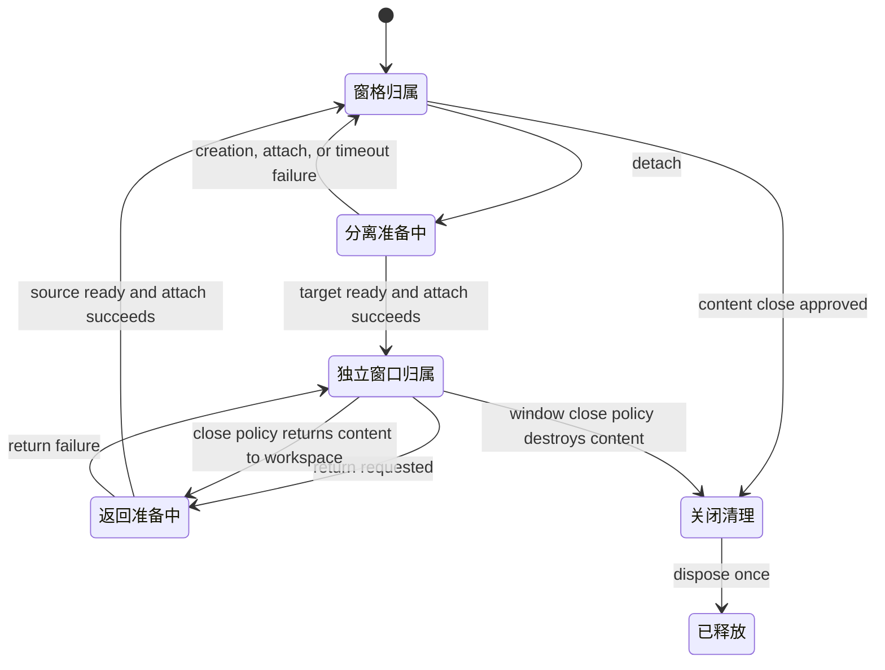

# M6：内容窗格与文件工作区

## 目标

将当前 PTY 专用工作区扩展为可承载多种内建内容的窗格体系，并交付安全的项目文件树和窗格内文本编辑。既有 PTY 继续由 Rust 独占生命周期。

## 依赖与设计门禁

- 依赖 0.3.0 已发布基线。
- 实现前对照产品需求、架构、UI 设计和本里程碑，确定窗格内容引用、关闭/恢复、脏文档、项目切换和布局版本迁移。
- 内容适配器由应用拥有生命周期，通过启动期注册 API 动态装配内建模块；本阶段不加载第三方插件代码，也不提供插件市场、任意脚本执行或宽泛文件系统权限。
- PTY、文件编辑器等适配器向公共宿主声明视图、类型文案、命令、关闭钩子和资源释放逻辑。工作区引用仍使用受校验的版本化类型；适配器不能接管窗格拓扑、PTY 生命周期或项目文件授权。
- 文件编辑器以 Monaco Editor 为首选实现，并验证 Vite/Tauri worker、按需语言加载、浅色/深色主题、常用编辑快捷键、模型生命周期和生产包体积；保留编辑器引擎接口，避免将文件保存与脏状态绑定到 Monaco。
- 项目文件列表每目录最多返回 5,000 项，并显式标记截断；文本文件最大 2 MiB，仅接受 UTF-8 普通文件。二进制/超限内容进入不可打开说明页；常见栅格图片使用安全的内置预览，限制大小并校验文件签名。
- 命名布局只持久化文件引用。布局恢复遇到同一项目、同一相对路径的当前文档时保留当前文档身份及其未保存缓冲。
- 保存发现外部修改时拒绝覆盖，保留本地缓冲并提供用户触发的重新载入操作。
- 所有 pane 内容共享窗口宿主：统一标签关闭按钮、激活、关闭当前/其他/全部、拖动换 pane、右键菜单、分栏/移窗格、独立窗口入口和原生标题栏关闭拦截。内容 adapter 只提供窗格内渲染、内部交互和类型文案，并可用 `beforeClose` 与 `beforeWindowClose` 返回布尔值继续或拦截关闭；workspace coordinator 注入 PTY/文件关闭与独立窗口交接回调。
- 适配器按 `render`、类型化 `presentation`、同步关闭钩子和可选类型化 handoff driver 分层；宿主拥有通用命令和 owner 转移，adapter 不直接操作 pane tree 或创建窗口。详见 [架构文档](../../architecture.md) 中的 0.4.0 内容生命周期契约。
- Pane 标题栏按可用宽度自适应：短标题自然收缩，长标题单项最大宽度为 200 CSS px 并以省略号呈现；总宽度不足时，当前活动内容保留为可见标签，其余内容收纳到共用的堆叠列表中。堆叠列表覆盖 PTY 与文件，不按内容类型分裂 UI，并保留激活、关闭及右键操作。
- 文件独立窗口使用随机一次性交接身份，将项目 ID、相对路径、编辑缓冲和版本在内存中转交；ready 握手成功后才从源 pane 移除。失败时源内容和脏缓冲保持不变。

## 生命周期契约（阶段 2）

| 边界                             | 唯一职责                                                                                                                               | 禁止形成的第二份事实                                                     |
| -------------------------------- | -------------------------------------------------------------------------------------------------------------------------------------- | ------------------------------------------------------------------------ |
| Workspace 内容宿主               | Pane tree、pane ID、内容引用归属、焦点/活动项、标签/菜单命令、宽度溢出展示和布局持久化；统一接收 close/move/split/detach/return 请求。 | adapter 不维护另一套 pane tree，不自行关闭/移动其他内容。                |
| Workspace 生命周期协调器         | 维护内容视图 owner、窗口 label、交接身份与代次；建立/清理事件订阅和计时器；驱动状态机、等待 ready、提交转移或回滚。                    | 不复制 PTY 进程状态、文件授权或 Git 工作区状态。                         |
| 内容 adapter                     | 对一个受支持的内容 kind 提供实际渲染、类型展示、受限 callbacks、同步关闭钩子和可选 handoff driver/终态 dispose。                       | 不创建通用 Tauri 窗口、不动态增加 capability、不直接操作 pane topology。 |
| Rust PTY service                 | PTY 进程、session 和 PTY 所有权/attach/detach 的权威状态。                                                                             | React 状态不可覆盖 Rust 查询结果或自行宣称 PTY 已转移。                  |
| Rust 文件 service 与前端文档状态 | Rust 校验项目根目录、路径、文件版本和写回；workspace content state 持有当前编辑 buffer/dirty 标志并在 handoff 时做受控交接。           | 独立窗口 payload 不是路径授权；正文和 buffer 不进入布局持久化/业务 DB。  |
| Window shell / Tauri capability  | Window shell 提供平台标题栏、拖动/尺寸控件及统一 close-request 入口；capability 静态授予窗口类别的最小 API。                           | shell 不决定 PTY/file 领域策略；adapter registry 不可动态放宽 ACL。      |

公共交接状态为 `attached → detaching → detached → returning → attached`。分离失败恢复为原 `attached` owner，返回失败仍由原独立窗口持有；明确关闭经过关闭钩子及窗口关闭策略后进入 `disposed`。自然退出、关闭和卸载必须恰好清理监听、计时器、portal/窗口引用与运行期资源。所有事件以交接 ID、内容身份、源/目标 label 和代次核验，重复/乱序/过期事件幂等忽略。

`beforeClose` 用于破坏性内容关闭，`beforeWindowClose` 用于独立窗口原生关闭策略；返回 `true` 表示允许宿主继续，`false` 表示拦截。钩子同步执行且抛错时拒绝关闭。批量关闭先检查全部目标，遇到拦截则不部分关闭。移动、激活、pane 分栏和成功交接不调用破坏性关闭钩子。任何异步确认需求须作为版本化 API 变更另行设计 pending/取消语义。

G3/G4 的继承项：保留窗口 chrome 平台策略、主窗口托盘/退出确认、PTY Rust owner 与 portal DOM 稳定、G4 主题单一偏好来源、五 CLI 固定 adapter 契约及已审核 CSS token 矩阵。只收敛重复的生命周期入口和实际主题订阅重复；不把 CLI/主题/PTY/file adapter 合并成万能接口。适配器仍由应用静态编入，未来插件安全模型不属于 M6。

## 范围

- 统一窗格内容容器负责标题、焦点、关闭、递归分栏与布局保存；初始支持 PTY 和文本编辑器适配器。
- 右栏增加项目上下文、文件管理、Git 管理三个页签框架；本阶段实现项目上下文和文件管理，Git 页签为可解释的后续阶段入口。
- 文件树以当前项目目录为根，按需枚举；提供打开、刷新、隐藏项展示及常见忽略内容处理。
- UTF-8 文本文件在中央窗格打开、编辑、保存；同一文件重复打开聚焦既有内容，不创建重复窗格内容。支持常见语言的语法高亮和主流基础编辑操作；语言智能服务、工作区符号索引和跨文件跳转不由语法高亮冒充。
- 非文本/二进制文件显示明确的不可编辑状态；PNG、JPEG、GIF、WebP、BMP 在 10 MiB 内经签名校验后以内存 data URL 预览，不开放项目目录任意 URL 访问。SVG、TIFF、AVIF、HEIC 等未纳入安全预览白名单，显示不支持说明。
- 记录工作区文件索引的可行方案：M6 的索引边界为受项目根目录约束的文件元数据缓存；全文搜索按需扫描，定义/引用等语义能力留给后续 LSP/语言服务接入。
- 布局持久化文件内容引用，不保存正文或编辑缓冲；编辑器沿用全局主题语义。
- Rust 文件服务执行项目目录读取和安全写回，复用现有目录身份与路径校验原则。
- 关闭未保存文档和布局恢复时保护脏内容；外部修改时提示并允许用户重新载入，不静默覆盖。

## 非目标

- 本阶段不实现 Git、Markdown 预览、二进制文件编辑或完整 IDE 功能。
- 不提供文件创建、重命名、删除、复制、移动或批量操作。

## 任务清单

1. 盘点现有窗格树、PTY slot registry、布局 DTO/schema、独立窗口交接和命名布局应用路径。
2. 设计版本化内容引用、内建动态适配器注册 API 与编辑器引擎接口，定义旧 PTY-only 布局无损迁移和损坏数据降级；记录未来第三方插件 API 与权限模型的非目标边界。
3. 实现窗格内容容器；迁移现有 PTY 到 PTY adapter，并保持 xterm 实例和交接行为。
4. 实现 Rust 文件服务和按需目录树；把项目根目录打开为保留的目录 capability，所有不可信相对路径操作均通过该句柄完成，避免检查与使用之间的路径替换，并拒绝路径穿越、越界符号链接、特殊文件及过大文本读取。
5. 实现 Monaco 编辑器 adapter、常用快捷键和语言识别；保留脏状态、保存、外部修改检测、重复打开聚焦和关闭保护在宿主/文件服务边界内。
6. 完成英文/中文以外已有语言资源、浅色/深色主题、错误状态和空状态适配。
7. 完成 Monaco/CodeMirror 与 VS Code 文件索引能力调研结论，验证工作区元数据缓存与 LSP 语义能力边界；完成文件安全边界、布局恢复、错误恢复、主题和多语言审查，修复后复审并执行本里程碑最终自动门禁。
8. 抽取通用内容标签、拖放载荷、右键菜单和独立窗口壳，分别接入 PTY 与文件适配器，并验证交接失败恢复。
9. 补齐三个图标页签/紧凑项目标题及文件编辑器保存按钮布局，并完成独立窗口、关闭与拖动回归。
10. 复核 G3 窗口标题栏与 G4 主题、PTY 生命周期、工作区拆分、CLI adapter 和全局 token 的已验收抽象；有明确证据的重复边界并入本次重构，无缺陷部分保持既有实现与行为。
11. 实现 pane 标签标题宽度限制与跨内容类型堆叠列表；覆盖活动项稳定可见、窄窗格、长路径/长标题、溢出列表激活/关闭/拖动与键盘可访问性。

## 验收覆盖

- 单元/集成：内容引用校验、旧布局迁移、分栏操作、重复文档去重、布局恢复 ID 映射、脏状态与保存队列、同一文件并发外部修改检测、有界目录枚举、共用拖放载荷、独立窗口 ready/return/failure 生命周期。
- 安全边界：路径穿越、盘符/UNC/绝对路径注入、符号链接逃逸、权限拒绝、二进制内容、超大文件、文件删除后读取和根目录变化。
- 回归：终端和文件标签的激活、关闭、拖动换窗格和右键操作；PTY/文件独立窗口往返、交接失败恢复、PTY 退出、命名布局应用、空窗格关闭、应用重启恢复均保持正确语义。
- 实机：Windows、macOS、Linux 检查项目浏览、文本打开/保存、窗口缩放、长路径/Unicode 路径、外部编辑冲突和主题样式。

## 验收条件

- PTY 和文件编辑器能在同一递归窗格布局中共存；布局保存和恢复后引用正确，旧布局仍可加载。
- 文件服务无法通过前端构造参数访问当前项目根目录之外的目标。
- 编辑器不会静默丢失未保存修改，也不会未检测外部修改就覆盖用户文件。
- 终端与文件通过同一 pane 内容行为壳完成关闭、拖动、右键操作和独立窗口/返回；adapter 仍保留各自的 PTY/文件安全边界。
- 长标题限制在 200 CSS px 并单行省略；pane 宽度不足时当前内容仍可见，其余内容收进跨类型共用的堆叠列表，列表操作与普通标签行为一致。
- Windows 本地已完成代码与自动化门禁；macOS/Linux 实机验收及跨平台 UI 检查须在对应环境完成并记录后，M6 才可整体验收。

## 当前验收状态（2026-10-06）

| 验收项                                             | 状态                                             | 证据或后续动作                                                                                                                                                                                                                                                                                                                                                                                                                                                                                                                                                                                                                                                                                                                                                                                                                                                                                                                                              |
| -------------------------------------------------- | ------------------------------------------------ | ----------------------------------------------------------------------------------------------------------------------------------------------------------------------------------------------------------------------------------------------------------------------------------------------------------------------------------------------------------------------------------------------------------------------------------------------------------------------------------------------------------------------------------------------------------------------------------------------------------------------------------------------------------------------------------------------------------------------------------------------------------------------------------------------------------------------------------------------------------------------------------------------------------------------------------------------------------- |
| 内容 adapter、窗格共用生命周期、混合标签与堆叠列表 | 自动化通过                                       | 前端单元/集成测试覆盖注册、关闭、交接、过期事件、缓冲区版本、监听清理和 lifecycle window token；第三波本机 `pnpm test` 53 个文件/282 项通过。                                                                                                                                                                                                                                                                                                                                                                                                                                                                                                                                                                                                                                                                                                                                                                                                               |
| 项目文件路径与文件服务安全                         | 三平台自动门禁通过                               | 覆盖路径穿越、绝对路径/UNC、符号链接逃逸、有界读取、根目录 capability、CAS 并发/目标替换重试及 Windows ACL 继承；第 1 波本机 Rust 289 项通过，修复提交 `312e01d` 的 CI run [37400004745](https://github.com/SkyJourney/cli-launchpad/actions/runs/37400004745) 三平台全部通过。非法 UTF-8 文件名边界仅在 Linux 上验证；macOS 运行其他 Unix 路径规则测试。                                                                                                                                                                                                                                                                                                                                                                                                                                                                                                                                                                                                   |
| 前端类型检查与生产构建                             | 通过                                             | `pnpm test`、`pnpm run build` 均通过；构建仍报告 Monaco 编辑器懒加载 chunk 超 500 KB，列为后续包体优化项。                                                                                                                                                                                                                                                                                                                                                                                                                                                                                                                                                                                                                                                                                                                                                                                                                                                  |
| Rust 编译、格式与差异检查                          | 三平台 CI 通过                                   | 修复提交 `312e01d` 的 CI run [37400004745](https://github.com/SkyJourney/cli-launchpad/actions/runs/37400004745) 中 Windows、macOS、Ubuntu 的格式、编译和测试门禁通过；本机 Rust 格式/编译与 `git diff --check` 通过。                                                                                                                                                                                                                                                                                                                                                                                                                                                                                                                                                                                                                                                                                                                                      |
| macOS/Linux 构建与平台专属权限行为                 | CI 通过，实机待验收                              | CI run [37400004745](https://github.com/SkyJourney/cli-launchpad/actions/runs/37400004745) 中 macOS、Ubuntu 的前端构建、Rust 测试/检查/格式门禁通过，包含 Unix 权限保留、私有临时文件和原子替换测试；桌面实机行为仍按清单待执行。                                                                                                                                                                                                                                                                                                                                                                                                                                                                                                                                                                                                                                                                                                                           |
| 最终版本实机验收                                   | 待执行                                           | Windows、macOS、Linux 分别启动最终构建，按下方清单验证项目文件树、文本编辑保存、冲突重载、窗格内关闭/右键/移动/拆分、独立窗口打开/返回/关闭，以及浅色/深色主题和窗口缩放。                                                                                                                                                                                                                                                                                                                                                                                                                                                                                                                                                                                                                                                                                                                                                                                  |
| 基础抽象体检与收口：A 层（M6 验收前提）            | 自动化问题已分波实施；第四波最终门禁及实机待验证 | [M6 基础抽象体检与收口审查报告](M6-abstraction-baseline-audit.md)记录 61 项问题（P0 1 项、P1 8 项）。2026-10-06 本机 Windows 门禁：前端 210 项、Rust 289 项、生产构建、Rust 格式/编译、变更文件 Prettier 与 `git diff --check` 通过；构建有 Monaco chunk 超 500 KB 警告。第 1 波首提交 `c2f43e3` 的 CI run [37399404615](https://github.com/SkyJourney/cli-launchpad/actions/runs/37399404615) 暴露 macOS 非法 UTF-8 文件名测试夹具不兼容；按平台能力拆分后，修复提交 `312e01d` 的 CI run [37400004745](https://github.com/SkyJourney/cli-launchpad/actions/runs/37400004745) 三平台全部通过。WP0 的历史 CI run 37318703030 仅作为 WP0/J2/J4 证据。当前第三波 CI run [37432180573](https://github.com/SkyJourney/cli-launchpad/actions/runs/37432180573) 对 SHA `a674462` 的 Windows、macOS、Ubuntu 全部通过。B2-F01、B3R-F05、J1 和完整 M6 三平台桌面矩阵仍待实机验收；第四波本机门禁、复审和最终 CI 仍待完成，因此 A 层未关闭。门禁结论见报告第 8、9 节。 |
| 基础抽象收口：第 2 波本机门禁                      | 本机门禁及三平台 CI 通过                         | 2026-10-06 第二波：`pnpm test` 47 个文件/251 项、Rust 273 项、生产构建、Rust fmt/check 通过；此前变更文件的 Prettier 检查通过，本次补充修复仅改 Rust 文件（Prettier 不适用），`git diff --check` 通过。修复 Windows 输出截断测试夹具后，CI run [37410698481](https://github.com/SkyJourney/cli-launchpad/actions/runs/37410698481) 的 Windows、macOS、Ubuntu 全部通过；此前 10 秒预算仍不稳定的 run [37410191944](https://github.com/SkyJourney/cli-launchpad/actions/runs/37410191944) 及修复细节见审查报告“第 2 波实施追溯”。                                                                                                                                                                                                                                                                                                                                                                                                                             |
| 基础抽象体检与收口：B 层（M7 开工前提）            | 第 3 波代码与三平台 CI 通过；第 4 波门禁进行中   | 第三波本机 `pnpm test` 53 个文件/282 项、`pnpm run build`、Rust fmt/check/test 297 项、变更文件 Prettier、`git diff --check` 通过；构建保留 Monaco chunk 超 500 KB 警告。第三波 CI run 37432180573 的 Windows、macOS、Ubuntu 均通过（SHA a674462）；该结果不替代第四波 CI。WP7 全量复审、最终门禁、成本演练及 X-F05 三平台生产包检查仍未完成，因此 B 层尚未关闭。范围与门禁见审查报告第 9 节。                                                                                                                                                                                                                                                                                                                                                                                                                                                                                                                                                              |

### 实机验收清单

本节状态：**Windows、macOS、Linux 的实机验收均尚未执行**。每个平台使用 M6 候选验收构建，并按下列步骤逐项操作；自动化测试或 CI 结果不能替代真实桌面窗口、操作系统事件和交互检查。请在隔离的临时项目目录及临时应用数据目录中操作，不要用唯一副本或真实工作数据验证备份恢复、脏文件退出或 PTY 终止。

#### 执行前准备

1. 记录平台发行版/版本、桌面环境（如适用）、显示缩放或 DPI、应用版本、Git 提交 SHA 和构建来源；确认应用来自本次待验收构建。
2. 创建可丢弃的测试项目，至少包含 UTF-8 文本、嵌套目录、文件名/目录名含空格与中文、长文件名、带有效签名的 PNG，以及普通二进制文件。记录测试目录位置和初始文件内容；不要为跨平台测试尝试创建该文件系统不支持的非法名称。Linux 专属非法 UTF-8 路径自动化测试由 CI 覆盖，macOS 文件系统拒绝该类路径时不应判作应用失败。
3. 准备两个可启动的 PTY 会话；记录 CLI 启动按钮、会话 ID（若可见）和可辨识的运行输出。PTY 用于本清单时应使用可安全终止的临时命令/测试 CLI，不运行有副作用的真实任务。
4. 在开始前保存截图/录屏位置；每个项目单独记录结果。结果只使用“通过 / 失败 / 阻塞 / 跳过”。阻塞或跳过必须写原因、复现步骤和现有证据；不得把尚未执行写成通过。

#### 逐项步骤与通过标准

| ID     | 操作步骤                                                                                                                                                                                                                                                                                                                                                                                   | 通过标准与平台说明                                                                                                                                                                                                                                                         |
| ------ | ------------------------------------------------------------------------------------------------------------------------------------------------------------------------------------------------------------------------------------------------------------------------------------------------------------------------------------------------------------------------------------------ | -------------------------------------------------------------------------------------------------------------------------------------------------------------------------------------------------------------------------------------------------------------------------- |
| M6-F01 | 选择测试项目，在文件树逐层展开嵌套目录；分别打开含空格、中文和长名称的目录；折叠/展开、切换项目后再返回，并刷新/重启应用检查文件树。                                                                                                                                                                                                                                                       | 名称显示可辨认且路径不串项目；目录展开、选中状态与文件列表对应实际项目；刷新后无错误路径或陈旧内容。长路径仅使用当前文件系统可创建的有效路径。                                                                                                                             |
| M6-F02 | 打开 UTF-8 文本文件，修改为容易核对的内容并保存；从文件树再次打开同一路径；关闭标签后重新打开，并独立窗口打开/返回（如该路径适用）。                                                                                                                                                                                                                                                       | 保存成功提示与磁盘 UTF-8 内容一致；同一路径再次打开复用/聚焦已有文档而不丢缓冲；关闭后重开内容与已保存版本相同。                                                                                                                                                           |
| M6-F03 | 在应用中编辑但先不保存；用另一个编辑器修改并保存磁盘上的同一测试文件；回到应用尝试保存，再选择重新载入/放弃本地更改的明确操作。                                                                                                                                                                                                                                                            | 保存检测到 revision 冲突，不静默覆盖外部更新；冲突发生时本地缓冲仍可见；明确重新载入后显示磁盘新版本。记录冲突提示及两个版本，使用可丢弃文件。                                                                                                                             |
| M6-F04 | 建立至少两个 pane，并让文件与 PTY 内容同时存在；分别使用标签关闭按钮、右键关闭当前、关闭其他、关闭全部；把文件/PTY 标签拖到另一 pane，执行移动和拆分；对脏文件或运行中 PTY 再试关闭范围操作。                                                                                                                                                                                              | 文件和 PTY 共用一致的 pane 操作及顺序；关闭范围准确；移动/拆分后每项内容仍可访问且无重复/丢失；存在脏文件或 PTY 时先取得所需确认，取消任一确认不会部分关闭目标集合。                                                                                                       |
| M6-F05 | 分别将文件和 PTY 内容打开为独立窗口，验证主窗口与独立窗口之间交接、返回 pane、使用原生关闭按钮；在脏文件及运行中 PTY 下重复正常交接。若验收构建提供安全、确定的失败注入方式，再验证 handoff 失败回滚；没有时用对应自动化用例作补充证据并把实机失败注入记为阻塞/不适用及原因。                                                                                                              | 正常打开/返回后内容归属唯一、文件编辑缓冲不丢、PTY 继续运行；原生关闭遵循返回/清理约定；交接失败时源内容仍可用且资源登记清理。不得通过杀进程或删除用户数据制造失败。                                                                                                       |
| M6-F06 | 打开普通二进制文件和签名有效的栅格图片；打开伪装为图片但签名无效的文件；缩窄 pane 并检查长文件名；切换应用浅色/深色主题检查文件视图及预览。                                                                                                                                                                                                                                                | 普通二进制和无效图片安全地显示不支持/错误状态；仅有效且受支持的栅格图片显示预览；窄宽与长标题不遮挡关闭/菜单操作，颜色在应用主题下可读。现有终端 ANSI 配色策略按已确认方案保持深色，不以此项要求新增浅色 ANSI 配色。                                                       |
| M6-F07 | 先把“关闭行为”设为“退出”。分别从主窗口标题栏关闭、托盘菜单“退出”、以及该操作系统提供的原生应用退出请求入口执行下表四种状态；每次点取消后检查窗口、文件缓冲和 PTY，再用新一轮数据点确认退出并检查结果。另将关闭行为改为“最小化到托盘”，点标题栏关闭并从托盘恢复窗口，检查该设置不触发退出确认。系统没有独立原生“退出”入口时，记录该入口为不适用，不要把同一个标题栏关闭重复算作第三种路径。 | 三种退出入口在系统确实发出应用退出请求时展示一致的影响确认；取消保留脏文件/PTY 和可继续操作的主窗口；确认按提示放弃未保存修改、结束 PTY 并退出；无影响时可直接退出。最小化到托盘时标题栏关闭只隐藏窗口、PTY 继续运行，托盘恢复可用。下方每个平台记录入口可用性与每格结果。 |
| M6-F08 | 在主窗口运行一个可安全停止的 PTY，将该 PTY 窗口独立打开；使用应用的窗口关闭/返回流程关闭独立 PTY 窗口，然后从主窗口重新聚焦同一会话并继续输入；再正常结束临时命令。                                                                                                                                                                                                                        | 独立窗口销毁后会话所有权回到主工作区，PTY 进程未因仅关闭独立窗口而被意外杀死，也不产生重复会话；回收失败时按错误提示保留可恢复状态。不要强制结束整个应用进程。                                                                                                             |
| M6-F09 | 使用临时应用数据目录启动应用，在临时项目中建立至少两种 pane 布局（含命名布局）；执行应用备份，记录备份项；在继续使用前确认备份目标正确，再通过应用内恢复流程恢复该备份。                                                                                                                                                                                                                   | 恢复前能检查运行 PTY、脏文件、独立窗口等阻断提示；无阻断时恢复成功，当前布局和命名布局与备份一致。不得覆盖真实用户数据；在每个平台的独立临时 profile 中单独执行。                                                                                                          |
| M6-F10 | 在宽、窄两种窗口尺寸下建立多个文件与 PTY 标签；观察短/长标题、活动项与溢出堆叠列表；仅用键盘聚焦、打开列表、移动焦点、激活和关闭项目；改变系统缩放/DPI（如可用）后重复。                                                                                                                                                                                                                   | 单项标题最大宽度为 200 CSS px、单行省略；宽度不足时活动项仍可见，其余内容进入共用列表；列表可键盘操作且跨类型顺序、激活、关闭与 pane 状态一致。记录实际缩放比例和窗口尺寸。                                                                                                |
| M6-F11 | 先记录系统浅/深色外观；在应用设置中选取与系统外观相反的应用主题，观察主窗与文件/PTY 独立原生窗口；再切换应用主题一次，并将系统外观恢复原设置。                                                                                                                                                                                                                                             | 原生窗口主题跟随应用主题并在跨窗及切换时同步，不被系统原生外观覆盖；退出/重开后偏好保持。若平台的原生标题栏外观由系统控制无法跟随，记录平台、窗口类型和可见差异，不能以另一系统结果代替。                                                                                  |

#### M6-F07 退出路径与状态矩阵

在下列三条可用退出路径上分别运行四种数据/进程状态（共 12 个组合）。每次取消后验证状态仍在，再用全新一轮确认退出；不要在真实工作会话中执行“确认退出”。若某系统没有独立的原生应用退出入口，该路径标注 N/A 并记录可用的系统入口，不重复计数标题栏关闭。

| 退出路径                          | 无脏文件、无 PTY | 仅有未保存文件                   | 仅有运行中 PTY                                 | 未保存文件和运行中 PTY                           |
| --------------------------------- | ---------------- | -------------------------------- | ---------------------------------------------- | ------------------------------------------------ |
| 主窗口标题栏关闭（关闭行为=退出） | 确认直接退出     | 出确认；取消保留缓冲，确认后退出 | 出确认；取消后 PTY 存活，确认后结束 PTY 并退出 | 列出两类影响；取消均保留，确认均按提示处理后退出 |
| 托盘菜单“退出”                    | 确认直接退出     | 出确认；取消保留缓冲，确认后退出 | 出确认；取消后 PTY 存活，确认后结束 PTY 并退出 | 列出两类影响；取消均保留，确认均按提示处理后退出 |
| 操作系统提供的原生应用退出请求    | 确认直接退出     | 出确认；取消保留缓冲，确认后退出 | 出确认；取消后 PTY 存活，确认后结束 PTY 并退出 | 列出两类影响；取消均保留，确认均按提示处理后退出 |

### 三平台实机验收矩阵

矩阵状态只由该平台实机执行者填写。初始“待执行”表示没有实机证据；CI 通过不能将单元格改为通过。完成一项后，在“证据/记录”中引用下方记录表对应的平台和清单 ID。

| 平台    | M6-F01 | M6-F02 | M6-F03 | M6-F04 | M6-F05 | M6-F06 | M6-F07 | M6-F08 | M6-F09 | M6-F10 | M6-F11 | 证据/记录索引 |
| ------- | ------ | ------ | ------ | ------ | ------ | ------ | ------ | ------ | ------ | ------ | ------ | ------------- |
| Windows | 待执行 | 待执行 | 待执行 | 待执行 | 待执行 | 待执行 | 待执行 | 待执行 | 待执行 | 待执行 | 待执行 | 待补          |
| macOS   | 待执行 | 待执行 | 待执行 | 待执行 | 待执行 | 待执行 | 待执行 | 待执行 | 待执行 | 待执行 | 待执行 | 待补          |
| Linux   | 待执行 | 待执行 | 待执行 | 待执行 | 待执行 | 待执行 | 待执行 | 待执行 | 待执行 | 待执行 | 待执行 | 待补          |

自动化结果不替代上述最终版本的实机验收。WP0/J2/J4 的历史 CI 仅证明相应提交；当前最新第三波 CI run 37432180573 三平台通过。第四波最终提交 CI 和 Windows、macOS、Linux 对应实机项目均未完成；记录前不得关闭 A 层或标记 M6 整体验收通过。

### 实机验收记录

每个平台、每个清单项单独记录一行；M6-F07 按退出路径和状态组合逐格记录。失败、阻塞或跳过时须写最短复现步骤和原因；通过项须有可核验的截图、录屏、日志或现场验收记录位置。OS 信息和应用提交应在该平台区块顶部填写，避免每行重复。

| 平台                    | OS/桌面环境版本 | DPI/缩放 | 应用版本 / 提交 SHA | 清单项/退出组合           | 结果（通过/失败/阻塞/跳过） | 证据位置 | 复现步骤、结果与备注 |
| ----------------------- | --------------- | -------- | ------------------- | ------------------------- | --------------------------- | -------- | -------------------- |
| Windows / macOS / Linux |                 |          |                     | M6-F01…M6-F11（每项一行） |                             |          |                      |

F07 补充记录：平台：**\_\_\_\_**；入口可用性及实际入口：**\_\_\_\_**；关闭行为设置：**\_\_\_\_**。

| 退出路径                            | 状态组合                                          | 取消后的窗口/文件/PTY 状态 | 确认后的结果 | 结果 | 证据位置/备注 |
| ----------------------------------- | ------------------------------------------------- | -------------------------- | ------------ | ---- | ------------- |
| 标题栏关闭 / 托盘退出 / OS 原生退出 | 无脏文件、无 PTY / 仅脏文件 / 仅 PTY / 脏文件+PTY |                            |              |      |               |

## 全仓抽象边界审查与门禁

### 审查范围与结论

2026-10 对整个软件实现做了一轮边界审查，范围包含 `src/`、`src-tauri/src/`、Tauri capabilities、测试和本里程碑相关文档。审查以职责归属、生命周期、跨平台实现、内容扩展点和权限边界为标准；模块行数本身不作为重构理由。

审查结论：Rust 命令到 services、DB repositories 和 platform helpers 的分层总体清楚；Tauri invoke/DTO 集中在 `src/lib/tauri.ts`；五个 CLI 的 Rust trait 与前端固定 adapter registry 符合当前明确限定的五 CLI 产品范围；操作系统特有实现主要留在 `src-tauri/src/platform/` 并使用 target 条件编译。这些边界不需要为 M6 泛化成第三方插件框架。

M6 内容窗格、文件安全和跨窗生命周期的第三波实现已完成自动化验证；共享关闭、命令、adapter hooks、协议与权限边界仍保留各自领域所有权。以下矩阵记载当前代码边界和残余验证项。最终三平台实机矩阵尚未执行，且不能用自动化覆盖推断桌面行为已验收。

### 边界审查矩阵

| 子系统                      | 当前边界与代码依据                                                                                                                                                                                                                                                                                                                                                                     | 待对齐内容                                                                                                                                                                                                                                                                                                                                                                                | M6 审查/验收要求                                                                                                                                                                                                    |
| --------------------------- | -------------------------------------------------------------------------------------------------------------------------------------------------------------------------------------------------------------------------------------------------------------------------------------------------------------------------------------------------------------------------------------- | ----------------------------------------------------------------------------------------------------------------------------------------------------------------------------------------------------------------------------------------------------------------------------------------------------------------------------------------------------------------------------------------- | ------------------------------------------------------------------------------------------------------------------------------------------------------------------------------------------------------------------- |
| 内容引用与 adapter registry | `src/lib/tauri.ts` 定义固定的 `pty`/`file` 内容联合；`src/components/workspaceContentAdapterRegistry.ts` 按 kind 单例注册，render context 为 PTY 注入稳定 portal target、为 file 注入文档与 buffer/edit/save；`src/components/WorkspaceContentView.tsx` 也直接按 kind 组装上下文。                                                                                                     | 注册表当前是应用内建、固定类型的动态注册，不是加入一种类型即可工作的完整 adapter 边界；不得把它描述为第三方插件 API。（2026-10-06 复核）PTY 与 file 均由 adapter 提供真实 render 和由内容/上下文派生的 presentation；通用 pane 拓扑、拖放、菜单及领域命令分派仍由宿主管理，adapter 不获得 pane tree 写权限。注册、API 版本、生命周期 hooks 与 renderer 有自动测试；这不是第三方插件 API。 | 明确 adapter 的输入能力、生命周期钩子、标签/命令和资源清理契约；由宿主提供通用能力注入，adapter 只实现类型特有渲染/交互；PTY 与文件均须实际通过约定的内容呈现路径。注册、注销、冲突、未知类型和卸载资源都要有测试。 |
| Pane coordinator 与内容渲染 | `src/components/PtyWorkspace.tsx` 同时持有布局恢复、文件编辑状态、PTY 会话、窗格拓扑、拖放、菜单、文件和 PTY 独立窗口事件编排。关闭生命周期已通过 `closeWorkspaceContentBatch` 共用，右键菜单仍按 kind 组装目标及调用领域关闭操作。                                                                                                                                                    | 通用状态转换和 dispose 已集中；菜单内容选择、文件/PTY close operation、pane 树与跨窗事件回调仍留在工作区宿主。需要后续按内容命令能力继续缩小 UI kind 分支，但不能把领域操作错误地移进通用 reducer。                                                                                                                                                                                       | 验证标签/菜单关闭、批量关闭、移动/拆分等主要用户动作走统一生命周期；剩余 kind dispatch 限定在宿主注入领域操作的位置，并具备各领域等价验收。独立窗口事件编排是否再抽层，结合 cleanup 审查结论处理。                  |
| 标签、菜单和命令            | `WorkspaceContentTab.tsx`、`WorkspaceContentContextMenu.tsx` 复用了界面；菜单仍导入 PTY 布局类型并直接使用 `pty.*` 翻译键，关闭回调由 `PtyWorkspace.tsx` 按 kind 构造。                                                                                                                                                                                                                | 菜单项的分组、可用性和文案有部分硬编码；标签/菜单共用尚未建立一个可测试的宿主命令模型。                                                                                                                                                                                                                                                                                                   | 菜单接收宿主构造的通用命令/可用性/文案，执行动作经过统一内容身份和生命周期入口；PTY/file 都覆盖关闭当前、关闭其他、关闭全部、移动 pane、拆分移动和独立窗口动作。                                                    |
| 关闭钩子和脏内容生命周期    | `src/lib/workspaceContentClose.ts` 定义同步布尔 `beforeClose`/`beforeWindowClose`，语义为 true 继续、false 拦截；文件 adapter 有脏文档钩子，但内建 adapter 未提供独立窗口关闭钩子。共享 shell 捕获原生关闭请求，内容窗口回调仍由各窗口实现。                                                                                                                                           | pane 标签关闭、菜单批量关闭、原生窗口关闭、分离/返回时的钩子调用范围和资源释放顺序需统一验证；异常/拦截路径可能造成 UI 已移除但底层资源仍存活，或反之。                                                                                                                                                                                                                                   | 用同一关闭决策入口覆盖单个、批量、原生窗口及交接前置检查；验证 true/false、脏/未脏、异常和批量部分拒绝的明确语义，保证被拦截时布局与 buffer/session 不变。若暂不支持异步 hook，应在 API 文档中明确。                |
| 独立窗口与 handoff 协议     | `workspaceContentHandoffRuntime.ts` 提供共用窗口工厂与 adapter prepare/attach/rollback drivers；`workspaceContentWindowProtocol.ts` 提供版本化事件 envelope、单频道订阅多路分发和 label 前缀；`workspaceContentWindowRegistry.ts` 共用 pending 注册、超时、撤销及 pending→detached 转移。`PtyWorkspace.tsx` 仍拥有 pane 树与领域事件编排；PTY token 和文件 buffer 操作仍由 host 注入。 | 共用窗口、消息、待启动登记和关闭/释放通知已落地；仍需复审事件回调组合、窗口销毁和 provider 卸载时的全量清理。注册表只处理公共计时器与归属登记，不接管 Rust/file-service 操作。                                                                                                                                                                                                            | 保留 PTY 进程归 Rust 管理、文件 buffer/路径由文件服务约束；验证 pane→window、ready、window→pane、异常退出、ready 失败、重复/过期事件、源窗格关闭和目标 pane 消失，并提供实机 GUI 证据。                             |
| Tauri capability 与窗口策略 | `default.json` 仅授权 `main`，`terminal-window.json` 覆盖 `terminal-*`；新增的 `workspace-content-window.json` 覆盖文件窗口标签并提供事件/窗口能力。之前文件窗的 `event.listen` 报错证明新窗口创建与 ACL 声明会发生漂移。                                                                                                                                                              | capability 是静态安全策略，不能被运行时 adapter 注册绕过，也不应通过宽泛窗口通配来掩盖漏配。动态 label 前缀与明确 ACL 需要保持一致。                                                                                                                                                                                                                                                      | 每类创建的窗口 label 必须恰好落入预期 capability；对 listen/emit、关闭、拖动、剪贴板等实际调用做配置门禁或窗口启动 smoke test；新增窗口类型必须同步审查最小权限，不授予不需要的文件系统权限。                       |
| 编辑器引擎扩展点            | `workspaceEditorEngineRegistry.tsx` 支持注册和查找，但 `WorkspaceEditorSurface.tsx` 固定请求 `core.monaco`。                                                                                                                                                                                                                                                                           | 当前 registry 暂未承担引擎选择、默认回退或不可用错误策略，多个引擎的可插拔性没有被消费端验证。（2026-10-05 审查结论）收口方式确定为“单一内建引擎 + `defaultEngineId` 解析 + 缺失时显示占位”，见审查报告 B2-F08。                                                                                                                                                                          | M6 明确采用单一内建 Monaco 时，可将注册表定位为预留扩展 API；若声称支持可替换引擎，则须由宿主配置/能力探测选择注册引擎并测试缺失/注销/错误回退。两种选择须在文档与代码一致，不要求 M6 引入第二引擎。                |
| 布局与内容操作              | `src/lib/ptyWorkspaceLayout.ts` 已有通用 `WorkspacePaneContentRef` 操作，同时保留 PTY/file 专属 helper 和类型断言。                                                                                                                                                                                                                                                                    | 需要确认工作区调用链已以通用操作为主，专属 helper 仅为必要兼容封装；否则通用模型与旧的双路操作会持续分叉。                                                                                                                                                                                                                                                                                | 对照所有布局修改调用点，验证 close/move/split/restore 使用统一内容引用操作；保留的类型专属封装须有调用理由和等价测试，不能各自维护不同拓扑语义。                                                                    |
| 事件、主题及前端系统边界    | `invoke` 入口集中在 `src/lib/tauri.ts`；主题同步由 `useThemeSync` 统一，但终端与文件 adapter 各自观察 `documentElement.dataset.theme`；handoff 的 listen/emit 仍分布在工作区和独立窗口组件。                                                                                                                                                                                           | 通用跨窗口事件 DTO/频道没有集中定义；主题 DOM 监听有低风险重复。前者直接影响 M6 生命周期，后者属于后续维护优化。                                                                                                                                                                                                                                                                          | M6 统一 handoff 事件类型与订阅/清理入口并验证能力范围；主题状态可继续由 CSS 变量驱动，若编辑器/终端确需显式主题则复用解析后的主题服务，作为非阻断整理项。                                                           |
| Rust 与平台边界             | `src-tauri/src/commands/` 负责 IPC，services 组合行为，DB/platform 各有目录；CLI adapter 以 trait 统一行为并固定覆盖五项工具；平台终端启动实现位于 platform 并按目标系统隔离。                                                                                                                                                                                                         | 本轮未发现足以要求重做 Rust commands/services/DB/platform 或五 CLI adapter 架构的 M6 级跨层泄漏。大文件本身不构成抽象缺陷。                                                                                                                                                                                                                                                               | 本阶段只修复与内容/文件能力直接相关的职责错位；任何新增平台差异仍须留在 platform/target boundary，新增 DB 行为经 service/repository；不因 M6 扩成通用 CLI 插件框架。                                                |
| 其他前端领域组件            | `ProjectDetailView.tsx` 同时含项目上下文、文件浏览和会话查询；`SettingsView.tsx` 汇集多类设置；`Sidebar.tsx` 集中项目导航/会话列表。                                                                                                                                                                                                                                                   | 这些组件规模和多个视图职责值得后续按领域拆分，但本轮未证明它们破坏 M6 pane 内容生命周期边界，也不能仅按文件行数纳入本阶段重构。                                                                                                                                                                                                                                                           | M6 只在它们与文件树入口/工作区内容交互的接口处验证职责；其余拆分记录为常规维护候选，不阻塞 M6。                                                                                                                     |

### G3/G4 已验收抽象复核

复核原则是修补实际分叉而不推翻已验收的平台行为、PTY 所有权与主题策略。G3/G4 里程碑保持历史验收状态；以下是 M6 必须继承并验证的架构边界，不重开它们的产品验收。

| 已验收抽象                   | 当前实现复核                                                                                                                                                                                                                                                                              | M6 处理边界                                                                                                                                                                                             |
| ---------------------------- | ----------------------------------------------------------------------------------------------------------------------------------------------------------------------------------------------------------------------------------------------------------------------------------------- | ------------------------------------------------------------------------------------------------------------------------------------------------------------------------------------------------------- |
| G3 自定义窗口标题栏          | `src/components/WindowTitlebar.tsx` 共用拖动区域、双击最大化/还原和非 macOS 控件；主窗与独立窗的操作仍由不同调用者提供，平台装饰策略来自 `windowChrome`。窗口关闭按钮调用 Tauri `close()`，真正关闭/交接策略由对应窗口生命周期处理。                                                      | 保留 G3 平台差异与命中区行为；通过窗口生命周期壳统一“请求关闭”的 hook 和清理次序，不把 PTY/file 业务策略塞入通用标题栏组件。回归拖动、双击、最大化、关闭、macOS overlay 与主窗口托盘/退出确认。         |
| G3 Pane 标题内容             | `WorkspaceContentTab` 统一了单标签视觉与关闭按钮；标题使用 `.pty-pane-tab-title` 的 200 CSS px 单行上限和省略规则；`workspaceTabLayout.ts` 与 `PtyWorkspace` 的 ResizeObserver 将所有内容 kind 纳入同一溢出堆叠列表。`workspaceTabLayout.test.ts` 覆盖活动项可见和长标题/窄 pane 的分配。 | 实现本文件规定的 200 CSS px 单项上限、单行省略和宽度不足时的跨类型溢出列表；活动内容始终可见。堆叠项目复用统一内容身份、右键和关闭入口，不复制 CLI-only 交互路径。                                      |
| G4 主题解析与跨窗口同步      | `useThemeSync` 集中解析主题并同步 DOM/native theme 和跨窗事件；终端、Monaco、通知消费解析后的主题状态，不各自观察 `data-theme`。主题偏好保持唯一来源，主窗口按登记窗口类别定向回复初始请求。                                                                                              | 保留 G4 的单一偏好来源、只由主窗广播与新窗清理监听规则；文件独立窗必须有明确定向初始主题的路径。合并重复的 DOM 主题观察入口，适配器消费解析后的主题状态。窗口事件仍受静态 capability 控制。             |
| G4 PTY 状态模型与会话 portal | `ptySessionLifecycle.ts` 提供退出合并、detached 身份匹配、失败动作和可终止判断等纯函数；G4 记录明确未重写完整 handoff state machine。Rust service 仍拥有 PTY 进程/会话，React portal 保持 xterm DOM 实例稳定。                                                                            | 以现有 Rust 所有权及 portal 行为为基准，将前端窗口交接编排收敛成可测试的共享生命周期协调器；把 PTY 特有状态转换以 adapter hook/typed payload 承载，不建立第二份 Rust 会话真相，也不在重构中重建 xterm。 |
| G4 工作区与终端职责拆分      | G4 已抽取 `WorkspacePtySessionRegistry` 与 `ptyTerminalRuntime`，但原记录未宣称整个 `PtyWorkspace` 或 `PtyTerminal` 的拆分完成；M6 当前又加入文件状态与第二套 detached 流程。                                                                                                             | 延续“按实际职责解耦”的原则，边界围绕宿主、生命周期协调、内容 adapter、窗口协议、内容视图划分；不以拆小文件或统一命名替代单一状态所有权。                                                                |
| G4 CLI adapter 契约          | Rust trait、穷尽 registry 与前端五项 CLI metadata registry 各自承载 CLI 差异；它们拥有明确的固定五 CLI 产品范围，契约测试防止跨语言注册漂移。                                                                                                                                             | 保留 CLI adapter 与 Workspace Content Adapter 的领域隔离。复用“能力显式声明、缺失安全失败、生命周期由公共层持有”的设计原则，但不强行合并两个输入/输出、状态机和权限完全不同的 adapter API。             |
| G3/G4 全局语义 token         | G4 已审查 token 消费者，并为 Sonner/Allotment 第三方变量、品牌图标、xterm ANSI 和日志颜色记录例外。                                                                                                                                                                                       | 本次只要求新增标题栏、堆叠列表及生命周期 UI 使用已有语义 token；若改动需新增 token，必须补双主题定义/消费者检查，不重做已通过的整张 token 矩阵。                                                        |

上述复核意味着“统一生命周期架子”指向稳定的应用窗口/工作区宿主、明确的状态 owner、内建 adapter 契约和类型化生命周期 hook；不等于把 CLI、主题、文件、PTY 和操作系统窗口强制并成一个万能接口。每个边界必须能说明创建者、状态权威、事件入口、清理者和失败恢复责任。

### M6 抽象审查门禁

以下门禁必须在 M6 最终验收前全部关闭；每项均需提供代码位置和测试/运行证据。实现未完成的，不得用“组件已共用”或“已注册 adapter”替代生命周期证据。

1. **边界清单复核：** 复核本矩阵覆盖的前端内容宿主、窗格协调器、独立窗口、editor registry、Tauri capability、Rust 文件 service/command/DB/platform 及相关测试；新增/删除窗口或 adapter 时同步更新矩阵结论。
2. **宿主与 adapter 职责：** PTY 与文件都经公共宿主完成内容身份、焦点/激活、标题/关闭按钮、右键动作和资源清理；adapter 只持有内容内部渲染/交互及显式注入的类型能力。核心窗格操作不得在组件中重复按 kind 实现。
3. **完整生命周期一致：** pane 标签关闭、菜单关闭当前/其他/全部、移动/拆分、pane 与独立窗口交接、原生窗口关闭及返回采用一致的关闭 hook 与回滚规则；单/多窗格均验证。dirty buffer、PTY 进程和布局身份在拦截、失败、重试、重复事件下不丢失、不重复释放。
4. **独立窗口协议：** PTY 与文件共用类型化 handoff 状态机/协议与清理策略，差异由内容数据和 hook 承担；ready/failure/return/异常退出/目标消失均有自动化覆盖。PTY 仍由 Rust 管进程，文件路径、buffer 和写回仍由文件 service 保护。
5. **权限闭环：** 每个 WebviewWindow label 前缀都有最小化且明确的 capability；自动检查或实际启动门禁验证窗口可注册所需事件监听、能完成关闭与返回，且不获得额外文件系统权限。禁止用主窗口 capability 或宽权限掩盖子窗口缺失。
6. **注册表与消费端一致：** 内容 adapter 的注册/注销/冲突/版本校验/渲染/卸载均有测试；editor registry 若保留可替换承诺，消费端必须使用其选择和回退策略，否则收窄文档承诺为单内建引擎。
7. **文档与实现一致：** 更新 `docs/architecture.md` 中 workspace host、adapter、window handoff 的职责描述，使每项架构声明都能指向现存模块和测试；M6 文档中的当前实现记录不得把 UI 复用写成生命周期统一。
8. **回归门禁：** 最终复跑窗格布局/关闭与适配器单测、前端完整测试和构建、Rust 测试/check/fmt、capability 检查、diff 检查；Windows 实机和 macOS/Linux 对应环境按本文件验收覆盖补录结果。此前实现测试结果不能替代边界重构后的复跑。
9. **G3/G4 行为继承：** 复审窗口标题栏平台分支、主窗口托盘关闭与 PTY 保护、PTY portal 稳定性、主题新窗初始化及 CLI 五项隔离；每项需有旧行为基线和本次变更后的自动/实机证据。历史里程碑保持已验收，不把保留的平台差异误判成重复实现。
10. **标题自适应：** 标题最大宽度/省略在浅深主题和不同 DPI 下稳定；短标题不被拉伸，当前项在窄窗格仍可见，其他内容进入通用堆叠列表；列表可访问所有内容类型，并通过激活、关闭、拖放、右键与键盘导航回归。

如某项经审查明确延期，必须在 M6 文档中写清原因、影响和后续里程碑，并经用户确认后才可从本阶段强制门禁中移除；不能以“非阻断”默认为通过。

### 基础抽象收口门禁（2026-10-05 审查）

2026-10-05 对 G1/G2 建立的 AI CLI Provider 基线、G3/G4 建立的软件生命周期与主题基线、M6 建立的窗口内容生命周期基线，以及全仓横切面，做了一次完整的体检审查。结论与修复指导见独立报告 [M6 基础抽象体检与收口审查报告](M6-abstraction-baseline-audit.md)，该报告是 M6 验收与 M7 开工的强制引用文档。

- **审查结论**：原审查记录 60 项问题（P0 1 项、P1 7 项、P2 38 项、P3 14 项）；WP0 首轮 CI 另发现 J4（P1），当前追溯总数为 61 项（P0 1 项、P1 8 项、P2 38 项、P3 14 项）。上方门禁 1–10 的原始核实结果为：1、4、6、9 部分满足；2、3、5、7、8、10 未满足（见报告第 8 节）。
- **A 层门禁（M6 验收前提）**：报告第 5 节中门禁为 A，以及 A/B 中 A 部分的问题全部关闭；门禁 1–10 全部关闭并附证据；三平台 CI 在最终提交上通过；三平台实机验收（含本文件清单新增的补充项）完成；架构文档与 G3/G4/M6 文档的偏差全部修正。
- **B 层门禁（M7 开工前提）**：原计划延期的问题，经用户决定全部改为 M7 开工前必须收口；同时要满足扩展成本收口目标（报告第 10 节）、CSP 三平台验证，以及统一扩展点模型的七个维度不再有“缺失”。B 层关闭之前，M7 不得开工。
- **实施顺序**：WP0 验证基础设施先行 → 第 1 波数据安全（P0/P1）→ 第 2 波契约收口（A 层）→ 第 3 波扩展点 API（B 层）→ 第 4 波文档追溯与最终复审（报告第 7 节）。每一波都按 AGENTS 里程碑流程，完成阶段复审、修复后复审和门禁复跑。
- **与本文件既有表述的关系**：本文件中与审查结论冲突的表述，以审查报告为准，并已逐处标注；主要包括“标题自适应已交付”“文件 ready 后从源 pane 移除”“独立文件窗仅开放保存命令”“复审未发现其他 P1/P2”“capability 配置或启动测试”。完整的偏差清单见报告附录 B。

## 实施与门禁记录

- **阶段 3：生命周期核心与 adapter 契约（已完成复审，尚未接入运行时）。** 新增纯生命周期 reducer，显式表示 `attached/detaching/detached/returning/closing/disposed`；交接完成/失败/取消事件校验 transfer ID、generation、内容身份及 source/target owner，关闭批准/释放事件校验 request ID、generation、内容身份及当前 owner。失败/取消按原 owner 回滚，重复、过期或身份不符事件无状态变化。adapter 将类型文案归入 `presentation`，关闭与窗口关闭钩子归入 `lifecycle`，并定义类型化 handoff payload/hook trio；部分声明会在注册时拒绝。关闭 hook 抛错时 fail closed，并增加批量关闭 preflight helper。
- 阶段 3 收尾时 reducer 尚未接入运行时，PTY 与文件 handoff/关闭路径仍分叉；该阶段不代表 pane/窗口生命周期统一。阶段 4 已开始由 workspace coordinator 驱动 owner 状态并接入关闭预检，剩余协议/执行器对齐见下方阶段 4 记录。
- 阶段 3 复审与门禁：新增生命周期测试覆盖成功转移、失败/取消回滚、stale/duplicate/identity mismatch、无效目标、返回 pane fallback、关闭身份和释放去重；adapter registry 与关闭 hook 测试一并覆盖。最终 `pnpm exec vitest run` 通过 21 个测试文件/146 项，`pnpm run build` 通过，变更前端文件 Prettier 检查和 `git diff --check` 通过。生产构建仍报告既有 Monaco 懒加载 chunk 超过 500 KB（本次约 3.56 MB）；这属于编辑器包体积跟踪项，不影响本阶段生命周期门禁。
- **阶段 4：协调器接入（已完成复审；handoff 执行器抽象仍待后续阶段）。** 新增 `WorkspaceContentCoordinator` 作为前端 owner 状态的唯一生命周期 reducer 宿主；PTY 与文件分离/返回事件、文件批量关闭与 dispose、PTY 显式关闭及自然结束均同步生命周期状态。跨 pane 移动会同步已登记内容的 pane owner；主窗口收到独立窗口返回但内存登记缺失时，先按现有窗口身份/项目文件身份或 Rust PTY owner 状态恢复 owner，再进入 return。相同 return transfer 重复投递会被忽略；失败、超时、窗口退出和文件关闭失败路径会回滚或结束协调记录。两个内容领域保留各自 Tauri/Rust 握手与 typed payload，协调器统一接入状态所有权，但现有 PTY/file 事件频道尚未合并成一个通用事件总线。
- 阶段 4 复审发现主应用入口从约 493 KB 增至约 505 KB；为避免新增生命周期核心继续挤占入口块，将 coordinator/reducer 放入独立 `workspace-content-lifecycle` 构建块。最新阶段验证：前端 22 个测试文件/151 项、Rust 240 项单元测试通过；TypeScript、Rust `cargo check`、Rust 格式检查、生产构建、Prettier 和 `git diff --check` 通过；主入口约 499.69 KB。构建仍有 Monaco 编辑器 chunk 约 3.56 MB 的既有体积警告。
- **阶段 4 未宣称完成的边界：** PTY 与文件的独立窗口创建、跨窗事件监听/发射和领域 payload 仍分别由 `PtyWorkspace` 与各自独立窗口组件执行；adapter registry 的 `prepareHandoff/attachHandoff/rollbackHandoff/dispose` 钩子目前是已定义并校验完整性的契约，协调器还没有把这些 hook 作为实际 driver 调用。后续必须将窗口工厂、公共协议订阅/清理和 adapter driver 调用收拢到专用 coordinator/runtime，再验证 window close hook、异常退出、重复事件及跨窗 pane 操作，之后才能满足本文件“共用窗口宿主”的最终门禁。

- **阶段 5：跨窗协议与 handoff driver 接入（已完成阶段复审，M6 未完成）。** 新增 `workspaceContentWindowProtocol`，将 PTY/文件窗口消息集中为版本 1 的类型化 envelope 和单频道订阅分发；新增 `workspaceContentHandoffRuntime`，统一独立窗口创建参数/平台 chrome/超时，并通过注册 adapter 的 prepare/attach/rollback drivers 调用宿主注入能力。PTY 和文件保留各自 Rust/file-service payload；文件 attach 失败可立即回报主窗，pane 身份通过窗口参数注入。窗口 label、超时和协议订阅清理已集中；Tauri capability 仍按 `terminal-*`、`workspace-content-*` 静态最小权限匹配，没有加入文件系统权限。
- **阶段 5 代码复审与修复：** 手工逐条检查 pane→window、ready、window→pane、attach 失败、timeout、重复/过期消息、监听卸载及 PTY Rust token 所有权。发现并修复文件 return 异常分支未执行 adapter rollback、PTY return-complete 未匹配当前 transfer token、协议 envelope 未在类型层关联事件名/payload、共享事件路由未隔离异步 handler rejection 四项问题。复审还发现主入口增至 504.62 KB；将通用 handoff runtime/protocol 并入独立生命周期 chunk 后，主入口降至 481.52 KB。仍有 Monaco 编辑器懒加载 chunk 3,558.16 KB 的既有 500 KB 警告。
- **阶段 5 门禁：** 最终前端 24 个测试文件/155 项通过，Rust 240 项通过；`pnpm run build`、Rust `cargo fmt --check`、变更文件 Prettier 和 `git diff --check` 通过。构建的 Monaco chunk 仍显示体积警告。该阶段没有进行 GUI 实机回归；独立窗口 Tauri capability 的真实运行注册、原生窗口关闭和 PTY/文件来回操作仍须纳入 M6 对应环境验收。
- **阶段 5 明确遗留：** `PtyWorkspace` 仍拥有 pending/detached 记录和 pane 树，并按内容 kind 注入 Rust/file-service 操作；adapter `dispose` hook 虽有类型声明，仍没有宿主消费端。故本阶段只关闭公共创建、协议及 handoff driver 分叉，不宣称完整生命周期已统一；继续审查 pane 命令分派、关闭/资源释放、窗口关闭与 dispose 的 owner/调用次序，再决定最小而完整的宿主边界。
- **阶段 6：关闭/dispose 与 pending-window 机制收敛（完成代码复审与自动门禁）。** 新增 `closeWorkspaceContentBatch`，统一关闭钩子预检、生命周期批量批准、宿主注入领域关闭操作、部分成功逐项完成 dispose，以及失败项取消关闭；文件关闭和 PTY 单项/批量关闭均接入该流程。自然结束走统一 `disposeWorkspaceContent` 通知入口，重复通知被生命周期状态阻止；适配器 dispose 抛错只记录错误，不复活已提交关闭的内容。独立窗口的计时器登记、超时移除、显式撤销、批量清理及 pending→detached 提升收敛到 `workspaceContentWindowRegistry.ts`，重复登记被拒绝；具体 PTY Rust token、file buffer 与 pane 树变更仍由 host 提供，不被通用设施吞并。
- **阶段 6 代码复审记录：** 第一轮测试发现待启动注册表直接依赖浏览器 `window`；已改用 `globalThis`，并增加无 DOM 测试。第二轮人工复审发现同一内容重复登记可能遗失旧 Promise；已改为拒绝重复 key 并保留原计时器。复审关闭域操作先提交后 dispose、部分成功仅释放成功成员、异常关闭取消 pending 生命周期、单个 PTY 关闭错误不阻止批次继续处理、自然结束和异步 adapter dispose 异常不回滚，并检查 ready/error/timeout/return/provider cleanup 分支均通过共享计时器清理工具移除 pending 注册。独立窗口 GUI 实机回归仍未执行。
- **阶段 6 门禁：** 前端全量 25 个测试文件/164 项通过，`pnpm run build` 通过，TypeScript 检查通过，`cargo test` 240 项通过，`cargo check` 与 `cargo fmt --check` 通过，变更代码和文档已执行 Prettier，`git diff --check` 通过。Monaco 编辑器懒加载 chunk 仍大于 500 KB 并输出既有体积警告。Tauri 原生窗口的 GUI 实机回归未执行；M6 尚不可据此标记整体验收。

- 当前实现使用统一的 pane `contents` 内容引用与 `activeContent`，布局 schema v3 从 v1/v2 迁移；内容标签、菜单、拖放载荷和独立窗口标题/关闭外壳已有共享组件，但内容关闭分派和 PTY/文件 handoff 生命周期仍分叉，详见“全仓抽象边界审查与门禁”。不能据此判定公共内容生命周期已经完成。关闭钩子约定返回 `true` 执行宿主默认关闭、返回 `false` 拦截。项目文件浏览、UTF-8 文本编辑/保存、二进制不可打开说明、安全栅格图片预览、多语言和主题适配已交付。文件服务限定项目根目录、有界目录枚举、2 MiB 文本读取和外部修改保护；命名布局恢复保留当前文档身份及未保存缓冲。
- 内建内容注册已从单体组件拆为启动期可变注册表，校验适配器 ID/API 版本/内容类型冲突并向 React 订阅方发布变化；渲染上下文只按类型注入能力。文本编辑器引擎另有独立注册表，当前首个引擎为懒加载 Monaco；已添加语言扩展名映射、项目路径模型 ID、浅/深主题和保存快捷键。注册表目前只接纳应用编译内建的 PTY/文件内容种类，不运行第三方插件。
- Monaco 构建验证：主应用 JS 492.82 KB（gzip 148.46 KB）；Monaco 懒加载包 3,558.07 KB（gzip 923.29 KB），CSS 151.12 KB（gzip 22.28 KB）；TS worker 最大，为 7,044.98 KB 未压缩。Vite 对懒加载编辑器包显示大于 500 KB 提示；主应用首屏包低于 500 KB。语言定义按文件动态加载。安装体积中 worker 仍需分发，调研细节见 [M6 编辑器与索引调研](M6-editor-and-index-research.md)。
- **工作区索引状态（B3R-F06）：** 索引服务和 command 已随 X-F06 一并删除，当前无索引生产调用方；下文的持久 metadata cache 与有界重扫描述是此前实现/设计记录，不是当前能力承诺。原单项错误 partial-scan 修复建议保留在审查报告 WP5，当前由删除整个未调用功能取代。
- Windows 历史自动门禁：当时的 Rust 测试覆盖曾包含索引缓存复用与根路径变化/TTL 失效、相对元数据、忽略目录、条目/目录/深度上限和符号链接边界；该组证据仅说明旧服务曾验证过这些行为，不能作为现存索引服务的验收证据。当前文件打开仍由前端 buffer、图片签名/大小校验和二进制拒绝保存测试覆盖。
- Unix 文件权限保留专项测试已添加，但当前 Windows 主机不能执行；需由 macOS/Linux 构建矩阵实际运行。
- **专项复审修复 1：** 再次核实应用自定义 Tauri commands 默认跨窗口可调用的风险后，为主窗、PTY 独立窗、文件独立窗配置分离的最小 command capability，并以 `AppManifest::commands` 显式生成 ACL；独立文件窗仅开放文本保存命令。（2026-10-05 审查更正：`workspace-content-window.json` 实际同时开放了 `open_project_file` 与 `save_project_text_file`，两者都接受任意项目 ID 和相对路径，子窗口还继承了 `core:default`。按窗口授权和最小 core 权限的收口要求见审查报告 B3R-F03、B3R-F04。）恢复主窗 GitHub 外链 URL 限制。文件修订值改为 SHA-256，写回使用独占创建的随机同目录临时文件并由 RAII 清理，避免固定 `.writing` 路径被预置链接占用；补充摘要、非法控制字符、临时文件唯一性/清理测试。
- **专项复审修复 2：** 将文件 CAS 和原子替换集中到 `platform/file_cas`。公共协调器以泛型 revision token 和计算函数实现版本比较、锁内读取及冲突结果；native adapter 使用标准库跨进程文件锁，并在持锁句柄与目标路径身份一致后才原子替换，Windows 走 `ReplaceFileW`，macOS/Linux 走同目录 rename。多个基于同一旧版本的 Launchpad 并发保存只能一个成功；等待期间目标被替换时旧句柄会被识别并重试。文件锁不能约束不遵守锁协议的外部编辑器，故这一竞态边界明确保留为平台契约，而不承诺任意外部程序间的绝对 CAS。新增并发胜者、旧句柄身份和冲突清理测试；Windows 实机门禁已运行，macOS/Linux 构建矩阵仍待执行。
- **专项复审修复 2：** 确认上下文菜单此前按当前 kind 计算“其他/全部”，且文件标签绕过 PTY 堆叠列表。现在依据 pane `contents` 顺序建立混合 PTY/文件序列，活动项前后的内容统一进入堆叠列表；关闭范围按两类内容共同计数并分发，先统一确认脏文件和运行中的终端，拒绝任一确认时不开始关闭。通用堆叠项保留各 adapter 的标题、关闭文案、拖动与右键能力。（2026-10-05 审查更正：标题和图标实际由宿主按 kind 计算；标题 200 CSS px 单行省略和 ResizeObserver 宽度分区没有实现，非活动项一律收进堆叠列表。门禁 10 未满足，见审查报告 B3F-F07、B3F-F12。）新增混合顺序、活动引用缺失回退和跨类型“其他内容”选择测试；前端全量 25 个测试文件/168 项通过。
- **专项复审修复 3：** 确认 PTY adapter 之前返回 `null`、pane 组件自行搬动终端 portal DOM。PTY adapter 现在通过渲染上下文接收当前 portal target，并负责挂载/卸载到公共内容渲染容器；`WorkspaceContentView` 对 PTY 与文件均由已注册 adapter 产生视图。`WorkspacePtySessionRegistry` 仍负责终端实例、portal 生命周期和 PTY 进程，不转移给 UI adapter。注册表测试验证 PTY adapter 返回带注入 target 的视图。生命周期业务数据仍由 coordinator 与领域服务持有，adapter 不直接获得窗格树写权限。`pnpm run build`、`cargo check`、`cargo fmt --check`、Rust 243 项测试及 `git diff --check` 均通过；构建仍显示 Monaco chunk 超 500 KB 的既有体积提示。
- **CAS 复审完善：** 临时文件现在创建时即设置私有访问控制，Unix 使用 `0600`，Windows 显式创建仅含当前用户 ACE 且禁止继承的 DACL。Unix 在同目录 rename 后通过仍打开的句柄恢复目标权限；Windows 先关闭临时句柄再调用 `ReplaceFileW`，由系统保留目标 DACL，替换后恢复只读属性。普通 `replace_file` 仅执行同目录临时写入与原子替换，不再打开目标文件或要求读取权限。文本保存冲突通过 `{ kind: "conflict" }` 类型化 IPC 结果返回，前端保留脏缓冲并显示本地化冲突状态；工作区 toast 和独立文件窗均提供重新载入入口。新增 Windows ACL、Unix 私有权限、普通替换覆盖不可读文件及缺失目标创建测试。Windows 门禁：Rust 250 项、前端 169 项通过，`cargo check`、`cargo fmt`、TypeScript 检查与 Vite 生产构建通过；构建仍报告 Monaco 懒加载包超过 500 KB。Unix 权限测试需由 Linux/macOS CI 实际运行。
- **WP5 B 层自动化实现与第三波 CI（2026-10-06）：** B3R-F06 原建议保留但由索引功能随 X-F06 整体删除取代；B3R-F07 新格式增加项目 ID 分隔符并删除旧格式精确键；B3R-F08 在打开前检查普通文件并用 Unix `O_NONBLOCK` 防止 FIFO 阻塞；B3R-F10 已增加 CAS 权限恢复告警和诊断页逐项预览/确认的残留文件清理。逐项代码、测试和跨平台证据见审查报告“WP5 B 层实施追溯”；第三波 CI run [37432180573](https://github.com/SkyJourney/cli-launchpad/actions/runs/37432180573) 已通过 Windows/macOS/Ubuntu；它只验证第三波提交，第四波最终门禁与 M6 实机综合验收仍待执行。
- **专项修复轮第 2 轮：** 对路径安全结论重新核实后发现，原先 canonicalize 后再按绝对路径枚举/打开仍存在目录被替换的 TOCTOU 窗口。现新增 `ProjectDirectory` 保留项目根目录句柄，列表、文本/图片读取、索引递归和 CAS 保存均使用 cap-std 的相对目录操作；内部符号链接仅在 capability 允许的范围内解析，越界目标会被拒绝。CAS 临时文件也在同一父目录 capability 内创建并替换；Windows 依靠父目录句柄禁止删除/改名，再取句柄最终路径调用 `ReplaceFileW`，保留原目标 ACL；Unix 沿同目录 rename 并恢复原 mode。通用 CAS 引擎合并回 `platform/file_cas`，以可注入的 `FileCasAdapter` 统一承载锁、文件身份、私有临时文件和平台提交；revision 比较及冲突语义由共享协调器负责，不保留另一套 project 专用 CAS 实现。锁统一使用 2 秒有界等待，超时给出可重试错误。项目列表/读取/打开/保存 Tauri commands 改为 async，并把磁盘操作交给 blocking pool；索引原本已异步，改为在阻塞扫描中使用项目 capability。缓存命中前确认项目根目录仍可用。新增 Windows 目录替换隔离（Unix 实际测试）、跨进程 CAS 单胜者、适配器注入、锁超时、临时文件权限/清理、ACL 保留覆盖和缺失根目录缓存拒绝测试。Windows 本机 Rust 单测 255 项通过，`cargo check` 与 `cargo fmt --check` 通过；macOS/Linux 实际权限及构建门禁仍需后续平台矩阵验证。
- **专项修复轮第 3 轮：** 文件 buffer 加入文档 epoch 与单调 version；保存完成、冲突及失败回写都要求 epoch 匹配，较旧保存不能覆盖重新载入后的文档。按文档 ID 建立 load/save single-flight；保存入口在登记 flight 后同步启动，避免立即开始窗口交接时锁先于已点击的保存生效。独立窗口来回交接均先冻结编辑、等待保存 flight 结束并传递最新 buffer；reload 等待保存并用文档身份、epoch、version 复核异步结果。主窗只接纳当前 detached owner 窗口发出的新版本事件；关闭文档或 hydration 变更会提升运行代次，丢弃旧加载/保存完成。新增版本排序、旧 epoch、并发合并与 handoff 等待测试。前端全量 25 个测试文件/173 项通过，TypeScript 与生产构建通过；生产包仍有 Monaco 懒加载 chunk 超过 500 KB 的既有提示。
- **专项修复轮第 4 轮：** 跨窗口文件缓冲区协议解码补上 epoch/version 校验，仅接收非负安全整数；缺字段、负值和非整数都在事件分发前拒绝。增加协议回归测试，避免不完整/畸形消息绕过版本比较进入文档状态。前端全量 25 个测试文件/174 项通过，格式与差异检查通过；最终生产构建通过，仍有既有 Monaco 懒加载 chunk 超过 500 KB 的提示。
- **专项修复轮最终复审：** 完整复核项目目录 capability、CAS 目标文件身份核验、文本缓冲区 epoch/version、单航班保存与窗口交接、跨窗口协议解码和关闭/重载失效路径。复审发现 CAS 在读取 revision 后、原子替换前缺少第二次目标身份核验，补上提交前复核；如果外部程序在首次核验期间替换文件，则重试并按新 revision 返回冲突，避免用过期内容覆盖。新增可复现该竞态的回归测试，并更新适配器身份核验调用数断言。最终 Windows 本机门禁：前端 25 个测试文件/174 项通过，TypeScript 与 Vite 生产构建通过，Rust 256 项测试通过，`cargo check`、`cargo fmt --check`、`git diff --check` 通过。Vite 仍报告 Monaco 编辑器 chunk 超 500 KB；这是既有体积提示，记录为后续包体积优化项，不影响本阶段功能门禁。复审未发现其他需阻断 M6 的 P1/P2 代码问题。（2026-10-05 更正：随后的全仓基础抽象体检发现 1 项 P0（应用退出不检查未保存文件）和 7 项 P1；本条结论已被[审查报告](M6-abstraction-baseline-audit.md)取代。）
- Windows、macOS、Linux 实机上的文件浏览、编辑保存、外部修改恢复、窗格/独立窗口回归尚未完成；在适用平台验收记录补齐前，不标记 M6 整体验收通过。

## 风险与后续

- 文件身份、项目移动、符号链接与布局迁移必须一起处理，不能只依靠前端字符串校验。
- M6 不依赖 IDE 编辑器库；语法高亮、差异装饰与 blame 标记交由后续 M8 评估。
