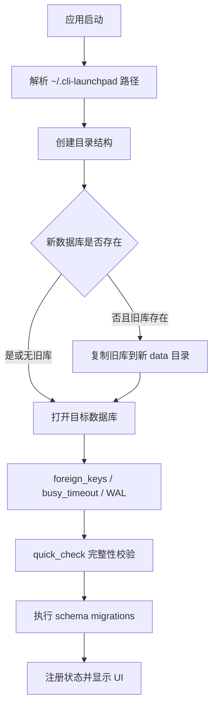

# 阶段 1：存储根目录与启动可靠性

## 目标

将业务数据从由开发标识派生的 Tauri 路径迁移到稳定用户目录，并在
启动边界加入数据库健康检查和单实例防线。

## 现状问题

- 数据库当前位于 `%APPDATA%\dev.local.cli-launchpad\cli-launchpad.db`。
- release 应用仍继承原型期 `identifier`，正式身份与开发路径混杂。
- 数据库仅启用外键和 schema migration，没有忙等待和完整性校验。
- 多开应用时可同时操作同一数据库和窗口状态文件。

## 存储路径契约

本阶段开始使用：

```text
~/.cli-launchpad/data/cli-launchpad.db
```

同时创建根目录所需结构。`cache/`、`logs/` 与 `backups/` 可创建空目录，
但直到对应阶段实施前不承载伪数据或占位文件。

窗口状态由 `tauri-plugin-window-state` 管理。该插件公开能力支持自定义
文件名但不支持自定义根目录，因此本阶段将旧窗口状态迁移到新
`identifier` 对应的 Tauri 配置目录，而不伪装为业务 `data/` 文件。

## 启动流程



## 具体改动

- 新增 `services/storage_service.rs`：
  - 构造 `StoragePaths`。
  - 创建 `data/cache/logs/backups/database/backups/manifests`。
  - 从旧 Tauri 标识目录迁移数据库。
  - 迁移 `.window-state.json` 到新标识对应目录。
- 修改 `lib.rs`：
  - 在 `setup` 中先准备存储目录，再初始化数据库。
  - 将 `StoragePaths` 注册为 Tauri 状态，供后续阶段复用。
- 修改 `db/connection.rs`：
  - 配置外键、忙等待和 WAL。
  - 对已有数据库执行 `quick_check`。
- 修改 `tauri.conf.json`：
  - `identifier` 设置为 `app.cli-launchpad.desktop`。
- 引入 `tauri-plugin-single-instance`：
  - 第二次启动时唤起并聚焦已存在主窗口。

## 失败与回退

- 新路径已有数据库时永远不覆盖。
- 旧库复制失败时应用启动失败并明确报告，旧库保持原样。
- 完整性检查失败时拒绝继续迁移/运行，避免扩大损坏。
- 旧 `%APPDATA%\dev.local.cli-launchpad` 内容不自动删除。

## 测试与验收

- 单元测试覆盖新库优先、旧库复制、无旧库初始化和损坏库拒绝打开。
- `cargo test` 与 `cargo check` 通过。
- 人工验证旧安装产生的目录和参数在新包中仍可读取。
- 人工验证第二实例只聚焦已有窗口，不启动第二个数据写入进程。
