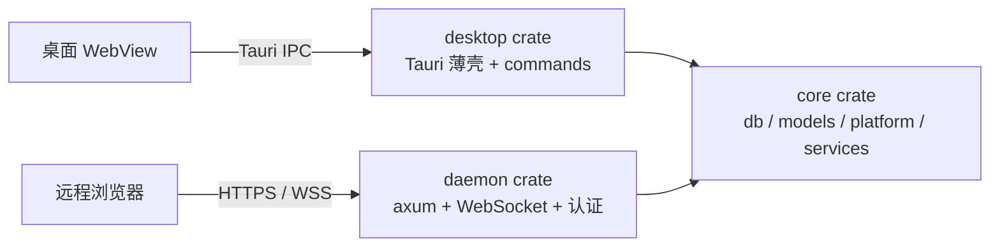

# Web 远程模式可行性调研与里程碑大纲（M11 草案）

> 状态：调研草案，**未经产品确认**。本文不改变 `product-requirements.md`、`roadmap.md` 与 `AGENTS.md` 中现有的非目标与原则；在第 8 节的决策获得确认、并完成 ADR-0003 之前，不得据此开发。
>
> 调研基线：分支 `m6-closure`，提交 `df22a68`（2026-10-08）。文中的文件数、行数、命令数均为该提交的只读代码调研结果，属于 E1 级事实陈述，不构成任何里程碑门禁证据。

## 1. 目标与结论

目标：支持启动一个 Web daemon 进程（本机直接运行，或在 Docker 中运行），用户通过浏览器远程使用现有工作台（项目、内置 PTY、文件编辑、Markdown 预览、Git），并配套远程开关与强制的安全设置（含 WebSocket 通信安全）。

结论：**技术上可行，难度中高。** 后端约 77% 的代码与 Tauri 无关，前端已有统一的 IPC 封装层。主要障碍有五项：PTY 会话模型需重写、前端窗口 API 耦合、身份与权限模型依赖 Tauri 窗口、5 个任意路径命令、产品定位文档冲突。

## 2. 可行性依据

| 维度 | 现状 | 判断 |
|---|---|---|
| 后端可复用度 | `src-tauri/src` 共 105 个 `.rs` 文件、约 3.06 万行。`db/`、`models/` 零 Tauri 依赖；`platform/` 仅 `window_geometry.rs` 使用 Tauri；services 中有 10 个文件耦合，重耦合的是 `execution_service` 与 `pty_session_service` | 可抽出 core crate |
| 命令层 | 68 个命令（async 28、sync 40）。约 46 个只依赖 `Db`、`CacheDb`、`StoragePaths`；18 个依赖窗口身份；4 个依赖 `AppHandle`；3 个带 `Channel`。`AppError` 已可序列化 | 约三分之二可机械迁移 |
| 前端传输层 | `src/lib/tauri.ts` 是 `invoke` 的唯一调用点，导出 68 个命令函数与 47 个 DTO 类型，有双端契约测试守护 | 替换点集中 |
| 终端流控 | sequence + ACK 背压（读块 16 KiB，高水位 192 KiB，低水位 64 KiB）与传输方式无关 | 可原样迁到 WebSocket |
| 文件安全 | `cap_std` 目录句柄、CAS 保存、路径规则不依赖 Tauri | 可原样复用 |
| 渲染栈 | xterm.js、Monaco、sandbox iframe 预览本身是 Web 技术 | 无需改造 |
| 并发冲突检测 | `workspace_state` 已有 `revision` 乐观并发 | 多客户端写布局有现成基础 |

## 3. 主要障碍

### 3.1 PTY 会话模型需重写（最大风险）

- 输出经 `tauri::ipc::Channel<PtyEvent>` 推送，会话归属绑定窗口 label。
- 主窗口通道发送失败时，reader 线程会终止整个会话（`pty_session_service.rs` 约 1396–1410 行）。换成 WebSocket 后，每次断线都会杀会话。
- 服务端没有 scrollback；重连依赖前端上传 xterm 序列化快照（上限 4 MiB）。断线重连无现成能力。
- 需要新增：服务端环形缓冲（按 sequence 回放）、会话与连接解耦、多客户端订阅同一会话。多订阅落地后，现有窗口交接状态机（5 个命令、18 种跨窗事件）可大幅删减。

### 3.2 前端窗口耦合

- `getCurrentWindow()` 23 处，`destroy` 21 处，`new WebviewWindow` 1 处，集中在 `PtyWorkspace.tsx`（约 4900 行）、`StandalonePtyWindow.tsx`、`StandaloneWorkspaceFileWindow.tsx`。
- 当前前端无 `isTauri` 判空，在浏览器中加载会于 `App.tsx:79` 直接抛错。需先建立 `src/lib/platform` 抽象，收口窗口、事件、对话框、剪贴板。

### 3.3 身份与权限模型依赖 Tauri 窗口

- 现有信任边界：3 套 capabilities、`window.label()` 共 19 处、PTY owner 与 mirror、交接 token、`ContentWindowGrantRegistry`。
- web 场景需重建为“连接认证 + 主体（Principal）+ 按角色的命令白名单”。
- 利好：services 层基本只收 `&str` 形式的 label，替换成本主要在 commands 层和少数 `"main"` 字面量判断。

### 3.4 5 个任意路径命令

`export_config_to_path`、`import_config_from_path`、`export_diagnostics_to_path`、`add_directory`、`open_project_directory`。桌面下路径来自本机原生对话框；远程场景等同任意文件读写，须改为上传下载、服务端目录白名单，或对远程主体禁用。

### 3.5 产品定位冲突

下列现有条款明确排除远程后端，须先改文档再动代码：

- `docs/product-requirements.md:187`：不提供远程后端
- `docs/product-requirements.md:188`：不提供多用户账号系统
- `docs/product-requirements.md:191`：不建设远程运行平台
- `docs/product-requirements.md:95`、`docs/adr-0002-embedded-pty.md:12`：PTY 由应用拥有，不脱离应用成为后台服务；不引入服务端运行时
- `AGENTS.md:37`：保持应用轻量，不引入 Electron 或服务端运行时

## 4. 架构方案

| 方案 | 说明 | 优点 | 缺点 |
|---|---|---|---|
| A. Tauri 内嵌监听器 | 桌面应用内加可选 axum 监听 | 改动最小 | 依赖 GUI 进程，无法 headless 或 Docker |
| B. 抽 core crate + 独立 daemon（推荐） | core（业务）、desktop（Tauri 薄壳）、daemon（axum + WS） | 本地与 Docker 皆可；桌面版行为不变；业务只维护一份 | 需 5 处解耦切缝 |
| C. 桌面端也作为 daemon 瘦客户端 | Tauri 只是 webview | 架构最统一 | 改动最大，偏离“轻量本地优先” |

推荐方案 B，桌面版保持进程内直调；方案 C 留作远期选项。

### 4.1 core crate 最小边界

- 进入 core：`error.rs`、`models/`、`db/`、`platform/`（除 `window_geometry.rs`）、纯 Rust services、`cli_adapters/*`，以及从 `lib.rs` 搬出的 `Db`、`CacheDb` 与启动迁移逻辑。
- 留在 desktop：`lib.rs` 的 Builder、托盘与窗口事件，`app_menu.rs`、`window_geometry.rs`、`app_lifecycle.rs`，以及全部 `commands/`。

### 4.2 5 处解耦切缝

1. `tauri::async_runtime` 替换为 `tokio`（services 内 9 处，一行替换），补 `rt-multi-thread`。
2. `StoragePaths::prepare` 改为接收显式路径，不再调用 `app.path()`。
3. `execution_service` 引入 `EventSink` trait，替换 17 处 `AppHandle`。
4. `pty_session_service` 引入 `PtyOutputSink` trait，替换 7 处 `Channel`。
5. 窗口 label 抽象为 `Principal` 与策略，消除 `"main"` 字面量判断。

## 5. 安全设计要点

PTY 本质上是远程 shell，通过认证即获得宿主机代码执行权，因此安全设计是核心需求而非附加项。

| 项目 | 要求 |
|---|---|
| 总开关 | 远程功能默认关闭，须显式开启 |
| 绑定地址 | 默认仅绑定 `127.0.0.1`；绑定非回环地址时，若无 TLS（或显式声明位于可信反向代理之后）与已配置令牌，daemon 拒绝启动 |
| 认证 | 单所有者模型，不做多用户。首次运行生成高熵令牌，设备配对换取会话。令牌不进 SQLite，使用系统凭据库；Docker 下使用 secret 或环境变量 |
| WebSocket | 握手强制校验 `Origin` 白名单（防跨站 WebSocket 劫持）；使用短时单次 ticket，长期令牌不放 URL；限制消息大小与并发连接数 |
| HTTP | 校验 `Host` 头（防 DNS rebinding）；cookie 使用 HttpOnly + SameSite=Strict；CSRF 防护；登录失败限速与锁定；空闲超时 |
| 传输 | 非回环强制 TLS（rustls、Tailscale 或反向代理）。浏览器剪贴板读取也要求安全上下文 |
| 命令暴露面 | 沿用 `contracts/app-commands.json` 作白名单；远程主体默认禁用第 3.4 节的 5 个命令及托盘、退出等桌面命令 |
| 审计 | 记录登录、连接、PTY 创建、文件写入 |
| 角色 | 可选只读角色（可看日志与文件，不可向 PTY 输入） |

## 6. 部署形态

- 本地 daemon：可行。Windows 使用 ConPTY + Job Object，Unix 使用进程组，现有平台代码可复用。
- Docker：可行（Linux 容器）。须在镜像内安装五个 CLI，项目目录与各 CLI 配置目录需挂卷；CLI 的 OAuth 登录在容器内不便，应通过 PTY 完成或改用 API key。
- Git 凭据（M9）：HTTPS credential helper 的交互界面出现在服务端而不是用户浏览器，SSH 依赖 agent 转发，须单独设计。

## 7. 前端改造范围

| 类别 | 内容 |
|---|---|
| 基本不动 | 47 个 DTO 类型、xterm 输入输出与 ACK 流程、`appStore`、i18n、`localStorage`、HTML5 拖拽、契约测试体系 |
| 集中重写 | `tauri.ts` 中的 `invoke` 与 `Channel`，改为 HTTP + WS |
| 重写 | 事件总线（7 个文件、约 9 个事件名）改为 WS 订阅 |
| 收口抽象 | 窗口 API，建立 `src/lib/platform` |
| 建议删减 | 跨窗口交接（18 种子协议 + 5 个 PTY 交接命令）；web v1 不做独立窗口，以页内面板 + 多客户端订阅替代 |
| 去除 | 自定义标题栏、托盘、退出确认、窗口状态 |
| 改造 | 目录选择改为服务端目录浏览器；配置导入导出改为上传下载；CSP 的 `connect-src` 增加 `wss:`（`csp.contract.test.ts` 须同步） |

测试资产可复用：`src/test/tauriMock.ts` 的事件路由模型可改造为浏览器端虚拟窗口总线或 fake daemon。

## 8. 里程碑大纲

### 8.1 位置

**排在 M10 之后（0.5.0 首个里程碑），不插入 M6–M10。**

- M6 尚未收口；B 层门禁（信任边界、契约版本化、Rust 生命周期拆分）正是 web 化的前置。
- 0.4.0 发布门禁是 M6–M10 全量审查，中途引入服务端会破坏门禁边界。
- M7 的 sandbox iframe 与资源协议、M8 的 Git service 应先稳定再复用。

### 8.2 拆分

工作量为单人投入的量级估计，不是承诺；M11-3 风险最高，建议先做原型再定排期。

| 子里程碑 | 内容 | 粗估 |
|---|---|---|
| M11-0 | 文档与 ADR-0003：改写非目标，定义“可选 daemon”及其与既有原则的关系 | 3–5 天 |
| M11-1 | 抽 core crate、完成 5 处切缝，桌面版行为零变化 | 1.5–2 周 |
| M11-2 | daemon 骨架：axum、认证、命令白名单、回环绑定、只读命令 | 1–2 周 |
| M11-3 | PTY 重做：scrollback 环形缓冲、会话与连接解耦、多订阅、WS 背压 | 2–3 周 |
| M11-4 | 前端 `platform` 与 `transport` 抽象、web 构建目标、去窗口化 | 2–3 周 |
| M11-5 | 远程安全加固：TLS、Origin、限速、审计、Docker 镜像、安全自查 | 1.5–2 周 |
| M11-6 | Git 认证与多客户端冲突（依赖 M9） | 待 M9 完成后评估 |

合计约 9–13 周（不含 M11-6）。

### 8.3 可并入 M6 B 层的低成本前置（仅建议，不在本草案范围内执行）

- 命令入口把裸 `WebviewWindow` 抽象为 `Principal`（对应 R-RS-1 的 `CallerWindow`）。
- `Db::call` 统一执行器（R-RS-1 本就要求）。
- 新增 `contracts/events.json` 事件契约，可兼作 web 协议 schema。

## 9. 待产品确认的决策

1. 是否允许把“不提供远程后端”改写为“可选的、默认关闭的内置监听器”。这是 M11 的先决条件。
2. 是否采用方案 B（core crate + 独立 daemon）。
3. 安全范围：仅单所有者，还是未来考虑多人协作。建议先单所有者。
4. web v1 是否放弃独立窗口。建议放弃，以页内面板替代。

## 10. 未覆盖项

- 未做 PTY 重连与环形缓冲的原型验证，M11-3 的工期仍是估计。
- 未评估 daemon 在 Windows 服务 / systemd 下的托管方式。
- 未对 axum、TLS 方案与 WebSocket 鉴权库做版本与选型调研。
- 未评估 M7（Markdown 预览资源协议）在 HTTP 下的路由细节。
