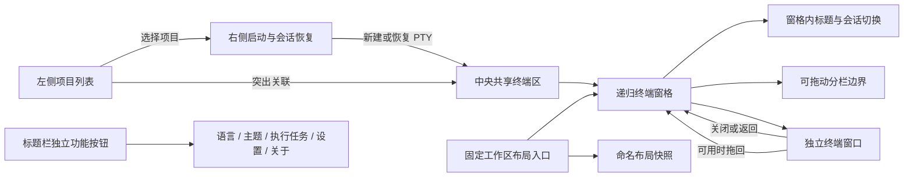

# 工作台 UI 设计

0.3.0 将 CLI Launchpad 从小窗口启动器重构为大窗口优先的轻量 CLI 会话工作台。左侧维护项目，中间完整留给跨项目共享的内置终端工作区，右侧放置五个 CLI 启动按钮和当前项目的历史会话；语言、主题、执行任务、设置和关于作为标题栏左侧的独立按钮。五项目标 CLI 为 Claude Code、Codex、Antigravity、Grok Build 和 Hermes Agent；Grok 由 G1、Hermes 由 G2 接入。

## 设计原则

- **终端优先：** 应用内 PTY 是 CLI 启动和历史恢复的唯一工作面。
- **项目是会话归属：** 项目是 PTY 的稳定归属；左侧选择项目改变启动/恢复目标并高亮关联会话，不过滤或隐藏其他项目的 PTY。
- **PTY 独立：** 每个终端是独立运行对象，拥有自己的项目、CLI、目录、运行状态和可选 CLI 对话关联。
- **窗格拥有会话切换：** 每个中央终端窗格都带自己的标题栏和会话切换项；标题、切换和终端视图处于同一窗格中，不使用脱离终端窗格的全局标签条。
- **终端可单独成窗：** 任一窗格标题可拖到其他窗格，或从右键菜单打开为独立窗口；独立窗口只显示一个终端。关闭独立窗口后，同一会话返回主工作区当前聚焦窗格。
- **中央区纯粹：** 中央区域不显示项目标题或路径；分栏直接围绕 PTY 会话，不放项目管理或 CLI 启动表单。
- **布局只做呈现：** 标签和分栏布局引用现存 PTY，不负责拥有、迁移或终止它们。
- **轻量工作台：** 仅围绕 Claude Code、Codex、Antigravity、Grok Build、Hermes Agent 五项 CLI；不扩展为通用 IDE、Agent 编排器或 worktree 管理器。
- **不配置启动参数：** 普通 CLI 使用默认启动行为；会话恢复只由应用附加 CLI 所需的内部恢复参数。
- **辅助能力不丢失：** 会话历史、版本更新、任务日志、备份和托盘仍可从工作台访问。
- **应用窗口统一：** 主工作区和独立终端窗口共享自定义标题栏样式；主窗口全局操作固定在顶部，项目区不重复显示产品 Logo/名称。macOS 保留原生交通灯。

## 界面语言、方向与字体

- 语言选项使用中文、英语、西班牙语、德语、日语、法语、阿拉伯语、葡萄牙语、俄语和韩语的原生名称，并将选择保存在本机偏好中；首次启动按系统语言匹配，未匹配时使用英语。阿拉伯语界面使用从右向左的文档方向。
- 语言切换同步文档的 BCP 47 `lang` 和书写方向。阿拉伯语采用从右向左的界面方向；终端输出和命令保持从左向右。
- 中文是界面文案的设计语义源。日语和韩语直接依据中文翻译；英文从中文精确翻译，并作为西欧语系界面文案的源语言，再据英文翻译西班牙语、德语、法语和葡萄牙语。阿拉伯语、俄语等其他语言翻译时应以中文语义为准，并可用英文交叉校对。
- 日期、时间和相对时间按当前界面语言格式化。界面字体为多文种字体栈，缺字时回退到系统字体。

## 主题语义样式

- 文本按标题、正文、次要、辅助和禁用语义选择；按钮按主按钮、普通按钮、文字/图标按钮和危险按钮语义选择。
- 主按钮用于更新、确认、保存等主要操作；普通按钮用于应用布局、取消等一般操作；危险按钮用于删除等不可逆操作。
- 每种语义在浅色与深色主题中映射对应的文字、表面、边框和状态颜色。默认、悬停、按下、键盘焦点、禁用状态均由公共样式统一定义。
- 语义色由 `--text-*` 与 `--button-*` 变量提供，控件高度、字号、字重和行高使用共享规格变量；按钮禁用和按下状态不得由单个页面重复定义。
- 标题栏、窗格和布局列表中的图标操作使用 28px 点击区域、16px 图标；布局列表的紧凑图标使用 14px 图标。Toast 与标题栏保持间距，不遮挡标题栏。
- 字号、字重、行高、控件高度、内边距、圆角和间距由跨主题共享的规格变量管理；组件选择语义角色，不依赖浏览器默认字号或复制通用状态样式。
- Toast 关闭按钮在提示内容区域内垂直居中，多行消息下保持稳定对齐。

## 主窗口信息架构



```text
┌──────────────┬──────────────────────────────────────────┬──────────────┐
│ 项目列表     │ 项目A-Claude-01         项目上下文         │
│ 搜索名称     ├──────────────────┬───────────────────────┤ Claude Code  │
│ 项目 A       │ 窗格标题/会话切换 │ 窗格标题/会话切换    │ Codex        │
│ 项目 B       │    PTY 终端       │     PTY 终端         │ Antigravity  │
│ 项目 C       │                  ├───────────┬───────────┤ 历史会话     │
│              │ 可拖动分栏边界   │ 窗格 C    │ 窗格 D    │              │
│              │                                          │              │
├──────────────┴──────────────────────────────────────────┴──────────────┤
│ 标题栏：左栏开关 / 语言 / 主题 / 执行任务 / 设置 / 关于                │
└───────────────────────────────────────────────────────────────────────┘
```

这是信息架构草图，不规定最终像素尺寸、图标或视觉主题。跨项目标签、分栏、比例调整和单会话独立窗口在 M2 验收；布局保存和重启恢复在 M3 验收。

## 应用窗口标题栏

- 主工作区标题栏在软件名右侧提供左栏收起/展开按钮，其右侧依次放置语言、主题、执行任务、设置和关于五个独立功能按钮；语言和主题仍通过各自弹出菜单选择。左栏默认展开，收起时仅隐藏项目区，五个功能按钮继续留在标题栏，中央工作区占满可用宽度。开合状态作为本机 UI 偏好持久化，独立终端窗口不显示这些主工作区按钮。标题栏还固定显示布局保存/应用等全局操作；项目详情页会在布局操作左侧，按 CLI 适配器注册顺序显示启动按钮。按钮复用适配器图标和现有 PTY 启动生命周期，在当前项目的焦点窗格启动，不打开右侧上下文栏；不可用的 CLI 或尚未恢复完成的工作区会禁用对应按钮。窗口按钮位于右侧且不随窗格焦点移动。左侧项目区直接从项目列表开始，不再保留 Logo、软件名标题行或底部功能区。
- 独立终端窗口使用同一标题栏视觉，显示 CLI 图标、会话标题、“返回工作区”和窗口控制；不显示侧栏或布局操作。
- Windows/Linux 使用应用绘制的最小化、最大化/还原、关闭按钮；macOS 保留原生红黄绿交通灯，应用内容避开交通灯并覆盖到原生标题栏区域。
- 主窗口标题栏空白区和左侧 Logo/软件名品牌区用于移动窗口，双击这两个区域最大化/还原；其他功能按钮和弹层区域不触发窗口事件。独立窗口仍只使用标题栏空白区移动或最大化/还原；终端会话标题继续作为会话拖放源，和窗口拖动区分离。
- 关闭按钮继续遵循应用已有的托盘、退出确认、活动 PTY 保护和独立窗口会话回收规则；自定义标题栏不改变窗口几何持久化。

## 导航区

- 只显示项目名称并按名称搜索，不在列表行显示项目路径。
- 添加与编辑通过弹窗完成；编辑支持重命名且保留目录路径。项目操作菜单提供置顶、打开目录和移除。
- 项目列表占用侧栏标题和搜索区下方的剩余空间，使用固定行高与固定间距；项目较多时仅列表滚动，侧栏底部操作保持固定。滚动条采用覆盖式指示器，默认隐藏、滚动期间短暂显示并可拖动，颜色跟随主题且不挤占项目行宽度。项目可通过拖放手动排序，顺序持久化到项目目录记录；置顶与普通项目分组独立排序，不能跨组拖动。搜索过滤时关闭拖放，避免只对部分可见条目重排。
- 已置顶项目使用与选中态有区别的琥珀/古铜强调边框；项目同时选中时保留蓝色选中底色，以琥珀色侧边标识置顶。所有项目行统一文字左内边距，状态变化不移动项目名称。项目行、CLI 会话计数行和嵌套间距使用紧凑规格，保留各项名称和计数的可读性。
- 选择项目会设定右侧启动/恢复目标，并突出显示中央工作区中归属该项目的标签和分栏；其他项目会话保持可见、可操作且持续运行。
- 执行任务、设置和关于放在侧栏底部，以带文字提示和无障碍名称的图标访问；执行中任务数量显示为图标角标。

## 终端工作区

- 所有项目的 PTY 会话共享中央工作区，不因项目选择而过滤或替换其他项目的会话。
- 内置窗格标题栏高度为 32px，低于应用标题栏；项目工作区四周留白在常规窗口为 8px、窄屏为 4px，以优先留出中央窗格空间。
- 每个窗格的标题栏显示该窗格关联会话的项目名、CLI 简称、序号和运行状态；会话切换项与其 PTY 终端在同一窗格内。默认标题为 `项目名-CC-01`、`项目名-CDX-01`、`项目名-AGY-01`；G1 接入后 Grok Build 使用 `项目名-GB-01`，G2 接入后 Hermes Agent 使用 `项目名-HA-01`。序号按项目和 CLI 全局递增，独立窗口中的会话同样参与计数；简称只用于终端标题，其他界面保留完整 CLI 名称。
- 从活动标题或堆叠会话列表拖到另一窗格会移动同一 PTY，目标窗格随即激活，源窗格清空后仍保留；终端右键菜单可选择在独立窗口打开。独立窗口只承载一个 PTY，不允许分栏，标题栏提供“返回工作区”。
- 关闭独立窗口时，将终端还回主工作区当前聚焦窗格；若跨 Tauri 窗口的标题拖放可用，拖回目标窗格直接落入该窗格，否则用“返回工作区”回收至当前聚焦窗格。两条路径都不终止或复制 PTY。
- 独立窗口加载当前 xterm 屏幕快照后接管输入、尺寸调整和 PTY 输出。交接失败时保留原窗口和原 PTY；交接完成前不销毁源终端视图。
- 用户可在任一聚焦窗格内创建横向或纵向子窗格；新窗格为空并获得焦点，之后从右侧启动或恢复的会话进入该窗格。分栏边界可像 VS Code 一样连续拖动，独立改变相邻窗格大小；同一 PTY 会话在布局树中最多出现一次。
- 每个窗格标题栏只完整展示当前活动会话；其余会话按活动项前后分别堆叠在左右入口中，点击后展开列表，可切换、关闭、右键操作或拖动会话。标签栏不显示横向滚动条；活动会话名称过长时允许换行并让标题栏随内容增高。
- 聚焦窗格或会话会同步左侧项目与右侧会话上下文；各窗格保留自己的活动会话。
- 窗格标题显示唯一编号，初始主窗格为“窗格-1”；“移至窗格”菜单复用同一编号，并在编号后显示目标内容。窗格删除时保留其他编号，新建时复用当前最小空缺编号，确保标题与菜单锚点一致。
- 左侧选择项目只改变项目目标和关联高亮，不改变焦点或分栏布局。所属项目与当前选择不一致的其他 PTY 仍可操作。
- 关闭运行中会话项时明确提示并只结束对应 PTY；PTY 自然退出后自动关闭对应会话窗口，保留原窗格及分栏关系为空状态。用户可在目标空窗格启动 CLI 或从右侧历史会话恢复。切换窗格和调整分栏不结束 PTY。
- 工作区顶部的固定工具区提供当前布局保存状态与命名快照入口；它属于整个工作区，不跟随活动窗格移动。入口可保存当前布局为命名快照，并列出、重命名、删除、应用和明确确认后覆盖快照；中央区不增加项目标题或路径。
- 当前工作区的窗格树、比例、活动会话、焦点和标题状态自动保存。命名布局是应用时复制到当前工作区的快照；应用不创建、启动、终止或迁移 PTY 进程，只改变主工作区终端视图的布局归属。快照中没有的主工作区运行会话按稳定顺序回到原窗格：先匹配 pane ID，再匹配窗格编号；目标布局没有对应窗格时放入其焦点窗格。同一个 slot/session 不重复出现。
- 当前工作区还保存独立窗口中的 slot 元数据，但命名快照不保存独立窗口状态。应用重启后独立窗口会话不再弹出；其已结束会话项移除，原窗格树保持不变。应用快照时，独立窗口会话继续留在独立窗口，从目标窗格树中排除，不触发交接；即使快照引用同一会话，也不会重复挂入窗格。独立会话的 slot 和项目/CLI 序号保留。
- 应用重启后按保存的 pane tree 恢复布局，移除旧 PTY 会话项，保留窗格编号、焦点、分栏和比例；不恢复终端屏幕输出或滚屏，也不自动启动 CLI。用户可在选定空窗格中通过右侧历史会话列表恢复。
- 遇到未知布局版本或损坏的当前布局时，使用空工作区保证其他功能可用，同时保留原数据并暂停自动保存；用户显式选择重置后才写入新布局。单个损坏的命名快照可独立删除，不影响当前工作区和其他快照。
- PTY 自然退出只从当前布局移除会话项，不自动改写命名快照；稍后应用快照时，已结束会话项被省略，窗格及分栏关系保留。项目/会话身份失效、旧引用或局部布局损坏只影响对应诊断占位项，允许单独移除并保留其他 pane。
- 自动标题根据当前项目名和 CLI/序号生成，项目重命名时更新；自定义标题作为独立标题类型持久化，项目重命名时保留用户填写的内容。
- 终端模拟器支持 Unicode/中文、ANSI 色彩、常见全屏 TUI、滚动缓冲和搜索。Windows 使用 Ctrl+Shift+C/V 将所选文本复制到系统剪贴板或将系统文本粘贴进终端；Ctrl+C 继续发送给 CLI。Claude Code 的图片快捷键为 Alt+V，Codex 为 Ctrl+V，图片数据不经 PTY 转发。
- 无运行中的 PTY 时隐藏 xterm 光标；启动会话后显示 CLI 自身控制的光标状态。上下文面板重开按钮固定在左侧栏品牌标题行右侧，只在项目详情且右栏折叠时显示，不随当前聚焦窗格移动。
- WebView 默认右键菜单全局关闭；项目行右键打开与“…”按钮相同的项目操作菜单。终端标签右键菜单以被点击的会话为操作目标，支持左右/上下拆分、拆分并移入、移动到其他窗格、关闭当前会话、关闭同窗格其他会话或全部会话；批量关闭统一确认一次。

## 项目、PTY、CLI 对话与布局

| 对象       | 含义                                                                               | 生命周期                                                                                |
| ---------- | ---------------------------------------------------------------------------------- | --------------------------------------------------------------------------------------- |
| 项目       | 显示名称与本地目录                                                                 | 持久化；名称可编辑，路径保持稳定                                                        |
| PTY 会话   | 一个交互式 CLI 进程及其内存终端状态                                                | 独立创建/关闭；归属项目和 CLI；会话 ID 独立于标签或布局                                 |
| CLI 对话   | CLI 自己的可恢复历史会话                                                           | 由 CLI 本地事实来源管理，可选关联到 PTY                                                 |
| 工作区布局 | 当前工作区的递归分栏树、窗格内有序内容引用、活动内容、焦点和比例；命名布局是其快照 | M2 仅在本次应用运行期间维护；M3 自动保存当前工作区并提供命名快照；不拥有 PTY 或编辑缓冲 |

PTY 的 slot 实例 ID、PTY 会话 ID、CLI 对话 ID 和布局 ID 使用不同标识。M3 保存的全局布局可包含多个项目的 PTY 引用；slot 身份在 PTY 会话 ID 产生前已存在，恢复时分别校验二者。引用失效时保留其他面板，显示可恢复占位。布局调整不更改 CLI 历史记录。隐藏到托盘时 PTY 继续运行；显式退出时提示并终止应用托管的活动 PTY；重启后会话恢复为已结束状态，不恢复终端输出或滚屏，用户可重新启动或从 CLI 历史恢复。SQLite 数据库备份包含当前布局和命名快照；JSON 配置交换不包含它们。

## CLI 对话历史与恢复

右侧项目上下文区按当前选中项目合并显示五项 CLI 的历史对话，并按最近活动时间排序。普通历史列表按 CLI 独立分页；列表项显示 CLI 品牌图标。会话搜索只匹配当前项目的可重建本地索引，字段与历史列表的实际显示标题对齐，并覆盖 CLI 提供的 summary、受限首条用户消息或 preview；不扫描完整对话正文。项目激活和手动刷新时有界更新 SQLite FTS5 trigram 索引，查询仅访问索引，1–2 个字符由短词回退处理。最多返回 2,000 条并仅暂存在前端内存；界面按 10 条显示，清除搜索或切换项目时释放搜索结果。索引仅写入独立缓存库，不保存项目路径；会话别名仍来自业务 SQLite。点击历史对话时，先验证会话归属当前项目，再调用对应 CLI 的原生恢复机制，在中央工作区当前聚焦窗格创建独立 PTY 会话项；不会把历史正文复制进应用数据库。

| CLI          | 会话事实来源                                           | 恢复方式                                        |
| ------------ | ------------------------------------------------------ | ----------------------------------------------- |
| Claude Code  | `sessions-index.json` 与项目目录内 JSONL               | `claude --resume <session-id>`                  |
| Codex        | App Server `thread/list`，失败时回退本地 sessions      | `codex resume <session-id>`                     |
| Antigravity  | 本机摘要 SQLite 与 conversation metadata               | `agy --conversation=<uuid>`                     |
| Grok Build   | `~/.grok/sessions/` 下官方会话 summary metadata        | `grok --resume <session-id>`                    |
| Hermes Agent | 当前有效 Hermes home 对应 Profile 的 `state.db` 元数据 | `hermes --resume <session-id> --no-restore-cwd` |

历史按项目过滤，标题优先使用 CLI 原生摘要或名称；用户别名继续以 `tool_key + session_id` 稀疏保存。Grok 只读取 summary metadata，不读取 transcript 或 `updates.jsonl`；也不调用会合并远端结果的原生 `grok sessions search`。Hermes 遵循当前有效 home/Profile 解析结果，只读一个 `state.db` 中 `source=cli` 的会话元数据，不枚举或切换 Profile，不读取消息平台会话、全文 FTS 或完整正文；恢复参数固定当前项目目录。PTY 与 CLI 对话未能可靠匹配时，终端仍正常工作，只是不显示对话关联信息。

## 上下文面板

右侧项目面板可折叠，并按当前项目提供三个页签。项目上下文保留 0.3.0 的启动目标和历史恢复；文件与 Git 管理通过中央工作窗格打开内容，不直接占用右栏编辑空间：

- 项目上下文：当前目标项目名称、打开目录、五项 CLI 启动按钮，以及按最近活动时间合并排列的会话历史、搜索和恢复操作。
- 文件管理：项目内目录树和文件打开入口；打开文本文件时在中央工作窗格新建或聚焦文件编辑内容，不替换其他 PTY。0.4.0 首期聚焦浏览、打开、编辑和保存。
- Git 管理：当前分支、工作区状态、分支操作、远程和变更文件；选择变更文件可在编辑器打开对应版本和差异。
- 右栏只承载项目上下文，不持有编辑器缓冲或 Git 子进程。文件树和 Git 列表均以当前选中项目为根；切换项目时，已打开的窗格内容不隐式关闭。

右栏顶部采用紧凑双行结构：第一行左侧以项目上下文、文件、Git 三个图标按钮切换页签，右侧保留打开项目目录与收起面板操作；第二行显示当前项目名称，不再占用完整页签导航条高度。三个图标按钮必须提供可访问名称和悬停提示。项目名单行省略，文本字号使用正文/说明级，不增加独立大标题高度。

窗格容器统一提供焦点、标题、内容切换、关闭、拖动换窗格、右键菜单和独立窗口操作。终端与文件标签使用相同的选中、关闭和拖动命中区域，右键菜单共用定位、键盘导航及通用操作，内容特有操作由 adapter 提供。PTY 的生命周期仍由 Rust service 独占；文件独立窗口往返时只传递受校验的文件引用、运行期编辑缓冲和版本，不把正文持久化。Git 操作不通过自由命令输入执行。

窗格标题、内容区域和中央工作区宿主的外边缘统一使用直角，不对窗格或工作区容器应用圆角。

## 文件编辑与 Markdown 预览

- 文件树采用按需展开，默认隐藏 Git 内部目录和常见忽略内容；用户可显式展开隐藏项。目录读取与文件打开均限制在项目根目录。
- 文件编辑器在窗格内拥有独立文档标签和脏状态；保存、关闭、切换文件或工作区恢复时，未保存内容必须明确处理。检测到外部修改时保留编辑缓冲并提供重新载入或覆盖前比较，不静默丢弃任一版本。
- 文件编辑器工具栏中文件路径允许收缩并以省略号呈现；保存按钮保持不换行的固定内容宽度，窄窗格内也不可压缩成竖排文本。
- Markdown 源文件可作为普通文本编辑；其预览作为独立窗格内容连续滚动展示。用户可选择文档主题，应用自身浅色/深色主题与文档样式互不覆盖。
- Markdown 预览只渲染，不分页、不导出；ECharts 图表随预览尺寸变化重排，关闭或重新渲染时销毁旧实例。
- 文件与 Git 内容可从各自的列表打开同一路径；编辑器根据当前 Git 状态呈现行级新增、修改、删除标记，并按需显示 blame，不以预览或终端窗格替代当前工作内容。

## Git 管理体验

- Git 页签显示仓库发现状态、当前分支、上游关系、工作区与暂存区变化、远程同步状态。Git 未安装或当前目录非仓库时保留文件和终端工作流，并解释缺少的 Git 能力。
- 分支创建、切换、重命名和删除应显示作用对象；遇到未提交改动、当前分支或未合并提交等保护条件时，不暗中丢弃更改。
- 新增或修改远程后提供连接验证；需要认证时由系统 Git credential helper、浏览器/原生认证界面或 SSH agent 承接。认证成功由已配置的系统 helper 保存，Launchpad 不显示或保存秘密值。
- Pull 清晰展示快进、rebase 与冲突状态；分支分叉时不得暗中选择整合策略。冲突期间显示受影响文件和当前 Git 操作，并提供查看双方、编辑结果、继续、跳过及中止入口。
- Push、Pull、Fetch 等网络操作显示目标 remote/branch、阶段进度和可取消状态；中断或失败后重新读取仓库状态，不以过期 UI 缓存推断成功。

## 辅助视图

### CLI 管理

保留当前设置页中的 CLI 检测、版本查询、官方安装与更新计划确认。创建后台任务后可继续使用工作台，任务状态和实时日志在独立任务视图中查看。

### 执行任务

保留最近任务、分流日志、单 CLI 并行行为、终止和清理能力。安装/更新任务与交互式 PTY 分开管理，终止一个执行任务不能误终止同一 CLI 的其他终端。

### 配置与数据

保留项目与 CLI 配置、配置 JSON 导入导出、SQLite 备份恢复、诊断导出、主题和语言设置。全局与项目级自定义启动参数、模型选择入口移除；旧库参数记录保留但不再执行，旧配置导入忽略参数字段，新配置导出不含参数字段。布局预设不进入 CLI 配置 bundle。

## 尺寸与适配

- 主窗口以常规桌面大窗口为设计基线，支持扩大至全屏工作区。
- 主窗口默认尺寸为 1360×860，最小尺寸为 960×640；左侧项目栏与终端工作区始终并排显示，窗口变窄时不切换为上下堆叠布局。再次启动时恢复上次关闭时的窗口大小和位置；若显示器被移除或分辨率变化，窗口移动到可用显示器并完整收进工作区。最大化和全屏状态保持系统原生行为。
- 默认主区保持足够宽度；拖动分栏比例时各 PTY 按自身实际可用尺寸调整。
- PTY 尺寸必须满足安全行列边界；空间不足时阻止继续拆分或显示可理解提示，不向 Rust 提交零尺寸或超界尺寸。
- 右侧上下文区可以折叠或覆盖；左侧项目栏宽度保持稳定，主工作区始终保留终端区域。
- 隐藏到托盘、显式退出、异常结束和重启时的 PTY/布局行为按上文生命周期契约执行；界面必须明确区分“布局已恢复”和“进程仍在运行”。

## 视觉标识

Windows、macOS、Linux 安装包、应用内 Logo 和 README 使用统一圆角正方形产品图形。Windows 不使用圆形专属变体。CLI 厂商品牌图标仍用于区分 Claude Code、Codex、Antigravity，不替代产品 Logo。

## 0.2.x 迁移说明

现有卡片主页、项目详情、参数编辑、设置、执行任务和关于视图是 0.2.x 基线设计。0.3.0 移除独立项目管理页和自定义参数编辑，将项目维护放入左侧弹窗，将五个内置 CLI 启动按钮与合并后的历史恢复放入右侧上下文区；语言、主题、任务、设置和关于入口位于主窗口标题栏左侧。普通 CLI 启动不保留外部终端入口或命令预览；PTY 启动失败时直接显示错误。
