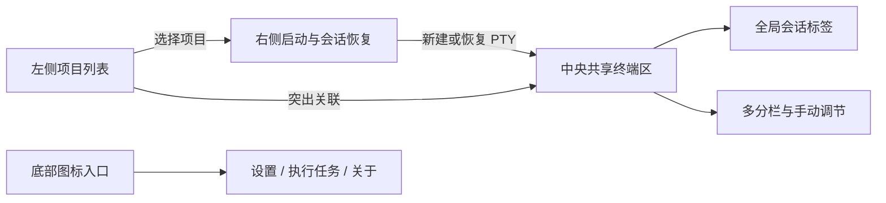

# 工作台 UI 设计

0.3.0 将 CLI Launchpad 从小窗口启动器重构为大窗口优先的轻量 CLI 会话工作台。左侧维护项目，中间完整留给跨项目共享的内置终端工作区，右侧放置三个 CLI 启动按钮和当前项目的历史会话；设置、执行任务和关于作为底部图标入口。

## 设计原则

- **终端优先：** 应用内 PTY 是 CLI 启动和历史恢复的唯一工作面。
- **项目是会话归属：** 项目是 PTY 的稳定归属；左侧选择项目改变启动/恢复目标并高亮关联会话，不过滤或隐藏其他项目的 PTY。
- **PTY 独立：** 每个终端是独立运行对象，拥有自己的项目、CLI、目录、运行状态和可选 CLI 对话关联。
- **中央区纯粹：** 中央区域不显示项目标题、路径或通用终端标题；标签和分栏直接围绕 PTY 会话，不放项目管理或 CLI 启动表单。
- **布局只做呈现：** 标签和分栏布局引用现存 PTY，不负责拥有、迁移或终止它们。
- **轻量工作台：** 仅围绕 Claude Code、Codex、Antigravity 三项 CLI；不扩展为通用 IDE、Agent 编排器或 worktree 管理器。
- **不配置启动参数：** 普通 CLI 使用默认启动行为；会话恢复只由应用附加 CLI 所需的内部恢复参数。
- **辅助能力不丢失：** 会话历史、版本更新、任务日志、备份和托盘仍可从工作台访问。

## 主窗口信息架构



```text
┌──────────────┬──────────────────────────────────────────┬──────────────┐
│ 项目列表     │ 全局会话标签                             │ 项目上下文   │
│ 搜索名称     ├──────────────────────┬───────────────────┤ Claude Code  │
│ 项目 A       │ 项目A-Claude-01       │ 项目B-Codex-01    │ Codex        │
│ 项目 B       │                      │                   │ Antigravity  │
│ 项目 C       │        PTY 终端       │      PTY 终端      │ 历史会话     │
│              ├──────────────────────┴───────────────────┤              │
│              │ 可拖动的分隔线 / 其他分栏                │              │
│              │                                          │              │
├──────────────┴──────────────────────────────────────────┴──────────────┤
│ 底部图标：执行任务 / 设置 / 关于                                      │
└───────────────────────────────────────────────────────────────────────┘
```

这是信息架构草图，不规定最终像素尺寸、图标或视觉主题。跨项目标签、分栏与比例调整在 M2 验收；布局保存和重启恢复在 M3 验收。

## 导航区

- 只显示项目名称并按名称搜索，不在列表行显示项目路径。
- 添加与编辑通过弹窗完成；编辑支持重命名且保留目录路径。项目操作菜单提供置顶、打开目录和移除。
- 选择项目会设定右侧启动/恢复目标，并突出显示中央工作区中归属该项目的标签和分栏；其他项目会话保持可见、可操作且持续运行。
- 执行任务、设置和关于放在侧栏底部，以带文字提示和无障碍名称的图标访问；执行中任务数量显示为图标角标。

## 终端工作区

- 所有项目的 PTY 会话共享中央工作区，不因项目选择而过滤或替换其他项目的会话。
- 全局标签列出已创建会话；标签显示项目、CLI、序号和运行状态。默认标题为 `项目名-Claude-01`、`项目名-Codex-01`、`项目名-Antigravity-01`；手动重命名后保留用户标题。
- 用户可拆分当前分栏；空分栏聚焦后，从右侧启动或恢复的会话进入该分栏。分隔线可拖动调整比例；同一 PTY 会话在布局中最多出现一次。
- 选择未显示的会话标签时，将其放入当前聚焦分栏；原会话仍运行，并继续通过全局标签访问。聚焦已有会话会聚焦其所在分栏，并同步左侧项目与右侧会话上下文。
- 左侧选择项目只改变项目目标和关联高亮，不改变焦点或分栏布局。所属项目与当前选择不一致的其他 PTY 仍可操作。
- 关闭运行中会话标签时明确提示并只结束对应 PTY；移除布局分栏只解除布局引用，不结束其中 PTY。
- 终端模拟器支持 Unicode/中文、ANSI 色彩、常见全屏 TUI、滚动缓冲和搜索。Windows 使用 Ctrl+Shift+C/V 将所选文本复制到系统剪贴板或将系统文本粘贴进终端；Ctrl+C 继续发送给 CLI。Claude Code 的图片快捷键为 Alt+V，Codex 为 Ctrl+V，图片数据不经 PTY 转发。
- 无运行中的 PTY 时隐藏 xterm 光标；启动会话后显示 CLI 自身控制的光标状态。上下文面板重开按钮在浅色/深色应用主题下都保持对深色终端画布的清晰对比。
- WebView 默认右键菜单全局关闭；项目行右键打开与“…”按钮相同的项目操作菜单。

## 项目、PTY、CLI 对话与布局

| 对象 | 含义 | 生命周期 |
| --- | --- | --- |
| 项目 | 显示名称与本地目录 | 持久化；名称可编辑，路径保持稳定 |
| PTY 会话 | 一个交互式 CLI 进程及其内存终端状态 | 独立创建/关闭；归属项目和 CLI；会话 ID 独立于标签或布局 |
| CLI 对话 | CLI 自己的可恢复历史会话 | 由 CLI 本地事实来源管理，可选关联到 PTY |
| 工作区布局 | 跨项目 PTY 面板的排列、焦点和比例 | M2 仅在本次应用运行期间维护；M3 持久化/保存；不拥有 PTY |

PTY 的会话 ID、CLI 对话 ID 和布局 ID 使用不同标识。M3 保存的全局布局可包含多个项目的 PTY 引用；引用失效时保留其他面板，显示可恢复占位。布局调整不更改 CLI 历史记录。隐藏到托盘时 PTY 继续运行；显式退出时提示并终止应用托管的活动 PTY；重启后会话恢复为已结束状态，不恢复终端输出或滚屏，用户可重新启动或从 CLI 历史恢复。

## CLI 对话历史与恢复

右侧项目上下文区按当前选中项目合并显示 Claude Code、Codex、Antigravity 的历史对话，并按最近活动时间排序。每个 CLI 的分页独立；列表项显示 CLI 品牌图标。点击历史对话时，先验证会话归属当前项目，再调用对应 CLI 的原生恢复机制，在中央工作区创建独立 PTY 标签；不会把历史正文复制进应用数据库。

| CLI | 会话事实来源 | 恢复方式 |
| --- | --- | --- |
| Claude Code | `sessions-index.json` 与项目目录内 JSONL | `claude --resume <session-id>` |
| Codex | App Server `thread/list`，失败时回退本地 sessions | `codex resume <session-id>` |
| Antigravity | 本机摘要 SQLite 与 conversation metadata | `agy --conversation=<uuid>` |

历史按项目过滤，标题优先使用 CLI 原生摘要或名称；用户别名继续以 `tool_key + session_id` 稀疏保存。PTY 与 CLI 对话未能可靠匹配时，终端仍正常工作，只是不显示对话关联信息。

## 上下文面板

右侧项目上下文区可折叠，当前负责启动目标和历史恢复，不承担中央终端布局：

- 当前目标项目名称、打开目录和面板折叠操作。
- Claude Code、Codex、Antigravity 三枚紧凑的独立启动按钮，检测为未安装时禁用。
- 按最近活动时间合并排列的目标项目历史会话及内置恢复操作。

全局会话标签提供焦点、标题和关闭操作；Rust service 仍是唯一 PTY 生命周期所有者。普通 CLI 启动不展示外部终端入口或命令预览。

## 辅助视图

### CLI 管理

保留当前设置页中的 CLI 检测、版本查询、官方安装与更新计划确认。创建后台任务后可继续使用工作台，任务状态和实时日志在独立任务视图中查看。

### 执行任务

保留最近任务、分流日志、单 CLI 并行行为、终止和清理能力。安装/更新任务与交互式 PTY 分开管理，终止一个执行任务不能误终止同一 CLI 的其他终端。

### 配置与数据

保留项目与 CLI 配置、配置 JSON 导入导出、SQLite 备份恢复、诊断导出、主题和语言设置。全局与项目级自定义启动参数、模型选择入口移除；旧库参数记录保留但不再执行，旧配置导入忽略参数字段，新配置导出不含参数字段。布局预设不进入 CLI 配置 bundle。

## 尺寸与适配

- 主窗口以常规桌面大窗口为设计基线，支持扩大至全屏工作区。
- 默认主区保持足够宽度；拖动分栏比例时各 PTY 按自身实际可用尺寸调整。
- PTY 尺寸必须满足安全行列边界；空间不足时阻止继续拆分或显示可理解提示，不向 Rust 提交零尺寸或超界尺寸。
- 窗口变窄时优先折叠右侧上下文区，再压缩左侧导航，保留聚焦终端可操作；必要时提示分栏过窄。
- 隐藏到托盘、显式退出、异常结束和重启时的 PTY/布局行为按上文生命周期契约执行；界面必须明确区分“布局已恢复”和“进程仍在运行”。

## 视觉标识

Windows、macOS、Linux 安装包、应用内 Logo 和 README 使用统一圆角正方形产品图形。Windows 不使用圆形专属变体。CLI 厂商品牌图标仍用于区分 Claude Code、Codex、Antigravity，不替代产品 Logo。

## 0.2.x 迁移说明

现有卡片主页、项目详情、参数编辑、设置、执行任务和关于视图是 0.2.x 基线设计。0.3.0 移除独立项目管理页和自定义参数编辑，将项目维护放入左侧弹窗，将三个内置 CLI 启动按钮与合并后的历史恢复放入右侧上下文区；任务、设置和关于改为侧栏底部图标入口。普通 CLI 启动不保留外部终端入口或命令预览；PTY 启动失败时直接显示错误。
