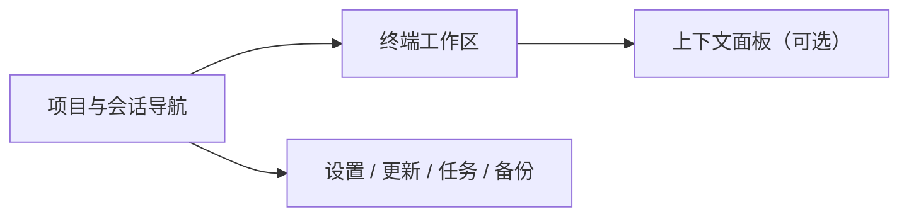

# 工作台 UI 设计

0.3.0 将 CLI Launchpad 从小窗口启动器重构为大窗口优先的轻量 CLI 会话工作台。主操作发生在项目导航和内置终端之间；设置、安装更新、执行任务和备份作为工作台内的辅助视图。

## 设计原则

- **终端优先：** 应用内 PTY 是主要工作面，外部终端不再承担默认交互窗口。
- **项目是导航归属：** 项目是稳定上下文，切换项目只改变当前可见内容，不隐式关闭其他项目的 PTY。
- **PTY 独立：** 每个终端是独立运行对象，拥有自己的项目、CLI、目录、运行状态和可选 CLI 对话关联。
- **布局只做呈现：** 标签和分栏布局引用现存 PTY，不负责拥有、迁移或终止它们。
- **轻量工作台：** 仅围绕 Claude Code、Codex、Antigravity 三项 CLI；不扩展为通用 IDE、Agent 编排器或 worktree 管理器。
- **辅助能力不丢失：** 项目参数、会话历史、版本更新、任务日志、备份和托盘仍可从工作台访问。

## 主窗口信息架构



```text
┌──────────────┬───────────────────────────────────────┬──────────────┐
│ 项目与会话   │ 工具标签 / 分栏工具栏                  │ 上下文面板   │
│              ├───────────────────────────────────────┤（可折叠）    │
│ 搜索项目     │ Claude │ Codex │ Agy                  │              │
│ 项目列表     ├─────────────────────┬─────────────────┤ CLI 对话信息 │
│ 最近会话     │                     │                 │ 启动参数     │
│              │   内置终端 PTY       │   内置终端 PTY   │ 会话操作     │
│              │                     │                 │              │
├──────────────┴─────────────────────┴─────────────────┴──────────────┤
│ 状态栏：项目路径、CLI 状态、终端状态                                 │
└─────────────────────────────────────────────────────────────────────┘
```

这是信息架构草图，不规定最终像素尺寸、图标或视觉主题。详细布局和面板交互在 0.3.0 M0 与 M2 阶段验收。

## 导航区

- 展示常用项目目录、CLI 图标、可用状态和活动 PTY 数量。
- 支持搜索、置顶和添加/移除项目。
- 展开项目可按 CLI 查看活动终端与最近历史会话。
- 切换项目后显示该项目活动布局；其他项目的 PTY 保持活动且可再次进入。
- 设置、安装更新、执行任务、备份/恢复和关于通过稳定的辅助入口访问，不占据终端主区域。

## 终端工作区

- 新建终端时选择 Claude Code、Codex、Antigravity，使用当前项目目录与其已保存启动参数。
- 每个终端标签展示工具身份、标题、运行状态和可用的 CLI 对话名称。
- 同一项目可运行多个 CLI，亦可运行同一 CLI 的多个独立 PTY。
- 支持标签切换、关闭、重命名、分栏、拖动调整分栏比例与终端焦点切换。
- 终端模拟器支持 Unicode/中文、ANSI 色彩、常见全屏 TUI、复制粘贴、滚动缓冲和搜索。
- 面板关闭仅结束该 PTY；应用需按 M0 决策对用户进行明确反馈，避免误关仍运行的 CLI。

## 项目、PTY、CLI 对话与布局

| 对象 | 含义 | 生命周期 |
| --- | --- | --- |
| 项目 | 本地目录与参数配置 | 持久化 |
| PTY 会话 | 一个交互式 CLI 进程及其终端状态 | 独立创建/关闭；归属项目 |
| CLI 对话 | CLI 自己的可恢复历史会话 | 由 CLI 本地事实来源管理，可选关联到 PTY |
| 布局预设 | 多个 PTY 的空间排列和比例 | 可保存/应用；不拥有 PTY |

PTY 的会话 ID、CLI 对话 ID 和布局 ID 使用不同标识。布局预设引用失效时保留其余可用面板，显示失效占位并提供新建/恢复入口。布局调整不更改 CLI 历史记录。

## CLI 对话历史与恢复

项目上下文支持查看 Claude Code、Codex、Antigravity 的历史对话。点击历史对话时，调用对应 CLI 的原生恢复机制，在项目中创建独立 PTY；不会把历史正文复制进应用数据库。

| CLI | 会话事实来源 | 恢复方式 |
| --- | --- | --- |
| Claude Code | `sessions-index.json` 与项目目录内 JSONL | `claude --resume <session-id>` |
| Codex | App Server `thread/list`，失败时回退本地 sessions | `codex resume <session-id>` |
| Antigravity | 本机摘要 SQLite 与 conversation metadata | `agy --conversation=<uuid>` |

历史按项目过滤，标题优先使用 CLI 原生摘要或名称；用户别名继续以 `tool_key + session_id` 稀疏保存。PTY 与 CLI 对话未能可靠匹配时，终端仍正常工作，只是不显示对话关联信息。

## 上下文面板

上下文区可折叠，用于展示选中 PTY 或项目的低频操作：

- 项目路径与打开目录。
- 当前 CLI、当前/最新版本和安装/更新入口。
- 启动模型、全局与项目参数。
- 对应 CLI 的历史会话和恢复操作。
- 当前终端的重命名、重启、关闭和复制信息操作。

面板不运行第二套 PTY 生命周期，也不承载 CLI 对话正文编辑器。

## 辅助视图

### CLI 管理

保留当前设置页中的 CLI 检测、版本查询、官方安装与更新计划确认。创建后台任务后可继续使用工作台，任务状态和实时日志在独立任务视图中查看。

### 执行任务

保留最近任务、分流日志、单 CLI 并行行为、终止和清理能力。安装/更新任务与交互式 PTY 分开管理，终止一个执行任务不能误终止同一 CLI 的其他终端。

### 配置与数据

保留项目/全局参数、配置 JSON 导入导出、SQLite 备份恢复、诊断导出、主题和语言设置。数据迁移和布局预设是否进入配置 bundle 在 M4 决定。

## 尺寸与适配

- 主窗口以常规桌面大窗口为设计基线，支持扩大至全屏工作区。
- 默认主区保持足够宽度，单面板终端可读；出现多面板时允许用户调整比例。
- 窗口变窄时优先折叠上下文面板和导航区，保留一个可操作终端，不尝试压缩出无法使用的三栏布局。
- 窗口关闭、隐藏到托盘、退出应用和重启后的 PTY/布局恢复语义由 M0 定义；界面需明确区分“布局已恢复”和“进程仍在运行”。

## 视觉标识

Windows、macOS、Linux 安装包、应用内 Logo 和 README 使用统一圆角正方形产品图形。Windows 不使用圆形专属变体。CLI 厂商品牌图标仍用于区分 Claude Code、Codex、Antigravity，不替代产品 Logo。

## 0.2.x 迁移说明

现有卡片主页、项目详情、参数编辑、设置、执行任务和关于视图是 0.2.x 基线设计。0.3.0 将项目导航、参数和历史会话嵌入工作台上下文，安装更新、任务和备份等辅助能力保留为独立视图。外部终端启动策略由 M0 明确是否保留为备用入口。
